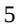
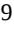

{0}------------------------------------------------

# **UNITED STATES SECURITIES AND EXCHANGE COMMISSION**

**WASHINGTON, DC 20549**

# **FORM 10-K**

**(Mark One)**

### ☒ **ANNUAL REPORT PURSUANT TO SECTION 13 OR 15(d) OF THE SECURITIES EXCHANGE ACT OF 1934**

**For the fiscal year ended December 31, 2022**

**or**

☐ **TRANSITION REPORT PURSUANT TO SECTION 13 OR 15(d) OF THE SECURITIES EXCHANGE ACT OF 1934**

**For the transition period from to** 

**COMMISSION FILE NO. 000-26224**

# **INTEGRA LIFESCIENCES HOLDINGS CORPORATION**

**(EXACT NAME OF REGISTRANT AS SPECIFIED IN ITS CHARTER)**

**Delaware 51-0317849 (STATE OR OTHER JURISDICTION OF INCORPORATION OR ORGANIZATION)**

**1100 Campus Road 08540**

**Princeton , New Jersey (ADDRESS OF PRINCIPAL EXECUTIVE OFFICES)**

**(I.R.S. EMPLOYER IDENTIFICATION NO.)**

**(ZIP CODE)**

**REGISTRANT'S TELEPHONE NUMBER, INCLUDING AREA CODE: (609) 275-0500**

**SECURITIES REGISTERED PURSUANT TO SECTION 12(b) OF THE ACT:**

**Title of Each Class Trading Symbol Name of Exchange on Which Registered**

Common Stock, Par Value \$.01 Per Share IART Nasdaq Global Select Market

#### **SECURITIES REGISTERED PURSUANT TO SECTION 12(g) OF THE ACT:**

**NONE**

Indicate by check mark if the registrant is a well-known seasoned issuer, as defined in Rule 405 of the Securities Act. Yes ☒ No ☐

Indicate by check mark if the registrant is not required to file reports pursuant to Section 13 or 15(d) of the Securities Exchange Act. Yes ☐

No ☒

Indicate by check mark whether the registrant: (1) has filed all reports required to be filed by Section 13 or 15(d) of the Securities Exchange Act of 1934 during the preceding 12 months (or for such shorter period that the registrant was required to file such reports), and (2) has been subject to such filing requirements for the past 90 days. Yes ☒ No ☐

Indicate by check mark whether the registrant has submitted electronically every Interactive Data File required to be submitted pursuant to Rule 405 of Regulation S-T (§232.405 of this chapter) during the preceding 12 months (or for such shorter period that the registrant was required to submit such files). Yes ☒ No ☐

{1}------------------------------------------------

Indicate by check mark whether the registrant is a large accelerated filer, an accelerated filer, a non-accelerated filer, a smaller reporting company, or an emerging growth company. See the definitions of "large accelerated filer," "accelerated filer," "smaller reporting company," and "emerging growth company" in Rule 12b-2 of the Exchange Act. (Check one):

| Large accelerated filer | ☒ | Accelerated filer         | ☐ |
|-------------------------|---|---------------------------|---|
| Non-accelerated filer   | ☐ | Smaller reporting company | ☐ |
| Emerging growth company | ☐ |                           |   |

If an emerging growth company, indicate by check if the registrant has elected not to use the extended transition period for complying with any new revised financial accounting standards provided pursuant to Section 13(a) of the Exchange Act. ☐

Indicate by check mark whether the registrant has filed a report on and attestation to its management's assessment of the effectiveness of its internal control over financial reporting under Section 404(b) of the Sarbanes-Oxley Act (15 U.S.C. 7262(b)) by the registered public accounting firm that prepared or issued its audit report. ☒

If securities are registered pursuant to Section 12(b) of the Act, indicate by check mark whether the financial statements of the registrant included in the filing reflect the correction of an error to previously issued financial statements. ☐

Indicate by check mark whether any of those error corrections are restatements that required a recovery analysis of incentive-based compensation received by any of the registrant's executive officers during the relevant recovery period pursuant to § 240.10D-1(b). ☐

Indicate by check mark whether the registrant is a shell company (as defined in Rule 12b-2 of the Exchange Act). Yes ☐ No ☒

As of June 30, 2022, the aggregate market value of the registrant's common stock held by non-affiliates was approximately \$3,916.0 million based upon the closing sales price of the registrant's common stock on The Nasdaq Global Select Market on such date. The number of shares of the registrant's Common Stock, \$0.01 par value, outstanding as of February 21, 2023 was 81,636,066.

#### **DOCUMENTS INCORPORATED BY REFERENCE:**

Certain portions of the registrant's definitive proxy statement relating to its scheduled May 12, 2023 Annual Meeting of Stockholders, which will be filed with the Securities and Exchange Commission, are incorporated by reference in Part III of this Annual Report on Form 10-K.

{2}------------------------------------------------

### **INTEGRA LIFESCIENCES HOLDINGS CORPORATION TABLE OF CONTENTS**

|                                                                                                                      | Page |
|----------------------------------------------------------------------------------------------------------------------|------|
| PART I                                                                                                               |      |
| Item 1. Business                                                                                                     | 4    |
| Item 1A. Risk Factors                                                                                                | 17   |
| Item 1B. Unresolved Staff Comments                                                                                   | 30   |
| Item 2. Properties                                                                                                   | 30   |
| Item 3. Legal Proceedings                                                                                            | 31   |
| Item 4. Mine Safety Disclosures                                                                                      | 31   |
| PART II                                                                                                              |      |
| Item 5. Market for Registrant's Common Equity, Related Stockholder Matters and Issuer Purchases of Equity Securities | 31   |
| Item 6. [Reserved]                                                                                                   | 32   |
| Item 7. Management's Discussion and Analysis of Financial Condition and Results of Operations                        | 32   |
| Item 7A. Quantitative and Qualitative Disclosures About Market Risk                                                  | 46   |
| Item 8. Financial Statements and Supplementary Data                                                                  | 48   |
| Item 9. Changes in and Disagreements with Accountants on Accounting and Financial Disclosures                        | 48   |
| Item 9A. Controls and Procedures                                                                                     | 49   |
| Item 9B. Other Information                                                                                           | 49   |
| Item 9C. Disclosure Regarding Foreign Jurisdictions that Prevent Inspections                                         | 49   |
| PART III                                                                                                             |      |
| Item 10. Directors, Executive Officers and Corporate Governance                                                      | 50   |
| Item 11. Executive Compensation                                                                                      | 50   |
| Item 12. Security Ownership of Certain Beneficial Owners and Management and Related Stockholder Matters              | 50   |
| Item 13. Certain Relationships, Related Transactions, and Director Independence                                      | 50   |
| Item 14. Principal Accountant Fees and Services                                                                      | 50   |
| PART IV                                                                                                              |      |
| Item 15. Exhibits and Financial Statements Schedule                                                                  | 50   |
| Item 16. Form 10-K Summary                                                                                           | 55   |
| SIGNATURES                                                                                                           | 56   |
|                                                                                                                      |      |
|                                                                                                                      |      |

{3}------------------------------------------------

#### **ITEM 1.** *BUSINESS*

#### **OVERVIEW**

The terms "we," "our," "us," "Company," "Integra LifeSciences," and "Integra" refer to Integra LifeSciences Holdings Corporation, a Delaware corporation, and its subsidiaries, unless the context suggests otherwise.

Integra LifeSciences is a global leader in regenerative tissue technologies and neurological solutions dedicated to limiting uncertainty for clinicians so they can focus on providing the best patient care. Founded in 1989 with the acquisition of an engineered collagen technology platform used to repair and regenerate tissue, Integra LifeSciences Holdings Corporation common stock trades on the Nasdaq Global Select Market ("Nasdaq") under the symbol "IART." Integra has developed numerous product lines from this technology for applications ranging from burn and deep tissue wounds to the repair of dura mater in the brain, as well as nerves and tendons. The Company has expanded its base regenerative technology business to include surgical instruments, neurosurgical products and advanced wound care through global acquisitions and product development to meet the evolving needs of its customers and enhance patient care.

Integra products are sold in more than 130 countries through a direct sales force as well as distributors and wholesalers. We manufacture and sell medical technologies and products in two reportable business segments: Codman Specialty Surgical ("CSS") and Tissue Technologies ("TT"). The CSS segment, which represents approximately two-thirds of our total revenue, consists of market-leading technologies and instrumentation used for a wide range of specialties, such as neurosurgery, neurocritical care and otolaryngology. We are the world leader in neurosurgery and one of the top three providers in instruments used in precision, specialty, and general surgical procedures. Our TT segment generates about one-third of our overall revenue and focuses on three main areas: complex wound surgery, surgical reconstruction, and peripheral nerve repair.

We have key manufacturing and research facilities located in California, Indiana, Maryland, Massachusetts, New Jersey, Ohio, Puerto Rico, Tennessee, Utah, France, Germany, Ireland and Switzerland. We source most of our handheld surgical instruments and dural sealant products through specialized third-party vendors.

#### **Vision**

We aspire to continue to be a worldwide leader in neurosurgery and reconstructive surgery with a portfolio of leading businesses that delivers outstanding customer experiences through innovation, execution and teamwork to positively impact the lives of millions of patients and their families.

#### **Strategy**

Integra is committed to delivering high quality products that positively impact the lives of millions of patients and their families. We focus on four key pillars of our strategy: 1) enabling an execution-focused culture, 2) optimizing relevant scale, 3) advancing innovation and agility, and 4) leading in customer experience. We believe that by sharpening our focus on these areas through improved planning and communication, optimization of our infrastructure, and strategically aligned acquisitions, we can build scale, increase competitiveness and achieve our long-term goals.

To this end, the executive leadership team has established the following key priorities aligned to the following areas of focus:

*Strategic Acquisitions*. An important part of the our strategy is pursuing strategic transactions and licensing agreements that increase relevant scale in the clinical areas in which Integra competes. Our growth strategy includes the acquisition of businesses, assets or products lines to increase the breadth of our offerings, the reach of our product portfolios and drive relevant scale to our customers. On December 6, 2022, the Company completed the acquisition of Surgical Innovation Associates, Inc. ("SIA"), which develops, markets and sells DuraSorb®, a resorbable synthetic matrix for plastic and reconstructive surgery. This acquisition will advance Integra's global strategy in breast reconstruction, expanding plans to access the U.S. market where SIA is pursuing premarket approval for use in implant-based breast reconstruction ("IBBR"). We also continued to expand our product offering of regenerative technologies from our 2021 acquisition of ACell, Inc. ("ACell"), an innovative regenerative medicine company specializing in the manufacturing of porcine urinary bladder extracellular matrices. See Note 4, *Acquisitions and Divestitures*, to the Notes to Consolidated Financial Statements (Part IV, Item 15 of this Annual Report on Form 10-K) for additional details.

*New Product Introductions and Portfolio Optimization.* We are investing in innovative product development to drive a multi-generational pipeline for our key

product franchises. Our product development efforts span across our key global franchises focused on potential technological innovations for significant returns on investment. In addition to new product development, we are funding studies to gather clinical evidence to support launches, ensure market access and improve reimbursement for existing products. In addition to acquisitions and organic reinvestment, we continually look to optimize our portfolio towards higher growth and higher margin businesses.

As such, we may opportunistically divest businesses or discontinue products where we see limited runway for future value creation in line with our aspirations due in part to changes in the market, business fundamentals or the regulatory environment.

{4}------------------------------------------------

In August 2022, we completed the sale of our non-core traditional wound care ("TWC") business to Gentell, LLC ("Gentall") for \$28.8 million, which consists of \$27.8 million in cash plus \$1.0 million in contingent consideration which may be received upon the achievement of certain revenue-based performance milestones. In January 2021, we completed the sale of our Extremity Orthopedics business to Smith & Nephew USD Limited ("Smith & Nephew"), a subsidiary of Smith & Nephew plc, for approximately\$240million in cash. Our portfolio optimization actions over the past two years have allowed us to increase our focus on Integra's core portfolio of market-leading products in neurosurgery, surgical instrumentation and regenerative tissue and moves us closer to achieving our long-term organic growth and profitability targets. See Note 4, Acquisitions and Divestitures, to the Notes to Consolidated Financial Statements (Part IV, Item 15 of this Annual Report on Form 10-K) for additional details.

*Commercial Channel Investments*. Investing in our sales channels is a core part of our strategy to create specialization and greater focus on reaching new and existing customers and addressing their needs. To support our commercial efforts in Tissue Technologies, we utilize a two-tier specialist model to increase our presence in focused segments to help serve the evolving needs of our customers. In addition, we continue to build upon our leadership brands across our product franchises in both CSS and TT to engage customers through enterprise-wide contracts with leading hospitals, integrated delivery networks and global purchasing organizations in the United States. Internationally, we have increased our commercial resources significantly in key emerging markets and are making investments to support our sales organization and maximize our commercial opportunities. Domestically, we have also increased our TT sales force in the United States to support the expanded regenerative tissue product portfolio that includes ACell products. These investments in our international and domestic sales channel position us well for expansion and long-term growth.

*Customer Experience*. We aspire to be ranked as a best-in-class provider and are committed to strengthening our relationships with all customers. We continue to invest in technologies, systems and processes to enhance the customer experience. In 2022, we outsourced certain transactional back-office finance and customer service activities to enhance customer quality, build scale for future growth, and capture cost efficiencies. We also launched digital tools and programs, resources and virtual product training to drive continued customer familiarity with our growing portfolio of medical technologies globally. .

#### **BUSINESS SEGMENTS**

Integra currently manufactures and sells our products and technologies in the following two global reportable business segments: Codman Specialty Surgical and Tissue Technologies. We include financial information regarding our reportable business segments and certain geographic information under "Item 7. Management's Discussion and Analysis of Financial Condition and Results of Operations" and Note 16, *Segment and Geographic Information* to the Notes to Consolidated Financial Statements (Part IV, Item 15 of this Annual Report on Form 10-K).

#### *Codman Specialty Surgical*

The Codman Specialty Surgical business consists of a broad portfolio of market-leading brands, such as Codman , DuraGen , DuraSeal , CUSA , Mayfield ,Bactiseal , and Certas Plus,which are used for the management of multiple disease states, including brain tumors, traumatic brain injury, hydrocephalus and other neurological conditions. The growth in this business in the recent years has been fueled by geographic expansion and new product registrations in markets, such as China, Japan, andEurope, which we expect to continue in the near-to-long term. ® ® ® ® ® ® ®

In 2022, we made progress to several enhancements to our CUSA Clarity Tissue Ablation System. The extended laparoscopic tip was launched in the U.S. to enhance laparoscopic liver procedures. In addition, a single-sided bone tip received 510(k) clearance. Commercial launch is expected in the first quarter of 2023. We continue to update our CUSA Clarity platform by incorporating new ultrasonic handpiece and integrated electrosurgical capabilities.

Moreover, we are expanding intominimally invasive surgery ("MIS") and the surgical management of intracerebral hemorrhages ("ICH"), with the 2021 clinical launch of Aurora Surgiscope , a proprietary surgical solution with integrated visualization and capabilities designed specifically for use indeepseatedbrain lesions. We continue to gather clinical evidence using this same technology for early surgical intervention of ICH. We believe this technology offers the promise of transforming the standard of care in neurosurgery. In 2022, we launched the Aurora Evacuator with Coagulation device in the U.S., designed to be used in conjunction with our Aurora Surgiscope to safely address and evacuate blood in the brain caused by hemorrhagic stroke. ® ® ®

Rounding out the portfolio is a catalog of surgical headlamps and surgical instrumentation, as well as after-market service. With thousands of surgical instrument products, including specialty surgical instruments, we call on the central sterile processing unit of hospitals and acute care surgical centers. Additionally, through a strong U.S. distribution model, we serve the needs of hundreds of medical offices.

We also expanded our product offerings in 2021 with the launch of our new intracranial pressure ("ICP") monitoring system, CereLink in the U.S. and Europe and continued the global rollout in the first half of 2022. See additional discussion regarding certain matters with CereLink under "Item 1A. Risk Factors" under the heading *Risks Related to our Regulatory Environment* ®

{5}------------------------------------------------

and under "Item 7. Management's Discussion and Analysis of Financial Condition and Results of Operations - General - FDA Matters" of this Annual Report on Form 10-K.

Our global commercial network includes clinical specialists, a large direct global sales force and strategic partnerships and distributors that serve hospitals, integrated health networks, group purchasing organizations, clinicians, surgery centers and health care providers.

#### *Tissue Technologies*

The Tissue Technologies segment consists of five unique regenerative technology areas - highly engineered bovine collagen, bovine dermis, porcine urinary bladder, human amniotic tissue, and resorbable synthetic mesh. This broad regenerative platform, which includes multiple leading brands such as Integra Dermal Matrices, AmnioExcel , SurgiMend , MicroMatrix and NeuraGen , primarily addresses the needs of plastic, reconstructive and general surgeons focused on the treatment of acute wounds, such as burns, chronic wounds, including diabetic foot ulcers, and surgical tissue repair, such as hernia, tendon, peripheral nerve repair and protection. During 2022, we completed the acquisition of Surgical Innovation Associates, Inc. ("SIA"), which is seeking approval by the U.S Food and Drug Administration ("FDA") of the PMA application for its core technology, DuraSorb, for use in IBBR. ® ® ® ® ®

We have a specialized sales organization composed of directly employed sales representatives, as well as specialty distributors, organized based upon their call point. Our wound reconstruction sales representatives call on surgeons doing procedures in limb salvage, trauma, wound reconstruction and burns, chronic wounds primarily in the inpatient wound care clinic setting. We also have a dedicated surgical reconstruction sales team focused on plastic and reconstructive surgery and hernia procedures with differentiated products. Finally, we have a distributor network focused on biologics. Outside the U.S., we have a combination of direct and indirect sales channels in international markets to sell certain product lines.

This business segment also includes private-label sales of a broad set of our regenerative and wound care technologies. Our customers are other medical technology companies that sell to end markets primarily in spine, surgical and wound care.

We anticipate new product introductions and new clinical indications will continue to contribute to the growth of the segment. In 2022, we launched NeuraGen 3D Nerve Guide Matrix, a resorbable implant for repair of peripheral nerve discontinuities and engineered to create an optimized environment for nerve regeneration. In the third quarter of 2021, we filed the PMA application for a specific indication for SurgiMend in the use of post-mastectomy breast reconstruction, for which we hope to obtain FDA approval in 2024. ®

#### **COMPETITION**

Our competitors for CSS are Medtronic, Inc., Stryker Corporation, Becton Dickinson and Company, and B. Braun Medical, Inc. In addition, we compete with many smaller specialized companies and larger companies that do not otherwise focus on the offerings of Codman Specialty Surgical technologies. We rely on the depth and breadth of our sales and marketing organization, our innovative technologies, and our procurement and manufacturing operations to maintain our competitive position.

Our competition for TT includes Smith & Nephew plc, Organogenesis Holdings Inc., MiMedx Group, Inc., Allergan PLC, Becton Dickinson and Company, and Axogen, Inc. We compete with many additional companies who partially participate in soft tissue reconstruction of complex wounds, peripheral nerve repair and surgical reconstruction. In addition, our products also compete against medical practices that treat a condition without using a medical device or any particular product, such as medical practices that utilize autograft tissue instead of our dermal regeneration products, duraplasty products and nerve repair products. Depending on the product line, we compete based on our products' features, strength of our sales force or distributors, sophistication of our technology and cost effectiveness of our solution.

#### **RESEARCH AND DEVELOPMENT STRATEGY**

Our research and development activities focus on identifying unmet surgical needs and addressing those needs with innovative solutions and products. We apply our core competency in regenerative technology to innovate products for neurosurgical, wound applications, plastic surgery, and reconstructive surgery and we have extensive R&D development programs for our core platforms of electromechanical technologies. Additionally, we conduct products and clinical studies to generate efficacy and health economic evidence.

*Regenerative Technologies*. Integra was the first company to receive a FDA claim for regeneration of dermal tissue and is a world leader in regenerative technology. Because regenerative technology products represent a fast-growing, high-margin opportunity for us, we allocate a large portion of our research and development budget to these projects. Our regenerative technology development program applies our expertise in bioengineering to a range of biomaterials including natural materials such as purified collagen, intact human or animal tissues, honey as well as resorbable synthetic polymers with our DuraSorb and DuraSeal product lines. These unique product designs are used for neurosurgical and reconstructive surgical applications, as well as dermal regeneration, including the healing of chronic and acute wounds, tendon and nerve repair. Our regenerative

{6}------------------------------------------------

technology platform includes our legacy Integra Dermal Regeneration Template ("IDRT") products and complementary technologies that we have acquired. Our collagen manufacturing capability, combined with our history of innovation, including our launch of NeuraGen 3D, provides us with strong platform technologies for multiple indications. ®

In 2020, we announced positive clinical and economic data on Integra Bilayer Wound Matrix ("IBWM") in complex lower extremity reconstruction based on two retrospective studies recently published in Plastic and Reconstructive Surgery, the official journal of the American Society of Plastic Surgeons. As surgeons look for ways to efficiently and effectively repair and close wounds, IBWM helps address the efficiency needed in operating rooms by reducing both the operating time and costs to hospitals and patients. In 2021, we completed one of the largest diabetic foot ulcers ("DFU"), randomized controlled trials of the PriMatrix Dermal Repair Scaffold for the management of DFU. This multi-center study enrolled more than 225 patients with chronic DFU's over the course of 12-week treatments and 4-week follow-up phases. The results of this study, which was published in the Journal of Wound Care, demonstrated that PriMatrix plus standard of care ("SOC") consisting of sharp debridement, infection elimination, use of dressings and offloading was significantly more likely to achieve complete wound closure compared with SOC alone, with a median number of one application of the product. Integra is currently pursuing premarket approval for implant-based breast reconstruction with our Surgimend product. In 2022, we acquired SIA, which is also pursuing a pre-market approval for IBBR. By offering two distinct product solutions, we believe we have the opportunity to build a leading position in the market. We completed design control activities in 2022 for a Q1 2023 launch of Cytal and MicroMatrix in Europe and a pilot launch of the Cardion Pericardial Patch to gain clinical experience for finding a private label partner for that product. ® ®

*Electromechanical Technologies and Instrumentation*. Because our electromechanical products and instruments address significant needs in surgical procedures and limit uncertainty for surgeons, we continue to invest in approvals for new indications and next generation improvements to our market-leading products. We have several active programs focused on life cycle management and innovation for capital and disposable products in our portfolio. Our product development efforts are focused on core clinical applications in cerebrospinal fluid ("CSF") management, neuro-critical care monitoring, minimally invasive instruments and electrosurgery and ultrasonic medical technologies, as well as our ambition to transform the standard of care in neurosurgery with product advancements in MIS and ICH. Our lighting franchise is among the most dynamic in the industry.

We are focused on the development of core clinical applications in our electromechanical technologies portfolio. In 2022, we made progress to several enhancements to our CUSA Clarity Tissue Ablation System. The extended laparoscopic tip was launched in the U.S. to enhance laparoscopic liver procedures. In addition, a single-sided bone tip received 510(k) approval. Commercial launch is expected in the first quarter of 2023. We continue to update our CUSA Clarity platform by incorporating new ultrasonic handpiece and integrated electrosurgical capabilities. We continue to work with several instrument partners to bring new surgical instrument platforms to the market.

We are focused on the development of core clinical applications in our electromechanical technologies portfolio. In June 2022, we launched the Neutus EVD system, our first external ventricular drain ("EVD") in China. The Neutus EVD system is manufactured in China by Shanghai Haoju Medical Technology Co., Ltd. under an exclusive distribution arrangement. The device is used in the management of cerebrospinal fluid and is highly complementary to our Bactiseal catheter and advanced intercranial pressure monitoring products. ® ®

In the third quarter of 2021, we launched our CereLink ICP Monitor System in the U.S. and Europe and continued the global rollout in the first half of 2022. On August 18, 2022, the Company, after consultation with the FDA and other regulatory authorities outside of the United States, initiated an immediate voluntary global product removal of all CereLink intracranial pressure monitors. See Item 1A. Risk Factors, under the heading *Risks Related to our Regulatory Environment* and under Item 7. General Management's Discussion and Analysis of Financial Condition and Results of Operations - FDA Matters of this Annual Report on Form 10-K for further discussion. ®

In 2022, we continued to advance the early-stage technology platforms we acquired in 2019. Through the acquisition of Arkis Biosciences, Inc. ("Arkis") we added a platform technology, CerebroFlo external ventricular drainage ("EVD"), catheter with Endexo technology, a permanent additive designed to reduce the potential for catheter obstruction due to thrombus formation. The CerebroFlo EVD Catheter has demonstrated an average of 99% less thrombus accumulation onto its surface, in vitro, compared to a market leading EVD catheter. Our work to combine our bactiseal antimicrobial technology with the Endexo anti-occlusive technology obtained through our 2019 acquisition of Arkis continues to progress for both a silicone-based hydrocephalus and EVD project. ® ®

In 2019, we also acquired Rebound Therapeutics Corporation ("Rebound Therapeutics"), a company that specialized in single-use medical device, known as Aurora Surgiscope, which is the only tubular retractor system designed for cranial surgery with an integrated access channel, camera and lighting. In the third quarter of 2021, we conducted a limited clinical launch of the Aurora Surgiscope for use in minimally invasive neurosurgery as well as initiated a registry called MIRROR to collect data on early surgical intervention using this same technology platform for the treatment of ICH. In 2022, we launched the Aurora ®

{7}------------------------------------------------

Evacuator with Coagulation device in the U.S., designed to be used in conjunction with our Aurora Surgiscope to safely address and evacuate blood in the brain caused by hemorrhagic stroke.

### **RESOURCES**

In general, raw materials essential to our businesses are readily available from multiple sources. For reasons of quality assurance, availability, or cost effectiveness, certain components and raw materials are available only from a sole supplier. Our practice is to maintain sufficient inventory of components so that our production will not be significantly disrupted even if a particular component or material is not available for a period of time.

Certain of our products, including but not limited to our dermal regeneration products, duraplasty products, wound care products, and nerve and tendon repair products, contain material derived from bovine tissue. We take great care to provide products that are safe and free of agents that can cause disease. In particular, the collagen used in the products that we manufacture is derived from the deep flexor tendon of cattle less than 24 months old from New Zealand, a country that has never had a reported case of bovine spongiform encephalopathy ("BSE") (otherwise known as mad cow disease), from the U.S. or from fetal bovine dermis. The World Health Organization classifies different types of cattle tissue for relative risk of BSE transmission. Deep flexor tendon and fetal bovine skin are in the lowest-risk category for BSE transmission, and therefore considered to have a negligible risk of containing the agent that causes BSE.

### **INTELLECTUAL PROPERTY**

We seek patent and trademark protection for our key technology, products and product improvements, both in the U.S. and in selected foreign countries. When determined appropriate, we have enforced and plan to continue to enforce and defend our patent and trademark rights. In general, however, we do not rely solely on our patent and trademark estate to provide us with any significant competitive advantages as it relates to our existing product lines. We also rely upon trade secrets and continuing technological innovations to develop and maintain our competitive position. In an effort to protect our trade secrets, we have a policy requiring our employees, consultants and advisors to execute proprietary information and invention assignment agreements upon commencement of employment or consulting relationships with us. These agreements also provide that all confidential information developed or made known to the individual during the course of their relationship with us must be kept confidential, except in specified circumstances.

AccuDrain , AmnioExcel , Aquasonic , Auragen , Aurora Surgiscope , Bactiseal , BioDFence , BioDOptix , Brainet , Budde , Buzz™, CereLink , CerebroFlo EVD Catheter with Endexo Technology, Codman , Codman Accu-Flo , Codman Bicol , Codman Certas Plus, Codman Hakim Programmable valve, Codman Holter , Codman ICP Express , Codman Microsensor , Codman VersaTru , Codman VPV , Contour-Flex , Cranioplastic CRW CRW Precision™, Ctherm™, CUSA , Cytal , DirectLink , DuraGen , DuraSeal , DuraSorb Gentrix , HeliCote , HeliPlug , HeliTape HeliMend , Helistat , Helitene , Hermetic™, Hy-Tape , Integra , IntegraLink Isocool , Jarit , Lead-Lok™, Licox , LimiTorr™, Luxtec Mayfield , MatriStem UBM™, MediHone , MicroFrance , MicroMatrix Miltex , Mischler™, MoniTorr ICP™, Natus , NeuraGen , NeuraWrap™, Nicolet , Omnigraft , Omni-Tract , OSV II , Padgett , PriMatrix , Pureflow™, Q-Snor™, Redmond™, Revize™, Ruggles , Signacreme , SurgiMend , TCC-EZ , TenoGlide , TissueMend , Ultra VS™, VersaTru , Xtrasorb zRIP™, and the Integra logo are some of the material trademarks of Integra LifeSciences Corporation and its subsidiaries. MAYFIELD is a registered trademark of SM USA, Inc., and is used by Integra under license. ® ® ® ® ® ® ® ® ® ® ® ® ® ® ® ® ® ® ® ® ® ® ® ® ® ® ® ®, ®, ® ® ® ® ® ®, ® ® ® ®, ® ® ® ® ® ®, ® ® ® ®, ® y® ® ®, ® ® ® ® ® ® ® ® ® ® ® ® ® ® ® ® ®, ®

#### **SEASONALITY**

Revenues during our fourth quarter tend to be stronger than other quarters because many hospitals increase their purchases of our products during the fourth quarter to coincide with the end of their budget cycles in the U.S. In general, our first quarter usually has lower revenues than the preceding fourth quarter, the second and third quarters have higher revenues than the first quarter, and the fourth quarter revenues are the highest in the year. The main exceptions to this pattern occur because of material acquisitions as well as impacts of the COVID-19 pandemic.

#### **GOVERNMENT REGULATION AND COMPLIANCE**

We are a manufacturer and marketer of medical devices and Human Tissue and Cell Based Products ("HCT/Ps") and therefore are subject to extensive regulation by the FDA, the Center for Medicare Services of the U.S. Department of Health and Human Services, other federal governmental agencies and, in some jurisdictions, by state and foreign governmental authorities. These regulations govern the introduction of new medical devices and HCT/Ps, the observance of certain standards with respect to the design, manufacture, testing, labeling, promotion and sales of the products, the maintenance of certain records, the ability to track devices, the reporting of potential product defects, the import and export of products, and other matters.

{8}------------------------------------------------

#### *United States Food and Drug Administration*

Our products are subject to extensive regulation particularly as to safety, efficacy and adherence to FDA Quality System Regulation, and related manufacturing standards. Medical device products are subject to rigorous FDA and other governmental agency regulations in the United States and similar regulations of foreign agencies abroad. The FDA regulates the design, development, research, preclinical and clinical testing, introduction, manufacture, advertising, labeling, packaging, marketing, distribution, import and export, and record keeping for such products, in order to ensure that medical products distributed in the United States are safe and effective for their intended use. In addition, the FDA is authorized to establish special controls to provide reasonable assurance of the safety and effectiveness of most devices. Non-compliance with applicable requirements can result in import detentions, fines, civil and administrative penalties, injunctions, suspensions or losses of regulatory approvals, recall or seizure of products, operating restrictions, refusal of the government to approve product export applications or allow us to enter into supply contracts, and criminal prosecution. The regulatory process for obtaining product approvals and clearances can be onerous and costly. The FDA requires, as a condition to marketing a medical device in the U.S., that we secure a Premarket Notification clearance pursuant to Section 510(k) of the Federal Food, Drug and Cosmetic Act (the "FD&C Act"), or an approved PMA application (or supplemental PMA application). Obtaining these approvals and clearances can take up to several years and may involve preclinical studies and clinical trials. The FDA also may require a post-approval clinical study as a condition of approval. To perform clinical trials for significant risk devices in the U.S. on an unapproved product, we are required to obtain an Investigational Device Exemption from the FDA. The FDA also may require a filing for approval prior to marketing products that are modifications of existing products or new indications for existing products. Moreover, after clearance/approval is given, if the product is shown to be hazardous or defective, the FDA and foreign regulatory agencies have the power to withdraw the clearance or approval, as the case may be, or require us to change the device, its manufacturing process or its labeling, to supply additional proof of its safety and effectiveness or to recall, repair, replace or refund the cost of the medical device. Because we currently export medical devices manufactured in the U.S. that have not been approved by the FDA for distribution in the U.S., we are required to obtain approval/registration in the country to which we are exporting and maintain certain records relating to exports and make these available to the FDA for inspection, if required.

#### *Human Cells, Tissues and Cellular and Tissue-Based Products*

Integra, through its wholly-owned subsidiary BioD LLC ("BioD"), is involved with the recovery, processing, storage, transportation and distribution of donated amniotic tissue. The FDA has specific regulations governing HCT/Ps. An HCT/P is a product containing, or consisting of, human cells or tissue intended for transplantation into a human patient. Examples of HCT/Ps include bone, ligament, skin and cornea.

Some HCT/Ps fall within the definition of a biological product, medical device or drug regulated under the FD&C Act. These biologic, device or drug HCT/Ps must comply both with the requirements exclusively applicable to HCT/Ps and, in addition, with requirements applicable to biologics, devices or drugs, including premarket clearance or approval from the FDA.

Section 361 of the Public Health Service Act ("Section 361") authorizes the FDA to issue regulations to prevent the introduction, transmission or spread of communicable disease. HCT/Ps regulated as "361" HCT/Ps are subject to requirements relating to registering facilities and listing products with the FDA, screening and testing for tissue donor eligibility, and Good Tissue Practices when processing, storing, labeling, and distributing HCT/Ps, including required labeling information, stringent record keeping, and adverse event reporting.

The American Association of Tissue Banks ("AATB") has issued operating standards for tissue banking. Compliance with these standards is a requirement in order to become an AATB-accredited tissue establishment. In addition, some states have their own tissue banking regulations. We are licensed or have permits for tissue banking in California, Delaware, Illinois, Maryland, New York, Oregon, and Tennessee. In Tennessee, we are registered with the FDA Center for Biological Evaluations and Research.

Procurement of certain human organs and tissue for transplantation is subject to the restrictions of the National Organ Transplant Act, which prohibits the transfer of certain human organs, including skin and related tissue for valuable consideration, but permits the reasonable payment associated with the removal, transportation, implantation, processing, preservation, quality control and storage of human tissue and skin. BioD is a registered Tissue Bank and is involved with the recovery, storage and transportation of donated human amniotic tissue.

On June 22, 2015, the FDA issued an Untitled Letter (the "Untitled Letter") alleging that BioD's morselized amniotic membrane tissue-based products do not meet the criteria for regulation as HCT/Ps solely under Section 361 and that, as a result, BioD would need a biologics license to lawfully market those morselized products. Since the issuance of the Untitled Letter, BioD and the Company has made known to the FDA their disagreement with the FDA's assertion that certain products are more than minimally manipulated. The FDA has not changed its position that certain of the BioD acquired products are not eligible for marketing solely under Section 361. In July 2020, the FDA issued the final guidance document related to human tissue titled, "Regulatory Considerations for Human Cells, Tissues, and Cellular and Tissue-Based Products: Minimal Manipulation and Homologous Use" (the "2020 HCT/P Final Guidance"). The 2020 HCT/P Final Guidance document supersedes the November 2017 guidance by the same title.

{9}------------------------------------------------

The HCT/P Final Guidance maintains the FDA's position that products such as the Company's morselized amniotic membrane tissue-based products do not meet the criteria for regulation solely as HCT/Ps. In addition, in the November 2017 guidance, the FDA articulated a risk-based approach to enforcement and, while some uses for amniotic membrane tissue-based products would have as much as thirty-six months of enforcement discretion, other high risk uses could be subject to immediate enforcement action. The 2020 HCT/P Final Guidance maintained this approach and extended the discretionary enforcement period to May 31, 2021.

Considering the risk of enforcement action, the Company discontinued the manufacturing of all morselized amniotic membrane tissue-based products prior to May 31, 2021. We no longer distribute these products. As of December 31, 2022, the Company has not received any further notice of enforcement action from the FDA regarding its morselized amniotic membrane tissue-based products.

### *Medical Device Regulations*

Unless an exemption applies, the FDA requires that a manufacturer introducing a new medical device or a new indication for use of an existing medical device obtain either a Section 510(k) premarket notification clearance or a PMA, before introducing it into the U.S. market. The type of marketing authorization is generally linked to the classification of the device. The FDA classifies medical devices into one of three classes (Class I, II or III) based on the degree of risk the FDA determines to be associated with a device and the level of regulatory control deemed necessary to ensure the device's safety and effectiveness.

The process of obtaining a Section 510(k) clearance generally requires the submission of performance data and often clinical data, which in some cases can be extensive, to demonstrate that the device is "substantially equivalent" to a device that was on the market before 1976 or to a device that has been found by the FDA to be "substantially equivalent" to such a pre-1976 device, a predecessor device is referred to as "predicate device." As a result, FDA clearance requirements may extend the development process for a considerable length of time. In addition, in some cases, the FDA may require additional review by an advisory panel, which can further lengthen the process. The PMA process, which is reserved for new devices that are not substantially equivalent to any predicate device and for high-risk devices or those that are used to support or sustain human life, may take several years and requires the submission of extensive performance and clinical information.

Medical devices can be marketed only for the indications for which they are cleared or approved. After a device has received 510(k) clearance for a specific intended use, any change or modification that significantly affects its safety or effectiveness, such as a significant change in the design, materials, method of manufacture or intended use, may require a new 510(k) clearance or PMA approval and payment of an FDA user fee. The determination as to whether or not a modification could significantly affect the device's safety or effectiveness is initially left to the manufacturer using available FDA guidance; however, the FDA may review this determination to evaluate the regulatory status of the modified product at any time and may require the manufacturer to cease marketing and recall the modified device until 510(k) clearance or PMA approval is obtained. The manufacturer may also be subject to significant regulatory fines or penalties.

We also are required to register with the FDA as a medical device manufacturer and any devices we manufacture and distribute pursuant to clearance or approval by the FDA are subject to pervasive and continuing regulation by the FDA and certain state agencies. These include product listing and establishment registration requirements, which help facilitate FDA inspections and other regulatory actions, and our manufacturing sites are subject to periodic inspection by the FDA for compliance with the FDA's Quality System Regulations. These regulations require that we manufacture our products and maintain our documents in a prescribed manner with respect to design, manufacturing, testing and control activities. Further, we are required to comply with various FDA requirements and other legal requirements for labeling and promotion. If the FDA believes that a company is not in compliance with applicable regulations, it may issue a warning letter, institute proceedings to detain or seize products, issue a recall order, impose operating restrictions, enjoin future violations and assess civil penalties against that company, its officers or its employees and may recommend criminal prosecution to the U.S. Department of Justice. All Integra manufacturing facilities participate in the Medical Device Single Audit Program and are audited annually for compliance with the Quality System for US FDA, Canada, Australia, Brazil, and Japan.

Medical device regulations also are in effect in many of the countries in which we do business outside the U.S. In the European Economic Area ("EEA"), which is comprised of the 27 member states of the European Union plus Norway, Iceland and Liechtenstein, medical devices need to comply with specific requirements. These requirements were previously known as "Essential Requirements" under the former EU Medical Devices Directive (Council Directive 93/42/EEC, or MDD) and are now defined "General Safety and Performance Requirements (GSPR)" under the new EU Medical Devices Regulation (Regulation (EU) 2017/745, or "EU MDR"). Although the requirements set forth in the EU MDR are generally consistent with those laid out in the MDD (with a few exceptions), the EU MDR is intended, among other things, to establish a uniform, transparent, predictable and sustainable regulatory framework across the EEA for medical devices and ensure a high level of safety and health while supporting innovation. These laws range from comprehensive medical device approval and Quality System requirements for some or all of our medical device products to simpler requests for product data or certifications. Under the European Union Medical Device Directive, medical devices must meet the Medical Device Directive standards and receive

{10}------------------------------------------------

CE Mark Certification prior to marketing in the EEA. Although we continue to transition our certification profile to meet the new EU MDR requirements, these stricter regulations set forth in the EU MDR may pose additional challenges for Integra to continue marketing products in the EU as these regulations come into force. See "Item 1A. Risk Factors - *We are subject to stringent domestic and foreig*n medical device regulations and oversight and any adverse action may adversely affect our ability to compete in the marketplace and our financial condition and business operations" of this Annual Report on Form 10- K.

CE Mark Certification requires a comprehensive quality system program, technical documentation, clinical evaluation and data on the product which are then reviewed, by a Notified Body. A Notified Body is an organization designated by the national governments of the EU member states to make independent judgments about whether a product complies with the requirements established by each CE marking directive. The Medical Device Directive, Medical Device Regulation, ISO 9000 series and ISO 13485 are recognized international quality standards that are designed to ensure that we develop and manufacture quality medical devices. Other countries are also instituting regulations regarding medical devices or interpreting and enforcing existing regulations more strictly. Compliance with these regulations requires extensive documentation and clinical reports for our products, revisions to labeling, and other requirements such as facility inspections to comply with the registration requirements. A recognized Notified Body audits our facilities annually to verify our compliance with the ISO 13485 Quality System standard.

Certain countries, as well as the EU, have issued regulations that govern products that contain materials derived from animal sources. Regulatory authorities are particularly concerned with materials infected with the agent that causes BSE. These regulations affect our dermal regeneration products, duraplasty products, hernia repair products, biomaterial products for the spine, nerve and tendon repair products and certain other products, all of which contain material derived from bovine tissue. Although we take great care to provide that our products are safe and free of agents that can cause disease, products that contain materials derived from animals, including our products, may become subject to additional regulation, or even be banned in certain countries, because of concern over the potential for prion transmission. Significant new regulations, a ban of our products, or a movement away from bovine-derived products because of an outbreak of BSE could have a material, adverse effect on our current business or our ability to expand our business. See "Item 1A. Risk Factors – *Risks Related to our Regulatory Environment*" of this Annual Report on Form 10-K.

*Postmarket Requirements.* After a device is cleared or approved for commercial distribution, numerous regulatory requirements apply. These include the FDA Quality System Regulations which cover the procedures and documentation of the design, testing, production, control, quality assurance, labeling, packaging, sterilization, storage and shipping of medical devices; the FDA's general prohibition against promoting products for unapproved or 'off-label' uses; the Medical Device Reporting regulation, which requires that manufacturers report to the FDA if their device may have caused or contributed to a death or serious injury or malfunctioned in a way that would likely cause or contribute to a death or serious injury if it were to recur; and the Reports of Corrections and Removals regulation, which require manufacturers to report recalls and field corrective actions to the FDA if initiated to reduce a risk to health posed by the device or to remedy a violation of the FD&C Act. Postmarket requirements are also followed globally where our products are registered and approved. These foreign jurisdictions have similar requirements to the FDA which include reporting requirements such as adverse events and recalls.

### *Other regulations*

*Anti-Bribery Laws*. In the U.S., we are subject to laws and regulations pertaining to healthcare fraud and abuse, including anti-kickback laws and physician self-referral laws that regulate the means by which companies in the health care industry may market their products to hospitals and health care professionals and may compete by discounting the prices of their products. Similar anti-bribery laws exist in many of the countries in which we sell our products outside the U.S., as well as the United States Foreign Corrupt Practices Act (which addresses the activities of U.S. companies in foreign markets). Our products also are subject to regulation regarding reimbursement, and U.S. healthcare laws apply when a customer submits a claim for a product that is reimbursed under a federally funded healthcare program. These global laws require that we exercise care in designing our sales and marketing practices, including interactions with healthcare professionals, and customer discount arrangements. See "Item 1A. Risk Factors – *We are exposed to a variety of risks relating to our international sales and operations*" of this Annual Report on Form 10-K for further details.

*Import-export*. Our international operations subject us to laws regarding sanctioned countries, entities and persons, customs, and import-export. Among other things, these laws restrict, and in some cases can prevent, U.S. companies from directly or indirectly selling goods, technology or services to people or entities in certain countries. In addition, these laws require that we exercise care in our business dealings with entities in and from foreign countries.

*Hazardous materials*. Our research, development and manufacturing processes involve the controlled use of certain hazardous materials. We are subject to country-specific, federal, state and local laws and regulations governing the use, manufacture, storage, handling and disposal of these materials and certain waste products. We believe that our environmental, health and safety procedures for handling and disposing of these materials comply with the standards prescribed by the controlling laws and regulations. However, risk of accidental releases or injury from these materials is possible. These risks are managed to minimize or eliminate associated business impacts. In the event of this type of accident, we could be held liable for damages

{11}------------------------------------------------

and face a liability that could exceed our resources. We could be subject to a regulatory shutdown of a facility that could prevent the distribution and sale of products manufactured there for a significant period of time, and we could suffer a casualty loss that could require a shutdown of the facility in order to repair it, any of which could have a material, adverse effect on our business. Although we continuously strive to maintain full compliance with respect to all applicable global environmental, health and safety laws and regulations, we could incur substantial costs to fully comply with future laws and regulations, and our operations, business or assets may be negatively affected. Furthermore, global environmental, health and safety compliance is an ongoing process. Integra has compliance procedures in place for compliance with Employee Health & Safety laws, driven by a centrally led organizational structure that ensures proper implementation, which is essential to our overall business objectives.

In addition to the above regulations, we are, and may be, subject to regulation under country-specific federal and state laws, including, but not limited to, requirements regarding record keeping, and the maintenance of personal information, including personal health information. As a public Company, we are subject to the securities laws and regulations, including the Sarbanes-Oxley Act of 2002. We also are subject to other present and could be subject to possible future, local, state, federal and foreign regulations.

*Third-Party Reimbursement.* Healthcare providers that purchase medical devices generally rely on third-party payors, including, in the U.S., the Medicare and Medicaid programs and private payors, such as indemnity insurers, employer group health insurance programs and managed care plans, to reimburse all or part of the cost of the products. As a result, demand for our products is and will continue to be dependent in part on the coverage and reimbursement policies of these payors. The manner in which reimbursement is sought and obtained varies based upon the type of payor involved and the setting in which the product is furnished and utilized. Reimbursement from Medicare, Medicaid and other third-party payors may be subject to periodic adjustments as a result of legislative, regulatory and policy changes, as well as budgetary pressures. Possible reductions in, or eliminations of, coverage or reimbursement by third-party payors, or denial of, or provision of uneconomical reimbursement for new products may affect our customers' revenue and ability to purchase our products. Any changes in the healthcare regulatory, payment or enforcement landscape relative to our customers' healthcare services have the potential to significantly affect our operations and revenue.

*Data Privacy and Cybersecurity Laws and Regulations*. As a business with a significant global footprint, compliance with evolving regulations and standards in data privacy and cybersecurity (relating to the confidentiality and security of our information technology systems, products such as medical devices, and other services provided by us) may result in increased costs, lower revenue, new complexities in compliance, new challenges for competition, and the threat of increased regulatory enforcement activity. Our business relies on the secure electronic transmission, storage and hosting of sensitive information, including personal information, financial information, intellectual property, and other sensitive information related to our customers and workforce.

For example, in the U.S., the collection, maintenance, protection, use, transmission, disclosure and disposal of certain personal information and the security of medical devices are regulated at the U.S. federal and state, and industry levels. U.S. federal and state laws protect the confidentiality of certain patient health information, including patient medical records, and restrict the use and disclosure of patient health information by health care providers. For example, in the U.S. we are obligated to comply with the requirements of the Health Insurance and Portability Act of 1996, as amended by the Health Information Technology for Economic and Clinical Health Act of 2009 (collectively, "HIPPA"). Under HIPAA, the Department of Health and Human Services has issued regulations, including the HIPAA Privacy, Security and Breach Notification Rules, to protect the privacy and security of protected health information used or disclosed by covered entities including health care providers and their business associates, as well as covered subcontractors. HIPAA also regulates standardization of data content, codes and formats used in health care transactions and standardization of identifiers for health plans and providers. Penalties for violations of HIPAA regulations include significant civil and criminal penalties for each violation. In addition, the FDA has issued guidance advising manufacturers to take cybersecurity risks into account in product design for connected medical devices and systems, to assure that appropriate safeguards are in place to reduce the risk of unauthorized access or modification to medical devices that contain software and reduce the risk of introducing threats into hospital systems that are connected to such devices. The FDA also issued guidance on post market management of cyber security in medical devices.

Outside the U.S., we are impacted by the privacy and data security requirements at the international, national and regional level, and on an industry specific basis. Legal requirements in these countries relating to the collection, storage, handling and transfer of personal data and, potentially, intellectual property continue to evolve with increasingly strict enforcement regimes. In Europe, for example, we are subject to EU General Data Protection Regulation ("GDPR") which requires member states to impose minimum restrictions on the collection, use and transfer of personal data and includes, among other things, a requirement for prompt notice of data breaches to data subjects and supervisory authorities in certain circumstances and significant fines for non-compliance. The GDPR also requires companies processing personal data of individuals residing in the EU to comply with EU privacy and data protection rules.

{12}------------------------------------------------

Please refer to "Item 1A. Risk Factors – *We are subject to requirements relating to information technology which could adversely affect our business"* of this Annual Report on Form 10-K for additional discussion of the risks accompanying compliance with data privacy and cybersecurity laws and regulations*.*

These laws and regulations impact the ways in which we use and manage personal data, protected health information, and our information technology systems. They also impact our ability to move, store, and access data across geographic boundaries. Compliance with these requirements may require changes in business practices, complicate our operations, and add complexity and additional management and oversight needs. They also may complicate our clinical research activities, as well as product offerings that involve transmission or use of clinical data.

### **HUMAN CAPITAL**

#### **Workforce Demographics**

As ofDecember 31, 2022, we had approximately 3,722 regular full and part time employees and 874 contingent, subcontracted, and outsourced partners.

70% of our employees are located in the United States, 21% in Europe, 2% in Latin America and Canada and 7% in Asia Pacific which includes Australia and New Zealand.

#### **Diversity and Inclusion**

A diverse workforce and an inclusive culture and work environment is a business priority and a key to our long-term success. Our commitment to diversity and inclusion starts at the top with our Board of Directors and CEO. At all levels of the Company, we focus on attracting, retaining, and developing our diverse talent.

#### Leadership Commitment and Accountability

Executive leadership set diversity and inclusion goals for the Company on an annual basis. Advancing diversity and inclusion initiatives to build stronger teams has been a company-wide goal and the direct engagement of executive leadership in advancing diversity and inclusion initiatives helps to promote awareness throughout the Company.

#### Leadership Councils, Employee Resource Groups and External Partnerships

We are accountable to our diversity commitment through our leadership councils, employee resource groups, and external partnerships.

- The Women's Leadership Council, established in 2017 and chaired by our President & Chief Executive Officer, Jan De Witte, is a results-oriented advisory group comprised of ten of our senior women leaders across Integra. The

{13}------------------------------------------------

specific charter of the Council is to work together to identify ways to continue to attract and retain female talent, advance the development of our women into leadership roles, increase the cultural awareness of the value of inclusion and diversity in our Company, and create specific development forums for our high performing women at Integra.

- Employee Resources Groups encourage a culture of awareness and inclusion, assist in the attraction and retention of diverse talent, and help colleagues develop leadership skills. Members of the Executive Leadership Team serve as sponsors for each of Integra's employee resource groups. Integra currently has six Employee Resources Groups:
	- Women of Integra Networks (WIN) with 20+ chapters globally
	- African American Affinity Group
	- Veteran Employee Resource Group
	- Indian American Network
	- Asian American and Pacific Islander Network
	- Integra PRIDE (LGBTQ+ Employee Resource Group)
- We reinforce our commitment to diversity by partnering with other organizations focused on driving inclusion in the workplace including the CEO Action for Diversity & Inclusion, the largest CEO-driven business commitment to advance diversity and inclusion in the work place and Healthcare Businesswomen's Association, an association dedicated to further the advancement and impact of women in the business of healthcare.

#### Promoting an inclusive culture through learning opportunities

To help drive our culture of inclusion, our colleagues participate in programs focused on how to manage bias, value differences, and develop inclusive leadership skills.

- Members of our executive leadership, senior management team, and larger scope leaders participated in a ½ day Microinequities training. The content includes understanding unconscious bias and microinequities, how to identify microinequities in day-to-day decisions and actions as leaders, and ways to mitigate microinequities on an individual and organizational level.
- In 2020, we launched two foundational programs to promote diversity and inclusion: Introduction to Managing Unconscious Bias, a course that creates awareness of unconscious biases in the workplaces and tools to build-bias breaking skills and Practicing Inclusion which examines what practicing inclusion in the workplace looks like. These trainings are now mandatory for all new Integra hires.
- We regularly provide educational content and resources to aid our colleagues as they build cultural competency and inclusive leadership skills

#### Gender Diversity

We believe that our company is stronger and will deliver strong operating results, when we build diverse teams and leverage broad perspectives to meet the needs of our shareholders, customers, colleagues, and communities we serve.

#### The breakout of our colleagues by gender:

48% of Integra's overall population is female, 52% male. We continue to strive to ensure our diversity in our leadership ranks is representative of our overall population. Through mentorship, sponsorship, recruitment efforts, and development programs we look to continue to grow our population of females in leadership roles at Integra. Currently, 38% of our executive leaders and 43% of senior leaders (non-executive vice presidents) are female.

{14}------------------------------------------------

In partnership with Leadership Edge, a company founded by women leaders and dedicated to growing and mentoring women. Integra sponsors the Excel Women's Leadership Program. The program is designed to accelerate the development and advancement of high potential, mid-career female leaders into senior leadership roles. The program has assisted in further building our pipeline of women leaders with 60% of the program's graduates being promoted into roles with increased responsibility.

#### **Compensation and Benefits**

Our compensation philosophy is designed to reinforce and align with our mission, business strategy, and financial needs. We invest in the physical, emotional and financial well-being of our employees through our robust compensation and benefit programs. We provide market-competitive compensation and benefits based on benchmarking surveys we conduct regularly for all position levels against relevant peer companies. Our annual and long-term incentive packages are linked directly to business and individual performance, with a balance of short- and long-term financial and strategic objectives. We have an employee stock purchase plan. Eligibility for non-salary benefits such as salary continuance, life insurance, health insurance, and similar benefits, follows local regulations and practices.

Integra is a pay-for-performance company committed to fair pay. All compensation decisions are made without regard to personal characteristics such as, but not limited to, gender, race, color, national or ethnic origin, age, disability, sexual orientation, gender identity or expression, genetic information, religion, or veteran status. As part of our commitment to compensation equity, Integra regularly conducts a pay equity analysis, reviewing how our organization compensates employees against external and internal data in conjunction with the role and scope of each position and making adjustments if necessary.

#### **Talent Development and Retention**

We have comprehensive and effective human capital development programs in place because we believe that the personal success of our employees is critical to the overall success of our business. To build a diverse and talented organization, we have invested in honing our recruiting and hiring processes to attract top talent and engage new hires from the very beginning of their experience at Integra.

We offer a variety of opportunities for our employees to learn and grow. Continued learning and development is a critical component of employee job satisfaction, retention, and career advancement—and ultimately, a driver of business success. We encourage and promote experiential, collaborative, and formal learning programs. Employees are also encouraged to discuss with their managers the skills, training, and experience needed to grow and develop. In addition to several skills-based trainings

{15}------------------------------------------------

available (technical, sales, leadership ability) to all employees, managers may recommend external job-specific development programs to employees. These programs are paid for directly by Integra.

### **Employee Health and Safety:**

Integra is committed to providing a safe environment for all employees and visitors. We rely on our environmental, health and safety management systems as well as entrusting our managers to oversee and ensure health and safety at their respective sites and foster a workplace culture to achieve that end. We implement our approach globally by our systems and support at regional and country levels from colleagues that implement proper safety protocols, identify and correct hazards, and remain safety conscious at all times. Managers are expected to enforce health and safety regulations, including compliance with applicable federal, state and local laws. Our Environmental Health and Safety ("EH&S") organizational structure incorporates both workplace EH&S coordinators and compliance teams. We have developed an Incident Procedure Policy and General Safety Rules that guide our colleagues to improve our workplace environment, improve safety, and reduce risk and costs.

Throughout the COVID-19 pandemic, we have placed a high priority on employee health, providing resources to support our workforce. At the outset of the pandemic, we sought to protect the health and safety of our employees unable to work remotely, including those in research and development, quality, manufacturing, distribution and sales roles. Such measures included the institution of robust hygiene practices, distribution of personal protective equipment, and the adoption of increased sanitation and social distancing protocols. We continue to actively monitor the COVID-19 pandemic and its variants and respond based on guidance from U.S. and global health organizations, relevant governmental guidance, and evolving practices.

### **Employee Engagement & Wellbeing**

We regularly seek employee feedback and sentiment about our workplace through global engagement surveys conducted on a bi-annual basis. After each survey is complete, we share detailed results with senior management and all employees within each department. Each function or division appoints survey administrators who work with their respective teams to understand the feedback and establish action items. We believe this process enables us to monitor employee engagement and create a continuously improving, satisfying work environment for our employees.

We are committed to improving the quality of life of our employees and their families. Our health and wellbeing programs differ by country and typical benefits include comprehensive health insurance, disability coverage, workplace accommodations, parental leave and other leaves of absence based on health or life events (e.g., bereavement), employee assistance programs, fitness reimbursement, and flu shots. We also provide on-demand health advocates to help employees navigate the health insurance system, access to digital health solutions, a weight management program, smoking cessation assistance, a substance use disorder helpline, a diabetes health program and other similar programs to drive healthy behaviors and awareness.

### **FINANCIAL INFORMATION ABOUT GEOGRAPHIC AREAS**

Financial information about our geographical areas is set forth in our financial statements Note 16, *Segment and Geographic Information*, to the Notes to Consolidated Financial Statements (Part IV, Item 15 of this Annual Report on Form 10-K).

#### **AVAILABLE INFORMATION**

We are subject to the informational requirements of the Securities Exchange Act of 1934, as amended, (the "Exchange Act"). In accordance with the Exchange Act, we file annual, quarterly and special reports, proxy statements and other information with the Securities and Exchange Commission, ("the SEC"). Our financial information may be viewed, including the information contained in this report, and other reports we file with the SEC, on the Internet, without charge as soon as reasonably practicable after we file them with the SEC, in the "SEC Filings" page of the Investor Relations section of our website at www.integralife.com. A copy may also be obtained for any of these reports, without charge, from our Investor Relations department, 1100 Campus Road, Princeton, NJ 08540. Alternatively, reports filed may be viewed or obtained through the SEC's website at www.sec.gov.

#### **SPECIAL NOTE REGARDING FORWARD-LOOKING STATEMENTS**

We have made statements in this report, including statements under "Business" and "Management's Discussion and Analysis of Financial Condition and Results of Operations" that constitute forward-looking statements within the meaning of Section 27A of the Securities Act of 1933, as amended, ("the Securities Act"), and Section 21E of the Exchange Act. These forward-looking statements are subject to a number of risks, uncertainties and assumptions about us including, among other things:

- the on-going and possible future effects of the COVID-19 pandemic and associated economic disruptions, including supply chain constraints and inflation, on our business, financial condition, results of operations and cash flows;
- general economic and business conditions, both nationally and in our international markets, including the effect of the continuing worldwide macroeconomic uncertainty;

{16}------------------------------------------------

- our expectations and estimates concerning future financial performance, financing plans and the impact of competition;
- anticipated trends in our business;
- anticipated demand for our products, particularly capital equipment;
- our ability to produce and deliver products in sufficient quantities to meet sales demands;
- our expectations concerning our ongoing restructuring, integration and manufacturing transfer and expansion activities;
- existing and future regulations affecting our business, and enforcement of those regulations;
- our failure to comply with the substantial regulation related to quality standards applicable to our manufacturing and quality processes could have an adverse effect on our business, financial condition, or results of operations;
- our ability to obtain additional debt and equity financing to fund capital expenditures, working capital requirements and acquisitions;
- physicians' willingness to adopt our recently launched and planned products, third-party payors' willingness to provide or continue reimbursement for any of our products and our ability to secure regulatory approval for products in development;
- initiatives launched by our competitors;
- our ability to protect our intellectual property, including trade secrets;
- our ability to complete acquisitions, integrate operations post-acquisition and maintain relationships with customers of acquired entities;
- our ability to remediate all matters identified in FDA observations and warning letters that we received or may receive; and
- other risk factors described in Item 1A. "Risk Factors" in this Annual Report on Form 10-K.

Forward-looking statements can be identified by forward-looking words such as "believe," "may," "could," "might," "will," "estimate," "continue," "anticipate," "intend," "seek," "plan," "expect," "should," "would" and similar expressions in this report. We undertake no obligation to publicly update or revise any forward-looking statements, whether as a result of new information, future events or otherwise. In light of these risks and uncertainties, the forward-looking events and circumstances discussed in this report may not occur and actual results could differ materially from those anticipated or implied in the forward-looking statements.

### **ITEM 1A.** *RISK FACTORS*

### **GLOBAL CHALLENGES AND MACROECONOMIC CONDITIONS**

#### *The continuing worldwide macroeconomic and geopolitical uncertainty may adversely affect our business and prospects.*

Global economic disruptions, including the COVID-19 pandemic, have continued to impact the global supply chain, primarily through constraints on raw materials and electronic components. Additionally, we have observed a reduction in both inbound and outbound transportation capacity as a result of port closures and delays associated with the pandemic, which is causing longer lead times in receiving raw materials, as well as increased freight costs. These highly competitive and constrained supply chain conditions are increasing our cost of sales, which has and may continue to adversely impact our profitability. Given the ongoing uncertainty regarding the duration and extent of the COVID-19 pandemic, we are uncertain as to the duration and extent of constraint on our supply chain and are unable to predict the extent to which it will affect our global operations.

Continued concerns about the systemic impact of potential long-term and wide-spread recession and geopolitical issues, including the war in Ukraine, have contributed to increased market volatility and diminished expectations for economic growth in the world. Our business and results of operations have been and may continue to be adversely impacted by changes in macroeconomic conditions, including inflation, rising interest rates and the accessibility of capital markets. Uncertainty about global economic conditions may also cause decreased demand for our products and services and increased competition, which could result in lower sales volume and downward pressure on the prices for our products, longer sales cycles, and slower adoption of new technologies. A weakening of macroeconomic conditions may also adversely affect our suppliers, which could result in interruptions in supply.

Market acceptance of our medical products in the U.S. and other countries is dependent upon the medical equipment purchasing and procurement practices of our customers, patient need for our products and procedures and the reimbursement of patients' medical expenses by government healthcare programs and third-party payors. The continuing uncertainty surrounding global economic conditions and financial markets may cause the purchasers of medical equipment to decrease their procurement activities. Economic uncertainty, an increase in unemployment rates, as well as increasing health insurance premiums, copayments and deductibles may adversely affect demand for our products and procedures. Furthermore, governments and other third-party payors around the world facing tightening budgets could move to further reduce the reimbursement rates or the scope of coverage offered, which could adversely affect sales of our products.

*Public health crises, such as the COVID-19 pandemic, have had, and could in the future have, a negative effect on our business.*

{17}------------------------------------------------

Our global operations and interactions with healthcare systems, providers and patients around the world expose us to risks associated with public health crises, including epidemics and pandemics such as COVID-19. In particular, the COVID-19 pandemic continues to cause significant volatility and uncertainty in the global and regional economies, leading to changes in consumer and business behavior, market fluctuations, materials and product shortages and restrictions on business and individual activities, all of which are materially impacting supply and demand in broad sectors of the world markets. Additionally, the COVID-19 pandemic, together with general macroeconomic conditions, have led to disruptions in the global supply chain, primarily through a lack of availability of raw materials and electronic components. We have experienced challenges associated with material and component availability for certain product lines, longer shipping and delivery times for raw materials and components, constrained logistics capacity related to the movement of our products, availability of skilled labor and increased costs of raw materials, components, labor, and freight and courier services. Regional COVID-19 case volumes (including those related to subsequent variants), actions taken by governmental authorities, private businesses and individuals, such as "shelter-in-place" orders and restrictions on travel and access to our customers or temporary closures of our facilities or the facilities of our suppliers, disruption and/or higher costs to the Company's supply chain, staffing shortages in hospitals and labor constraints in our facilities, could further impact our gross margins and our ability to ship our products and supply our customers.

The emergence of new variants, vaccinations and public health measures are driving the pace of economic recovery unevenly in various regions. The direct and indirect disruptions caused by the pandemic and the responses of both governments and individuals could negatively impact the number of surgical and medical intervention procedures performed and have a material adverse effect on our business, financial condition, results of operations, or cash flows. The extent to which fear of exposure to or actual effects of COVID-19, new variants, disease outbreak, epidemic or a similar widespread health concern impacts our business will depend on future developments, which are highly uncertain and cannot be predicted with confidence, such as the speed and extent of geographic spread of the disease, the duration of the outbreak, travel restrictions, the efficacy of vaccination and treatment; impact on the U.S. and international healthcare systems, the U.S. economy and worldwide economy; the timing, scope and effectiveness of U.S. and international governmental response; and the impact on the health, well-being and productivity of our employees.

### **RISKS RELATING TO OUR BUSINESS**

### *Our operating results may fluctuate.*

Our operating results, including components of operating results such as gross margin and operating expenses, may fluctuate from time to time, and such fluctuations could affect our stock price. Our operating results have fluctuated in the past and can be expected to do so from time to time in the future. Some of the factors that may cause these fluctuations include:

- economic conditions worldwide, which could affect the ability of hospitals and other customers to purchase our products and could result in a reduction in elective and non-reimbursed operative procedures;
- the impact of acquisitions, our ability to integrate acquisitions, and our restructuring activities including portfolio rationalization, and divestitures;
- risks related to COVID-19 and other epidemics or similar widespread health concerns;
- expenditures for major initiatives, including acquired businesses and integrations thereof and restructuring;
- the timing of significant customer orders, which tend to increase in the fourth quarter coinciding with the end of budget cycles;
- increased competition for a wide range of customers across all our product lines in the markets our products are sold;
- market acceptance of our existing products, as well as products in development;
- retention of current employees and recruiting of new employees in light of market competition for talent and relevant skills;
- the timing of regulatory approvals as well as changes in country-specific regulatory requirements;
- changes in the exchange rates between the U.S. dollar and foreign currencies of countries in which we do business;
- changes in the variable interest rates of our debt instruments which could impact debt service requirements;
- potential backorders, lost sales and expenses incurred in connection with product recalls or field corrective actions;
- disruption of our operations and sales resulting from extreme weather conditions or natural disasters that damage our manufacturing, distribution, or infrastructure of those facilities, or the suppliers and service providers for those facilities;
- our ability to manufacture and ship our products efficiently or in sufficient quantities to meet sales demands;
- changes in the cost or decreases in the supply of raw materials and services, including sterilization, energy, steel and honey;
- the timing of our research and development expenditures;
- reimbursement for our products by third-party payors such as Medicare, Medicaid, private and public health insurers and foreign governmental health systems;
- the ability to maintain existing distribution rights to and from certain third parties;
- the ability to maintain business if or when we opt to convert such business from distributors to a direct sales model;
- the ability of our commercial sales representatives to obtain sales targets in a reasonable time frame;

{18}------------------------------------------------

- the impact of changes to our sales organization, continued channel expansion, including increased specialization;
- peer-reviewed publications discussing the clinical effectiveness of the products we sell;
- inspections of our manufacturing facilities for compliance with Quality System Regulations (Good Manufacturing Practices), which could result in Form 483 observations, warning letters, injunctions or other adverse findings from the FDA or from equivalent regulatory bodies, and corrective actions, procedural changes and other actions that we determine are necessary or appropriate to address the results of those inspections, any of which may affect production and our ability to supply our customers with our products;
- changes in regulations or guidelines that impact the sales and marketing practices for products that we sell;
- the increased regulatory scrutiny of certain of our products, including products which we manufacture for others, could result in removal from the market or involve field corrective actions that could affect the marketability of our products;
- enforcement or defense of intellectual property rights;
- changes in tax laws, or their interpretations; and
- the impact of goodwill and intangible asset impairment charges if future operating results of the acquired businesses are significantly less than the results anticipated at the time of the acquisitions.

#### *The industry and market segments in which we operate are highly competitive, and we may be unable to compete effectively with other companies.*

There is intense competition among medical device companies. We compete with established medical technology companies in many of our product areas. Competition also comes from early-stage companies, universities, research institutions and other non-profit entities. In certain cases, our products compete primarily against medical practices that treat a condition without using a device or any particular product, such as the medical practices that use autograft tissue instead of our dermal regeneration products, duraplasty products and nerve repair products, or that use other technologies that cost less than our products. Many of our competitors have access to greater financial, technical, research and development, marketing, manufacturing, sales, distribution, administrative, consulting and other resources than we do. Our competitors may be more effective at developing commercial products or navigating the regulatory approval process in the markets in which we operate. They may be able to gain market share by offering lower-cost products or products that enjoy better reimbursement from third-party payors and foreign governmental health systems.

Our competitive position depends on our ability to achieve market acceptance for our products, develop new products, implement marketing plans, secure regulatory approval for products under development, demonstrate clinical and economic effectiveness, obtain and maintain reimbursement coverage and funding under third-party payors and foreign governmental health systems, obtain patent protection and produce products consistently in sufficient quantities to meet demand. We may need to develop new applications for our products to remain competitive. Technological advances by one or more of our current or future competitors or their achievement of superior reimbursement from third-party payors and foreign governmental health systems could render our present or future products obsolete or uneconomical. Our future success will depend upon our ability to compete effectively against current technology as well as to respond effectively to technological advances, changes in customers' requirements or in payor or regulatory evidence requirements. Additionally, purchasing decisions of our customers may be based on clinical evidence or comparative effectiveness studies and, because of our vast array of products, we might not be able to fund the studies necessary to gain entry or maintain our position or provide the required information to compete effectively. Other companies may have more resources available to fund such studies. For example, competitors have launched and are developing products to compete with our dural repair products, regenerative skin, neuro critical care monitors and ultrasonic tissue ablation devices, among others. In the current environment of managed care, consolidation among health care providers, increased competition, and declining reimbursement rates, we have been increasingly required to compete on the basis of price. Competitive pressures could adversely affect our profitability. Given these factors, we cannot guarantee that we will be able to compete effectively or continue our level of success in the areas in which we compete.

#### *Changes in the healthcare industry may require us to decrease the selling price for our products, may reduce the size of the market for our products, or may eliminate a market, any of which could have a negative impact on our financial performance.*

Trends toward managed care, healthcare cost containment and other changes in government and private sector initiatives in the U.S. and other countries in which we do business are placing increased emphasis on the delivery of more cost-effective medical therapies that could adversely affect the sale and/or the prices of our products. For example:

- third-party payors of hospital services and hospital outpatient services, including Medicare, Medicaid, private and public health insurers and foreign governmental health systems, annually revise their payment methodologies, which can result in stricter standards for reimbursement of hospital charges for certain medical procedures or the elimination of reimbursement;
- several foreign countries have implemented reforms of their respective healthcare sectors in an effort to reduce healthcare spending, including restricting funding to only those medical technologies and procedures with proven effectiveness, increasing patient co-payments and providing for payback measures. Governmental health systems have revised and continue to consider revisions of healthcare budgets, which could result in stricter standards for implementing certain medical procedures, increased scrutiny of medical devices, and downward pricing pressure;

{19}------------------------------------------------

- Medicare, Medicaid, private and public health insurer and foreign governmental cutbacks could create downward pricing pressure on our products;
- in the U.S., Medicare and Medicaid coverage as well as commercial payor coverage determinations could reduce or eliminate reimbursement or coverage for certain of our wound matrix, amniotic, surgical reconstruction and advanced wound dressing products as well as other products in most regions, negatively affecting our market for these products, and future determinations could reduce or eliminate reimbursement or coverage for these products in other regions and could reduce or eliminate reimbursement or coverage for other products;
- there has been a consolidation among healthcare facilities and purchasers of medical devices in the U.S., some of whom prefer to limit the number of suppliers from whom they purchase medical products, and these entities may decide to stop purchasing our products or demand discounts on our prices;
- in the U.S., we are party to contracts with group purchasing organizations, which negotiate pricing for many member hospitals, require us to discount our prices for certain of our products and limit our ability to raise prices for certain of our products, particularly surgical instruments;
- there is economic pressure to contain healthcare costs in domestic and international markets, and, regardless of the consolidation discussed above, providers generally are exploring ways to cut costs by eliminating purchases or driving reductions in the prices that they pay for medical devices, or increasing clinical or economic evidence thresholds for product formularies;
- there are proposed and existing laws, regulations and industry policies in domestic and international markets regulating the sales and marketing practices and the pricing and profitability of companies in the healthcare industry;
- proposed laws or regulations may permit hospitals to provide financial incentives to doctors for reducing hospital costs, will award physician efficiency, and will encourage partnerships with healthcare service and goods providers to reduce prices; and
- there have been initiatives by third-party payors and foreign governmental health systems to challenge the prices charged for medical products that could affect our ability to sell products on a competitive basis.

Any and all of the above factors could materially and adversely affect our levels of revenue and our profitability.

#### *Our current strategy involves growth through acquisitions, which requires us to incur substantial costs and potential liabilities for which we may never realize the anticipated benefits, and also requires us to successfully integrate acquired businesses into our business operations in order to avoid our business being materially and adversely affected.*

In addition to internally generated growth, our current strategy involves growth through acquisitions. Between January 1, 2020 and December 31, 2022, we have acquired two businesses at a total cost of approximately \$358.4 million which amount includes our acquisition of ACell, Inc. in January 2021 for \$306.9 million and our acquisition of Surgical Innovation Associates, Inc. for \$51.5 million in December 2022. Both of these acquisitions added products to our complex wound management and plastic and reconstructive surgery product portfolios, respectively, and provides additional growth opportunities for our TT segment.

We may be unable to continue to implement our growth strategy and it may ultimately be unsuccessful. A significant portion of our growth in revenues has resulted from, and is expected to continue to result from, the acquisition of businesses or products complementary to our own. We engage in evaluations of potential acquisitions and are in various stages of discussion regarding possible acquisitions, certain of which, if consummated, could be significant to us. Any new acquisition could result in material transaction expenses, increased operating, amortization and interest expenses, and possible in-process research and development charges for acquisitions that do not meet the definition of a "business," any of which could have a material, adverse effect on our operating results. Certain businesses that we acquire may not have adequate financial, disclosure, regulatory, quality or other compliance controls at the time we acquire them and could require significant expenditures to address those controls or subject us to increased risk. As we grow by acquisition, we must manage and integrate the new businesses to bring them into our systems for financial, disclosure, compliance, regulatory and quality control, realize economies of scale, and control costs. Failure to integrate acquired businesses and operations (including acquired employees and systems), retain key customers and suppliers of any acquired business or manage the cost of providing our products or price our products appropriately could preclude realization of the full benefits that we expect from there transactions. Our failure to meet the challenges involved in integrating the business in order to realize the anticipated benefits of the acquisitions could cause an interruption of, or loss of momentum in, our activities and could materially and adversely affect our results of operations. In addition, acquisitions involve other risks, including diversion of management resources otherwise available for the running of our business and the development of our business as well as risks associated with entering markets in which our marketing teams and sales force has limited experience or where experienced distribution alliances are not available. Some acquisitions may include the need for ongoing product development to occur consistent with time sensitive milestones in order for the Company to achieve its commercial projections for the acquisition. Our future profitability will depend in part upon our ability to develop our resources to adapt to these new products or business areas and to identify and enter into or maintain satisfactory distribution networks. As a result of our acquisitions of other healthcare businesses, we may be subject to the risk of unanticipated business uncertainties, regulatory and other compliance matters or legal liabilities relating to those acquired businesses for which the sellers of the acquired businesses may not indemnify us, for which we may not be able to obtain insurance (or adequate insurance), or for which the indemnification may not be sufficient to cover the ultimate liabilities. We

{20}------------------------------------------------

may not be able to identify suitable acquisition candidates in the future, obtain acceptable financing or consummate any future acquisitions. Certain potential acquisitions are subject to antitrust and competition laws, which laws could impact our ability to pursue strategic acquisitions and could result in mandated divestitures. If we are unsuccessful in our acquisition strategy, we may be unable to meet our financial targets and our financial performance could be materially and adversely affected.

These risks may be heightened in cases where the majority of the former businesses' operations, employees and customers are located outside the U.S. Any one or all of these factors could increase operating costs or lower anticipated financial performance. Many of these factors are also outside of our control. In addition, dispositions of certain key products, technologies and other rights, including pursuant to conditions imposed on us to obtain regulatory approvals, may affect our business operations.

Even if the operations of the businesses are integrated successfully, we may not realize the full benefits of the acquisition, including the synergies, cost savings or sales or growth opportunities that we expect. These benefits may not be achieved within the anticipated time frame, or at all. Additional unanticipated costs could be incurred in the integration of the businesses. All of these factors could cause a reduction to our earnings per share, decrease or delay the expected accretive effect of the transaction, and negatively impact the price of our common stock.

#### *Our future financial results could be adversely affected by impairments or other charges.*

We are required to test both goodwill and indefinite-lived intangible assets for impairment on an annual basis based upon a fair value approach, rather than amortizing them over time. We are also required to test goodwill and indefinite-lived intangible assets for impairment between annual tests if an event occurs such as a significant decline in revenues or cash flows for certain products, or the discount rates used in the calculations of discounted cash flows change significantly, or circumstances change that would more likely than not reduce our enterprise fair value below its book value. If such a decline, rate change or circumstance were to materialize, we may record an impairment of these intangible assets that could be material to the financial statements. See "Management's Discussion and Analysis of Financial Condition and Results of Operations - Critical Accounting Estimates" of this report.

The guidance on long-lived assets requires that we assess the impairment of our long-lived assets, including finite-lived intangible assets, whenever events or changes in circumstances indicate that the carrying value may not be recoverable as measured by the sum of the expected future undiscounted cash flows.

Also, Company decisions and other economic factors relating to our trade names may occur over time. For instance, we may discontinue certain products in the future as we continue to assess the profitability of our product lines. As a result, we may need to record impairment charges or accelerate amortization on certain trade names or technology-related intangible assets in the future.

The value of a medical device business is often volatile, and the assumptions underlying our estimates made in connection with our assessments under the guidance may change as a result of that volatility or other factors outside our control and may result in impairment charges. The amount of any such impairment charges could be significant and have a material, adverse effect on our reported financial results for the period in which the charge is taken and could have an adverse effect on the market price of our securities, including the notes and the common stock into which they may be converted.

#### *Lack of market acceptance for our products or market preference for technologies that compete with our products could reduce our revenues and profitability.*

Market acceptance of our products depends on many factors, including our ability to convince prospective customers that our technology is an attractive alternative to other technologies, to manufacture products in sufficient quantities and at acceptable costs, and to supply and service sufficient quantities of our products directly or through our distribution alliances. For example, the use of autograft tissue is a well-established means for repairing the dermis, and it competes for acceptance in the market with our collagen-based wound care products. In addition, unfavorable payment amounts or adverse coverage determinations of third-party payors, including Medicare, Medicaid, private and public health insurers, and foreign governmental health systems, regarding our products or third-party determinations that favor a competitor's product over ours, could harm acceptance or continued use of our products. For example, greater market acceptance of our wound graft products may ultimately depend on our ability to demonstrate that coverage and reimbursement are available and favorable, or because they are an attractive, cost-effective alternative to other treatment options.

If there are negative events in the healthcare industry, whether real or perceived, there could be a negative impact on the industry as a whole. The industry is subject to rapid and continuous change arising from, among other things, consolidation, technological improvements, the pressure on governments, third-party payors and providers to reduce healthcare costs, and healthcare reform legislation and initiatives domestically and internationally. In addition, our future success depends, in part, on our ability to license and develop additional products. Even if we determine that a product candidate has medical benefits, the cost of commercializing, either through internal development or payments associated with licensing arrangements, could be too high to justify development and we could ultimately face competitors with more effective products and better reimbursement status that cost less and are ready for commercial introduction before our products. If we are unable to develop additional commercially viable products, our future prospects could be materially and adversely affected.

{21}------------------------------------------------

One or more of these factors could vary unpredictably, and such variations could have a material, adverse effect on our competitive position. We may not be able to adjust our contemplated plan of development to meet changing market demands.

#### *It could be difficult to replace some of our suppliers.*

Outside vendors, some of whom are sole-source suppliers, provide key components and raw materials used in the manufacture of our products. Although we believe that alternative sources for many of these components and raw materials are available, any interruption in supply of a limited or sole-source component or raw material could harm our ability to manufacture our products until a new or alternative source of supply is identified and qualified. In addition, an uncorrected defect or supplier's variation in a component or raw material, either unknown to us or incompatible with our manufacturing process, could harm our ability to manufacture products. We may not be able to find a sufficient alternative supplier in a reasonable time period, or on commercially reasonable terms, if at all, and our ability to produce and supply our products could be impaired. We believe that these factors are most likely to affect the following products that we sell:

- our collagen-based products and bovine-based products, such as the Integra Dermal Regeneration Template and wound matrix products, the DuraGen family of products, our Absorbable Collagen Sponges, PriMatrix and SurgiMend products; ® ®
- our products made from silicone, such as our neurosurgical shunts and drainage systems and hemodynamic shunts;
- products which use many different specialty parts, electrical components, or chemicals from numerous suppliers, such as our intracranial monitors, shunts, catheters, tissue ablation, and headlights;
- our biosynthetic products, including the DuraSeal sealant system and DuraSorb biosynthetic mesh scaffold;
- products which are amniotic tissue-based
- products which are porcine tissue-based;
- products that use medical grade leptospermum honey, such as our Medihoney products; and
- our TCC-EZ total contact cast system products. ®

The availability of amniotic tissue-based products depends upon, among other factors, the availability of tissue from human donors. Access to donated amniotic tissue could also be adversely impacted by regulatory changes or evolving public perceptions of the donor process.

Additionally, many of our products require sterilization by third-party suppliers. To the extent these suppliers are unable to provide sterilization services, whether due to lack of capacity, regulatory requirements, environmental concerns such as those relating to ethylene oxide or otherwise, we may be unable to transition sterilization to other suppliers in a timely or cost effective manner, or at all, which could have an adverse impact on our operating results.

Our supply chain and our cost of goods also may be negatively impacted by unanticipated price increases due to factors such as global economic disruptions, electronic component shortages, fear of future or ongoing pandemics, inflation, including wage inflation, recessionary conditions and geopolitical events, including the war in Ukraine, all of which are beyond our control or the control of our suppliers.

While it is our policy to maintain sufficient inventory of components so that our production will not be significantly disrupted even if a particular component or material is not available for a period of time, we remain at risk that we will not be able to qualify new components or materials quickly enough to prevent a disruption if one or more of our suppliers ceases production of important components or materials.

#### *We may experience difficulties, delays, performance impact or unexpected costs from consolidation of facilities and transfer of manufacturing facilities.*

In recent years, we consolidated several facilities or transferred manufacturing operations from third parties to our existing internal manufacturing facilities and may further undertake similar consolidations or transfers in the future in order to improve our cost structure, achieve increased operating efficiencies, and improve our competitive standing or results of operations and/or to address unfavorable economic conditions. As part of these initiatives, we may also lose favorable tax incentives or not be able to renew leases on acceptable terms. We may further reduce staff, make changes to certain capital projects, close certain production operations and abandon leases for certain facilities that will not be used in our operations. In conjunction with any actions, we will continue to make significant investments and build the framework for our future growth. We may not realize, in full or in part, the anticipated benefits and savings from these efforts because of unforeseen difficulties, delays, implementation issues or unexpected costs. If we are unable to achieve or maintain all of the resulting savings or benefits to our business or other unforeseen events occur, our business and results of operations may be adversely affected.

#### *We may have significant product liability exposure and our insurance may not cover all potential claims.*

We are exposed to product liability and other claims if our technologies or products are alleged to have caused harm. We may not be able to obtain insurance for the potential liability on acceptable terms with adequate coverage or at reasonable costs. Any potential product liability claims could exceed the amount of our insurance coverage or may be excluded from coverage under the terms of the policy. Our insurance may not be renewed at a cost and level of coverage comparable to that then in effect.

{22}------------------------------------------------

#### *Economic and political instability around the world could adversely affect the ability of hospitals, other customers, suppliers and distributors to access funds or otherwise have available liquidity, which could reduce orders for our products or interrupt our production or distribution or result in a reduction in elective and non-reimbursed operative procedures.*

Economic and political instability around the world could adversely affect the ability of hospitals and other customers to access funds to enable them to fund their operating and capital budgets. As a result, hospitals and other customers could reduce budgets or put all or part of their budgets on hold or close their operations, which could have a negative effect on our sales, particularly the sales of capital equipment such as our ultrasonic surgical aspirators, neuromonitors and cranial stabilization products, or result in a reduction in elective and non-reimbursed procedures. The occurrence of those economic conditions could make it more difficult for us to accurately forecast and plan our future business activities and depending on their severity, could have a material, adverse effect on our business, financial condition and results of operations.

#### *Our private-label product lines depend significantly on key relationships with third parties, which we could be unable to establish and maintain.*

Our private-label business depends in part on entering into and maintaining long-term supply agreements with third parties. The third parties with whom we have entered into agreements might terminate these agreements for a variety of reasons, including developing other sources for the products that we supply. Termination of our most important relationships could adversely affect our expectations for the growth of private-label products.

#### **RISKS RELATED TO OUR REGULATORY ENVIRONMENT**

#### *The adoption of healthcare reform in the U.S. and initiatives sponsored by other governments may adversely affect our business, results of operations and/or financial condition.*

Our operations may be substantially affected by potential fundamental changes in the global political, economic and regulatory landscape of the healthcare industry. Government and private sector initiatives to limit the growth of healthcare costs are continuing in the U.S., and in many other countries in which we do business, causing the marketplace to put increased emphasis on the delivery of more cost-effective treatments. These initiatives include price regulation, competitive pricing, coverage and payment policies, comparative effectiveness of therapies, technology assessments and managed-care arrangements. The adoption of some or all of these initiatives could have a material, adverse effect on our financial condition and results of operations.

In the United States, the Patient Protection and Affordable Care Act (the "ACA"), signed into law in March 2010, includes several provisions that impact our businesses in the U.S. The ACA includes provisions that, among other things, reduce and/or limit Medicare reimbursement, require all individuals to have health insurance (with limited exceptions), and require detailed disclosure of transfers of value made to healthcare professionals. Other legislative changes have been proposed and adopted since the Affordable Care Act was enacted, including The Budget Control Act of 2011, The American Taxpayer Relief Act of 2012 and Medicare Access and CHIP Reauthorization Act of 2015, which, among other things, have reduced payments under Medicare and Medicaid to certain healthcare providers or altered the formula by which Medicare makes annual payment adjustments. Congress also drafts and introduces, from time to time, legislation that could significantly change the statutory provisions governing the regulation of medical devices. In addition, the FDA may change its clearance and approval policies, adopt additional regulations or revise existing regulations, or take other actions, which may prevent or delay approval or clearance of our future products under development or impact our ability to modify our currently cleared products on a timely basis. For example, over the last several years, the FDA has proposed reforms to its 510(k) clearance process, and such proposals could include increased requirements for clinical data and a longer review period, or could make it more difficult for manufacturers to utilize the 510(k) clearance process for their products.

We cannot predict what impact ongoing uncertainty regarding federal and state health reform proposals, including the implementation or repeal of the ACA, judicial review and interpretation of the ACA and other healthcare laws, instability of the insurance markets, changes in the U.S. administration and policy, an expansion in government's role in and/or additional proposals and/or changes to the U.S. health care system or its legislation will have on our customer's purchasing decisions and/or reimbursement which could have a material adverse effect on our business. We expect that additional state and federal health care reform measures will be adopted in the future, including those initiatives affecting coverage and reimbursement for our products, any of which could limit the amounts that federal and state governments will pay for health care products and services, which could adversely affect the growth of the market for our products or demand for our products, or result in additional pricing pressures. We cannot predict the ultimate content, timing or effect of any healthcare reform legislation or the impact of potential legislation on us. We continue to monitor the implementation of such legislation and, to the extent new market or industry trends or new governmental programs evolve, we will consider implementing or implement programs in response.

#### *We are subject to stringent domestic and foreign medical device regulations and oversight and any adverse action may adversely affect our ability to compete in the marketplace and our financial condition and business operations.*

Our products, development activities and manufacturing processes are subject to extensive and rigorous regulation by numerous government agencies, including the FDA and comparable foreign agencies, as discussed in "Part 1, Item 1. Business –

{23}------------------------------------------------

Government Regulation." To varying degrees, each of these agencies monitors and enforces our compliance with laws and regulations governing the development, testing, manufacturing, labeling, marketing and distribution of our medical devices. We are also subject to regulations that may apply to certain of our products that are Drug/Device Combination products or are considered to be subject to pharmaceutical regulations outside the U.S. The process of obtaining marketing approval or clearance from the FDA and comparable foreign regulatory agencies for new products, or for enhancements or modifications to existing products could be costly, time consuming and burdensome, lead to failed clinical trials or weakened clinical evidence, involve modifications, repairs or replacements of our products and result in limitations on the indicated use of our products, which may negatively impact our ability to market our products and services, result in delays or prevent full commercial realization of future products or service. Furthermore, failure to obtain timely approvals or renewals may result in significant penalties and fines. Additional regulations govern the approval, initiation, conduct, monitoring, documentation and reporting of clinical studies to regulatory agencies in the countries or regions in which they are conducted. Failure to comply, could subject us to significant enforcement actions and sanctions, including halting the study, rejection of data generated in the study, seizure of investigational devices or data, sanctions against investigators, civil or criminal penalties, and other actions. In addition, without the data from one or more clinical studies, it may not be possible for us to secure the data necessary to support certain regulatory submissions, to secure reimbursement or demonstrate other requirements. We cannot assure that access to clinical investigators, sites and subjects, documentation and data will be available on the terms and timeframes necessary.

We are subject to extensive complex regulatory requirements by domestic and foreign government agencies and any failure to comply with our ongoing responsibilities under their applicable laws and regulations could result in a material adverse impact on our business. Failure to comply with applicable regulations could result in future product recalls, injunctions preventing the shipment of products or other enforcement actions that could have a material adverse effect on our business.

We also are subject to the European Medical Device Regulation, which was adopted by the European Union ("EU") as a common legal framework for all EU member states. The implementation for Class I products occurred on May 26, 2021 and the EUDAMED Database was implemented on May 26, 2022. Under this regulation, companies that wish to manufacture and distribute medical devices in EU member states must meet certain quality system, and safety requirements as well as ongoing product monitoring responsibilities. Companies must also obtain a "CE" marking (i.e., a mandatory conformity marking for certain products sold within the European Economic Area) for their products. Complying with the requirements of these regulations may require us to incur significant expenditures. Expenditures for European Union Medical Device Regulation compliance activities amounted to \$45.1 million for the year ended December 31, 2022 and we anticipate incurring additional expenditures in connection with our on-going efforts to obtain certification for our products under the European Medical Device Regulation. Various penalties exist for non-compliance with the laws implementing the European Medical Device Regulations which if incurred, could have a material adverse impact on our business, results of operations and cash flows.

Further, the regulatory environment in China continues to evolve, and officials in the Chinese government exercise broad discretion in deciding how to interpret and apply regulations. It is possible that the Chinese government's current or future interpretation and application of existing or new regulations will negatively impact our China operations, result in regulatory investigations or lead to fines or penalties.

In addition, we are subject to laws and regulations that govern the means by which companies in the healthcare industry may market their products to healthcare professionals and may compete by discounting the prices of their products, including for example, the federal Anti-Kickback Statute, the federal False Claims Act, the federal Health Insurance Portability and Accountability Act of 1996, state law equivalents to these federal laws that are meant to protect against fraud and abuse and analogous laws in foreign countries. Violations of these laws are punishable by criminal and civil sanctions, including, but not limited to, in some instances civil and criminal penalties, damages, fines, and exclusion from participation in federal and state healthcare programs, including Medicare and Medicaid. Although we exercise care in structuring our sales and marketing practices and customer discount arrangements to comply with those laws and regulations, we cannot assure that:

- government officials charged with responsibility for enforcing those laws will not assert that our sales and marketing practices or customer discount arrangements are in violation of those laws or regulations; or
- government regulators or courts will interpret those laws or regulations in a manner consistent with our interpretation.

We have in place policies and procedures for compliance that we believe are at least as stringent as those set forth in the AdvaMed Code of Ethics which was developed by AdvaMed, a trade association that represents the medical device industry, and which is intended to represent best practices with respect to medical device companies' interactions with healthcare providers. We regularly train our sales and marketing personnel on our policies regarding sales and marketing practices. Pursuant to the AdvaMed Code, we have certified our adoption of the AdvaMed Code. The sales and marketing practices of our industry have been the subject of increased scrutiny from federal and state government agencies, and we believe that this trend will continue. Various hospital organizations, medical societies and trade associations are establishing their own practices that may require detailed disclosures of relationships between healthcare professionals and medical device companies or ban or restrict certain marketing and sales practices such as gifts and business meals. Since these laws, regulations and ultimate enforcement continue to evolve, we cannot predict with certainty, what, if any, impact, changes to them may have on our business or our customers.

{24}------------------------------------------------

Outside of the U.S. we are subject to privacy and data security regulations at the international, national and regional level, as well as on an industry specific basis. For example, in Europe, we are subject to the EU General Data Protection Regulation ("GDPR") which is related to the collection, processing, storage, transfer and use of personal data. In the U.S., we are subject to the California Consumer Privacy Act of 2018 ("CCPA") and other similar laws in the United States, at both the federal and state level. Noncompliance with GDPR could trigger fines of up to 4% of global annual revenues. In addition, we are subject to the new China Personal Information Protection Law that went into effect November 1, 2021 which focuses on protecting personal information and cross border transfers of the information. Compliance with these requirements, either individually or in the aggregate, may require changes in business practices added complexity and additional management oversight. They also may complicate our clinical research activities, as well as product offerings that involve transmission or use of clinical data. Non-compliance may result in proceedings against us by governmental or other entities and/or significant fines which could negatively impact our reputation and adversely affect our business.

Should we delay or fail to comply with one or more of the regulatory requirements we could have reduced sales, increased costs, delays to new product introductions, enhancements or our strategic plans, or harm to our reputation or competitiveness, which could have a material adverse effect on our business and financial results.

#### *Our medical device products are subject to reporting requirements and recalls, even after receiving regulatory clearance, approval or certification, which could harm our reputation, business and financial results.*

After a device is placed on the market, numerous regulatory requirements apply, which require manufacturers to follow, among other things, design, testing, production, control, documentation and other quality assurance procedures during the manufacturing process; labeling regulations, which prohibit the promotion of products for unapproved or "off-label" uses and impose other restrictions on labeling; and medical device reporting regulations that require us to report to FDA or similar governmental bodies in other countries if our products may have caused or contributed to a death or serious injury or malfunction in a way that would be reasonably likely to contribute to death or serious injury if the malfunction were to recur. The FDA and similar governmental bodies in other countries have the authority to require the recall of our products in the event of material deficiencies or defects in design or manufacture or in the event that a product poses an unacceptable risk to health. We may, under own initiative, recall a product if a reasonable possibility of serious injury or any material deficiency in a device is found, or withdraw a product to improve device performance or for other reasons.

Recalls of any of our products may divert managerial and financial resources and have an adverse effect on our financial condition and results of operations. A recall could harm our reputation with customers and consumers which could reduce the sales of our products. In addition, the FDA or other foreign governmental agencies may implement enforcement actions in connection with a recall which could impair our product offerings and be harmful to our business and financial results.

#### *Certain of our products contain materials derived from animal sources and may become subject to additional regulation.*

Certain of our products are derived from bovine or porcine tissue sources. As a result, we may experience difficulties in processing and producing our bovine and porcine tissue products at scale, including problems related to yields, quality control and assurance, tissue availability, adequacy of control policies and procedures and availability of skilled personnel.

With respect to bovine, among other products, our dermal regeneration products, duraplasty products, wound care products, bone void fillers, nerve and tendon repair products and certain other products, contain material derived from bovine tissue. In 2022, 43.3% of our revenues derived from products containing material derived from bovine tissue. Products that contain materials derived from animal sources, including food, pharmaceuticals and medical devices, are subject to scrutiny in the media and by regulatory authorities. Regulatory authorities are concerned about the potential for the transmission of disease from animals to humans via those materials. This public scrutiny has been particularly acute in Japan and Western Europe with respect to products derived from animal sources, because of concern that materials infected with the agent that causes bovine spongiform encephalopathy, otherwise known as BSE or mad cow disease, may, if ingested or implanted, cause a variant of the human Creutzfeldt-Jakob Disease, an ultimately fatal disease with no known cure. The World Organization for Animal Health recognizes the U.S. as having a negligible risk for BSE, which is the highest status available.

We take care to provide that our products are safe and free of agents that can cause disease. In particular, we qualified a source of collagen from a country outside the U.S. that is considered BSE/TSE-free. The World Health Organization classifies different types of bovine tissue for relative risk of BSE transmission. Deep flexor tendon and bovine fetal skin, which are used in our products, are in the lowest-risk categories for BSE transmission and are therefore considered to have a negligible risk of containing the agent that causes BSE (an improperly folded protein known as a prion). Nevertheless, products that contain materials derived from animals, including our products, could become subject to additional regulation, or even be banned in certain countries, because of concern over the potential for the transmission of prions. Significant new regulations, or a ban of our products, could have a material, adverse effect on our current business or our ability to expand our business.

Certain countries, such as Japan, China, Taiwan and Argentina, have issued regulations that require our collagen products be sourced from countries where no cases of BSE have occurred, and the EU has requested that our dural replacement products and other products that are used in neurological tissue be sourced from a country where no cases of BSE have occurred. Currently, we source bovine fetal hides from the U.S. and purchase tendon from the U.S. and New Zealand. New Zealand has

{25}------------------------------------------------

never had a case of BSE. We received approval in the U.S., the EU, Japan, Taiwan, China, Argentina as well as other countries for the use of New Zealandsourced tendon in the manufacturing of our products. If we cannot continue to use or qualify a source of tendon from New Zealand or another country that has never had a case of BSE, we could be prohibited from selling our collagen products in certain countries.

#### *We are subject to current and potential future requirements relating to protection of the environment, such as hazardous materials regulations, which may impose significant compliance or other costs on us.*

Certain of our processes in manufacturing and research and development involve the controlled use of certain hazardous materials. In addition, we own and/or lease a number of facilities at which hazardous materials have been used in the past. Finally, we have acquired various companies that historically have used certain hazardous materials and that have owned and/or leased facilities at which hazardous materials have been used. For all of these reasons, we are subject to federal, state, foreign, and local laws and regulations governing the use, manufacture, storage, transportation, handling, treatment, remediation, and disposal of hazardous materials and certain waste products ("Environmental, Health, Safety and Transportation Laws"). Although we believe that our procedures for handling, transporting, and disposing of hazardous materials comply with the Environmental, Health, Safety and Transportation Laws, such laws may be amended in ways that increase our cost of compliance, perhaps materially.

Furthermore, the potential risk of accidental contamination or injury from these materials cannot be eliminated, and there is also a risk that such contamination previously has occurred in connection with one of our facilities or in connection with one of the companies we have purchased. In the event of such an accident or contamination, we could be held liable for any damages that result and any related liability could exceed the limits or fall outside the coverage of our insurance and could exceed our resources. We may not be able to maintain insurance on acceptable terms or at all.

#### *Our business and operations are subject to risks related to climate change.*

The long-term effects of global climate change present both physical risks (from the increased frequency of extreme weather conditions or natural disasters) and transition risks (from regulatory requirements or technology changes). Such extreme weather conditions could pose physical risks to our facilities and disrupt operation of our supply chain and may impact operational costs. Concern over global climate change could result in new legal or regulatory requirements designed to mitigate the effects of climate change on the environment. If such laws or regulations are more stringent than current legal or regulatory requirements, we may experience increased compliance burdens and costs to meet the regulatory obligations and such measures may interrupt our operations or the operations of our suppliers, potentially leading to higher costs, and therefore negatively impact our results of operations.

#### *We are subject to requirements relating to information technology which could adversely affect our business.*

If we are unable to maintain reliable information technology systems and prevent disruptions, outages, or data breaches, we may suffer regulatory consequences in addition to business consequences. Our worldwide operations means that we are subject to laws and regulations, including data protection and cyber security laws and regulations, in many jurisdictions. The variety of U.S. and international privacy and cybersecurity laws and regulations impacting our operations are described in "Item 1. Business - Government Regulation - Other Factors - Data Privacy and Cybersecurity Laws and Regulations." We have programs to ensure compliance with such laws and regulations. However, there is no guarantee that we will avoid enforcement actions by governmental bodies. Enforcement actions may be costly and interrupt regular operations of our business. In addition, there has been a developing trend of civil lawsuits and class actions relating to breaches of consumer data held by large companies or incidents arising from other cyber-attacks. While Integra has not been named in any such suits, if a substantial breach or loss of data were to occur, we could become a target of such litigation.

#### *If we do not retain our key personnel and attract and retain other highly skilled employees, our business could suffer.*

If we fail to recruit, develop and retain the necessary personnel, our business and our ability to obtain new customers, develop new products and provide acceptable levels of customer service could suffer. The success of our business is heavily dependent on the leadership of our key management personnel. Our success also depends on our ability to recruit, develop and retain and motivate highly skilled sales, marketing, manufacturing and scientific personnel. Competition for these persons in our industry is intense, and we may not be able to successfully recruit, train or retain qualified personnel. We are experiencing increasing challenges in building and retaining our workforce in certain markets, where pressure from inflation and competition have exacerbated turnover and retention trends continuing from the COVID-19 pandemic. Labor shortages and competition for qualified personnel could cause disruptions in our business operations.

#### **RISKS RELATED TO TAX AND DEBT**

#### *We may have additional tax liabilities.*

We are subject to income taxes in the U.S. and many foreign jurisdictions and are commonly audited by various tax authorities. In the ordinary course of our business, there are many transactions and calculations where the ultimate tax determination is uncertain. Significant judgment is required in determining our worldwide provision for income taxes. Although we believe that our tax estimates are reasonable, the final determination of tax audits and any related litigation could be materially different

{26}------------------------------------------------

from our historical income tax provisions and accruals. The results of an audit or litigation could have a material, adverse effect on our financial statements in the period or periods for which that determination is made.

### *Changes in tax laws or exposures to additional tax liabilities could negatively impact the Company's operating results.*

We are subject to income taxes, as well as taxes that are not income-based, in both the U.S. and many foreign jurisdictions. Taxes could significantly increase due to changes in tax laws or changes in our interpretation of those laws. For example, the Organization for Economic Co-operation and Development, a global policy forum, is developing a global tax framework that, if implemented, includes a global minimum tax rate of 15%. Taxes could also significantly increase due to changes in accounting guidance. Our future effective tax rate could be unfavorably affected by numerous factors including a change in, or the interpretation of, tax rules and regulations in the jurisdictions in which we operate (including changes in legislation currently being considered), a change in our geographic earnings mix, and/or to the jurisdictions in which we operate, or a change in the measurement of our deferred taxes.

### *Our leverage and debt service obligations could adversely affect our business.*

Our leverage and debt service obligations could adversely affect our business. As of December 31, 2022, our total consolidated external debt was approximately \$1.5 billion (See Item 7. Management's Discussion and Analysis of Financial Condition and Results of Operations and Note 5, *Debt*, to the Notes to Consolidated Financial Statements (Part IV, Item 15 of this Annual Report on Form 10-K) for a discussion of our consolidated external debt). We may also incur additional indebtedness in the future. Our substantial indebtedness could have material, adverse consequences, including:

- making it more difficult for us to satisfy our financial obligations;
- increasing our vulnerability to adverse economic, regulatory and industry conditions, and placing us at a disadvantage compared to our competitors that are less leveraged;
- limiting our ability to compete and our flexibility in planning for, or reacting to, changes in our business and the industry in which we operate; and
- limiting our ability to borrow additional funds for working capital, capital expenditures, acquisitions and general corporate or other purposes.

Our debt service obligations will require us to use a portion of our operating cash flow to pay interest and principal on indebtedness instead of for other corporate purposes, including funding future expansion of our business, acquisitions, and ongoing capital expenditures, which could impede our growth. In addition, our ability to comply with, renegotiate or extend the Company's debt obligations will depend on our operating and financial performance, which in turn is subject to prevailing economic conditions and financial, business and other factors beyond our control. Any disruptions in our operations, the financial markets, or the overall economy, including as a result of COVID-19, may adversely affect the availability and cost of credit to us and/or our ability to comply with our existing obligations.

#### *Changes in the calculation and or complete replacement of LIBOR could have an impact on our business.*

The United Kingdom's Financial Conduct Authority ("FCA"), which regulates LIBOR, announced in July 2017 that it will no longer persuade or require banks to submit rates for LIBOR. On March 5, 2021, the ICE Benchmark Administration, which administers LIBOR, and the FCA announced that all LIBOR settings will either cease to be provided by any administrator, or no longer be representative immediately after December 31, 2021, for all non-U.S. dollar LIBOR settings and one-week and two-month U.S. dollar LIBOR settings, and immediately after June 30, 2023 for the remaining U.S. dollar LIBOR settings. We have multiple debt facilities which utilizes a variable rate equal to Eurodollar LIBOR rate as a component of our interest rate.

Management expects all LIBOR-based contracts to be replaced by the Secured Overnight Financing Rate ("SOFR"), which is calculated based on overnight transactions under repurchase agreements backed by Treasury securities. The Alternative Reference Rates Committee, a group of private-market participants convened by the U.S. Federal Reserve Board and the New York Federal Reserve, has recommended the use of SOFR as a more robust reference rate alternative to LIBOR. The use of SOFR as a substitute for LIBOR is, however, voluntary and may not be suitable for all market participants. There can be no assurance that the replacement rate will be economically equivalent to LIBOR, which could result in higher interest rates for us under our debt facilities. There is no guarantee that a transition from LIBOR to SOFR will not result in financial market disruptions, significant increases in benchmark rates, or our borrowing costs, any of which could have an adverse effect on our business, results of operations and financial condition.

### **RISKS RELATED TO OUR INTELLECTUAL PROPERTY**

### *Our intellectual property rights may not provide meaningful commercial protection for our products, potentially enabling third parties to use our technology or very similar technology and could reduce our ability to compete in the market.*

To compete effectively, we depend, in part, on our ability to maintain the proprietary nature of our technologies and manufacturing processes, which includes the ability to obtain, protect and enforce patents on our technology and to protect our

{27}------------------------------------------------

trade secrets. We own or have licensed patents that cover aspects of some of our product lines. Our patents, however, may not provide us with any significant competitive advantage. Others may challenge our patents and, as a result, our patents could be narrowed, invalidated or rendered unenforceable. Competitors may develop products similar to ours that our patents do not cover. In addition, the approval or rejection of patent applications may take several years and our current and future patent applications may not result in the issuance of patents in the U.S. or foreign countries.

#### *Our competitive position depends, in part, upon unpatented trade secrets, which we may be unable to protect.*

Our competitive position also depends upon unpatented trade secrets, which are difficult to protect. We cannot assure that others will not independently develop substantially equivalent proprietary information and techniques or otherwise gain access to our trade secrets, that our trade secrets will not be disclosed or that we can effectively protect our rights to unpatented trade secrets.

In an effort to protect our trade secrets, we require our employees, consultants and advisors to execute confidentiality and invention assignment agreements upon commencement of employment or consulting relationships with us. These agreements provide that, except in specified circumstances, all confidential information developed or made known to the individual during the course of their relationships with us must be kept confidential. We cannot assure, however, that these agreements will provide meaningful protection for our trade secrets or other proprietary information in the event of the unauthorized use or disclosure of confidential information.

### *Our success will depend partly on our ability to operate without infringing or misappropriating the proprietary rights of others.*

We may be sued for infringing the intellectual property rights of others. In addition, we may find it necessary, if threatened, to initiate a lawsuit seeking a declaration from a court that we do not infringe the proprietary rights of others or that their rights are invalid or unenforceable. If we do not prevail in any litigation, in addition to any damages we might have to pay, we would be required to stop the infringing activity (which could include a cessation of selling the products in question) or obtain a license for the proprietary rights involved. Any required license may be unavailable to us on acceptable terms, if at all. In addition, some licenses may be nonexclusive and allow our competitors to access the same technology we license.

If we fail to obtain a required license or are unable to design our products so as not to infringe on the proprietary rights of others, we may be unable to sell some of our products, and this potential inability could have a material, adverse effect on our revenues and profitability.

### *We may be involved in lawsuits relating to our intellectual property rights and promotional practices, which may be expensive.*

To protect or enforce our intellectual property rights, we may have to initiate or defend legal proceedings, such as infringement suits or opposition proceedings, against or by third parties. In addition, we may have to institute proceedings regarding our competitors' promotional practices or defend proceedings regarding our promotional practices. Legal proceedings are costly, and, even if we prevail, the cost of the legal proceedings could affect our profitability. In addition, litigation is time-consuming and could divert management's attention and resources away from our business. Moreover, in response to our claims against other parties, those parties could assert counterclaims against us.

### **RISKS RELATED TO GLOBAL OPERATIONS**

### *If any of our facilities or those of our suppliers were damaged and/or our manufacturing or business processes interrupted, we could experience lost revenues and our business could be seriously harmed.*

Damage to our manufacturing, distribution, development and/or research facilities because of fire, extreme weather conditions, natural disaster, power loss, communications failure, geopolitical disruption, unauthorized entry or other events, such as a flu or other health epidemic, such as COVID-19, could significantly disrupt our operations, the operations of suppliers and critical infrastructure and delay or prevent product manufacture and shipment during the time required to repair, rebuild or replace the damaged facilities. Certain of our manufacturing facilities are located in Puerto Rico, which in the past has experienced both severe hurricanes and other natural disasters. Climate change may increase both the frequency and severity of extreme weather conditions and natural disasters and, consequently, risks to our operations and growth. Although we maintain property damage and business interruption insurance coverage on these facilities, our insurance might not cover all losses under such circumstances, and we may not be able to renew or obtain such insurance in the future on acceptable terms with adequate coverage or at reasonable costs.

#### *We are exposed to a variety of risks relating to our international sales and operations.*

We generate significant revenues outside the U.S. in multiple foreign currencies, and in U.S. dollar-denominated transactions conducted with customers who generate revenue in currencies other than the U.S. dollar. For those foreign customers who purchase our products in U.S. dollars, currency fluctuations between the U.S. dollar and the currencies in which those

{28}------------------------------------------------

customers do business may have a negative impact on the demand for our products in foreign countries where the U.S. dollar has increased in value compared to the local currency.

Since we have operations based outside the U.S. and we generate revenues and incur operating expenses in multiple foreign currencies, we experience currency exchange risk with respect to those foreign currency-denominated revenues and expenses. Our most significant currency exchange risk relates to transactions conducted in Australian dollars, British pounds, Canadian dollars, Chinese yuan, Euros, Japanese yen, and Swiss francs.

We cannot predict the consolidated effects of exchange rate fluctuations upon our future operating results because of the number of currencies involved, the variability of currency exposure and the potential volatility of currency exchange rates. Although we address currency risk management through regular operating and financing activities, and, on a limited basis, through the use of derivative financial instruments, those actions may not prove to be fully effective. For a description of our use of derivative financial instruments, see Note 6, Derivative Instruments to the Notes to Consolidated Financial Statements (Part IV, Item 15 of this Annual Report on Form 10-K).

Our international operations subject us to laws regarding sanctioned countries, entities and persons, customs, import-export, laws regarding transactions in foreign countries, the U.S. Foreign Corrupt Practices Act and local anti-bribery and other laws regarding interactions with healthcare professionals, and product registration requirements. Among other things, these laws restrict, and in some cases prevent, U.S. companies from directly or indirectly selling goods, technology or services to people or entities in certain countries. In addition, these laws require that we exercise care in structuring our sales and marketing practices and effecting product registrations in foreign countries.

The Russia-Ukraine conflict and resulting sanctions and export restrictions are creating barriers to doing business in Russia and adversely impacting global supply chains. While we have no manufacturing, distribution or direct material suppliers in the region, we are closely monitoring the potential raw material or supplier impact in both Russia and Ukraine. Materials like palladium and neon, which are both dependent on Russia supply, are part of broader semiconductor shortages in industry. Additional sanctions, export restrictions, and potential countermeasures within Russia may lead to greater uncertainty and geopolitical shifts in Asia that could cause additional adverse impacts on global supply chains and our business, results of operations, financial condition and cash flows.

The United Kingdom's ("UK") exit from the European Union on January 31, 2020, commonly referred to as Brexit, has caused, and may continue to cause uncertainty in the global political markets. It is possible that Brexit could, among other things, affect the legal and regulatory environments, including the regulatory landscape concerning medical devices, to which our business is subject, impose greater restrictions on imports and exports between the UK and the EU and other parties, increase currency volatility and create economic and political uncertainty in the region.

As we seek to continue to expand and strengthen our international operations, we may experience difficulty in growing our sales in certain new markets and other international markets in which we are attempting to increase our presence due to, among other things, customer acceptance, undeveloped and/or unfamiliar distribution channels, regulatory restrictions and changes, and business knowledge of these markets.

From time to time, proposals are made to significantly change existing trade agreements and relationships between the U.S. and other countries. In recent years, the U.S. government has implemented substantial changes to U.S. trade policies, including import restrictions, increased import tariffs and changes in U.S. participation in multilateral trade agreements, such as the United States-Mexico-Canada Agreement to replace the former North American Free Trade Agreement. The ongoing global economic competition and trade tensions between the U.S. and China has resulted in the U.S. government assessing supplemental tariffs on certain goods imported from China and China's assessment of retaliatory tariffs on certain imports of U.S. goods into China. In addition, the United States has assessed or proposed supplemental tariffs and quantitative restrictions on U.S. imports of certain products from other countries as well. Owing to the complex relationships between the U.S. and such other countries, political, diplomatic, military, or other events could result in business disruptions, including increased regulatory enforcement against companies, tariffs, trade embargoes, export restrictions and the termination or modification of existing trade agreements. The imposition of such restrictions could increase the cost of the Company's products and the components and raw materials that go into making them, require the Company to change its operations and the products it offers and negatively impact consumer confidence and spending, all of which, both individually and in the aggregate, could materially and adversely affect our business, results of operations and financial condition.

### **GENERAL RISK FACTORS**

#### *Cyber-attacks or other disruptions to our information technology systems could adversely affect our business.*

We are increasingly dependent on sophisticated information technology for our infrastructure and to support business decisions. Our information systems require an ongoing commitment of significant resources to maintain, protect, and enhance existing systems and develop new systems to keep pace with continuing changes in information processing technology, evolving systems and regulatory standards, the increasing need to protect patient and customer information, and changing customer

{29}------------------------------------------------

patterns. An experienced third party maintains the enterprise business system used to support our transaction processing, accounting and financial reporting, and supply chain and manufacturing processes. Any significant breakdown, intrusion, interruption, corruption, or destruction of these systems, as well as any data breaches, could have a material, adverse effect on our business.

Third parties may attempt to breach our systems and may obtain data relating to patients, proprietary or sensitive information. As a result of the COVID-19 pandemic, we may face increased cybersecurity risks due to our reliance on internet technology and the number of our employees who are working remotely, which may create additional opportunities for cybercriminals to exploit vulnerabilities. If we, or third parties on whom we rely, fail to maintain or protect our information systems and data integrity effectively, we could lose existing customers, have difficulty attracting new customers, suffer backlash from negative public relations, have regulatory sanctions or penalties imposed, have increases in operating expenses, incur expenses or lose revenues as a result of a data privacy breach, or suffer other adverse consequences.

We have programs, processes (including ongoing improvements) and technologies in place to prevent, detect, contain, respond to and mitigate security related threats and potential incidents. Because the techniques used to obtain unauthorized access or interrupt services change frequently and can be difficult to detect, anticipating, identifying or preventing these threats or mitigating them if and when they occur, may be challenging. We are also dependent on third party vendors to supply and/or support certain aspects of our information technology systems which may contain defects in design or manufacture or other problems that could result in system disruption or unexpectedly compromise the information security of our own systems. In addition, as we grow in part through new acquisitions we may face risks due to implementation, modification, or remediation of controls, procedures, and policies relating to data privacy and cybersecurity at the acquired business. We continue to consolidate and integrate the number of systems we operate, and to upgrade and expand our information system capabilities for stable and secure business operations. Despite our implementation of controls to protect our systems and sensitive, confidential or personal data or information, we may be vulnerable to material security breaches, theft, misplaced, lost or corrupted data, employee errors and/or malfeasance (including misappropriation by departing employees) that could potentially lead to the compromising of sensitive, confidential or personal data or information, improper use of our systems, software solutions or networks, unauthorized access, use, disclosure, modification or destruction of information, defective products, production downtimes and operational disruptions. In addition, a cyber-related attack could result in other negative consequences, including damage to our reputation or competitiveness, remediation or increased protection costs, litigation or regulatory action.

#### *Environmental, social and corporate governance (ESG) issues, including those related to climate change and sustainability, may have an adverse effect on our business, financial condition and results of operations and damage our reputation.*

There is an increasing focus from certain investors, customers, consumers, employees and other stakeholders concerning ESG matters. Additionally, public interest and legislative pressure related to public companies' ESG practices continue to grow. Consistent with these developments, we published our inaugural ESG Report which includes performance highlights in key areas such as employee health and safety, diversity and inclusion, community impact, ethics and compliance, and environmental responsibility. In addition, we formally expanded Board oversight to include ESG strategy and reporting. If, however, our ESG practices fail to meet regulatory requirements or investor, customer, consumer, employee or other stakeholders' evolving expectations and standards for responsible corporate citizenship in areas including environmental stewardship, support for local communities, Board of Director and employee diversity, human capital management, employee health and safety practices, product quality, supply chain management, corporate governance and transparency, our reputation, brand and employee retention may be negatively impacted, and our customers and suppliers may be unwilling to continue to do business with us.

If we do not adapt to or comply with new regulations, or fail to meet evolving investor, industry or stakeholder expectations and concerns regarding ESG issues, investors may reconsider their capital investment in our Company, and customers may choose to stop purchasing our products, which could have a material adverse effect on our reputation, business or financial condition.

### **ITEM 1B.** *UNRESOLVED STAFF COMMENTS*

As of the filing of this Annual Report on Form 10-K, we had no unresolved comments from the staff of the Securities and Exchange Commission that were received not less than 180 days before the end of our 2022 fiscal year.

#### **ITEM 2.** *PROPERTIES*

As of December 31, 2022, we lease approximately 166,991 square feet of space in Princeton, NJ, where we house our principal headquarters, sales operations, and support functions. This lease expires in 2035.

{30}------------------------------------------------

We have key manufacturing and research facilities located in California, Indiana, Maryland, Massachusetts, New Jersey, Ohio, Puerto Rico, Tennessee, Utah, France, Germany, Ireland and Switzerland. Our instrument procurement operations are located in Germany. Our primary distribution centers are located in Kentucky, Nevada, Australia, Belgium, Canada, Italy, Japan, and China. In addition, we lease several smaller facilities to support additional administrative, assembly, and distribution operations. Third parties own and operate the facilities in Nevada, Kentucky, Japan and Belgium. We own facilities in Saint Aubin Le Monial, France, Rietheim-Weilheim, Germany and Ohio and we lease all of our other facilities. We also have repair centers in Ohio, Australia, France, Japan, China and Germany, and field service presence in Canada, Dubai, India, Italy, Netherlands, Singapore, Thailand and United Kingdom.

Our manufacturing facilities are registered with the FDA. Our facilities are subject to FDA inspection to ensure compliance with Quality System regulations. For further information regarding the status of FDA inspections, see the Item 1. Business –Government Regulation and Compliance Item 7. Management's Discussion and Analysis of Financial Condition and Results of Operations – FDA Matters in this Annual Report on Form 10-K.

### **ITEM 3.** *LEGAL PROCEEDINGS*

Information pertaining to legal proceedings can be found in Note 15, *Commitment and Contingencies*, to the Notes to Consolidated Financial Statements (Part IV, Item 15 of this Annual Report on Form 10-K).

#### **ITEM 4.** *MINE SAFETY DISCLOSURES*

Not applicable.

#### **PART II**

### **ITEM 5.** *MARKET FOR REGISTRANT'S COMMON EQUITY, RELATED STOCKHOLDER MATTERS AND ISSUER PURCHASES OF EQUITY SECURITIES*

#### **Market Information, Holders and Dividends**

Our common stock trades on The Nasdaq Global Select Market under the symbol "IART." The number of stockholders of record as of February 21, 2023 was approximately 779, which includes stockholders whose shares were held in nominee name.

#### **Dividend Policy**

We have not paid any cash dividends on our common stock since our formation. Our Senior Credit Facility (as defined below) limits the amount of dividends that we may pay. Any future determinations to pay cash dividends on our common stock will be at the discretion of the Board and will depend upon our financial condition, results of operations, cash flows and other factors deemed relevant by the Board.

#### **Sales of Unregistered Securities**

There were no sales of unregistered securities during the years ended December 31, 2022, 2021 or 2020.

#### **Sale of Registered Securities**

There were no sales of registered securities during the years ended December 31, 2022, 2021 or 2020.

#### **Issuer Purchases of Equity Securities**

On January 12, 2022, the Company entered into a \$125.0 million accelerated share repurchase ("2022 ASR") and received 1.48 million shares of the Company common stock at inception of the 2022 ASR, which represented approximately 80% of the expected total shares under the 2022 ASR. On March 24, 2022, the early exercise provision was exercised by 2022 ASR counterparty. Upon settlement on March 24, 2022, the Company received an additional 0.46 million shares determined using the volume-weighted average price of the Company's common stock during the term of the 2022 ASR.

On April 26, 2022, the Board of Directors authorized the Company to repurchase up to \$225.0 million of the Company's common stock. The program allows the Company to repurchase its shares opportunistically from time to time. The repurchase authorization expires in December 2024. This stock repurchase authorization replaces the previous \$225 million stock repurchase authorization, of which \$100 million remained authorized at the time of its replacement, and which was otherwise set to expire on December 31, 2022. Purchases may be affected through one or more open market transactions, privately negotiated transactions, transactions structured through investment banking institutions, or a combination of the foregoing.

On January 26, 2023, the Company entered into a \$150 million accelerated share repurchase ("2023 ASR") and received 2.1 million shares of the Company common stock at inception of the 2023 ASR, which represented approximately 80% of the expected total shares of under the 2023 SAR. The remaining repurchase transactions are expected to be completed in the first half of 2023.

{31}------------------------------------------------

For the year ended December 31, 2021, there were no repurchases of the Company's common stock as part of the share repurchase authorization.

See Note 8, *Treasury Stock to* the Notes to Consolidated Financial Statements (Part IV, Item 15 of this Annual Report on Form 10-K) for further details.

#### **Securities Authorized for Issuance under Equity Compensation Plan**

The information required by this item regarding our equity compensation plans is incorporated herein by reference to Item 12 of Part III of this Annual Report on Form 10-K.

#### **Stock Performance Graph**

The graph below compares the five-year total return to stockholders on our common stock with the return of the Standard & Poor's (S&P) 500 Stock Index and the S&P Healthcare Equipment Index. The Company's cumulative shareholder return is based on an investment of \$100 on December 31, 2017 and is compared to the cumulative total return of the S&P indices mentioned above over the period with a like amount invested.

Note: The stock price performance shown on the graph above is not indicative of future price performance. This graph shall not be deemed filed for purposes of Section 18 of the Exchange Act or otherwise subject to the liabilities of that section nor shall it be deemed incorporated by reference in any filing under the Securities Act or the Exchange Act, regardless of any general incorporation language in such filing.

#### **ITEM 6.** *[Reserved]*

#### **ITEM 7.** *MANAGEMENT'S DISCUSSION AND ANALYSIS OF FINANCIAL CONDITION AND RESULTS OF OPERATIONS*

{32}------------------------------------------------

The following discussion and analysis provides information management believes to be relevant to understanding our financial condition and results of operations. For a full understanding of financial condition and results of operations, it should be read together with the selected consolidated financial data and our financial statements with the related notes appearing elsewhere in this report. The discussion focuses on our financial results for the year ended December 31, 2022 and 2021. The comparison of fiscal 2021 to 2020 has been omitted from this Form 10-K, but can be referenced in our Form 10-K for the fiscal year ended December 31, 2021—"Item 7. Management's Discussion and Analysis of Financial Condition and Results of Operations" filed with the SEC on February 24, 2022.

We have made statements in this report which constitute forward-looking statements within the meaning of Section 27A of the Securities Act and Section 21E of the Exchange Act. The Company's actual results could differ materially from those anticipated in these forward-looking statements as a result of many factors, including but not limited to those set forth under Item 1A. Risk Factors. We have made statements in this report which constitute forward-looking statements within the meaning of Section 27A of the Securities Act and Section 21E of the Exchange Act. These forward-looking statements are subject to a number of risks, uncertainties and assumptions about the Company and other matters. Please refer to "Special Note Regarding Forward-Looking Statements" and Item 1A. Risk Factors for a discussion of the factors that could cause actual results to differ materially from those projected in these statements. The following information concerning our business, results of operations and financial condition should also be read in conjunction with the information included under Item 1. Business, Item 1A. Risk Factors and Item 15. Financial Statements and Supplementary Data.

### **GENERAL**

Integra LifeSciences is a global leader in regenerative tissue technologies and neurological solutions dedicated to limiting uncertainty for clinicians so they can focus on providing the best patient care. Founded in 1989 with the acquisition of an engineered collagen technology platform used to repair and regenerate tissue, Integra LifeSciences Holdings Corporation common stock trades on the Nasdaq Global Select Market ("Nasdaq") under the symbol "IART." Integra has developed numerous product lines from this technology for applications ranging from burn and deep tissue wounds to the repair of dura mater in the brain, as well as nerves and tendons. The Company has expanded its base regenerative technology business to include surgical instruments, neurosurgical products and advanced wound care through global acquisitions and product development to meet the evolving needs of its customers and enhance patient care.

Integra manufactures and sells medical technologies and products in two reportable business segments: Codman Specialty Surgical ("CSS") and Tissue Technologies ("TT"). The CSS segment, which represents approximately two-thirds of our total revenue, consists of market-leading technologies and instrumentation used for a wide range of specialties, such as neurosurgery, neurocritical care and otolaryngology. We are the world leader in neurosurgery and one of the top three providers in instruments used in precision, specialty, and general surgical procedures. Our TT segment generates about one-third of our overall revenue and focuses on three main areas: complex wound surgery, surgical reconstruction, and peripheral nerve repair.

We have key manufacturing and research facilities located in California, Indiana, Maryland, Massachusetts, New Jersey, Ohio, Puerto Rico, Tennessee, Utah, France, Germany, Ireland and Switzerland. We source most of our handheld surgical instruments and dural sealant products through specialized third-party vendors.

Integra is committed to delivering high quality products that positively impact the lives of millions of patients and their families. We focus on four key pillars of our strategy: 1) enabling an execution-focused culture, 2) optimizing relevant scale, 3) advancing innovation and agility, and 4) leading in customer experience. We believe that by sharpening our focus on these areas through improved planning and communication, optimization of our infrastructure, and strategically aligned acquisitions, we can build scale, increase competitiveness and achieve our long-term goals.

To this end, the executive leadership team has established the following key priorities aligned to the following areas of focus:

*Strategic Acquisitions*. An important part of the Company's strategy is pursuing strategic transactions and licensing agreements that increase relevant scale in the clinical areas in which Integra competes. Our growth strategy includes the acquisition of businesses, assets or products lines to increase the breadth of our offerings, the reach of our product portfolios and drive relevant scale to our customers. On December 6, 2022, the Company completed the acquisition of SIA, which develops, markets and sells DuraSorb, a resorbable synthetic matrix for plastic and reconstructive surgery. This acquisition will advance Integra's global strategy in breast reconstruction, expanding plans to access the U.S. market where SIA is pursuing pre-market approval for use in IBBR. We also continued to advance the development of pioneering neurosurgical technologies with the expansion our product offering of regenerative technologies from our 2021 ACell acquisition. See Note 4, *Acquisitions and Divestitures*, to the Notes to Consolidated Financial Statements (Part IV, Item 15 of this Annual Report on Form 10-K) for additional details.

{33}------------------------------------------------

*Portfolio Optimization and New Product Introductions*. We are investing in innovative product development to drive a multi-generational pipeline for our key product franchises. Our product development efforts span across our key global franchises focused on potential technological innovations for significant returns on investment. In addition to new product development, we are funding studies to gather clinical evidence to support launches, ensure market access and improve reimbursement for existing products. In addition to acquisitions and organic reinvestment, we continually look to optimize our portfolio towards higher growth and higher margin businesses. As such, we may opportunistically divest businesses or discontinue products where we see limited runway for future value creation in line with our aspirations due in part to changes in the market, business fundamentals or the regulatory environment.

*Commercial Channel Investments*. Investing in our sales channels is a core part of our strategy to create specialization and greater focus on reaching new and existing customers and addressing their needs. To support our commercial efforts in Tissue Technologies, we utilize a two-tier specialist model to increase our presence in focused segments to help serve the evolving needs of our customers. In addition, we continue to build upon our leadership brands across our product franchises in both CSS and TT to engage customers through enterprise-wide contracts with leading hospitals, integrated delivery networks and global purchasing organizations in the United States. Internationally, we have increased our commercial resources significantly in key emerging markets and are making investments to support our sales organization and maximize our commercial opportunities. Domestically, we have also increased our TT sales force in the United States to support the expanded regenerative tissue product portfolio that includes ACell products. These investments in our international and domestic sales channel position us well for expansion and long-term growth.

*Customer Experience*. We aspire to be ranked as a best-in-class provider and are committed to strengthening our relationships with all customers. We continue to invest in technologies, systems and processes to enhance the customer experience. In 2022, we outsourced certain transactional back-office finance and customer service activities to enhance customer quality, build scale for future growth, and capture cost efficiencies. We also launched digital tools and programs, resources and virtual product training to drive continued customer familiarity with our growing portfolio of medical technologies globally. .

#### **New Product Introductions and Research and Development Updates**

We continue to invest in collecting clinical evidence to support the Company's existing products and new product launches, and to ensure that we obtain market access for broader and more cost-effective solutions.

In 2022, we made progress to several enhancements to our CUSA Clarity Tissue Ablation System. The extended laparoscopic tip was launched in the U.S. to enhance laparoscopic liver procedures. In addition, a single-sided bone tip received 510(k) clearance. Commercial launch is expected in the first quarter of 2023. We continue to update our CUSA Clarity platform by incorporating new ultrasonic handpiece and integrated electrosurgical capabilities.

In each area, we continue to benefit from products launched over the past several years, including our new electrosurgery generator and irrigator system, an innovative customer-centric toolkit for our Certas Plus Programmable Valve along with additional shunt configurations. In Japan, we are experiencing strong growth as a result of the successful launch of DuraGen in mid-2019, which is the first and only collagen xenograft approved for use as a dural substitute in the country. ®

In 2022, we continued to advance the two early-stage technology platforms we acquired in 2019. Through the acquisition of Arkiss, we added a platform technology, CerebroFlo EVD, which is a catheter with Endexo technology, a permanent additive designed to reduce the potential for catheter obstruction due to thrombus formation. The CerebroFlo EVD Catheter has demonstrated an average of 99% less thrombus accumulation onto its surface, in vitro, compared to a market leading EVD catheter. In 2019, we also acquired Rebound Therapeutics which specialized in a single-use medical device, known as Aurora Surgiscope, which is the only tubular retractor system designed for cranial surgery with an integrated access channel, camera and lighting. In 2021, we began and continued to conduct a limited clinical launch of the Aurora Surgiscope for use in minimally invasive neurosurgery as well as initiated a registry called MIRROR to collect data on early surgical intervention using this same technology platform for the treatment of ICH. In 2022, we have continued to execute on our growth initiatives. We launched the Aurora Evacuator with Coagulation device in the U.S., designed to be used in conjunction with our Aurora Surgiscope to safely address and evacuate blood in the brain caused by hemorrhagic stroke.

We are focused on the development of core clinical applications in our electromechanical technologies portfolio. In June 2022, we launched the Neutus EVD system, our first EVD in China. The Neutus EVD system is manufactured in China by Shanghai Haoju Medical Technology Co., Ltd. under an exclusive distribution arrangement. The device is used in the management of CSF and is highly complementary to our Bactiseal catheter and advanced intercranial pressure monitoring products. In 2021, we launched our CereLink ICP Monitor System in the U.S. and Europe direct markets and continued the global rollout in the first half of 2022. CereLink provides enhanced accuracy, usability and advanced data presentation that provides clinicians with uncompromised, advanced continuous ICP monitoring that until now, has not been available when treating patients with traumatic brain injuries. Refer below to the information appearing under the FDA Matters heading for additional information on the voluntary recall of the CereLink ICP Monitor System. ® ®

{34}------------------------------------------------

Within our TT segment, in 2022, we launched NeuraGen 3D Nerve Guide Matrix, a resorbable implant for repair of peripheral nerve discontinuities and engineered to create an optimized environment for nerve regeneration. During 2021, we completed one of the largest diabetic foot ulcers ("DFU"), randomized controlled trials of the PriMatrix Dermal Repair Scaffold for the management of DFU. This multi-center study enrolled more than 225 patients with chronic DFU's over the course of 12-week treatments and 4-week follow-up phases. The results of this study, which was published in the Journal of Wound Care, demonstrated that PriMatrix plus standard of care SOC consisting of sharp debridement, infection elimination, use of dressings and offloading was significantly more likely to achieve complete wound closure compared with SOC alone, with a median number of one application of the product. During 2020, we announced positive clinical and economic data on Integra Bilayer Wound Matrix ("IBWM") in complex lower extremity reconstruction based on two retrospective studies recently published in Plastic and Reconstructive Surgery, the official journal of the American Society of Plastic Surgeons. As surgeons look for ways to efficiently and effectively repair and close wounds, IBWM helps address the efficiency needed in operating rooms by reducing both the operating time and costs to hospitals and patients. ®

#### **FDA Matters**

On August 18, 2022, the Company, after consultation with the FDA and other regulatory authorities outside of the United States, initiated an immediate voluntary global product removal of all CereLink intracranial pressure monitors as a result of customer reports about monitors whose pressure readings were out of range. The Company believes that the out-of-range readings are principally caused by electrical interference from the external environment and/or interference from a component on the circuit board of the monitor. These out-of-range readings have occurred at a low incidence rate and at a limited number of sites; however, out of an abundance of caution, the Company removed all CereLink monitors from the field.

The Company Is continuing its investigation into the matter in order to remedy the observed issue and plans to resume shipment of the CereLink monitors as soon as any such issues have been resolved. Based on outlook for returning the product to market and feedback from customers, the Company recorded a \$1.9 million provision for product returns, as a reduction of net revenue, and a \$0.8 million rework accrual in cost of goods sold in 2022.

We manufacture and distribute products derived from human tissue for which FDA has specific regulations governing human cells, tissues and cellular and tissue-based products ("HCT/P"). An HCT/P is a product containing or consisting of human cells or tissue intended for transplantation into a human patient. Refer to Item 1. *Business* and Item 1A. *Risk Factors* for further details around these FDA regulations and their potential effect on the Company's portfolio of morselized amniotic material-based products as well as the impact on consolidated revenues.

On March 7, 2019, TEI Biosciences, Inc. ("TEI"), a wholly-owned subsidiary of the Company received a Warning Letter (the "Warning Letter"), dated March 6, 2019, from the FDA. The warning letter related to quality systems issues at TEI's manufacturing facility located in Boston, Massachusetts. The letter resulted from an inspection held at that facility in October and November 2018 and did not identify any new observations that were not already provided in the Form 483 that followed the inspection. The Company submitted its initial response to the FDA Warning Letter on March 28, 2019 and provides regular progress reports to the FDA as to its corrective actions and, since the conclusion of the inspection, has undertaken significant efforts to remediate the observations and continues to do so. On October 28, 2021 the FDA initiated an inspection of the facility and at the conclusion of the inspection issued a FDA Form 483 on November 12, 2021 (the "2021 Form 483"). The Company provided an initial response to the inspection observations and will continue to provide responses to FDA. The Warning Letter and the 2021 FDA Form 483 do not restrict the Company's ability to manufacture or ship products or require the recall of any products, nor do they restrict our ability to seek FDA 510(k) clearance of products. Additionally, premarket approval applications for Class III devices to which the Quality System regulation violations are reasonably related will not be approved until the violations have been corrected. The TEI Boston facility manufactures extracellular bovine matrix products. We cannot give any assurances that the FDA will be satisfied with our response to the Warning Letter or as to the expected date of the resolution of the matters included in the letter. Until the issues cited in the letter are resolved to the FDA's satisfaction, the FDA may initiate additional regulatory action without further notice. Any adverse regulatory action, depending on its magnitude, may restrict us from effectively manufacturing, marketing and selling our products and could have a material adverse effect on our business, financial condition and results of operations.

Revenues of products manufactured in the TEI Boston facility for the year ended December 31, 2022 were approximately 5.3% of consolidated revenues.

{35}------------------------------------------------

#### **ACQUISITIONS & DIVESTITURES**

#### **Acquisitions**

Our growth strategy includes the acquisition of businesses, assets or products lines to increase the breadth of our offerings and the reach of our product portfolios and drive relevant scale to our customers. As a result of several acquisitions from 2021 through 2022, our financial results for the year ended December 31, 2022 may not be directly comparable to those of the corresponding prior-year periods. See Note 4, *Acquisitions and Divestitures,* of the Notes to Consolidated Financial Statements (Part IV, Item 15 of this Annual Report on Form 10-K) for a further discussion.

#### *Surgical Innovation Associates, Inc.*

On December 6, 2022, the Company completed its acquisition of SIA for an acquisition purchase price of \$51.5 million. In addition to the purchase price, the acquisition includes two separate contingent considerations payments, which are dependent on 1) achieving certain revenue-based performance milestones in 2023, 2024, and 2025 (up to \$50M in additional payments), as well as 2) the approval by the FDA of the PMA application for DuraSorb for certain uses by certain timing targets (up to \$40M in additional payments). SIA was a privately-held company whose core technology, DuraSorb is a fully resorbable scaffold of a globally accepted polymer, cleared for use in hernia repair, abdominal wall, and other soft tissue reinforcement. DuraSorb sales will be reported within Integra's TT segment as part of its Wound Reconstruction and Care franchise. See Note 4, *Acquisitions and Divestitures*, to the Notes to Consolidated Financial Statements (Part IV, Item 15 of this Annual Report on Form 10-K) for details.

#### *ACell Inc.*

On January 20, 2021, the Company acquired ACell for an acquisition purchase price of \$306.9 million plus contingent consideration obligations of up to \$100 million, that may be payable upon achieving certain revenue-based performance milestones in 2022, 2023 and 2025. ACell was a privately-held company that offered a portfolio of regenerative products for complex wound management, including developing and commercializing products based on MatriStem Urinary Bladder Matrix, a technology platform derived from porcine urinary bladder extracellular matrix. See Note 4, *Acquisitions and Divestitures,* to the Notes to Consolidated Financial Statements (Part IV, Item 15 of this Annual Report on Form 10-K) for additional details.

#### **Divestiture**

On August 31, 2022, the Company completed the sale of its TWC business to Gentell for \$28.8 million, which consists of \$27.8 million in cash plus \$1.0 million in contingent consideration which may be received upon achieving certain revenue-based performance milestones two years after the closing date. The proceeds from the sale of the TWC business of \$27.8 million is presented in the consolidated statement of cash flows net of cash transferred of \$3.5 million and other transaction fees*.* The transaction included the sale of the Company's TWC products, such as sponges, gauze and conforming bandages, and certain advanced wound care dressings, such as supportive, calcium alginate, hydrogel, and foam dressings. In connection with the sale, the Company recognized \$0.6 million as a gain from the sale of business in the consolidated statement of operations for year ended December 31, 2022. The transaction is subject to final working capital adjustments. See Note 4, *Acquisitions and Divestitures*, to the Notes to Consolidated Financial Statements (Part IV, Item 15 of this Form 10-K) for details.

On January 4, 2021, the Company completed its sale of its Extremity Orthopedics business to Smith & Nephew. The transaction included the sale of the Company's upper and lower Extremity Orthopedics product portfolio, including ankle and shoulder arthroplasty and hand and wrist product lines. The Company received an aggregate purchase price of \$240.0 million from Smith & Nephew and concurrently paid \$41.5 million to the Consortium of Focused Orthopedists, LLC ("CFO"), effectively terminating the licensing agreement between Integra and CFO relating to the development of shoulder arthroplasty products. The Company recognized a gain of \$41.8 million in connection with the sale that is presented in "Gain from the sale of business" in the consolidated statement of operations for the year ended December, 31, 2021. See Note 4, *Acquisitions and Divestitures* of the Notes to Consolidated Financial Statements (Part IV, Item 15 of this Annual Report on Form 10-K) for details.

{36}------------------------------------------------

#### **OPTIMIZATION AND INTEGRATION ACTIVITIES**

As a result of our ongoing acquisition strategy and significant growth in recent years, we have undertaken cost-saving initiatives to consolidate manufacturing operations, distribution facilities and transfer activities, eliminate duplicative positions, realign various sales and marketing activities, and expand and upgrade production capacity for our regenerative technology products. These efforts are expected to continue and while we expect a positive impact from ongoing restructuring, integration, and manufacturing transfer and expansion activities, such results remain uncertain. In support of our continued focus on product margins during 2022, we closed a manufacturing facility located in France and began the transfer of production to the Company's existing Switzerland facility. The transfer completed in the fourth quarter of 2022. In 2022, we outsourced certain transactional back-office finance and customer service activities to enhance customer quality, build scale for future growth, and capture cost efficiencies. This transition also completed in the fourth quarter of 2022. While the transition was complete in 2022, we are continuing to work with our outsource provider to transform our processes and gain efficiencies.

#### **RESULTS OF OPERATIONS**

#### **Executive Summary**

Net income for the year ended December 31, 2022 was \$180.6 million, or \$2.16 per diluted share, compared to \$169.1 million, or \$1.98 per diluted share for the year ended December 31, 2021.

Income before taxes includes the following special charges:

|                                                                 | Years Ended December 31, |          |                |
|-----------------------------------------------------------------|--------------------------|----------|----------------|
| Dollars in thousands                                            | 2022                     |          | 2021           |
| (1) Acquisition, divestiture and integration-related charges | \$                       | (18,849) | \$ (11,712) |
| Structural optimization charges                                 |                          | 23,072   | 20,762         |
| EU medical device regulation                                    |                          | 45,147   | 24,375         |
| Total                                                           |                          | 49,370   | 33,425         |

 See Note 4, *Acquisitions and Divestitures* of the Notes to Consolidated Financial Statements (Part IV, Item 15 of this Annual Report on Form 10-K) for details. (1)

The items reported above are reflected in the consolidated statements of operations as follows:

|                                     | Years Ended December 31, |              |  |
|-------------------------------------|--------------------------|--------------|--|
| Dollars in thousands                | 2022                     | 2021         |  |
| Cost of goods sold                  | \$ 11,722             | \$ 32,334 |  |
| Research and development            | 21,882                   | 17,487       |  |
| Selling, general and administrative | 20,584                   | 31,013       |  |
| Gain from the sale of business      | (644)                    | (41,798)     |  |
| Other (income) expense              | (4,174)                  | (5,611)      |  |
| Total                               | 49,370                   | 33,425       |  |

We typically define special charges as items for which the amounts and/or timing of such expenses may vary significantly from period to period, depending upon our acquisition, divestiture, integration and restructuring activities, and for which the amounts are non-cash in nature, or for which the amounts are not expected to recur at the same magnitude. We believe that given our ongoing strategy of seeking acquisitions, our continuing focus on rationalizing our existing manufacturing and distribution infrastructure and our continuing review of various product lines in relation to our current business strategy, some of the special charges discussed above could recur with similar materiality in the future.

We believe that the separate identification of these special charges provides important supplemental information to investors regarding financial and business trends relating to our financial condition and results of operations. Investors may find this information useful in assessing comparability of our operating performance from period to period, against the business model objectives that management has established, and against other companies in our industry. We provide this information to investors so that they can analyze our operating results in the same way that management does and to use this information in their assessment of our core business and valuation of Integra.

{37}------------------------------------------------

### **Revenues and Gross Margin**

Our revenues and gross margin on product revenues were as follows:

|                                                |    | Years Ended December 31, |    |           |  |
|------------------------------------------------|----|--------------------------|----|-----------|--|
| Dollars in thousands                           |    | 2022                     |    | 2021      |  |
| Segment Net Sales                              |    |                          |    |           |  |
| Codman Specialty Surgical                      | \$ | 1,019,564                | \$ | 1,025,232 |  |
| Tissue Technologies                            |    | 538,102                  |    | 517,216   |  |
| Total revenues                                 |    | 1,557,666                |    | 1,542,448 |  |
| Cost of goods sold                             |    | 587,355                  |    | 597,808   |  |
| Gross margin on total revenues                 | \$ | 970,311                  | \$ | 944,640   |  |
| Gross margin as a percentage of total revenues |    | 62.3 %                   |    | 61.2 %    |  |

#### **Revenues**

For the year ended December 31, 2022, total revenues increased by \$15.2 million, or 1.0%, to \$1,557.7 million from \$1,542.4 million during the prior year. This increase is inclusive of an unfavorable foreign currency impact of \$37.9 million, as well as a \$10.2 million decrease that impacts both domestic and international revenues, related to the divestiture of the TWC business. Excluding the impacts of these items, domestic revenues increased by \$41.6 million, or 3.8%. International revenues increased by \$21.7 million or 4.8%.

In the CSS segment, revenues were \$1,019.6 million which was a decrease of \$5.7 million, or 0.6% as compared to the prior-year period. This increase is inclusive of a \$34.1 million unfavorable foreign currency impact on revenue. Excluding the impact of foreign currency, the CSS segment revenues increased \$28.4 million as compared to the prior year period. This increase was driven primarily by low single digits growth in both our Neurosurgery and Instruments portfolios as compared to the same period in the prior year. The increase in our Neurosurgery portfolio was driven primarily by growth in advanced energy and CSF management, partially offset by the voluntary recall of the CereLink ICP monitoring system.

In the TT segment, revenues were \$538.1 million, which was an increase of \$20.9 million, or 4.0% as compared to the prior-year period.. Excluding the impact of foreign currency of \$3.8 million and the divestiture impact of TWC of \$10.2 million, the TT segment revenues in the third quarter increased by \$34.9 million. This increase was driven by mid-single digit increases in our Wound Reconstruction business, led by Integra Dermal Matrices, SurgiMend and ACell MicroMatrix and low double digit increased in our Private Label business driven by higher customer demand and favorable order timing. ®

#### **Gross Margin**

Gross margin was \$970.3 million for the year ended December 31, 2022, an increase of \$25.7 million from \$944.6 million for the same period last year. Gross margin as a percentage of revenues was 62.3% in 2022 and 61.2% in 2021. The increase in gross margin percentage was due to higher revenues and a reduction of inventory step up amortization in connection with the acquisition of ACell in the prior year. These were partially offset by CereLink recall impacts, unfavorable regional mix, and higher material and labor costs.

#### **Operating Expenses**

The following is a summary of operating expenses as a percent of total revenues:

|                                     |        | Years Ended December 31, |  |  |
|-------------------------------------|--------|--------------------------|--|--|
|                                     | 2022   | 2021                     |  |  |
| Research and development            | 6.5 %  | 6.0 %                    |  |  |
| Selling, general and administrative | 39.6 % | 41.3 %                   |  |  |
| Intangible asset amortization       | 0.9 %  | 1.1 %                    |  |  |
| Total operating expenses            | 47.0 % | 48.4 %                   |  |  |

Total operating expenses, which consist of research and development, selling, general and administrative, and intangible asset amortization expenses, decreased by \$16.0 million or 2.1% to \$731.4 million in 2022, compared to \$747.4 million in the prior year. The decrease in operating expenses is due to lower selling, general and administrative costs and amortization partially offset by higher R&D spending.

{38}------------------------------------------------

The Company continues to manage and prioritize its operating costs to increase organic investments that will drive long-term growth including the support of new product development and introductions, clinical studies, geographic expansion and targeted U.S. sales channel expansion.

#### *Research and Development*

Research and development expenses for the year ended December 31, 2022 increased by \$8.1 million as compared to the prior year. This increase in spending resulted from additional spending on new product development, clinical studies and spending related to the EU Medical Device Regulation compliance activities.

#### *Selling, General and Administrative*

Selling, general and administrative expenses for the year ended December 31, 2022 decreased by \$21.1 million as compared to the prior year driven primarily by the \$18.1 million reduction in fair value of contingent consideration for ACell. The remainder of the decrease is a result of reduced employee related costs and stock-based compensation, partially offset by increased selling costs on commissions and investment in sales force expansion.

#### *Intangible Asset Amortization*

Amortization expense (excluding amounts reported in cost of product revenues for technology-based intangible assets) in 2022 was \$13.9 million compared to \$16.9 million in 2021 primarily due to a reduction associated with the end of the amortization period for a certain customer relationship intangible asset. In addition, there was a decrease in amortization expense as a result of intangible assets sold with the TWC divestiture.

We may discontinue certain products in the future as we continue to assess the profitability of our product lines. As our profitability assessment evolves, we may make further decisions about our trade names and incur additional impairment charges or accelerated amortization. We expect total annual amortization expense to be approximately \$82.3 million in 2023, \$81.7 million in 2024, \$81.7 million in 2025, \$81.5 million in 2026, \$79.6 million in 2027 and \$551.6 million thereafter.

#### **Non-Operating Income and Expenses**

The following is a summary of non-operating income and expenses:

|                                        | Years Ended December 31, |          |              |  |
|----------------------------------------|--------------------------|----------|--------------|--|
| Dollars in thousands                   |                          | 2022     | 2021         |  |
| Interest income                        | \$                       | 11,917   | \$ 6,737  |  |
| Interest expense                       |                          | (49,594) | (50,395)     |  |
| Gain from sale of business             |                          | 644      | 41,798       |  |
| Other income, net                      |                          | 12,007   | 19,307       |  |
| Total non-operating income and expense | \$                       | (25,026) | \$ 17,447 |  |

#### *Interest Income*

Interest income for the year ended December 31, 2022 increased by \$5.2 million as compared to the same period last year primarily due to higher interest rates in 2022 compared to 2021.

#### *Interest Expense*

Interest expense for the year ended December 31, 2022 decreased by \$0.8 million as compared to the same period last year primarily from a lower outstanding borrowing on the Senior Secured Credit Facility partially offset by increased interest rates.

#### *Gain from the sale of businesses*

On August 31, 2022, the Company completed its previously announced sale of its TWC business to Gentell and recognized \$0.6 million as a gain from the sale of the business for the year ended December 31, 2022. On January 4, 2021, the Company completed its sale of its Extremity Orthopedics business and recognized a gain of \$41.8 million in the prior year.

#### *Other Income, Net*

Other income, net for the year ended December 31, 2022 decreased by \$7.3 million. This was primarily due to due unfavorable impact of foreign exchange, as well as lower income associated with the transition services agreement invoicing from the divestiture of the Extremity Orthopedics business.

{39}------------------------------------------------

#### *Income Taxes*

Our effective income tax rate was 15.6% and 21.2% of income before income taxes in 2022 and 2021, respectively. See Note 13, *Income Taxes*, in our consolidated financial statements for a reconciliation of the United States federal statutory rate to our effective tax rate. Our effective tax rate could vary from year to year depending on, among other factors, tax law changes, the geographic and business mix and taxable earnings and losses. We consider these factors and others, including our history of generating taxable earnings, in assessing our ability to realize deferred tax assets.

Our effective tax rate could vary from year to year depending on, among other factors, tax law changes, the geographic and business mix and taxable earnings and losses. We consider these factors and others, including our history of generating taxable earnings, in assessing our ability to realize deferred tax assets. We estimate our worldwide effective income tax rate for 2023 to be approximately 20.7%, estimated based on existing tax laws.

At December 31, 2022, the Company had \$9.7 million of valuation allowance against the remaining \$195.2 million of gross deferred tax assets recorded at December 31, 2022. Our deferred tax asset valuation allowance decreased by \$0.1 million in 2022, remaining substantially unchanged in 2021. This valuation allowance relates to deferred tax assets for which the Company does not believe it has satisfied the more likely than not threshold for realization.

At December 31, 2022, we had net operating loss carryforwards of \$79.5 million for federal income tax purposes, \$75.5 million for foreign income tax purposes and \$37.9 million for state income tax purposes to offset future taxable income. The federal net operating loss carryforwards increased during 2022 due to the acquisition of SIA. Of the total federal net operating loss carryforwards, \$60.9 million expire through 2037 and \$18.6 million have an indefinite carryforward period. Regarding the foreign net operating loss carryforwards, \$16.4 million have an indefinite carryforward period. The state net operating loss carryforwards expire in 2036.

As of December 31, 2022, the Company has not provided deferred income taxes on unrepatriated earnings from foreign subsidiaries as they are deemed to be indefinitely reinvested unless there is a manner under which to remit the earnings with no material tax cost. Such taxes would primarily be attributable to foreign withholding taxes and local income taxes when such earnings are distributed.

#### **GEOGRAPHIC PRODUCT REVENUES AND OPERATIONS**

The Company attributes revenues to geographic areas based on the location of the customer. Total revenue by major geographic area consisted of the following:

|                      | Years Ended December 31, |           |    |           |
|----------------------|--------------------------|-----------|----|-----------|
| Dollars in thousands | 2022 2021             |           |    |           |
| United States        | \$                       | 1,126,810 | \$ | 1,089,526 |
| Europe               |                          | 170,903   |    | 191,327   |
| Asia Pacific         |                          | 176,477   |    | 182,034   |
| Rest of World        |                          | 83,476    |    | 79,561    |
| Total Revenues       | \$                       | 1,557,666 | \$ | 1,542,448 |

The Company generates significant revenues outside the U.S., a portion of which are U.S. dollar-denominated transactions conducted with customers that generate revenue in currencies other than the U.S. dollar. As a result, currency fluctuations between the U.S. dollar and the currencies in which those customers do business could have an impact on the demand for the Company's products in foreign countries. Local economic conditions, regulatory compliance or political considerations, the effectiveness of our sales representatives and distributors, local competition and changes in local medical practice all may combine to affect our sales into markets outside the U.S.

Domestic revenues increased by \$37.3 million for the year ended December 31, 2022 compared to the same period last year. These increases are inclusive of \$4.4 million related to the divestiture of the TWC business. European sales decreased by \$20.4 million for the year ended December 31, 2022 compared to the same period last year. Sales to customers in Asia Pacific decreased by \$5.6 million for the year ended December 31, 2022 compared to the same period last year. The Rest of the World for the year ended December 31, 2022 increased by \$3.9 million compared to the same period last year. The international revenues were impacted by a \$37.9 million unfavorable foreign exchange impact as well as \$5.8 million related to the divestiture of the TWC business.

{40}------------------------------------------------

#### **LIQUIDITY AND CAPITAL RESOURCES**

#### *Working Capital*

At December 31, 2022 and December 31, 2021, working capital was \$840.6 million and \$813.7 million, respectively. Working capital consists of total current assets less total current liabilities as presented in the consolidated balance sheets.

#### *Cash and Marketable Securities*

The Company had cash and cash equivalents totaling approximately \$456.7 million and \$513.4 million at December 31, 2022 and 2021, respectively, which are valued based on Level 1 measurements in the fair value hierarchy. At December 31, 2022, our non-U.S. subsidiaries held approximately \$229.8 million of cash and cash equivalents that are available for use outside the U.S. The Company asserts that it has the ability and intends to indefinitely reinvest the undistributed earnings from its foreign operations unless there is no material tax cost to remit the earnings into the U.S.

#### *Cash Flows*

|                                                      | Year Ended December 31, |    |           |
|------------------------------------------------------|-------------------------|----|-----------|
| Dollars in thousands                                 | 2022                    |    | 2021      |
| Net cash provided by operating activities            | \$ 264,469           | \$ | 312,427   |
| Net cash used in investing activities                | (58,580)                |    | (161,443) |
| Net cash used (provided) by financing activities     | (251,953)               |    | (98,226)  |
| Effect of exchange rate fluctuations on cash         | (10,723)                |    | (9,476)   |
| Net increase (decrease) in cash and cash equivalents | \$ (56,787)          | \$ | 43,282    |

### *Cash Flows Provided by Operating Activities*

Operating cash flows for the year ended December 31, 2022 decreased by \$48.0 million compared to the same period in 2021. Net income after removing the impact of the gain on sale of businesses and non-cash adjustments increased for the year ended December 31, 2022, by approximately \$9.6 million as compared to 2021 primarily due to earnings from higher revenues. The changes in assets and liabilities, net of business acquisitions, decreased cash flows by \$39.4 million in 2022 as compared to the increase in cash flows of \$18.2 million for the same period in 2021. The change in 2022 is mainly attributable to increases in inventory and accounts receivable. The increase in inventory is due to a build up of safety stock due to supply chain challenges. The increase in accounts receivable is due to increased sales as well as a decrease in days sales outstanding.

Operating cash flows for the year ended December 31, 2021 increased by \$108.6 million compared to the same period in 2020. Net income after removing the impact of the gain on sale of business and non-cash adjustments increased for the year ended December 31, 2021, by approximately \$49.1 million as compared to the same period in 2020 primarily due to the continuing revenue recovery in the current year as compared to the height of the COVID-19 pandemic in the prior year. The changes in assets and liabilities, net of business acquisitions, increased cash flows from operating activities in the current year by \$18.2 million compared to the decrease of \$41.3 million for the same period in 2020. The improvement in 2021 working capital is attributable to a decrease in inventory of \$5.4 million due to investments in building safety stock made in the prior year where inventory increased by \$48.3 million as well as improved sales in 2021.

### *Cash Flows Used in Investing Activities*

During the year ended December 31, 2022, we paid \$42.3 million for capital expenditures to support operations improvement initiatives at a number of our manufacturing facilities and other information technology investments, \$51.5 million to acquire SIA, as well as the \$4.7 million payment related to the final developmental milestone for Rebound Therapeutics Corporation. This was partially offset by the net proceeds from the sale of the TWC business of \$24.0 million. The proceeds from the sale of the TWC business of \$27.8 million is presented net of cash transferred of \$3.5 million and other transaction fees. Additionally, the Company also received \$4.9 million proceeds on cross-currency swaps designated as net investment hedge.

During the year ended December 31, 2021, we paid a net cash amount of \$303.9 million in relation to the acquisition of ACell and received net proceeds of \$190.5 million for the sale of the Extremity Orthopedics business. The Company also paid for \$48.0 million capital expenditures to support operations improvement initiatives at a number of our manufacturing facilities and other information technology investments.

{41}------------------------------------------------

#### *Cash Flows (Used in) Provided by Financing Activities*

Uses of cash from financing activities for the year ended December 31, 2022 primarily related to the purchase of treasury stock of \$125.0 million under the 2022 accelerated share repurchase agreement that was completed in the first quarter of 2022. In addition, the Company had \$24.6 million in cash taxes paid in net equity settlements as a result of the departure of the former chief executive officer of the Company. The Company also had repayments of \$148.6 million under our Senior Credit Facility and Securitization Facility offset by \$40.8 million borrowings under our Senior Credit Facility and Securitization Facility. The Company also had \$5.5 million proceeds from the exercise of stock options. In this Annual Report on Form 10-K, we refer to the sixth amendment and restatement of our Senior Credit Facility with a syndicate of lending banks with Bank of America, N.A., as Administrative Agent as the "Senior Credit Facility."

Uses of cash from financing activities for the year ended December 31, 2021 were repayments of \$125.5 million on the revolving portion of our Senior Credit Facility and Securitization Facility. In addition, the Company had \$4.8 million in cash taxes paid in net equity settlements. These uses were offset by \$6.8 million proceeds from the exercise of stock options and \$25.5 million borrowings under our Senior Credit Facility and Securitization Facility.

#### *Amended and Restated Senior Credit Agreement, Convertible Senior Notes, Securitization and Related Hedging Activities*

See Note 5, *Debt*, to the Notes to Consolidated Financial Statements (Part IV, Item 15 of this Annual Report on Form 10-K) for a discussion of our Amended and Restated Senior Credit Agreement, the 2025 Notes and Securitization Facility and Note 6, *Derivative Instruments* to the Notes to Consolidated Financial Statements (Part IV, Item 15 of this Annual Report on Form 10-K) for discussion of our hedging activities. We are forecasting that sales and earnings for the next twelve months will be sufficient to remain in compliance with our financial covenants under the terms of the February 2020 Amendment and July 2020 Amendment to the Senior Credit Facility.

#### *Share Repurchase Plan*

On January 12, 2022, the Company entered into a \$125.0 million accelerated share repurchase ("2022 ASR") and received 1.48 million shares of the Company common stock at inception of the 2022 ASR, which represented approximately 80% of the expected total shares under the 2022 ASR. On March 24, 2022, the early exercise provision was exercised by 2022 ASR counterparty. Upon settlement on March 24, 2022, the Company received an additional 0.46 million shares determined using the volume-weighted average price of the Company's common stock during the term of the 2022 ASR.

On April 26, 2022, the Board of Directors authorized the Company to repurchase up to \$225.0 million of the Company's common stock. The program allows the Company to repurchase its shares opportunistically from time to time. The repurchase authorization expires in December 2024. This stock repurchase authorization replaces the previous \$225 million stock repurchase authorization, of which \$100 million remained authorized at the time of its replacement, and which was otherwise set to expire on December 31, 2022. Purchases may be affected through one or more open market transactions, privately negotiated transactions, transactions structured through investment banking institutions, or a combination of the foregoing.

On January 26, 2023, the Company entered into a \$150 million accelerated share repurchase agreement ("2023 ASR") and received 2.1 million shares of the Company common stock at inception of the 2023 ASR, which represented approximately 80% of the expected total shares of under the 2023 SAR. The remaining repurchase transactions are expected to be completed in the first half of 2023.

For the year ended December 31, 2021, there were no repurchases of the Company's common stock as part of the shar e repurchase authorization.

See Note 8, *Treasury Stock*, to the Notes to Consolidated Financial Statements (Part IV, Item 15 of this Annual Report on Form 10-K) for further details.

#### *Dividend Policy*

We have not paid any cash dividends on our common stock since our formation. Our Senior Credit Facility limits the amount of dividends that we may pay. Any future determinations to pay cash dividends on our common stock will be at the discretion of the Board and will depend upon our financial condition, results of operations, cash flows and other factors deemed relevant by the Board.

#### *Capital Resources*

We believe that our cash and available borrowings under the Senior Credit Facility are sufficient to finance our operations and capital expenditures over the next twelve months. Our future capital requirements will depend on many factors, including the growth of our business, the timing and introduction of new products and investments, strategic plans and acquisitions, among others. Additional sources of liquidity available to us include short term borrowings and the issuance of long term debt and equity securities.

{42}------------------------------------------------

#### *Off-Balance Sheet Arrangements*

We do not have any off–balance sheet financing arrangements during the year-ended December 31, 2022 that have or are reasonably likely to have, a current or future effect on our financial condition, changes in financial condition, revenues or expenses, results of operations, liquidity, capital expenditures or capital resources that are material to our interests.

### *Contractual Obligations and Commitments*

We will continue to have cash requirements to support seasonal working capital needs and capital expenditures, to pay interest, to service debt, and to fund acquisitions. As part of our ongoing operations, we enter into contractual arrangements that obligate us to make future cash payments.

Our primary obligations include principal and interest payments on revolving portion and Term Loan component of the Senior Credit Facility, Securitization Facility and Convertible Securities. See Note 5*, Debt*, to the Notes to Consolidated Financial Statements (Part IV, Item 15 of this Annual Report on Form 10- K) for details. The Company also leases some of our manufacturing facilities and office buildings which have future minimum lease payments associated. See Note 11, *Leases and Related Party Leases*, to the Notes to Consolidated Financial Statements (Part IV, Item 15 of this Annual Report on Form 10-K) for a schedule of our future minimum lease payments. Amounts related to the Company's other obligations, including employment agreements and purchase obligations were not material.

The Company has contingent consideration obligations related to prior and current year acquisitions and future pension contribution obligations. See Note 10, *Retirement Benefit Plans*, and Note 15, *Commitments and Contingencies* to the Notes to Consolidated Financial Statements (Part IV, Item 15 of this Annual Report on Form 10-K) for details. The associated obligations are not fixed. The Company also has a liability for uncertain tax benefits including interest and penalties. See Note 12, *Income Taxes* to the Notes to Consolidated Financial Statements (Part IV, Item 15 of this Annual Report on Form 10-K) for details. The Company cannot make a reliable estimate of the period in which the uncertain tax benefits may be realized.

### *Employee Termination Benefits*

The Company incurred employee termination costs on restructuring activities associated with a closure of a manufacturing facility located in France, outsourcing plans for select transactional back office activities, and executive reorganization in the consolidated statement of operations for the year ended December 31, 2022. In 2021, the Company incurred employee termination costs on restructuring activities associated with the closure of the manufacturing facility in France. Restructuring costs were included in accrued expenses and other current liabilities in the consolidated balance sheet for the year ended December 31, 2022 and 2021. See Note 2, *Summary of Significant Accounting Policies*, of the Notes to Consolidated Financial Statements (Part IV, Item 15 of this Annual Report on Form 10-K) for further details.

### **CRITICAL ACCOUNTING POLICIES AND THE USE OF ESTIMATES**

Our discussion and analysis of financial conditions and results of operations is based upon our consolidated financial statements, which have been prepared in accordance with accounting principles generally accepted in the United States of America ("GAAP"). The preparation of these financial statements requires us to make estimates and assumptions that affect the reported amounts of assets and liabilities, the disclosure of contingent liabilities, and the reported amounts of revenues and expenses. Significant estimates affecting amounts reported or disclosed in the consolidated financial statements include allowances for doubtful accounts receivable and sales returns and allowances, net realizable value of inventories, valuation of intangible assets including amortization periods for acquired intangible assets, discount rates and estimated projected cash flows used to value and test impairments of long-lived assets and goodwill, estimates of projected cash flows and depreciation and amortization periods for long-lived assets, computation of taxes, valuation allowances recorded against deferred tax assets, the valuation of stock-based compensation, valuation of derivative instruments, valuation of contingent liabilities, the fair value of debt instruments and loss contingencies. These estimates are based on historical experience and on various other assumptions that are believed to be reasonable under the current circumstances.

As we continue to navigate the COVID-19 pandemic and recent variants of the virus, as well as the adverse impacts to global economic conditions, supply chain and our operations, there may be impact to future estimates including, but not limited to, inventory valuations, fair value measurements, goodwill and long-lived asset impairments, the effectiveness of the Company's hedging instruments, deferred tax valuation allowances, and allowances for doubtful accounts receivable.

We believe that the following accounting policies, which form the basis for developing these estimates, are those that are most critical to the presentation of our consolidated financial statements and require the more difficult subjective and complex judgments, often because of the need to make estimates about the effect of matters that are inherently uncertain. Because of this uncertainty, actual results could differ from these estimates.

{43}------------------------------------------------

#### *Inventories*

Inventories, consisting of purchased materials, direct labor and manufacturing overhead, are stated at the lower of cost (determined by the first-in, first-out method) or net realizable value. At each balance sheet date, we evaluate ending inventories for excess quantities, obsolescence or shelf-life expiration. Our evaluation includes an analysis of historical sales levels by product, projections of future demand by product, the risk of technological or competitive obsolescence for our products, general market conditions, a review of the shelf-life expiration dates for our products, and the feasibility of reworking or using excess or obsolete products or components in the production or assembly of other products that are not obsolete or for which we do not have excess quantities in inventory. To the extent that we determine there are excess or obsolete quantities or quantities with a shelf life that is too near its expiration for us to reasonably expect that we can sell those products prior to their expiration, we adjust their carrying value to estimated net realizable value. If future demand or market conditions are lower than our projections, or if we are unable to rework excess or obsolete quantities into other products, we may record further adjustments to the carrying value of inventory through a charge to cost of product revenues in the period the revision is made. As of December 31, 2022, our reserve for inventory obsolesce is 6% of total inventory on our consolidated balance sheets.

The Company capitalizes inventory costs associated with certain products prior to regulatory approval, based on management's judgment of probable economic benefit. The Company could be required to expense previously capitalized costs related to pre-approval inventory upon a change in such judgment, due to, among other potential factors, a denial or delay of approval by necessary regulatory bodies or a decision by management to discontinue the related development program.

#### *Acquisitions*

Results of operations of acquired companies are included in the Company's results of operations as of the respective acquisition dates. The Company accounts for the acquisition of a business in accordance with ASC Topic 805, *Business Combinations* ("ASC Topic 805"). Amounts paid to acquire a business are allocated to the assets acquired and liabilities assumed based on the fair values at the date of acquisition. Any excess of the purchase price over the fair value of the net assets acquired in recorded as goodwill. Transaction costs and costs to restructure the acquired company are expensed as incurred.

Contingent consideration is recorded at fair value as measured on the date of acquisition. The value recorded is based on estimates of future financial projections under various potential scenarios using either a Monte Carlo simulation or the probability-weighted income approach derived from revenue estimates and probability assessment with respect to the likelihood of achieving contingent obligations. Contingent payments related to acquisitions consist of development, regulatory, and commercial milestone payments, in addition to sales-based payments, and are valued using discounted cash flow techniques. Each quarter until such contingent amounts are earned, the fair value of the liability is remeasured at each reporting period and adjusted as a component of operating expenses based on changes to the underlying assumptions. The change in the fair value of sales-based payments is based upon future revenue estimates and increases or decreases as revenue estimates or expectation of timing of payment charges. The estimates used to determine the fair value of the contingent consideration liability are subject to significant judgment and actual results are likely to differ from the amounts originally recorded.

The Company determines the fair value of acquired intangible assets based on detailed valuations that use certain information and assumptions provided by management. The Company allocates any excess purchase price over the fair value of the net tangible and intangible assets acquired to goodwill. Determining the fair value of these intangible assets, acquired as part of a business combination requires the Company to make significant estimates. These estimates include the amount and timing of projected future cash flows, the discount rate used to discount those cash flows to present value, the assessment of the asset's life cycle, and the consideration of legal, technical, regulatory, economic, and competitive risks. The fair value assigned to other intangible assets is determined by estimating the future cash flows of each project or technology and discounting the net cash flows back to their present values. The discount rate used is determined at the time of measurement in accordance with accepted valuation methodologies.

In our most recent acquisition of SIA, the key areas of judgement relating to the valuation of the acquired definite-lived developed technology intangible assets were the net revenue growth rates, cost of sales, selling and marketing costs, discounts rates, and asset useful life. The key areas of judgement relating to the valuation of the contingent consideration are the inputs to the Monte-Carlo model including revenue-adjusted discount rate, counterpart discount rate, revenue volatility and forecasted revenue, earnings before income taxes and fixed costs. These assumptions were developed with the assistance of a thirdparty valuation expert.

{44}------------------------------------------------

Acquired IPR&D is recognized at fair value and initially characterized as an indefinite-lived intangible asset, irrespective of whether the acquired IPR&D has an alternative future use. The Company uses the income approach to determine the fair value of developed technology and IPR&D acquired in a business combination. This approach determines fair value by estimating the after-tax cash flows attributable to the respective asset over its useful life and then discounting these after-tax cash flows back to a present value. Some of the more significant assumptions inherent in the development of those asset valuations include the estimated net cash flows for each year for each product including net revenues, cost of sales, R&D costs, selling and marketing costs, the appropriate discount rate to select in order to measure the risk inherent in each future cash flow stream, the assessment of each asset's life cycle, and competitive trends impacting the asset and each cash flow stream. The Company also uses the income approach, as described above, to determine the estimated fair value of certain other identifiable intangible assets including customer relationships, trade names and business licenses. Customer relationships represent established relationships with customers, which provide a ready channel for the sale of additional products and services. Trade names represent acquired company and product names.

IPR&D acquired in a business combination is capitalized as an indefinite-lived intangible asset. Development costs incurred after the acquisition are expensed as incurred. Upon receipt of regulatory approval, the indefinite-lived intangible asset is then accounted for as a finite-lived intangible asset and amortized on a straight-line basis or accelerated basis, as appropriate, over its estimated useful life. If the research and development project is subsequently abandoned, the indefinite-lived intangible asset is charged to expense. IPR&D acquired outside of a business combination is expensed immediately.

Due to the uncertainty associated with research and development projects, there is risk that actual results will differ materially from the original cash flow projections and that the research and development project will result in a successful commercial product. The risks associated with achieving commercialization include, but are not limited to, delay or failure to obtain regulatory approvals to conduct clinical trials, delay or failure to obtain required market clearances, delays or issues with patent issuance, or validity and litigation.

If the acquired net assets do not constitute a business under the acquisition method of accounting, the transaction is accounted for as an asset acquisition and no goodwill is recognized. In an asset acquisition, the amount allocated to acquired IPR&D with no alternative future use is charged to expense at the acquisition date. Payments that would be recognized as contingent consideration in a business combination are expensed when probable in an asset acquisition. Refer to Note 4, *Acquisitions and Divestitures* to the Notes to Consolidated Financial Statements (Part IV, Item 15 of this Annual Report on Form 10-K) for details.

### *Valuation of Goodwill*

The excess of the cost over the fair value of net assets of acquired businesses is recorded as goodwill. Goodwill is not subject to amortization but is reviewed for impairment at the reporting unit level annually, or more frequently if impairment indicators arise. The Company's assessment of the recoverability of goodwill is based upon a comparison of the carrying value of goodwill with its estimated fair value. Key assumptions used to estimate the fair value of goodwill include the Company's discounts rate and forecasted operating results. The Company had goodwill on the balance sheet of \$1 billion as of December 31, 2022. The Company reviews goodwill for impairment in the third quarter every year in accordance with ASC Topic 350, *Intangibles - Goodwill and Other* ("ASC Topic 350"), and whenever events or changes in circumstances indicate the carrying value of goodwill may not be recoverable. Refer to Note 7, *Goodwill and Other Intangibles*, to the Notes to Consolidated Financial Statements (Part IV, Item 15 of this Annual Report on Form 10-K) for more information.

#### *Valuation of Identifiable Intangible Assets*

The Company tests intangible assets with indefinite lives for impairment annually in the third quarter in accordance with ASC Topic 350. Additionally, the Company may perform interim tests if an event occurs or circumstances change that could potentially reduce the fair value of a indefinite lived intangible asset below its carrying amount. The Company tests for impairment by either performing a qualitative evaluation or a quantitative test. The qualitative evaluation is an assessment of factors, including specific operating results as well as industry, market and general economic conditions, to determine whether it is more likely than not that the fair values of the intangible asset is less than its carrying amount. The Company may elect to bypass this qualitative evaluation and perform a quantitative test. There were no changes to identifiable intangible assets as a result of the Company's assessments.

Product rights and other definite-lived intangible assets are tested periodically for impairment in accordance with ASC Topic 360, *Property, Plant and Equipment*, ("ASC Topic 360") when events or changes in circumstances indicate that an asset's carrying value may not be recoverable. The impairment test involves comparing the carrying amount of the asset or asset group to the forecasted undiscounted future cash flows. In the event the carrying value of the asset exceeds the undiscounted future cash flows, the carrying value is considered not recoverable and impairment exists. An impairment loss is measured as the excess of the asset's carrying value over its fair value, calculated using discounted future cash flows. The computed impairment loss is recognized in the period that the impairment occurs.

{45}------------------------------------------------

As of December 31, 2022, the Company has \$1.1 billion of identifiable intangible assets, net on the balance sheets.

#### *Income Taxes*

Since we conduct operations on a global basis, our effective tax rate has and will depend upon the geographic distribution of our pre-tax earnings among locations with varying tax rates. Changes in the tax rates of the various jurisdictions in which we operate affect our profits. In addition, we maintain a reserve for uncertain tax benefits, changes to which could impact our effective tax rate in the period such changes are made. The effective tax rate can also be impacted by changes in valuation allowances of deferred tax assets, and tax law changes.

Our provision for income taxes may change period-to-period based on specific events, such as the settlement of income tax audits and changes in tax laws, as well as general factors, including the geographic mix of income before taxes, state and local taxes and the effects of the Company's global income tax strategies. We maintain strategic management and operational activities in overseas subsidiaries. See Note 12, *Income Taxes*, to the Notes to Consolidated Financial Statements (Part IV, Item 15 of this Annual Report on Form 10-K), in our consolidated financial statements for disclosures related to foreign and domestic pretax income, foreign and domestic income tax expense (benefit) and the effect foreign taxes have on our overall effective tax rate.

We recognize a tax benefit from an uncertain tax position only if it is more likely than not to be sustained upon examination based on the technical merits of the position. The amount of the accrual for which an exposure exists is measured by determining the amount that has a greater than 50 percent likelihood of being realized upon ultimate settlement of the position. Components of the reserve are classified as a long-term liability in the consolidated balance sheets. We record interest and penalties accrued in relation to uncertain tax benefits as a component of income tax expense.

We believe that we have identified all reasonably identifiable exposures and that the reserve we have established for identifiable exposures is appropriate under the circumstances; however, it is possible that additional exposures exist and that exposures will be settled at amounts different from the amounts reserved. It is also possible that changes in facts and circumstances could cause us to either materially increase or reduce the carrying amount of our tax reserves.

Our deferred income taxes reflect the net tax effects of temporary differences between the carrying amounts of assets and liabilities for financial reporting purposes and their basis for income tax purposes, and the temporary differences created by the tax effects of capital loss, net operating loss and tax credit carryforwards. We record valuation allowances when it is more likely than not that some portion or all of the deferred tax assets will not be realized. We could recognize no benefit from our deferred tax assets or we could recognize some or all of the future benefit depending on the amount and timing of taxable income we generate in the future.

We intend to indefinitely reinvest substantially all of our foreign earnings in our foreign subsidiaries unless there is a tax–free manner under which to remit the earnings. The current analysis indicates that we have sufficient U.S. liquidity, including borrowing capacity, to fund foreseeable U.S. cash needs without requiring the repatriation of foreign cash. One time or unusual items that may impact our ability or intent to keep the foreign earnings and cash indefinitely reinvested include significant U.S. acquisitions, loans from a foreign subsidiary, and changes in tax laws.

As of December 31, 2022, the Company has not provided deferred income taxes on unrepatriated earnings from foreign subsidiaries as they are deemed to be indefinitely reinvested unless there is a manner under which to remit the earnings with no material tax cost. Such taxes would primarily be attributable to foreign withholding taxes and local income taxes when such earnings are distributed.

#### *Recently Issued and Adopted Accounting Standards*

Refer to Note 2, *Summary of Significant Accounting Policies*, to the Notes to Consolidated Financial Statements (Part IV, Item 15 of this Annual Report on Form 10-K), to the consolidated financial statements for recently adopted accounting pronouncements.

#### **ITEM 7A.** *QUANTITATIVE AND QUALITATIVE DISCLOSURES ABOUT MARKET RISK*

We are exposed to various market risks, including changes in foreign currency exchange rates and interest rates that could adversely affect our results of operations and financial condition. To manage the volatility relating to these typical business exposures, we may enter into various derivative transactions when appropriate. We do not hold or issue derivative instruments for trading or other speculative purposes.

{46}------------------------------------------------

#### *Foreign Currency Exchange and Other Rate Risks*

We operate on a global basis and are exposed to the risk that changes in foreign currency exchange rates could adversely affect our financial condition, results of operations and cash flows. We are primarily exposed to foreign currency exchange rate risk with respect to transactions and net assets denominated in Euros, British pounds, Swiss francs, Canadian dollars, Japanese yen, Mexican pesos, Brazilian reais, Australian dollars and Chinese yuan. We manage the foreign currency exposure centrally, on a combined basis, which allows us to net exposures and to take advantage of any natural offsets. To mitigate the impact of currency fluctuations on transactions denominated in nonfunctional currencies, we periodically enter into derivative financial instruments in the form of foreign currency exchange forward contracts with major financial institutions. We temporarily record realized and unrealized gains and losses on these contracts that qualify as cash flow hedges in other comprehensive income, and then recognize them in other income or expense when the hedged item affects net earnings.

From time to time, we enter into foreign currency forward exchange contracts to manage currency exposures for transactions denominated in a currency other than an entity's functional currency. As a result, the impact of foreign currency gains/losses recognized in earnings are partially offset by gains/losses on the related foreign currency forward exchange contracts in the same reporting period. Refer to Note 6, *Derivative Instruments*, to the Notes to Consolidated Financial Statements (Part IV, Item 15 of this Annual Report on Form 10-K) for additional information.

We maintain written policies and procedures governing our risk management activities. With respect to derivatives, changes in hedged items are generally expected to be completely offset by changes in the fair value of hedge instruments. Consequently, foreign currency exchange contracts would not subject us to material risk due to exchange rate movements, because gains and losses on these contracts offset gains and losses on the assets, liabilities or transactions being hedged.

The results of operations discussed herein have not been materially affected by inflation.

#### *Interest Rate Risk*

*Cash and Cash Equivalents* - We are exposed to the risk of interest rate fluctuations on the interest income earned on our cash and cash equivalents. A hypothetical 100 basis points movement in interest rates applicable to our cash and cash equivalents outstanding at December 31, 2022 would increase interest income by approximately \$5.1 million on an annual basis. No significant decrease in interest income would be expected as our cash balances are earning interest at rates of approximately one basis points. We are subject to foreign currency exchange risk with respect to cash balances maintained in foreign currencies.

*Debt* - Our interest rate risk relates primarily to U.S. dollar LIBOR-indexed borrowings. We use interest rate swap derivative instruments to manage our earnings and cash flow exposure to changes in interest rates. These interest rate swaps fix the interest rate on a portion of our expected LIBOR-indexed floating-rate borrowings. The Company held the following interest rate swaps as of December 31, 2022 (dollar amounts in thousands):

| Hedged Item               | Notional Amount | Designation Date  | Effective Date    | Termination Date  | Fixed Interest Rate | Estimated Fair Value |
|---------------------------|-----------------|-------------------|-------------------|-------------------|---------------------|----------------------|
|                           |                 |                   |                   |                   |                     | Assets (Liabilities) |
| 1-month USD LIBOR Loan | 150,000         | December 13, 2017 | July 1, 2019      | June 30, 2024     | 2.423 %             | 5,012                |
| 1-month USD LIBOR Loan | 200,000         | December 13, 2017 | January 1, 2018   | December 31, 2024 | 2.313 %             | 8,380                |
| 1-month USD LIBOR Loan | 75,000          | October 10, 2018  | July 1, 2020      | June 30, 2025     | 3.220 %             | 1,831                |
| 1-month USD LIBOR Loan | 75,000          | October 10, 2018  | July 1, 2020      | June 30, 2025     | 3.199 %             | 1,905                |
| 1-month USD LIBOR Loan | 75,000          | October 10, 2018  | July 1, 2020      | June 30, 2025     | 3.209 %             | 1,970                |
| 1-month USD LIBOR Loan | 100,000         | December 18, 2018 | December 30, 2022 | December 31, 2027 | 2.885 %             | 4,252                |
| 1-month USD LIBOR Loan | 100,000         | December 18, 2018 | December 30, 2022 | December 31, 2027 | 2.867 %             | 4,153                |
| 1-month USD LIBOR Loan | 575,000         | December 15, 2020 | July 31, 2025     | December 31, 2027 | 1.415 %             | 23,742               |
| 1-month USD LIBOR Loan | 125,000         | December 15, 2020 | July 1, 2025      | December 31, 2027 | 1.404 %             | 5,467                |
|                           | \$ 1,475,000 |                   |                   |                   |                     | \$ 56,712         |

{47}------------------------------------------------

These interest rate swaps were designated as cash flow hedges as of December 31, 2022. The total notional amounts related to the Company's interest rate swaps were \$1.5 billion and with \$775.0 million effective as of December 31, 2022. Based on our outstanding borrowings at December 31, 2022, a 100 basis points change in interest rates would have impacted interest expense on the unhedged portion of the debt by \$1.1 million on an annualized basis.

### **ITEM 8.** *FINANCIAL STATEMENTS AND SUPPLEMENTARY DATA*

Financial statements and the financial statement schedule specified by this Item, together with the report thereon of PricewaterhouseCoopers LLP, are presented following Item 15. Exhibits and Financial Statement Schedule of this Annual Report on Form 10-K.

### **ITEM 9.** *CHANGES IN AND DISAGREEMENTS WITH ACCOUNTANTS ON ACCOUNTING AND FINANCIAL DISCLOSURES*

Not applicable.

{48}------------------------------------------------

#### **ITEM 9A.** *CONTROLS AND PROCEDURES*

#### *Evaluation of Disclosure Controls and Procedures*

We maintain disclosure controls and procedures that are designed to provide reasonable assurance that information required to be disclosed in our Exchange Act reports is recorded, processed, summarized and reported within the time periods specified in the Securities and Exchange Commission's rules and forms and that such information is accumulated and communicated to our management, including our principal executive officer and principal financial officer, as appropriate, to allow for timely decisions regarding required disclosure. Disclosure controls and procedures, no matter how well designed and operated, can provide only reasonable assurance of achieving the desired control objectives, and management is required to apply its judgment in evaluating the cost-benefit relationship of possible controls and procedures. Management has designed our disclosure controls and procedures to provide reasonable assurance of achieving the desired control objectives.

As required by Exchange Act Rule 13a-15(b), we have carried out an evaluation, under the supervision and with the participation of our management, including our principal executive officer and principal financial officer, of the effectiveness of the design and operation of our disclosure controls and procedures as of December 31, 2022. Based upon this evaluation, our principal executive officer and principal financial officer concluded that our disclosure controls and procedures were effective as of December 31, 2022 to provide such reasonable assurance.

#### *Management's Report on Internal Control Over Financial Reporting*

Management is responsible for establishing and maintaining adequate internal control over financial reporting as defined in Rules 13a-15(f) under the Securities Exchange Act of 1934, as amended. Internal control over financial reporting is designed to provide reasonable assurance regarding the reliability of financial reporting and the preparation of financial statements for external purposes in accordance with generally accepted accounting principles in the United States of America ("GAAP"). We recognize that because of its inherent limitations, internal control over financial reporting may not prevent or detect misstatements. Also, projections of any evaluation of effectiveness to future periods are subject to the risk that controls may become inadequate because of changes in conditions or that the degree of compliance with the policies and procedures may deteriorate.

To evaluate the effectiveness of our internal control over financial reporting, management used the criteria described in *Internal Control — Integrated Framework* (2013) issued by the Committee of Sponsoring Organizations of the Treadway Commission ("COSO"). Based upon this evaluation, management concluded that our internal control over financial reporting was effective as of December 31, 2022.

The effectiveness of the Company's internal control over financial reporting as of December 31, 2022 has been audited by PricewaterhouseCoopers LLP, an independent registered public accounting firm, as stated in their report which appears herein.

#### *Changes in Internal Control Over Financial Reporting*

There were no changes in our internal control over financial reporting (as defined in Rule 13a-15(f) under the Exchange Act) that occurred during the quarter ended December 31, 2022 that have materially affected, or are reasonably likely to materially affect, our internal control over financial reporting.

#### **ITEM 9B.** *OTHER INFORMATION*

The following disclosure is intended to satisfy any obligation to provide disclosures pursuant to Item 5.03 of Form 8-K.

Effective as of February 21, 2023, based on the recommendation of the Nominating and Corporate Governance Committee of the Board of Directors (the "Board") of Integra LifeSciences Holdings Corporation (the "Company"), in connection with the new Securities and Exchange Commission rules and changes to the Securities Exchange Act of 1934, as amended (the "Exchange Act"), regarding universal proxy cards, certain recent changes to the Delaware General Corporation Law (the "DGCL"), and a periodic review of corporate governance matters, the Board approved amendments to the Company's Second Amended and Restated Bylaws, as amended (the "Third A&R Bylaws").

The Third A&R Bylaws, among other things:

- Address matters relating to Rule 14a-19 under the Exchange Act (the "Universal Proxy Rules"), including requiring: (a) the stockholder's nomination notice to include a representation that it intends to solicit proxies from stockholders representing at least 67% of the voting power of shares entitled to vote on the election of directors; (b) the stockholder to comply with the Universal Proxy Rules and provide reasonable evidence thereof prior to the stockholder meeting; and (c) the stockholder to use a proxy card color other than white, which is reserved for the exclusive use of the Board. (Article 2, Sections 2.03, 2.08, and 2.10)
- Enhance the informational and procedural requirements in connection with stockholder proposals and stockholder director nominations, including: (a) requiring additional information about the stockholder making the director

{49}------------------------------------------------

nomination or proposal; (b) requiring additional information about the stockholder proposed business and/or director nominee; and (c) providing that the number of nominees a stockholder may nominate for election at the annual meeting of the stockholders may not exceed the number of directors to be elected at such annual meeting. (Article 2, Sections 2.03 and 2.10)

- Modify the provisions relating to adjournment procedures, availability of lists of stockholders entitled to vote at stockholder meetings, and electronic notices, in each case, to reflect amendments to the DGCL. (Article 2, Sections 2.04 and 2.05; Article 4, Section 4.01)
- Provide that any proxies received for disqualified or withdrawn Board nominees will be treated as abstentions. (Article 2, Section 2.08)
- Add a provision for stockholder actions by written consent that requires the Company to engage an independent inspector of election to perform a review of the validity of the applicable consents and revocations. (Article 2, Section 2.09)
- Clarify the powers of the chair of a stockholder meeting, including with respect to the chair's ability to prescribe rules and regulations for the conduct of the meeting. (Article 2, Section 2.11)
- Add a federal forum provision to designate the federal district courts as the exclusive forum for matters arising under the Securities Act of 1933, as amended, and the Exchange Act. (Article 8, Section 8.02)
- Make various other updates, including ministerial and conforming changes and changes to clarify the Company's ability to conduct business by means of remote communication.

The foregoing description of the Third A&R Bylaws is qualified in its entirety by the full text of the Third A&R Bylaws filed as Exhibit 3.3 hereto and incorporated herein by reference.

### **ITEM 9C.** *DISCLOSURE REGARDING FOREIGN JURISDICTIONS THAT PREVENT INSPECTIONS*

Not applicable.

#### **PART III**

### **INCORPORATION BY REFERENCE**

The information called for by Item 5. Market for Registrant's Common Equity, Related Stockholder Matters and Issuer Purchases of Equity Securities relating to equity compensation plans, Item 10. Directors, Executive Officers and Corporate Governance, Item 11. Executive Compensation, Item 12. Security Ownership of Certain Beneficial Owners and Management and Related Stockholder Matters, Item 13. Certain Relationships and Related Transactions, and Director Independence and Item 14. Principal Accountant Fees and Services is incorporated herein by reference to the Company's definitive proxy statement for its Annual Meeting of Stockholders scheduled to be held on May 12, 2023, which definitive proxy statement is expected to be filed with the Commission not later than 120 days after the end of the fiscal year to which this report relates.

### **PART IV**

#### **ITEM 15.** *EXHIBITS AND FINANCIAL STATEMENT SCHEDULE*

(a) Documents filed as a part of this report:

#### 1. *Financial Statements.*

| The following financial statements and financial statement schedules are filed as a part of this report:                         |     |
|----------------------------------------------------------------------------------------------------------------------------------|-----|
| Report of Independent Registered Public Accounting Firm (PricewaterhouseCoopers LLP, Florham Park, New Jersey, PCAOB ID# 238000) | F-1 |
| Consolidated Statements of Operations for the years ended December 31, 2022, 2021 and 2020                                       | F-3 |
| Consolidated Statements of Comprehensive Income for the years ended December 31, 2022, 2021 and 2020                             | F-4 |
| Consolidated Balance Sheets as of December 31, 2022 and 2021                                                                     | F-5 |
| Consolidated Statements of Cash Flows for the years ended December 31, 2022, 2021 and 2020                                       | F-6 |
| Consolidated Statements of Changes in Stockholders' Equity for the years ended December 31, 2022, 2021 and 2020                  | F-7 |
| Notes to Consolidated Financial Statements                                                                                       | F-8 |
|                                                                                                                                  |     |

{50}------------------------------------------------

All other schedules not listed above have been omitted, because they are not applicable or are not required, or because the required information is included in the consolidated financial statements or notes thereto.

### **3**. *Exhibits required to be filed by Item 601 of Regulation S-K.*

- 2.1(a) Put Option Agreement, dated September 29, 2020, between the Company and certain of its subsidiaries and Smith & Nephew USD Limited, a subsidiary of [Smith+Nephew](http://www.sec.gov/Archives/edgar/data/917520/000091752020000047/iart-20200930xexx21.htm) (including the Purchase and Sale Agreement attached as Appendix 1 thereto) (Incorporated by reference to Exhibit 2.1 to the Company's Quarterly Report on Form 10-Q for the quarter ended September 30, 202[0).](http://www.sec.gov/Archives/edgar/data/917520/000091752020000047/iart-20200930xexx21.htm)
- 2.1(b) Agreement and Plan of Merger by among Integra LifeSciences Holdings Corporation and ACell Inc. dated as of December 15, 2020 [(Incorporated](https://www.sec.gov/Archives/edgar/data/917520/000091752021000018/iart-20201231xexx21b.htm) by reference to the Company's Annual Report on Form 10-K for the fiscal year ended December 31, 2020)
- 3.1(a) Amended and Restated Certificate of [Incorporation](http://www.sec.gov/Archives/edgar/data/917520/000091752006000066/ex3-1aform10k031406.txt) of the Company dated February 16, 1993 (Incorporated by reference to Exhibit 3.1(a) to the Company's Annual Report on Form 10-K for the year ended December 31, 2005)
- 3.1(b) Certificate of Amendment to Amended and Restated Certificate of [Incorporation](http://www.sec.gov/Archives/edgar/data/917520/0000889812-99-001063.txt) of the Company dated May 22, 1998 (Incorporated by reference to Exhibit 3.1(b) to the Company's Annual Report on Form 10-K for the year ended December 31, 1998)
- 3.1(c) Certificate of Amendment to Amended and Restated Certificate of [Incorporation](http://www.sec.gov/Archives/edgar/data/917520/000095012305003217/y06769exv3w1wc.txt) of the Company dated May 17, 1999 (Incorporated by reference to Exhibit 3.1(c) to the Company's Annual Report on Form 10-K for the year ended December 31, 2004)
- 3.1(d) Certificate of Amendment to Amended and Restated Certificate of [Incorporation](http://www.sec.gov/Archives/edgar/data/917520/000091752016000107/ex_3x1xfileddecember22x2016.htm) of the Company dated December 21, 2016 (Incorporated by reference to Exhibit 3.1 to the Company's Current Report on Form 8-K filed on December 22, 2016)
- 3.2 Second Amended and Restated Bylaws of Integra LifeSciences Holdings Corporation, effective as of December 11, 2018 [(Incorporated](http://www.sec.gov/Archives/edgar/data/917520/000091752018000042/ex3_1xsecondarbylawsxdec20.htm) by reference to Exhibit 3.2 to the Company's Current Report on Form 8-k filed on December 12, 2018)
- 3.3 Third Amended and Restated Bylaws of Integra [LifeSciences](#page-105-0) Holdings Corporation, effective as of February 21, 2023 +
- 4.1 Indenture, dated as of February 7, 2020, by and between Integra LifeSciences Holdings Corporation and Citibank, N.A., as trustee (including Form of 0.50% Convertible Senior Notes due 2025) [(Incorporated](http://www.sec.gov/Archives/edgar/data/917520/000119312520028314/d862844dex41.htm) by reference to Exhibit 4.1 to the Company's Current Report on Form 8-K filed on February 7, 2020).
- 4.2 First [Supplemental](http://www.sec.gov/Archives/edgar/data/917520/000091752020000051/exhibit41.htm) Indenture, by and between Integra LifeSciences Holdings Corporation and Citibank, N.A., as trustee (Incorporated by reference to Exhibit 4.1 to the Company's Current Report on Form 8-K filed on December 9, 2020)
- 4.3 Integra LifeSciences Deferred [Compensation](http://www.sec.gov/Archives/edgar/data/917520/000119312519155388/d752260dex44.htm) Plan, effective as of May 16, 2019 (Incorporated by reference to Exhibit 4.13 to the Company's Current Form S-8 Registration Statement filed on May 23, 2019)
- 4.4 [Description](#page-126-0) of Securities+
- 10.1(a) Lease Modification #3 entered into as of March 2, 2011, by and between Plainsboro Associates and Integra LifeSciences Corporation [(Incorporated](http://www.sec.gov/Archives/edgar/data/917520/000129993311000711/exhibit1.htm) by reference to Exhibit 10.1 to the Company's Current Report on Form 8-K filed on March 3, 2011)
- 10.1(b) Lease Modification #4 entered into as of April 20, 2017, by and between Plainsboro Associates and Integra LifeSciences Corporation [(Incorporated](http://www.sec.gov/Archives/edgar/data/917520/000091752017000017/exhibit101_leasemodificati.htm) by reference to Exhibit 10.1 to the Company's Current Report on Form 8-K filed on April 25, 2017)
- 10.2(a) Employee Stock Purchase Plan (as amended on May 17, 2004) [(Incorporated](http://www.sec.gov/Archives/edgar/data/917520/000091752005000099/ex4-1forms8081205.txt) by reference to Exhibit 4.1 to the Company's Registration Statement on Form S-8 (Registration No. 333-127488) filed on August 12, 2005[)*](http://www.sec.gov/Archives/edgar/data/917520/000091752005000099/ex4-1forms8081205.txt)
- 10.2(b) First Amendment to Employee Stock Purchase Plan, dated October 26, 2005 [(Incorporated](http://www.sec.gov/Archives/edgar/data/917520/000091752005000110/ex10-1form8k102705.txt) by reference to Exhibit 10.1 to the Company's Current Report on Form 8-K filed on November 1, 20[05)*](http://www.sec.gov/Archives/edgar/data/917520/000091752005000110/ex10-1form8k102705.txt)
- 10.3(a) Second Amended and Restated 2003 Equity Incentive Plan effective May 19, 2010 [(Incorporated](http://www.sec.gov/Archives/edgar/data/917520/000129993310002081/exhibit1.htm) by reference to Exhibit 10 to the Company's Current Report on Form 8-K filed May 21, 2010[)*](http://www.sec.gov/Archives/edgar/data/917520/000129993310002081/exhibit1.htm)

{51}------------------------------------------------

- 10.3(b) Amendment to the Second Amended and Restated 2003 Equity Incentive Plan effective May 17, 2012 [(Incorporated](http://www.sec.gov/Archives/edgar/data/917520/000119312512326115/d364710dex109.htm) by reference to Exhibit 10.9 to the Company's Quarterly Report on Form 10-Q for the quarter ended June 30, 2012[)*](http://www.sec.gov/Archives/edgar/data/917520/000119312512326115/d364710dex109.htm)
- 10.3(c) Amendment to the Second Amended and Restated 2003 Equity Incentive Plan effective January 1, 2013 [(Incorporated](http://www.sec.gov/Archives/edgar/data/917520/000091752013000041/exhibit104amendmenttosecon.htm) by reference to Exhibit 10.4 to the Company's Quarterly Report on Form 10-Q for the quarter ended March 31, 2013[)*](http://www.sec.gov/Archives/edgar/data/917520/000091752013000041/exhibit104amendmenttosecon.htm)
- 10.3(d) Third Amended and Restated 2003 Equity Incentive Plan effective May 22, 2015 [(Incorporated](http://www.sec.gov/Archives/edgar/data/917520/000091752015000025/exhibit101-thirdamendedand.htm) by reference to Exhibit 10.1 to the Company's Current Report on Form 8-K filed on May 29, 2015[)*](http://www.sec.gov/Archives/edgar/data/917520/000091752015000025/exhibit101-thirdamendedand.htm)
- 10.3(e) Fourth Amended and Restated 2003 Equity Incentive Plan, effective May 23, 2017 [(Incorporated](http://www.sec.gov/Archives/edgar/data/917520/000091752017000025/exhibit_10x1.htm) by reference to Exhibit 10.1 to the Company's Current Report on Form 8-K filed on May 25, 2017[)*](http://www.sec.gov/Archives/edgar/data/917520/000091752017000025/exhibit_10x1.htm)
- 10.3(f) Amendment to the Integra LifeSciences Holdings Corporation Fourth Amended and Restated 2003 Equity Incentive Plan [(Incorporated](http://www.sec.gov/Archives/edgar/data/917520/000091752020000037/iart-20200630xexx101.htm) by reference to Exhibit 10.1 to the Company's Quarterly Report on Form 10-Q for the quarter ended September 30, 202[0)*](http://www.sec.gov/Archives/edgar/data/917520/000091752020000037/iart-20200630xexx101.htm)
- 10.3(g) Integra LifeSciences Holdings Corporation Fifth Amended and Restated 2003 Equity Incentive Plan [(Incorporated](https://www.sec.gov/Archives/edgar/data/917520/000091752021000029/ex101.htm) by reference to Exhibit 10.1 to the Company's Current Report on Form 8-K filed on May 18, 2021[)*](https://www.sec.gov/Archives/edgar/data/917520/000091752021000029/ex101.htm)
- 10.3(h) Form of Integra [LifeSciences](#page-129-0) Holdings Corporation Fifth Amended and Restated 2003 Equity Incentive Plan Restricted Stock Award Agreement – Directors*+
- 10.3(i) Form of Integra [LifeSciences](#page-134-0) Holdings Corporation Fifth Amended and Restated 2003 Equity Incentive Plan Restricted Stock Agreement – Executive Officers*+
- 10.3(j) Form of Integra LifeSciences Holdings Corporation Fifth Amended and Restated 2003 Equity Incentive Plan Performance Stock Unit Award [Agreement*+](#page-139-0)
- 10.3(k) Form of Integra LifeSciences Holdings Corporation Fifth Amended and Restated 2003 Equity Incentive Plan [Non-Qualified](#page-149-0) Stock Option Award Agreement*+
- 10.3(l) Form of Integra [LifeSciences](#page-153-0) Holdings Corporation Fifth Amended and Restated 2003 Equity Incentive Plan Restricted Stock Award Agreement – OUS*+
- 10.4 Form of [Indemnification](https://www.sec.gov/Archives/edgar/data/917520/000091752022000029/ex101indemnificationagreem.htm) Agreement, by and between Integra LifeSciences Holdings Corporation and each of its directors and executive officers (Incorporated by reference to Exhibit 10.1 to the Company's Current Report on Form 8-K filed on July 19, 202[2)*](https://www.sec.gov/Archives/edgar/data/917520/000091752022000029/ex101indemnificationagreem.htm)
- 10.5 Annual Executive Physical Medical Exam Arrangement [(Incorporated](https://www.sec.gov/Archives/edgar/data/917520/000091752013000060/exhibit102-summaryofexecut.htm) by reference to the Exhibit 10.2 to the Company's Current Report on Form 8-K filed on July 29, 201[3)*](https://www.sec.gov/Archives/edgar/data/917520/000091752013000060/exhibit102-summaryofexecut.htm)
- 10.6 2018 Performance Incentive [Compensation](https://www.sec.gov/Archives/edgar/data/917520/000091752017000025/exhibit_10x2.htm) Plan, effective January 1, 2018 (Incorporated by reference to Exhibit 10.2 to the Company's Current Report on Form 8-K filed on May 25, 201[7)*](https://www.sec.gov/Archives/edgar/data/917520/000091752017000025/exhibit_10x2.htm)
- 10.7 Integra LifeSciences Holdings Corporation Change in Control Severance Program [(Incorporated](https://www.sec.gov/Archives/edgar/data/917520/000091752022000061/changeinctrlseverancepro.htm) by reference to Exhibit 10.1 to the Company's Current Report on Form 8-K filed on December 14, 2022)*
- 10.8 Amended and Restated Management Incentive [Compensation](https://www.sec.gov/Archives/edgar/data/917520/000095012308005803/y51439exv10w43wc.htm) Plan, as of January 1, 2008 (Incorporated by reference to Exhibit 10.43(c) to the Company's Annual Report on Form 10-K for the year ended December 31, 200[7)*](https://www.sec.gov/Archives/edgar/data/917520/000095012308005803/y51439exv10w43wc.htm)
- 10.9 Employment Agreement, dated October 28, 2021, by and between Integra LifeSciences Holdings Corporation, Integra LifeSciences Corporation and Jan De Witte [(Incorporated](https://www.sec.gov/Archives/edgar/data/917520/000091752021000043/ex10_1xintegraemployment.htm) by reference to Exhibit 10.1 to the Company's Current Report on Form 8-K filed on October 28, 202[1)*](https://www.sec.gov/Archives/edgar/data/917520/000091752021000043/ex10_1xintegraemployment.htm)
- 10.10 Davis Promotion Summary, effective December 1, 2016 [(Incorporated](https://www.sec.gov/Archives/edgar/data/917520/000091752016000104/exhibit_10x2xdecemberx5x20.htm) by reference to Exhibit 10.2 to the Company's Current Report on Form 8-K filed on December 5, 2016)*
- 10.11(a) Coleman Promotion Summary, effective June 24, 2019 [(Incorporated](https://www.sec.gov/Archives/edgar/data/917520/000091752019000026/form8kfiledjune242019.htm) by reference to the Current Report on Form 8-K filed on June 24, 2019)*
- 10.11(b) Separation Agreement and General Release, dated September 23, 2022, by and between Glenn Coleman, Integra LifeSciences Corporation and Integra LifeSciences Holdings Corporation [(Incorporated](https://www.sec.gov/Archives/edgar/data/917520/000091752022000044/integra_separationagreemen.htm) by reference to Exhibit 10.1 to the Company's Current Report on Form 8-K filed on September 23, 2022)*

{52}------------------------------------------------

| 10.12    | Anderson Offer Summary, effective June 24, 2019(Incorporated by reference to the Current Report on Form 8-K filed on June 24, 2019)*                                                                                                                                                                                                                                                                                                                                   |
|----------|------------------------------------------------------------------------------------------------------------------------------------------------------------------------------------------------------------------------------------------------------------------------------------------------------------------------------------------------------------------------------------------------------------------------------------------------------------------------|
| 10.13(a) | Receivables Financing Agreement, dated as of December 21, 2018, by and among Integra Receivables LLC, Integra LifeSciences Sales LLC, as Servicer, PNC Bank, National Association, as Administrative Agent, PNC Capital Markets LLC, as Structuring Agent, and certain lenders and group agents that are parties thereto from time to time (Incorporated by reference to Exhibit 10.1 to the Company's Current Report on Form 8-K filed on December 28, 2018) |

- 10.13(b) Amendment No. 1 to Receivables Financing Agreement and Reaffirmation of Performance Guaranty, dated as of March 29, 2019, by and among Integra Receivables LLC, Integra LifeSciences Sales LLC, as Servicer, PNC Bank, National Associations, as [Administrative](https://www.sec.gov/Archives/edgar/data/917520/000091752021000039/iart-20210630xexx101.htm) Agent, Committed Lender and Group Agent, Mizuho Bank, Ltd., as Committed Lender and Group Agent and PNC Capital Markets LLC, as Structuring Agent, and certain lenders and group agents that are parties thereto from time to time (Incorporated by reference to the Company's Quarterly Report on Form 10-Q for the quarter ended June 30, 2021)
- 10.13(c) Amendment No. 2 to Receivables Financing Agreement and Reaffirmation of Performance Guaranty, dated as of July 17, 2020, by and among, Integra Receivables LLC, Integra LifeSciences Sales LLC, as Servicer, PNC Bank, National Associations, as [Administrative](https://www.sec.gov/Archives/edgar/data/917520/000091752021000039/iart-20210630xexx101.htm) Agent, Committed Lender and Group Agent, Mizuho Bank, Ltd., as Committed Lender and Group Agent and PNC Capital Markets LLC, as Structuring Agent, and certain lenders and group agents that are parties thereto from time to time (Incorporated by reference to the Company's Quarterly Report on Form 10-Q for the quarter ended June 30, 2021)
- 10.13(d) Amendment No. 3 to Receivables Financing Agreement and Reaffirmation of Performance Guaranty, dated as of May 28, 2021, by and among, Integra Receivables LLC, Integra LifeSciences Sales LLC, as Servicer, PNC Bank, National Associations, as [Administrative](https://www.sec.gov/Archives/edgar/data/917520/000091752021000039/iart-20210630xexx101.htm) Agent, PNC Capital Markets LLC, as Structuring Agent, Committed Lender and Group Agent, and certain lenders and group agents that are parties thereto from time to time (Incorporated by reference to the Company's Quarterly Report on Form 10-Q for the quarter ended June 30, 2021)
- 10.14 Purchase and Sale Agreement, dated as of December 21, 2018, by and among Integra LifeSciences Sales LLC, Integra LifeSciences Corporation and Integra Receivables LLC [(Incorporated](http://www.sec.gov/Archives/edgar/data/917520/000092963818001000/exhibit10-2.htm) by reference to Exhibit 10.1 to the Company's Current Report on Form 8-K filed on December 28, 2018)
- 10.15(a) Sixth Amended and Restated Credit Agreement, dated as of February 3, 2020, among Integra LifeSciences Holdings Corporation, the lenders party thereto, Bank of America, N.A., as Administrative Agent, Swing Line Lender and an L/C Issuer, Citibank N.A., Morgan Stanley MUFG Loan Partners, LLC and Wells Fargo Bank, N.A., as Co-Syndication Agents, and PNC Bank, N.A., Bank of Nova Scotia, Bank of the West, BBVA USA, Capital One, National Association, Citizens Bank, N.A., DNB Capital LLC, Santander Bank, N.A., TD Bank, N.A. and Truist Bank, as [Co-Documentation](https://www.sec.gov/Archives/edgar/data/917520/000119312520022927/d881437dex101.htm) Agents. (Incorporated by reference to Exhibit 10.1 to the Company's Current Report on Form 8-K filed on February 3, 2020).
- 10.15(b) Amendment, dated July 14, 2020, to that Sixth Amended and Restated Credit Agreement, among Integra LifeSciences Holdings Corporation, a syndicate of lending banks, Bank of America, N.A., as Administrative Agent, Swing Line Lender and L/C Issuer, Citibank N.A., Morgan Stanley MUFG Loan Partners, LLC and Wells Fargo Bank, N.A. as Co-Syndication Agents, and PNC Bank, N.A., Bank of Nova Scotia, Bank of the West, BBVA USA, Capital One, National Association, Citizens Bank, N.A., DNB Capital LLC, Santander Bank, N.A., T.D. Bank, N.A. and Truist Bank, as [Co-Documentation](http://www.sec.gov/Archives/edgar/data/917520/000091752020000030/amendmentno1sixtharca.htm) Agents (as amended, restated, modified and supplemented from time to time prior to the date hereof, the "Credit Agreement") (Incorporated by reference to Exhibit 4.1 to the Company's Current Report on Form 8-K filed on July 20, 2020).
- 10.16 Base Call Option Transaction [Confirmation,](http://www.sec.gov/Archives/edgar/data/917520/000119312520028314/d862844dex101.htm) dated as of February 4, 2020, between Integra LifeSciences Holdings Corporation and Citibank, N.A. (Incorporated by reference to Exhibit 10.1 to the Company's Current Report on Form 8-K filed on February 7, 2020)
- 10.17 Ratification Agreement, dated as of February 3, 2020, between Integra LifeSciences Holdings Corporation, the Subsidiary Guarantors of Integra LifeSciences Holdings Corporation and Bank of America, N.A., as [Administrative](http://www.sec.gov/Archives/edgar/data/917520/000119312520022927/d881437dex102.htm) Agent (Incorporated by reference to Exhibit 10.2 to the Company's Current Report on Form 8-K filed on February 3, 2020)
- 10.18 Base Call Option Transaction [Confirmation,](http://www.sec.gov/Archives/edgar/data/917520/000119312520028314/d862844dex103.htm) dated as of February 4, 2020, between Integra LifeSciences Holdings Corporation and Morgan Stanley & Co. International plc. (Incorporated by reference to Exhibit 10.3 to the Company's Current Report on Form 8-K filed on February 7, 2020)
- 10.19 Base Call Option Transaction [Confirmation,](http://www.sec.gov/Archives/edgar/data/917520/000119312520028314/d862844dex104.htm) dated as of February 4, 2020, between Integra LifeSciences Holdings Corporation and Wells Fargo, National Association. (Incorporated by reference to Exhibit 10.4 to the Company's Current Report on Form 8-K filed on February 7, 2020)

{53}------------------------------------------------

- 10.20 Base Warrant [Confirmation,](http://www.sec.gov/Archives/edgar/data/917520/000119312520028314/d862844dex105.htm) dated as of February 4, 2020, between Integra LifeSciences Holdings Corporation and Citibank, N.A. (Incorporated by reference to Exhibit 10.5 to the Company's Current Report on Form 8-K filed on February 7, 2020)
- 10.21 Base Warrant [Confirmation,](http://www.sec.gov/Archives/edgar/data/917520/000119312520028314/d862844dex106.htm) dated as of February 4, 2020, between Integra LifeSciences Holdings Corporation and Goldman Sachs & Co. LLC. (Incorporated by reference to Exhibit 10.6 to the Company's Current Report on Form 8-K filed on February 7, 2020)
- 10.22 Base Warrant [Confirmation,](http://www.sec.gov/Archives/edgar/data/917520/000119312520028314/d862844dex107.htm) dated as of February 4, 2020, between Integra LifeSciences Holdings Corporation and Morgan Stanley & Co. International plc. (Incorporated by reference to Exhibit 10.7 to the Company's Current Report on Form 8-K filed on February 7, 2020)
- 10.23 Base Warrant [Confirmation,](http://www.sec.gov/Archives/edgar/data/917520/000119312520028314/d862844dex108.htm) dated as of February 4, 2020, between Integra LifeSciences Holdings Corporation and Wells Fargo, National Association. (Incorporated by reference to Exhibit 10.8 to the Company's Current Report on Form 8-K filed on February 7, 2020)
- 10.24 Additional Call Option Transaction [Confirmation,](http://www.sec.gov/Archives/edgar/data/917520/000119312520028314/d862844dex109.htm) dated as of February 5, 2020, between Integra LifeSciences Holdings Corporation and Citibank, N.A. (Incorporated by reference to Exhibit 10.9 to the Company's Current Report on Form 8-K filed on February 7, 2020)
- 10.25 Additional Call Option Transaction [Confirmation,](http://www.sec.gov/Archives/edgar/data/917520/000119312520028314/d862844dex1010.htm) dated as of February 5, 2020, between Integra LifeSciences Holdings Corporation and Goldman Sachs & Co. LLC. (Incorporated by reference to Exhibit 10.10 to the Company's Current Report on Form 8-K filed on February 7, 2020)
- 10.27 Additional Call Option Transaction [Confirmation,](http://www.sec.gov/Archives/edgar/data/917520/000119312520028314/d862844dex1011.htm) dated as of February 5, 2020, between Integra LifeSciences Holdings Corporation and Morgan Stanley & Co. International plc. (Incorporated by reference to Exhibit 10.11 to the Company's Current Report on Form 8-K filed on February 7, 2020)
- 10.28 Additional Call Option Transaction [Confirmation,](http://www.sec.gov/Archives/edgar/data/917520/000119312520028314/d862844dex1012.htm) dated as of February 5, 2020, between Integra LifeSciences Holdings Corporation and Wells Fargo, National Association. (Incorporated by reference to Exhibit 10.12 to the Company's Current Report on Form 8-K filed on February 7, 2020)
- 10.29 Additional Warrant [Confirmation,](http://www.sec.gov/Archives/edgar/data/917520/000119312520028314/d862844dex1013.htm) dated as of February 5, 2020, between Integra LifeSciences Holdings Corporation and Citibank, N.A. (Incorporated by reference to Exhibit 10.13 to the Company's Current Report on Form 8-K filed on February 7, 2020)
- 10.30 Additional Warrant [Confirmation,](http://www.sec.gov/Archives/edgar/data/917520/000119312520028314/d862844dex1014.htm) dated as of February 5, 2020, between Integra LifeSciences Holdings Corporation and Goldman Sachs & Co. LLC. (Incorporated by reference to Exhibit 10.14 to the Company's Current Report on Form 8-K filed on February 7, 2020)
- 10.31 Additional Warrant [Confirmation,](http://www.sec.gov/Archives/edgar/data/917520/000119312520028314/d862844dex1015.htm) dated as of February 5, 2020, between Integra LifeSciences Holdings Corporation and Morgan Stanley & Co. plc. (Incorporated by reference to Exhibit 10.15 to the Company's Current Report on Form 8-K filed on February 7, 2020)
- 10.32 Additional Warrant [Confirmation,](http://www.sec.gov/Archives/edgar/data/917520/000119312520028314/d862844dex1016.htm) dated as of February 5, 2020, between Integra LifeSciences Holdings Corporation and Wells Fargo, National Association. (Incorporated by reference to Exhibit 10.16 to the Company's Current Report on Form 8-K filed on February 7, 2020)
- 10.33 Issuer Forward Repurchase Transaction [Confirmation,](http://www.sec.gov/Archives/edgar/data/917520/000119312520028314/d862844dex1017.htm) dated as of February 5, 2020, between Integra LifeSciences Holdings Corporation and JPMorgan Chase Bank, National Association, New York Branch. (Incorporated by reference to Exhibit 10.17 to the Company's Current Report on Form 8-K filed on February 7, 2020)
- 21.1 [Subsidiaries](#page-177-0) of the Company+
- 23.1 Consent of [PricewaterhouseCoopers](#page-180-0) LLP+
- 31.1 Certification of Principal Executive Officer Pursuant to Section 302 of the [Sarbanes-Oxley](#page-181-0) Act of 2002+
- 31.2 Certification of Principal Financial Officer Pursuant to Section 302 of the [Sarbanes-Oxley](#page-182-0) Act of 2002+
- 32.1 Certification of Principal Executive Officer Pursuant to Section 906 of the [Sarbanes-Oxley](#page-183-0) Act of 2002+
- 32.2 Certification of Principal Financial Officer Pursuant to Section 906 of the [Sarbanes-Oxley](#page-184-0) Act of 2002+
- 101.INS XBRL Instance Document+#

{54}------------------------------------------------

- 101.SCH XBRL Taxonomy Extension Schema Document+#
- 101.CAL XBRL Taxonomy Extension Calculation Linkbase Document+#
- 101.DEF XBRL Definition Linkbase Document
- 101.LAB XBRL Taxonomy Extension Labels Linkbase Document+#
- 101.PRE XBRL Taxonomy Extension Presentation Linkbase Document+#
- 104 Cover Page Interactive Data File (formatted as inline XBRL and contained in Exhibit 101)
- * Indicates a management contract or compensatory plan or arrangement.
- + Indicates this document is filed as an exhibit herewith.
- # The financial information of Integra LifeSciences Holdings Corporation Annual Report on Form 10-K for the year ended December 31, 2022 filed on February 22, 2023 formatted in XBRL (Extensible Business Reporting Language): (i) the Consolidated Statements of Operations, (ii) the Consolidated Statement of Comprehensive Income (Loss), (iii) the Consolidated Balance Sheets, (iv) Parenthetical Data to the Consolidated Balance Sheets, (v) the Consolidated Statements of Cash Flows, (vi) the Consolidated Statements of Changes in Stockholders' Equity, and (vii) Notes to Consolidated Financial Statements, is furnished electronically herewith.

The Company's Commission File Number for Reports on Form 10-K, Form 10-Q and Form 8-K is 000-26224.

#### **ITEM 16.** *FORM 10-K SUMMARY*

None.

{55}------------------------------------------------

#### **SIGNATURES**

Pursuant to the requirements of Section 13 of the Securities Exchange Act of 1934, the registrant has duly caused this report to be signed on its behalf by the undersigned, thereunto duly authorized.

#### **INTEGRA LIFESCIENCES HOLDINGS CORPORATION**

By: /s/ Jan De Witte

Jan De Witte President and Chief Executive Officer (Principal Executive Officer)

By: /s/ Jeffrey A. Mosebrook

Jeffrey A. Mosebrook Senior Vice President, Finance (Principal Financial Officer and Principal Accounting Officer)

Date: February 22, 2023

{56}------------------------------------------------

Pursuant to the requirements of the Securities Exchange Act of 1934, this report has been signed below by the following persons, on behalf of the registrant in the capacities indicated.

| Signature                       | Title                                                          | Date              |
|---------------------------------|----------------------------------------------------------------|-------------------|
| /s/ Jan De Witte                | President and Chief Executive Officer,                         | February 22, 2023 |
| Jan De Witte                    | and Director (Principal Executive Officer)                     |                   |
| /s/ Jeffrey A. Mosebrook        | Senior Vice President, Finance                                 | February 22, 2023 |
| Jeffrey A. Mosebrook            | (Principal Financial Officer and Principal Accounting Officer) |                   |
| /s/ Stuart M. Essig, Ph.D.      | Chairman of the Board                                          | February 22, 2023 |
| Stuart M. Essig, Ph.D.          |                                                                |                   |
| /s/ Keith Bradley, Ph.D.        | Director                                                       | February 22, 2023 |
| Keith Bradley, Ph.D.            |                                                                |                   |
| /s/ Shaundra Clay               | Director                                                       | February 22, 2023 |
| Shaundra Clay                   |                                                                |                   |
| /s/ Barbara B. Hill             | Director                                                       | February 22, 2023 |
| Barbara B. Hill                 |                                                                |                   |
| /s/ Renee Lo                    | Director                                                       | February 22, 2023 |
| Renee Lo                        |                                                                |                   |
| /s/ Donald E. Morel, Jr., Ph.D. | Director                                                       | February 22, 2023 |
| Donald E. Morel, Jr., Ph.D.     |                                                                |                   |
| /s/ Raymond G. Murphy           | Director                                                       | February 22, 2023 |
| Raymond G. Murphy               |                                                                |                   |
| /s/ Christian S. Schade         | Director                                                       | February 22, 2023 |
| Christian S. Schade             |                                                                |                   |

{57}------------------------------------------------

#### **Report of Independent Registered Public Accounting Firm**

To the Board of Directors and Stockholders of Integra LifeSciences Holdings Corporation

#### *Opinions on the Financial Statements and Internal Control over Financial Reporting*

We have audited the accompanying consolidated balance sheets of Integra LifeSciences Holdings Corporation and its subsidiaries (the "Company") as of December 31, 2022 and 2021, and the related consolidated statements of operations, of comprehensive income, of changes in stockholders' equity and of cash flows for each of the three years in the period ended December 31, 2022, including the related notes (collectively referred to as the "consolidated financial statements"). We also have audited the Company's internal control over financial reporting as of December 31, 2022, based on criteria established in *Internal Control - Integrated Framework* (2013) issued by the Committee of Sponsoring Organizations of the Treadway Commission (COSO).

In our opinion, the consolidated financial statements referred to above present fairly, in all material respects, the financial position of the Company as of December 31, 2022 and 2021, and the results of its operations and its cash flows for each of the three years in the period ended December 31, 2022 in conformity with accounting principles generally accepted in the United States of America. Also in our opinion, the Company maintained, in all material respects, effective internal control over financial reporting as of December 31, 2022, based on criteria established in *Internal Control - Integrated Framework* (2013) issued by the COSO.

#### *Change in Accounting Principle*

As discussed in Note 2 to the consolidated financial statements, the Company changed the manner in which it accounts for convertible instruments in 2021.

#### *Basis for Opinions*

The Company's management is responsible for these consolidated financial statements, for maintaining effective internal control over financial reporting, and for its assessment of the effectiveness of internal control over financial reporting, included in Management's Report on Internal Control Over Financial Reporting appearing under Item 9A. Our responsibility is to express opinions on the Company's consolidated financial statements and on the Company's internal control over financial reporting based on our audits. We are a public accounting firm registered with the Public Company Accounting Oversight Board (United States) (PCAOB) and are required to be independent with respect to the Company in accordance with the U.S. federal securities laws and the applicable rules and regulations of the Securities and Exchange Commission and the PCAOB.

We conducted our audits in accordance with the standards of the PCAOB. Those standards require that we plan and perform the audits to obtain reasonable assurance about whether the consolidated financial statements are free of material misstatement, whether due to error or fraud, and whether effective internal control over financial reporting was maintained in all material respects.

Our audits of the consolidated financial statements included performing procedures to assess the risks of material misstatement of the consolidated financial statements, whether due to error or fraud, and performing procedures that respond to those risks. Such procedures included examining, on a test basis, evidence regarding the amounts and disclosures in the consolidated financial statements. Our audits also included evaluating the accounting principles used and significant estimates made by management, as well as evaluating the overall presentation of the consolidated financial statements. Our audit of internal control over financial reporting included obtaining an understanding of internal control over financial reporting, assessing the risk that a material weakness exists, and testing and evaluating the design and operating effectiveness of internal control based on the assessed risk. Our audits also included performing such other procedures as we considered necessary in the circumstances. We believe that our audits provide a reasonable basis for our opinions.

#### *Definition and Limitations of Internal Control over Financial Reporting*

A company's internal control over financial reporting is a process designed to provide reasonable assurance regarding the reliability of financial reporting and the preparation of financial statements for external purposes in accordance with generally accepted accounting principles. A company's internal control over financial reporting includes those policies and procedures that (i) pertain to the maintenance of records that, in reasonable detail, accurately and fairly reflect the transactions and dispositions of the assets of the company; (ii) provide reasonable assurance that transactions are recorded as necessary to permit preparation of financial statements in accordance with generally accepted accounting principles, and

{58}------------------------------------------------

that receipts and expenditures of the company are being made only in accordance with authorizations of management and directors of the company; and (iii) provide reasonable assurance regarding prevention or timely detection of unauthorized acquisition, use, or disposition of the company's assets that could have a material effect on the financial statements.

Because of its inherent limitations, internal control over financial reporting may not prevent or detect misstatements. Also, projections of any evaluation of effectiveness to future periods are subject to the risk that controls may become inadequate because of changes in conditions, or that the degree of compliance with the policies or procedures may deteriorate.

#### *Critical Audit Matters*

The critical audit matter communicated below is a matter arising from the current period audit of the consolidated financial statements that was communicated or required to be communicated to the audit committee and that (i) relates to accounts or disclosures that are material to the consolidated financial statements and (ii) involved our especially challenging, subjective, or complex judgments. The communication of critical audit matters does not alter in any way our opinion on the consolidated financial statements, taken as a whole, and we are not, by communicating the critical audit matter below, providing a separate opinion on the critical audit matter or on the accounts or disclosures to which it relates.

#### *Surgical Innovation Associates, Inc. Acquisition - Valuation of Developed Technology Intangible Asset*

As described in Note 4 to the consolidated financial statements, on December 6, 2022, the Company completed its acquisition of Surgical Innovation Associates, Inc. (SIA) for an acquisition purchase price of \$51.5 million, and will pay up to an additional \$50 million upon the achievement of certain revenue-based performance milestones in 2023, 2024, and 2025 and up to an additional \$40.0M upon the approval by the FDA of the Premarketing Approval Application for DuraSorb. The acquisition also resulted in a \$75 million developed technology intangible asset being recorded. The estimated fair value of the developed technology acquired was determined by management using the multi-period excess earnings method of the income approach. Management's significant assumptions used in the estimate of fair value included the estimated net cash flows, including net revenues, cost of sales, research and development costs, selling and marketing costs, working capital, contributory asset charges, discount rate, the asset's life cycle, and competitive trends impacting the asset and the cash flow stream.

The principal considerations for our determination that performing procedures relating to the valuation of developed technology intangible asset from the acquisition of Surgical Innovation Associates, Inc. is a critical audit matter are (i) the significant judgment by management when developing the fair value estimate of the acquired developed technology intangible asset, (ii) a high degree of auditor judgment , subjectivity, and effort in performing procedures and evaluating management's significant assumptions related to net revenues, cost of sales, discount rate and the asset's life cycle; and (iii) the audit effort involved the use of professionals with specialized skill and knowledge.

Addressing the matter involved performing procedures and evaluating audit evidence in connection with forming our overall opinion on the consolidated financial statements. These procedures included testing the effectiveness of controls relating to the acquisition accounting, including controls over management's valuation of the acquired developed technology intangible asset and controls over the development of significant assumptions related to net revenues, cost of sales, discount rate and the asset's life cycle. These procedures also included, among others (i) reading the purchase agreement and (ii) testing management's process for developing the estimated fair value of the developed technology intangible asset. Testing management's process included evaluating the appropriateness of the multi-period excess earnings method, testing the completeness and accuracy of underlying data used in the method, and evaluating the reasonableness of significant assumptions used by management related to net revenues, cost of sales, discount rate and the asset's life cycle. Evaluating the reasonableness of management's assumptions related to net revenues, cost of sales, and the asset's life cycle involved considering (i) current and past performance of the product associated with the developed technology acquired; (ii) the consistency with external market and industry data; and (iii) whether the assumptions are consistent with evidence obtained in other areas of the audit. Professionals with specialized skill and knowledge were used to assist in evaluating (i) the appropriateness of the Company's multi-period excess earnings method and (ii) the reasonableness of the discount rate and the asset's life cycle assumptions.

/s/ PricewaterhouseCoopers LLP Florham Park, New Jersey February 22, 2023

We have served as the Company's auditor since 1989.

{59}------------------------------------------------

# **INTEGRA LIFESCIENCES HOLDINGS CORPORATION CONSOLIDATED STATEMENTS OF OPERATIONS**

(Dollars in thousands, except per share amounts)

|                                                           | Years Ended December 31, |           |    |           |    |           |  |
|-----------------------------------------------------------|--------------------------|-----------|----|-----------|----|-----------|--|
|                                                           |                          | 2022      |    | 2021      |    | 2020      |  |
| Total revenue, net                                        | \$                       | 1,557,666 | \$ | 1,542,448 | \$ | 1,371,868 |  |
| Costs and expenses:                                       |                          |           |    |           |    |           |  |
| Cost of goods sold                                        |                          | 587,355   |    | 597,808   |    | 520,834   |  |
| Research and development                                  |                          | 101,193   |    | 93,051    |    | 77,381    |  |
| Selling, general and administrative                       |                          | 616,316   |    | 637,445   |    | 594,526   |  |
| Intangible asset amortization                             |                          | 13,882    |    | 16,914    |    | 27,757    |  |
| Total costs and expenses                                  |                          | 1,318,746 |    | 1,345,218 |    | 1,220,498 |  |
| Operating income                                          |                          | 238,920   |    | 197,230   |    | 151,370   |  |
| Interest income                                           |                          | 11,917    |    | 6,737     |    | 9,297     |  |
| Interest expense                                          |                          | (49,594)  |    | (50,395)  |    | (71,581)  |  |
| Gain from sale of businesses                              |                          | 644       |    | 41,798    |    | —         |  |
| Other income, net                                         |                          | 12,007    |    | 19,307    |    | 4,434     |  |
| Income before income taxes                                |                          | 213,894   |    | 214,677   |    | 93,520    |  |
| Provision (benefit) for income taxes                      |                          | 33,344    |    | 45,602    |    | (40,372)  |  |
| Net income                                                | \$                       | 180,550   | \$ | 169,075   | \$ | 133,892   |  |
| Net income per share                                      |                          |           |    |           |    |           |  |
| Basic                                                     | \$                       | 2.18      | \$ | 2.00      | \$ | 1.58      |  |
| Diluted                                                   | \$                       | 2.16      | \$ | 1.98      | \$ | 1.57      |  |
| Weighted average common shares outstanding (See Note 13): |                          |           |    |           |    |           |  |
| Basic                                                     |                          | 82,997    |    | 84,698    |    | 84,650    |  |
| Diluted                                                   |                          | 83,516    |    | 85,485    |    | 85,228    |  |

The accompanying notes are an integral part of these consolidated financial statements.

{60}------------------------------------------------

### **INTEGRA LIFESCIENCES HOLDINGS CORPORATION CONSOLIDATED STATEMENTS OF COMPREHENSIVE INCOME** (Dollars in thousands)

**Years Ended December 31, 2022 2021 2020** Net income \$ 180,550 \$ 169,075 \$ 133,892 Other comprehensive (loss) income, before tax: Change in foreign currency translation adjustments (17,807) (17,362) 53,363 Unrealized gain (loss) on derivatives Unrealized derivative gain (loss) arising during period 104,351 68,192 (96,837) Less: Reclassification adjustments for gain (loss) included in net income 18,859 17,024 (24,442) Unrealized gain (loss) on derivatives 85,492 51,168 (72,395) Defined benefit pension plan - net gain (loss) arising during period 7,429 6,998 4,604 Total other comprehensive gain (loss), before tax 75,114 40,804 (14,428) Income tax (expense) benefit related to items in other comprehensive gain (loss) (19,694) (11,900) 16,771 Total other comprehensive gain (loss), net of tax 55,420 28,904 2,343 Comprehensive income, net of tax \$ 235,970 \$ 197,979 \$ 136,235

The accompanying notes are an integral part of these consolidated financial statements.

{61}------------------------------------------------

# **INTEGRA LIFESCIENCES HOLDINGS CORPORATION CONSOLIDATED BALANCE SHEETS**

(Dollars in thousands, except per share amounts)

|                                                                                                                                    | December 31, |           |    |           |
|------------------------------------------------------------------------------------------------------------------------------------|--------------|-----------|----|-----------|
|                                                                                                                                    |              | 2022      |    | 2021      |
| ASSETS                                                                                                                             |              |           |    |           |
| Current Assets:                                                                                                                    |              |           |    |           |
| Cash and cash equivalents                                                                                                          | \$           | 456,661   | \$ | 513,448   |
| Trade accounts receivable, net of allowances of \$4,304 and \$4,735                                                                |              | 263,465   |    | 231,831   |
| Inventories, net                                                                                                                   |              | 324,583   |    | 317,386   |
| Prepaid expenses and other current assets                                                                                          |              | 116,789   |    | 91,051    |
| Total current assets                                                                                                               |              | 1,161,498 |    | 1,153,716 |
| Property, plant and equipment, net                                                                                                 |              | 311,302   |    | 311,703   |
| Right of use asset - operating leases                                                                                              |              | 148,284   |    | 84,543    |
| Intangible assets, net                                                                                                             |              | 1,126,609 |    | 1,145,573 |
| Goodwill                                                                                                                           |              | 1,038,881 |    | 1,013,458 |
| Deferred tax assets, net                                                                                                           |              | 45,994    |    | 56,950    |
| Other assets                                                                                                                       |              | 57,190    |    | 16,440    |
| Total assets                                                                                                                       | \$           | 3,889,758 | \$ | 3,782,383 |
| LIABILITIES AND STOCKHOLDERS' EQUITY                                                                                               |              |           |    |           |
| Current Liabilities:                                                                                                               |              |           |    |           |
| Current portion of borrowings under senior credit facility                                                                         | \$           | 38,125    | \$ | 45,000    |
| Current portion of lease liability - operating leases                                                                              |              | 14,624    |    | 14,775    |
| Accounts payable, trade                                                                                                            |              | 102,100   |    | 61,837    |
| Contract liabilities                                                                                                               |              | 7,253     |    | 5,295     |
| Accrued compensation                                                                                                               |              | 78,771    |    | 92,656    |
| Accrued expenses and other current liabilities                                                                                     |              | 80,033    |    | 120,458   |
| Total current liabilities                                                                                                          |              | 320,906   |    | 340,021   |
| Long-term borrowings under senior credit facility                                                                                  |              | 733,149   |    | 824,257   |
| Long-term borrowings under securitization facility                                                                                 |              | 104,700   |    | 112,500   |
| Long-term convertible securities                                                                                                   |              | 567,341   |    | 564,426   |
| Lease liability - operating leases                                                                                                 |              | 157,420   |    | 90,329    |
| Deferred tax liabilities                                                                                                           |              | 63,338    |    | 45,788    |
| Other liabilities                                                                                                                  |              | 138,501   |    | 120,258   |
| Total liabilities                                                                                                                  |              | 2,085,355 |    | 2,097,579 |
| Stockholders' Equity:                                                                                                              |              |           |    |           |
| Preferred Stock; no par value; 15,000 authorized shares; none outstanding                                                          |              | —         |    | —         |
| Common stock; \$0.01 par value; 240,000 authorized shares; 90,477 and 89,600 issued at December 31, 2022 and 2021, respectively |              | 905       |    | 896       |
| Additional paid-in capital                                                                                                         |              | 1,276,977 |    | 1,264,943 |
| Treasury stock, at cost; 6,823 and 4,899 shares at December 31, 2022 and 2021, respectively                                        |              | (362,862) |    | (234,448) |
| Accumulated other comprehensive income (loss)                                                                                      |              | 10,265    |    | (45,155)  |
| Retained earnings                                                                                                                  |              | 879,118   |    | 698,568   |
| Total stockholders' equity                                                                                                         |              | 1,804,403 |    | 1,684,804 |
| Total liabilities and stockholders' equity                                                                                         | \$           | 3,889,758 | \$ | 3,782,383 |

The accompanying notes are an integral part of these consolidated financial statements.

{62}------------------------------------------------

### **INTEGRA LIFESCIENCES HOLDINGS CORPORATION CONSOLIDATED STATEMENTS OF CASH FLOWS**

(Dollars in thousands)

|                                                                                   |               | Years Ended December 31, |               |  |  |
|-----------------------------------------------------------------------------------|---------------|--------------------------|---------------|--|--|
|                                                                                   | 2022          | 2021                     | 2020          |  |  |
| OPERATING ACTIVITIES:                                                             |               |                          |               |  |  |
| Net income                                                                        | \$ 180,550 | \$ 169,075            | \$ 133,892 |  |  |
| Adjustments to reconcile net income to net cash provided by operating activities: |               |                          |               |  |  |
| Depreciation and amortization                                                     | 118,299       | 119,836                  | 116,031       |  |  |
| Non-cash in-process research and development expense                              | —             | —                        | 519           |  |  |
| Non-cash impairment charges                                                       | —             | 2,754                    | —             |  |  |
| Deferred income tax (benefit) provision                                           | (4,585)       | (2,755)                  | (64,138)      |  |  |
| Share-based compensation                                                          | 27,725        | 36,210                   | 19,590        |  |  |
| Amortization of debt issuance costs and expenses associated with debt refinancing | 6,845         | 7,030                    | 12,076        |  |  |
| Non-cash lease expense                                                            | 2,816         | 3,834                    | 2,955         |  |  |
| Accretion of bond issuance discount                                               | —             | —                        | 15,415        |  |  |
| Loss (Gain) on disposal of property and equipment and construction in-progress    | (6,813)       | 2,240                    | 7,855         |  |  |
| Gain from the sale of businesses                                                  | (644)         | (41,798)                 | —             |  |  |
| Change in fair value of contingent consideration and others                       | (20,304)      | (2,162)                  | 951           |  |  |
| Changes in assets and liabilities:                                                |               |                          |               |  |  |
| Accounts receivable                                                               | (33,905)      | 7,265                    | 52,105        |  |  |
| Inventories                                                                       | (29,124)      | 5,374                    | (48,348)      |  |  |
| Prepaid expenses and other current assets                                         | 8,612         | (21,143)                 | 1,632         |  |  |
| Other non-current assets                                                          | (2,182)       | 7,875                    | 13,735        |  |  |
| Accounts payable, accrued expenses and other current liabilities                  | 17,343        | 32,874                   | (57,512)      |  |  |
| Contract liabilities                                                              | 4,274         | 28                       | (37)          |  |  |
| Other non-current liabilities                                                     | (4,438)       | (14,110)                 | (2,889)       |  |  |
| Net cash provided by operating activities                                         | 264,469       | 312,427                  | 203,832       |  |  |
| INVESTING ACTIVITIES:                                                             |               |                          |               |  |  |
| Purchases of property and equipment                                               | (42,343)      | (48,022)                 | (38,890)      |  |  |
| Proceeds from sale of business                                                    | 23,960        | 190,468                  | —             |  |  |
| Acquired in-process research and development and intangibles                      | (4,742)       | (58)                     | (25,000)      |  |  |
| Cash paid for business acquisitions, net of cash acquired                         | (51,509)      | (303,910)                | —             |  |  |
| Proceeds from sales of property and equipment                                     | 11,145        | 3                        | 3,657         |  |  |
| Net proceeds (payments) on swaps designated as net investment hedges              | 4,909         | 76                       | (7,840)       |  |  |
| Net cash used in investing activities                                             | (58,580)      | (161,443)                | (68,073)      |  |  |
| FINANCING ACTIVITIES:                                                             |               |                          |               |  |  |
| Proceeds from borrowings of long-term indebtedness                                | 40,750        | 25,500                   | 171,500       |  |  |
| Payments on debt                                                                  | (148,550)     | (125,500)                | (441,000)     |  |  |
| Purchase of option hedge on convertible notes                                     | —             | —                        | (104,248)     |  |  |
| Proceeds from convertible notes issuance                                          | —             | —                        | 575,000       |  |  |
| Proceeds from sale of stock purchase warrants                                     | —             | —                        | 44,563        |  |  |
| Payment of debt issuance costs                                                    | —             | (249)                    | (24,347)      |  |  |
| Purchase of treasury stock                                                        | (125,000)     | —                        | (100,000)     |  |  |
| Proceeds from exercised stock options                                             | 5,465         | 6,824                    | 5,232         |  |  |
| Cash taxes paid in net equity settlement                                          | (24,618)      | (4,801)                  | (5,075)       |  |  |
| Net cash (used in) provided by financing activities                               | (251,953)     | (98,226)                 | 121,625       |  |  |
| Effect of exchange rate changes on cash and cash equivalents                      |               |                          |               |  |  |
|                                                                                   | (10,723)      | (9,476)                  | 13,871        |  |  |
| Net increase (decrease) in cash and cash equivalents                              | (56,787)      | 43,282                   | 271,255       |  |  |
| Cash and cash equivalents at beginning of period                                  | 513,448       | 470,166                  | 198,911       |  |  |
| Cash and cash equivalents at end of period                                        | \$ 456,661 | \$ 513,448            | \$ 470,166 |  |  |

The accompanying notes are an integral part of these consolidated financial statements.

{63}------------------------------------------------

# **INTEGRA LIFESCIENCES HOLDINGS CORPORATION CONSOLIDATED STATEMENTS OF CHANGES IN STOCKHOLDERS' EQUITY**

| (Dollars in thousands) |  |
|------------------------|--|
|------------------------|--|

|                                                                                                 |        | Common Stock Treasury Stock |        |            |  |              | Accumulated Other |                               |    |                         |  |                   |    |              |
|-------------------------------------------------------------------------------------------------|--------|--------------------------------|--------|------------|--|--------------|-------------------|-------------------------------|----|-------------------------|--|-------------------|----|--------------|
|                                                                                                 | Shares |                                | Amount | Shares     |  | Amount       |                   | Additional Paid-In Capital |    | Comprehensive Income |  | Retained Earnings |    | Total Equity |
| Balance, January 1, 2020                                                                        | 88,735 | \$                             | 887    | (2,865) \$ |  | (119,943) \$ |                   | 1,213,620                     | \$ | (76,402) \$             |  | 398,574           | \$ | 1,416,736    |
| Net income                                                                                      | —      |                                | —      | —          |  | —            |                   | —                             |    | —                       |  | 133,892           |    | 133,892      |
| Other comprehensive loss, net of tax                                                            | —      |                                | —      | —          |  | —            |                   | —                             |    | 2,343                   |  | —                 |    | 2,343        |
| Issuance of common stock through employee stock purchase plan                                | 13     |                                | —      | —          |  | —            |                   | 694                           |    | —                       |  | —                 |    | 694          |
| Issuance of common stock for vesting of share-based awards, net of shares withheld for taxes | 503    |                                | 2      | 11         |  | 526          |                   | (1,066)                       |    | —                       |  | —                 |    | (538)        |
| Share-based compensation                                                                        | —      |                                | 4      | —          |  | —            |                   | 19,397                        |    | —                       |  | —                 |    | 19,401       |
| Share repurchase and equity component of the convertible note issuance, net                  | —      |                                | —      | —          |  | —            |                   | 42,539                        |    | —                       |  | —                 |    | 42,539       |
| Accelerated shares repurchased                                                                  | —      |                                | —      | (2,060)    |  | (115,724)    |                   | 15,724                        |    | —                       |  | —                 |    | (100,000)    |
| Adoption of Update No. 2016-13                                                                  | —      |                                | —      | —          |  | —            |                   | —                             |    | —                       |  | (200)             |    | (200)        |
| Balance, December 31, 2020                                                                      | 89,251 |                                | 893    | (4,914)    |  | (235,141)    |                   | 1,290,908                     |    | (74,059)                |  | 532,266           |    | 1,514,867    |
| Net income                                                                                      | —      |                                | —      | —          |  | —            |                   | —                             |    | —                       |  | 169,075           |    | 169,075      |
| Other comprehensive loss, net of tax                                                            | —      |                                | —      | —          |  | —            |                   | —                             |    | 28,904                  |  | —                 |    | 28,904       |
| Issuance of common stock through employee stock purchase plan                                | 18     |                                |        | —          |  | —            |                   | 1,127                         |    | —                       |  | —                 |    | 1,127        |
| Issuance of common stock for vesting of share-based awards, net of shares withheld for taxes | 331    |                                | 1      | 15         |  | 693          |                   | 201                           |    | —                       |  | —                 |    | 895          |
| Share-based compensation                                                                        | —      |                                | 2      | —          |  | —            |                   | 35,981                        |    | —                       |  | —                 |    | 35,983       |
| Adoption of Update No. 2020-06                                                                  | —      |                                | —      | —          |  | —            |                   | (63,274)                      |    | —                       |  | (2,773)           |    | (66,047)     |
| Balance, December 31, 2021                                                                      | 89,600 | \$                             | 896    | (4,899) \$ |  | (234,448) \$ |                   | 1,264,943                     | \$ | (45,155) \$             |  | 698,568           | \$ | 1,684,804    |
| Net income                                                                                      | —      |                                | —      | —          |  | —            |                   | —                             |    | —                       |  | 180,550           |    | 180,550      |
| Other comprehensive income (loss), net of tax                                                   | —      |                                | —      | —          |  | —            |                   | —                             |    | 55,420                  |  | —                 |    | 55,420       |
| Issuance of common stock through employee stock purchase plan                                | 17     |                                | —      | —          |  | —            |                   | 1,078                         |    | —                       |  | —                 |    | 1,078        |
| Issuance of common stock for vesting of share-based awards, net of shares withheld for taxes | 859    |                                | 7      | 14         |  | 738          |                   | (20,974)                      |    | —                       |  | —                 |    | (20,229)     |
| Share-based compensation                                                                        | —      |                                | 2      | —          |  | —            |                   | 27,778                        |    | —                       |  | —                 |    | 27,780       |
| Accelerated shares repurchased                                                                  | —      |                                | —      | (1,938)    |  | (129,152)    |                   | 4,152                         |    | —                       |  | —                 |    | (125,000)    |
| Balance, December 31, 2022                                                                      | 90,476 |                                | 905    | (6,823)    |  | (362,862)    |                   | 1,276,977                     |    | 10,265                  |  | 879,118           |    | 1,804,403    |

The accompanying notes are an integral part of these consolidated financial statements.

{64}------------------------------------------------

#### **1. BUSINESS**

Integra LifeSciences Holdings Corporation (the "Company") was incorporated in Delaware in 1989. The Company is a worldwide leader in medical technology. The Company was founded with the acquisition of an engineered collagen technology platform used to repair and regenerate tissue. Since then, Integra has developed numerous product lines from this technology for applications ranging from burn and deep tissue wounds to the repair of dura mater in the brain, as well as nerves and tendons. The Company has expanded its base regenerative technology business to include surgical instruments, neurosurgical products and advanced wound care through global acquisitions and product development to meet the evolving needs of its customers and enhance patient care. The Company sells its products directly through various sales forces and through a variety of other distribution channels.

#### **2. SUMMARY OF SIGNIFICANT ACCOUNTING POLICIES**

#### *BASIS OF PRESENTATION*

These financial statements and the accompanying notes are prepared in accordance with accounting principles generally accepted in the United States of America and conform to Regulation S-X under the Securities Exchange Act of 1934, as amended.

#### *PRINCIPLES OF CONSOLIDATION*

The consolidated financial statements include the accounts of the Company and its wholly-owned subsidiaries. Intercompany accounts and transactions have been eliminated in consolidation. See Note 4, *Acquisitions and Divestitures*, for details of new subsidiaries included in the consolidation.

#### *USE OF ESTIMATES*

The preparation of consolidated financial statements is in conformity with generally accepted accounting principles in the United States ("GAAP") which requires management to make estimates and assumptions that affect the reported amount of assets and liabilities, the disclosure of contingent liabilities, and the reported amounts of revenues and expenses. Significant estimates affecting amounts reported or disclosed in the consolidated financial statements include allowances for doubtful accounts receivable and sales returns and allowances, net realizable value of inventories, valuation of intangible assets including amortization periods for acquired intangible assets, discount rates and estimated projected cash flows used to value and test impairments of long-lived assets and goodwill, estimates of projected cash flows and depreciation and amortization periods for long-lived assets, computation of taxes, valuation allowances recorded against deferred tax assets, the valuation of stock-based compensation, valuation of derivative instruments, valuation of contingent liabilities, the fair value of debt instruments and loss contingencies. These estimates are based on historical experience and on various other assumptions that are believed to be reasonable under the current circumstances. Actual results could differ from these estimates. As the Company continues to navigate the novel coronavirus ("COVID-19") pandemic and recent variants of the virus as well as the adverse impacts to global economic conditions, supply chain and the operations, there may be impact to future estimates including, but not limited to, inventory valuations, fair value measurements, goodwill and long-lived asset impairments, the effectiveness of the Company's hedging instruments, deferred tax valuation allowances, and allowances for doubtful accounts receivable.

#### *CASH AND CASH EQUIVALENTS*

The Company considers all short-term, highly liquid investments purchased with original maturities of three months or less to be cash equivalents. These investments are carried at cost, which approximates fair value.

#### *TRADE ACCOUNTS RECEIVABLE AND ALLOWANCES FOR DOUBTFUL ACCOUNTS RECEIVABLE*

Trade accounts receivable are recorded at the invoiced amount and do not bear interest. The Company grants credit to customers in the normal course of business, but generally does not require collateral or any other security to support its receivables.

The Company evaluates the collectability of accounts receivable based on a combination of factors. The Company recognizes a provision for doubtful accounts that reflects the Company's estimate of expected credit losses for trade accounts receivable. In circumstances where a specific customer is unable to meet its financial obligations to the Company, a provision to the allowances for doubtful accounts is recorded against amounts due to reduce the net recognized receivable to the amount that is reasonably expected to be collected. For all other customers, the Company evaluates measurement of all expected credit losses for trade receivables held at the reporting date based on historical experience, current conditions, and reasonable and supportable forecasts.

F - 8

{65}------------------------------------------------

In June 2016, the FASB issued ASU 2016-13, *Financial Instruments - Credit Losses (Topic 326): Measurement of Credit Losses on Financial Instruments*. The Company adopted this guidance on January 1, 2020 using a modified retrospective transition method which requires a cumulative-effect adjustment to the opening balance of retained earnings to be recognized on the date of adoption with no change to financial results reported in prior periods. The cumulativeeffect adjustment recorded on January 1, 2020 was not material. The adoption of this ASU did not have a significant impact on the Company's consolidated financial statements and related disclosures. The Company's exposure to credit losses may increase if its customers are adversely affected by changes in healthcare laws, coverage, and reimbursement, economic pressures or uncertainty associated with local or global economic recessions, disruption associated with the COVID-19 pandemic and recent variants of the virus, and other customer-specific factors. Although the Company has historically not experienced significant credit losses, it is possible that there could be an adverse impact due to customer and governmental responses to the COVID-19 pandemic.

Provisions to the allowances for doubtful accounts are recorded to selling, general and administrative expenses. Account balances are charged off against the allowance when it is probable that the receivable will not be recovered. Provision for doubtful accounts, net of recoveries, associated with accounts receivable, included in selling, general and administrative expense, was charges of \$0.2 million for the year ended December 31, 2022, recoveries of \$1.1 million, and charges of \$3.6 million for the years ended December 31, 2021 and 2020, respectively.

The below table shows the rollforward of the allowance for doubtful accounts for the years ended December 31, 2022, 2021 and 2020:

| Dollars in thousands Year Ended: |                   | Balance at Beginning of Period | Charged to Costs and Expenses | Other | Deductions | Balance at End of Period |
|-------------------------------------|-------------------|--------------------------------------|-------------------------------------|-------|------------|-----------------------------|
|                                     | December 31, 2022 | \$ 4,735                          | 238                                 | —     | (669)      | \$ 4,304                 |
| December 31, 2021                   |                   | \$ 6,439                          | (1,059)                             | 341   | (986)      | \$ 4,735                 |
| December 31, 2020                   |                   | \$ 4,303                          | 3,635                               | —     | (1,499)    | \$ 6,439                 |

Deductions primarily relates to allowance for doubtful accounts written off during the year, net of recoveries and other adjustments. (1)

#### *INVENTORIES*

Inventories, consisting of purchased materials, direct labor and manufacturing overhead, are stated at the lower of cost, the value determined by the first-in, first-out method, or net realizable value. Inventories consisted of the following:

|                        |               | December 31, |         |  |
|------------------------|---------------|--------------|---------|--|
| Dollars in thousands   | 2022          |              | 2021    |  |
| Finished goods         | 172,088       | \$           | 162,528 |  |
| Work in process        | 70,598        |              | 65,323  |  |
| Raw materials          | 81,897        |              | 89,535  |  |
| Total inventories, net | \$ 324,583 | \$           | 317,386 |  |

At each balance sheet date, the Company evaluates inventories for excess quantities, obsolescence or shelf life expiration. This evaluation includes analysis of historical sales levels by product, projections of future demand, the risk of technological or competitive obsolescence for products, general market conditions, a review of the shelf life expiration dates for products, as well as the feasibility of reworking or using excess or obsolete products or components in the production or assembly of other products that are not obsolete or for which there are not excess quantities in inventory. To the extent that management determines there are excess or obsolete inventory or quantities with a shelf life that is too near its expiration for the Company to reasonably expect that it can sell those products prior to their expiration, the Company adjusts the carrying value to estimated net realizable value.

The Company capitalizes inventory costs associated with certain products prior to regulatory approval, based on management's judgment of probable economic benefit. The Company could be required to expense previously capitalized costs related to pre-approval inventory upon a change in such judgment, due to, among other potential factors, a denial or delay of approval by necessary regulatory bodies or a decision by management to discontinue the related development program. No such amounts were capitalized at December 31, 2022 or 2021.

{66}------------------------------------------------

#### *PROPERTY, PLANT AND EQUIPMENT*

Property, plant and equipment are stated at historical cost less accumulated depreciation and any impairment charges. The Company provides for depreciation using the straight-line method over the estimated useful lives of the assets. Leasehold improvements are amortized over the lesser of the lease term or the useful life. The cost of major additions and improvements is capitalized, while maintenance and repair costs that do not improve or extend the lives of the respective assets are charged to operations as incurred. The cost of computer software developed or obtained for internal use is accounted for in accordance with the Accounting Standards Codification 350-40, *Internal-Use Software.*

Property, plant and equipment balances and corresponding lives were as follows:

|                                           |      | December 31,  |           |              |  |
|-------------------------------------------|------|---------------|-----------|--------------|--|
| Dollars in thousands                      | 2022 |               | 2021      | Useful Lives |  |
| Land                                      | \$   | 966 \$     | 1,512     |              |  |
| Buildings and building improvements       |      | 14,710        | 19,032    | 5-40 years   |  |
| Leasehold improvements                    |      | 164,292       | 155,495   | 1-20 years   |  |
| Machinery and production equipment        |      | 181,780       | 183,270   | 3-20 years   |  |
| Demonstration equipment                   |      | 3,792         | 2,791     | 4-5 years    |  |
| Information systems and hardware          |      | 151,330       | 148,706   | 1-7 years    |  |
| Furniture, fixtures, and office equipment |      | 20,286        | 20,921    | 1-15 years   |  |
| Construction-in-progress                  |      | 103,875       | 94,850    |              |  |
| Total                                     |      | 641,031       | 626,577   |              |  |
| Less: Accumulated depreciation            |      | (329,729)     | (314,874) |              |  |
| Property, plant and equipment, net        | \$   | 311,302 \$ | 311,703   |              |  |

Depreciation expense associated with property, plant and equipment was \$40.1 million, \$39.4 million, and \$42.1 million for the years ended December 31, 2022, 2021 and 2020, respectively.

### *CAPITALIZED INTEREST*

The interest cost on capital projects, including facilities build-out and internal use software, is capitalized and included in the cost of the project. Capitalization commences with the first expenditure for the project and continues until the project is substantially complete and ready for its intended use. When no debt is incurred specifically for a project, interest is capitalized on project expenditures using the weighted average cost of the Company's outstanding borrowings. For the years ended December 31, 2022 and 2021, respectively, the Company capitalized \$1.4 million and \$1.2 million of interest expense into property, plant and equipment.

#### *ACQUISITIONS*

Results of operations of acquired companies are included in the Company's results of operations as of the respective acquisition dates. The Company accounts for the acquisition of a business in accordance with ASC 805, *Business Combinations* ("ASC Topic 805"). Amounts paid to acquire a business are allocated to the assets acquired and liabilities assumed based on their fair values at the date of acquisition. Any excess of the purchase price over the fair value of the net assets acquired is recorded as goodwill. Transaction costs and costs to restructure the acquired company are expensed as incurred.

Contingent consideration is recorded at fair value as measured on the date of acquisition. The value recorded is based on estimates of future financial projections under various potential scenarios using either a Monte Carlo simulation or the probability-weighted income approach derived from revenue estimates and probability assessment with respect to the likelihood of achieving contingent obligations. Contingent payments related to acquisitions consist of development, regulatory, and commercial milestone payments, in addition to sales-based payments, and are valued using discounted cash flow techniques. Each quarter until such contingent amounts are earned, the fair value of the liability is remeasured at each reporting period and adjusted as a component of operating expenses based on changes to the underlying assumptions. The change in the fair value of sales-based payments is based upon future revenue estimates and increases or decreases as revenue estimates or expectation of timing of payment charges. The estimates used to determine the fair value of the contingent consideration liability are subject to significant judgment and actual results are likely to differ from the amounts originally recorded.

{67}------------------------------------------------

The Company determines the fair value of acquired intangible assets based on detailed valuations that use certain information and assumptions provided by management. The Company allocates any excess purchase price over the fair value of the net tangible and intangible assets acquired to goodwill. Determining the fair value of these intangible assets acquired as part of a business combination requires the Company to make significant estimates. These estimates include the amount and timing of projected future cash flows, the discount rate used to discount those cash flows to present value, the assessment of the asset's life cycle, and the consideration of legal, technical, regulatory, economic, and competitive risks. The fair value assigned to other intangible assets is determined by estimating the future cash flows of each project or technology and discounting the net cash flows back to their present values. The discount rate used is determined at the time of measurement in accordance with accepted valuation methodologies.

Acquired IPR&D is recognized at fair value and initially characterized as an indefinite-lived intangible asset, irrespective of whether the acquired IPR&D has an alternative future use. The Company uses the income approach to determine the fair value of developed technology and IPR&D acquired in a business combination. This approach determines fair value by estimating the after-tax cash flows attributable to the respective asset over its useful life and then discounting these after-tax cash flows back to a present value. Some of the more significant assumptions inherent in the development of those asset valuations include the estimated net cash flows for each year for each product including net revenues, cost of sales, R&D costs, selling and marketing costs, the appropriate discount rate to select in order to measure the risk inherent in each future cash flow stream, the assessment of each asset's life cycle, and competitive trends impacting the asset and each cash flow stream. The Company also uses the income approach, as described above, to determine the estimated fair value of certain other identifiable intangible assets including customer relationships, trade names and business licenses. Customer relationships represent established relationships with customers, which provide a ready channel for the sale of additional products and services. Trade names represent acquired company and product names.

IPR&D acquired in a business combination is capitalized as an indefinite-lived intangible asset. Development costs incurred after the acquisition are expensed as incurred. Upon receipt of regulatory approval, the indefinite-lived intangible asset is then accounted for as a finite-lived intangible asset and amortized on a straight-line basis or accelerated basis, as appropriate, over its estimated useful life. If the research and development project is subsequently abandoned, the indefinite-lived intangible asset is charged to expense. IPR&D acquired outside of a business combination is expensed immediately.

Due to the uncertainty associated with research and development projects, there is risk that actual results will differ materially from the original cash flow projections and that the research and development project will result in a successful commercial product. The risks associated with achieving commercialization include, but are not limited to, delay or failure to obtain regulatory approvals to conduct clinical trials, delay or failure to obtain required market clearances, delays or issues with patent issuance, or validity and litigation.

If the acquired net assets do not constitute a business under the acquisition method of accounting, the transaction is accounted for as an asset acquisition and no goodwill is recognized. In an asset acquisition, the amount allocated to acquired IPR&D with no alternative future use is charged to expense at the acquisition date. Payments that would be recognized as contingent consideration in a business combination are expensed when probable in an asset acquisition. Refer to Note 4, *Acquisitions and Divestitures* for more information.

### *GOODWILL AND OTHER INTANGIBLE ASSETS*

The excess of the cost over the fair value of net assets of acquired businesses is recorded as goodwill. Goodwill is not subject to amortization but is reviewed for impairment at the reporting unit level annually, or more frequently if impairment indicators arise. The Company's assessment of the recoverability of goodwill is based upon a comparison of the carrying value of goodwill with its estimated fair value. The Company reviews goodwill for impairment in the third quarter every year in accordance with ASC Topic 350, *Intangibles - Goodwill and Other* ("ASC Topic 350") and whenever events or changes in circumstances indicate the carrying value of goodwill may not be recoverable. Refer to Note 7, *Goodwill and Other Intangibles* for more information.

The Company has two reportable segments with three underlying reporting units. Refer to Note 16, *Segment and Geographic Information* for more information on reportable segments.

Other intangible assets include patents, trademarks, purchased technology, and supplier and customer relationships. Identifiable intangible assets are initially recorded at fair market value at the time of acquisition generally using an income or cost approach. The Company capitalizes costs incurred to renew or extend the term of recognized intangible assets and amortizes those costs over their expected useful lives.

{68}------------------------------------------------

The Company tests intangible assets with indefinite lives for impairment annually in the third quarter in accordance with ASC Topic 350. Additionally, the Company may perform interim tests if an event occurs or circumstances change that could potentially reduce the fair value of an indefinite lived intangible asset below its carrying amount. The Company tests for impairment by either performing a qualitative evaluation or a quantitative test. The qualitative evaluation is an assessment of factors, including specific operating results as well as industry, market and general economic conditions, to determine whether it is more likely than not that the fair values of the intangible asset is less than its carrying amount. The Company may elect to bypass this qualitative evaluation and perform a quantitative test.

Product rights and other definite-lived intangible assets are tested periodically for impairment in accordance with ASC 350 Topic when events or changes in circumstances indicate that an asset's carrying value may not be recoverable. The impairment testing involves comparing the carrying amount of the asset or asset group to the forecasted undiscounted future cash flows. In the event the carrying value of the asset exceeds the undiscounted future cash flows, the carrying value is considered not recoverable and impairment exists. An impairment loss is measured as the excess of the asset's carrying value over its fair value, calculated using discounted future cash flows. The computed impairment loss is recognized in the period that the impairment occurs.

### *LONG-LIVED ASSETS*

Long-lived assets held and used by the Company, including property, plant and equipment, intangible assets, and leases are reviewed for impairment whenever events or changes in circumstances indicate that the carrying amount of an asset may not be recoverable. For purposes of evaluating the recoverability of long-lived assets to be held and used, a recoverability test is performed using projected undiscounted net cash flows applicable to the longlived assets. If an impairment exists, the amount of such impairment is calculated based on the estimated fair value of the asset. Impairments to long-lived assets to be disposed of are recorded based upon the difference between the carrying value and the fair value of the applicable assets.

#### *INTEGRA FOUNDATION*

The Company may periodically make contributions to the Integra Foundation, Inc. The Integra Foundation was incorporated in 2002 exclusively for charitable, educational, and scientific purposes and qualifies under IRC 501(c)(3) as an exempt private foundation. Under its charter, the Integra Foundation engages in activities that promote health, the diagnosis and treatment of disease, and the development of medical science through grants, contributions and other appropriate means. The Integra Foundation is a separate legal entity and is not a subsidiary of the Company; therefore, its results are not included in these consolidated financial statements. The Company contributed \$0.0 million, \$1.2 million and \$0.8 million to the Integra Foundation during the years ended December 31, 2022, 2021 and 2020, respectively. These contributions were recorded in selling, general, and administrative expense.

### *DERIVATIVES*

The Company develops, manufactures, and sells medical devices globally and its earnings and cash flows are exposed to market risk from changes in interest rates and currency exchange rates. The Company addresses these risks through a risk management program that includes the use of derivative financial instruments and operates the program pursuant to documented corporate risk management policies. All derivative financial instruments are recognized in the financial statements at fair value in accordance with the authoritative guidance. Under the guidance, for those instruments that are designated and qualify as hedging instruments, the hedging instrument must be designated as a fair value hedge, cash flow hedge, or a hedge of a net investment in a foreign operation, based on the exposure being hedged. The accounting for changes in the fair value of a derivative instrument depends on whether it has been designated and qualifies as part of a hedging relationship and, further, on the type of hedging relationship. The Company's derivative instruments do not subject its earnings or cash flows to material risk, and gains and losses on these derivatives generally offset losses and gains on the item being hedged. The Company has not entered into derivative transactions for speculative purposes. From time to time, the Company may enter into derivatives that are not designated as hedging instruments in order to protect itself from currency volatility due to intercompany balances.

All derivative instruments are recognized at the fair values as either assets or liabilities on the balance sheet. The Company determines the fair value of its derivative instruments using the framework prescribed by the authoritative guidance, by considering the estimated amount the Company would receive to sell or transfer these instruments at the reporting date and by taking into account expected forward interest rates, currency exchange rates, the creditworthiness of the counterparty for assets, and its creditworthiness for liabilities. In certain instances, the Company utilizes a discounted cash flow model to measure fair value. Generally, the Company uses inputs that include quoted prices for similar assets or liabilities in active markets, other observable inputs for the asset or liability and inputs derived principally from, or corroborated by, observable market data by correlation or other means. The Company has classified all of its derivative assets and liabilities within Level 2 of the fair value hierarchy because observable inputs are available for substantially the full term of its derivative instruments. The Company classifies derivatives designated as hedges in the same category as the item being hedged for cash flow presentation purposes.

{69}------------------------------------------------

The Company entered into foreign currency forward and foreign currency swap contracts that are not designated as hedging instruments for accounting purposes. These contracts are recorded at fair value, with the changes in fair value recognized into other income, net, on the consolidated financial statements. Refer to Note 6, *Derivative Instruments* for more information.

### *FOREIGN CURRENCY*

All assets and liabilities of foreign subsidiaries which have a functional currency other than the U.S. dollar are translated at the rate of exchange at year-end, while elements of the income statement are translated at the average exchange rates in effect during the year. The net effect of these translation adjustments is shown as a component of accumulated other comprehensive income (loss). These currency translation adjustments are not currently adjusted for income taxes as they relate to permanent investments in non-U.S. subsidiaries. Foreign currency transaction net losses of \$3.3 million, net gains of less than \$0.1 million, and net losses \$1.6 million are reported in other income, net in the statements of operations, for the year ended December 31, 2022, 2021 and 2020, respectively.

### *INCOME TAXES*

Income taxes are accounted for by using the asset and liability method. Deferred tax assets and liabilities are recognized for the estimated future tax consequences attributable to differences between the financial statement carrying amounts of existing assets and liabilities and their respective tax basis. A valuation allowance is provided when it is more likely than not that some portion or all of the deferred tax assets will not be realized. The effect on deferred tax assets and liabilities of a change in tax rates is recognized in income in the period when the change is enacted.

The Company recognizes a tax benefit from an uncertain tax position only if it is more likely than not to be sustained upon examination based on the technical merits of the position. Reserves are established for positions that don't meet this recognition threshold. The reserve is measured as the largest amount of benefit determined on a cumulative probability basis that the Company believes is more likely than not to be realized upon ultimate settlement of the position. These reserves are classified as long-term liabilities in the consolidated balance sheets of the Company, unless the reserves are expected to be paid in cash during the next twelve months, in which case they are classified as current liabilities. The Company also records interest and penalties accrued in relation to uncertain tax benefits as a component of income tax expense.

While the Company believes it has identified all reasonable exposures and the reserve it has established is appropriate under the circumstances, it is possible that additional exposures exist and that exposures may be settled at amounts different than the amounts reserved. It is also possible that changes in facts and circumstances could cause the Company to either materially increase or reduce the carrying amount of its tax reserve.

The Company continues to indefinitely reinvest substantially all of its foreign earnings unless there is a manner under which to remit the earnings without a material tax cost. The current provisional analysis indicates that the Company has sufficient U.S. liquidity, including borrowing capacity, to fund foreseeable U.S. cash needs without requiring the repatriation of foreign cash. One time or unusual items that may impact the ability or intent to keep the foreign earnings and cash indefinitely reinvested include significant U.S. acquisitions, loans from a foreign subsidiary and changes in tax laws.

### *REVENUE RECOGNITION*

Revenue is recognized upon the transfer of control of promised products or services to the customers in an amount that reflects the consideration the Company expects to receive in exchange for those products and services.

Total revenue, net, includes product sales, product royalties and other revenues, such as fees received from services.

For products shipped with FOB shipping point terms, the control of the product passes to the customer at the time of shipment. For shipments in which the control of the product is transferred when the customer receives the product, the Company recognizes revenue upon receipt by the customer. Certain products that the Company produces for private label customers have no alternative use and the Company has a right of payment for performance to date. Revenues from those products are recognized over the period that the Company manufactures these products, which is typically one month to three months. The Company uses the input method to measure the manufacturing activities completed to date, which depicts the progress of the Company's performance obligation of transferring control of goods being manufactured for private label customers.

A portion of the Company's product revenue is generated from consigned inventory maintained at hospitals and distributors, and also from inventory physically held by field sales representatives. For these types of products sales, the Company retains control until the product has been used or implanted, at which time revenue is recognized.

{70}------------------------------------------------

Revenues from sale of products and services are evidenced by either a contract with the customer or a valid purchase order and an invoice which includes all relevant terms of sale. For product sales, invoices are generally issued upon the transfer of control (or upon the completion of the manufacturing in the case of the private label transactions recognized over time) and are typically payable 30 days after the invoice date. The Company performs a review of each specific customer's creditworthiness and ability to pay prior to acceptance as a customer. Further, the Company performs periodic reviews of its customers' creditworthiness prospectively. Refer to Note 3, *Revenue From Contracts With Customers* for more information. The Company also maintains a provision for estimated returns and allowances in the same period that the related revenue is recorded. This reserve is based upon an analysis of actual credit memos issued for pricing issues or returned goods over an extended period, as well as assumptions about outstanding accounts receivable and judgment in interpreting the data.

### *RESEARCH AND DEVELOPMENT*

Research and development costs, including salaries, depreciation, consultant and other external fees, and facility costs directly attributable to research and development activities, are expensed in the period in which they are incurred.

### *EMPLOYEE TERMINATION BENEFITS*

The Company does not have a written severance plan, and it does not offer similar termination benefits to affected employees in all restructuring initiatives. Accordingly, in situations where minimum statutory termination benefits must be paid to the affected employees, the Company records employee severance costs associated with these restructuring activities in accordance with the authoritative guidance for non-retirement post-employment benefits. Charges associated with these activities are recorded when the payment of benefits is probable and can be reasonably estimated. In all other situations where the Company pays out termination benefits, including supplemental benefits paid in excess of statutory minimum amounts and benefits offered to affected employees based on management's discretion, the Company records these termination costs in accordance with the authoritative guidance for ASC Topic 712 *Compensation - Nonretirement Benefits* and ASC Topic 420 *One-time Employee Termination Benefits*.

The timing of the recognition of charges for employee severance costs other than minimum statutory benefits depends on whether the affected employees are required to render service beyond their legal notification period in order to receive the benefits. If affected employees are required to render service beyond their legal notification period, charges are recognized over the future service period. Otherwise, charges are recognized when management has approved a specific plan and employee communication requirements have been met.

The Company incurred employee termination costs on restructuring activities associated with a closure of a manufacturing facility in France and other reorganization projects in the consolidated statement of operations for the year ended December 31, 2022. In 2021, the Company incurred employee termination costs on restructuring activities associated with the closure of a manufacturing facility in France. The following table summarizes our restructuring related accrual balances included within accrued expenses and other current liabilities in the consolidated balance sheet for the year ended December 31, 2022 and 2021.

|                                     | Years Ended December 31, |    |        |  |  |
|-------------------------------------|--------------------------|----|--------|--|--|
| (Dollars in thousands)              | 2022                     |    | 2021   |  |  |
| Balance, beginning of the year      | \$ 10,226             | \$ | 6,372  |  |  |
| Charges:                            |                          |    |        |  |  |
| Cost of Goods Sold                  | \$ 1,494              | \$ | 3,436  |  |  |
| Research and development            | 72                       |    | 288    |  |  |
| Selling, general and administrative | \$ 5,582              | \$ | 466    |  |  |
| Payments and other adjustments      | \$ (12,267)           | \$ | (336)  |  |  |
| Balance, end of the year            | \$ 5,107              | \$ | 10,226 |  |  |

Included in the accrual balance as of December 31, 2022 is \$2.0 million related to the closure of a manufacturing facility located in France, and other reorganization projects of \$3.1M. Included in the accrual balance as of December 31, 2021 is \$10.2 million related to the closure of the manufacturing facility located in France.

### *STOCK-BASED COMPENSATION*

Relevant authoritative guidance requires companies to recognize the expense related to the fair value of their stock-based compensation awards. Stock-based compensation expense for stock option awards are based on the grant date fair value using the binomial distribution model. The Company recognizes compensation expense for stock option awards, restricted stock awards, performance stock awards and contract stock awards over the requisite service period of the award. All excess tax benefits and taxes and tax deficiencies from stock-based compensation are included in provision for income taxes in the consolidated statement of operations. Refer to Note 9, *Stock-based Compensation* for more information.

{71}------------------------------------------------

#### *PENSION BENEFITS*

The Company maintains defined benefit pension plans that cover certain employees in France, Japan, Germany and Switzerland. Various factors are considered in determining the pension liability, including the number of employees expected to be paid their salary levels and years of service, the expected return on plan assets, the discount rate used to determine the benefit obligations, the timing of benefit payments and other actuarial assumptions.

Retirement benefit plan assumptions are reassessed on an annual basis or more frequently if changes in circumstances indicate a re-evaluation of assumptions are required. The key benefit plan assumptions are the discount rate and expected rate of return on plan assets. The discount rate is based on average rates on bonds that matched the expected cash outflows of the benefit plans. The expected rate of return is based on historical and expected returns on the various categories of plan assets.

The Company uses the corridor approach in measuring the amount of net periodic benefit pension cost to recognize each period. The corridor approach defers all actuarial gains and losses resulting from variances between actual results and actuarial assumptions. Those unrecognized gains and losses are amortized when the net gains and losses exceed 10% of the greater of the market-related value of plan assets or the projected benefit obligation at the beginning of the year. The amount in excess of the corridor is amortized over the average remaining service period to retirement date of active plan participants.

#### *Deferred Compensation Plan*

The Company maintains a deferred compensation plan in which certain employees of the Company may defer the payment and taxation of up to 75% of their base salary and up to 100% of bonus amounts and other eligible cash compensation.

This deferred compensation is invested in funds offered under the Plan and is valued based on Level 1 measurements in the fair value hierarchy. The purpose of the plan is to retain key employees by providing them with an opportunity to defer a portion of their compensation as elected by the participant in accordance with the plan. Any amounts set aside to defray the liabilities assumed by the Company will remain the general assets of the Company until such amounts are distributed to the participants. Assets of the Company's deferred compensation plan are included in Other current assets and recorded at fair value based on their quoted market prices.

#### *CONCENTRATION OF CREDIT RISK*

Financial instruments, which potentially subject the Company to concentrations of credit risk, consist principally of cash and cash equivalents, which are held at major financial institutions, investment-grade marketable debt securities and trade receivables.

The Company's products are sold on an uncollateralized basis and on credit terms based upon a credit risk assessment of each customer. A portion of the Company's trade receivables to customers outside the United States includes sales to foreign distributors, who then sell to government owned or supported healthcare systems.

None of the Company's customers accounted for 10% or more of the consolidated net sales during the years ended December 31, 2022, 2021 and 2020.

#### *RECENT ACCOUNTING PRONOUNCEMENTS*

In December 2019, the FASB issued ASU 2019-12, *Income Taxes*: Simplifying the Accounting for Income Taxes, intended to simplify the accounting for income taxes by eliminating certain exceptions related to the approach for intra-period tax allocation, the methodology for calculating income taxes in an interim period and the recognition of deferred tax liabilities for outside basis differences. This guidance also simplifies aspects of the accounting for franchise taxes and enacted changes in tax laws or rates and clarifies the accounting for transactions that result in a step-up in the tax basis of goodwill. The standard is effective for annual periods beginning after December 15, 2020 and interim periods within, with early adoption permitted. The Company adopted ASU 2019- 12 as of January 1, 2021. Adoption of the standard requires certain changes to be made prospectively, with some changes to be made retrospectively. The adoption of this guidance did not have a significant impact on the Company's consolidated financial statements and related disclosures.

{72}------------------------------------------------

In March 2020, the FASB issued ASU 2020-04, *Reference Rate Reform* (Topic 848), and subsequent amendment to the initial guidance: ASU 2021-01, *Reference Rate Reform* (Topic 848): Scope (collectively, "Topic 848"). Topic 848 provides optional expedients and exceptions for applying GAAP to contracts, hedging relationships, and other transactions affected by reference rate reform if certain criteria are met. The amendments apply only to contracts, hedging relationships, and other transactions that reference London Inter-Bank Offered Rate ("LIBOR") or another reference rate expected to be discontinued because of reference rate reform. The guidance generally can be applied from March 12, 2020 through December 31, 2022. On October 5, 2022, the FASB approved an extension of the sunset date of the reference rate reform from December 31, 2022 to December 31, 2024, past LIBOR's end date. The Company currently has contracts that are indexed to LIBOR and are continuing to evaluate the scope of impacted contracts and potential risk. The Company expects all LIBOR-based contracts to be replaced by the Secured Overnight Financing Rate ("SOFR"), which is calculated based on overnight transactions under repurchase agreements backed by Treasury securities. The Alternative Reference Rates Committee, a group of private-market participants convened by the U.S. Federal Reserve Board and the New York Federal Reserve, has recommended the use of SOFR as a more robust reference rate alternative to LIBOR. The use of SOFR as a substitute for LIBOR is, however, voluntary and may not be suitable for all market participants. There can be no assurance that the replacement rate will be economically equivalent to LIBOR, which could result in higher interest rates for us under our debt facilities. There is no guarantee that a transition from LIBOR to SOFR will not result in financial market disruptions, significant increases in benchmark rates, or our borrowing costs, any of which could have an adverse effect on our business, results of operations and financial condition.

In August 2020, the FASB issued ASU 2020-06, *Debt- Debt with Conversion and Other Options (Subtopic 470-20) and Derivatives and Hedging-Contracts in Entity's Own Equity (Subtopic 815-40):Accounting for Convertible Instruments and Contracts in an Entity's Own Equity*. The guidance simplifies accounting for convertible instruments by removing major separation models required under current GAAP. Consequently, more convertible debt instruments will be reported as a single liability instrument with no separate accounting for embedded conversion features. The ASU removes certain settlement conditions that are required for equity contracts to qualify for the derivative scope exception, which will permit more equity contracts to qualify. The guidance also simplifies the diluted net income per share calculation in certain areas. The ASU will be effective for annual and interim periods beginning after December 15, 2021, and early adoption is permitted for fiscal years beginning after December 15, 2020, and interim periods within those fiscal years using either the modified retrospective or full retrospective method.

As detailed in Note 5, *Debt*, on February 4, 2020, the Company issued \$575.0 million aggregate principal amount of its 0.5% Convertible Senior Notes due 2025 (the "2025 Notes"). The 2025 Notes are subject to the guidance included in ASU 2020-06. The Company adopted this guidance on January 1, 2021 using the modified retrospective approach which resulted in a cumulative-effect adjustment that increased (decreased) the following consolidated balance sheet accounts:

| ADJUSTMENT                                                                  | CONSOLIDATED BALANCE SHEET CLASSIFICATION | AMOUNT (in millions) |        |  |
|-----------------------------------------------------------------------------|-------------------------------------------|-------------------------|--------|--|
| Deferred tax impact of cumulative-effect adjustment                         | Deferred tax liabilities                  | \$                      | (20.6) |  |
| Debt discount reclassification                                              | Long-term convertible securities          |                         | 89.1   |  |
| Equity issuance costs reclassification                                      | Long-term convertible securities          |                         | (2.5)  |  |
| Debt discount amortization and equity costs reclassification, net of tax | Retained Earnings                         |                         | (2.8)  |  |
| Net impact of cumulative-effect adjustment                                  | Additional paid-in capital                |                         | (63.3) |  |

On December 9, 2020, the Company made an irrevocable election under the indenture to require the principal portion of its 2025 Notes to be settled in cash and any excess in shares. Following the irrevocable notice, only the amounts settled in excess of the principal will be considered in diluted earnings per share under the "if-converted" method. Upon adoption of ASU 2020-06, the Company's 2025 Notes were reflected entirely as a liability since the embedded conversion feature will no longer be separately presented within stockholders' equity. Additionally, from January 1, 2021, the Company is no longer incurring non-cash interest expense for the amortization of debt discount.

In October 2020, the FASB issued ASU 2020-10, *Codification Improvements*, which updates various codification topics by clarifying or improving disclosure requirements to align with the regulations of the U.S. Securities and Exchange Commission (the "SEC") . The ASU has been effective for the Company for annual and interim periods beginning after January 1, 2021. The Company adopted this standard on the January 1, 2021. The adoption of this guidance did not have a significant impact on the Company's consolidated financial statements and related disclosures.

{73}------------------------------------------------

In May 2021, the FASB issued ASU 2021-04, *Earnings Per Share (Topic 260), Debt—Modifications and Extinguishments (Subtopic 470-50), Compensation —Stock Compensation (Topic 718), and Derivatives and Hedging—Contracts in Entity's Own Equity (Subtopic 815-40): Issuer's Accounting for Certain Modifications or Exchanges of Freestanding Equity-Classified Written Call Options* which provides guidance to clarify and reduce diversity in an issuer's accounting for modifications or exchanges of freestanding equity-classified written call options (for example, warrants) that remain equity classified after modification or exchange. The amendments in this ASU No. 2021-04 are effective for all entities for fiscal years beginning after December 15, 2021, and interim periods within those fiscal years, with early adoption permitted, including interim periods within those fiscal years. The amendment currently has no impact to the Company as the effect will largely depend on the terms of written call options or financings issued or modified in the future.

There are no other recently issued accounting pronouncements that are expected to have any significant effect on the Company's financial position, results of operations or cash flows.

### *SUPPLEMENTAL DISCLOSURES OF CASH FLOW INFORMATION*

Cash paid for interest during the years ended December 31, 2022, 2021 and 2020 was \$42.2 million (net of \$1.4 million that was capitalized into construction in progress), \$43.2 million (net of \$1.2 million that was capitalized into construction in progress) and \$47.3 million (net of \$2.3 million that was capitalized into construction in progress), respectively.

Cash paid for income taxes, net of refunds, for the years ended December 31, 2022, 2021 and 2020 was \$35.9 million, \$49.5 million and \$29.8 million, respectively.

### *NON-CASH INVESTING AND FINANCING ACTIVITIES*

Property and equipment purchases included in liabilities at December 31, 2022, 2021 and 2020 were \$10.5 million, \$4.7 million and \$1.6 million, respectively.

During the fourth quarter of 2021, the Company achieved its final developmental milestone which triggered a \$5.0 million obligation to be paid to former shareholders of Rebound Therapeutics Corporation ("Rebound"). The Company recorded \$5.0 million as an intangible asset in the consolidated balance sheet upon achieving the milestone. The remaining obligation was included in accrued liabilities at December 31, 2021 in the consolidated balance sheets. The milestone was fully paid in 2022.

During the fourth quarter of 2020, the Company achieved another developmental milestone which triggered a \$20.0 million obligation to be paid to the former shareholders of Rebound. The Company recorded \$20.0 million as an intangible asset in the consolidated balance sheet upon achieving the milestone. The milestone was paid during the fourth quarter of 2020.

### **3. REVENUES FROM CONTRACTS WITH CUSTOMERS**

### *Summary of Accounting Policies on Revenue Recognition*

Revenue is recognized upon the transfer of control of promised products or services to the customers in an amount that reflects the consideration the Company expects to receive in exchange for those products and services.

### Performance Obligations

The Company's performance obligations consist mainly of transferring control of goods and services identified in the contracts, purchase orders, or invoices. The Company has no significant multi-element contracts with customers.

#### Significant Judgments

Usage-based royalties and licenses are estimated based on the provisions of contracts with customers and recognized in the same period that the royalty-based products are sold by the Company's strategic partners. The Company estimates and recognizes royalty revenue based upon communication with licensees, historical information, and expected sales trends. Differences between actual reported licensee sales and those that were estimated are adjusted in the period in which they become known, which is typically the following quarter. Historically, such adjustments have not been significant.

The Company estimates returns, price concessions, and discount allowances using the expected value method based on historical trends and other known factors. Rebate allowances are estimated using the most likely method based on each customer contract.

The Company's return policy, as set forth in its product catalogs and sales invoices, requires review and authorization in advance prior to the return of product. Upon the authorization, a credit will be issued for the goods returned within a set amount of days from the shipment, which is generally 90 days.

{74}------------------------------------------------

The Company disregards the effects of a financing component if the Company expects, at contract inception, that the period between the transfer and customer payment for the goods or services will be one year or less. The Company has no significant revenues recognized on payments expected to be received more than one year after the transfer of control of products or services to customers.

### Contract Asset and Liability

Revenues recognized from the Company's private label business that are not invoiced to the customers as a result of recognizing revenue over time are recorded as a contract asset included in the prepaid expenses and other current assets account in the consolidated balance sheet. Upon invoicing to the customer, the balance is recorded in trade receivable, net in the consolidated balance sheet.

Other operating revenues may include fees received under service agreements. Non-refundable fees received under multiple-period service agreements are recognized as revenue as the Company satisfies the performance obligations to the other party. A portion of the transaction price allocated to the performance obligations to be satisfied in the future periods is recognized as contract liability.

The following table summarized the changes in the contract asset and liability balances for the year ended December 31, 2022:

| Dollars in thousands                                                                                    |    | Total    |
|---------------------------------------------------------------------------------------------------------|----|----------|
| Contract Asset                                                                                          |    |          |
| Contract asset, January 1, 2022                                                                         | \$ | 11,412   |
| Transferred to trade receivable from contract asset included in beginning of the year contract asset |    | (11,412) |
| Contract asset, net of transferred to trade receivables on contracts during the period                  |    | 10,122   |
| Contract asset, December 31, 2022                                                                       |    | 10,122   |
|                                                                                                         |    |          |
| Contract Liability                                                                                      |    |          |
| Contract liability, January 1, 2022                                                                     | \$ | 11,946   |
| Recognition of revenue included in beginning of year contract liability                                 |    | (5,349)  |
| Contract liability, net of revenue recognized on contracts during the period                            |    | 9,596    |
| Foreign currency translation                                                                            |    | (66)     |
| Contract liability, December 31, 2022                                                                   | \$ | 16,127   |

At December 31, 2022, the short-term portion of the contract liability of \$7.3 million and the long-term portion of \$8.8 million is included in current liabilities and other liabilities, respectively, in the consolidated balance sheet.

As of December 31, 2022, the Company is expected to recognize revenue of approximately \$7.3 million in 2023, \$4.2 million in 2024, \$2.7 million in 2025, \$1.1 million in 2026, \$0.7 million in 2027, and \$0.1 million thereafter.

#### Shipping and Handling Fees

The Company elected to account for shipping and handling activities as a fulfillment cost rather than a separate performance obligation. Amounts billed to customers for shipping and handling are included as part of the transaction price and recognized as revenue when control of underlying products is transferred to the customer. The related shipping and freight charges incurred by the Company are included in the cost of goods sold.

#### Product Warranties

Certain of the Company's medical devices, including monitoring systems and neurosurgical systems, are designed to operate over long periods of time. These products are sold with warranties which may extend for up to two years from the date of purchase. The warranties are not considered a separate performance obligation. The Company estimates its product warranties using the expected value method based on historical trends and other known factors. The Company includes them in accrued expenses and other current liabilities in the consolidated balance sheet.

#### Taxes Collected from Customers

The Company elected to exclude from the measurement of the transaction price all taxes assessed by a governmental authority that are both imposed on and concurrent with a specific revenue-producing transaction and collected by the entity from a customer.

{75}------------------------------------------------

### Disaggregated Revenue

The following table presents revenues disaggregated by the major sources of revenues for years-ended December 31, 2022, 2021 and 2020 (dollar amounts in thousands):

|                                         | Year Ended December 31, 2022 | Year Ended December 31, 2021 | Year Ended December 31, 2020 |
|-----------------------------------------|---------------------------------|---------------------------------|---------------------------------|
| Neurosurgery                            | \$ 794,017 \$                | 802,959 \$                      | 716,339                         |
| Instruments                             | 225,547                         | 222,273                         | 178,492                         |
| Total Codman Specialty Surgical         | 1,019,564                       | 1,025,232                       | 894,831                         |
|                                         |                                 |                                 |                                 |
| (2)(3) Wound Reconstruction and Care | 406,689                         | 392,463                         | 293,038                         |
| (1) Extremity Orthopedics            | —                               | —                               | 78,316                          |
| Private Label                           | 131,413                         | 124,753                         | 105,683                         |
| Total Tissue Technologies               | 538,102                         | 517,216                         | 477,037                         |
| Total revenue                           | \$ 1,557,666 \$              | 1,542,448 \$                    | 1,371,868                       |

 On January 4, 2021, the Company completed its sale of its Extremity Orthopedics business. See Note 4, *Acquisitions and Divestitures,* for details (1)

 See Note 4. Acquisitions and Divestitures, for details around the ACell acquisition. (2)

 On August 31, 2022, the Company completed the sale of its non-core traditional wound care ("TWC") business. See Note 4, *Acquisitions and Divestitures* (3)

See Note 16, *Segment and Geographical Information*, for details of revenues based on the location of the customer.

### **4. ACQUISITIONS AND DIVESTITURES**

#### *Surgical Innovation Associates, Inc. Acquisition*

On December 6, 2022, the Company completed its acquisition of Surgical Innovation Associates, Inc. ("SIA") for an acquisition purchase price of \$51.5 million. In addition to the purchase price, the acquisition includes two separate contingent considerations payments, which are dependent on 1) achieving certain revenue-based performance milestones in 2023, 2024, and 2025 (up to \$50.0 million in additional payments), as well as 2) the approval by the FDA of the Premarket Approval ("PMA") Application for DuraSorb for certain uses by certain timing targets (up to \$40.0 million in additional payments). SIA's core technology, DuraSorb, is a fully resorbable scaffold of a globally accepted polymer, which is cleared for use in hernia repair, abdominal wall, and other soft tissue reinforcement. DuraSorb sales will be reported within Integra's Tissue Technologies segment as part of its Wound Reconstruction and Care franchise.

#### *Assets Acquired and Liabilities Assumed at Fair Value*

The SIA Acquisition has been accounted for using the acquisition method of accounting. This method requires that assets acquired, and liabilities assumed in a business combination to be recognized at their fair values as of the acquisition date.

{76}------------------------------------------------

The following table summarizes the fair values of the assets acquired and liabilities assumed at the acquisition date:

| Dollars in thousands                      | Valuation as of December 6, 2022 | Weighted Average Life |  |
|-------------------------------------------|----------------------------------|-----------------------|--|
| Current assets:                           |                                  |                       |  |
| Cash                                      | \$ 4,438                      |                       |  |
| Trade accounts receivable, net            | 1,551                            |                       |  |
| Inventories, net                          | 2,900                            |                       |  |
| Prepaid expenses and other current assets | 1,654                            |                       |  |
| Total current assets                      | \$ 10,543                     |                       |  |
| Intangible assets                         | 75,000                           | 14 years              |  |
| Goodwill                                  | 41,854                           |                       |  |
| Total assets acquired                     | \$ 127,397                    |                       |  |
| Current liabilities:                      |                                  |                       |  |
| Accounts payable and accrued expenses     | \$ 2,044                      |                       |  |
| Total current liabilities                 | \$ 2,044                      |                       |  |
| Deferred Tax Liability                    | 11,799                           |                       |  |
| Contingent consideration                  | 57,607                           |                       |  |
| Total liabilities assumed                 | 71,450                           |                       |  |
|                                           |                                  |                       |  |
| Net assets acquired                       | \$ 55,947                     |                       |  |

#### *Developed Technology*

The estimated fair value of the developed technology was determined using the multi-period excess earnings method of the income approach, which estimates value based on the present value of future economic benefits. Some of the more significant assumptions inherent in the development of those asset valuations include the estimated net cash flows for each year for each product including net revenues, cost of sales, R&D costs, selling and marketing costs, working capital, and contributory asset charges, the appropriate discount rate to select in order to measure the risk inherent in each future cash flow stream, the assessment of the asset's life cycle, and competitive trends impacting the asset and the cash flow stream.

The Company used a discount rate of 18% to arrive at the present value for the acquired intangible assets to reflect the rate of return a market participant would expect to earn and incremental commercial uncertainty in the cash flow projections. No assurances can be given that the underlying assumptions used to prepare the discounted cash flow analysis will not change. For these and other reasons, actual results may vary significantly from estimated results.

#### *Goodwill*

The Company allocated goodwill related to the SIA Acquisition to the Tissue Technologies segment. Goodwill is the excess of the consideration transferred over the net assets recognized and represents the expected revenue and cost synergies of the combined company and assembled workforce. A key factor that contributes to the recognition of goodwill, and a driver for the Company's acquisition of SIA, is the attractive growth opportunities presented by the surgical matrix business in the breast reconstruction market. Goodwill recognized as a result of this acquisition is non-deductible for income tax purposes.

#### *Contingent Consideration*

The Company determines the acquisition date fair value of contingent consideration obligations based on a probability-weighted income approach derived from revenue estimates and a probability assessment with respect to the likelihood of achieving contingent obligations. The fair value measurement is based on significant inputs not observable in the market and thus represents a Level 3 measurement as defined using the fair value concepts in ASC 820. The resulting most likely payouts are discounted using an appropriate effective annual interest rate. At each reporting date, the contingent consideration obligation will be revalued to estimated fair value and changes in fair value will be reflected as income or expense in the consolidated statement of operations. Changes in the fair value of the contingent considerations may result from changes in discount periods and rates and changes in the timing and amount of revenue estimates. Changes in assumptions utilized in the contingent consideration fair value estimates could result in an increase in the contingent consideration obligation and a corresponding charge to operating results.

As part of the acquisition, the Company is required to pay to the shareholder of SIA up to \$90.0 million for two separate payments, which are dependent on 1) achieving certain revenue-based performance milestones in 2023, 2024, and 2025 (up to \$50.0 million in additional payments), as well as 2) the approval by the FDA of the PMA for DuraSorb for certain uses by

{77}------------------------------------------------

certain timing targets (up to \$40.0 million in additional payments). The Company used iterations of the Monte Carlo simulation to calculate the fair value of the contingent consideration for the revenue-based milestone that considered the possible outcomes of scenarios related to each specific milestone for the revenue based performance milestone. The Company used probabilities of achieving the conditions to calculate the fair value of the contingent consideration for the PMA approval milestone. The Company estimated the fair value of the contingent consideration for the revenue based milestone to be \$32.6 million at the acquisition date and \$25.0 million for the PMA approval milestone.

### *Deferred Tax Liabilities*

Deferred tax liabilities result from identifiable intangible assets' fair value adjustments. These adjustments create excess book basis over tax basis which is tax-effected by the statutory tax rates of applicable jurisdictions.

### *Sale of non-core traditional wound care business*

On August 31, 2022, the Company completed its sale of its non-core traditional wound care ("TWC") business to Gentell, LLC ("Gentell") for \$28.8 million, which consists of \$27.8 million in cash plus \$1.0 million in contingent consideration which may be received upon achieving certain revenue-based performance milestones two years after the closing date. The proceeds from the sale of the TWC business of \$27.8 million is presented in the consolidated statement of cash flows net of cash transferred of \$3.5 million and other transaction fees. The transaction included the sale of the Company's TWC products, such as sponges, gauze and conforming bandages, and certain advanced wound care dressings, such as supportive, calcium alginate, hydrogel, and foam dressings.

The divestiture did not represent a strategic shift that had a major effect on the Company's operations and financial statements. Goodwill was allocated to the assets and liabilities divested using the relative fair value method of the TWC business to the Company's Tissue Technologies reportable business segment. In connection with the sale, the Company recognized \$0.6 million as a gain from the sale of the business in the consolidated statement of operations for the year ended December 31, 2022. The transaction is subject to final working capital adjustments.

In addition to the purchase and sale agreement, the Company also entered into a contract manufacturing agreement with Gentell. Under the terms of the agreement, Gentell received inventory, equipment, and tooling to manufacture certain MediHoney® and TCC-EZ® products on behalf of the Company. On the close date of this transaction, the Company transferred all inventory associated with these products to Gentell and recognized an asset of \$11.1 million, as a form of a deposit for the inventory transferred, which based on the expected timing of inventory purchases, was primarily included within prepaid expenses and other current assets in the consolidated balance sheet. This deposit will be utilized by the Company on future orders placed to Gentell for such products. As of December 31, 2022, the Company had a deposit remaining of \$8.3 million which is included in prepaid assets and recognized a payable due to Gentell of \$2.7 million, which is included in the consolidated balance sheet within accrued expenses and other current liabilities.

### *Sale of Extremity Orthopedics Business*

On January 4, 2021, the Company completed the sale of its Extremity Orthopedics business to Smith & Nephew USD Limited ("Smith & Nephew"). The transaction included the sale of the Company's upper and lower Extremity Orthopedics product portfolio, including ankle and shoulder arthroplasty and hand and wrist product lines. The Company received an aggregate purchase price of \$240.0 million from Smith & Nephew and concurrently paid \$41.5 million to the Consortium of Focused Orthopedists, LLC ("CFO") effectively terminating the licensing agreement between Integra and CFO relating to the development of shoulder arthroplasty products.

{78}------------------------------------------------

Assets and liabilities divested consisted of the following as of December 31, 2020 (dollar amounts in thousands):

| Prepaid expenses and other current assets              | \$ 713     |
|--------------------------------------------------------|---------------|
| Right of use asset - operating leases and Other assets | 3,186         |
| Deferred tax assets                                    | 6,589         |
| Intangible assets, net                                 | 13,332        |
| Property, plant and equipment, net                     | 37,893        |
| Goodwill                                               | 47,546        |
| Inventories                                            | 52,845        |
| Total assets held for sale                             | \$ 162,104 |
|                                                        |               |
| Other liabilities                                      | \$ 336     |
| Current portion of lease liability - operating leases  | 539           |
| Accrued compensation                                   | 1,767         |
| Deferred tax liabilities                               | 3,440         |
| Lease liability - operating leases                     | 5,669         |
| Total liabilities held for sale                        | \$ 11,751  |

The divestiture did not represent a strategic shift that had a major effect on the Company's operations and financial statements. Goodwill was allocated to the assets and liabilities divested using the relative fair value method of the Extremity Orthopedics business to the Company's Tissue Technologies reporting unit. In connection with the sale, the Company recognized a gain of \$41.8 million that is presented in Gain from the sale of business in the consolidated statement of operations for the year ended December 31, 2021. The Company finalized the net working capital to Smith & Nephew as of December 31, 2021.

The Company also entered into a transition services agreement ("TSA") with Smith & Nephew which requires the Company to provide certain services on behalf of Smith & Nephew for the duration of the period subsequent to the sale of the business as defined in the TSA. The Company recognized a payable due to Smith & Nephew of \$2.3 million as of December 31, 2022, which is included in the consolidated balance sheet within accrued expenses and other current liabilities. The TSA includes services such as invoicing and cash collections from customers on behalf of Smith & Nephew. As of December 31, 2022, the Company has concluded the majority of the transition services agreement, pending final payment.

### *ACell, Inc. Acquisition*

On January 20, 2021, the Company acquired ACell, Inc. (the "ACell Acquisition") for an acquisition purchase price of \$306.9 million plus contingent considerations of up to \$100 million, that may be payable upon achieving certain revenue-based performance milestones in 2022, 2023 and 2025. The final working capital adjustments of \$1.3 million was finalized and paid as of June 30, 2021. ACell was a privately-held company that offered a portfolio of regenerative products for complex wound management, including developing and commercializing products based on MatriStem Urinary Bladder Matrix, a technology platform derived from porcine urinary bladder extracellular matrix.

### *Assets Acquired and Liabilities Assumed at Fair Value*

The ACell Acquisition has been accounted for using the acquisition method of accounting. This method requires that assets acquired and liabilities assumed in a business combination are recognized at their fair values as of the acquisition date.

{79}------------------------------------------------

The following table summarizes the final fair values of the assets acquired and liabilities assumed at the acquisition date:

| Dollars in thousands                                  | Final Valuation | Weighted Average Life |
|-------------------------------------------------------|-----------------|-----------------------|
| Current assets:                                       |                 |                       |
| Cash                                                  | \$ 2,726     |                       |
| Trade accounts receivable, net                        | 16,469          |                       |
| Inventories, net                                      | 18,299          |                       |
| Prepaid expenses and other current assets             | 1,498           |                       |
| Total current assets                                  | \$ 38,992    |                       |
| Property, plant and equipment, net                    | 13,769          |                       |
| Intangible assets                                     | 245,000         | 13-14 years           |
| Goodwill                                              | 94,147          |                       |
| Right of use asset - operating leases                 | 9,259           |                       |
| Deferred tax assets                                   | 7,465           |                       |
| Other assets                                          | 148             |                       |
| Total assets acquired                                 | \$ 408,780   |                       |
| Current liabilities:                                  |                 |                       |
| Accounts payable                                      | \$ 718       |                       |
| Accrued expenses                                      | 5,966           |                       |
| Current portion of lease liability - operating leases | 1,673           |                       |
| Total current liabilities                             | \$ 8,357     |                       |
| Other long-term liability                             | 276             |                       |
| Lease liability - operating leases                    | 7,585           |                       |
| Deferred tax liability                                | 61,724          |                       |
| Contingent consideration                              | 23,900          |                       |
| Total liabilities assumed                             | 101,842         |                       |
|                                                       |                 |                       |
| Net assets acquired                                   | \$ 306,938   |                       |

### *Intangible Assets*

The estimated fair value of the developed technology acquired was determined using the multi-period excess earnings method of the income approach, which estimates value based on the present value of future economic benefits. Some of the more significant assumptions inherent in the development of those asset valuations include the estimated net cash flows for each year for each product including net revenues, cost of sales, R&D costs, selling and marketing costs, the appropriate discount rate to select in order to measure the risk inherent in each future cash flow stream, the assessment of each asset's life cycle, and competitive trends impacting the asset and each cash flow stream.

The Company used a discount rate of 8.5% to arrive at the present value for the acquired intangible assets to reflect the rate of return a market participant would expect to earn and incremental commercial uncertainty in the cash flow projections. No assurances can be given that the underlying assumptions used to prepare the discounted cash flow analysis will not change. For these and other reasons, actual results may vary significantly from estimated results.

### *Goodwill*

The Company allocated goodwill related to the ACell acquisition to the Tissue Technologies segment. Goodwill is the excess of the consideration transferred over the net assets recognized and represents the expected synergies of the combined company and assembled workforce. Goodwill recognized as a result of this acquisition is non-deductible for income tax purposes.

{80}------------------------------------------------

#### *Contingent Consideration*

As part of the acquisition, the Company is required to make payments to the former shareholders of ACell up to \$100 million based on the achievement of certain revenue-based performance milestones in 2022, 2023, and 2025. Based on revenue performance in 2022, no payment will be made for the first performance milestone. The Company used iterations of the Monte Carlo simulation to calculate the fair value of the contingent consideration that considered the possible outcomes of scenarios related to each specific milestone. The Company estimated the fair value of the contingent consideration to be \$23.9 million at the acquisition date. The Company recorded \$3.7 million and \$21.8 million in other liabilities as of December 31, 2022 and 2021, respectively, in the consolidated balance sheets of the Company. The change in the fair value of the contingent obligation was primarily as a result of changes in the timing and amount of revenue estimates.

The Company determined the acquisition date fair value of contingent consideration obligations using a Monte Carlo simulation, as well as significant unobservable inputs, reflecting the Company's assessment of the assumptions market participants would use to value these liabilities. The fair value measurement is based on significant inputs not observable in the market and thus represents a Level 3 measurement as defined using the fair value concepts in ASC 820. The resultant most likely payouts are discounted using an appropriate effective annual interest rate. At each reporting date, the contingent consideration obligations is revalued to estimated fair value and changes in fair value will be reflected as income or expense in our consolidated statement of operations. Changes in the fair value of the contingent considerations may result from changes in discount periods and rates and changes in the timing and amount of revenue estimates.

#### *Deferred Tax Liabilities*

Deferred tax liabilities result from identifiable intangible assets' fair value adjustments. These adjustments create excess book basis over tax basis which is tax-effected by the statutory tax rates of applicable jurisdictions.

#### **5. DEBT**

#### *Amendment to the Sixth Amended and Restated Senior Credit Agreement*

On February 3, 2020, the Company entered into the sixth amendment and restatement (the "February 2020 Amendment") of its Senior Credit Facility (the "Senior Credit Facility") with a syndicate of lending banks with Bank of America, N.A., as Administrative Agent. The February 2020 Amendment extended the maturity date to February 3, 2025. The Company continues to have the aggregate principal amount of up to approximately \$2.2 billion available to it through the following facilities: (i) a \$877.5 million Term Loan facility, and (ii) a \$1.3 billion revolving credit facility, which includes a \$60 million sublimit for the issuance of standby letters of credit and a \$60 million sublimit for swingline loans.

The Company's maximum consolidated total leverage ratio in the financial covenants (as defined in the Senior Credit Facility) is the following:

| Fiscal Quarter                                                        | Maximum Consolidated Total Leverage Ratio |
|-----------------------------------------------------------------------|----------------------------------------------|
| September 30, 2022 through June 30, 2023                              | 4.50 to 1.00                                 |
| September 30, 2023 and the last day of each fiscal quarter thereafter | 4.00 to 1.00                                 |

Borrowings under the Senior Credit Facility bear interest, at the Company's option, at a rate equal to the following:

- i. the Eurodollar Rate (as defined in the amendment and restatement) in effect from time to time plus the applicable rate (ranging from 1.00% to 2.25%), or
- ii. the highest of:
	- 1. the weighted average overnight Federal funds rate, as published by the Federal Reserve Bank of New York, plus 0.50%
	- 2. the prime lending rate of Bank of America, N.A. or
	- 3. the one-month Eurodollar Rate plus 1.00%

The applicable rates are based on the Company's consolidated total leverage ratio (defined as the ratio of (a) consolidated funded indebtedness as of such date less cash that is not subject to any restriction on the use or investment thereof to (b) consolidated EBITDA (as defined by the July 2020 amendment), for the period of four consecutive fiscal quarters ending on such date).

{81}------------------------------------------------

The Company will pay an annual commitment fee (ranging from 0.15% to 0.30%), based on the Company's consolidated total leverage ratio, on the amount available for borrowing under the revolving credit facility.

The Senior Credit Facility is collateralized by substantially all of the assets of the Company's U.S. subsidiaries, excluding intangible assets. The Senior Credit Facility is subject to various financial and negative covenants and at December 31, 2022, the Company was in compliance with all such covenants. In connection with the February 2020 Amendment, the Company capitalized \$4.6 million of financing costs in connection with modification of the Senior Credit Facility and wrote off \$1.2 million of previously capitalized financing costs during the first quarter of 2020. In connection with the July 2020 amendment, the Company expensed \$3.3 million of incremental financing costs in connection with the modification of the Senior Credit Facility during the third quarter of 2020.

There was no balance outstanding at December 31, 2022 under the revolving portion of the Senior Credit Facility and as of December 31, 2021, there was \$31.3 million, outstanding under the revolving portion of the Senior Credit Facility at weighted average interest rate of 1.4%. At December 31, 2022 and 2021, there was \$771.3 million and \$843.8 million, respectively, outstanding, under the Term Loan component of the Senior Credit Facility at weighted average interest rate of 5.6% and 1.4%, respectively. At December 31, 2022 and 2021, there was \$38.1 million and \$45.0 million, respectively, of the Term Loan component of the Senior Credit Facility was classified as current on the consolidated balance sheets.

The fair value of outstanding borrowings of the Senior Credit Facility's Term Loan components at December 31, 2022 was \$800.8 million. This fair values were determined by using a discounted cash flow model based on current market interest rates available to the Company. These inputs are corroborated by observable market data for similar liabilities and therefore classified within Level 2 of the fair value hierarchy. Level 2 inputs represent inputs that are observable for the asset or liability, either directly or indirectly, and are other than active market observable inputs that reflect unadjusted quoted prices for identical assets or liabilities

Letters of credit outstanding as of December 31, 2022 and 2021 totaled \$1.6 million. There were no amounts drawn as of December 31, 2022.

Contractual repayments of the Term Loan component of the Senior Credit Facility are due as follows:

| Year-ended December 31, 2022 |    | Principal Repayment |  |
|------------------------------|----|---------------------|--|
| Dollars in thousands         |    |                     |  |
| 2023                         | \$ | 38,125              |  |
| 2024                         | \$ | 67,500              |  |
| 2025                         | \$ | 669,375             |  |
|                              | \$ | 775,000             |  |

Future interest payments on the term loan component of the Senior Credit Facility based on current interest rates are expected to approximate \$42.7 million in 2023, \$39.1 million in 2024, and \$3.6 million in 2025. Interest is calculated on the term loan portion of the Senior Credit Facility based on LIBOR plus the spread paid by the Company. As the revolving credit facility and Securitization Facility can be repaid at any time, no interest has been included in the calculation.

The outstanding balance of the revolving credit component of the Senior Credit Facility is due on February 3, 2025.

#### *Convertible Senior Notes*

On February 4, 2020, the Company issued \$575.0 million aggregate principal amount of its 0.5% Convertible Senior Notes due 2025 (the "2025 Notes"). The 2025 Notes will mature on August 15, 2025 and bear interest at a rate of 0.5% per annum payable semi-annually in arrears, unless earlier converted, repurchased or redeemed in accordance with the terms of the 2025 Notes. The portion of debt proceeds that was classified as equity at the time of the offering was \$104.5 million. The effective interest rate implicit in the liability component was 4.2%. In connection with this offering, the Company capitalized \$13.2 million of financing fees.

The 2025 Notes are senior, unsecured obligations of the Company, and are convertible into cash and shares of its common stock based on initial conversion rate, subject to adjustment of 13.5739 shares per \$1,000 principal amounts of the 2025 Notes (which represents an initial conversion price of \$73.67 per share). The 2025 Notes convert only in the following circumstances: (1) if the closing price of the Company's common stock has been at least 130% of the conversion price during the period; (2) if the average trading price per \$1,000 principal amount of the 2025 Notes is less than or equal to 98% of the average conversion value of the 2025 Notes during a period as defined in the indenture; (3) at any time on or after February 20, 2023; or (4) if specified corporate transactions occur. As of December 31, 2022, none of these conditions existed with respect to the 2025 Notes and as a result the 2025 Notes are classified as long term.

{82}------------------------------------------------

On December 9, 2020, the Company entered into the First Supplemental Indenture to the original agreement dated as of February 4, 2020 between the Company and Citibank, N.A., as trustee, governing the Company's outstanding 2025 Notes. The Company irrevocably elected (1) to eliminate the Company's option to choose physical settlement on any conversion of the 2025 Notes that occurs on or after the date of the First Supplemental Indenture and (2) with respect to any Combination Settlement for a conversion of the 2025 Notes, the Specified Dollar Amount that will be settled in cash per \$1,000 principal amount of the 2025 Notes shall be no lower than \$1,000.

Holders of the Notes will have the right to require the Company to repurchase for cash all or a portion of their Notes at 100% of their principal amount, plus any accrued and unpaid interest, upon the occurrence of a fundamental change (as defined in the indenture relating to the Notes). The Company will also be required to increase the conversion rate for holders who convert their Notes in connection with certain fundamental changes occurring prior to the maturity date or following delivery by the Company of a notice of redemption.

In connection with the issuance of the 2025 Notes, the Company entered into call transactions and warrant transactions, primarily with affiliates of the initial purchasers of the 2025 Notes (the "hedge participants"). The cost of the call transactions was \$104.2 million for the 2025 Notes. The Company received \$44.5 million of proceeds from the warrant transactions for the 2025 Notes. The call transactions involved purchasing call options from the hedge participants, and the warrant transactions involved selling call options to the hedge participants with a higher strike price than the purchased call options. The initial strike price of the call transactions was \$73.67, subject to anti-dilution adjustments substantially similar to those in the 2025 Notes. The initial strike price of the warrant transactions was \$113.34 for the 2025 Notes, subject to customary anti-dilution adjustments.

At December 31, 2022, the carrying amount of the liability was \$575.0 million. The fair value of the 2025 Notes at December 31, 2022 was \$560.5 million. Factors that the Company considered when estimating the fair value of the 2025 Notes included recent quoted market prices or dealer quote. The level of the 2025 Notes is considered as Level 1.

As a result of the adoption of ASU 2020-06, for both the years ended December 31, 2022 and 2021, the Company recognized only cash interest related to the contractual interest coupon on the 2025 Notes of \$2.9 million.

### *Securitization Facility*

During the fourth quarter of 2018, the Company entered into an accounts receivable securitization facility (the "Securitization Facility") under which accounts receivable of certain domestic subsidiaries are sold on a non-recourse basis to a special purpose entity ("SPE"), which is a bankruptcy-remote, consolidated subsidiary of the Company. Accordingly, the assets of the SPE are not available to satisfy the obligations of the Company or any of its subsidiaries. From time to time, the SPE may finance such accounts receivable with a revolving loan facility secured by a pledge of such accounts receivable. The amount of outstanding borrowings on the Securitization Facility at any one time is limited to \$150.0 million. The Securitization Facility Agreement ("Securitization Agreement") governing the Securitization Facility contains certain covenants and termination events. An occurrence of an event of default or a termination event under this Securitization Agreement may give rise to the right of its counterparty to terminate this facility. As of December 31, 2022, the Company was in compliance with the covenants and none of the termination events had occurred.

On May 28, 2021, the Company entered into an amendment (the "May 2021 Amendment") of the Securitization Facility which extended the maturity date from December 21, 2021 to May 28, 2024. The May 2021 Amendment does not increase the Company's total indebtedness.

At December 31, 2022 and 2021, the Company had \$104.7 million and \$112.5 million, of outstanding borrowings under its Securitization Facility at a weighted average interest rate of 5.0% and 1.1%, respectively. The fair value of the outstanding borrowing of the Securitization Facility at December 31, 2022 was \$104.9 million. These fair values were determined by using a discounted cash flow model based on current market interest rates available to the Company. These inputs are corroborated by observable market data for similar liabilities and therefore classified within Level 2 of the fair value hierarchy. Level 2 inputs represent inputs that are observable for the asset or liability, either directly or indirectly, and are other than active market observable inputs that reflect unadjusted quoted prices for identical assets or liabilities.

{83}------------------------------------------------

#### **6. DERIVATIVE INSTRUMENTS**

#### *Interest Rate Hedging*

The Company's interest rate risk relates to U.S. dollar denominated variable interest rate borrowings. The Company uses interest rate swap derivative instruments to manage earnings and cash flow exposure resulting from changes in interest rates. These interest rate swaps apply a fixed interest rate on a portion of the Company's expected LIBOR-indexed floating-rate borrowings.

The Company held the following interest rate swaps as of December 31, 2022 and 2021 (dollar amounts in thousands):

|                        |    | December 31, 2022 |    | December 31, 2021 |                   |                   |                   |                        | December 31, 2022    |                   | December 31, 2021 |
|------------------------|----|-------------------|----|-------------------|-------------------|-------------------|-------------------|------------------------|----------------------|-------------------|-------------------|
| Hedged Item            |    | Notional Amount   |    |                   | Designation Date  | Effective Date    | Termination Date  | Fixed Interest Rate | Estimated Fair Value |                   |                   |
|                        |    |                   |    |                   |                   |                   |                   |                        |                      | Asset (Liability) |                   |
| 1-month USD LIBOR Loan |    | —                 |    | 300,000           | December 13, 2017 | January 1, 2018   | December 31, 2022 | 2.201 % \$             | —                    | \$                | (5,268)           |
| 1-month USD LIBOR Loan |    | 150,000           |    | 150,000           | December 13, 2017 | July 1, 2019      | June 30, 2024     | 2.423 %                | 5,012                |                   | (5,520)           |
| 1-month USD LIBOR Loan |    | 200,000           |    | 200,000           | December 13, 2017 | January 1, 2018   | December 31, 2024 | 2.313 %                | 8,380                |                   | (7,421)           |
| 1-month USD LIBOR Loan |    | 75,000            |    | 75,000            | October 10, 2018  | July 1, 2020      | June 30, 2025     | 3.220 %                | 1,831                |                   | (5,512)           |
| 1-month USD LIBOR Loan |    | 75,000            |    | 75,000            | October 10, 2018  | July 1, 2020      | June 30, 2025     | 3.199 %                | 1,905                |                   | (5,464)           |
| 1-month USD LIBOR Loan |    | 75,000            |    | 75,000            | October 10, 2018  | July 1, 2020      | June 30, 2025     | 3.209 %                | 1,970                |                   | (5,494)           |
| 1-month USD LIBOR Loan |    | 100,000           |    | 100,000           | December 18, 2018 | December 30, 2022 | December 31, 2027 | 2.885 %                | 4,252                |                   | (6,886)           |
| 1-month USD LIBOR Loan |    | 100,000           |    | 100,000           | December 18, 2018 | December 30, 2022 | December 31, 2027 | 2.867 %                | 4,153                |                   | (6,764)           |
| 1-month USD LIBOR Loan |    | 575,000           |    | 575,000           | December 15, 2020 | July 31, 2025     | December 31, 2027 | 1.415 %                | 23,742               |                   | 3,552             |
| 1-month USD LIBOR Loan |    | 125,000           |    | 125,000           | December 15, 2020 | July 1, 2025      | December 31, 2027 | 1.404 %                | 5,467                |                   | 821               |
|                        | \$ | 1,475,000         | \$ | 1,775,000         |                   |                   |                   |                        | \$ 56,712         | \$                | (43,956)          |

The Company has designated these derivative instruments as cash flow hedges. The Company assesses the effectiveness of these derivative instruments and has recorded the changes in the fair value of the derivative instrument designated as a cash flow hedge as unrealized gains or losses in accumulated other comprehensive income ("AOCI"), net of tax, until the hedged item affected earnings, at which point any gain or loss was reclassified to earnings. If the hedged cash flow does not occur, or if it becomes probable that it will not occur, the Company will reclassify the remaining amount of any gain or loss on the related cash flow hedge recorded in AOCI to interest expense at that time.

### *Foreign Currency Hedging*

From time to time, the Company enters into foreign currency hedge contracts intended to protect the U.S. dollar value of certain forecasted foreign currency denominated transactions. The Company assesses the effectiveness of the contracts that are designated as hedging instruments. The changes in fair value of foreign currency cash flow hedges are recorded in AOCI, net of tax. Those amounts are subsequently reclassified to earnings from AOCI as impacted by the hedged item when the hedged item affects earnings. If the hedged forecasted transaction does not occur, or if it becomes probable that it will not occur, the Company will reclassify the amount of any gain or loss on the related cash flow hedge to earnings at that time. For contracts not designated as hedging instruments, the changes in fair value of the contracts are recognized in other income, net in the consolidated statements of operation, along with the offsetting foreign currency gain or loss on the underlying assets or liabilities.

The success of the Company's hedging program depends, in part, on forecasts of certain activity denominated in foreign currency. The Company may experience unanticipated currency exchange gains or losses to the extent that there are differences between forecasted and actual activities during periods of currency volatility. In addition, changes in currency exchange rates related to any unhedged transactions may affect earnings and cash flows.

### *Cross-Currency Rate Swaps*

On October 2, 2017, the Company entered into cross currency swap agreements to convert a notional amount of \$300.0 million equivalent to 291.2 million of Swiss Francs ("CHF") denominated intercompany loans into U.S. dollars. The CHF- denominated intercompany loans were the result of the purchase of intellectual property by a subsidiary in Switzerland as part of an acquisition. On September 26, 2022, the Company amended the CHF-denominated intercompany loan to extend the termination date to September 2023 and as a result, the Company early terminated the cross-currency swap designated as cash flow hedge of an intercompany loan with aggregate notional amount of \$50.0 million. Simultaneously, the Company entered into a cross-currency swap agreement to convert a notional amount of CHF 48.5 million equivalent to \$49.1 million of this

{84}------------------------------------------------

amended intercompany loan into U.S. dollars. The loss recorded by the Company upon the settlement of the swap was not material for the period. As of December 31, 2022, \$49.1 million of the \$300.0 million notional amount remain outstanding.

On December 21, 2020, the Company entered into cross-currency swap agreements to convert a notional amount of \$471.6 million equivalent to 420.1 million of a CHF-denominated intercompany loan into U.S. dollars. The CHF-denominated intercompany loan was the result of an intra-entity transfer of certain intellectual property rights to a subsidiary in Switzerland completed during the fourth quarter of 2020. The intercompany loan requires quarterly payments of CHF 5.8 million plus accrued interest. As a result, the aggregate notional amount of the related cross-currency swaps will decrease by a corresponding amount.

The objective of these cross-currency swaps is to reduce volatility of earnings and cash flows associated with changes in the foreign currency exchange rate. Under the terms of these contracts, which have been designated as cash flow hedges, the Company will make interest payments in Swiss Francs and receive interest in U.S. dollars. Upon the maturity of these contracts, the Company will pay the principal amount of the loans in Swiss Francs and receive U.S. dollars from the counterparties.

The Company held the following cross-currency rate swaps as of December 31, 2022 and 2021 (dollar amounts in thousands):

|                |                   |                     |            |     |                           | December 31, 2022 December 31, 2021 | December 31, 2022 | December 31, 2021            |  |  |
|----------------|-------------------|---------------------|------------|-----|---------------------------|-------------------------------------|-------------------|------------------------------|--|--|
|                | Effective Date    | Termination Date | Fixed Rate |     | Aggregate Notional Amount |                                     |                   | Fair Value Asset (Liability) |  |  |
|                |                   |                     |            |     |                           |                                     |                   |                              |  |  |
| Pay CHF        | October 2, 2017   |                     | 1.95%      | CHF | —                         | 145,598                             | —                 | (8,283)                      |  |  |
| Receive U.S.\$ |                   | October 2, 2022     | 4.52%      | \$  | —                         | 150,000                             |                   |                              |  |  |
|                |                   |                     |            |     |                           |                                     |                   |                              |  |  |
| Pay CHF        |                   | December 22,        | 3.00%      | CHF | 374,137                   | 397,137                             |                   |                              |  |  |
| Receive U.S.\$ | December 21, 2020 | 2025                | 3.98%      | \$  | 420,001                   | 445,821                             | (4,241)           | 41                           |  |  |
|                |                   |                     |            |     |                           |                                     |                   |                              |  |  |
| Pay CHF        | September 28,     | September 29,       | 1.95%      | CHF | 48,532                    | —                                   |                   |                              |  |  |
| Receive U.S.\$ | 2022              | 2023                | 5.32%      | \$  | 49,142                    | —                                   | (3,528)           | —                            |  |  |
|                |                   |                     |            |     |                           |                                     |                   |                              |  |  |
| Total          |                   |                     |            |     |                           |                                     | \$ (7,769) \$  | (8,242)                      |  |  |

On October 3 , 2022, in accordance with the termination date, the Company settled cross-currency swaps designated as cash flow hedges of an intercompany loan with aggregate notional amounts of \$100 million. Based on the closing exchange rates, the gain upon settlement of these swaps was approximately \$1.6 million which was offset by the loss on the settlement of the intercompany loan. rd

On October 4, 2021 in accordance with the termination date, the Company settled a cross-currency swap designated as a cash flow hedge of an intercompany loan with an aggregate notional amount of \$50.0 million. The gain recorded by the Company upon the settlement of the swap was not material for the period.

The cross-currency swaps are carried on the consolidated balance sheet at fair value, and changes in the fair values are recorded as unrealized gains or losses in AOCI.

### *Net Investment Hedges*

The Company manages certain foreign exchange risks through a variety of strategies, including hedging. The Company is exposed to foreign exchange risk from its international operations through foreign currency purchases, net investments in foreign subsidiaries, and foreign currency assets and liabilities created in the normal course of business. On October 1, 2018 ,December 16, 2020 and May 26, 2022, the Company entered into cross-currency swap agreements designated as net investment hedges to partially offset the effects of foreign currency on foreign subsidiaries.

{85}------------------------------------------------

The Company held the following cross-currency rate swaps designated as net investment hedges as of December 31, 2022 and 2021 (dollar amounts in thousands):

|                |                 |                     |               |     | December 31, 2022      | December 31, 2021 | December 31, 2022            | December 31, 2021 |  |  |
|----------------|-----------------|---------------------|---------------|-----|---------------------------|----------------------|---------------------------------|----------------------|--|--|
|                | Effective Date  | Termination Date | Fixed Rate |     | Aggregate Notional Amount |                      | Fair Value Asset (Liability) |                      |  |  |
|                |                 |                     |               |     |                           |                      |                                 |                      |  |  |
| Pay EUR        | October 3, 2018 | September 30,       | —%            | EUR | 51,760                    | 51,760               | 4,713                           | 2,503                |  |  |
| Receive U.S.\$ |                 | 2023                | 2.57%         | \$  | 60,000                    | 60,000               |                                 |                      |  |  |
|                |                 |                     |               |     |                           |                      |                                 |                      |  |  |
| Pay EUR        | October 3, 2018 | September 30,       | —%            | EUR | 38,820                    | 38,820               | 4,307                           | 2,147                |  |  |
| Receive U.S.\$ |                 | 2025                | 2.19%         | \$  | 45,000                    | 45,000               |                                 |                      |  |  |
|                |                 |                     |               |     |                           |                      |                                 |                      |  |  |
| Pay CHF        | December 16,    | December 16,        | —%            | CHF | —                         | 222,300              | —                               | (792)                |  |  |
| Receive USD    | 2020            | 2027                | 1.10%         | \$  | —                         | 250,000              |                                 |                      |  |  |
|                |                 |                     |               |     |                           |                      |                                 |                      |  |  |
| Pay CHF        | May 26, 2022    | December 16,        | —%            | CHF | 288,210                   | —                    | (14,663)                        | —                    |  |  |
| Receive U.S.\$ |                 | 2028                | 1.94%         | \$  | 300,000                   | —                    |                                 |                      |  |  |
|                |                 |                     |               |     |                           |                      | \$ (5,643) \$                | 3,858                |  |  |
| Total          |                 |                     |               |     |                           |                      |                                 |                      |  |  |

On May 26, 2022, the Company early settled cross-currency swaps designated as net investment hedge with an aggregate notional amount of \$250 million equivalent to 222.3 million CHF. The original settlement date was December 16, 2027. As a result of the settlement, the Company recorded a gain of \$4.9 million in AOCI. On May 26, 2022, the Company entered into cross-currency swap agreements designated as net investment hedge to replace these swaps with a notional amount of \$300 million equivalent to 288 million CHF.

On September 30, 2021, in accordance with the termination date, the Company settled cross-currency swaps designated as net investment hedge with an aggregate notional amount of \$52 million equivalent to 44.9 million Euros. As a result of the settlement, the Company recorded a gain of \$0.1 million in AOCI.

The cross-currency swaps were carried on the consolidated balance sheet at fair value and changes in the fair values were recorded as unrealized gains or losses in AOCI.

### *Counterparty Credit Risk*

The Company manages its concentration of counterparty credit risk on its derivative instruments by limiting acceptable counterparties to a group of major financial institutions with investment grade credit ratings, and by actively monitoring their credit ratings and outstanding positions on an ongoing basis. Therefore, the Company considers the credit risk of the counterparties to be low. Furthermore, none of the Company's derivative transactions are subject to collateral or other security arrangements, and none contain provisions that depend upon the Company's credit ratings from any credit rating agency.

#### *Fair Value of Derivative Instruments*

The Company has classified all of its derivative instruments within Level 2 of the fair value hierarchy because observable inputs are available for substantially the full term of the derivative instruments. The fair values of the interest rate swaps and cross-currency swaps were developed using a market approach based on publicly available market yield curves and the terms of the swap. The Company performs ongoing assessments of counterparty credit risk.

{86}------------------------------------------------

### *Effects of Derivative Instruments on Financial Position and Results of Operations*

The following table summarizes the fair value for derivatives designated as hedging instruments in the consolidated balance sheets as of December 31, 2022 and 2021:

|                                                      |      | Fair Value as of December 31, |              |
|------------------------------------------------------|------|-------------------------------|--------------|
| Dollars in thousands                                 | 2022 |                               | 2021         |
| (1) Location on Balance Sheet :                |      |                               |              |
| Derivatives designated as hedges — Assets:           |      |                               |              |
| Prepaid expenses and other current assets            |      |                               |              |
| Cash Flow Hedges                                     |      |                               |              |
| Cross-currency swap                                  |      | 4,497                         | 4,900        |
| (2) Interest rate swap                            |      | 16,682                        | —            |
| Net Investment Hedges                                |      |                               |              |
| Cross-currency swap                                  |      | 11,653                        | 5,120        |
| Other assets                                         |      |                               |              |
| Cash Flow Hedges                                     |      |                               |              |
| (2) Interest rate swap                            |      | 40,030                        | 4,373        |
| Net Investment Hedges                                |      |                               |              |
| Cross-currency swap                                  |      | 3,311                         | 2,104        |
| Total derivatives designated as hedges — Assets      | \$   | 76,173                        | \$ 16,497 |
|                                                      |      |                               |              |
| Derivatives designated as hedges — Liabilities       |      |                               |              |
| Accrued expenses and other current liabilities       |      |                               |              |
| Cash Flow Hedges                                     |      |                               |              |
| (2) Interest rate swap                            | \$   | — \$                          | 18,187       |
| Cross-currency swap                                  |      | 3,528                         | 8,283        |
| Net Investment Hedges                                |      |                               |              |
| Cross-currency swap                                  |      | —                             | —            |
| Other liabilities                                    |      |                               |              |
| Cash Flow Hedges                                     |      |                               |              |
| (2) Interest rate swap                            |      | —                             | 30,143       |
| Cross-currency swap                                  |      | 8,738                         | 4,859        |
| Net Investment Hedges                                |      |                               |              |
| Cross-currency swap                                  |      | 20,608                        | 3,366        |
| Total derivatives designated as hedges — Liabilities |      | 32,874                        | 64,838       |

The Company classifies derivative assets and liabilities as current based on the cash flows expected to be incurred within the following 12 months. (1)

At December 31, 2022 and 2021, the total notional amounts related to the Company's interest rate swaps were \$1.5 billion and \$1.8 billion respectively. (2)

{87}------------------------------------------------

The following presents the effect of derivative instruments designated as cash flow hedges and net investment hedges on the accompanying consolidated statement of operations during the years ended December 31, 2022 and 2021:

| Dollars in thousands         | Balance in AOCI Beginning of Year | Amount of Gain (Loss) Recognized in AOCI | Amount of Gain (Loss) Reclassified from AOCI into Earnings | Balance in AOCI End of Year | Location in Statements of Operations |
|------------------------------|-----------------------------------------|---------------------------------------------------|---------------------------------------------------------------------|--------------------------------|--------------------------------------------|
| Year Ended December 31, 2022 |                                         |                                                   |                                                                     |                                |                                            |
| Cash Flow Hedges             |                                         |                                                   |                                                                     |                                |                                            |
| Interest rate swap           | \$ (43,956) \$                       | 93,308                                            | \$ (7,360)                                                       | \$ 56,712                   | Interest expense                           |
| Cross-currency swap          | (9,688)                                 | 8,847                                             | 19,430                                                              | (20,271)                       | Other income, net                          |
| Net Investment Hedges        |                                         |                                                   |                                                                     |                                |                                            |
| Cross-currency swap          | (2,321)                                 | 2,196                                             | 6,789                                                               | (6,914)                        | Interest income                            |
|                              | \$ (55,965) \$                       | 104,351                                           | \$ 18,859                                                        | \$ 29,527                   |                                            |
| Year Ended December 31, 2021 |                                         |                                                   |                                                                     |                                |                                            |
| Cash Flow Hedges             |                                         |                                                   |                                                                     |                                |                                            |
| Interest rate swap           | \$ (93,769) \$                       | 27,402                                            | \$ (22,411)                                                      | \$ (43,956)                 | Interest expense                           |
| Cross-currency swap          | (1,073)                                 | 24,275                                            | 32,890                                                              | (9,688)                        | Other income, net                          |
| Net Investment Hedges        |                                         |                                                   |                                                                     |                                |                                            |
| Cross-currency swap          | (12,291)                                | 16,515                                            | 6,545                                                               | (2,321)                        | Interest income                            |
|                              | \$ (107,133) \$                      | 68,192                                            | \$ 17,024                                                        | \$ (55,965)                 |                                            |
|                              |                                         |                                                   |                                                                     |                                |                                            |

For the years ended December 31, 2022 and 2021, the Company recorded a gain of \$11.1 million and gain of \$23.8 million, respectively, in other income, net related to change in fair value related to the foreign currency rate translation of the cross-currency swaps, designated as cash flow hedges, to offset the gains or losses recognized on the intercompany loans.

For the years ended December 31, 2022 and 2021, the Company recorded gains of \$8.4 million and \$9.1 million, respectively, in other income, net included in the consolidated statements of operations related to the interest rate differential of the cross-currency swaps designated as cash flow hedges.

The estimated gain that is expected to be reclassified to other income, net from AOCI as of December 31, 2022, for the cross-currency swaps designated as cash flow hedges within the next twelve months is \$4.5 million. As of December 31, 2022, the Company does not expect any gains or losses will be reclassified into earnings as a result of the discontinuance of these cash flow hedges because the original forecasted transaction will not occur.

The estimated gain that is expected to be reclassified to interest income from AOCI as of December 31, 2022 for the cross-currency swaps designated as net investment hedges, within the next twelve months is \$11.7 million.

#### **Derivative Instruments not designated hedges:**

During the fourth quarter of 2020, the Company entered into foreign currency forward contracts, with a notional amount of \$4.2 million, to mitigate the foreign exchange risk related to certain intercompany loans denominated in Canadian Dollar ("CAD"). These contracts were settled in third quarter of 2022.

During the second quarter of 2021, the Company entered into a foreign currency swap, with a notional amount of \$7.3 million, to mitigate the risk from fluctuations in foreign currency exchange rates associated with an intercompany loan denominated in JPY. In a foreign currency swap transaction, the Company agrees with another party to exchange, at specified intervals, the difference between one currency and another currency at a fixed exchange rate, generally set at inception, calculated by reference to an agreed upon notional amount. The notional amount of each currency is exchanged at the inception and termination of the currency swap by each party. The Company subsequently paid down a portion of this swap, bringing the notional amount down to \$6.4 million.

The following table summarizes the gains (losses) of derivative instruments not designated as hedges on the condensed consolidated statements of income, which was included in other income:

{88}------------------------------------------------

| Dollars in thousands               | December 31, |       |    |       |  |  |  |  |
|------------------------------------|--------------|-------|----|-------|--|--|--|--|
|                                    |              | 2022  |    | 2021  |  |  |  |  |
| Foreign currency forward contracts | \$           | — \$  |    | (174) |  |  |  |  |
| Foreign currency swaps             |              | 1,258 |    | 629   |  |  |  |  |
| Total                              | \$           | 1,258 | \$ | 455   |  |  |  |  |

### **7. GOODWILL AND OTHER INTANGIBLE ASSETS**

#### *Goodwill*

The Company tests goodwill for impairment by either performing a qualitative evaluation or a quantitative test.

The qualitative evaluation is an assessment of factors including reporting unit specific operating results as well as industry, market and general economic conditions, to determine whether it is more likely than not that the fair values of a reporting unit is less than its carrying amount, including goodwill. The Company may elect to bypass the qualitative assessment for its three reporting units and perform a quantitative test. The assumptions used in evaluating goodwill for impairment are subject to change and are tracked against historical results by management.

The quantitative test estimates the fair value of the three reporting units using a discounted cash flow model, which incorporates significant estimates and assumptions made by management which, by their nature, are characterized by uncertainty. Inputs used to fair value the Company's reporting units are considered inputs of the fair value hierarchy. For Level 3 measurements, significant increases or decreases in long-term growth rates or discount rates in isolation or in combination could result in a significantly lower or higher fair value measurement. The key assumptions impacting the valuation included the following:

- The reporting unit's financial projections, which are based on management's assessment of regional and macroeconomic variables, industry trends and market opportunities, and the Company's strategic objectives and future growth plans.
- The projected terminal value for the reporting unit, which represents the present value of projected cash flows beyond the last period in the discounted cash flow analysis. The terminal value reflects the Company's assumptions related to long-term growth rates and profitability, which are based on several factors, including local and macroeconomic variables, market opportunities, and future growth plans.
- The discount rate used to measure the present value of the projected future cash flows is set using a weighted-average cost of capital method that considers market and industry data as well as the Company's specific risk factors that are likely to be considered by a market participant. The weighted-average cost of capital is the Company's estimate of the overall after-tax rate of return required by equity and debt holders of a business enterprise.

During the third quarter of 2022, the Company elected to perform a qualitative analysis for its three reporting units. The Company determined, after performing the qualitative analysis, that there was no evidence that it is more likely than not that the fair value was less that the carrying amounts, therefore, it was not necessary to perform a quantitative impairment test.

Changes in the carrying amount of goodwill in 2022 and 2021 were as follows:

| Dollars in thousands                             | Codman Specialty Surgical | Tissue Technologies | Total           |
|--------------------------------------------------|------------------------------|------------------------|-----------------|
| Goodwill at January 1, 2021                      | \$ 671,975                | \$ 260,392          | \$ 932,367   |
| ACell Acquisition                                | —                            | 94,147                 | 94,147          |
| Foreign currency translation                     | (8,547)                      | (4,509)                | (13,056)        |
| Balance at December 31, 2021                     | \$ 663,428                | \$ 350,030          | \$ 1,013,458 |
| Sale of non-core traditional wound care business | —                            | (5,019)                | (5,019)         |
| SIA Acquisition                                  | —                            | 41,855                 | 41,855          |
| Foreign currency translation                     | (7,209)                      | (4,204)                | (11,413)        |
| Balance at December 31, 2022                     | \$ 656,219                | \$ 382,662          | \$ 1,038,881 |

{89}------------------------------------------------

### *Other Intangible Assets*

The components of the Company's identifiable intangible assets were as follows:

|                        | December 31, 2022           |    |                                     |    |              |  |           |
|------------------------|-----------------------------|----|-------------------------------------|----|--------------|--|-----------|
| Dollars in thousands   | Weighted Average Life |    | Accumulated Cost Amortization |    |              |  | Net       |
| Completed technology   | 18 years \$                 |    | 1,204,325                           | \$ | (370,968) \$ |  | 833,357   |
| Customer relationships | 12 years                    |    | 193,081                             |    | (144,040)    |  | 49,041    |
| Trademarks/brand names | 28 years                    |    | 97,265                              |    | (34,674)     |  | 62,591    |
| Codman trade name      | Indefinite                  |    | 166,693                             |    | —            |  | 166,693   |
| Supplier relationships | 30 years                    |    | 30,211                              |    | (17,170)     |  | 13,041    |
| All other              | 11 years                    |    | 5,957                               |    | (4,071)      |  | 1,886     |
|                        |                             | \$ | 1,697,532                           | \$ | (570,923) \$ |  | 1,126,609 |

|                        |                             | December 31, 2021 |                             |   |          |  |
|------------------------|-----------------------------|-------------------|-----------------------------|---|----------|--|
| Dollars in thousands   | Weighted Average Life | Cost              | Accumulated Amortization |   | Net      |  |
| Completed technology   | 18 years \$                 | 1,132,954         | \$ (307,013) \$          |   | 825,94   |  |
| Customer relationships | 12 years                    | 211,344           | (142,755)                   |   | 68,58    |  |
| Trademarks/brand names | 28 years                    | 98,367            | (31,468)                    |   | 66,89    |  |
| Codman trade name      | Indefinite                  | 167,758           |                             | — | 167,75   |  |
| Supplier relationships | 30 years                    | 30,211            | (16,192)                    |   | 14,01    |  |
| All other              | 11 years                    | 6,258             | (3,891)                     |   | 2,36     |  |
|                        |                             | \$ 1,646,892   | \$ (501,319) \$          |   | 1,145,57 |  |

### *Intangible Assets with Indefinite Lives*

The Company tests intangible assets with indefinite lives for impairment annually in the third quarter in accordance with ASC Topic 350. Additionally, the Company may perform interim tests if an event occurs or circumstances change that could potentially reduce the fair value of a indefinite lived intangible asset below its carrying amount. The Company tests for impairment by either performing a qualitative evaluation or a quantitative test. The qualitative evaluation is an assessment of factors, including specific operating results as well as industry, market and general economic conditions, to determine whether it is more likely than not that the fair values of the intangible asset is less than its carrying amount. The Company may elect to bypass this qualitative evaluation and perform a quantitative test.

During the third quarter of 2022, the Company elected to perform a qualitative analysis for its intangible asset with indefinite lives. The Company determined, after performing the qualitative analysis, that there was no evidence that it is more likely than not that the fair value was less that the carrying amounts, therefore, it was not necessary to perform a quantitative impairment test.

Product rights and other definite-lived intangible assets are tested periodically for impairment in accordance with ASC Topic 360 when events or changes in circumstances indicate that an asset's carrying value may not be recoverable. The impairment testing involves comparing the carrying amount of the asset or asset group to the forecasted undiscounted future cash flows. In the event the carrying value of the asset exceeds the undiscounted future cash flows, the carrying value is considered not recoverable and impairment exists. An impairment loss is measured as the excess of the asset's carrying value over its fair value, calculated using discounted future cash flows. The computed impairment loss is recognized in the period that the impairment occurs.

Amortization expense (including amounts reported in cost of product revenues) for the years ended December 31, 2022, 2021 and 2020 was \$78.3 million, \$83.3 million and \$74.5 million, respectively.

{90}------------------------------------------------

Annual amortization expense is expected to approximate \$82.3 million in 2023, \$81.7 million in 2024, \$81.7 million in 2025, \$81.5 million in 2026, \$79.6 million in 2027 and \$551.6 million thereafter. Amortization of product technology based intangible assets totaled \$64.4 million, \$66.5 million and \$46.7 million for the years ended December 31, 2022, 2021 and 2020, respectively, and is presented by the Company within cost of goods sold.

### **8. TREASURY STOCK**

As of December 31, 2022 and 2021, there were 6.8 million and 4.9 million shares of treasury stock outstanding with a cost of \$362.9 million and \$234.4 million, respectively, at a weighted average cost per share of \$53.18 and \$47.86, respectively.

On January 26, 2023, the Company entered into a \$150 million accelerated share repurchase ("2023 ASR") and received 2.1 million shares of the Company common stock at inception of the 2023 ASR, which represented approximately 80% of the expected total shares of under the 2023 SAR. The remaining repurchase transactions are expected to be completed in the first half of 2023.

On April 26 2022, the Board of Directors authorized the Company to repurchase up to \$225 million of the Company's common stock. The program allows the Company to repurchase its shares opportunistically from time to time. The repurchase authorization expires in December 2024. This stock repurchase authorization replaces the previous \$225 million stock repurchase authorization, of which \$100 million remained authorized at the time of its replacement, and which was otherwise set to expire on December 31, 2022. Purchases may be affected through one or more open market transactions, privately negotiated transactions, transactions structured through investment banking institutions, or a combination of the foregoing.

On January 12, 2022, the Company entered into a \$125 million accelerated share repurchase ("2022 ASR") and received 1.48 million shares of Company common stock at inception of the 2022 ASR, which represented approximately 80% of the expected total shares under the 2022 ASR. In March 24, 2022, the early exercise provision was exercised by the 2022 ASR counterparty. Upon settlement on March 24, 2022, the Company received an additional 0.46 million shares determined using the volume-weighted average price of the Company's common stock during the term of the 2022 ASR.

For the year ended December 31, 2021, there were no repurchases of the Company's common stock as part of the share repurchase authorization.

On August 16, 2022, the Inflation Reduction Act of 2022 (the "Act") was signed into law. The Act implements a new excise tax of 1% on the net share repurchases made by the company effective for share repurchases performed January 1, 2023, or after.

### **9. STOCK-BASED COMPENSATION**

Stock-based compensation expense - all related to employees and members of the Board of Directors - recognized under the authoritative guidance was as follows:

|                                                                         |    | Years Ended December 31, |    |        |      |        |  |  |  |
|-------------------------------------------------------------------------|----|--------------------------|----|--------|------|--------|--|--|--|
| Dollars in thousands                                                    |    | 2022                     |    | 2021   | 2020 |        |  |  |  |
| Cost of goods sold                                                      |    | 549                      |    | 470    |      | 344    |  |  |  |
| Research and development                                                |    | 1,739                    |    | 1,644  |      | 1,471  |  |  |  |
| Selling, general and administrative                                     | \$ | 25,437                   | \$ | 34,096 | \$   | 17,776 |  |  |  |
| Total stock-based compensation expense                                  |    | 27,725                   |    | 36,210 |      | 19,591 |  |  |  |
| Total estimated tax benefit related to stock-based compensation expense |    | 10,574                   |    | 13,804 |      | 6,221  |  |  |  |
| Net effect on net income                                                | \$ | 17,151                   | \$ | 22,406 | \$   | 13,370 |  |  |  |

### *EMPLOYEE STOCK PURCHASE PLAN*

The purpose of the Employee Stock Purchase Plan (the "ESPP") is to provide eligible employees of the Company with the opportunity to acquire shares of common stock at periodic intervals by means of accumulated payroll deductions. The ESPP is a non-compensatory plan. Under the ESPP, a total of 3.0 million shares of common stock are reserved for issuance. These shares will be made available either from the Company's authorized but unissued shares of common stock or from shares of common stock reacquired by the Company as treasury stock. At December 31, 2022, 2.0 million shares remain available for purchase under the ESPP. During the years ended December 31, 2022, 2021 and 2020, the Company issued 20,780 shares, 16,948 shares and 18,284 shares under the ESPP for \$1.1 million, \$1.1 million and \$1.1 million, respectively.

{91}------------------------------------------------

#### *EQUITY AWARD PLANS*

As of December 31, 2022, the Company had stock options, restricted stock awards, performance stock awards, contract stock awards and restricted stock unit awards outstanding under the Integra LifeSciences Holdings Corporation Fifth Amended and Restated 2003 Equity Incentive Plan (the "2003 Plan"). The 2000 and 2001 Equity Incentive Plans were terminated as of February 19, 2021, and no further awards may be issued under the plans.

In May 2010 and May 2017, the stockholders of the Company approved amendments to the 2003 Plan to increase by 3.5 million and 1.7 million, respectively, the number of shares of common stock that may be issued under the 2003 Plan. The Company has reserved 4.0 million shares under each of the 2000 Plan and the 2001 Plan, and 14.7 million shares under the 2003 Plan. The Plans permit the Company to grant incentive and non-qualified stock options, stock appreciation rights, restricted stock, contract stock, performance stock, or dividend equivalent rights to designated directors, officers, employees and associates of the Company.

Stock options issued under the 2003 Plan became exercisable over specified periods, generally within four years from the date of grant for officers and employees, and within one year from the date of the grant for members of the Board of Directors. The awards generally expire eight years from the grant date for employees and from six to ten for directors and certain executive officers, except in certain instances that result in accelerated vesting due to death, disability, retirement age or change in control provisions within their grant agreements. Restricted stock issued under the 2003 Plan vests ratably over specified periods, generally three years after the date of grant. The vesting of performance stock issued under the 2003 Plan is subject to service and performance conditions.

#### *Stock Options*

The Company values stock option grants using the binomial distribution model. Management believes that the binomial distribution model is preferable to the Black-Scholes model because it is a more flexible model that gives consideration to the impact of non-transferability and vesting provisions in valuing employee stock options.

In determining the value of stock options granted, the Company considered that it has never paid cash dividends and does not currently intend to pay cash dividends, and thus has assumed a 0% dividend yield. Expected volatilities are based on the historical volatility of the Company's stock price. The expected life of stock options is estimated based on historical data on exercise of stock options, post-vesting forfeitures and other factors to estimate the expected term of the stock options granted. The risk-free interest rates are derived from the U.S. Treasury yield curve in effect on the date of grant for instruments with a remaining term similar to the expected life of the options. The Company accounts for forfeitures as they occur.

The following weighted-average assumptions were used in the calculation of fair value:

|                                                           |         | Years Ended December 31, |         |  |  |  |
|-----------------------------------------------------------|---------|--------------------------|---------|--|--|--|
|                                                           | 2022    | 2021                     | 2020    |  |  |  |
| Dividend yield                                            | 0%      | 0%                       | 0%      |  |  |  |
| Expected volatility                                       | 30%     | 29%                      | 27%     |  |  |  |
| Risk free interest rate                                   | 2.01%   | 1.30%                    | 0.89%   |  |  |  |
| Expected life of option from grant date                   | 7 years | 7 years                  | 7 years |  |  |  |
| Weighted average grant date fair value of options granted | \$23.15 | \$22.59                  | \$13.03 |  |  |  |

The following table summarizes the Company's stock option activity.

|                                  | Shares         | Weighted Average Exercise Price | Weighted Average Contractual Term in Years | Aggregate Intrinsic Value |                |
|----------------------------------|----------------|------------------------------------|--------------------------------------------------|------------------------------|----------------|
| Stock Options                    | (In thousands) |                                    |                                                  |                              | (In thousands) |
| Outstanding at January 1, 2022   | 1,225          | \$ 45.11                        | 4.30                                             |                              | \$26,970       |
| Granted                          | 146            | 65.11                              | —                                                |                              | —              |
| Exercised                        | (155)          | 28.32                              | —                                                |                              | —              |
| Forfeited or Expired             | (14)           | 50.68                              | —                                                |                              | —              |
| Outstanding at December 31, 2022 | 1,202          | \$ 49.63                        | 4.14 \$                                          |                              | 10,772         |
| Exercisable at December 31, 2022 | 871            | \$ 45.82                        | 3.30 \$                                          |                              | 9,635          |
|                                  |                |                                    |                                                  |                              |                |

{92}------------------------------------------------

The Company recognized \$3.5 million, \$5.0 million and \$3.2 million in expense related to stock options during the years ended December 31, 2022, 2021 and 2020, respectively. The intrinsic value of options exercised for the years ended December 31, 2022, 2021 and 2020 were \$4.0 million, \$11.1 million and \$8.7 million, respectively. Cash received from option exercises and employee stock purchase plan was \$5.5 million, \$6.8 million and \$5.2 million, for the years ended December 31, 2022, 2021 and 2020, respectively. The realized tax benefit from options exercised were \$0.6 million, \$2.2 million and \$1.7 million for the years ended December 31, 2022, 2021 and 2020, respectively.

As of December 31, 2022, there was approximately \$3.5 million of total unrecognized compensation costs related to unvested stock options. These costs are expected to be recognized over a weighted-average period of approximately two years.

### *Awards of Restricted Stock, Performance Stock and Contract Stock*

The following table summarizes the Company's awards of restricted stock, performance stock and contract stock for the year ended December 31, 2022.

|                                                                 | Restricted Stock Awards |                                                        |       | Performance Stock and Contract Stock Awards |       |                                                        |
|-----------------------------------------------------------------|-------------------------|--------------------------------------------------------|-------|---------------------------------------------|-------|--------------------------------------------------------|
|                                                                 | Shares                  | Weighted Average Grant Date Fair Value Per Share |       | Shares                                      |       | Weighted Average Grant Date Fair Value Per Share |
|                                                                 | (In thousands)          |                                                        |       | (In thousands)                              |       |                                                        |
| Unvested, January 1, 2022                                       | 422                     | \$                                                     | 58.78 | 442                                         | 60.62 |                                                        |
| Granted                                                         | 334                     |                                                        | 62.88 | 245                                         | 62.89 |                                                        |
| Adjustments for performance achievement related to award target | —                       |                                                        | —     | (18)                                        | 60.76 |                                                        |
| Cancellations                                                   | (34)                    |                                                        | 62.29 | (10)                                        | 59.88 |                                                        |
| Released                                                        | (239)                   |                                                        | 58.27 | (252)                                       | 59.38 |                                                        |
| Unvested, December 31, 2022                                     | 483                     | \$                                                     | 61.63 | 407                                         | 62.88 |                                                        |

The Company recognized \$24.3 million, \$31.2 million and \$16.4 million in expense related to such awards during the years ended December 31, 2022, 2021 and 2020, respectively. The total fair market value of shares vested and released in 2022, 2021 and 2020 was \$65.0 million, \$15.7 million and \$17.3 million, respectively. Vested awards include shares that have been fully earned but had not been delivered as of December 31, 2022.

Performance stock awards have performance features associated with them. Performance stock, restricted stock and contract stock awards generally have requisite service periods of three years. The fair value of these awards is being expensed on a straight-line basis over the vesting period. As of December 31, 2022, there were 129,399 performance stock units ("PSU's") subject to vest and be released based on 2022 performance achievement.

As of December 31, 2022, there was approximately \$29.7 million of total unrecognized compensation costs related to unvested restricted stock, performance stock and contract stock awards. These costs are expected to be recognized over a weighted-average period of approximately two years.

At December 31, 2022, there were approximately 3.1 million shares available for grant under the 2003 Plan.

The Company capitalized into inventory, share based compensation costs of \$0.6 million, \$0.5 million and \$0.4 million for the years ended December 31, 2022, 2021 and 2020, respectively. Such share-based compensation was recognized as cost of goods sold when related inventory was sold.

{93}------------------------------------------------

#### **10. RETIREMENT BENEFIT PLANS**

#### *DEFINED BENEFIT PLANS*

The Company has various defined benefit plans which covers certain employees in France, Japan, Germany and Switzerland.

Net periodic benefit costs for the Company's defined benefit pension plans for the years ended December 31, 2022 and 2021 included the following (amounts in thousands):

|                                             | Year ended December 31, |    |       |
|---------------------------------------------|-------------------------|----|-------|
|                                             | 2022                    |    | 2021  |
| Service cost                                | \$ 2,419             | \$ | 2,741 |
| Interest cost                               | 194                     |    | 100   |
| Expected return on plan assets              | (1,381)                 |    | (893) |
| Amortization of prior service cost (credit) | (326)                   |    | (281) |
| Recognized actuarial losses                 | 9                       |    | 186   |
| Settlements                                 | —                       |    | 51    |
| Net period benefit cost                     | \$ 915               | \$ | 1,904 |

The following weighted average assumptions were used to develop net periodic pension benefit costs and the actuarial present values of projected pension benefit obligations for the years ended December 31, 2022 and 2021, respectively:

|                                                | As of December 31, |        |  |
|------------------------------------------------|--------------------|--------|--|
|                                                | 2022               | 2021   |  |
| Discount rate                                  | 2.44 %             | 0.37 % |  |
| Expected return on plan assets                 | 3.61 %             | 3.59 % |  |
| Rate of compensation increase                  | 1.97 %             | 2.10 % |  |
| Interest crediting rate for cash balance plans | 1.00 %             | 1.00 % |  |

The Company's discount rates are determined by considering current yield curves representing high quality, long-term fixed income instruments. The resulting discount rates are consistent with the duration of plan liabilities. In 2022 and 2021, the discount rates were prescribed as the current yield on corporate bonds with an average rating of AA or AAA of equivalent currency and term to the liabilities. The expected returns on plan assets represent the average rate of return expected to be earned on plan assets over the period the benefits included in the benefit obligation are to be paid. In developing the expected rates of return, the Company considers returns of historical market data as well as actual returns on the plan assets. Using this reference information, the long-term return expectations for each asset category are developed according to the allocation among those investment categories.

The assessment is determined using projections from external financial sources, long-term historical averages, actual returns by asset class and the various asset class allocations by market.

{94}------------------------------------------------

The following sets forth the change in projected benefit obligations and the change in plan assets for the years ended December 31, 2022 and 2021 and a reconciliation of the funded status at December 31, 2022 and 2021, respectively (amounts in thousands):

|                                                  |      | Year ended December 31, |      |         |
|--------------------------------------------------|------|-------------------------|------|---------|
|                                                  | 2022 |                         | 2021 |         |
| Change In Projected Benefit Obligations          |      |                         |      |         |
| Projected benefit obligations, beginning of year | \$   | 65,184                  | \$   | 72,869  |
| Interest cost                                    |      | 194                     |      | 100     |
| Service cost                                     |      | 2,419                   |      | 2,741   |
| Actuarial (gain) loss                            |      | (14,822)                |      | (5,044) |
| Plan amendments                                  |      | (390)                   |      | (586)   |
| Plan settlements                                 |      | (20)                    |      | (655)   |
| Employee contribution                            |      | 999                     |      | 917     |
| Premiums paid                                    |      | (391)                   |      | (373)   |
| Benefit payment                                  |      | (999)                   |      | (2,128) |
| Effect of foreign currency exchange rates        |      | (1,810)                 |      | (2,657) |
| Projected benefit obligations, end of year       | \$   | 50,364                  | \$   | 65,184  |

|                                              |      | Year ended December 31, |      |         |  |
|----------------------------------------------|------|-------------------------|------|---------|--|
|                                              | 2022 |                         | 2021 |         |  |
| Change In Plan Assets                        |      |                         |      |         |  |
| Plan assets at fair value, beginning of year | \$   | 39,914                  | \$   | 37,825  |  |
| Actual return on plan assets                 |      | (2,863)                 |      | 3,371   |  |
| Employer contributions                       |      | 2,356                   |      | 2,254   |  |
| Employee contributions                       |      | 999                     |      | 917     |  |
| Plan settlements                             |      | —                       |      | (633)   |  |
| Benefits paid                                |      | (998)                   |      | (2,128) |  |
| Premiums paid                                |      | (391)                   |      | (373)   |  |
| Effect of foreign currency exchange rates    |      | (964)                   |      | (1,319) |  |
| Plan assets at fair value, end of year       | \$   | 38,053                  | \$   | 39,914  |  |
|                                              |      |                         |      |         |  |

|                                 | Year ended December 31, |    |        |  |
|---------------------------------|-------------------------|----|--------|--|
|                                 | 2022                    |    | 2021   |  |
| Reconciliation Of Funded Status |                         |    |        |  |
| Fair value of plan assets       | \$ 38,053            | \$ | 39,914 |  |
| Benefit obligations             | 50,364                  |    | 65,184 |  |
| Unfunded benefit obligations    | \$ 12,311            | \$ | 25,270 |  |

The unfunded benefit obligations are included in other liabilities in the consolidated balance sheets at December 31, 2022 and 2021, respectively.

During the periods ended December 31, 2022 and 2021, the Company had a net gain of \$7.4 million and \$7.0 million, respectively, recognized within accumulated other comprehensive loss that has not been recognized as a component of net periodic benefit cost. The gain recognized during the period ended December 31, 2021, is primarily attributed to a change in the discount rate used to estimate the projected benefit obligation for defined benefit plans which cover certain employees in Switzerland. The combined accumulated benefit obligations for the defined benefit plans was \$46.4 million and \$60.3 million as of December 31, 2022 and 2021, respectively.

Unrecognized gains and losses are amortized over the average remaining future service for each plan. For plans with no active employees, they are amortized over the average life expectancy. The amortization of gains and losses is determined by using a 10% corridor of the greater of the market value of assets or the accumulated benefit obligation. Total unamortized gains and losses in excess of the corridor are amortized over the average remaining future service.

Prior service costs/benefits for the pension plans are amortized over the average remaining future service of plan participants at the time of the plan amendment.

{95}------------------------------------------------

The net plan assets of the pension plans are invested in common trusts. Common trusts are classified as Level 2 in fair value hierarchy. The fair value of common trusts is valued at net asset value based on the fair values of the underlying investments of the trusts as determined by the sponsor of the trusts. The investment strategy of the Company's defined benefit plans is both to meet the liabilities of the plans as they fall due and to maximize the return on invested assets within appropriate risk profile.

The benefit plans in France and Germany had no assets at December 31, 2022.

As of December 31, 2022, no plan assets are expected to be returned to the Company in the next twelve months.

The following table is the summary of expected future benefit payments (in thousands):

| 2023            | \$ 2,211  |
|-----------------|--------------|
| 2024            | \$ 2,045  |
| 2025            | \$ 2,050  |
| 2026            | \$ 1,929  |
| 2027            | \$ 1,868  |
| Next five years | \$ 11,068 |

As of December 31, 2022, contributions expected to be paid to the plan in 2022 is \$2.6 million.

### *DEFINED CONTRIBUTION PLANS*

The Company also has various defined contribution savings plans that cover substantially all employees in the United States, Belgium, Canada, France, Japan, Netherlands, the U.K. and Puerto Rico. The Company matches a certain percentage of each employee's contributions as per the provisions of the plans. Total contributions by the Company to the plans were \$9.8 million, \$8.8 million and \$6.7 million for the years ended December 31, 2022, 2021 and 2020, respectively.

### *DEFERRED COMPENSATION PLAN*

The Company maintains a Deferred Compensation Plan in which certain employees of the Company may defer the payment and taxation of up to 75% of their base salary and up to 100% of bonus amounts and other eligible cash compensation.

This deferred compensation is invested in funds offered under this plan and is valued based on Level 1 measurements in the fair value hierarchy. Assets of the Company's deferred compensation plan are included in Other current assets and recorded at fair value based on their quoted market prices. The fair value of these assets at December 31, 2022 and 2021 was \$4.7 million and \$3.8 million. Offsetting liabilities relating to the deferred compensation plan are included in Other liabilities.

### **11. LEASES AND RELATED PARTY LEASES**

The Company leases administrative, manufacturing, research and distribution facilities and vehicles through operating lease agreements. The Company has no finance leases as of December 31, 2022. Many of the Company's leases include both lease (e.g., fixed payments including rent) and non-lease components (e.g., common-area or other maintenance costs). For vehicles, the Company has elected the practical expedient to group lease and non-lease components.

Most facility leases include one or more options to renew. The exercise of lease renewal options is typically at the Company's sole discretion, therefore, the majority of renewals to extend the lease terms are not included in the ROU assets and lease liabilities as they are not reasonably certain of exercise. The Company regularly evaluates renewal options and when they are reasonably certain of exercise, the renewal period is included in the lease term.

As most of the Company's leases do not provide an implicit rate, the Company uses a collateralized incremental borrowing rate based on the information available at the lease commencement date in determining the present value of the lease payments.

Total operating lease expense for the year ended December 31, 2022 and 2021, was \$22.6 million and \$20.3 million, respectively, which includes \$0.3 million, in related party operating lease expense.

{96}------------------------------------------------

Supplemental balance sheet information related to operating leases at December 31, 2022 were as follows:

|                                                   | December 31, 2022                                   |    | December 31, 2021 |  |  |
|---------------------------------------------------|-----------------------------------------------------|----|-------------------|--|--|
|                                                   | (In thousands, except lease term and discount rate) |    |                   |  |  |
| ROU assets                                        | \$ 148,284                                       | \$ | 84,543            |  |  |
|                                                   |                                                     |    |                   |  |  |
| Current lease liabilities                         | 14,624                                              |    | 14,775            |  |  |
| Non-current lease liabilities                     | 157,420                                             |    | 90,329            |  |  |
| Total lease liabilities                           | \$ 172,044                                       | \$ | 105,104           |  |  |
|                                                   |                                                     |    |                   |  |  |
| Weighted average remaining lease term (in years): |                                                     |    |                   |  |  |
| Leased facilities                                 | 16.9 years                                          |    |                   |  |  |
| Leased vehicles                                   | 2.0 years                                           |    | 2.1 years         |  |  |
|                                                   |                                                     |    |                   |  |  |
| Weighted average discount rate:                   |                                                     |    |                   |  |  |
| Leased facilities                                 | 5.4 %                                               |    | 5.1 %             |  |  |
| Leased vehicles                                   | 2.7 %                                               |    | 2.6 %             |  |  |

Supplemental cash flow information related to leases was as follows:

|                                                                         | December 31, 2022 | December 31, 2021 |  |  |  |
|-------------------------------------------------------------------------|-------------------|-------------------|--|--|--|
|                                                                         | (In thousands)    |                   |  |  |  |
| Cash paid for amounts included in the measurement of lease liabilities: |                   |                   |  |  |  |
| Operating cash flows from operating leases                              | \$ 17,442      | \$ 15,077      |  |  |  |
|                                                                         |                   |                   |  |  |  |
| ROU assets obtained in exchange for lease liabilities:                  |                   |                   |  |  |  |
| Operating leases                                                        | 72,169            | 12,610            |  |  |  |

Future minimum lease payments under operating leases at December 31, 2022 were as follows:

|                                 | Related Parties | Third Parties | Total         |
|---------------------------------|-----------------|---------------|---------------|
|                                 |                 |               |               |
| 2023                            | 296             | 20,024        | 20,320        |
| 2024                            | 296             | 20,869        | 21,165        |
| 2025                            | 296             | 19,198        | 19,494        |
| 2026                            | 296             | 16,830        | 17,126        |
| 2027                            | 296             | 15,886        | 16,182        |
| Thereafter                      | 542             | 164,622       | 165,164       |
| Total minimum lease payments    | \$ 2,022     | \$ 257,429 | \$ 259,451 |
| Less: Imputed interest          |                 |               | \$ 87,407  |
| Total lease liabilities         |                 |               | 172,044       |
| Less: Current lease liabilities |                 |               | 14,624        |
| Long-term lease liabilities     |                 |               | 157,420       |
|                                 |                 |               |               |

There were no future minimum lease payments under finance leases at December 31, 2022.

{97}------------------------------------------------

#### *Related Party Leases*

The Company leases its manufacturing facility in Plainsboro, New Jersey, from a general partnership that is 50% owned by a corporation whose stockholders are trusts, whose beneficiaries include family members of the Company's principal stockholder and former director. The term of the current lease agreement is through October 31, 2029 at an annual rate of approximately \$0.3 million per year. The current lease agreement also provides (i) a 5-year renewal option for the Company to extend the lease from November 1, 2029 through October 31, 2034 at the fair market rental rate of the premises, and (ii) another 5-year renewal option to extend the lease from November 1, 2034 through October 31, 2039 at the fair market rental rate of the premises.

### **12. INCOME TAXES**

Income before income taxes consisted of the following:

| Dollars in thousands     | Years Ended December 31, |         |    |         |    |        |
|--------------------------|--------------------------|---------|----|---------|----|--------|
|                          |                          | 2022    |    | 2021    |    | 2020   |
| United States operations | \$                       | 92,642  | \$ | 91,150  | \$ | 15,082 |
| Foreign operations       |                          | 121,252 |    | 123,527 |    | 78,438 |
| Total                    | \$                       | 213,894 | \$ | 214,677 | \$ | 93,520 |

A reconciliation of the U.S. Federal statutory rate to the Company's effective tax rate is as follows:

|                                                                             |        | Years Ended December 31, |         |  |  |  |
|-----------------------------------------------------------------------------|--------|--------------------------|---------|--|--|--|
|                                                                             | 2022   | 2021                     | 2020    |  |  |  |
| Federal statutory rate                                                      | 21.0 % | 21.0 %                   | 21.0 %  |  |  |  |
| Increase (decrease) in income taxes resulting from:                         |        |                          |         |  |  |  |
| State income taxes, net of federal tax benefit                              | 0.1 %  | 1.9 %                    | 1.2 %   |  |  |  |
| Foreign operations                                                          | (3.9)% | (4.0)%                   | (7.9)%  |  |  |  |
| Excess tax benefits from stock compensation                                 | (2.4)% | (1.2)%                   | (1.0)%  |  |  |  |
| Intercompany profit in inventory                                            | 0.3 %  | (0.2)%                   | 1.2 %   |  |  |  |
| Nondeductible facilitative costs                                            | 0.2 %  | 0.3 %                    | 1.1 %   |  |  |  |
| Contingent Consideration                                                    | (2.0)% | (0.2)%                   | 0.2 %   |  |  |  |
| Research and development credit                                             | (1.4)% | (1.2)%                   | (1.6)%  |  |  |  |
| Return to provision                                                         | (0.5)% | (0.7)%                   | (2.3)%  |  |  |  |
| Global intangible low-taxed income ("GILTI")                                | 2.8 %  | 0.7 %                    | 2.5 %   |  |  |  |
| Nondeductible executive compensation                                        | 1.8 %  | 0.9 %                    | 2.4 %   |  |  |  |
| Fair market value step up on intra-entity transfer of intellectual property | — %    | — %                      | (63.3)% |  |  |  |
| Gain from sale of business - book to tax differences                        | — %    | 3.9 %                    | 2.8 %   |  |  |  |
| Other                                                                       | (0.4)% | — %                      | 0.5 %   |  |  |  |
| Effective tax rate                                                          | 15.6 % | 21.2 %                   | (43.2)% |  |  |  |

Our effective tax rate was 15.6% and 21.2% of income before income taxes for the years ended December 31, 2022 and December 31, 2021, respectively. In 2022, the Company's lower effective tax rate was driven by a \$5.1 million income tax benefit related to stock compensation and a \$2.4 million income tax benefit related to the filing of amended federal and state returns for prior years. In 2021, the Company's higher effective tax rate was driven in part by an \$8.5 million income tax expense for nondeductible goodwill related to the sale of the Extremity Orthopedics business, offset by a \$3.1 million income tax benefit related to excess tax benefits from stock compensation. In 2020, the Company's lower worldwide effective tax rate was primarily driven by an \$59.2 million income tax benefit on an intra-entity transfer of certain intellectual property, substantially completed during the fourth quarter in 2020. Excluding this transaction, the effective worldwide tax rate for 2020 was 20.2%.

{98}------------------------------------------------

In December 2020, the Company completed an intra-entity transfer of certain intellectual property rights to one of its subsidiaries in Switzerland. While the transfer did not result in a taxable gain, the Company's Swiss subsidiary received a step-up in tax basis based on the fair value of the transferred intellectual property rights. The Company determined the fair value using a discounted cash flow model based on expectations of revenue growth rates, royalty rates, discount rates, and useful lives of the intellectual property. The Company recorded a \$59.2 million deferred tax benefit in Switzerland related to the amortizable tax basis in the transferred intellectual property.

During 2022, the Company's foreign operations generated a \$0.4 million increase in income tax expense when compared to the same period in 2021, because of geographic and business mix of taxable earnings and losses, among other factors. The 2022 foreign effective tax rate is 15.9%, compared to 15.2% in 2021. The Company's foreign tax rate is primarily based upon statutory rates.

During 2021, the Company's foreign operations generated a \$63.6 million increase in income tax expense when compared to the same period in 2020, because of the intra-entity transfer of certain intellectual property in 2020, geographic and business mix of taxable earnings and losses, among other factors. The 2021 foreign effective tax rate is 15.2%, compared to (57.1)% in 2020. The Company's foreign tax rate is primarily based upon statutory rates and is also impacted by the intra-entity transfer of certain intellectual property as described above for 2020.

Changes to income tax laws and regulations, in any of the tax jurisdictions in which the Company operates, could impact the effective tax rate. Various governments, both U.S. and non-U.S., are increasingly focused on tax reform and revenue-raising legislation. On August 16, 2022, the Inflation Reduction Act of 2022 (the "Act") was signed into law, the company does not expect the law to have a material impact on the company's effective tax rate. Further, legislation in foreign jurisdictions may be enacted, in response to the base erosion and profit-sharing (BEPS) project begun by the Organization for Economic Cooperation and Development (OECD). The OECD recently finalized major reform of the international tax system with respect to implementing a global minimum tax rate. Such changes in U.S. and Non-U.S. jurisdictions could have an adverse effect on the Company's effective tax rate.

The provision for income taxes consisted of the following:

|      | Years Ended December 31, |      |          |    |          |
|------|--------------------------|------|----------|----|----------|
| 2022 |                          | 2021 |          |    | 2020     |
|      |                          |      |          |    |          |
| \$   | 24,201                   | \$   | 31,938   | \$ | 6,184    |
|      | 3,835                    |      | 11,377   |    | 5,029    |
|      | 9,893                    |      | 5,042    |    | 12,553   |
| \$   | 37,929                   | \$   | 48,357   | \$ | 23,766   |
|      |                          |      |          |    |          |
|      | (11,591)                 |      | (12,830) |    | (5,079)  |
|      | (2,316)                  |      | (3,688)  |    | (1,760)  |
|      | 9,322                    |      | 13,763   |    | (57,299) |
| \$   | (4,585)                  | \$   | (2,755)  | \$ | (64,138) |
| \$   | 33,344                   | \$   | 45,602   | \$ | (40,372) |
|      |                          |      |          |    |          |

{99}------------------------------------------------

The income tax effects of significant temporary differences that give rise to deferred tax assets and liabilities, shown before jurisdictional netting, are presented below:

|                                                     |    | December 31, |                 |  |  |  |
|-----------------------------------------------------|----|--------------|-----------------|--|--|--|
| Dollars in thousands                                |    |              | 2021            |  |  |  |
| Assets:                                             |    |              |                 |  |  |  |
| Doubtful accounts                                   | \$ | 2,261        | \$ 2,029     |  |  |  |
| Inventory related items                             |    | 31,950       | 31,841          |  |  |  |
| Tax credits                                         |    | 13,084       | 13,319          |  |  |  |
| Accrued vacation                                    |    | 2,175        | 3,042           |  |  |  |
| Accrued bonus                                       |    | 4,944        | 7,415           |  |  |  |
| Stock compensation                                  |    | 10,175       | 13,955          |  |  |  |
| Deferred revenue                                    |    | 2,130        | 1,742           |  |  |  |
| Net operating loss carryforwards                    |    | 30,707       | 26,198          |  |  |  |
| Capitalization of research and development expenses |    | 51,542       | 36,770          |  |  |  |
| Unrealized foreign exchange gain                    |    | 6,228        | 12,849          |  |  |  |
| Charitable contributions carryforward               |    | 180          | 206             |  |  |  |
| Leases and Other                                    |    | 39,788       | 41,371          |  |  |  |
| Total deferred tax assets                           |    | 195,164      | 190,737         |  |  |  |
| Less valuation allowance                            |    | (9,651)      | (9,767)         |  |  |  |
| Deferred tax assets after valuation allowance       | \$ | 185,513      | \$ 180,970   |  |  |  |
| Liabilities:                                        |    |              |                 |  |  |  |
| Intangible and fixed assets                         |    | (166,891)    | (152,150)       |  |  |  |
| Unrealized foreign exchange loss                    |    | (12,991)     | —               |  |  |  |
| Leases and Other                                    |    | (22,975)     | (17,658)        |  |  |  |
| Total deferred tax liabilities                      | \$ | (202,857)    | \$ (169,808) |  |  |  |
| Total net deferred tax assets (liabilities)         | \$ | (17,344)     | \$ 11,162    |  |  |  |

The 2017 U.S. Tax Cuts and Jobs Act contained a provision which requires, for tax purposes, the capitalization and amortization of research and development expenses; effective for years beginning after December 31, 2021. The Company's deferred tax assets increased by \$20.2 million within the table above, related to the 2017 Tax Act.

At December 31, 2022, the Company had net operating loss carryforwards of \$79.5 million for federal income tax purposes, \$75.5 million for foreign income tax purposes and \$37.9 million for state income tax purposes to offset future taxable income. The majority of the federal net operating loss carryforwards expire through 2037, while \$18.6 million have an indefinite carry forward period. For foreign net operating loss carryforwards, \$59.1 million will expire through 2028, while the remaining \$16.4 million have an indefinite carry forward period. The state net operating loss carryforwards expire through 2036.

The valuation allowance relates to deferred tax assets for certain items that will be deductible for income tax purposes under very limited circumstances and for which the Company believes it will not satisfy the more likely than not threshold for realization of the associated tax benefit. In the event that the Company determines that it would be able to realize more or less than the recorded amount of net deferred tax assets, an adjustment to the deferred tax asset valuation allowance would be recorded in the period such a determination is made.

The valuation allowance at December 31, 2022 and 2021 primarily remained unchanged from respective prior periods; decreasing by an immaterial amount in both periods.

{100}------------------------------------------------

| Description                             | Balance at Beginning of Period | Charged to Costs and Expenses | Other | Deductions | Balance at End of Period |
|-----------------------------------------|--------------------------------------|-------------------------------------|-------|------------|-----------------------------|
| Dollars in thousands                    |                                      |                                     |       |            |                             |
| Year ended December 31, 2022            |                                      |                                     |       |            |                             |
| Deferred tax assets valuation allowance | 15,258                               | (515)                               |       | (71)       | 14,672                      |
| Year ended December 31, 2021            |                                      |                                     |       |            |                             |
| Deferred tax assets valuation allowance | 13,825                               | 1,444                               | 89    | (100)      | 15,258                      |
| Year ended December 31, 2020            |                                      |                                     |       |            |                             |
| Deferred tax assets valuation allowance | 12,069                               | 1,617                               | —     | 139        | 13,825                      |

As of December 31, 2022, the Company has not provided deferred income taxes on unrepatriated earnings from foreign subsidiaries as they are deemed to be indefinitely reinvested unless there is a manner under which to remit the earnings with no material tax cost. Material taxes would primarily be attributable to foreign withholding taxes and local income taxes when such earnings are distributed. The Company will repatriate foreign earnings when there is no need for reinvestment overseas and no material tax cost to bring the earnings back to the United States. Reinvestment considerations would include future acquisitions, transactions, and capital expenditure plans.

A reconciliation of the beginning and ending amount of uncertain tax benefits is as follows:

|                            | Years Ended December 31, |           |           |  |  |  |
|----------------------------|--------------------------|-----------|-----------|--|--|--|
| Dollars in thousands       | 2022                     | 2021      | 2020      |  |  |  |
|                            | (In thousands)           |           |           |  |  |  |
| Balance, beginning of year | \$ 676                | \$ 702 | \$ 676 |  |  |  |
| Gross increases:           |                          |           |           |  |  |  |
| Current year tax positions | 37                       | —         | —         |  |  |  |
| Prior years' tax positions | —                        | —         | 26        |  |  |  |
| Other                      | —                        | (26)      | —         |  |  |  |
| Balance, end of year       | \$ 713                | \$ 676 | \$ 702 |  |  |  |

Approximately \$0.7 million of the balance at December 31, 2022 relates to uncertain tax positions that, if recognized, would affect the annual effective tax rate. The Company has \$0.3 million of uncertain tax positions at December 31, 2022 related to tax positions for which it is reasonably possible that the amounts could be reduced during the twelve months following December 31, 2022.

The Company recognizes interest and penalties relating to uncertain tax positions in income tax expense. The Company recognized a minimal benefit for the years ended December 31, 2022, 2021 and 2020. The Company had minimal interest and penalties accrued for the years ended December 31, 2022 and 2021 and 2020.

The Company files Federal income tax returns, as well as multiple state, local and foreign jurisdiction tax returns. The Company is no longer subject to examinations of its U.S. consolidated Federal income tax returns by the IRS through fiscal year 2015. Additionally, the Company is no longer subject to examinations by the IRS for fiscal year 2017. All significant state and local matters have been concluded through fiscal year 2014. All significant foreign matters have been settled through fiscal 2015.

{101}------------------------------------------------

#### **13. NET INCOME PER SHARE**

Basic and diluted net income per share was as follows:

|                                                               | Years Ended December 31, |         |      |         |      |         |
|---------------------------------------------------------------|--------------------------|---------|------|---------|------|---------|
| Dollars in thousands, except per share amounts                |                          | 2022    | 2021 |         | 2020 |         |
| Basic net income per share:                                   |                          |         |      |         |      |         |
| Net income                                                    | \$                       | 180,550 | \$   | 169,075 | \$   | 133,892 |
| Weighted average common shares outstanding                    |                          | 82,997  |      | 84,698  |      | 84,650  |
| Basic net income per common share                             | \$                       | 2.18    | \$   | 2.00    | \$   | 1.58    |
|                                                               |                          |         |      |         |      |         |
| Diluted net income per share:                                 |                          |         |      |         |      |         |
| Net income                                                    | \$                       | 180,550 | \$   | 169,075 | \$   | 133,892 |
|                                                               |                          |         |      |         |      |         |
| Weighted average common shares outstanding — Basic            |                          | 82,997  |      | 84,698  |      | 84,650  |
| Effect of dilutive securities:                                |                          |         |      |         |      |         |
| Stock options and restricted stock                            |                          | 519     |      | 787     |      | 577     |
| Weighted average common shares for diluted earnings per share |                          | 83,516  |      | 85,485  |      | 85,228  |
| Diluted net income per common share                           | \$                       | 2.16    | \$   | 1.98    | \$   | 1.57    |

Common stock of approximately 0.3 million and 0.1 million shares at December 31, 2022, and 2021 that are issuable through exercise of dilutive securities, respectively, and were not included in the computation of diluted net income per share because their effect would have been anti-dilutive.

Based on the adoption of ASU 2020-06, as the principal amount of the 2025 Notes will be paid in cash and only the conversion spread is settled in shares, the Company will be utilizing the if-converted method and only includes the net number of incremental shares that would be issued upon conversion.

#### **14. ACCUMULATED OTHER COMPREHENSIVE INCOME (LOSS)**

Changes in accumulated other comprehensive loss by component between December 31, 2022 and 2021 are presented in the table below, net of tax:

| Dollars in thousands                                                           | Gains and Losses on Derivatives | Defined Benefit Pension Items | Foreign Currency Items | Total    |
|--------------------------------------------------------------------------------|------------------------------------|----------------------------------|------------------------|----------|
| Balance at December 31, 2021                                                   | \$ (42,981) \$                  | 1,893                            | \$ (4,067) \$       | (45,155) |
| Other comprehensive gain (loss)                                                | 80,335                             | 7,429                            | (17,807)               | 69,957   |
| Less: Amounts reclassified from accumulated other comprehensive income, net | 14,537                             | —                                | —                      | 14,537   |
| Net current-period other comprehensive gain (loss)                             | 65,798                             | 7,429                            | (17,807)               | 55,420   |
| Balance at December 31, 2022                                                   | \$ 22,817                       | \$ 9,322                      | \$ (21,874) \$      | 10,265   |

For the year ended December 31, 2022, the Company reclassified a gain of \$15.0 million and a loss of \$0.4 million from accumulated other comprehensive loss to other income, net and interest income, respectively.

#### **15. COMMITMENTS AND CONTINGENCIES**

In consideration for certain technology, manufacturing, distribution, and selling rights and licenses granted to the Company, the Company has agreed to pay royalties on sales of certain products that it sells. The royalty payments that the Company made under these agreements were not significant for any of the periods presented.

The Company is subject to various claims, lawsuits and proceedings in the ordinary course of the Company's business, including claims by current or former employees, distributors and competitors and with respect to its products and product liability claims, lawsuits and proceedings, some of which have been settled by the Company. In the opinion of management, such claims are either adequately covered by insurance or otherwise indemnified, or are not expected, individually or in the aggregate, to result in a material, adverse effect on the Company's financial condition. However, it is possible that the

{102}------------------------------------------------

Company's results of operations, financial position and cash flows in a particular period could be materially affected by these contingencies.

The Company accrues for loss contingencies when it is deemed probable that a loss has been incurred and that loss is estimable. The amounts accrued are based on the full amount of the estimated loss before considering insurance proceeds and do not include an estimate for legal fees expected to be incurred in connection with the loss contingency. The Company consistently accrues legal fees expected to be incurred in connection with loss contingencies as those fees are incurred by outside counsel as a period cost.

#### *Contingent Consideration*

The Company determined the fair value of contingent consideration during the twelve-month period ended December 31, 2022 and 2021 to reflect the change in estimate, additions, payments, transfers and the time value of money during the period.

A reconciliation of the opening balances to the closing balances of these Level 3 measurements for the years ended December 31, 2022 and 2021 is as follows (in thousands):

#### **Year ended December 31, 2022 Contingent Consideration Liability Related to Acquisition of: Arkis (See Note 4) Location in Financial Statements Derma Sciences ACell Inc. (See Note 4) SIA Location in Financial Statements Short-term Long-term Long-term Short-term Long-term Long-term** Balance as of January 1, 2022 \$ 3,691 \$ 11,408 \$ 230 \$ — \$ 21,800 \$ — Additions — — — — 57,607 Transfers from long-term to current portion — — — 4,885 (4,885) — Change in fair value of contingent consideration liabilities (846) (1,358) Research and development — (4,885) (13,215) — Selling, general and administrative Balance as of December 31, 2022 \$ 2,845 \$ 10,050 \$ 230 \$ — \$ 3,700 \$ 57,607 \$—

|                                                                 | Contingent Consideration Liability Related to Acquisition of: |                       |    |                                        |                             |    |                            |    |                                     |                                        |
|-----------------------------------------------------------------|---------------------------------------------------------------|-----------------------|----|----------------------------------------|-----------------------------|----|----------------------------|----|-------------------------------------|----------------------------------------|
| Year ended December 31, 2021                                    |                                                               | Arkis (See Note 4) |    | Location in Financial Statements | Derma Sciences              |    | ACell Inc. (See Note 4) |    | Location in Financial Statements |                                        |
|                                                                 |                                                               | Short-term            |    | Long-term                              |                             |    | Long-term                  |    | Long-term                           |                                        |
| Balance as of January 1, 2021                                   | \$                                                            | 3,415                 | \$ | 11,746                                 |                             | \$ | 230                        | \$ | —                                   |                                        |
| Additions                                                       |                                                               | —                     |    | —                                      |                             |    | —                          |    | 23,900                              |                                        |
| Transfers from long-term to current portion                     |                                                               | 276                   |    | (276)                                  |                             |    | —                          |    | —                                   |                                        |
| Change in fair value of contingent consideration liabilities |                                                               | — \$                  |    | (62)                                   | Research and development |    | —                          |    | (2,100)                             | Selling, general and administrative |
| Balance as of December 31, 2021                                 | \$                                                            | 3,691                 | \$ | 11,408                                 |                             | \$ | 230                        | \$ | 21,800                              |                                        |

#### *Derma Sciences*

The Company assumed contingent consideration incurred by Derma Sciences, Inc. ("Derma Sciences") related to its acquisitions of BioD and the intellectual property related to Medihoney products. The Company accounted for the contingent liabilities by recording their fair value on the date of the acquisition based on a probability weighted income approach. The Company has already paid \$33.3 million related to the aforementioned contingent liabilities. One contingent milestone remains which relates to net sales of Medihoney™ products exceeding certain amounts defined in the agreement between the Company and Derma Sciences. The potential maximum undiscounted payment amounts to \$3.0 million. The estimated fair value as of December 31, 2022 and 2021 was \$0.2 million.

{103}------------------------------------------------

#### *Arkis BioSciences, Inc.*

As part of the acquisition of Arkis BioSciences, Inc. ("Arkis"), the Company is required to pay the former shareholders of Arkis up to \$25.5 million based on the timing of certain development milestones of \$10 million and commercial sales milestones of \$15.5 million, respectively. The Company used a probability weighted income approach to calculate the fair value of the contingent consideration that considered the possible outcomes of scenarios related to each specified milestone. The Company estimated the fair value of the contingent consideration to be \$13.1 million at the acquisition date. The estimated the fair value as of December 31, 2022 was \$12.9 million. The Company recorded \$2.8 million in accrued expenses and other current liabilities and \$10.1 million in other liabilities at December 31, 2022 in the consolidated balance sheets of the Company.

### **16. SEGMENT AND GEOGRAPHIC INFORMATION**

The Company internally manages two global reportable segments and reports the results of its businesses to its chief operating decision maker. The two reportable segments and their activities are described below.

- The Codman Specialty Surgical segment includes (i) the Neurosurgery business, which sells a full line of products for neurosurgery and neuro critical care such as tissue ablation equipment, dural repair products, cerebral spinal fluid management devices, intracranial monitoring equipment, and cranial stabilization equipment and (ii) the Instruments business, which sells more than 40,000 instrument patterns and surgical and lighting products to hospitals, surgery centers, dental, podiatry, and veterinary offices.
- The Tissue Technologies segment includes such offerings as skin and wound repair, plastics & surgical reconstruction products, bone grafts, and nerve and tendon repair products.

The Corporate and other category includes (i) various executive, finance, human resource, information systems and legal functions, (ii) brand management, and (iii) share-based compensation costs.

The operating results of the various reportable segments as presented are not comparable to one another because (i) certain operating segments are more dependent than others on corporate functions for unallocated general and administrative and/or operational manufacturing functions, and (ii) the Company does not allocate certain manufacturing costs and general and administrative costs to the operating segment results. Net sales and profit by reportable segment for the years ended December 31, 2022, 2021 and 2020 are as follows:

|                           | Years Ended December 31, |           |    |           |    |           |
|---------------------------|--------------------------|-----------|----|-----------|----|-----------|
| Dollars in thousands      |                          | 2022      |    | 2021      |    | 2020      |
| Segment Net Sales         |                          |           |    |           |    |           |
| Codman Specialty Surgical | \$                       | 1,019,564 | \$ | 1,025,232 | \$ | 894,831   |
| Tissue Technologies       |                          | 538,102   |    | 517,216   |    | 477,037   |
| Total revenues            | \$                       | 1,557,666 | \$ | 1,542,448 | \$ | 1,371,868 |
| Segment Profit            |                          |           |    |           |    |           |
| Codman Specialty Surgical | \$                       | 417,873   | \$ | 439,471   | \$ | 356,657   |
| Tissue Technologies       |                          | 233,802   |    | 228,199   |    | 159,630   |
| Segment profit            |                          | 651,675   |    | 667,670   |    | 516,287   |
| Amortization              |                          | (13,882)  |    | (16,914)  |    | (27,757)  |
| Corporate and other       |                          | (398,873) |    | (453,526) |    | (337,160) |
| Operating income          | \$                       | 238,920   | \$ | 197,230   | \$ | 151,370   |

{104}------------------------------------------------

The Company does not allocate any assets to the reportable segments. No asset information is reported to the chief operating decision maker and disclosed in the financial information for each segment. The Company attributes revenue to geographic areas based on the location of the customer. Total revenue, net and long-lived assets (tangible) by major geographic area are summarized below:

| Dollars in thousands     | (1) United States |    | Europe  |    | Asia Pacific |    | Rest of the World |    | Consolidated |  |
|--------------------------|----------------------|----|---------|----|--------------|----|-------------------|----|--------------|--|
| Total revenue, net:      |                      |    |         |    |              |    |                   |    |              |  |
| 2022                     | \$ 1,126,810      | \$ | 170,903 | \$ | 176,477      | \$ | 83,476            | \$ | 1,557,666    |  |
| 2021                     | 1,089,526            |    | 191,327 |    | 182,034      |    | 79,561            |    | 1,542,448    |  |
| 2020                     | 971,975              |    | 172,689 |    | 157,174      |    | 70,030            |    | 1,371,868    |  |
| Total long-lived assets: |                      |    |         |    |              |    |                   |    |              |  |
| 2022                     | \$ 440,223        | \$ | 60,857  | \$ | 12,975       | \$ | 2,721             | \$ | 516,776      |  |
| 2021                     | 339,535              |    | 55,026  |    | 11,289       |    | 6,836             |    | 412,686      |  |

{105}------------------------------------------------

### THIRD AMENDED AND RESTATED BYLAWS

### OF

### **INTEGRA LIFESCIENCES HOLDINGS CORPORATION**

(the "Corporation")

### ARTICLE 1 OFFICES

Section 1.01 Offices. The Corporation may have offices at such places both within and without the State of Delaware as the Board of Directors may from time to time determine or the business of the Corporation may require.

### ARTICLE 2 MEETINGS OF STOCKHOLDERS

Section 2.01 Place of Meeting. Meetings of the stockholders shall be held at such place, within the State of Delaware or elsewhere as may be fixed from time to time by the Board of Directors. If no place is so fixed for a meeting, it shall be held at the Corporation's then principal executive office. The Board of Directors may, in its sole discretion, determine that a meeting of stockholders shall be held solely by means of remote communication as authorized by Section 211(a)(2) of the General Corporation Law of the State of Delaware (the "*DGCL*").

Section 2.02 Annual Meeting. The annual meeting of stockholders shall be held, unless the Board of Directors shall fix some other hour or date therefor, at nine o'clock A.M. on the first Monday of May in each year, if not a legal holiday under the laws of Delaware, and, if a legal holiday, then on the next succeeding secular day not a legal holiday under the laws of Delaware, at which the stockholders shall elect a Board of Directors, and transact such other business as may properly be brought before the meeting.

### Section 2.03 Notice of Business to be Brought Before a Meeting.

(a) At an annual meeting of stockholders, only such business shall be conducted as shall have been properly brought before the meeting. To be properly brought before an annual meeting, business must be (i) brought before the meeting by the Corporation and specified in the notice of meeting given by or at the direction of the Board of Directors, (ii) brought before the meeting by or at the direction of the Board of Directors, or (iii) otherwise properly brought before the meeting by a stockholder who (A) was a stockholder of record (and, with respect to any beneficial owner, if different, on whose behalf such business is proposed, only if such beneficial owner was the beneficial owner of shares of the Corporation) both at the time of giving the notice provided for in this Section 2.03 and at the time of the meeting, (B) is entitled to vote at the meeting, and (C) has complied with this Section 2.03 as to such business. Except for proposals properly made in accordance with Rule 14a-8 under the Securities Exchange Act of 1934, as amended, and the rules and regulations thereunder (as so amended and inclusive of such rules and regulations, the "*Exchange Act*"), and included in the notice of meeting given by or at the direction of the Board of Directors, the foregoing clause (iii) shall be the exclusive means for a stockholder to propose business to be brought before an annual meeting of the stockholders. Stockholders shall not be permitted to propose business to be brought before a special meeting of the stockholders, and the only matters that may be brought before a special meeting are the matters specified in the notice of meeting given by or at the direction of the person calling the meeting pursuant to Section 2.04. Stockholders seeking to

{106}------------------------------------------------

nominate persons for election to the Board must comply with Section 2.10 and this Section 2.03 shall not be applicable to nominations except as expressly provided in Sections 2.03 or 2.10.

(b) Without qualification, for business to be properly brought before an annual meeting by a stockholder, the stockholder must (i) provide Timely Notice (as defined below) thereof in writing and in proper form to the Secretary of the Corporation and (ii) provide any updates or supplements to such notice at the times and in the forms required by this Section 2.03. To be timely, a stockholder's notice must be delivered to, or mailed and received at, the principal executive offices of the Corporation not less than ninety (90) days nor more than one hundred twenty (120) days prior to the one-year anniversary of the preceding year's annual meeting; *provided*, *however*, that if the date of the annual meeting is more than thirty (30) days before or more than sixty (60) days after such anniversary date, notice by the stockholder to be timely must be so delivered, or mailed and received, not later than the ninetieth (90 ) day prior to such annual meeting or, if later, the tenth (10 ) day following the day on which public disclosure of the date of such annual meeting was first made (such notice within such time periods, "*Timely Notice*"). In no event shall any adjournment of an annual meeting or the announcement thereof commence a new time period for the giving of Timely Notice as described above. th th

- (c) To be in proper form for purposes of this Section 2.03, a stockholder's notice to the Secretary shall set forth:
(i) As to each Proposing Person (as defined below), (A) the name and address of such Proposing Person (including, if applicable, the name and address that appear on the Corporation's books and records); and (B) the class or series and number of shares of the Corporation that are, directly or indirectly, owned of record or beneficially owned (within the meaning of Rule 13d-3 under the Exchange Act) by such Proposing Persons, except that such Proposing Person shall in all events be deemed to beneficially own any shares of any class or series of the Corporation as to which such Proposing Person has a right to acquire beneficial ownership at any time in the future (whether or not such right is exercisable immediately or only after the passage of time or upon the satisfaction of any conditions or both) pursuant to any agreement, arrangement or understanding (whether or not in writing) (the disclosures to be made pursuant to the foregoing clauses (A) and (B) are referred to as "*Stockholder Information*");

(ii) As to each Proposing Person, (A) any derivative, swap or other transaction or series of transactions engaged in, directly or indirectly, by such Proposing Person, the purpose or effect of which is to give such Proposing Person economic risk similar to ownership of shares of any class or series of the Corporation, including due to the fact that the value of such derivative, swap or other transactions are determined by reference to the price, value or volatility of any shares of any class or series of the Corporation, or which derivative, swap or other transactions provide, directly or indirectly, the opportunity to profit from any increase in the price or value of shares of any class or series of the Corporation ("*Synthetic Equity Interests*"), which Synthetic Equity Interests shall be disclosed without regard to whether (x) the derivative, swap or other transactions convey any voting rights in such shares to such Proposing Person, (y) the derivative, swap or other transactions are required to be, or are capable of being, settled through delivery of such shares or (z) such Proposing Person may have entered into other transactions that hedge or mitigate the economic effect of such derivative, swap or other transactions, (B) any proxy (other than a revocable proxy or consent given in response to a solicitation made pursuant to, and in accordance with, Section 14(a) of the Exchange Act by way of a solicitation statement filed on Schedule 14A), agreement, arrangement, understanding or relationship pursuant to which such Proposing Person has or shares a right to vote any shares of any class or series of the Corporation, (C) any agreement, arrangement, understanding or relationship, including any repurchase or similar so-called "stock borrowing" agreement or arrangement, engaged in, directly or indirectly, by such Proposing Person, the purpose or effect

{107}------------------------------------------------

of which is to mitigate loss to, reduce the economic risk (of ownership or otherwise) of shares of any class or series of the Corporation by, manage the risk of share price changes for, or increase or decrease the voting power of, such Proposing Person with respect to the shares of any class or series of the Corporation, or which provides, directly or indirectly, the opportunity to profit from any decrease in the price or value of the shares of any class or series of the Corporation ("*Short Interests*"), (D) any rights to dividends or other distributions on the shares of any class or series of capital stock of the Corporation, directly or indirectly, owned beneficially by such Proposing Person or any of their affiliates or associates (as such terms are defined in Rule 12b-2 promulgated under the Exchange Act) that are separated or separable from the underlying shares of the Corporation, (E) any performance related fees (other than an asset based fee) that such Proposing Person is entitled to receive based on any increase or decrease in the price or value of shares of any class or series of the Corporation, or any Synthetic Equity Interests or Short Interests, if any, (F)(1) if such Proposing Person is not a natural person, the identity of the natural person or persons associated with such Proposing Person responsible for (i) the formulation of and decision to propose the business to be brought before the meeting and (ii) making voting and investment decisions on behalf of the Proposing Person (irrespective of whether such person or persons have "beneficial ownership" for purposes of Rule 13d-3 of the Exchange Act of any securities owned of record or beneficially by the Proposing Person) (such person or persons, the "Responsible Person"), the manner in which such Responsible Person was selected, any fiduciary duties owed by such Responsible Person to the equity holders or other beneficiaries of such Proposing Person and, the qualifications and background of such Responsible Person or (2) if such Proposing Person is a natural person, the qualifications and background of such natural person, (G) any equity interests or any Synthetic Equity Interests in any principal competitor of the Corporation beneficially owned by such Proposing Person or any of their affiliates or associates, (H) any direct or indirect interest of such Proposing Person or any of their affiliates or associates in any contract with the Corporation, any affiliate of the Corporation or any principal competitor of the Corporation (including, without limitation, in any such case, any employment agreement, collective bargaining agreement or consulting agreement), (I) any pending or threatened litigation in which such Proposing Person or any of their affiliates or associates is a party or material participant involving the Corporation or any of its officers or directors, or any affiliate of the Corporation, (J) any material transaction occurring during the prior twelve months between such Proposing Person or any of their affiliates or associates, on the one hand, and the Corporation, any affiliate of the Corporation or any principal competitor of the Corporation, on the other hand, and (K) any other information relating to such Proposing Person that would be required to be disclosed in a proxy statement or other filing required to be made in connection with solicitations of proxies or consents by such Proposing Person in support of the business proposed to be brought before the meeting pursuant to Section 14(a) of the Exchange Act (the disclosures to be made pursuant to the foregoing clauses (A) through (K) are referred to as "*Disclosable Interests*"); *provided*, *however*, that Disclosable Interests shall not include any such disclosures with respect to the ordinary course business activities of any broker, dealer, commercial bank, trust company or other nominee who is a Proposing Person solely as a result of being the stockholder directed to prepare and submit a notice required by these Bylaws on behalf of a beneficial owner;

(iii) As to each item of business that the stockholder proposes to bring before the annual meeting, (A) a reasonably brief description of the business desired to be brought before the annual meeting, the reasons for conducting such business at the annual meeting and any material interest in such business of each Proposing Person and (B) the text of the proposal or business (including the text of any resolutions or Bylaw amendment proposed for consideration);

(iv) A description of all agreements, arrangements or understandings to which any Proposing Person or any of their affiliates or associates is a party (whether the

{108}------------------------------------------------

counterparty or counterparties are a Proposing Person or any affiliate or associate thereof, on the one hand, or one or more other third parties, on the other hand, (including any nominee(s) proposed pursuant to Section 2.10), (a) pertaining to any nomination(s) made pursuant to Section 2.10 or other business proposed to be brought before the meeting of stockholders or (b) entered into for the purpose of acquiring, holding, disposing or voting of any shares of any class or series of capital stock of the Corporation (which description shall identify the name of each other person who is party to such an agreement, arrangement or understanding), and (ii) identification of the names and addresses of other stockholders (including beneficial owners) known by any of the Proposing Persons to support any nominations made pursuant to Section 2.10 or other business proposal(s) and, to the extent known, the class and number of all shares of the Corporation's capital stock owned beneficially or of record by such other stockholder(s) or other beneficial owner(s); and

(v) A statement (i) that the stockholder is a holder of record of capital stock of the Corporation entitled to vote at such meeting, a representation that such stockholder intends to appear in person or by proxy at the meeting to propose such business or propose nominees pursuant to Section 2.10 and an acknowledgement that, if such stockholder (or a qualified representative of such stockholder) does not appear to present such business or proposed nominees, as applicable, at such meeting, the Corporation need not present such business or proposed nominees for a vote at such meeting, notwithstanding that proxies in respect of such vote may have been received by the Corporation, (ii) whether or not the stockholder giving the notice and/or the other Proposing Person(s), if any, (a) will deliver a proxy statement and form of proxy to holders of, in the case of a business proposal, at least the percentage of voting power of all of the shares of capital stock of the Corporation required under applicable law to approve the proposal or, in the case of a nomination or nominations made pursuant to Section 2.10, at least 67 percent of the voting power of all of the shares of capital stock of the Corporation entitled to vote on the election of directors or (b) otherwise solicit proxies or votes from stockholders in support of such proposal or nomination, as applicable, (iii) providing a representation as to whether or not such Proposing Person intends to solicit proxies in support of director nominees other than the Corporation's director nominees in accordance with Rule 14a-19 promulgated under the Exchange Act, and (iv) that the stockholder will provide any other information relating to such item of business that would be required to be disclosed in a proxy statement or other filing required to be made in connection with solicitations of proxies in support of the business proposed to be brought before the meeting pursuant to Section 14(a) of the Exchange Act.

For purposes of this Section 2.03, the term "*Proposing Person*" shall mean (i) the stockholder providing the notice of business proposed to be brought before an annual meeting, (ii) the beneficial owner or beneficial owners, if different, on whose behalf the notice of the business proposed to be brought before the annual meeting is made and (iii) any affiliate or associate (each within the meaning of Rule 12b-2 under the Exchange Act for purposes of these Bylaws) of such stockholder or beneficial owner.

(d) A stockholder providing notice of business proposed to be brought before an annual meeting shall further update and supplement such notice, if necessary, so that the information provided or required to be provided in such notice pursuant to this Section 2.03 shall be true and correct as of the record date for the meeting and as of the date that is ten (10) business days prior to the meeting or any adjournment or postponement thereof, and such update and supplement shall be delivered to, or mailed and received by, the Secretary at the principal executive offices of the Corporation not later than five (5) business days after the record date for the meeting (in the case of the update and supplement required to be made as of the record date), and not later than eight (8) business days prior to the date for the meeting or, if practicable, any adjournment or postponement thereof (and, if not practicable, on the first practicable date prior to

{109}------------------------------------------------

the date to which the meeting has been adjourned or postponed), in the case of the update and supplement required to be made as of ten (10) business days prior to the meeting or any adjournment or postponement thereof. For the avoidance of doubt, the obligation to update as set forth in this Section 2.03(d) shall not limit the Corporation's rights with respect to any deficiencies in any notice provided by a stockholder, extend any applicable deadlines hereunder, or enable or be deemed to permit a stockholder who has previously submitted notice hereunder to amend or update any proposal or to submit any new proposal, including by changing or adding nominees, matters, business and/or resolutions proposed to be brought before a meeting of the stockholders. Notwithstanding the foregoing, if a Proposing Person no longer plans to solicit proxies in accordance with its representation pursuant to Article II, Section 2.03(c)(v), such Proposing Person shall inform the Corporation of this change by delivering a written notice to the Secretary at the principal executive offices of the Corporation no later than two (2) business days after making the determination not to proceed with a solicitation of proxies. A Proposing Person shall also update its notice so that the information required by Article II, Section 2.03(c) is current through the date of the meeting or any adjournment, postponement, or rescheduling thereof, and such update shall be delivered in writing to the secretary at the principal executive offices of the Corporation no later than two (2) business days after the occurrence of any material change to the information previously disclosed pursuant to Article II, Section 2.03(c).

(e) Notwithstanding anything in these Bylaws to the contrary, no business shall be conducted at an annual meeting except in accordance with this Section 2.03. The Board of Directors or a designated committee thereof shall have the power to determine whether any business proposed to be brought before the meeting was made in accordance with the provisions of these Bylaws. If neither the Board of Directors nor such designated committee makes a determination as to whether any stockholder proposal was made in accordance with these Bylaws, the presiding officer of the Annual Meeting shall have the power and duty to determine whether the stockholder proposal was made in accordance with the provisions of these Bylaws. If the Board of Directors or a designated committee thereof or the presiding officer of the meeting, as applicable, determines that any stockholder proposal was not made in accordance with the provisions of these Bylaws, such proposal shall be disregarded and shall not be presented for action at the annual meeting.

(f) This Section 2.03 is expressly intended to apply to any business proposed to be brought before an annual meeting of stockholders other than any proposal made pursuant to Rule 14a-8 under the Exchange Act. In addition to the requirements of this Section 2.03 with respect to any business proposed to be brought before an annual meeting, each Proposing Person shall comply with all applicable requirements of the Exchange Act with respect to any such business. If a stockholder fails to comply with any applicable requirements of the Exchange Act, such stockholder's proposed business shall be deemed to have not been made in compliance with these Bylaws and shall be disregarded. Nothing in this Section 2.03 shall be deemed to affect the rights of stockholders to request inclusion of proposals in the Corporation's proxy statement pursuant to Rule 14a-8 under the Exchange Act.

(g) Notwithstanding the foregoing provisions of this Section 2.03, if the proposing stockholder (or a qualified representative of the stockholder) does not appear at the Annual Meeting to present any business, such business shall be disregarded, notwithstanding that proxies in respect of such vote may have been received by the Corporation. For purposes of this Section 2.03, to be considered a qualified representative of the proposing stockholder, a person must be authorized by a written instrument executed by such stockholder or an electronic transmission delivered by such stockholder to act for such stockholder as proxy at the meeting of stockholders, and such person must produce such written instrument or electronic transmission, or a reliable reproduction of the written instrument or electronic transmission, to the presiding officer at the meeting of stockholders.

{110}------------------------------------------------

(h) Except as otherwise required by law, nothing in this Section 2.03 shall obligate the Corporation or the Board of Directors to include in any proxy statement or other stockholder communication distributed on behalf of the Corporation or the Board of Directors information with respect to any nominee for director or any other matter of business submitted by a stockholder.

(i) For purposes of these Bylaws, "*public disclosure*" shall mean disclosure in a press release reported by a national news service or in a document publicly filed by the Corporation with the Securities and Exchange Commission pursuant to Sections 13, 14 or 15(d) of the Exchange Act.

Section 2.04 Notice of Meetings. Notice of each meeting of stockholders shall be given which shall state the place, if any (or the means of remote communication, if any, by which stockholders and proxy holders may be deemed to be present in person), date and hour of the meeting and in the case of a special meeting, the purpose or purposes for which the meeting is called. Unless otherwise provided by law, the certificate of incorporation or these bylaws, such notice shall be given to each stockholder entitled to vote at such meeting not less than 10 days nor more than 60 days before the date of the meeting. Notice may be given personally, by mail or by electronic transmission in accordance with Section 232 of the DGCL. If mailed, such notice shall be deemed given when deposited in the United States mail, postage prepaid, directed to each stockholder at such stockholder's address appearing on the books of the Corporation or given by the stockholder for such purpose. Notice by electronic transmission shall be deemed given as provided in Section 232 of the DGCL. An affidavit of the mailing or other means of giving any notice of any stockholders' meeting, executed by the secretary, assistant secretary or any transfer agent of the Corporation giving the notice, shall be prima facie evidence of the giving of such notice or report. Notice shall be deemed to have been given to all stockholders of record who share an address if notice is given in accordance with the "householding" rules set forth in Rule 14a-3(e) under the Exchange Act and Section 233 of the DGCL. When a meeting is adjourned to another time or place, if any (including an adjournment taken to address a technical failure to convene or continue a meeting using remote communication), notice need not be given of the adjourned meeting if the time and place, if any (and the means of remote communication, if any, by which stockholders and proxy holders may be deemed to be present in person at such adjourned meeting), thereof are (i) announced at the meeting at which the adjournment is taken, (ii) displayed during the time scheduled for the meeting on the same electronic network used to enable stockholders and proxy holders to participate in the meeting by means of remote communication or (iii) set forth in the notice of the meeting given in accordance with this Section 2.04; provided, however, that if the adjournment is for more than thirty (30) days or a new record date is fixed for the adjourned meeting, in which case a notice of the adjourned meeting shall be given to each stockholder of record entitled to vote at the meeting.

Section 2.05 List of Stockholders. The Corporation shall prepare, no later than the tenth (10 ) day before each meeting of stockholders, a complete list of stockholders entitled to vote at the meeting, arranged in alphabetical order, and showing the address of each stockholder and the number of shares registered in the name of each stockholder. Such list shall be open to the examination of any stockholder, for any purpose germane to the meeting, during ordinary business hours, for a period of 10 days ending on the day before the meeting date, (a) on a reasonably accessible electronic network, provided that the information required to gain access to such list is provided with the notice of meeting, or (b) during ordinary business hours at the principal place of business of the Corporation. Except as otherwise provided by law, the stock ledger shall be the only evidence as to the stockholders who are entitled to examine the list of stockholders required by this Section 2.05 or to vote in person or by proxy at any meeting of stockholders. th

{111}------------------------------------------------

Section 2.06 Inspector of Election. Prior to any meeting of stockholders, the board of directors, the chairman of the board, the president or the secretary shall appoint an inspector of election. Such inspectors for election shall have the powers and duties set forth in Section 231 of the DGCL and may include individuals who serve the Corporation in other capacities, including, without limitation, as officers, employees, agents or representatives, to act at such meeting and make a written report thereof. Each inspector of election, before discharging his or her duties, shall take and sign an oath to execute faithfully the duties of inspector with strict impartiality and according to the best of his or her ability. The inspectors of election shall have the duties prescribed by law.

Section 2.07 Special Meetings. Special meetings of the stockholders, for any purpose or purposes, unless otherwise prescribed by statute or by the Certificate of Incorporation, may be called only by the Chairman of the Board, the President or the Board of Directors. Such request shall state the purpose or purposes of the proposed meeting. Business transacted at any special meeting of stockholders shall be limited to the purposes stated in the notice.

### Section 2.08 Quorum; Voting.

(a) The holders of a majority of the stock issued and outstanding and entitled to vote thereat, present in person or by remote communication, or represented by proxy, shall constitute a quorum at all meetings of the stockholders for the transaction of business except as otherwise provided by statute or by the Certificate of Incorporation. If, however, such quorum shall not be present or represented at any meeting of the stockholders, the stockholders entitled to vote thereat, present in person or represented by proxy, shall have power to adjourn the meeting from time to time, without notice other than announcement at the meeting, until a quorum shall be present or represented. At such adjourned meeting at which a quorum shall be present or represented, any business may be transacted which might have been transacted at the meeting as originally notified. At any meeting of stockholders (at which a quorum is present to organize the meeting), all matters, except as otherwise provided by applicable law, pursuant to any regulation applicable to the Corporation or its securities or by the Certificate of Incorporation or by these Bylaws (including the election of directors), shall be decided by the affirmative vote of a majority in voting power of shares present in person or represented by proxy and entitled to vote thereon. Unless otherwise provided in the Certificate of Incorporation, each stockholder shall at every meeting of stockholders be entitled to one vote in person or by proxy for each share of the capital stock having voting power held by such stockholder, but no shares shall be voted pursuant to a proxy more than three years after the date of the proxy unless the proxy provides for a longer period. The Board of Directors may by resolution establish a method for stockholders to cast their vote by a secure electronic method. In the event the Corporation receives proxies for disqualified or withdrawn nominees for the Board of Directors, such votes for such disqualified or withdrawn nominees in the proxies will be treated as abstentions.

(b) Any stockholder directly or indirectly soliciting proxies from other stockholders must use a proxy card color other than white, which shall be reserved for the exclusive use by the Board of Directors.

### Section 2.09 Action Without a Meeting.

(a) Unless otherwise restricted by the Certificate of Incorporation, any action required or permitted to be taken at any annual or special meeting of stockholders may be taken without a meeting, without prior notice and without a vote, if a consent or consents in writing setting forth the action so taken, (i) shall be signed by the holders of record on the record date (established as provided below) of outstanding stock of the Corporation having not less than the minimum number of votes that would be necessary to authorize or take such action at a meeting

{112}------------------------------------------------

at which all shares entitled to vote thereon were present and voted and (ii) shall be delivered to the Corporation by delivery to its registered office in the State of Delaware, its principal place of business, or an officer or agent of the Corporation having custody of the book in which proceedings of meetings of stockholders are recorded. Delivery made to a Corporation's registered office shall be by hand or by certified or registered mail, return receipt requested. Every written consent shall bear the date of signature of each stockholder who signs the consent, and no written consent shall be effective to take the corporate action referred to therein unless, within sixty days after the earliest dated consent delivered in the manner required by this Section 2.09 to the Corporation, written consents signed by a sufficient number of stockholders to take action are delivered in the manner required by this Section to the Corporation. Prompt notice of the taking of the corporate action without a meeting by less than unanimous written consent shall be given to those stockholders who have not consented in writing.

(b) Without qualification, any stockholder of record seeking to have the stockholders authorize or take any action by written consent shall first request in writing that the Board of Directors fix a record date for the purpose of determining the stockholders entitled to take such action, which request shall be in proper form and delivered to, or mailed and received by, the Secretary of the Corporation at the principal executive offices of the Corporation. Within ten (10) days after receipt of a request in proper form and otherwise in compliance with this Section 2.09(b) from any such stockholder, the Board of Directors may adopt a resolution fixing a record date for the purpose of determining the stockholders entitled to take such action, which date shall not precede the date upon which the resolution fixing the record date is adopted by the Board of Directors, and which date shall not be more than ten (10) days after the date upon which the resolution fixing the record date is adopted by the Board of Directors. If no resolution fixing a record date has been adopted by the Board of Directors within such ten (10) day period after the date on which such a request is received, (i) the record date for determining stockholders entitled to consent to such action, when no prior action of the Board of Directors is required by applicable law, shall be the first date on which a valid signed written consent setting forth the action taken or proposed to be taken is delivered to the Corporation in the manner described in this Section 2.09, and (ii) the record date for determining stockholders entitled to consent to such action, when prior action by the Board of Directors is required by applicable law, shall be at the close of business on the date on which the Board of Directors adopts the resolution taking such prior action.

(c) In the event of the delivery, in the manner provided by this Section 2.09 and applicable law, to the Corporation of written consent or consents to take corporate action and/or any related revocation or revocations, the Corporation shall engage independent inspectors of elections for the purpose of performing promptly a ministerial review of the validity of the consents and revocations. For the purpose of permitting the inspectors to perform such review, no action by written consent and without a meeting shall be effective until such inspectors have completed their review, determined that the requisite number of valid and unrevoked consents delivered to the Corporation in accordance with this Section 2.09 and applicable law have been obtained to authorize or take the action specified in the consents, and certified such determination for entry in the records of the Corporation kept for the purpose of recording the proceedings of meetings of stockholders. Nothing contained in this Section 2.09 shall in any way be construed to suggest or imply that the Board or any stockholder shall not be entitled to contest the validity of any consent or revocation thereof, whether before or after such certification by the independent inspectors, or to take any other action (including, without limitation, the commencement, prosecution or defense of any litigation with respect thereto, and the seeking of injunctive relief in such litigation).

(d) Notwithstanding anything in these Bylaws to the contrary, no action may be taken by the stockholders by written consent except in accordance with this Section 2.09. If

{113}------------------------------------------------

the Board of Directors shall determine that any request to fix a record date or to take stockholder action by written consent was not properly made in accordance with this Section 2.09, or the stockholder or stockholders seeking to take such action do not otherwise comply with this Section 2.09, then the Board of Directors shall not be required to fix a record date and any such purported action by written consent shall be null and void to the fullest extent permitted by applicable law. In addition to the requirements of this Section 2.09 with respect to stockholders seeking to take an action by written consent, each soliciting person shall comply with all requirements of applicable law, including all requirements of the Exchange Act, with respect to such action.

### Section 2.10 Notice of Nominations for Election to the Board of Directors.

(a) Nominations of any person for election to the Board of Directors at an annual meeting or at a special meeting (but only if the election of directors is a matter specified in the notice of meeting given by or at the direction of the person calling such special meeting) may be made at such meeting only (i) by or at the direction of the Board of Directors, including by any committee or persons appointed by the Board of Directors, or (ii) by a stockholder who (A) was a stockholder of record (and, with respect to any beneficial owner, if different, on whose behalf such nomination is proposed to be made, only if such beneficial owner was the beneficial owner of shares of the Corporation) both at the time of giving the notice provided for in this Section 2.10 and at the time of the meeting, (B) is entitled to vote at the meeting, and (C) has complied with this Section 2.10 as to such nomination. The foregoing clause (ii) shall be the exclusive means for a stockholder to make any nomination of a person or persons for election to the Board of Directors at an annual meeting or special meeting.

(b) Without qualification, for a stockholder to make any nomination of a person or persons for election to the Board of Directors at an annual meeting, the stockholder must (i) provide Timely Notice (as defined in Section 2.03) thereof in writing and in proper form to the Secretary of the Corporation and (ii) provide any updates or supplements to such notice at the times and in the forms required by this Section 2.10. Without qualification, if the election of directors is a matter specified in the notice of meeting given by or at the direction of the person calling a special meeting, then for a stockholder to make any nomination of a person or persons for election to the Board of Directors at a special meeting, the stockholder must (i) provide timely notice thereof in writing and in proper form to the Secretary of the Corporation at the principal executive offices of the Corporation, and (ii) provide any updates or supplements to such notice at the times and in the forms required by this Section 2.10. To be timely, a stockholder's notice for nominations to be made at a special meeting must be delivered to, or mailed and received at, the principal executive offices of the Corporation not earlier than the one hundred twentieth (120 ) day prior to such special meeting and not later than the ninetieth (90 ) day prior to such special meeting or, if later, the tenth (10 ) day following the day on which public disclosure (as defined in Section 2.03) of the date of such special meeting was first made. In no event shall any adjournment of an annual meeting or special meeting or the announcement thereof commence a new time period for the giving of a stockholder's notice as described above. th th th

(c) To be in proper form for purposes of this Section 2.10, a stockholder's notice to the Secretary shall set forth:

(i) As to each Nominating Person (as defined below), the Stockholder Information (as defined in Section 2.03(c)(i), except that for purposes of this Section 2.10 the term "Nominating Person" shall be substituted for the term "Proposing Person" in all places it appears in Section 2.03(c)(i));

{114}------------------------------------------------

(ii) As to each Nominating Person, any Disclosable Interests (as defined in Section 2.03(c)(ii), except that for purposes of this Section 2.10 the term "Nominating Person" shall be substituted for the term "Proposing Person" in all places it appears in Section 2.03(c)(ii) and the disclosure in clause (K) of Section 2.03(c)(ii) shall be made with respect to the election of directors at the meeting);

(iii) As to each person whom a Nominating Person proposes to nominate for election as a director, (A) all information with respect to such proposed nominee that would be required to be set forth in a stockholder's notice pursuant to this Section 2.10 if such proposed nominee were a Nominating Person, (B) a questionnaire with respect to the background and qualifications of the nominee completed by the nominee in the form provided by the Corporation (which questionnaire shall be provided by the Secretary upon written request); (C) a representation and agreement in the form provided by the Corporation (which form shall be provided by the Secretary upon written request) that: (a) such proposed nominee is not and will not become party to any agreement, arrangement or understanding with any person or entity as to how such proposed nominee, if elected as a director of the Corporation, will act or vote on any issue or question (a "Voting Commitment") that has not been disclosed to the Corporation; (b) such proposed nominee is not and will not become a party to any agreement, arrangement, or understanding with any person or entity other than the Corporation with respect to any direct or indirect compensation, reimbursement, or indemnification in connection with service or action as a director that has not been disclosed to the Corporation; (c) such proposed nominee would, if elected as a director, comply with all applicable rules and regulations of the exchanges upon which shares of the Corporation's capital stock trade, each of the Corporation's corporate governance, ethics, conflict of interest, confidentiality, stock ownership and trading policies and guidelines applicable generally to the Corporation's directors and, if elected as a director of the Corporation, such person currently would be in compliance with any such policies and guidelines that have been publicly disclosed; (d) such proposed nominee intends to serve as a director for the full term for which he or she is to stand for election; (e) such proposed nominee, if elected, intends to tender, promptly following such person's election or re-election, an irrevocable resignation effective upon such person's failure to receive the required vote for re-election at the next meeting at which such person would face re-election and upon acceptance of such resignation by the Board of Directors; and (f) such proposed nominee will promptly provide to the Corporation such other information as it may reasonably request; (D) all information relating to such proposed nominee that is required to be disclosed in a proxy statement or other filings required to be made in connection with solicitations of proxies for election of directors in a contested election pursuant to Section 14(a) under the Exchange Act (including such proposed nominee's written consent to being named in the proxy statement as a nominee and to serving as a director if elected), (E) a description of all arrangements or understandings between or among the stockholder and each nominee and any other person or persons (naming such person or persons) pursuant to which the nominations are to be made by the stockholder or concerning the nominee's potential service on the Board of Directors, and (F) a description of all direct and indirect compensation and other material monetary agreements, arrangements and understandings during the past three years, and any other material relationships, between or among any Nominating Person, on the one hand, and each proposed nominee, or his or her respective affiliates and associates, on the other hand, including, without limitation, all information that would be required to be disclosed pursuant to Item 404 under Regulation S-K if such Nominating Person were the "registrant" for purposes of such rule and the proposed nominee were a director or executive officer of such registrant (the disclosures to be made pursuant to the foregoing clauses (A) through (F) are referred to as "*Nominee Information*"); and

(iv) The Corporation may require any proposed nominee to furnish such other information (A) as may reasonably be required by the Corporation to determine the eligibility of such proposed nominee to serve as an independent director of the Corporation in

{115}------------------------------------------------

accordance with the Corporation's Corporate Governance Guidelines or (B) that could be material to a reasonable stockholder's understanding of the independence or lack of independence of such proposed nominee.

For purposes of this Section 2.10, the term "*Nominating Person*" shall mean (i) the stockholder providing the notice of the nomination proposed to be made at the meeting, (ii) the beneficial owner or beneficial owners, if different, on whose behalf the notice of the nomination proposed to be made at the meeting is made and (iii) any affiliate or associate of such stockholder or beneficial owner.

(d) A stockholder providing notice of any nomination proposed to be made at a meeting shall further update and supplement such notice, if necessary, so that the information provided or required to be provided in such notice pursuant to this Section 2.10 shall be true and correct as of the record date for the meeting and as of the date that is ten (10) business days prior to the meeting or any adjournment or postponement thereof, and such update and supplement shall be delivered to, or mailed and received by, the Secretary at the principal executive offices of the Corporation not later than five (5) business days after the record date for the meeting (in the case of the update and supplement required to be made as of the record date), and not later than eight (8) business days prior to the date for the meeting or, if practicable, any adjournment or postponement thereof (and, if not practicable, on the first practicable date prior to the date to which the meeting has been adjourned or postponed) (in the case of the update and supplement required to be made as of ten (10) business days prior to the meeting or any adjournment or postponement thereof). For the avoidance of doubt, the obligation to update as set forth in this Section 2.10(d) shall not limit the Corporation's rights with respect to any deficiencies in any notice provided by a stockholder, extend any applicable deadlines hereunder, or enable or be deemed to permit a stockholder who has previously submitted notice hereunder to amend or update any nomination or to submit any new nominees, including by changing or adding nominees proposed to be brought before a meeting of the stockholders. Notwithstanding the foregoing, if a Nominating Person no longer plans to solicit proxies in accordance with its representation pursuant to Article II, Section 2.03(c)(v), such Nominating Person shall inform the Corporation of this change by delivering a written notice to the Secretary at the principal executive offices of the Corporation no later than two (2) business days after making the determination not to proceed with a solicitation of proxies. A Nominating Person shall also update its notice so that the information required by Article II, Section 2.10(c) is current through the date of the meeting or any adjournment, postponement, or rescheduling thereof, and such update shall be delivered in writing to the secretary at the principal executive offices of the Corporation no later than two (2) business days after the occurrence of any material change to the information previously disclosed pursuant to Article II, Section 2.10(c).

(e) Notwithstanding anything in these Bylaws to the contrary, no person shall be eligible for election as a director of the Corporation unless nominated in accordance with this Section 2.10. The Board of Directors or a designated committee thereof shall have the power to determine whether a nomination proposed to be brought before the meeting was made in accordance with the provisions of these Bylaws. If neither the Board of Directors nor such designated committee makes a determination as to whether any stockholder nomination was made in accordance with the provisions of these Bylaws, the presiding officer of the meeting shall have the power and duty to determine whether the stockholder nomination was made in accordance with the provisions of these Bylaws. If the Board of Directors or a designated committee thereof or the presiding officer, as applicable, determines that any stockholder nomination was not made in accordance with the provisions of these Bylaws, such nomination shall be disregarded and shall not be presented for action at the meeting.

{116}------------------------------------------------

(f) Notwithstanding the foregoing provisions of this Section 2.10, if the Nominating Person (or a qualified representative of the Nominating Person) does not appear at the meeting to present a nomination, such nomination shall be disregarded, notwithstanding that proxies in respect of such vote may have been received by the Corporation. For purposes of this Section 2.10, to be considered a qualified representative of the Nominating Person, a person must be authorized by a written instrument executed by such Nominating Person or an electronic transmission delivered by such Nominating Person to act for such Nominating Person as proxy at the meeting of stockholders, and such person must produce such written instrument or electronic transmission, or a reliable reproduction of the written instrument or electronic transmission, to the presiding officer at the meeting of stockholders.

(g) Except as otherwise required by law, including, but not limited to, Rule 14a-19 of the Exchange Act, nothing in this Section 2.10 shall obligate the Corporation or the Board of Directors to include in any proxy statement or other stockholder communication distributed on behalf of the Corporation or the Board of Directors information with respect to any nominee for director submitted by a stockholder.

(h) Notwithstanding the foregoing provisions of this Bylaw, a stockholder shall also comply with all applicable requirements of the Exchange Act and the rules and regulations thereunder, including, but not limited to, Rule 14a-19 of the Exchange Act, with respect to the matters set forth in this Bylaw. If a stockholder fails to comply with any applicable requirements of the Exchange Act, including, but not limited to, Rule 14a-19 promulgated thereunder, such stockholder's proposed nomination shall be deemed to have not been made in compliance with this Bylaw and shall be disregarded.

(i) Further notwithstanding the foregoing provisions of these Bylaws, unless otherwise required by law, (i) no Nominating Person shall solicit proxies in support of director nominees other than the Corporation's nominees unless such Nominating Person has complied with Rule 14a-19 promulgated under the Exchange Act in connection with the solicitation of such proxies, including the provision to the Corporation of notices required thereunder with timely notice, and (ii) if any Nominating Person (A) provides notice pursuant to Rule 14a-19(b) promulgated under the Exchange Act, (B) subsequently fails to comply with the requirements of Rule 14a-19(a)(2) or Rule 14a-19(a)(3) promulgated under the Exchange Act, including the provision to the Corporation of notices required thereunder with timely notice, and (C) no other Nominating Person has provided notice pursuant to, and in compliance with, Rule 14a-19 under the Exchange Act that it intends to solicit proxies in support of the election of such proposed nominee in accordance with Rule 14a-19(b) under the Exchange Act, then such proposed nominee shall be disqualified from nomination, the Corporation shall disregard the nomination of such proposed nominee and no vote on the election of such proposed nominee shall occur. Upon request by the Corporation, if any Nominating Person provides notice pursuant to Rule 14a-19(b) promulgated under the Exchange Act, such Nominating Person shall deliver to the Corporation, no later than five (5) business days prior to the applicable meeting date, reasonable evidence that it has met the requirements of Rule 14a-19(a)(3) promulgated under the Exchange Act.

(j) The number of nominees a stockholder may nominate for election at the annual meeting of stockholders (or in the case of a stockholder giving the notice on behalf of a beneficial owner, the number of nominees a stockholder may nominate for election at the annual meeting of stockholders on behalf of such beneficial owner) shall not exceed the number of directors to be elected at such annual meeting of stockholders.

Section 2.11 Chairman and Secretary at Meetings. At any meeting of stockholders, the Chairman of the Board of Directors, or in his or her absence, the President, or if neither such person is available, then a person designated by the Board of Directors, shall preside at and act as

{117}------------------------------------------------

chairman of the meeting. The Secretary, or in his or her absence a person designated by the chairman of the meeting, shall act as secretary of the meeting and keep a record of the proceedings thereof. The Board of Directors may adopt by resolution such rules, regulations, and procedures for the conduct of the meeting of stockholders as it shall deem appropriate.

Except to the extent inconsistent with such rules, regulations, and procedures as adopted by the Board of Directors, the chairman of the meeting shall have the right and authority to convene and to adjourn the meeting, to prescribe such rules, regulations and procedures, and to do all such acts as, in the judgment of such chairman of the meeting, are appropriate for the proper conduct of the meeting. Such rules, regulations, or procedures, whether adopted by the Board of Directors or the chairman of the meeting, may include, without limitation, the following: (a) the establishment of an agenda for the meeting; (b) rules and procedures for maintaining order at the meeting and the safety of those present at the meeting; (c) limitations on attendance at or participation in the meeting to stockholders of record of the Corporation, their duly authorized and constituted proxies, or such other persons as the chair of the meeting shall determine; (d) restrictions on entry to the meeting after the time fixed for the commencement thereof; (e) the determination of the circumstances in which any person may make a statement or ask questions and limitations on the time allotted to questions or comments; (f) the determination of when the polls shall open and close for any given matter to be voted on at the meeting; (g) the exclusion or removal of any stockholders or any other individual who refuses to comply with meeting rules, regulations, or procedures; (h) restrictions on the use of audio and video recording devices, cell phones, and other electronic devices; (i) rules, regulations, and procedures for compliance with any federal, state, or local laws or regulations (including those concerning safety, health, or security); (j) procedures (if any) requiring attendees to provide the Corporation advance notice of their intent to attend the meeting; and (k) rules, regulations, or procedures regarding the participation by means of remote communication of stockholders and proxy holders not physically present at a meeting, whether such meeting is to be held at a designated place or solely by means of remote communication.

The chairman of the meeting, in addition to making any other determinations provided for elsewhere in these bylaws or that may be appropriate to the conduct of the meeting, shall, if the facts warrant, determine and declare to the meeting that business or a nomination was not properly brought before the meeting, and if such chairman should so determine, such chairman shall so declare to the meeting and shall not be required to transact or consider any such business or nomination. Unless and to the extent determined by the Board of Directors or the chairman of the meeting, meetings of stockholders shall not be required to be held in accordance with the rules of parliamentary procedure. The chairman of the meeting shall fix and announce at the meeting the date and time of the opening and closing of the polls for each matter upon which the stockholders will vote at the meeting.

# ARTICLE 3 DIRECTORS

Section 3.01 Number and Term of Office. The number of directors of the Corporation shall be not less than three nor more than thirteen, as designated from time to time by resolution of the Board of Directors. The directors shall be elected at the annual meeting of the stockholders, except as provided in Section 3.02 hereof. Except as provided in Section 3.02 hereof, each director shall be elected by the vote of the majority of the votes cast with respect to the director, provided that if the number of nominees exceeds the number of directors to be elected, the directors shall be elected by the vote of a plurality of the votes cast. For purposes of this Section 3.01, a majority of the votes cast means that the number of shares voted "for" a director must exceed the number of votes cast "against" that director. If a director is not elected, the director shall offer to tender his or her resignation to the Board of Directors. The Nominating

{118}------------------------------------------------

and Corporate Governance Committee will make a recommendation to the Board of Directors on whether to accept or reject the resignation, or whether other action should be taken. The Board of Directors will act on the Committee's recommendation and publicly disclose its decision and the rationale behind it within 90 days from the date of the certification of the election results.

The director who tenders his or her resignation will not participate in the Board of Directors' decision. Directors shall hold office until the next annual meeting of stockholders and until their successors shall be duly elected and qualified or until their earlier death, resignation or removal. Directors need not be stockholders. If, for any cause, the Board of Directors shall not have been elected at an annual meeting of stockholders, they may be elected as soon thereafter as convenient at a special meeting of the stockholders called for that purpose in the manner provided in these Bylaws.

Section 3.02 Vacancies. Vacancies and newly created directorships resulting from any increase in the authorized number of directors may only be filled by a majority of the directors then in office, though less than a quorum, or by a sole remaining director, and the directors so chosen shall hold office until the next annual election and until their successors are duly elected and shall qualify, unless sooner displaced. If there are no directors in office, then an election of directors may be held in the manner provided by statute.

Section 3.03 Resignations. Any director may resign at any time by giving written notice (or notice by electronic transmission) to the Board of Directors, the Chairman of the Board, the President, or the Secretary. Such resignation shall take effect at the time of receipt thereof or at any later time specified therein; and, unless otherwise specified therein, the acceptance of such resignation shall not be necessary to make it effective. A resignation which is conditioned upon the director failing to receive a specified vote for re-election as a director may provide that it is irrevocable.

Section 3.04 Direction of Management. The business of the Corporation shall be managed under the direction of its Board of Directors, which may exercise all such powers of the Corporation and do all such lawful acts and things as are not by statute or by the Certificate of Incorporation or by these Bylaws directed or required to be exercised or done by the stockholders.

Section 3.05 Place of Meetings. The Board of Directors of the Corporation may hold meetings, both regular and special, either within or without the State of Delaware.

Section 3.06 Annual Meeting. Immediately after each annual election of directors or at such other time as the Board of Directors may determine, the Board of Directors shall meet for the purpose of organization, election of officers, and the transaction of other business, at the place where such election of directors was held or, if notice of such meeting is given, at the place specified in such notice. Notice of such meeting need not be given. In the absence of a quorum at said meeting, the same may be held at any other time and place which shall be specified in a notice given as hereinafter provided for special meetings of the Board of Directors, or as shall be specified in a written waiver signed by the directors, if any, not attending and participating in the meeting.

Section 3.07 Regular Meetings. Regular meetings of the Board of Directors may be held without notice at such time and place as shall from time to time be determined by the Board of Directors.

Section 3.08 Special Meetings. Special meetings of the Board of Directors may be called by the Chairman of the Board or the President on 2 days' notice to each director either

{119}------------------------------------------------

personally (including by telephone or by means of electronic transmission), or in the manner specified in Section 4.01. Special meetings shall be called by the Chairman of the Board, or the President or the Secretary in like manner and on like notice of the written request (or request by electronic transmission) of two directors.

Section 3.09 Quorum; Voting. At all meetings of the Board of Directors, a majority of the directors shall constitute a quorum for the transaction of business; and at all meetings of any committee of the Board of Directors, a majority of the members of such committee shall constitute a quorum for the transaction of business. The act of a majority of the directors present at any meeting of the Board of Directors or any committee thereof at which there is a quorum present shall be the act of the Board of Directors or such committee, as the case may be, except as may be otherwise specifically provided by statute or by the Certificate of Incorporation. If a quorum shall not be present at any meeting of the Board of Directors or committee thereof, the directors present thereat may adjourn the meeting from time to time, without notice other than announcement at the meeting, until a quorum shall be present.

Section 3.10 Action Without a Meeting. Any action required or permitted to be taken at any meeting of the Board of Directors or of any committee thereof may be taken without a meeting, if all members of the Board of Directors or committee, as the case may be, consent thereto in writing or by electronic transmission, and the writing or writings (or electronic transmission or transmissions) are filed with the minutes of proceedings of the Board of Directors or committee, as applicable.

Section 3.11 Telephonic Meeting Permitted. Members of the Board of Directors or any committee thereof may participate in and act at any meeting of such board or committee through the use of a conference telephone or other communications equipment by means of which all persons participating can hear each other, and participation in the meeting pursuant to this Section 3.11 shall constitute presence in person at the meeting except when the person attends for the express purpose of objecting at the beginning of the meeting to the transaction of any business because the meeting is not lawfully called or convened.

Section 3.12 Committees of Directors. The Corporation elects to be governed by Section 141(c)(2) of the DGCL. The Board of Directors may, by resolution passed by a majority of the whole Board of Directors, designate one or more committees, each committee to consist of one or more of the directors of the Corporation. The Board of Directors may designate one or more directors as alternate members of any committee, who may replace any absent or disqualified member at any meeting of the committee. Any such committee, to the extent provided in the resolution, shall have and may exercise all of the powers and authority of the Board of Directors in the management of the business and affairs of the Corporation, except as expressly limited by Section 141(c)(2) of the DGCL. Such committee or committees shall have such name or names as may be determined from time to time by resolution adopted by the Board of Directors. Each committee shall keep regular minutes of its meetings and report the same to the Board of Directors when requested.

Section 3.13 Compensation of Directors. Each director shall be entitled to receive such compensation, if any, as may from time to time be fixed by the Board of Directors. Members of special or standing committees may be allowed like compensation for attending committee meetings. Directors may also be reimbursed by the Corporation for all reasonable expenses incurred in traveling to and from the place of each meeting of the Board of Directors or of any such committee or otherwise incurred in the performance of their duties as directors. No payment referred to herein shall preclude any director from serving the Corporation in any other capacity and receiving compensation therefor.

{120}------------------------------------------------

Section 3.14 Presiding Director. The Board of Directors may appoint a presiding director of the Board of Directors to hold such position for a term not to exceed one year. Such term shall end on the earlier of the date of the next annual meeting of stockholders or until such presiding director's earlier death, resignation or removal from such position. The Board of Directors shall determine the qualifications and duties of any such presiding director, including, but not limited to, presiding over meetings of the Board of Directors if the Chairman of the Board is absent.

### ARTICLE 4 NOTICES

Section 4.01 Notices. Subject to Section 2.04 of the Bylaws with respect to notice of meetings of stockholders, whenever, under the provisions of law or of the Certificate of Incorporation or of these Bylaws, notice is required to be given to any director or stockholder, such requirement shall not be construed to necessitate personal notice. Whenever written notice is required by law to be given to any director or stockholder, such notice may be given by mail, addressed to such director or stockholder, at such person's address as it appears on the records of the Corporation, with postage thereon prepaid, and such notice shall be deemed given when deposited in the United States mail. Notice to directors may also be given by electronic transmission. Without limiting the manner by which notice otherwise may be given to stockholders, any notice to stockholders may be given by electronic transmission in the manner provided in Section 232 of the DGCL.

Section 4.02 Waiver of Notice. Whenever, under the provisions of law or of the Certificate of Incorporation or of these Bylaws, notice is required to be given, a waiver thereof in writing or electronic transmission, by the person or persons entitled to said notice, whether before or after the time of the event for which notice is to be given, shall be deemed equivalent thereto. In the case of a stockholder, such waiver of notice may be signed by such stockholder's attorney or proxy duly appointed in writing or otherwise permitted by law. Neither the business nor the purpose of any meeting need be specified in any waiver.

### ARTICLE 5 OFFICERS

Section 5.01 Number. The officers of the Corporation shall be a Chairman of the Board, a Chief Executive Officer, a President, a Chief Financial Officer, a Secretary and a Treasurer, and may also include one or more Vice Presidents (who may be further classified by such descriptions as "executive", "senior", "assistant", or otherwise), one or more Assistant Secretaries and Assistant Treasurers, and such other officers as may be elected by the Board of Directors. Any number of offices may be held by the same person.

Section 5.02 Election and Term of Office. The officers of the Corporation shall be elected by the Board of Directors. Officers shall hold office at the pleasure of the Board of Directors.

Section 5.03 Removal. Any officer may be removed at any time by the Board of Directors with or without cause. Any vacancy occurring in any office of the Corporation may be filled by the Board of Directors.

Section 5.04 Chairman of the Board. The Chairman of the Board shall preside at all meetings of the Board of Directors and shall perform such other duties, if any, as from time to time may be assigned to him by the Board of Directors.

{121}------------------------------------------------

Section 5.05 Chief Executive Officer. The Chief Executive Officer shall have overall responsibility for the management of the business and operations of the Corporation and shall see that all orders and resolutions of the Board of Directors are carried into effect. In the absence of the Chairman of the Board and any Presiding Director, he or she shall preside over meetings of the Board of Directors. In general, he or she shall perform such duties as from time to time may be assigned to him or her by the Board of Directors.

Section 5.06 Chief Financial Officer. The Chief Financial Officer shall have general responsibility for the financial affairs of the Corporation and shall perform such other duties, if any, as from time to time may be assigned to him by the Board of Directors.

Section 5.07 President. In the absence of the Chief Executive Officer, the President shall have overall responsibility for the management of the business and operations of the Corporation and shall see that all orders and resolutions of the Board of Directors are carried into effect. In the absence of the Chairman of the Board, any Presiding Director and the Chief Executive Officer, he or she shall preside over meetings of the Board of Directors. In general, he or she shall perform such duties as from time to time may be assigned to him or her by the Board of Directors.

Section 5.08 Executive Vice Presidents or Senior Vice Presidents. The Executive Vice Presidents or Senior Vice Presidents shall perform such managerial duties and have such authority as may be specified in these Bylaws or by the Board of Directors, the Chairman of the Board, the Chief Executive Officer or the President. In the absence or disability of the President, the Executive Vice Presidents or Senior Vice Presidents, in order of seniority established by the Board of Directors or the Chairman of the Board, shall perform the duties and exercise the powers of the President.

Section 5.09 Vice Presidents. The Vice Presidents shall perform such duties and have such authority as may be specified in these Bylaws or by the Board of Directors, the Chairman of the Board, the Chief Executive Officer or the President.

Section 5.10 Secretary. The Secretary shall attend all meetings of the Board of Directors and all meetings of the stockholders and record all the proceedings of the meetings of the stockholders and of the Board of Directors in a book to be kept for that purpose and shall perform like duties for the standing committees when required. He or she shall give, or cause to be given, notice of all meetings of the stockholders and special meetings of the Board of Directors, and shall perform such other duties as may be prescribed by the Board of Directors, the Chairman of the Board, the Chief Executive Officer or the President. He shall have custody of the corporate seal of the Corporation and he or she, or an Assistant Secretary, shall have authority to affix the same to any instrument, and when so affixed it may be attested by his or her signature or by the signature of such Assistant Secretary. The Board of Directors may give general authority to any other officer to affix the seal of the Corporation and to attest the affixing by his or her signature.

Section 5.11 Assistant Secretaries. The Assistant Secretary or Secretaries shall, in the absence or disability of the Secretary, perform the duties and exercise the authority of the Secretary, and shall perform such other duties and have such other authority as the Board of Directors, the Chairman of the Board, the Chief Executive Officer or the President may from time to time prescribe.

Section 5.12 Treasurer. The Treasurer shall have the custody of the corporate funds and securities and shall keep full and accurate accounts of receipts and disbursements in books belonging to the Corporation and shall deposit all monies and other valuable effects in the name

{122}------------------------------------------------

and to the credit of the Corporation in such depositories as may be designated by the Board of Directors. He or she shall disburse the funds of the Corporation as may be ordered by the Board of Directors, the Chairman of the Board, or the President, or the Chief Executive Officer, taking proper vouchers for such disbursements, and shall render to the Board of Directors when the Board of Directors so requires, an account of all his transactions as Treasurer and of the financial condition of the Corporation.

Section 5.13 Assistant Treasurers. The Assistant Treasurer or Treasurers shall, in the absence or disability of the Treasurer, perform the duties and exercise the authority of the Treasurer and shall perform such other duties and have such other authority as the Board of Directors may from time to time prescribe.

### ARTICLE 6

### INDEMNIFICATION OF DIRECTORS AND OFFICERS

Section 6.01 Indemnification. Any person who was or is a party or is threatened to be made a party to any threatened, pending or completed action, suit or proceeding, whether civil, criminal, administrative or investigative, by reason of the fact that such person is or was a director or officer of the Corporation, or is or was serving while a director or officer of the Corporation at the request of the Corporation as a director, officer, employee, agent, fiduciary or other representative of another corporation, partnership, joint venture, trust, employee benefit plan or other enterprise, shall be indemnified by the Corporation against expenses (including attorneys' fees), judgments, fines, excise taxes and amounts paid in settlement actually and reasonably incurred by such person in connection with such action, suit or proceeding to the full extent permissible under applicable law.

Section 6.02 Advances. To the fullest extent permitted by applicable law as it exists now or is hereafter amended, expenses (including attorneys' fees) incurred by a present or former director or officer in defending any civil, criminal, administrative or investigative action, suit or proceeding for which indemnification is or may be available pursuant to this Article 6 shall be paid by the Corporation in advance of the final disposition of such action, suit or proceeding upon receipt of an undertaking by or on behalf of the director or officer to repay such amount if it shall ultimately be determined that he or she is not entitled to be indemnified by the Corporation as authorized in this Article 6. Such expenses (including attorneys' fees) incurred by other employees and agents may be so paid upon such terms and conditions, if any, as the Corporation deems appropriate. The Board of Directors may authorize the Corporation's counsel to represent a director, officer, employee or agent in any action, suit or proceeding, whether or not the Corporation is a party to such action, suit or proceeding.

Section 6.03 Procedure. Any indemnification of a director or officer of the Corporation under Section 6.01, or advance of costs, charges and expenses of a director or officer under Section 6.02, shall be made promptly, and in any event within sixty (60) days, upon the written request of the director or officer. The right to indemnification or advances as granted by this Article 6 shall be enforceable, to the fullest extent permitted by law, by the director or officer in any court of competent jurisdiction if the Corporation denies such request, in whole or in part. Such person's costs and expenses incurred in connection with successfully establishing his or her right to indemnification, in whole or in part, in any such action shall also be indemnified by the Corporation, to the fullest extent permitted by law. It shall be a defense to any such action (other than an action brought to enforce a claim for the advance of costs, charges and expenses under Section 6.02 where the required undertaking, if any, has been received by the Corporation) that the claimant has not met the standard of conduct set forth under Delaware law, but the burden of proving such defense shall be on the Corporation. Neither the failure of the Corporation (including its board of directors or a committee thereof, its independent legal counsel, and its

{123}------------------------------------------------

stockholders) to have made a determination prior to the commencement of such action that indemnification of the claimant is proper in the circumstances because he or she has met the applicable standard of conduct under Delaware law, nor the fact that there has been an actual determination by the Corporation (including its board of directors or a committee thereof, its independent legal counsel, and its stockholders) that the claimant has not met such applicable standard of conduct, shall be a defense to the action or create a presumption that the claimant has not met the applicable standard of conduct.

Section 6.04 Other Rights. The indemnification and advancement of expenses provided by this Article 6 shall not be deemed exclusive of any other rights to which those seeking indemnification or advancement of expenses may be entitled under any insurance or other agreement, vote of shareholders or disinterested directors or otherwise, both as to actions in their official capacity and as to actions in another capacity while holding an office, and shall continue as to a person who has ceased to be a director or officer and shall inure to the benefit of the heirs, executors and administrators of such person.

Section 6.05 Insurance. The Corporation shall have power to purchase and maintain insurance on behalf of any person who is or was a director, officer, employee or agent of the Corporation or is or was serving at the request of the Corporation as a director, officer, employee, agent, fiduciary or other representative of another corporation, partnership, joint venture, trust, employee benefit plan or other enterprise, against any liability asserted against him or her and incurred by him or her in any such capacity, or arising out of his status as such, whether or not the Corporation would have the power to indemnify him or her against such liability under the provisions of these Bylaws.

Section 6.06 Modification. The duties of the Corporation to indemnify and to advance expenses to a director or officer provided in this Article 6 shall constitute a contract between the Corporation, on the one hand, and, on the other hand, each individual who serves or has served as a director or officer of the Corporation, in consideration of such person's past or current and any future performance of services for the Corporation, and pursuant to this Article 6, the Corporation intends to be legally bound to each such current or former director or officer of the Corporation, the rights conferred under this Article 6 are present contractual rights, and such rights are fully vested, and shall be deemed to have vested fully, immediately upon such director or officer commencing service as a director or officer of the Corporation. Neither amendment nor repeal nor modification of any provision of this Article 6 nor the adoption of any provision of the Corporation's certificate of incorporation, as amended or restated from time to time, inconsistent with this Article 6 shall eliminate or reduce the effect of this Article 6 in respect of any act or omission occurring, or any cause of action or claim that accrues or arises or any state of facts existing, at the time of or before such amendment, repeal, modification or adoption of an inconsistent provision (even in the case of a proceeding based on such a state of facts that is commenced after such time). The rights provided by, or granted pursuant to, this Article 6 shall continue notwithstanding that the person has ceased to be a director or officer of the Corporation and shall inure to the benefit of the estate, heirs, executors, administrators, legatees and distributees of such person.

### ARTICLE 7 CERTIFICATES OF STOCK

Section 7.01 Stock Certificates. Every holder of stock in the Corporation shall be entitled to have a certificate in the form prescribed by the Board of Directors signed on behalf of the Corporation by the Chairman of the Board or the President or a Vice President and by the Treasurer or an Assistant Treasurer, or the Secretary or an Assistant Secretary of the Corporation, representing the number of shares owned by him in the Corporation; provided, that

{124}------------------------------------------------

the board of directors may provide by resolution or resolutions that some or all classes or series of its stock shall be uncertificated shares. Any or all signatures on the certificate may be a facsimile. In case any officer, transfer agent or registrar who has signed or whose facsimile signature has been placed upon a certificate shall have ceased to be such officer, transfer agent or registrar before such certificate is issued, it may be issued by the Corporation with the same effect as if such person were such officer, transfer agent, or registrar at the date of issue.

Section 7.02 Lost Certificates. The Board of Directors may direct a new certificate or certificates to be issued in place of any certificate or certificates theretofore issued by the Corporation alleged to have been lost, stolen or destroyed, upon the making of an affidavit of that fact by the person claiming the certificate of stock to be lost, stolen or destroyed. When authorizing such issue of a new certificate or certificates, the Board of Directors may, in its discretion and as a condition precedent to the issuance thereof, require the owner of such lost, stolen or destroyed certificate or certificates, or his legal representative, to advertise the same in such manner as it shall require and/or to give the Corporation a bond in such sum as it may direct or indemnity against any claim that may be made against the Corporation with respect to the certificate alleged to have been lost, stolen or destroyed.

Section 7.03 Transfers of Stock. Upon surrender to the Corporation or the transfer agent of the Corporation of a certificate for shares duly endorsed or accompanied by proper evidence of succession, assignment or authority to transfer, it shall be the duty of the Corporation to issue a new certificate to the person entitled thereto, cancel the old certificate and record the transaction upon its books.

Section 7.04 Fixing Record Date. The Board of Directors of the Corporation may fix a record date for the purpose of determining the stockholders entitled to notice of, or to vote at, any meeting of stockholders or any adjournment thereof, or to consent to corporate action in writing without a meeting, or to receive payment of any dividend or other distribution or allotment of any rights, or to exercise any rights in respect of any change, conversion or exchange of stock or for the purpose of any other lawful action. Such record date shall not precede the date upon which the resolution fixing the record date is adopted by the Board of Directors and such record date shall not be (i) in the case of such a meeting of stockholders, more than 60 nor less than 10 days before the date of the meeting of stockholders, or (ii) except for record dates to be fixed in accordance with the provisions of Section 2.09, in other cases, more than 60 days prior to the payment or allotment or change, conversion or exchange or other action. A determination of stockholders of record entitled to notice of or to vote at a meeting of stockholders shall apply to any adjournment of the meeting unless the Board of Directors fixes a new record date for the adjourned meeting. Notwithstanding anything in this Section 7.04 to the contrary, a record date for determining stockholders entitled to take action by written consent shall be fixed in accordance with Section 2.09(b) of these Bylaws.

Section 7.05 Registered Stockholders. The Corporation shall be entitled to recognize the exclusive right of a person registered on its books as the owner of stock to receive dividends and to vote as such owner, and shall be entitled to hold liable for calls and assessments a person registered on its books as the owner of stock, and shall not be bound to recognize any equitable or other claim to, or interest in, such stock on the part of any other person, whether or not it shall have express or other notice thereof, except as otherwise provided by the laws of Delaware.

### ARTICLE 8 MISCELLANEOUS

Section 8.01 Amendments. These Bylaws may be altered, amended or repealed, and new Bylaws may be adopted, by the stockholders or by the Board of Directors at any regular

{125}------------------------------------------------

meeting of the stockholders or of the Board of Directors or at any special meeting of the stockholders or of the Board of Directors if notice of such alteration, amendment, repeal or adoption of new Bylaws be contained in the notice of such special meeting.

Section 8.02 Exclusive Jurisdiction of Delaware Courts or the United States Federal District Courts. Unless the Corporation consents in writing to the selection of an alternative forum, the sole and exclusive forum for (a) any derivative action or proceeding brought on behalf of the Corporation, (b) any action asserting a claim of breach of a fiduciary duty owed by any director or officer or other employee of the Corporation to the Corporation or the Corporation's stockholders, (c) any action asserting a claim against the Corporation or any director or officer or other employee of the Corporation arising pursuant to any provision of the DGCL or the Certificate of Incorporation or these Bylaws (in each case, as they may be amended from time to time) or (d) any action asserting a claim against the Corporation or any director or officer or other employee of the Corporation governed by the internal affairs doctrine shall be a state court located within the State of Delaware (or, if no state court located within the State of Delaware has jurisdiction, the federal district court for the District of Delaware); provided, however, that this sentence will not apply to any causes of action arising under the Securities Act of 1933, as amended, or the Exchange Act, or to any claim for which the federal courts have exclusive jurisdiction. Unless the Corporation consents in writing to the selection of an alternative forum, the federal district courts of the United States of America shall be the sole and exclusive forum for resolving any complaint asserting a cause of action arising under the Securities Act of 1933, as amended, the Exchange Act, or the respective rules and regulations promulgated thereunder. To the fullest extent permitted by law, any person or entity purchasing or otherwise acquiring any interest in shares of capital stock of the Corporation shall be deemed to have notice of and consented to the provisions of this

Section 8.03 Severability. If any provision or provisions of these Bylaws shall be held to be invalid, illegal or unenforceable for any reason whatsoever: (a) the validity, legality and enforceability of the remaining provisions of these Bylaws (including, without limitation, each portion of any paragraph containing any such provision held to be invalid, illegal or unenforceable, that is not itself held to be invalid, illegal or unenforceable) shall not in any way be affected or impaired thereby; and (b) to the fullest extent possible, the provisions of these Bylaws (including, without limitation, each such portion of any paragraph containing any such provision held to be invalid, illegal or unenforceable) shall be construed so as to give effect to the intent manifested by the provision held invalid, illegal or unenforceable.

{126}------------------------------------------------

### **Description of the Company's Common Stock Registered Under Section 12 of the Exchange Act**

The following is a description of the common stock of Integra LifeSciences Holdings Corporation (the "Company"). The description does not purport to be complete and is subject to and qualified in its entirety by reference to the Company's amended and restated certificate of incorporation, or the certificate of incorporation, and its third amended and restated by-laws, or the bylaws) each of which are filed as exhibits to this Annual Report on Form 10-K, and to the provisions of the Delaware General Corporation Law ("DGCL").

### **General Matters**

#### *Authorized Shares*

The Company's authorized capital stock consists of 255,000,000 shares of stock, of which 240,000,000 shares are designated as common stock, par value \$0.01 per share, and 15,000,000 shares are designated as preferred stock, no par value. As of December 31, 2022, we had 90,476,671 shares of common stock outstanding, 6,822,864 shares were designated as treasury stock, and no shares of preferred stock outstanding.

#### *Dividends*

Subject to preferences that may apply to shares of preferred stock outstanding at the time, the holders of outstanding shares of common stock are entitled to receive dividends out of assets legally available therefor at such times and in such amounts as the board of directors may from time to time determine. However, our senior credit facility limits the amount of dividends that we may pay. Any future determinations to pay cash dividends on our common stock will be at the discretion of our board of directors and will depend upon our financial condition, results of operations, cash flows and other factors that our board of directors deems relevant.

#### *Voting Rights*

Each stockholder is entitled to one vote in person or by proxy for each share of the capital stock having voting power held by such stockholder. Stockholders do not have cumulative voting rights. The Company's board of directors is not classified and each director is elected annually. The voting standard for the election of directors is a majority of votes cast in uncontested elections. In contested elections where the number of nominees exceeds the number of directors to be elected, the vote standard is a plurality of the votes cast. Holders of a majority of the outstanding shares of common stock entitled to vote in any election of directors may elect all of the directors standing for election.

#### *Preemptive or Similar Rights*

Our common stock is not entitled to preemptive rights and is not subject to conversion or redemption.

#### *Right to Receive Liquidation Distributions*

Upon the occurrence of a liquidation, dissolution or winding-up, the holders of shares of common stock would be entitled to share ratably in the distribution of all of our assets remaining available for distribution after satisfaction of all its liabilities and the payment of the liquidation preference of any outstanding preferred stock.

#### *Stock Exchange*

Our common stock is traded on the Nasdaq Global Select Market under the symbol "IART".

*Preferred Stock*

{127}------------------------------------------------

The Company's Board of Directors has the authority to issue up to 15,000,000 shares of Preferred Stock from time to time in one or more series and with such rights and preferences as determined by the Board with respect to each series. The issuance of preferred stock could have the effect of decreasing the market price of our common stock and could adversely affect the voting and other rights of holders of common stock.

### **Statutory Business Combination Provision**

As a Delaware corporation, we are subject to Section 203 of the General Corporation Law of the State of Delaware, or DGCL. In general, Section 203 of the DGCL prevents an "interested stockholder," which is defined generally as a person owning 15% or more of a Delaware corporation's outstanding voting stock or any affiliate or associate of that person, from engaging in a broad range of "business combinations" with the corporation for three years following the date that person became an interested stockholder unless:

- before that person became an interested stockholder, the board of directors of the corporation approved the transaction in which that person became an interested stockholder or approved the business combination;
- on completion of the transaction that resulted in that person's becoming an interested stockholder, that person owned at least 85% of the voting stock of the corporation outstanding at the time the transaction commenced, other than stock held by (1) directors who are also officers of the corporation or (2) any employee stock plan that does not provide employees with the right to determine confidentially whether shares held subject to the plan will be tendered in a tender or exchange offer; or
- following the transaction in which that person became an interested stockholder, both the board of directors of the corporation and the holders of at least two-thirds of the outstanding voting stock of the corporation not owned by that person approve the business combination.

Under Section 203 of the DGCL, the restrictions described above also do not apply to specific business combinations proposed by an interested stockholder following the announcement or notification of designated extraordinary transactions involving the corporation and a person who had not been an interested stockholder during the previous three years or who became an interested stockholder with the approval of a majority of the corporation's directors, if a majority of the directors who were directors prior to any person's becoming an interested stockholder during the previous three years, or were recommended for election or elected to succeed those directors by a majority of those directors, approve or do not oppose that extraordinary transaction.

#### **Anti-Takeover Effects of our Certificate of Incorporation and our Bylaws**

Some of the provisions of our certificate of incorporation and bylaws discussed below may have the effect, either alone or in combination with the provisions of our certificate of incorporation discussed above and Section 203 of the DGCL, of making more difficult or discouraging a tender offer, proxy contest, merger or other takeover attempt that our board of directors opposes but that a stockholder might consider to be in its best interest.

*Special Meetings of Stockholders*. Our bylaws provide that a special meeting of our stockholders may only be called by (i) the chairman of our board of directors, (ii) the president or (iii) our board of directors.

*Stockholder Action by Written Consent*. Our stockholders may act by written consent without a meeting, subject to the requirements in our bylaws for setting a record date for the written consent. Any stockholder seeking to have the stockholders authorize or take corporate action must request that our Board of Directors fix a record date. Such notice must include the same information required for a stockholder proposal and be submitted to our Board of Directors as described in our bylaws.

*Vacancies on the Board of Directors*. Our certificate of incorporation provides that the number of directors will be fixed exclusively by, and may be increased or decreased exclusively by, our board of directors from time to time, but will not be less than three nor more than thirteen. Our bylaws provide that vacancies on the board of directors arising through death, resignation, retirement or removal shall be filled only by a majority of the directors then in office whether or not the remaining directors constitute a quorum. These provisions will prevent our stockholders from removing incumbent directors without cause and filling the resulting vacancies with their own nominees.

Our certificate of incorporation provides that the number of directors will be fixed exclusively by, and may be increased or decreased exclusively by, our board of directors from time to time, but will not be less than three nor more than thirteen. Our certificate of incorporation provides that directors may be removed only by the Delaware Chancery Court under Section 225(c) of the DGCL or for cause (as such term is defined in our certificate of incorporation) as determined by a vote of at least 80% of the voting power of our outstanding voting stock. A vacancy on our board of directors may be filled by a vote of a majority of

{128}------------------------------------------------

the directors in office, and a director appointed to fill a vacancy serves for the remainder of the term of the class of directors in which the vacancy occurred.

*Advance Notice Requirements for Stockholder Proposals and Director Nominations*. Our bylaws contain provisions requiring that advance notice be delivered to us of any business to be brought by a stockholder before an annual meeting of stockholders and providing for certain procedures to be followed by stockholders in nominating persons for election to our board of directors. Generally, the advance notice provisions provide that the stockholder must give written notice to our Secretary not less than 90 days nor more than 120 days prior to the anniversary date of the immediately preceding annual meeting, except that in the event that the annual meeting is called for a date that is more than 30 days before or more than 60 days after such anniversary date, notice by the stockholder to be timely must be so delivered not later than the 90th day prior to the date of such annual meeting (or, if later, then the 10th day following the day on which public disclosure of the date of such annual meeting was first made). The notice must set forth specific information regarding that stockholder and that business or director nominee, as described in our bylaws.

Am*endment of Certain Provisions of the Certificate of Incorporation and Bylaws*. Under the DGCL, the stockholders of a corporation have the right to adopt, amend or repeal the bylaws and, with the approval of the board of directors, the certificate of incorporation of a corporation. In addition, if the certificate of incorporation so provides, the bylaws may be adopted, amended or repealed by the board of directors. Our Certificate provides that the bylaws may be amended or repealed by our board of directors. Our certificate of incorporation and bylaws also confer on our board of directors the power to adopt, amend or repeal our amended and restated bylaws with the affirmative vote of a majority of the directors then in office.

*Forum Selection*. Our bylaws provide, unless we consent in writing to the selection of an alternative forum, that the sole and exclusive forum for (a) any derivative action or proceeding brought on our behalf, (b) any action asserting a claim of breach of a fiduciary duty owed by any of our directors, officers or other employees to us or our stockholders, (c) any action asserting a claim against us or any of our directors, officers or other employees arising pursuant to any provision of the DGCL, our certificate of incorporation or our bylaws (in each case, as they may be amended from time to time) or (d) any action asserting a claim against us or any of our directors, officers or other employees governed by the internal affairs doctrine, will be a state court located within the State of Delaware (or, if no state court located within the State of Delaware has jurisdiction, the federal district court for the District of Delaware). Any person that purchases or otherwise acquires an interest in our stock will be deemed to have notice of and agree to comply with the foregoing provisions.

Our bylaws provide that a state court of the State of Delaware (or, if no state court located within the State of Delaware has jurisdiction, the federal district court for the District of Delaware) shall be the sole and exclusive forum for: (i) any derivative action or proceeding brought on behalf of Integra; (ii) any action asserting a claim of breach of a fiduciary duty owed by any director or officer of Integra to Integra or the stockholders; (iii) any action asserting a claim against Integra arising pursuant to any provision of the DGCL, our certificate of incorporation or our bylaws (as each may be amended, from time to time); or (iv) any other action asserting a claim against Integra or any director or officer of Integra that is governed by or subject to the internal affairs doctrine for choice of law purposes. However, the forum selection provision does not apply to any claims, actions or proceedings arising under the Securities Act of 1933, as amended, which we refer to as the "Securities Act," or the Exchange Act. Unless we consent in writing to the selection of an alternative forum, the federal district courts of the United States of America shall be the sole and exclusive forum for resolving any complaint asserting a cause of action arising under the Securities Act of 1933, as amended, the Exchange Act, or the respective rules and regulations promulgated thereunder. Any person or entity purchasing or otherwise acquiring any interest in shares of our stock will be deemed to have notice of and consented to the exclusive forum provisions in our bylaws.

*Preferred Stock*. As discussed above under "General Matters—Preferred Stock," our certificate of incorporation authorizes our board of directors, without the approval of our stockholders, to provide for the issuance of all or any shares of our preferred stock in one or more series and to determine the designation, powers, preferences and relative, participating, optional or other special rights, and the qualifications, limitations or restrictions applicable to any of those rights, including dividend rights, voting rights, conversion or exchange rights, terms of redemption and liquidation preferences, of each series. The issuance of shares of our preferred stock, or the issuance of rights to purchase shares of preferred stock, could be used to discourage an unsolicited acquisition proposal. In addition, under some circumstances, the issuance of preferred stock could adversely affect the voting power of our common stockholders.

{129}------------------------------------------------

### **RESTRICTED STOCK AGREEMENT**

**THIS RESTRICTED STOCK AGREEMENT** (the "Award Agreement")**,** dated as of [ ] (the "Award Date"), is made by and between Integra LifeSciences Holdings Corporation**,** a Delaware corporation (the "Company"), and [ ], **a nonemployee director** of the Company, hereinafter referred to as the "Participant":

**WHEREAS**, the Company maintains the Integra LifeSciences Holdings Corporation 2003 Equity Incentive Plan, as amended (the "Plan"), and wishes to carry out the Plan, the terms of which are hereby incorporated by reference and made part of this Award Agreement; and

**NOW, THEREFORE,** in consideration of the various covenants herein contained, and intending to be legally bound hereby, the parties hereto agree as follows:

# **ARTICLE I. DEFINITIONS**

Capitalized terms not otherwise defined below shall have the meaning set forth in the Plan. The masculine pronoun shall include the feminine and neuter, and the singular the plural, where the context so indicates.

**Section 1.1 Restricted Stock.** "Restricted Stock" shall mean **[ ]** shares of Common Stock of the Company issued under this Award Agreement and subject to the Restrictions imposed hereunder.

**Section 1.2 Restrictions.** "Restrictions" shall mean the forfeiture and transferability restrictions imposed upon Restricted Stock under the Plan and this Award Agreement.

**Section 1.3 Rule 16b-3.** "Rule 16b-3" shall mean that certain Rule 16b-3 under the Exchange Act, as such Rule may be amended from time to time.

**Section 1.4 Secretary.** "Secretary" shall mean the Secretary of the Company.

**Section 1.5 Termination of Service.** "Termination of Service" shall mean the time when the Participant ceases to provide services to the Company and its Related Corporations and Affiliates as an employee or Associate for any reason with or without cause, including, but not by way of limitation, a termination by resignation, discharge, death, or Disability, but excluding a termination where the Participant is simultaneously reemployed by, or remains employed by, or continues to provide services to, the Company and/or one or more of its Related Corporations and Affiliates or a successor entity thereto.

**Section 1.6 Vested Shares.** "Vested Shares" shall mean the shares of Restricted Stock which are no longer subject to the Restrictions by reason of Section 3.2.

**Section 1.7 Vesting Date.** "Vesting Date" shall mean each of the twelve-month anniversary date of the Award Date.

| ||

{130}------------------------------------------------

### **ARTICLE II. ISSUANCE OF RESTRICTED STOCK**

**Section 2.1 Issuance of Restricted Stock.** On the date hereof the Company issues to the Participant the Restricted Stock subject to the Restrictions and other conditions set forth in this Award Agreement. The Company shall cause the Restricted Stock to be issued in the name of the Participant or held in book entry form, but if a stock certificate is issued it shall be delivered to and held in custody by the Company until the Restrictions lapse or such Restricted Stock is forfeited. As a further condition to the Company's obligations under this Award Agreement, the Participant's spouse, if any, shall execute and deliver to the Company the Consent of Spouse attached hereto as Exhibit A.

**Section 2.2 Restrictions.** Until vested pursuant to Section 3.2, the Restricted Stock shall be subject to forfeiture as provided in Section 3.1 and may not be sold, assigned, transferred, pledged, or otherwise encumbered or disposed of.

**Section 2.3 Voting and Dividend Rights**. The Participant, shall have all the rights of a stockholder with respect to his Restricted Stock, including the right to vote the Restricted Stock, except that the Participant shall have the right to receive all dividends or other distributions paid or made with respect to only those outstanding vested shares of Common Stock.

### **ARTICLE III. RESTRICTIONS**

**Section 3.1 Forfeiture.** Upon the Participant's Termination of Service other than by (i) death or Disability or (ii) a Qualifying Termination upon a Change in Control as further described in Section 3.2, the Participant's rights in Restricted Stock that has not yet vested pursuant to Section 3.2 shall lapse, and such Restricted Stock shall be surrendered to the Company without consideration (and, in the event of certificates representing such Restricted Stock are held by the Company, such Restricted Stock shall be so transferred without any further action by the Participant).

**Section 3.2 Termination of Restrictions.** The Restrictions shall terminate and lapse, and such shares shall vest in the Participant and become Vested Shares on the Vesting Date as provided in Section 3.3, provided that the Participant has continued to serve as an employee or an Associate from the Award Date to and including such Vesting Date. Notwithstanding the foregoing, (i) in the event that a Change in Control occurs and the Participant incurs a Qualifying Termination on or within twelve (12) months following the date of such Change in Control or (ii) in the event of the Participant's death or Disability, all Restrictions shall lapse and all Restricted Stock shall become Vested Shares upon such Qualifying Termination, death or Disability.

**Section 3.3 Lapse of Restrictions.** All of the shares of Restricted Stock shall become Vested Shares on the Vesting Date. On the Vesting Date, the Company shall issue new certificates evidencing such Vested Shares and deliver such certificates to the Participant or his legal representative, or record such Vested Shares in book entry form, free from the legend provided for in Section 4.2 and any of the other Restrictions; provided, however, such certificates shall bear any other legends and such book entry accounts shall be subject to any other restrictions as the Company may determine are required to comply with Section 4.6. Such Vested Shares shall cease to be considered Restricted Stock subject to the terms and conditions of this Award Agreement. Notwithstanding the foregoing, no such new certificate shall be delivered to the

{131}------------------------------------------------

Participant or his legal representative unless and until the Participant or his legal representative shall have paid to the Company in cash or by check the full amount of all federal, state and local withholding or other employment taxes applicable to the taxable income of the Participant resulting from the lapse of the Restrictions

**Section 3.4 Clawback.** Notwithstanding anything contained in the Plan or the Award Agreement to the contrary, the Restricted Stock shall be subject to the provisions of any clawback, repayment or recapture policy implemented by the Company, including any such policy adopted to comply with applicable law (including without limitation the Dodd-Frank Wall Street Reform and Consumer Protection Act) or securities exchange listing standards and any rules or regulations promulgated thereunder, to the extent set forth in such policy and/or in any notice or agreement relating to the Restricted Stock under the Plan.

### **ARTICLE IV. MISCELLANEOUS**

**Section 4.1 No Additional Rights.** Nothing in this Award Agreement or in the Plan shall confer upon any person any right to a position as an Associate or continued employment by the Company or any of its Related Corporations or Affiliates or affect in any way the right of any of the foregoing to terminate the services of an individual at any time.

**Section 4.2 Legend.** Any certificates representing shares of Restricted Stock issued pursuant to this Award Agreement may include, until all Restrictions lapse and new certificates are issued pursuant to Section 3.3, bear the following legend:

THE SECURITIES REPRESENTED BY THIS CERTIFICATE ARE SUBJECT TO CERTAIN VESTING REQUIREMENTS AND MAY BE SUBJECT TO FORFEITURE UNDER THE TERMS OF THAT CERTAIN RESTRICTED STOCK AGREEMENT BY AND BETWEEN INTEGRA LIFESCIENCES HOLDINGS CORPORATION AND THE HOLDER OF THE SECURITIES. PRIOR TO VESTING OF OWNERSHIP IN THE SECURITIES, THEY MAY NOT BE, SOLD, ASSIGNED, TRANSFERRED, PLEDGED, OR OTHERWISE ENCUMBERED OR DISPOSED OF UNDER ANY CIRCUMSTANCES. COPIES OF THE ABOVE REFERENCED AGREEMENT ARE ON FILE AT THE OFFICES OF THE CORPORATION AT 1100 CAMPUS DRIVE, PRINCETON, NEW JERSEY 08540.

**Section 4.3 Tax Withholding.** On the Vesting Date, the Company shall notify the Participant of the amount of tax which must be withheld by the Company under all applicable federal, state and local tax laws. Subject to any applicable legal conditions or restrictions, the Company shall withhold from the shares of Restricted Stock a number of whole shares of common stock having a fair market value, determined as of the Vesting Date, not in excess of the minimum tax required to be withheld by law.

**Section 4.4 Notices.** Any notice to be given under the terms of this Award Agreement to the Company shall be addressed to the Company in care of its Secretary, and any notice to be given to the Participant shall be addressed to him at the address given beneath his signature hereto. By a notice given pursuant to this Section 4.4, either party may hereafter designate a different address for notices to be given to it or him. Any notice which is required to be given to the Participant shall, if the Participant is then deceased, be given to the Participant's personal representative if such representative has previously informed the Company of his status and address by written notice under this Section 4.4. Any notice shall have been deemed duly given when enclosed in a

{132}------------------------------------------------

properly sealed envelope or wrapper addressed as aforesaid, deposited (with postage prepaid) in a post office or branch post office regularly maintained by the United States Postal Service.

**Section 4.5 Titles.** Titles are provided herein for convenience only and are not to serve as a basis for interpretation or construction of this Award Agreement.

**Section 4.6 Conformity to Securities Laws.** This Award Agreement is intended to conform to the extent necessary with all provisions of the Securities Act and the Exchange Act and any and all regulations and rules promulgated by the Securities and Exchange Commission thereunder, including without limitation Rule 16b-3. Notwithstanding anything herein to the contrary, this Award Agreement shall be administered, and the Restricted Stock shall be issued, only in such a manner as to conform to such laws, rules and regulations. To the extent permitted by applicable law, this Award Agreement and the Restricted Stock issued hereunder shall be deemed amended to the extent necessary to conform to such laws, rules and regulations.

**Section 4.7 Amendment.** This Award Agreement may be amended only by a writing executed by the parties hereto which specifically states that it is amending this Award Agreement.

**Section 4.8 Governing Law.** The laws of the State of Delaware shall govern the interpretation, validity, administration, enforcement and performance of the terms of this Award Agreement regardless of the law that might be applied under principles of conflicts of laws.

*****

**IN WITNESS HEREOF**, this Award Agreement has been executed and delivered by the parties hereto.

INTEGRA LIFESCIENCES THE PARTICIPANT HOLDINGS CORPORATION

|     | By     |
|-----|--------|
| [ ] | Name:  |
|     | Title: |

| ||

{133}------------------------------------------------

**Exhibit 10.3(h)**

{134}------------------------------------------------

### **RESTRICTED STOCK AGREEMENT**

**THIS RESTRICTED STOCK AGREEMENT** (the "Award Agreement")**,** dated as of [ ] (the "Award Date"), is made by and between Integra LifeSciences Holdings Corporation**,** a Delaware corporation (the "Company"), and [ ], an employee of the Company (or one or more of its Related Corporations or Affiliates), hereinafter referred to as the "Participant":

**WHEREAS**, the Company maintains the Integra LifeSciences Holdings Corporation Fifth Amended and Restated 2003 Equity Incentive Plan, as amended (the "Plan"), and wishes to carry out the Plan, the terms of which are hereby incorporated by reference and made part of this Award Agreement; and

**NOW, THEREFORE,** in consideration of the various covenants herein contained, and intending to be legally bound hereby, the parties hereto agree as follows:

### **ARTICLE I. DEFINITIONS**

Capitalized terms not otherwise defined below shall have the meaning set forth in the Plan. The masculine pronoun shall include the feminine and neuter, and the singular the plural, where the context so indicates.

Section 1.1 **Restricted Stock.** "Restricted Stock" shall mean

[ ] shares of Common Stock of the Company issued under this Award Agreement and subject to the Restrictions imposed hereunder.

Section 1.2 **Restrictions.** "Restrictions" shall mean the forfeiture and transferability restrictions imposed upon Restricted Stock under the Plan and this Award Agreement.

**Section 1.3 Rule 16b-3.** "Rule 16b-3" shall mean that certain Rule 16b-3 under the Exchange Act, as such Rule may be amended from time to time.

**Section 1.4 Secretary.** "Secretary" shall mean the Secretary of the Company.

Section 1.5 **Termination of Service.** "Termination of Service" shall mean the time when the Participant ceases to provide services to the Company and its Related Corporations and Affiliates as an employee or Associate for any reason with or without cause, including, but not by way of limitation, a termination by resignation, discharge, death, or Disability, but excluding a termination where the Participant is simultaneously reemployed by, or remains employed by, or continues to provide services to, the Company and/or one or more of its Related Corporations and Affiliates or a successor entity thereto.

Section 1.6 **Vested Shares.** "Vested Shares" shall mean the shares of Restricted Stock which are no longer subject to the Restrictions by reason of Section 3.2.

Section 1.7 **Vesting Date.** "Vesting Date" shall mean each of the first, second and third anniversaries of the Award Date.

{135}------------------------------------------------

### **ARTICLE II. ISSUANCE OF RESTRICTED STOCK**

**Section 2.1 Issuance of Restricted Stock.** On the date hereof the Company issues to the Participant the Restricted Stock subject to the Restrictions and other conditions set forth in this Award Agreement. The Company shall cause the Restricted Stock to be issued in the name of the Participant or held in book entry form, but if a stock certificate is issued it shall be delivered to and held in custody by the Company until the Restrictions lapse or such Restricted Stock is forfeited. As a further condition to the Company's obligations under this Award Agreement, the Participant's spouse, if any, shall execute and deliver to the Company the Consent of Spouse attached hereto as Exhibit A.

Section 2.2 **Restrictions.** Until vested pursuant to Section 3.2, the Restricted Stock shall be subject to forfeiture as provided in Section 3.1 and may not be sold, assigned, transferred, pledged, or otherwise encumbered or disposed of.

Section 2.3 **Voting and Dividend Rights**. The Participant shall have all the rights of a stockholder with respect to his Restricted Stock, including the right to vote the Restricted Stock, except that the Participant shall have the right to receive all dividends or other distributions paid or made with respect to only those outstanding vested shares of Common Stock.

### **ARTICLE III. RESTRICTIONS**

Section 3.1 **Forfeiture.** Upon the Participant's Termination of Service other than by reason of death or Disability, the Participant's rights in Restricted Stock that has not yet vested pursuant to Section 3.2 shall lapse, and such Restricted Stock shall be surrendered to the Company without consideration (and, in the event of certificates representing such Restricted Stock are held by the Company, such Restricted Stock shall be so transferred without any further action by the Participant).

Section 3.2 **Termination of Restrictions.** The Restrictions shall terminate and lapse, and such shares shall vest in the Participant and become Vested Shares on each Vesting Date as provided in Section 3.3, provided that the Participant has continued to serve as an employee or an Associate from the Award Date to and including such Vesting Date. Notwithstanding the foregoing, (i) in the event that a Change in Control occurs and the Participant incurs a Qualifying Termination on or within twelve (12) months following the date of such Change in Control or (ii) in the event of the Participant's death or Disability, all Restrictions shall lapse and all Restricted Stock shall become Vested Shares upon such Qualifying Termination, death or Disability.

Section 3.3 **Lapse of Restrictions.** Thirty-three percent (33%) of the shares of Restricted Stock shall become Vested Shares on each of the first two Vesting Dates, and thirty-four percent (34%) of the shares of Restricted Stock shall become Vested Shares on the third Vesting Date. On each Vesting Date, the Company shall issue new certificates evidencing the Vested Shares or record such Vested Shares in book entry form, free from the legend provided for in Section 4.2 and any of the other Restrictions; provided, however, such

{136}------------------------------------------------

certificates shall bear any other legends and such book entry accounts shall be subject to any other restrictions as the Company may determine are required to comply with Section 4.6. Such Vested Shares shall cease to be considered Restricted Stock subject to the terms and conditions of this Award Agreement. Notwithstanding the foregoing, no such new certificate shall be delivered to the Participant or his legal representative unless and until the Participant or his legal representative shall have satisfied the full amount of all federal, state and local withholding or other employment taxes applicable to the taxable income of the Participant resulting from the lapse of the Restrictions in accordance with Section 4.3.

**Section 3.4 Clawback.** Notwithstanding anything contained in the Plan or the Award Agreement to the contrary, the Restricted Stock shall be subject to the provisions of any clawback, repayment or recapture policy implemented by the Company, including any such policy adopted to comply with applicable law (including without limitation the Dodd-Frank Wall Street Reform and Consumer Protection Act) or securities exchange listing standards and any rules or regulations promulgated thereunder, to the extent set forth in such policy and/or in any notice or agreement relating to the Restricted Stock under the Plan.

# **ARTICLE IV. MISCELLANEOUS**

Section 4.1 **No Additional Rights.** Nothing in this Award Agreement or in the Plan shall confer upon any person any right to a position as an Associate or continued employment by the Company or any of its Related Corporations or Affiliates or affect in any way the right of any of the foregoing to terminate the services of an individual at any time.

**Section 4.2 Legend.** Any certificates representing shares of Restricted Stock issued pursuant to this Award Agreement shall, until all Restrictions lapse and new certificates are issued pursuant to Section 3.3, bear the following legend:

THE SECURITIES REPRESENTED BY THIS CERTIFICATE ARE SUBJECT TO CERTAIN VESTING REQUIREMENTS AND MAY BE SUBJECT TO FORFEITURE UNDER THE TERMS OF THAT CERTAIN RESTRICTED STOCK AGREEMENT BY AND BETWEEN INTEGRA LIFESCIENCES HOLDINGS CORPORATION AND THE HOLDER OF THE SECURITIES. PRIOR TO VESTING OF OWNERSHIP IN THE SECURITIES, THEY MAY NOT BE, SOLD, ASSIGNED, TRANSFERRED, PLEDGED, OR OTHERWISE ENCUMBERED OR DISPOSED OF UNDER ANY CIRCUMSTANCES. COPIES OF THE ABOVE REFERENCED AGREEMENT ARE ON FILE AT THE OFFICES OF THE CORPORATION AT 1100 CAMPUS ROAD, PRINCETON, NEW JERSEY 08540.

Section 4.3 **Tax Withholding.** On each Vesting Date, the Company shall notify the Participant of the amount of tax which must be withheld by the Company under all applicable federal, state and local tax laws. Subject to any applicable legal conditions or restrictions, the Company shall withhold from the shares of Restricted Stock a number of whole shares of common stock

{137}------------------------------------------------

having a fair market value, determined as of each Vesting Date, not in excess of the minimum of tax required to be withheld by law.

**Section 4.4 Notices.** Any notice to be given under the terms of this Award Agreement to the Company shall be addressed to the Company in care of its Secretary, and any notice to be given to the Participant shall be addressed to him at the address given beneath his signature hereto. By a notice given pursuant to this Section 4.4, either party may hereafter designate a different address for notices to be given to it or him. Any notice which is required to be given to the Participant shall, if the Participant is then deceased, be given to the Participant's personal representative if such representative has previously informed the Company of his status and address by written notice under this Section 4.4. Any notice shall have been deemed duly given when enclosed in a properly sealed envelope or wrapper addressed as aforesaid, deposited (with postage prepaid) in a post office or branch post office regularly maintained by the United States Postal Service.

**Section 4.5 Titles.** Titles are provided herein for convenience only and are not to serve as a basis for interpretation or construction of this Award Agreement.

Section 4.6 **Conformity to Securities Laws.** This Award Agreement is intended to conform to the extent necessary with all provisions of the Securities Act and the Exchange Act and any and all regulations and rules promulgated by the Securities and Exchange Commission thereunder, including without limitation Rule 16b-3. Notwithstanding anything herein to the contrary, this Award Agreement shall be administered, and the Restricted Stock shall be issued, only in such a manner as to conform to such laws, rules and regulations. To the extent permitted by applicable law, this Award Agreement and the Restricted Stock issued hereunder shall be deemed amended to the extent necessary to conform to such laws, rules and regulations.

Section 4.7 **Amendment.** This Award Agreement may be amended only by a writing executed by the parties hereto which specifically states that it is amending this Award Agreement.

Section 4.8 **Governing Law.** The laws of the State of Delaware shall govern the interpretation, validity, administration, enforcement and performance of the terms of this Award Agreement regardless of the law that might be applied under principles of conflicts of laws.

**Section 4.9 Electronic Delivery and Acceptance.** Participant hereby consents to receive the Notice of Grant of Award and Award Agreement and any other documents related to this award or future awards by electronic delivery and to accept this or future awards through an on-line or electronic system established and maintained by the Company or another third party designated by the Company. Participant acknowledges that he/she has read, understand and agrees to the terms of the Notice of Grant of Award, Award Agreement and Plan. By clicking the "ACCEPT" button on E*TRADE's on-line grant agreement response page, it will act as Participant's electronic signature to these documents and will result in a contract between Integra LifeSciences Holdings Corporation and the Participant with respect to the award. In the event of any conflict or inconsistency between the terms and conditions of this Award Agreement or any other contracts or documents related to this award, on the one hand, and any terms or

{138}------------------------------------------------

conditions set forth in the Plan, the terms and conditions set forth in the Plan shall prevail.

*********

**IN WITNESS HEREOF**, this Award Agreement has been executed and delivered by the parties hereto. INTEGRA LIFESCIENCES THE PARTICIPANT HOLDINGS CORPORATION

|     | By     |
|-----|--------|
| [ ] | Name:  |
|     | Title: |

{139}------------------------------------------------

# **PERFORMANCE STOCK AGREEMENT**

**THIS PERFORMANCE STOCK AGREEMENT** (the "Award Agreement"), dated as of [ ] (the "Award Date"), is made by and between Integra LifeSciences Holdings Corporation, a Delaware corporation (the "Company"), and [ ], an employee of the Company (or one or more of its Related Corporations or Affiliates), hereinafter referred to as the "Participant."

**WHEREAS**, the Company has determined to grant to the Participant an award of Performance Stock (as defined below), on the terms set forth herein, under the Integra LifeSciences Holdings Corporation Fifth Amended and Restated 2003 Equity Incentive Plan, as amended (the "Plan"), the terms of which are hereby incorporated by reference and made part of this Award Agreement.

**NOW**, **THEREFORE**, in consideration of the various covenants herein contained, and intending to be legally bound hereby, the parties hereto agree as follows:

### **ARTICLE I. DEFINITIONS**

Capitalized terms not otherwise defined below shall have the meaning set forth in the Plan. The masculine pronoun shall include the feminine and neuter, and the singular the plural, where the context so indicates.

**Section 1.1 Annual Organic Revenue**. "Annual Organic Revenue" shall mean the Company's gross revenue with respect to an applicable fiscal year excluding the effects of currency exchange rates, acquired revenues, product discontinuances and divestitures.

**Section 1.2 Catch-Up Performance Goal**. "Catch-Up Performance Goal" shall mean the specific goal determined by the Committee, as specified in Exhibit A.

**Section 1.3 Catch-Up Shares**. "Catch-Up Shares" shall have the meaning as specified in Exhibit A.

**Section 1.4 Change in Control**. "Change in Control" shall have the meaning set forth in the Plan.

**Section 1.5 Chief Human Resources Officer**. "Chief Human Resources Officer" shall mean the Chief Human Resources Officer of the Company.

**Section 1.6 Good Reason**. "Good Reason" shall have the meaning set forth in the Plan.

**Section 1.7 Performance Goals**. "Performance Goals" shall mean the specific goal or goals determined by the Committee, as specified in Exhibit A, including (if applicable) the Catch-Up Performance Goal.

**Section 1.8 Performance Period**. "Performance Period" shall mean the period or periods of time that the Performance Goals must be met, as specified in Exhibit A.

**Section 1.9 Performance-Vest**. "Performance-Vest" shall mean that, with respect to a share of Performance Stock, the applicable Performance Goal has been achieved.

{140}------------------------------------------------

**Section 1.10 Performance Vesting Percentage**. "Performance Vesting Percentage" shall mean the percentage determined in accordance with Exhibit A attached hereto, which is a function of whether and to what extent the Performance Goals are achieved during the Performance Period.

**Section 1.11 Qualifying Termination**. "Qualifying Termination" shall mean a Termination of Service by the Company without Cause or by the Participant for Good Reason.

**Section 1.12 Rule 16b-3**. "Rule 16b-3" shall mean that certain Rule 16b-3 under the Exchange Act, as such Rule may be amended from time to time.

**Section 1.13 Termination of Service**. "Termination of Service" shall mean the time when the Participant ceases to provide services to the Company and its Related Corporations and Affiliates as an employee or Associate for any reason with or without Cause, including, but not by way of limitation, a termination by resignation, discharge, death, or Disability. A Termination of Service shall not include a termination where the Participant is simultaneously reemployed by, or remains employed by, or continues to provide services to, the Company and/or one or more of its Related Corporations and Affiliates or a successor entity thereto.

**Section 1.14 Vest or Vested**. "Vest" or "Vested" shall mean that, with respect to a share of Performance Stock, both (i) such share of Performance Stock has Performance-Vested and (ii) the continued service condition has been satisfied.

### **ARTICLE II. AWARD OF PERFORMANCE STOCK**

**Section 2.1 Award of Shares of Performance Stock**. Effective as of the Award Date, the Company grants to the Participant an award of [ ] target shares of Performance Stock (the "Target Performance Shares"). Each share of Performance Stock represents the Participant's right to receive one Share under this Award Agreement if the Performance Goals are met during the Performance Period and the vesting conditions set forth herein are satisfied.

**Section 2.2 Forfeiture**. Shares of Performance Stock shall be subject to forfeiture as provided in Section 3.2 below.

**Section 2.3 Dividend Equivalents**. The Participant shall be entitled to receive, with respect to each outstanding Vested but unissued share of Performance Stock, dividend equivalent amounts equal to the regular quarterly cash dividend paid or made with respect to the Shares underlying such Vested but unissued shares of Performance Stock (to the extent regular quarterly cash dividends are paid). Such dividend equivalent amounts shall be aggregated and paid to the Participant within thirty (30) days following the date on which the Shares underlying the Vested shares of Performance Stock are issued to the Participant, but in no event later than December 31 of the year in which the Shares underlying the Vested shares of Performance Stock are issued to the Participant. Notwithstanding the foregoing, if a "Change in Control" occurs prior to the date on which such dividend equivalent amounts are paid, such dividend equivalent amounts shall be paid to the Participant on the date of the Change in Control; *provided, however,* that such payment shall only occur if the Change in Control meets the requirements of Section 409A(a)(2)(A)(v) of the Internal Revenue Code of 1986, as amended (the "Code") and its corresponding regulations. For the avoidance of doubt, such dividend equivalent amounts shall only be paid to the extent that the shares of Performance Stock are Vested as of the applicable dividend payment date, and the Participant shall not be entitled to receive any dividend equivalent amounts with respect to shares of Performance Stock that have not Vested as of such dividend payment date. The dividend equivalents and any amounts that may become payable in respect thereof shall be treated separately from the shares of Performance Stock and the rights

{141}------------------------------------------------

arising in connection therewith for purposes of the designation of time and form of payments required by Code Section 409A.

**Section 2.4 Voting Rights**. The Participant shall not have any voting rights in respect of the shares of Performance Stock and any Shares underlying the shares of Performance Stock unless and until such Shares shall have been issued by the Company and the Participant becomes the holder of record of such Shares (as evidenced by the appropriate entry on the books of the Company or of a duly authorized transfer agent of the Company).

### **ARTICLE III. RESTRICTIONS**

### **Section 3.1 Vesting**.

(a) Subject to paragraph (b) below and Sections 3.2 and 3.5 below, shares of Performance Stock shall Vest in cumulative installments as follows:

(i) With respect to fiscal year [ ], a number of shares of Performance Stock equal to the product of (x) thirtythree percent (33%) of the Target Performance Shares, multiplied by (y) the applicable Performance Vesting Percentage determined in accordance with Exhibit A attached hereto, shall Vest on the first anniversary of the Award Date;

(ii) With respect to fiscal year [ ], a number of shares of Performance Stock equal to the product of (x) thirtythree percent (33%) of the Target Performance Shares, multiplied by (y) the applicable Performance Vesting Percentage determined in accordance with Exhibit A attached hereto, shall Vest on the second anniversary of the Award Date; and

(iii) With respect to fiscal year [ ], a number of shares of Performance Stock equal to the product of (x) thirtyfour percent (34%) of the Target Performance Shares, multiplied by (y) the applicable Performance Vesting Percentage determined in accordance with Exhibit A attached hereto, shall Vest on the third anniversary of the Award Date.

(b) Subject to Sections 3.2 and 3.5 below, in the event that the Company achieves the Catch-Up Performance Goal with respect to the Performance Period, then any Catch-Up Shares shall Vest on the third anniversary of the Award Date.

### **Section 3.2 Effect of Termination of Service; Forfeiture**.

(a) In the event the Participant incurs, prior to or on the last day of the Performance Period, a Termination of Service by reason of the Participant's Disability or death, any shares of Performance Stock which have not Vested in accordance with Section 3.1 above on or prior to such Termination of Service shall remain outstanding and eligible to Vest in accordance with Section 3.1 above and Section 3.5 below based on the Company's achievement of the Performance Goals during the Performance Period.

(b) Immediately upon the Participant's Termination of Service that is not either (i) a Qualifying Termination within twelve (12) months following the date of a Change in Control (and prior to or on the last day of the Performance Period) or (ii) a Termination of Service by reason of the Participant's Disability or death, the Participant shall automatically and without further action forfeit all shares of Performance Stock (and all dividend equivalent rights with respect to such shares of Performance Stock) which have not Vested in accordance with Section

{142}------------------------------------------------

3.1 above or Section 3.5 below on or prior to such Termination of Service, and the Participant shall have no further right to or interest in or with respect to such shares of Performance Stock (or such dividend equivalents).

(c) Any shares of Performance Stock that do not Performance-Vest in connection with a Change in Control pursuant to Sections 3.5(a) and 3.5(b) below (and all dividend equivalent rights with respect to such shares of Performance Stock) shall thereupon automatically be forfeited as of such Change in Control, and the Participant shall have no further right to or interest in or with respect to such shares of Performance Stock (or such dividend equivalents).

(d) Any shares of Performance Stock that fail to vest as of the third anniversary of the Award Date (and all dividend equivalent rights with respect to such Performance Stock) shall automatically and without further action be cancelled and forfeited, and the Participant shall have no further right to or interest in or with respect to such unvested shares of Performance Stock (or such dividend equivalents).

### **Section 3.3 Issuance of Shares**.

(a) Subject to a determination of the Committee as to whether and to what extent the applicable Performance Goals have been met, Shares represented by shares of Performance Stock which Vest pursuant to Section 3.1 above or Section 3.5 below shall be issued to the Participant or his or her legal representative on or within five (5) business days following the date on which such shares of Performance Stock Vest pursuant to Section 3.1 above or Section 3.5 below (but in no event later than December 31 of the applicable year in which such shares of Performance Stock Vest).

(b) All Shares issued hereunder shall be issued in certificated form or shall be recorded with the Company's transfer agent. All such Shares shall be issued free from any restrictions; *provided, however,* that such Shares shall be subject to any restrictions and conditions as may be required pursuant to Section 4.6 below and those that the Company imposes on its employees in general with respect to selling its Shares. Notwithstanding the foregoing, the Company shall not be required to issue or record such Shares in the name of the Participant or his or her legal representative unless the Participant or his or her legal representative shall have satisfied the full amount of all federal, state and local withholding or other employment taxes applicable to the taxable income of the Participant resulting from the vesting of the shares of Performance Stock and issuance of the Shares as provided in this Award Agreement (including, without limitation, in the manner set forth in Section 4.3 below).

**Section 3.4 Clawback**. Notwithstanding anything contained in the Plan or the Award Agreement to the contrary, the shares of Performance Stock, and any related payments, shall be subject to the provisions of any clawback, repayment or recapture policy implemented by the Company, including any such policy adopted to comply with applicable law (including without limitation the Dodd-Frank Wall Street Reform and Consumer Protection Act) or securities exchange listing standards and any rules or regulations promulgated thereunder, to the extent set forth in such policy and/or in any notice or agreement relating to the shares of Performance Stock under the Plan.

**Section 3.5 Change in Control**. In the event that a Change in Control occurs during the Performance Period:

(a) A number of shares of Performance Stock shall Performance-Vest equal to a number determined at the greater of (i) the achievement of the "Target Level" Performance Vesting Percentage with respect to the fiscal year in which the Change in Control occurs, as

{143}------------------------------------------------

specified in Exhibit A attached hereto and (ii) the Company's actual achievement of the Performance Goal for such year through the Change in Control. Subject to Sections 3.5(d) and (e) below, such Performance-Vested shares of Performance Stock shall remain outstanding and eligible to Vest on the anniversary of the Award Date immediately following the Change in Control, subject to the Participant's continuous service.

(b) In addition, and subject to Sections 3.5(d) and (e) below, a number of shares of Performance Stock shall Performance-Vest equal to the number of shares of Performance Stock that could vest with respect to each fiscal year of the Performance Period following the fiscal year in which the Change in Control occurs (if any) based on the achievement of the "Target Level" Performance Vesting Percentage with respect to each such year, as specified in Exhibit A, and shall remain outstanding and eligible to Vest on the date(s) outlined in Section 3.1(a)(ii) and/or (iii) (excluding any Catch-Up Shares which are forfeited in the event of a Change in Control), subject to the Participant's continued service.

(c) In addition, if the Change in Control occurs following the completion of a fiscal year in the Performance Period but prior to the date on which shares of Performance Stock with respect to such year become Vested pursuant to Section 3.1(a) above, then such shares of Performance Stock shall Vest as of immediately prior to the Change in Control in a number determined in accordance with Section 3.1(a) above.

(d) If the Participant incurred a Termination of Service by reason of the Participant's Disability or death, in either case, prior to the Change in Control date, then any shares of Performance Stock that Performance-Vest in accordance with Sections 3.5(a) and (b) above shall Vest as of immediately prior to the Change in Control.

(e) Notwithstanding Sections 3.5(a) and 3.5(b) above, if the Participant incurs (1) a Qualifying Termination on or within twelve (12) months following the date of a Change in Control and prior to or on the last day of the Performance Period, or (2) a Termination of Service by reason of the Participant's Disability or death on or following a Change in Control and prior to or on the last day of the Performance Period, then in either case any Performance-Vested shares of Performance Stock that are thenoutstanding and have not yet Vested shall Vest in full upon such Termination of Service.

### **ARTICLE IV. MISCELLANEOUS**

**Section 4.1 No Additional Rights**. Nothing in this Award Agreement or in the Plan shall confer upon any person any right to a position as an Associate or continued employment by the Company or any of its Related Corporations or Affiliates or affect in any way the right of any of the foregoing to terminate the services of an individual at any time.

**Section 4.2 Anti-Assignment**. The Participant shall have no right to sell, assign, transfer, pledge, or otherwise encumber or dispose of the Participant's award of shares of Performance Stock.

**Section 4.3 Tax Withholding**. In satisfaction of all applicable requirements with respect to amounts required by federal, state or local tax law to be withheld with respect to the vesting, distribution or payment of the shares of Performance Stock, the Company shall withhold Shares otherwise issuable upon such distribution or payment of the shares of Performance Stock having a Fair Market Value equal to the sums required to be withheld. Subject to the following sentence, the number of Shares which shall be so withheld in order to satisfy the Participant's federal, state and local withholding tax liabilities with respect to the vesting of the shares of Performance Stock or issuance of Shares in payment of the shares of Performance Stock shall be

{144}------------------------------------------------

limited to the number of Shares which have a Fair Market Value on the date of issuance equal to the aggregate amount of such liabilities based on the minimum statutory withholding rates for federal, state and local tax purposes that are applicable to, and required in connection with, all or a portion of such supplemental taxable income. In the event that the number of Shares having a Fair Market Value equal to the sums required to be withheld is not a whole number of Shares, the number of Shares so withheld shall be rounded up to the nearest whole share.

**Section 4.4 Notices**. Any notice to be given under the terms of this Award Agreement to the Company shall be addressed to the Company in care of its Chief Human Resources Officer, and any notice to be given to the Participant shall be addressed to the Participant at his or her address of record maintained by the Human Resources Department. By a notice given pursuant to this Section 4.4, either party may hereafter designate a different address for notices to be given to it or him. Any notice which is required to be given to the Participant shall, if the Participant is then deceased, be given to the Participant's personal representative if such representative has previously informed the Company of his or her status and address by written notice under this Section 4.4. Any notice shall have been deemed duly given when enclosed in a properly sealed envelope or wrapper addressed as aforesaid, deposited (with postage prepaid) in a post office or branch post office regularly maintained by the United States Postal Service.

**Section 4.5 Titles**. Titles are provided herein for convenience only and are not to serve as a basis for interpretation or construction of this Award Agreement.

**Section 4.6 Conformity to Securities Laws**. This Award Agreement is intended to conform to the extent necessary with all provisions of the Securities Act and the Exchange Act and any and all regulations and rules promulgated by the Securities and Exchange Commission thereunder, including, without limitation, Rule 16b-3. Notwithstanding anything herein to the contrary, this Award Agreement shall be administered, and the shares of Performance Stock shall be issued, only in such a manner as to conform to such laws, rules and regulations. To the extent permitted by applicable law, this Award Agreement and the shares of Performance Stock issued hereunder shall be deemed amended to the extent necessary to conform to such laws, rules and regulations.

**Section 4.7 Amendment**. This Award Agreement may be amended only by a writing executed by the parties hereto which specifically states that it is amending this Award Agreement.

**Section 4.8 Governing Law**. The laws of the State of Delaware shall govern the interpretation, validity, administration, enforcement and performance of the terms of this Award Agreement regardless of the law that might be applied under principles of conflicts of laws.

**Section 4.9 Section 409A**. This Award Agreement shall be interpreted in accordance with the requirements of Section 409A of the Code. Notwithstanding any provision in this Award Agreement to the contrary, if a payment is deemed to be deferred compensation subject to the requirements of Section 409A of the Code, such payment may only be made under this Award Agreement upon an event and in a manner permitted by Section 409A of the Code. If a payment is not made by the designated payment date under this Award Agreement, the payment shall be made by December 31 of the calendar year in which the designated date occurs. In no event may the Participant, directly or indirectly, designate the calendar year of payment. A termination of service shall not be deemed to have occurred for purposes of any provision of this Award Agreement providing for the payment of any amounts or benefits upon or following a termination of service that are considered "nonqualified deferred compensation" under Section 409A of the Code unless such termination is also a "separation from service" within the meaning of Section 409A of the Code and, for purposes of any such provision of this award Agreement, references to a "termination," "Termination of Service" or like terms shall mean "separation

{145}------------------------------------------------

from service." Notwithstanding anything to the contrary in this Award Agreement, no amounts payable to the Participant under this Award Agreement shall be paid to the Participant prior to the expiration of the 6-month period following the Participant's "separation from service" if the Company determines that paying such amounts at the time or times indicated in this Award Agreement would be a prohibited distribution under Section 409A(a)(2)(b)(i) of the Code. If the payment of any such amounts is delayed as a result of the previous sentence, then on the first day following the end of such 6-month period, the Company shall pay the Participant a lump-sum amount equal to the cumulative amount that would have otherwise been payable to the Participant during such 6-month period.

**Section 4.10 Electronic Delivery and Acceptance**. Participant hereby consents to receive the Notice of Grant of Award and Award Agreement and any other documents related to this award or future awards by electronic delivery and to accept this or future awards through an on-line or electronic system established and maintained by the Company or another third party designated by the Company. Participant acknowledges that he/she has read, understand and agrees to the terms of the Notice of Grant of Award, Award Agreement and Plan. By clicking the "ACCEPT" button on E*TRADE's on-line grant agreement response page, it will act as Participant's electronic signature to these documents and will result in a contract between Integra LifeSciences Holdings Corporation and the Participant with respect to the award. In the event of any conflict or inconsistency between the terms and conditions of this Award Agreement or any other contracts or documents related to this award, on the one hand, and any terms or conditions set forth in the Plan, the terms and conditions set forth in the Plan shall prevail.

[*Signature page follows*]

{146}------------------------------------------------

IN WITNESS WHEREOF, the parties hereto have executed this Performance Stock Agreement as of the date first above written.

# **INTEGRA LIFESCIENCES HOLDINGS CORPORATION**

| THE PARTICIPANT Electronic signature to be provided and recorded via online grant acceptance process on www.etrade.com | INTEGRA LIFESCIENCES HOLDINGS CORPORATION |
|---------------------------------------------------------------------------------------------------------------------------------|----------------------------------------------|
|                                                                                                                                 | By Name: Title:                        |

{147}------------------------------------------------

# **EXHIBIT A**

### **PERFORMANCE GOALS AND PERFORMANCE PERIOD**

Capitalized terms shall have the meaning set forth in Performance Stock Agreement.

The "Performance Period" shall be the three-year period beginning [ ] and ending [ ].

The "Catch-Up Performance Goal" shall mean that the Company achieves, as of the end of the Performance Period (but not due to a Change in Control), an average 3-year Annual Organic Revenue growth rate of at least [ ]%.

With respect to each fiscal year in the Performance Period, the "Performance Goal" is that the Company achieves a Threshold Level or higher level of growth in Annual Organic Revenue over the immediately preceding fiscal year, as set forth in the table below. A number of shares of Performance Stock will Performance-Vest in accordance with Section 3.1 of the Performance Stock Agreement based on the percentage growth in Annual Organic Revenue over the immediately preceding fiscal year:

| Growth in Annual Organic Revenue over the Prior Fiscal Year (%) | Performance Vesting Percentage |
|-----------------------------------------------------------------------|-----------------------------------|
|                                                                       |                                   |
| [                                                                     | [                                 |
| ]                                                                     | ]                                 |
| [                                                                     | [                                 |
| ]                                                                     | ]                                 |
| [                                                                     | [                                 |
| ]                                                                     | ]                                 |
| [                                                                     | [                                 |
| ]                                                                     | ]                                 |
|                                                                       |                                   |

In the event that the growth in Annual Organic Revenue over the immediately preceding fiscal year falls between the "Threshold Level" and the "Target Level," then the Performance Vesting Percentage shall be determined by extrapolating between the "Threshold Level," anchor points of [ ] Annual Organic Revenue growth (with a [ ] Performance Vesting Percentage) and [ ] Annual Organic Revenue growth (with an [ ] Performance Vesting Percentage), and the "Target Level." In the event that the growth in Annual Organic Revenue over the immediately preceding fiscal year falls between the "Target Level" and the "Maximum Level," then the Performance Vesting Percentage shall be determined by means of linear interpolation between the "Target Level," anchor points of [ ] Annual Organic Revenue growth (with a [ ] Performance Vesting Percentage) and the "Maximum Level."

Notwithstanding the forgoing, in the event that (i) a Change in Control does not occur during the Performance Period, (ii) the Performance Goal with respect to a given fiscal year in the Performance Period is not achieved at the applicable Target Level or higher, and (iii) the Catch-Up Performance Goal is achieved, then a number of shares of Performance Stock equal to the difference between (x) the number of shares of Performance Stock which would have Vested in the event that the Performance Goal had been achieved at the Target Level with respect to such

A-<#>

{148}------------------------------------------------

fiscal year and (y) the number of shares of Performance Stock which actually became Vested based on the applicable Performance Vesting Percentage for such fiscal year, shall become Vested in accordance with Section 3.1(b) of the Performance Stock Agreement (such number of shares, the "Catch-Up Shares").

{149}------------------------------------------------

### **INTEGRA LIFESCIENCES HOLDINGS CORPORATION 2003 EQUITY INCENTIVE PLAN NON-QUALIFIED STOCK OPTION AGREEMENT**

**NON-QUALIFIED STOCK OPTION AGREEMENT** (together with the attached Notice of Grant of Stock Options and Option Agreement ("Notice of Grant"), the "Option Agreement") made as of the date (the "Grant Date") set forth in Notice of Grant, between Integra LifeSciences Holdings Corporation, a Delaware corporation (the "Company"), and the named Key Employee of the Company, a Related Corporation, or an affiliate (the "Employee").

**WHEREAS**, the Company desires to afford the Employee an opportunity to purchase shares of common stock of the Company, par value \$.01 per share ("Common Stock"), as hereinafter provided, in accordance with the provisions of the Integra LifeSciences Holdings Corporation Fifth Amended and Restated 2003 Equity Incentive Plan, as amended (the "Plan"). Requests for hardcopies of the "Plan" should be directed to Mythili Seshan at the New Jersey Corporate Office.

**NOW, THEREFORE**, in consideration of the mutual covenants hereinafter set forth and for other good and valuable consideration the legal sufficiency of which is hereby acknowledged, the parties hereto, intending to be legally bound hereby, agree as follows:

Capitalized terms not otherwise defined below shall have the meaning set forth in the Plan. The masculine pronoun shall include the feminine and neuter, and the singular the plural, where the context so indicates.

**Grant of Option**. Effective [ ], the Company hereby grants to the Employee a non-qualified stock option (the "Option") to purchase all or any part of an aggregate of the number of shares of Common Stock as set forth in the attached Notice of Grant, subject to adjustment in accordance with Section 8 of the Plan.

**Purchase Price**. The purchase price per share of the shares of Common Stock covered by the Option shall be that set forth in the attached Notice of Grant, subject to adjustment in accordance with Section 8 of the Plan. It is the determination of the Company's Compensation Committee (the "Committee") that on the Grant Date the per share Option exercise price was not less than the greater of one hundred percent (100%) of the fair market value of the Common Stock, or the par value thereof.

**Term**. Unless earlier terminated pursuant to any provision of this Option Agreement, this Option shall expire on [ ] (the "Expiration Date"). Notwithstanding anything herein to the contrary, this Option shall not be exercisable after the Expiration Date.

**Exercise of Option**. Twenty Five percent (25%) of the shares of Stock Options shall become vested each of the first and second, third and fourth anniversaries of the grant date. Any portion of the Option that becomes exercisable in accordance with the foregoing shall remain exercisable, subject to the provisions contained in this Option Agreement, until the expiration of the term of this Option as set forth above or until other termination of the Option as set forth in this Option Agreement.

{150}------------------------------------------------

Notwithstanding anything contained herein, no portion of the Option which has not become vested and exercisable as of the Employee's termination of employment or in connection with Employee's termination of employment shall thereafter become vested or exercisable.

**Method of Exercising Option**. Subject to the terms and conditions of this Option Agreement, the Option may be exercised in whole or in part by written notice to the Company, at its principal office, which currently is located at 1100 Campus Road, Princeton, New Jersey 08540. Such notice shall state the election to exercise the Option, and the number of shares with respect to which it is being exercised; shall be signed by the person or persons so exercising the Option; shall, unless the Company otherwise notifies the Employee, be accompanied by the investment certificate referred to below; and shall be accompanied by payment of the full Option price of such shares.

The Option price shall be paid to the Company: (i) in cash; (ii) in cash equivalent; (iii) in Common Stock of the Company, in accordance with Section 7.1(f)(ii) of the Plan (as in effect on the date of this Option Agreement); (iv) by delivering a properly executed notice of exercise of the Option, in accordance with Section 7.1(f)(iii) of the Plan (as in effect on the date of this Option Agreement); (v) in Common Stock of the Company issuable pursuant to the exercise of the Option or otherwise withheld in net settlement of the Option, in accordance with Section 7.1(f)(iv) of the Plan (as in effect on the date of this Option Agreement); or (vi) by any combination of (i)-(v).

Upon receipt of such notice and payment, the Company, as promptly as practicable, shall deliver or cause to be delivered a certificate or certificates representing the shares with respect to which the Option is so exercised. Such certificate(s) shall be registered in the name of the person or persons so exercising the Option (or, if the Option is exercised by the Employee and if the Employee so requests in the notice exercising the Option, shall be registered in the name of the Employee and the Employee's spouse, jointly, with right of survivorship) and shall be delivered as provided above to or upon the written order of the person or persons exercising the Option. In the event the Option is exercised by any person or persons after the legal disability or death of the Employee, such notice shall be accompanied by appropriate proof of the right of such person or persons to exercise the Option. All shares that are purchased upon the exercise of the Option as provided herein shall be fully paid and not assessable by the Company.

**Shares to be Purchased for Investment**. Unless the Company has theretofore notified the Employee that a registration statement covering the shares to be acquired upon the exercise of the Option has become effective under the Securities Act of 1933 and the Company has not thereafter notified the Employee that such registration statement is no longer effective, it shall be a condition to any exercise of this Option that the shares acquired upon such exercise be acquired for investment and not with a view to distribution, and the person effecting such exercise shall submit to the Company a certificate of such investment intent, together with such other evidence supporting the same as the Company may request. The Company shall be entitled to delay the transferability of the shares issued upon any such exercise to the extent necessary to avoid a risk of violation of the Securities Act of 1933 (or of any rules or regulations promulgated thereunder) or of any state laws or regulations. Such restrictions may, at the option of the Company, be noted or set forth in full on the share certificates.

**Non-Transferability of Option**. This Option is not assignable or transferable, in whole or in part, by the Employee other than by will or by the laws of descent and distribution, and during the lifetime of the Employee the Option shall be exercisable only by the Employee or by his or her guardian or legal representative.

{151}------------------------------------------------

**Termination of Employment**. If the Employee's employment with the Company and all Related Corporations is terminated prior to the Expiration Date for any reason other than by (i) death or disability or (ii) a Qualifying Termination upon a Change in Control as further described below, this Option may be exercised, to the extent of the number of shares with respect to which the Employee could have exercised it on the date of such termination of employment, or to any greater extent permitted by the Committee, by the Employee at any time prior to the earlier of (i) the Expiration Date or (ii) six (6) months after such termination of employment**.**

**Death.** Notwithstanding anything contained in this Option Agreement to the contrary, if the Employee dies during his employment with the Company and Related Corporations and prior to the Expiration Date, the Option shall become fully vested and exercisable and such Option upon such death can be exercised by the Employee's estate, personal representative or beneficiary who acquired the right to exercise such Option by bequest or inheritance or by reason of the Employee's death, at any time prior to the earlier of (i) the Expiration Date or (ii) one year after the date of the Employee's death.

**Disability**. Notwithstanding anything contained in this Option Agreement to the contrary, if the Employee incurs a disability, as defined in the Plan, during his employment with the Company and Related Corporations and, prior to the Expiration Date, the Employee's employment is terminated as a consequence of such disability, this Option shall become fully vested and exercisable and such Option upon such termination due to such Disability can be exercised by the Employee, or in the event of the Employee's legal disability, by the Employee's legal representative, at any time prior to the earlier of (i) the Expiration Date or (ii) one year after the date of such termination of employment due to such Disability.

**Double Trigger Change in Control**. Notwithstanding anything contained in this Option Agreement to the contrary, if during the Employee's employment with the Company and Related Corporations and prior to the Expiration Date, a Change in Control occurs and the Employee incurs a Qualifying Termination on or within twelve (12) months following the date of such Change in Control, this Option shall become fully vested and exercisable and such Option upon such Qualifying Termination can be exercised by the Employee at any time prior to the Expiration Date.

**Clawback** Notwithstanding anything contained in the Plan or the Option Agreement to the contrary, the Option shall be subject to the provisions of any clawback, repayment or recapture policy implemented by the Company, including any such policy adopted to comply with applicable law (including without limitation the Dodd-Frank Wall Street Reform and Consumer Protection Act) or securities exchange listing standards and any rules or regulations promulgated thereunder, to the extent set forth in such policy and/or in any notice or agreement relating to the Option under the Plan.

**Withholding of Taxes**. The obligation of the Company to deliver shares of Common Stock upon the exercise of the Option shall be subject to applicable federal, state and local tax withholding requirements. If the exercise of any Option is subject to the withholding requirements of applicable federal, state or local tax laws, the Committee, in its discretion, may permit the Employee, subject to the provisions of the Plan and such additional withholding rules (the "Withholding Rules") as shall be adopted by the Committee, to satisfy the withholding tax, in whole or in part, by electing to have the Company withhold (or by returning to the Company) shares of Common Stock, which shares shall be valued, for this purpose, at their fair market value on the date of exercise of the Option (or, if later, the date on which the Employee recognizes ordinary income

{152}------------------------------------------------

with respect to such exercise). An election to use shares of Common Stock to satisfy tax withholding requirements must be made in compliance with and subject to the Withholding Rules. The Committee may not withhold shares in excess of the number necessary to satisfy the minimum tax withholding requirements.

**Construction**. This Option Agreement is made under and subject to the provisions of the Plan as in effect on the Grant Date, and all of the provisions of the Plan as in effect on the Grant Date are hereby incorporated herein as provisions of this Option Agreement.

**Governing Law**. This Non-Qualified Stock Option Agreement shall be governed by applicable federal law and otherwise by the laws of the State of Delaware.

**IN WITNESS WHEREOF,** this Option Agreement has been executed and delivered by the parties hereto.

| THE PARTICIPANT Electronic signature to be provided and recorded via online grant acceptance process on www.etrade.com | INTEGRA LIFESCIENCES HOLDINGS CORPORATION |
|---------------------------------------------------------------------------------------------------------------------------------|----------------------------------------------|
|                                                                                                                                 | By Name: Title:                        |

{153}------------------------------------------------

### **RESTRICTED STOCK UNIT AWARD AGREEMENT FOR PARTICIPANTS OUTSIDE THE UNITED STATES**

**THIS RESTRICTED STOCK UNIT AWARD AGREEMENT** including any exhibit, appendix or addendum hereto (the "**Award Agreement**"), dated as of [ ] (the "**Award Date**"), is made by and between Integra LifeSciences Holdings Corporation**,** a Delaware corporation (the **"Company**"), and [ ] hereinafter referred to as the "**Participant**," a Key Employee or Associate (as defined in the Plan).

**WHEREAS**, the Company has established and maintains the Integra LifeSciences Holdings Corporation Fifth Amended and Restated 2003 Equity Incentive Plan, as amended from time to time (the "**Plan**");

**WHEREAS** the Company has determined that it would be to the advantage and best interest of the Company and its shareholders to grant an award of Restricted Stock Units ("**RSUs**") provided for herein to the Participant as an incentive for increased efforts during the Participant's employment with or services for the Company or its Related Corporations or Affiliates;

**WHEREAS**, Restricted Stock Units can be granted, and the shares of common stock of the Company (the "**Shares**") subject to the RSUs can be issued, under Section 7.8 of the Plan; and

**NOW, THEREFORE,** in consideration of the various covenants herein contained, and intending to be legally bound hereby, the parties hereto agree as follows:

### **ARTICLE I. DEFINITIONS**

Capitalized terms not otherwise defined below shall have the meaning set forth in the Plan. The masculine pronoun shall include the feminine and neuter, and the singular the plural, where the context so indicates.

Section 1.1 **"Award Date"** shall have the meaning set forth in the recitals.

Section 1.2 **"Cause"** shall mean, with respect to any Participant, "Cause" as defined in such Participant's employment agreement or severance agreement with the Company if such an agreement exists and contains a definition of Cause or, if no such agreement exists or such agreement does not contain a definition of Cause, then Cause shall mean (i) the Participant's neglect of duties or responsibilities that he or she is required to perform for the Company or any willful failure by the Participant to obey a lawful direction of the Board or the Company; (ii) the Participant's engaging in any act of dishonesty, fraud, embezzlement, misrepresentation or other act of moral turpitude; (iii) the Participant's knowing violation of any federal or state law or regulation applicable to the Company's business; (iv) the Participant's material breach of any confidentiality, non-compete agreement or invention assignment agreement or any other material agreement between the Participant and the Company; (v) the Participant's conviction of, or plea of nolo contendere to, any felony or crime of moral turpitude which conviction or plea is materially and demonstrably injurious to the Company or any of its subsidiaries; (vi) failure by the Participant to comply with the Company's material written policies or rules; or (vii) the Participant's act or omission in the course of his or her employment which constitutes gross negligence or willful misconduct.

{154}------------------------------------------------

Section 1.3 **"Plan"** shall have the meaning set forth in the recitals.

Section 1.4 "**Restricted Stock Units**" or "**RSUs**" shall mean a conditional right to receive Shares pursuant to the terms of the Plan and this Award Agreement upon vesting and settlement, subject to the Participant's continued employment through each vesting date set forth in the Notice of Grant of Award, unless otherwise set forth in this Award Agreement.

Section 1.5 "**Rule 16b-3**" shall mean that certain Rule 16b-3 under the U.S. Exchange Act, as such Rule may be amended from time to time.

Section 1.6 "**Secretary**" shall mean the Secretary of the Company.

Section 1.7 **"Service Recipient"** shall mean the Company, Related Corporation or Affiliate with which the Participant has an employment or service relationship.

Section 1.8 **"Termination Date"** shall mean the date the Participant is no longer actively providing services to the Company, a Related Corporation or Affiliate (regardless of the reason for such termination and whether or not later found to be invalid or in breach of applicable laws in the jurisdiction where the Participant is employed or rendering services or the terms of the Participant's employment or service agreement, if any) and, unless otherwise expressly provided for in this Award Agreement or determined by the Company, will not be extended by any notice period (e.g., the Participant's period of employment or service will not include any contractual notice period or any period of "garden leave" or similar period mandated under applicable laws in the jurisdiction where the Participant is rendering services or the terms of the Participant's employment or service agreement, if any). The Committee shall have the exclusive discretion to determine when the Participant's service is terminated for purposes of this Award of RSUs (including when the Participant is no longer considered to be providing service while on a leave of absence).

### **ARTICLE II. GRANT OF RESTRICTED STOCK UNITS AND ISSUANCE OF SHARES**

Section 2.1 **Grant of RSUs.** The Company hereby grants **[ ]** RSUs to the Participant as of the Award Date, in accordance with and subject to the terms, conditions and restrictions of this Award Agreement and the Plan. RSUs shall be credited to an account maintained for the Participant on the books of the Company, as of the Award Date.

Section 2.2 **Vesting of RSUs.** Subject to the terms and conditions of this Award Agreement and the Plan, 33% of the RSUs awarded hereunder shall vest on each of the first and second anniversary of the Award Date and 34% will vest on the third anniversary of the Award Date (each a "**Vesting Date**") provided the Participant remains a Key Employee or Associate from the Award Date until the Vesting Date.

Section 2.3 **Termination of Service (other than by (i) Death or Disability or (ii) a Qualifying Termination on or Following a Change in Control).** Upon the Participant's termination of service prior to the Vesting Date, other than by (i) death or Disability or (ii) a Qualifying Termination on or within twelve months following the date of a Change in Control and, except as otherwise determined by the Compensation Committee of the Company (the "**Committee**"), any RSUs granted to the Participant under this Award Agreement which have not yet vested on the Termination Date shall terminate without payment and shall be of no further force or effect from and after the Termination Date.

Section 2.4 **Death or Disability.** If a Participant dies or suffers a Disability prior to the Vesting Date, all RSUs held by the Participant immediately prior to death or Disability,

{155}------------------------------------------------

which have not yet vested at the time of death or Disability, shall become fully vested and all forfeiture restrictions thereon shall lapse upon such death or Disability.

Section 2.5 **Change in Control.** In the event that a Change in Control occurs and the Participant incurs a Qualifying Termination on or within twelve (12) months following the date of such Change in Control, the RSUs shall become fully vested and all forfeiture restrictions shall lapse upon such Qualifying Termination.

Section 2.6 **Acceleration of Vesting.** Notwithstanding the provisions of Sections 2.2, 2.3, 2.4, and 2.5, the Committee may, in its sole discretion, at any time prior to or following the events contemplated in such Sections, permit the vesting of any or all RSUs held by the Participant and the issuance of Shares in respect of such RSUs in the manner and on the terms authorized by the Committee, provided that the Committee will not, in any case, authorize the vesting of an RSU or the issuance of a Share pursuant to this Section beyond the Vesting Date. If so accelerated, such RSUs will be considered as having vested as of the date specified by the Committee. If the Participant is a U.S. taxpayer, the payment of Shares upon vesting pursuant to this Section 2.6 shall in all cases be paid at a time or in a manner that is exempt from, or complies with, Section 409A. The prior sentence may be superseded in a future agreement or amendment to this Award Agreement only by direct and specific reference to such sentence. Notwithstanding anything in the Plan or this Award Agreement or any other agreement (whether entered into before, on or after the Award Date), if the vesting of the balance, or some lesser portion of the balance, of the RSUs is accelerated in connection with the Participant's termination of service (provided that such termination is a "separation from service" within the meaning of Section 409A, as determined by the Company), other than due to the Participant's death, and if (x) the Participant is a U.S. taxpayer and a "specified employee" within the meaning of Section 409A at the time of such termination of service and (y) the payment of such accelerated RSUs will result in the imposition of additional tax under Section 409A if paid to the Participant on or within the six (6) month period following the Participant's termination of service, then the payment of such accelerated RSUs will not be made until the date six (6) months and one (1) day following the date of Participant's termination of service, unless the Participant dies following his or her termination of service, in which case, the RSUs will be paid in Shares to the Participant's estate as soon as practicable following his or her death.

Section 2.7 **Settlement.** On or as soon as administratively practicable (and any event within 30 days) following each Vesting Date, the Company shall cause to be issued to the Participant Shares with respect to the RSUs that become vested on such Vesting Date.

Section 2.8 **Fractions.** No fractional Share will be issued pursuant to an award granted hereunder. The number of Shares issuable to the Participant upon payment of any award granted under this Award Agreement will be rounded down to the nearest whole number of Share. No payment or other adjustment will be made with respect to the fractional Share so disregarded.

Section 2.9 **Section 409A.** It is the intent of this Award Agreement that it and all payments and benefits to U.S. taxpayers hereunder be exempt from, or comply with, the requirements of Section 409A so that none of the RSUs provided under this Award Agreement or Shares issuable thereunder will be subject to the additional tax imposed under Section 409A, and any ambiguities herein will be interpreted to be so exempt or so comply. Each payment payable under this Award Agreement is intended to constitute a separate payment for purposes of Treasury Regulation Section 1.409A-2(b)(2). However, in no event will the Company reimburse the Participant, or be otherwise responsible for, any taxes or costs that may be imposed on the Participant as a result of Section 409A.

{156}------------------------------------------------

Section 2.10 **Adjustments to Restricted Stock Units.** In the event of any subdivision, consolidation, stock dividend, capital reorganization, reclassification, exchange, or other change with respect to the Shares, or a consolidation, amalgamation, merger, spin-off, sale, lease or exchange of all or substantially all of the property of the Company or other distribution of the Company's assets to stockholders (other than the payment of ordinary cash dividends), the account of the Participant and the RSUs held by the Participant shall be adjusted in such manner, if any, as the Committee may in its discretion deem appropriate to preserve, proportionally, the interests of the Participant under the Plan.

Section 2.11 **Forfeiture/Clawback.** Notwithstanding anything contained in the Plan or the Award Agreement to the contrary, the RSUs shall be subject to the provisions of any clawback, repayment or recapture policy implemented by the Company, including any such policy adopted to comply with applicable law (including without limitation the Dodd-Frank Wall Street Reform and Consumer Protection Act) or securities exchange listing standards and any rules or regulations promulgated thereunder, to the extent set forth in such policy and/or in any notice or agreement relating to the RSUs under the Plan.

### **ARTICLE III. ADDITIONAL TERMS AND CONDITIONS**

Section 3.1 **Status of Plan.** The terms of the Plan are incorporated by reference into, and made part of, this Award Agreement. In the event of a conflict between the Plan and this Award Agreement, the terms of the Plan shall govern.

Section 3.2 **Committee's Authority.** The Committee shall have the power to interpret the Plan and this Award Agreement and to adopt such rules for the administration, interpretation and application of the Plan as are consistent therewith and to interpret or revoke any such rules (including, but not limited to, the determination of whether or not any RSUs have vested). All actions taken and all interpretations and determinations made by the Committee in good faith shall be final and binding upon the Participant, the Company and all other interested persons. The Committee shall not be personally liable for any action, determination or interpretation made in good faith with respect to the Plan or this Award Agreement. The Committee shall, in its absolute discretion, determine when such conditions have been fulfilled.

Section 3.3 **Nature of Grant**. By accepting the grant of the RSUs, the Participant acknowledges, understands and agrees that:

(i) the Plan is established voluntarily by the Company, is discretionary in nature and may be modified, amended, suspended or terminated by the Company at any time to the extent permitted in the Plan;

(ii) the grant of the RSUs is exceptional voluntary and occasional and does not create any contractual or other right to receive future grants of RSUs or benefits in lieu of RSUs, even if RSUs have been awarded in the past;

(iii) all decisions with respect to future grants of RSUs, if any, will be at the sole discretion of the Company;

(iv) the Participant is voluntarily participating in the Plan;

(v) the grant of the RSUs and any Shares subject to the RSUs, and the income from and value of same, are not intended to replace any pension rights or compensation;

{157}------------------------------------------------

(vi) unless otherwise agreed with the Company in writing, the RSUs and the Shares subject to the RSUs, and the income from and value of same, are not granted as consideration for, or in connection with, any service the Participant may provide as a director of a Related Corporation or an Affiliate;

(vii) the award of the RSUs and the Shares subject to the RSUs, and the income from and value of same are not part of normal or expected compensation or salary for any purposes, including, but not limited to, calculating any severance, resignation, termination, redundancy, end of service payments, bonuses, holiday pay, long-service awards, pension or retirement or welfare benefits or similar payments and in no event should be considered as compensation for, or relating in any way to, past services for the Company or any Related Corporation or Affiliate;

(viii) the future value of the Shares underlying the RSUs is unknown, indeterminable and cannot be predicted with certainty;

(ix) no claim or entitlement to compensation or damages shall arise from forfeiture of the RSUs resulting from the Participant's termination of employment, or other service relationship (for any reason whatsoever and whether or not later found to be invalid or in breach of employment laws in the jurisdiction where the Participant is employed or the terms of the Participant's employment agreement, if any);

(x) neither the Company, the Service Recipient nor any other Related Corporation or Affiliate shall be liable for any exchange rate fluctuation between the Participant's local currency and the U.S. Dollar that may affect the value of the RSUs or of any amounts due to the Participant pursuant to the vesting and settlement of the RSUs or the subsequent sale of any Shares acquired upon settlement; and

(xi) the Company is not providing any tax, legal or financial advice, nor is the Company making any recommendations regarding the Participant's participation in the Plan or sale of the Shares acquired upon vesting and settlement of the RSUs. The Participant should consult with his or her own personal tax, legal and financial advisors regarding his or her participation in the Plan before taking any action related to the Plan.

Section 3.4 **Responsibility for Taxes.** The Participant acknowledges that, regardless of any action taken by the Company or, if different, the Service Recipient, the ultimate liability for all income tax, social insurance, payroll tax, fringe benefits tax, payment on account, and other tax-related items related to the Participant's participation in the Plan and legally applicable to the Participant or deemed applicable to the Participant ("**Tax-Related Items**") is and remains Participant's responsibility and may exceed the amount, if any, actually withheld by the Company or the Service Recipient. The Participant further acknowledges that the Company and/or the Service Recipient (i) make no representations or undertakings regarding the treatment of any Tax-Related Items in connection with any aspect of the RSUs or the underlying Shares, including, but not limited to, the grant, vesting or settlement of the RSUs, the subsequent sale of Shares acquired pursuant to such settlement and the receipt of any dividends or other distributions paid on the Shares, and (ii) do not commit to and are under no obligation to structure the terms of the grant or any aspect of the RSUs to reduce or eliminate the Participant's liability for Tax-Related Items or achieve any particular tax result. Further, if the Participant is subject to Tax-Related Items in more than one jurisdiction, the Participant acknowledges that the Company and/or the Service Recipient (or former service recipient, as applicable) may be required to withhold or account for Tax-Related Items in more than one jurisdiction.

(i) Tax Withholding. Prior to any relevant taxable or tax withholding event, as applicable, the Participant agrees to make arrangements satisfactory to the Company and the

{158}------------------------------------------------

Service Recipient to satisfy any applicable withholding obligations the Company or the Service Recipient may have for Tax-Related Items. In this regard, the Participant authorizes the Company and the Service Recipient, as applicable, and their respective agents, at their discretion, to satisfy any applicable withholding obligation for Tax-Related Items by one or a combination of the following:

Service Recipient;

(a) withholding from wages or other cash compensation payable to the Participant by the Company or any

(b) requiring the Participant to tender a cash payment or make a payment in a form acceptable to the Company or the Service Recipient;

(c) withholding from proceeds of the sale of Shares to be issued upon vesting of the RSUs either through a voluntary sale or through a mandatory sale arranged by the Company (on the Participant's behalf pursuant to this authorization without further consent);

(d) withholding in Shares to be issued upon vesting of the RSUs (in which case the Participant will be deemed to have been issued the full number of Shares subject to the vested portion of the RSUs, notwithstanding that a number of the Shares are held back solely for the purpose of paying the Tax-Related Items); and

(e) any other method acceptable to the Company and to the extent required under the Plan and applicable laws, approved by the Committee.

The Company and/or the Service Recipient may withhold or account for Tax-Related Items by considering statutory withholding rates or other applicable withholding rates, including minimum or maximum rates applicable in the Participant's jurisdiction(s). In the event of over-withholding or if the maximum applicable rate for the Participant's jurisdiction is used in connection with the withholding methods described in (c) or (d) above, the Participant may receive a refund of any over-withheld amount in cash (with no entitlement to the equivalent amount in Shares), or if not refunded, the Participant may be able to seek a refund from the applicable tax authorities. In the event of under-withholding, the Participant may be required to pay additional Tax-Related Items directly to the applicable tax authorities or to the Company and/or the Service Recipient. If any applicable withholding obligation for Tax-Related Items is satisfied by withholding in Shares, for tax purposes, the Participant will be deemed to have been issued the full number of Shares subject to the vested RSUs, notwithstanding that a number of the Shares is held back solely for the purpose of paying the Tax-Related Items. The Participant agrees to pay to the Company or the Service Recipient any amount of Tax-Related Items that the Company or the Service Recipient may be required to withhold or account for as a result of the Participant's participation in the Plan that cannot be satisfied by the means previously described. The Company may refuse to deliver the Shares or the proceeds of the sale of Shares, if the Participant fails to comply with the Participant's obligations for Tax-Related Items.

(ii) Tax Consequences. The Participant has reviewed with his or her own tax advisors the applicable tax consequences of this investment and the transactions contemplated by this Award Agreement. With respect to such matters, the Participant relies solely on such advisors and not on any statements or representations of the Company or any of its agents, written or oral.

Section 3.5 **Restricted Stock Units Non-Transferable.** Except to the limited extent provided in Section 2, this Award and the rights and privileges conferred hereby will not be transferred, assigned, pledged or hypothecated in any way (whether by operation of law or otherwise) and will not be subject to sale under execution, attachment or similar process. Upon any attempt to transfer, assign, pledge, hypothecate or otherwise dispose of this Award, or any

{159}------------------------------------------------

right or privilege conferred hereby, or upon any attempted sale under any execution, attachment or similar process, this Award and the rights and privileges conferred hereby immediately will become null and void.

Section 3.6 **Unfunded and Unsecured Plan.** The Participant acknowledges that the Plan is unfunded and the Company's obligations under the Plan and this Award Agreement are unsecured and that, to the extent the Participant or his or her estate holds any rights by virtue of a grant of RSUs, such rights shall be no greater than the rights of an unsecured creditor of the Company.

Section 3.7 **No Stockholder Rights.** Under no circumstances shall RSUs be considered Shares or other securities of the Company, nor shall they entitle the Participant to exercise voting rights, to receive dividends or other distributions or credit therefor, or to exercise or receive any other rights attaching to the ownership of Shares or other securities of the Company, nor shall the Participant be considered the owner of Shares by virtue of the award of RSUs.

Section 3.8 **No Guarantee of Continued Employment. THE PARTICIPANT ACKNOWLEDGES AND AGREES THAT THE VESTING OF THE RESTRICTED STOCK UNITS PURSUANT TO THE VESTING SCHEDULE HEREOF IS EARNED ONLY BY CONTINUING AS AN EMPLOYEE OR SERVICE PROVIDER AT THE WILL OF THE COMPANY (OR, IF DIFFERENT, THE SERVICE RECIPIENT) AND NOT THROUGH THE ACT OF BEING HIRED, BEING GRANTED THIS AWARD OF RESTRICTED STOCK UNITS OR, AS APPLICABLE, ACQUIRING SHARES HEREUNDER. THE PARTICIPANT FURTHER ACKNOWLEDGES AND AGREES THAT THIS AGREEMENT, THE TRANSACTIONS CONTEMPLATED HEREUNDER AND THE VESTING SCHEDULE SET FORTH IN THE NOTICE OF GRANT OF AWARD DO NOT CONSTITUTE AN EXPRESS OR IMPLIED PROMISE OF CONTINUED ENGAGEMENT AS AN EMPLOYEE OR SERVICE PROVIDER FOR THE VESTING PERIOD, FOR ANY PERIOD, OR AT ALL, AND SHALL NOT INTERFERE IN ANY WAY WITH THE PARTICIPANT'S RIGHT OR THE RIGHT OF THE COMPANY (OR SUBSIDIARY EMPLOYING THE PARTICIPANT) TO TERMINATE THE PARTICIPANT'S EMPLOYMENT OR SERVICE RELATIONSHIP AT ANY TIME, WITH OR WITHOUT CAUSE.**

Section 3.9 **Notices.** Any notice to be given under the terms of this Award Agreement to the Company shall be addressed to the Company in care of its Secretary, and any notice to be given to the Participant shall be addressed to him at the address given beneath his signature hereto. By a notice given pursuant to this Section 3.9, either party may hereafter designate a different address for notices to be given to it or him. Any notice which is required to be given to the Participant shall, if the Participant is then deceased, be given to the Participant's personal representative if such representative has previously informed the Company of his status and address by written notice under this Section 3.9. Any notice shall have been deemed duly given when enclosed in a properly sealed envelope or wrapper addressed as aforesaid, deposited (with postage prepaid) in a post office or branch post office regularly maintained by the U.S. Postal Service or comparable foreign postal service.

Section 3.10 **Compliance with Laws.** Notwithstanding any other provision of the Plan or this Award Agreement, unless there is an available exemption from any registration, qualification or other legal requirement applicable to the Shares, the Company shall not be required to permit the issuance and/or deliver any Shares prior to the completion of any registration or qualification of the Shares under any U.S. or non-U.S. local, state or federal securities or exchange control law or under rulings or regulations of the U.S. Securities and Exchange Commission (**"SEC"**) or of any other governmental regulatory body, or prior to

{160}------------------------------------------------

obtaining any approval or other clearance from any U.S. or non-U.S. local, state or federal governmental agency, which registration, qualification or approval the Company shall, in its absolute discretion, deem necessary or advisable. The Participant understands that the Company is under no obligation to register or qualify the Shares with the SEC or any state or non-U.S. securities commission or to seek approval or clearance from any governmental authority for the issuance or sale of the Shares subject to the RSUs. Further, the Participant agrees that the Company shall have unilateral authority to amend this Award Agreement without the Participant's consent to the extent necessary to comply with securities or other laws applicable to issuance of the Shares subject to the RSUs.

Section 3.11 **Modifications to the Award Agreement.** Modifications to this Award Agreement or the Plan can be made only in an express written contract executed by a duly authorized officer of the Company. Notwithstanding anything to the contrary in the Plan or this Award Agreement, the Company reserves the right to revise this Award Agreement as it deems necessary or advisable, in its sole discretion and without the consent of the Participant, to comply with Section 409A of the Code or to otherwise avoid imposition of any additional tax or income recognition under Section 409A of the Code prior to the actual issuance of Shares pursuant to this award of RSUs.

Section 3.12 **Amendment, Suspension or Termination of the Plan.** By accepting this Award Agreement or RSUs, the Participant expressly warrants that he or she has received an award of RSUs under the Plan, and has received, read and understood a description of the Plan. The Participant understands that the Plan is discretionary in nature and may be amended, suspended or terminated by the Company at any time.

Section 3.13 **Governing Law and Venue.** The laws of the State of Delaware shall govern the interpretation, validity, administration, enforcement and performance of the terms of this Award Agreement regardless of the law that might be applied under principles of conflicts of laws. For purposes of litigating any dispute that arises under this grant or this Award Agreement, the parties hereby submit to and consent to the jurisdiction of the State of New Jersey and agree that such litigation shall be conducted in the state and/or federal courts located in New Jersey, where this grant is made and/or to be performed.

Section 3.14 **Assignment.** Rights and obligations of the Company under this Award Agreement may be assigned by the Company to a successor in the business of the Company, any company resulting from any amalgamation, reorganization, combination, merger or arrangement of the Company, or any company acquiring all or substantially all of the assets or business of the Company.

### Section 3.15 **Consent to the Collection, Processing, Use and Transfer of the Participant's Personal Data.**

*(a) General. The Company is located at 1100 Campus Road, Princeton New Jersey, 08540, United States of America and grants awards under the Plan to employees of the Company and Related Corporations or Affiliates in its sole discretion. In conjunction with the Company's grant of the RSUs under the Plan to the Participant and its ongoing administration of such awards, the Company is providing the following information about its data collection, processing and transfer practices ("Personal Data Activities"). In accepting the grant of the RSUs, the Participant expressly and explicitly consents to the Personal Data Activities as described herein.*

*(b) Data Collection, Processing and Usage. The Company collects, processes and uses the Participant's personal data, including the Participant's name, home address, email address, and telephone number, date of birth, social insurance number or other identification*

{161}------------------------------------------------

*number, salary, citizenship, job title, any Shares or directorships held in the Company, and details of all RSUs or any other equity compensation awards granted, canceled, exercised, vested, or outstanding in the Participant's favor, which the Company receives from the Participant or the Service Recipient. In granting the RSUs under the Plan, the Company will collect the Participant's personal data for purposes of allocating Shares and implementing, administering and managing the Plan. The Company's legal basis for the collection, processing and usage of the Participant's personal data is the Participant's consent.*

*(c) Stock Plan Administration Service Provider. The Company transfers the Participant's personal data to E*TRADE Securities LLC and its affiliated companies ("E*TRADE"), American Stock Transfer & Trust Company, LLC and its affiliated companies ("AST"), independent service providers based in the United States, which assist the Company with the implementation, administration and management of the Plan (together, the "Stock Plan Administrator"). In the future, the Company may select a different Stock Plan Administrator and share the Participant's personal data with another company that serves in a similar manner. The Stock Plan Administrator will open an account for the Participant to receive and trade Shares acquired under the Plan. The Participant will be asked to agree on separate terms and data processing practices with the Stock Plan Administrator, which is a condition to the Participant's ability to participate in the Plan.*

*(d) International Data Transfers. The Company and the Stock Plan Administrator are based in the United States. The Participant should note that the Participant's country of residence may have enacted data privacy laws that are different from the United States. The Company's legal basis for the transfer of the Participant's personal data to the United States is the Participant's consent.*

*(e) Voluntariness and Consequences of Consent Denial or Withdrawal. The Participant's participation in the Plan and his or her grant of consent is purely voluntary. The Participant may deny or withdraw his or her consent at any time. If the Participant does not consent, or if the Participant later withdraws his or her consent, the Participant may be unable to participate in the Plan. This would not affect the Participant's existing employment or salary; instead, the Participant merely may forfeit the opportunities associated with the Plan.*

*(f) Data Subjects Rights. The Participant may have a number of rights under the data privacy laws in the Participant's country of residence. For example, the Participant's rights may include the right to (i) request access or copies of personal data the Company processes, (ii) request rectification of incorrect data, (iii) request deletion of data, (iv) place restrictions on processing, (v) lodge complaints with competent authorities in the Participant's country of residence, and/or (vi) request a list with the names and addresses of any potential recipients of the Participant's personal data. To receive clarification regarding the Participant's rights or to exercise his or her rights, the Participant should contact his or her local human resources department.*

Section 3.16 **Electronic Delivery and Acceptance. The Participant hereby consents to receive the Notice of Grant of Award and Award Agreement and any other documents related to this award or future awards by electronic delivery and to accept this or future awards through an on-line or electronic system established and maintained by the Company or another third-party designated by the Company. The Participant acknowledges that he/she has read, understands and agrees to the terms of the Notice of Grant of Award and Award Agreement. Further, if the Participant does not decline the Award by written notice to the Company no later than 60 days following the date of grant or such other date that may be communicated by the Company, the Company will automatically accept the Award, subject to all terms and conditions set forth in the Notice**

{162}------------------------------------------------

### **of Grant of Award and Award Agreement and the Plan, on the Participant's behalf. If the Participant properly declines the Award, the Award will be cancelled and the Participant will not be entitled to any benefits from the Award nor any compensation or benefits in lieu of the cancelled Award.**

Section 3.17 **Waivers.** No waiver by either party of any breach of, or of compliance with, any condition or provision of this Award Agreement by the other party shall be considered a waiver of any other condition or provision or of the same condition or provision at another time.

Section 3.18 **Exhibit.** Notwithstanding any provisions in this Award Agreement, this Award of RSUs shall be subject to any special terms and conditions for the Participant's country set forth in Exhibit A attached hereto. Moreover, if the Participant relocates to one of the countries included in Exhibit A, the special terms and conditions for such country will apply to the Participant, to the extent the Company determines that the application of such terms and conditions is necessary or advisable for legal or administrative reasons. Exhibit A constitutes part of this Award Agreement.

Section 3.19 **Entire Agreement.** The Notice of Grant of Award, this Award Agreement and the Plan constitute the entire contract between the parties hereto with regard to the subject matter hereof. They supersede any other agreements, representations or understandings (whether oral or written and whether express or implied) which relate to the subject matter hereof. The Participant expressly warrants that he or she is not accepting this Award Agreement in reliance on any promises, representations, or inducements other than those contained herein.

Section 3.20 **Severability.** The provisions of this Award Agreement are severable and if any one or more provisions are determined to be illegal or otherwise unenforceable, in whole or in part, the remaining provisions shall nevertheless be binding and enforceable.

Section 3.21 **Language.** If the Participant has received this Award Agreement, or any other document related to the Plan translated into a language other than English and if the meaning of the translated version is different than the English version, the English version will control.

Section 3.22 **Foreign Asset/Account Reporting Requirements, Exchange Controls and Tax Requirements.** The Participant acknowledges that his or her country may have certain foreign asset and/or account reporting requirements and exchange controls which may affect his or her ability to acquire or hold Shares under the Plan or cash received from participating in the Plan (including from any dividends or sale proceeds arising from the sale of Shares) in a brokerage or bank account outside his or her country. The Participant understands that he or she may be required to report such accounts, assets or transactions to the tax or other authorities in his or her country. The Participant also may be required to repatriate sale proceeds or other funds received as a result of the Participant's participation in the Plan to his or her country through a designated bank or broker and/or within a certain time after receipt. In addition, the Participant may be subject to tax payment and/or reporting obligations in connection with any income realized under the Plan and/or from the sale of Shares. The Participant acknowledges that it is his or her responsibility to be compliant with all such requirements, and that the Participant should consult his or her personal legal and tax advisors, as applicable, to ensure the Participant's compliance.

Section 3.23 **Insider Trading and Market-abuse Laws.** The Participant acknowledges that, depending on the Participant's or his or her broker's country of residence or where the Shares are listed, the Participant may be subject to insidertrading restrictions and/or

{163}------------------------------------------------

market-abuse laws, which may affect the Participant's ability to accept, acquire, sell or otherwise dispose of Shares, rights to Shares (e.g., the RSUs), or rights linked to the value of Shares (e.g., phantom awards, futures) during such times as the Participant is considered to have "inside information" regarding the Company (as defined by law or regulations in the Participant's country). Local insider trading laws and regulations may prohibit the cancellation or amendment of orders the Participant placed before the Participant possessed inside information. Furthermore, the Participant could be prohibited from (i) disclosing the inside information to any third party (other than on a "need to know" basis) and (ii) "tipping" third parties, including fellow employees, or causing them otherwise to buy or sell securities. Any restrictions under these laws or regulations are separate from and in addition to any restrictions that may be imposed under the Company's insider-trading policy. The Participant understands that it is the Participant's responsibility to comply with any applicable restrictions as well as any Company insider trading policy, and the Participant should consult his or her personal legal advisor on this matter.

Section 3.24 **Imposition of Other Requirements.** The Company reserves the right to impose other requirements on the Participant's participation in the Plan, on this award of RSUs and on any Shares received from the RSUs, to the extent the Company determines it is necessary or advisable for legal or administrative reasons, and to require the Participant to sign any additional agreements or undertakings that may be necessary to accomplish the foregoing.

### **[SIGNATURE PAGE FOLLOWS]**

{164}------------------------------------------------

**IN WITNESS HEREOF**, this Award Agreement has been executed and delivered by the parties hereto.

| THE PARTICIPANT Electronic signature to be provided and recorded via online grant acceptance process on www.etrade.com | INTEGRA LIFESCIENCES HOLDINGS CORPORATION |
|---------------------------------------------------------------------------------------------------------------------------------|----------------------------------------------|
|                                                                                                                                 | By Name: Title:                        |

{165}------------------------------------------------

# **EXHIBIT A**

### **INTEGRA LIFESCIENCES HOLDINGS CORPORATION FIFTH AMENDED AND RESTATED 2003 EQUITY INCENTIVE PLAN**

### **RESTRICTED STOCK UNIT AWARD AGREEMENT**

### **NON-U.S. AND COUNTRY-SPECIFIC PROVISIONS**

### *Terms and Conditions*

This Exhibit A includes special terms and conditions applicable to the Participant if the Participant resides and/or works outside the U.S. and, as applicable, in one of the countries listed below. These terms and conditions supplement or replace (as indicated) the terms and conditions set forth in the Restricted Stock Unit Award Agreement to which it is attached. Capitalized terms used and not defined in this Exhibit A will have the meanings set forth in the Restricted Stock Unit Award Agreement or the Plan, as applicable.

### *Notifications*

This Exhibit A also includes information regarding tax, securities law, exchange controls and certain other issues of which the Participant should be aware with respect to his or her participation in the Plan. The information is based on the exchange control, securities and other laws in effect in the respective countries as of January 2022. Such laws are often complex and change frequently. In addition, other laws and regulations generally applicable to the acquisition, holding or disposal of securities and financial instruments as well as cross-border fund transfers may apply to the Participant. As a result, the Participant should not rely on the information noted herein as the only source of information relating to the consequences of the Participant's participation in the Plan because the information may be out of date at the time the RSUs vest or the Participant receives or sells the Shares.

In addition, the information in this Exhibit A is general in nature and may not apply to the Participant's particular situation. The Company is not in a position to assure the Participant of any particular result. *Accordingly, the Participant should seek appropriate professional advice as to how the relevant laws in the Participant's country apply to the Participant's situation.*

* * * * *

If the Participant is a citizen or resident of a country other than the one in which the Participant is currently residing and/or working, transfers employment and/or residency after the date of grant, or is considered a resident of another country for local law purposes, the terms and conditions and information contained herein may not be applicable to the Participant. The Company shall, in its sole discretion, determine to what extent the terms and conditions herein shall apply to the Participant in such a case.

{166}------------------------------------------------

# **EUROPEAN UNION/EUROPEAN ECONOMIC AREA**

### *Terms and Conditions*

If the Participant resides and/or is employed in the European Union/European Economic Area, the following provision replaces Section 3.15 of the Award Agreement:

*(a) General. The Company is located at 1100 Campus Road, Princeton, New Jersey 08540, United States of America and grants awards under the Plan to employees of the Company and its Related Corporations or Affiliates in its sole discretion. In conjunction with the Company's grant of the RSUs under the Plan to the Participant and its ongoing administration of such awards, the Company is providing the following information about its data collection, processing and transfer practices ("Personal Data Activities"). The Participant should carefully review this information about the Company's Personal Data Activities.*

*(b) Data Collection, Processing and Usage. The Company collects, processes and uses the Participant's personal data, including the Participant's name, home address, email address, and telephone number, date of birth, social insurance number or other identification number, salary, citizenship, job title, any Shares or directorships held in the Company, and details of all RSUs or any other equity compensation awards granted, canceled, exercised, vested, or outstanding in the Participant's favor, which the Company receives from the Participant or the Service Recipient. In granting the RSUs under the Plan, the Company will collect the Participant's personal data for purposes of allocating Shares and implementing, administering and managing the Plan. The Company's legal basis for the collection, processing and usage of the Participant's personal data is the Company legitimate interest of managing the Plan and generally administering employee equity awards granted under the Plan, and to satisfy its contractual obligations under the terms of the Award Agreement and this Exhibit A. The Participant's refusal to provide personal data may affect the Participant's ability to participate in the Plan.*

*(c) Stock Plan Administration Service Provider. The Company transfers the Participant's personal data to E*TRADE Securities LLC and its affiliated companies ("E*TRADE"), American Stock Transfer & Trust Company, LLC and its affiliated companies ("AST"), independent service providers based in the United States, which assists the Company with the implementation, administration and management of the Plan (together, the "Stock Plan Administrator"). In the future, the Company may select a different Stock Plan Administrator and share the Participant's personal data with another company that serves in a similar manner. The Stock Plan Administrator will open an account for the Participant to receive and trade Shares acquired under the Plan. The Participant will be asked to agree on separate terms and data processing practices with the Stock Plan Administrator, which is a condition to the Participant's ability to participate in the Plan.*

*(d) International Data Transfers. The Company and the Stock Plan Administrator are based in the United States. The Participant should note that the Participant's country of residence has enacted data privacy laws that are different from the United States. The Participant understands and acknowledges that the United States has enacted data privacy laws that are less protective or otherwise different from those applicable in the Participant's country of residence. For example, an appropriate level of protection can be achieved by implementing safeguards such as the Standard Contractual Clauses adopted by the EU Commission. The legal basis for the transfer of the Participant's personal data from the Participant's country of residence to the Company in the United States and onward transfer of the Participant's personal data by the Company to the Stock Plan Administrator will be based on the applicable*

{167}------------------------------------------------

*data protection laws. The Participant may request a copy of such appropriate safeguards at privacy@integralife.com. 1*

*(e) Data Retention. The Company will use the Participant's personal data only as long as necessary to implement, administer and manage the Participant's participation in the Plan or as required to comply with legal or regulatory obligations, including, without limitation, under tax and securities laws. When the Company no longer needs the Participant's personal data for any of the above purposes, which will generally be seven (7) years after he or she participates in the Plan, the Company will cease to use the Participant's personal data and remove it from its systems. If the Company keeps the Participant's personal data longer, it would be to satisfy legal or regulatory obligations and the Company's legal basis would be relevant laws or regulations.*

*(f) Data Subject Rights. The Participant understands that he or she may have a number of rights under data privacy laws in the Participant's country of residence. Subject to the conditions under applicable law and depending on where the Participant is based, such rights may include the right to (i) request access to, or copies of, the Participant's personal data processed by the Company, (ii) rectification of incorrect personal data of the Participant, (iii) deletion of the Participant's personal data, (iv) restrictions on the processing of the Participant's personal data, (v) object to the processing of the Participant's personal data for legitimate interests, (vi) portability of the Participant's personal data, (vii) lodge complaints with competent authorities in the Participant's country of residence, and/or to (viii) receive a list with the names and addresses of any potential recipients of the Participant's personal data. To receive clarification regarding these rights or to exercise these rights, the Participant can contact privacy@integralife.com.*

*(g) Necessary Disclosure of Personal Data. The Participant understands that providing the Company with the Participant's personal data is necessary for the performance of the Award Agreement and that the Participant's refusal to provide the Participant's personal data would make it impossible for the Company to perform its contractual obligations and may affect the Participant's ability to participate in the Plan.*

### **AUSTRALIA**

### *Terms and Conditions*

Nature of Plan and the RSUs. The Plan is a plan to which Subdivision 83A-C of the Income Tax Assessment Act 1997 (Cth) (the *"***Act***"*) applies (subject to the conditions in that Act).

In addition, the offer of the RSUs is intended to comply with the provisions of the Corporations Act 2001, Australian Securities and Investments Commission (*"***ASIC***"*) Regulatory Guide 49 and ASIC Class Order 14/1000. Additional details are set forth in the Offer Document for the Offer of RSUs to Australian Resident Employees.

### *Notifications*

Exchange Control Information*.* Exchange control reporting is required for cash transactions exceeding A\$10,000 and international fund transfers of any amount. The Australian bank

**NTD:** Integra's data privacy team/counsel should confirm this is consistent with the company's approach to data privacy compliance. 1

{168}------------------------------------------------

assisting with the transaction will file the report for the Participant. If there is no Australian bank involved in the transfer, the Participant will be responsible for filing the report.

# **BELGIUM**

# *Notifications*

Foreign Asset/Account Reporting Information*.* The Participant will be required to report any securities (*e.g.,* the Shares acquired under the Plan) or bank accounts (including brokerage accounts) held outside of Belgium on the Participant's annual tax return. The Participant will also be required to complete a separate report providing the National Bank of Belgium with details regarding any such account (including the account number, the name of the bank in which such account is held and the country in which such account is located). This report, as well as additional information on how to complete it, can be found on the website of the National Bank of Belgium, www.nbb.be, under *Kredietcentrales / Centrales des crédits* caption.

Stock Exchange Tax Information. A stock exchange tax applies to transactions executed by a Belgian resident through a non-Belgian financial intermediary, such as a U.S. broker. The stock exchange tax will apply when Shares acquired pursuant to the RSUs are sold. The Participant should consult with a personal tax or financial advisor for additional details on the Participant's obligations with respect to the stock exchange tax.

Annual Securities Account Tax Information. A new "annual securities accounts tax" has been implemented, which imposes a 0.15% annual tax on the value of qualifying securities held in a Belgian or foreign securities account. The tax will not apply unless the total value of securities the Participant holds in such an account exceeds an average of €1 million on four reference dates within the relevant reporting period (i.e., December 31, March 31, June 30 and September 30). Different payment obligations may apply, depending on whether the securities account is held with a Belgian or foreign financial institution. The Participant should consult with her or her personal tax advisor for more information regarding the annual securities accounts tax payment obligations.

# **CANADA**

### *Terms and Conditions*

RSUs and Dividend Equivalents Payable Only in Shares. In no event will the Participant receive a cash payment in connection with the vesting and settlement of the RSUs or any dividend equivalents thereon.

*Termination Date*. This provision replaces Section 1.8 of the Award Agreement:

**IMPORTANT: For purposes of the RSUs, in the event of the termination of the Participant's employment or service relationship (whether or not later found to be invalid or unlawful for any reason, including for breaching either applicable employment laws or the Participant's employment agreement, if any), unless otherwise required by applicable legislation and unless otherwise provided in this Section, the Participant's employment or service relationship will be considered terminated effective as of the date that is the earliest of (i) the date the Participant's employment relationship with the Company or any Affiliate is terminated, (ii) the date the Participant receives notice of termination from the Participant's employer, or (iii) the date the Participant is no longer actively providing services to the Company or any Affiliate, regardless of any period during which notice, pay in lieu of notice or related payments or damages are provided or required to be provided under local law. The Participant will not earn or be entitled to any pro-rated vesting for**

{169}------------------------------------------------

**that portion of time before the date on which the Participant's right to vest terminates, nor will the Participant be entitled to any compensation for lost vesting. The Committee shall have the exclusive discretion to determine when the Participant is no longer providing services for purposes of the Participant's RSUs (including whether the Participant may still be considered to be providing services while on a leave of absence). Notwithstanding**

**the foregoing, if applicable employment standards legislation explicitly requires continued entitlement to vesting during a statutory notice period, the Participant's right to vest in the RSUs under the Plan, if any, will terminate effective as of the last day of the Participant's minimum statutory notice period, but the Participant will not earn or be entitled to pro-rated vesting if the vesting date falls after the end of the Participant's statutory notice period, nor will the Participant be entitled to any compensation for lost vesting**;

*The following provisions will also apply if the Participant is a resident of Quebec:*

Language Consent*.* The parties acknowledge that it is their express wish that the Award Agreement, including this Exhibit A, as well as all documents, notices, and legal proceedings entered into, given or instituted pursuant hereto or relating directly or indirectly hereto, be drawn up in English.

*Consentement Relatif à la Langue Utilisée. Les parties reconnaissent avoir expressément souhaité que la convention ainsi que cette Exhibit A, ainsi que tous les documents, avis et procédures judiciares, éxécutés, donnés ou intentés en vertu de, ou liés directement ou indirectement à la présente convention, soient rédigés en langue anglaise.*

Data Privacy*.* This provision supplements Section 3.15 of the Award Agreement:

The Participant hereby authorizes the Company and the Company's representatives to discuss with and obtain all relevant information from all personnel, professional or not, involved in the administration and operation of the Plan. The Participant further authorizes the Company and any Affiliate, as well as E*TRADE, AST or such other third party service provider as may be selected by the Company to assist with the Plan, to disclose and discuss the Plan with their advisors. The Participant further authorizes the Company, any Related Corporation and any Affiliate to record such information and to keep such information in the Participant's employee file.

### *Notifications*

Securities Law Information. The Participant is permitted to sell the Shares acquired under the Plan through the Company's designated broker, provided the resale of such Shares takes place outside of Canada through the facilities of a stock exchange on which the Shares are listed. The Shares are currently listed on the NASDAQ Stock Market.

Foreign Asset/Account Reporting Information. Foreign specified property held by a Canadian resident must be reporting annually on a Form T1135 (Foreign Income Verification Statement) if the total cost of the foreign specified property exceeds C\$100,000 at any time during the year. Thus, unvested RSUs must be reported - generally at a nil cost- if the C\$100,000 cost threshold is exceeded because of other foreign specified property held by the Participant. When the Shares are acquired, their cost generally is the adjusted cost base (**"ACB"**) of the Shares. The ACB would ordinarily equal the fair market value of the Shares at the time of acquisition, but if the Participant owns other Shares, this ACB may need to be averaged with the ACB of the other Shares. *The Participant should consult with his or her personal legal advisor regarding what*

{170}------------------------------------------------

*reporting obligations, if any, will apply to the Participant with respect to the Shares acquired under the Plan*.

# **CHINA**

# *Terms and Conditions*

*The following terms and conditions apply only if the Participant is subject to exchange control restrictions or regulations in China, as determined by the Company in its sole discretion.*

Compliance with Law. The following provision supplements Section 3(b) of the Plan:

The Participant acknowledges that the Participant's participation in the Plan is subject to the Company obtaining approval from the State Administration of Foreign Exchange ("**SAFE**"). Without limitation to the foregoing, the Participant understands and agrees that the issuance and delivery of Shares pursuant to the RSUs will be delayed until the Company obtains such approval or the Committee has otherwise determined that the issuance of the Shares can be made in compliance with applicable laws.

Sale of Shares. To facilitate compliance with any applicable laws and regulations in China, the Participant agrees that the Company (or a brokerage firm instructed by the Company, if applicable) is entitled to (i) sell all the Shares issued to the Participant at settlement (on the Participant's behalf and at the Participant's direction pursuant to this authorization), either at the time of settlement or when the Participant ceases employment with the Service Recipient, or at such other time determined by the Company, or (ii) require that any Shares acquired under the Plan be held with a designated brokerage firm until such Shares are sold.

The Participant also agrees to sign any agreements, forms and/or consents that may be reasonably requested by the Company (or the Company's designated brokerage firm) to effectuate the sale of the Shares and acknowledges that neither the Company nor the designated brokerage firm is under any obligation to arrange for such sale of the Shares at any particular price (it being understood that the sale will occur at the then-current market price) and that brokerage fees or commissions may be incurred in any such sale. In any event, when the Shares acquired under the Plan are sold, the proceeds of the sale of the Shares, less any Tax-Related Items and brokerage fees or commissions, will be remitted to the Participant in accordance with applicable exchange control laws and regulations.

Termination of Employment. The Participant acknowledges and agrees that any Shares acquired under the Plan and held in the Participant's brokerage account must be sold within sixty (60) days following termination of the Participant's Employment, or within such other period as determined by the Company or required by SAFE (the **"Mandatory Sale Date"**). This includes any Shares that vest upon the Participant's termination of Employment. The Participant understands that any Shares held by the Participant that have not been sold by the Mandatory Sale Date will automatically be sold by the Company's designated broker at the Company's direction (on the Participant's behalf pursuant to this authorization without further consent), as described above.

Exchange Control Restrictions. By entering into this Award Agreement, the Participant acknowledges and agrees that pursuant to local exchange control requirements, any Shares acquired upon vesting of the RSUs must be held in an account with the Company's designated broker and may not be transferred from such account. The Participant further understands that he or she is permitted to sell Shares acquired under the Plan only through the Company's designated broker. The Participant further understands and agrees that, due to exchange control laws in China, the Participant must immediately repatriate the proceeds from the sale of Shares

{171}------------------------------------------------

and any cash dividends paid on such Shares to China. The Participant understands that such repatriation of the proceeds will need to be effected through a special exchange control account established by the Company or a Related Corporation or Affiliate, and the Participant hereby consents and agrees that the proceeds from the sale of Shares or the receipt of any cash dividends may be transferred to such special account prior to being delivered to the Participant. The Company may deliver the proceeds to the Participant in U.S. dollars or local currency at the Company's discretion. If the proceeds are paid in U.S. dollars, the Participant understands that he or she will be required to set up a U.S. dollar bank account in China so that the proceeds may be deposited into this account. The Participant agrees to bear any currency fluctuation risk between the time the Shares are sold or dividends are paid and the time the proceeds are distributed to the Participant. The Company is under no obligation to secure any particular exchange conversion rate.

# **FRANCE**

### *Terms and Conditions*

Restricted Stock Units Not French-qualified. The RSUs granted under this Award Agreement are not intended to qualify for special tax and social security treatment pursuant to Sections L. 225-197-1 to L. 225-197-5 and Sections L. 22-10-59 and L. 22-10-60 of the French Commercial Code, as amended.

Language Consent. By accepting the Award Agreement, the Participant confirms having read and understood the Plan and the Award Agreement, which were provided in the English language. The Participant accepts the terms of those documents accordingly.

*Consentement Relatif à la Langue Utilisée. En acceptant cette Attribution, le Participant confirme avoir lu et comprendre le Plan et ce Contrat qui ont été transmis en langue anglaise. Le Participant accepte les dispositions de ces documents en connaissance de cause.*

### *Notifications*

Foreign Asset/Account Reporting Information. French residents holding cash or securities (including Shares acquired under the Plan) outside of France or maintaining foreign bank or brokerage account (including accounts opened or closed during the tax year) must declare such assets and accounts to the French tax authorities when filing an annual tax return. Failure to comply could trigger significant penalties.

### **GERMANY**

### *Notifications*

Exchange Control Information*.* The Participant must report any cross-border payments in excess of €12,500 to the German Federal Bank (*Bundesbank*). The report must be filed electronically and the form of report (*Allgemeine Meldeportal Statistik*) can be accessed via the Bundesbank's website (www.bundesbank.de). *The Participant is responsible for complying with applicable reporting obligations and should consult his or her personal legal advisor on this matter.*

Foreign Asset/Account Reporting Information. If the Participant's acquisition of Shares under the Plan leads to a "qualified participation" at any point during the calendar year, the Participant must report the acquisition when he or she files a tax return for the relevant year. A "qualified participation" is attained if (i) the value of the Shares acquired exceeds €150,000, or (ii) in the

{172}------------------------------------------------

unlikely event the Participant holds Shares exceeding 10% of the Company's total common stock.

# **IRELAND**

There are no country-specific provisions.

# **ITALY**

### *Terms and Conditions*

Plan Document Acknowledgment*.* By accepting the Award Agreement, the Participant further acknowledges that the Participant has received a copy of the Plan, has reviewed the Plan and the Award Agreement in their entirety and fully understands and accepts all provisions of the Plan and the Award Agreement. The Participant further acknowledges that the Participant has read and specifically and expressly approves, without limitation, the following sections of the Award Agreement: "Vesting of RSUs"; "Responsibility for Taxes"; "Electronic Delivery and Participation"; "Insider Trading Restrictions; Market Abuse Laws"; "Imposition of Other Requirements"; "Nature of Grant"; and "Foreign Asset/Account, Exchange Control and Tax Reporting" (including the "Foreign Asset/Account Reporting Information" and "Foreign Asset Tax Information" below).

### *Notifications*

Foreign Asset/Account Reporting Information*.* If the Participant holds investments abroad or foreign financial assets (*e.g.*, cash, Shares) that may generate income taxable in Italy, the Participant is required to report them on his or her annual tax return (UNICO Form, RW Schedule) or on a special form if no tax return is due. The same reporting duties apply if the Participant is the beneficial owner of the investments, even if the Participant does not directly hold investments abroad or foreign assets.

Foreign Asset Tax Information. The value of the financial assets held outside of Italy by Italian residents is subject to a foreign asset tax. Such tax is currently levied at an annual rate of 2 per thousand (0.2%). The taxable amount will be the fair market value of the financial assets (*e.g.,* Shares) assessed at the end of the calendar year. No tax payment duties arise if the value of the foreign assets held abroad does not exceed a certain threshold.

# **JAPAN**

# *Notifications*

Exchange Control Information*.* If Participant acquires Shares valued at more than ¥100,000,000 in a single transaction, the Participant must file a Securities Acquisition Report with the Ministry of Finance through the Bank of Japan within 20 days of the acquisition of the Shares.

Foreign Asset/Account Reporting Information*.* The Participant will be required to report details of any assets (such as Shares) held outside of Japan as of December 31st to the extent such assets have a total net fair market value exceeding ¥50,000,000. Such report will be due by March 15th each year. *The Participant should consult with his or her personal tax advisor as to whether the reporting obligation extends to any outstanding RSUs held by the Participant and to ensure compliance with applicable reporting obligations*.

# **MEXICO**

{173}------------------------------------------------

# *Terms and Conditions*

Acceptance of the Award Agreement: By accepting the RSUs, the Participant acknowledges that he or she has received a copy of the Plan and the Award Agreement, including this Exhibit, which the Participant has reviewed. The Participant acknowledges further that he or she accepts all the provisions of the Plan and the Award Agreement, including this Exhibit. The Participant also acknowledges that he or she has read and specifically and expressly approves the terms and conditions set forth in Section 3.3 of the Award Agreement, which clearly provide as follows:

- (1) the Participant's participation in the Plan does not constitute an acquired right;
- (2) The Plan and the Participant's participation in it are offered by the Company on a wholly discretionary basis; and
- (3) the Participant's participation in the Plan is voluntary.

*Labor Law Policy and Acknowledgement*: In accepting the RSUs, Participant expressly recognizes that Integra LifeSciences Holdings Corporation at 1100 Campus Road, Princeton, New Jersey 08540, USA, is solely responsible for the administration of the Plan and that the Participant's participation in the Plan and acquisition of the Shares do not constitute an employment relationship between the Participant and the Company since the Participant is participating in the Plan on a wholly commercial basis and the Participant's sole employer is a Mexican subsidiary of the Company (**"Integra-Mexico"**). Based on the foregoing, the Participant expressly recognizes that the Plan and the benefits that the Participant may derive from his or her participation in the Plan do not establish any rights between the Participant and Integra-Mexico, and do not form part of the employment conditions and/or benefits provided by Integra-Mexico and any modification of the Plan or its termination shall not constitute a change or impairment of the terms and conditions of the Participant's employment.

The Participant further understands that his or her participation in the Plan is a result of a unilateral and discretionary decision of the Company; therefore, the Company reserves the absolute right to amend and/or discontinue the Participant's participation at any time without any liability to the Participant.

Finally, the Participant hereby declares that he or she does not reserve any action or right to bring any claim against the Company for any compensation or damages regarding any provision of the Plan or the benefits derived under the Plan, and the Participant therefore grants a full and broad release to the Company, its subsidiaries, branches, representation offices, its shareholders, officers, agents or legal representatives with respect to any claim that may arise.

# *Spanish Translation*

## *Reconocimiento del Acuerdo*

Aceptando este Premio (Award), el Participante reconoce que ha recibido una copia del Plan, el Anuncio de la Subvención y el Acuerdo, con inclusión de este Apéndice, que el Participante ha revisado. El Participante reconoce, además, que acepta todas las disposiciones del Plan, el Anuncio de la Subvención, y en el Acuerdo, incluyendo este Apéndice. El Participante también reconoce que ha leído y que concretamente aprueba de forma expresa los términos y condiciones establecidos en la Sección 3.3 del Acuerdo, que claramente dispone lo siguiente:

(1) La participación del Participante en el Plan no constituye un derecho adquirido;

{174}------------------------------------------------

- (2) El Plan y la participación del Participante en el Plan se ofrecen por la Compañía en su discrecionalidad total; y
- (3) Que la participación del Participante en el Plan es voluntaria.

# *Política de la Ley Laboral y Reconocimiento*

Aceptando este Premio (Award), el Participante reconoce expresamente que Integra LifeSciences Holdings Corporation con oficinas registradas ubicadas en 1100 Campus Road, Princeton, New Jersey 08540, en los Estados Unidos de América, es el único responsable de la administración del Plan y que participación del Participante en el mismo y la adquisición de acciones no constituye de ninguna manera una relación laboral entre el Participante y la Compañía, debido a que la participación de esa persona en el Plan deriva únicamente de una relación comercial y el único Patrón del participante es una afiliada Mexicana de la Compañía (**"Integra-México"**). Derivado de lo anterior, el Participante reconoce expresamente que el Plan y los beneficios que pudieran derivar para el Participante por su participación en el mismo, no establecen ningún derecho entre el Participante e Integra-México, y no forman parte de las condiciones laborales y/o prestaciones otorgadas por Integra-México, y cualquier modificación al Plan o la terminación del mismo de ninguna manera podrá ser interpretada como una modificación o desmejora de los términos y condiciones de trabajo del Participante.

Asimismo, el Participante reconoce que su participación en el Plan es resultado de la decisión unilateral y discrecional de la Compañía, por lo tanto, la Compañía se reserva el derecho absoluto para modificar y/o discontinuar la participación del Participante en cualquier momento, sin ninguna responsabilidad hacia el Participante.

Finalmente el Participante manifiesta que no se reserva ninguna acción o derecho que ejercitar en contra de la Compañía, por cualquier compensación o daños o perjuicios en relación con cualquier disposición del Plan o de los beneficios derivados del mismo, y en consecuencia exime amplia y completamente a la Compañía, sus afiliadas, sucursales, oficinas de representación, sus accionistas, administradores, agentes y representantes legales con respecto a cualquier reclamo que pudiera surgir.

### *Notifications*

Securities Law Information. The RSUs and Shares offered under the Plan have not been registered with the National Register of Securities maintained by the Mexican National Banking and Securities Commission and cannot be offered or sold publicly in Mexico. In addition, the Plan, the Award Agreement, and any other document relating to the RSUs and Shares may not be publicly distributed in Mexico. These materials are addressed to you only because of your existing relationship with the Company and these materials should not be reproduced or copied in any form. The offer contained in these materials does not constitute a public offering of securities but rather constitutes a private placement of securities addressed specifically to individuals who are present employees of Integra-Mexico made in accordance with the provisions of the Mexican Securities Market Law, and any rights under such offering shall not be assigned or transferred.

# **SINGAPORE**

## *Notifications*

Securities Law Information. The grant of the RSUs is being made pursuant to the "Qualifying Person" exemption" under section 273(1)(f) of the Securities and Futures Act (Chapter 289, 2006 Ed.) (**"SFA"**). The Plan has not been lodged or registered as a prospectus with the Monetary Authority of Singapore. The Participant should note that the RSUs are subject to section 257 of

{175}------------------------------------------------

the SFA and the Participant should not make any subsequent sale of the Shares in Singapore or any offer of such subsequent sale of the Shares subject to the RSUs in Singapore, unless such sale or offer is made (i) six months or more after the date of grant or (ii) pursuant to the exemptions under Part XIII Division 1 Subdivision (4) (other than section 280) of the SFA, or any other applicable provisions of the SFA. The Company's Common Stock is traded on the NASDAQ Stock Market, which is located outside of Singapore, under the ticker symbol "IART" and the Shares acquired under the Plan may be sold through this exchange.

Director Reporting Information. If the Participant is a director (including an alternate, substitute or shadow director) of a Singapore Affiliate, he or she is subject to certain notification requirements under the Singapore Companies Act, regardless of whether he or she is a Singapore resident or employed in Singapore. Among these requirements is the obligation to notify the Singapore Affiliate in writing when the Participant receives or disposes of an interest in the Company, Related Corporation, or an Affiliate (*e.g.,* Options, RSUs, Shares). These notifications must be made within two (2) business days of acquiring or disposing of any interest in the Company, Related Corporation, or any Affiliate or within two (2) business days of becoming a director if such an interest exists at that time.

# **SWITZERLAND**

### *Notifications*

Securities Law Information. Neither this Award Agreement nor any other materials relating to the offer of RSUs (i) constitutes a prospectus according to articles 35 et seq. of the Swiss Federal Act on Financial Services ("**FinSA**"), (ii) may be publicly distributed or otherwise made publicly available in Switzerland to any person other than an employee of Integra LifeSciences Holdings Corporation or one of its Subsidiaries or (iii) has been or will be filed with, approved or supervised by any Swiss reviewing body according to article 51 of FinSA or any Swiss regulatory authority, including the Swiss Financial Market Supervisory Authority ("**FINMA**").

### **UNITED KINGDOM**

### *Terms and Conditions*

Responsibility for Taxes*.* This provision supplements Section 3.4 of the Award Agreement:

Without limitation to Section 3.4 of the Award Agreement, the Participant hereby agrees that the Participant is liable for all Tax-Related Items and hereby covenants to pay all such Tax-Related Items, as and when requested by the Company or if different, the Service Recipient or by Her Majesty's Revenue & Customs ("**HRMC**") (or any other tax authority or any other relevant authority). The Participant also hereby agrees to indemnify and keep indemnified the Company and, if different, the Service Recipient against any Tax-Related Items that they are required to pay or withhold or have paid or will pay to HMRC (or any other tax authority or any other relevant authority) on the Participant's behalf.

Notwithstanding the foregoing, if the Participant is a director or executive officer of the Company (within the meaning of Section 13(k) of the Exchange Act), the terms of the immediately foregoing provision will not apply. In the event that the Participant is a director or executive officer of the Company and the income tax not collected from or paid by the Participant within ninety (90) days of the end of the U.K. tax year in which an event giving rise to the indemnification described above occurs, the amount of any uncollected income tax may constitute a benefit to the Participant on which additional income tax and National Insurance contributions ("**NICs**") may be payable. The Participant will be responsible for reporting and paying any income tax due on this additional benefit directly to HMRC under the self-assessment

{176}------------------------------------------------

regime and for paying to the Company and/or the Service Recipient (as appropriate) the amount of any NICs due on this additional benefit, which the Company and/or the Service Recipient may recover from the Participant by any of the means referred to in Section 3.4 of the Award Agreement.

{177}------------------------------------------------

#### **EXHIBIT 21.1**

#### **Subsidiaries of Integra LifeSciences Holdings Corporation**

| Name of Subsidiary                                                      | State or Country of Incorporation or Organization |
|-------------------------------------------------------------------------|---------------------------------------------------|
| ACell, Inc.                                                             | Delaware                                          |
| Arkis Biosciences Inc.                                                  | Delaware                                          |
| Ascension Orthopedics Limited                                           | United Kingdom                                    |
| BIMECO, Inc.                                                            | Florida                                           |
| BioD, LLC                                                               | Delaware                                          |
| BioDlogics, LLC                                                         | Delaware                                          |
| BioRecovery, LLC                                                        | Delaware                                          |
| CardioDyne, Inc.                                                        | Massachusetts                                     |
| Cathtec Incorporated                                                    | Massachusetts                                     |
| Caveangle Limited                                                       | United Kingdom                                    |
| Confluent Surgical, Inc.                                                | Delaware                                          |
| Derma First Aid Products, Inc.                                          | Pennsylvania                                      |
| Derma Sciences Europe Limited                                           | United Kingdom                                    |
| Derma Sciences, Inc.                                                    | Delaware                                          |
| EndoSolutions, Inc.                                                     | Delaware                                          |
| Fiber Imaging Technologies, Inc.                                        | Massachusetts                                     |
| GMS, Gesellschaft f✔r medizinische Sondentechnik mbH                    | Germany                                           |
| ILS Financing (Ireland) Limited                                         | Ireland                                           |
| ILS Financing Corporation                                               | Delaware                                          |
| ILS Services Switzerland Ltd.                                           | Switzerland                                       |
| ILS Surgical Investments, LLC                                           | Delaware                                          |
| INS Sweden AB                                                           | Sweden                                            |
| Integra Burlington MA, Inc. (formerly known as Integra Radionics, Inc.) | Delaware                                          |
| Integra Canada ULC (formerly known as Canada Microsurgical ULC)         | Canada                                            |
| Integra CI, Inc.                                                        | Cayman Islands                                    |
| Integra Euro Holdings, Inc.                                             | Delaware                                          |
| Integra France Holdings SAS                                             | France                                            |
| Integra German Holdings GmbH                                            | Germany                                           |
| Integra GmbH                                                            | Germany                                           |
| Integra Japan K.K.                                                      | Japan                                             |
| Integra LifeSciences (Canada) Holdings, Inc.                            | Delaware                                          |
| Integra LifeSciences (Ireland) Limited                                  | Ireland                                           |

{178}------------------------------------------------

| Integra LifeSciences (Shanghai) Co., Ltd.                              | China          |
|------------------------------------------------------------------------|----------------|
| Integra LifeSciences Austria GmbH                                      | Austria        |
| Integra LifeSciences Brazil Ltda.                                      | Brazil         |
| Integra LifeSciences Corporation                                       | Delaware       |
| Integra LifeSciences Enterprises, LLLP                                 | Delaware       |
| Integra LifeSciences Financing (Cyprus) Limited                        | Cyprus         |
| Integra LifeSciences Italy S.r.l.                                      | Italy          |
| Integra LifeSciences Korea Ltd.                                        | Korea          |
| Integra LifeSciences Middle East FZ-LLC                                | Dubai          |
| Integra LifeSciences Production Corporation                            | Delaware       |
| Integra LifeSciences Sales LLC (f/k/a Integra Healthcare Products LLC) | Delaware       |
| Integra LifeSciences Services (France) SAS                             | France         |
| Integra LifeSciences Shared Services (Ireland) Limited                 | Ireland        |
| Integra LifeSciences Singapore Pte. Ltd.                               | Singapore      |
| Integra LifeSciences Spain, S.L.                                       | Spain          |
| Integra LifeSciences Switzerland Sárl                                  | Switzerland    |
| Integra LifeSciences Taiwan Company Limited                            | Taiwan         |
| Integra LS (Benelux) NV                                                | Belgium        |
| Integra LS Mexico, S. DE R. L. DE C.V.                                 | Mexico         |
| Integra Luxtec, Inc.                                                   | Massachusetts  |
| Integra ME GmbH                                                        | Germany        |
| Integra MicroFrance SAS                                                | France         |
| Integra NeuroSciences (International), Inc.                            | Delaware       |
| Integra NeuroSciences Holdings (UK) Limited                            | United Kingdom |
| Integra NeuroSciences Holdings B.V.                                    | Netherlands    |
| Integra NeuroSciences Implants (France) SAS                            | France         |
| Integra NeuroSciences Limited                                          | United Kingdom |
| Integra Neurosciences Pty Ltd. (AUS)                                   | Australia      |
| Integra Neurosciences Pty Ltd. (NZ)                                    | New Zealand    |
| Integra Receivables LLC                                                | Delaware       |
| Integra Sales, Inc.                                                    | Delaware       |
| Integra Selector LLC                                                   | Delaware       |
| Integra Switzerland Holdings Sarl                                      | Switzerland    |
| Integra York PA, Inc. (formerly known as Miltex, Inc.)                 | Delaware       |
| IsoTis NV                                                              | Netherlands    |
| IsoTis T.E. Facility B.V.                                              | Netherlands    |
| J. Jamner Surgical Instruments, Inc.                                   | Delaware       |

{179}------------------------------------------------

| J a r i t G m b H                                                                                                                                                             | G e r m a n y                               |
|-------------------------------------------------------------------------------------------------------------------------------------------------------------------------------------------------------|---------------------------------------------------------------|
| L X U H e a l t h c a r e, I n c. - M e d i c a l S p e c i a l t y P r o d u c t s | D e l a w a r e                          |
| M e d E f f i c i e n c y, I n c.                                                                                                                           | D e l a w a r e                          |
| M in n e s o t a S c i e n t i f i c, I n c.                                                                                                 | M in n e s o t a                         |
| N e w d e a l S A S                                                                                                                                                        | F r a n c e                                    |
| N e w d e a l, I n c.                                                                                                                                                         | Te x a s                                             |
| P r e c i s e D e n t a l H o l d i n g C o r p.                                                                                 | N e w J e r s e y                     |
| P r e c i s e D e n t a l I n t e r n a c i o n a l, S.A. d e C.V.                                                   | M e x i c o                                    |
| P r e c i s e D e n t a l P r o d u c t s, L t d.                                                                                   | C a l i f o r n i a                |
| P r e c i s i o n D e n t a l I n t e r n a t i o n a l, I n c.                                                | C a l i f o r n i a                |
| R e b o u n d T h e r a p e u t i c s C o r p o r a t i o n                                                    | D e l a w a r e                          |
| S p e m b l y C r y o s u r g e r y L i m it e d                                                                                 | U n i t e d K i n g d o m |
| S p e m b l y M e d i c a l L i m i t e d                                                                                                 | U n i t e d K i n g d o m |
| S u r g i c a l I n n o v a t i o n A s s o c i a t e s, I n c.                                                | D e l a w a r e                          |
| Ta r s u s M e d i c a l I n c.                                                                                                                             | D e l a w a r e                          |
| T E I B i o s c i e n c e s ( U K ) L i m it e d                                                                                 | U n i t e d K i n g d o m |
| T E I B i o s c i e n c e s I n c.                                                                                                                    | D e l a w a r e                          |
| T E I M e d i c a l I n c.                                                                                                                                        | D e l a w a r e                          |
| T G X M e d i c a l S y s t e m s, L L C                                                                                                        | D e l a w a r e                          |

{180}------------------------------------------------

#### CONSENT OF INDEPENDENT REGISTERED PUBLIC ACCOUNTING FIRM

We hereby consent to the incorporation by reference in the Registration Statements on Form S-8 (Nos. 333-231709, 333-221210, 333-216212, 333-170210, 333-155263, 333-127488, 333-109042, 333-261744 and 333-266353) of Integra LifeSciences Holdings Corporation of our report dated February 22, 2023 relating to the financial statements, financial statement schedule and the effectiveness of internal control over financial reporting, which appears in this Form 10-K.

/s/ PricewaterhouseCoopers LLP Florham Park, New Jersey February 22, 2023

{181}------------------------------------------------

### **Certification of Principal Executive Officer Pursuant to Section 302 of the Sarbanes-Oxley Act of 2002**

I, Jan De Witte, certify that:

- 1. I have reviewed this annual report on Form 10-K of Integra LifeSciences Holdings Corporation;
- 2. Based on my knowledge, this report does not contain any untrue statement of a material fact or omit to state a material fact necessary to make the statements made, in light of the circumstances under which such statements were made, not misleading with respect to the period covered by this report;
- 3. Based on my knowledge, the financial statements, and other financial information included in this report, fairly present in all material respects the financial condition, results of operations and cash flows of the registrant as of, and for, the periods presented in this report;
- 4. The registrant's other certifying officer and I are responsible for establishing and maintaining disclosure controls and procedures (as defined in Exchange Act Rules 13a-15(e) and 15d-15(e)) and internal control over financial reporting (as defined in Exchange Act Rules 13a-15(f) and 15d-15(f)) for the registrant and we have:
	- (a) designed such disclosure controls and procedures, or caused such disclosure controls and procedures to be designed under our supervision, to ensure that material information relating to the registrant, including its consolidated subsidiaries, is made known to us by others within those entities, particularly during the period in which this report is being prepared;
	- (b) designed such internal control over financial reporting, or caused such internal control over financial reporting to be designed under our supervision, to provide reasonable assurance regarding the reliability of financial reporting and the preparation of financial statements for external purposes in accordance with generally accepted accounting principles;
	- (c) evaluated the effectiveness of the registrant's disclosure controls and procedures and presented in this report our conclusions about the effectiveness of the disclosure controls and procedures, as of the end of the period covered by this report based on such evaluation; and
	- (d) disclosed in this report any change in the registrant's internal control over financial reporting that occurred during the registrant's most recent fiscal quarter (the registrant's fourth fiscal quarter in the case of an annual report) that has materially affected, or is reasonably likely to materially affect, the registrant's internal control over financial reporting; and
- 5. The registrant's other certifying officer and I have disclosed, based on our most recent evaluation of internal control over financial reporting, to the registrant's auditors and the audit committee of the registrant's board of directors (or persons performing the equivalent functions):
	- (a) all significant deficiencies and material weaknesses in the design or operation of internal control over financial reporting which are reasonably likely to adversely affect the registrant's ability to record, process, summarize and report financial information; and
	- (b) any fraud, whether or not material, that involves management or other employees who have a significant role in the registrant's internal control over financial reporting.

Date: February 22, 2023 /s/ Jan De Witte

Jan De Witte *President and Chief Executive Officer*

{182}------------------------------------------------

### **Certification of Principal Financial Officer Pursuant to Section 302 of the Sarbanes-Oxley Act of 2002**

I, Jeffrey A. Mosebrook, certify that:

- 1. I have reviewed this annual report on Form 10-K of Integra LifeSciences Holdings Corporation;
- 2. Based on my knowledge, this report does not contain any untrue statement of a material fact or omit to state a material fact necessary to make the statements made, in light of the circumstances under which such statements were made, not misleading with respect to the period covered by this report;
- 3. Based on my knowledge, the financial statements, and other financial information included in this report, fairly present in all material respects the financial condition, results of operations and cash flows of the registrant as of, and for, the periods presented in this report;
- 4. The registrant's other certifying officer and I are responsible for establishing and maintaining disclosure controls and procedures (as defined in Exchange Act Rules 13a-15(e) and 15d-15(e)) and internal control over financial reporting (as defined in Exchange Act Rules 13a-15(f) and 15d-15(f)) for the registrant and we have:
	- (a) designed such disclosure controls and procedures, or caused such disclosure controls and procedures to be designed under our supervision, to ensure that material information relating to the registrant, including its consolidated subsidiaries, is made known to us by others within those entities, particularly during the period in which this report is being prepared;
	- (b) designed such internal control over financial reporting, or caused such internal control over financial reporting to be designed under our supervision, to provide reasonable assurance regarding the reliability of financial reporting and the preparation of financial statements for external purposes in accordance with generally accepted accounting principles;
	- (c) evaluated the effectiveness of the registrant's disclosure controls and procedures and presented in this report our conclusions about the effectiveness of the disclosure controls and procedures, as of the end of the period covered by this report based on such evaluation; and
	- (d) disclosed in this report any change in the registrant's internal control over financial reporting that occurred during the registrant's most recent fiscal quarter (the registrant's fourth fiscal quarter in the case of an annual report) that has materially affected, or is reasonably likely to materially affect, the registrant's internal control over financial reporting; and
- 5. The registrant's other certifying officer and I have disclosed, based on our most recent evaluation of internal control over financial reporting, to the registrant's auditors and the audit committee of the registrant's board of directors (or persons performing the equivalent functions):
	- (a) all significant deficiencies and material weaknesses in the design or operation of internal control over financial reporting which are reasonably likely to adversely affect the registrant's ability to record, process, summarize and report financial information; and
	- (b) any fraud, whether or not material, that involves management or other employees who have a significant role in the registrant's internal control over financial reporting.

Date: February 22, 2023 /s/ Jeffrey A. Mosebrook

Jeffrey A. Mosebrook *Senior Vice President, Finance*

{183}------------------------------------------------

### **Certification of Principal Executive Officer Pursuant to Section 906 of the Sarbanes-Oxley Act of 2002**

I, Jan De Witte, President and Chief Executive Officer of Integra LifeSciences Holdings Corporation (the "Company"), hereby certify that, to my knowledge:

- 1. The Annual Report on Form 10-K of the Company for the year ended December 31, 2022 (the "Report") fully complies with the requirement of Section 13(a) or Section 15(d), as applicable, of the Securities Exchange Act of 1934, as amended; and
- 2. The information contained in the Report fairly presents, in all material respects, the financial condition and results of operations of the Company.

Date: February 22, 2023 /s/ Jan De Witte

Jan De Witte *President and Chief Executive Officer*

{184}------------------------------------------------

### **Certification of Principal Financial Officer Pursuant to Section 906 of the Sarbanes-Oxley Act of 2002**

I, Jeffrey A. Mosebrook, Senior Vice President, Finance of Integra LifeSciences Holdings Corporation (the "Company"), hereby certify that, to my knowledge:

- 1. The Annual Report on Form 10-K of the Company for the year ended December 31, 2022 (the "Report") fully complies with the requirement of Section 13(a) or Section 15(d), as applicable, of the Securities Exchange Act of 1934, as amended; and
- 2. The information contained in the Report fairly presents, in all material respects, the financial condition and results of operations of the Company.

Date: February 22, 2023 /s/ Jeffrey A. Mosebrook

Jeffrey A. Mosebrook *Senior Vice President, Finance*