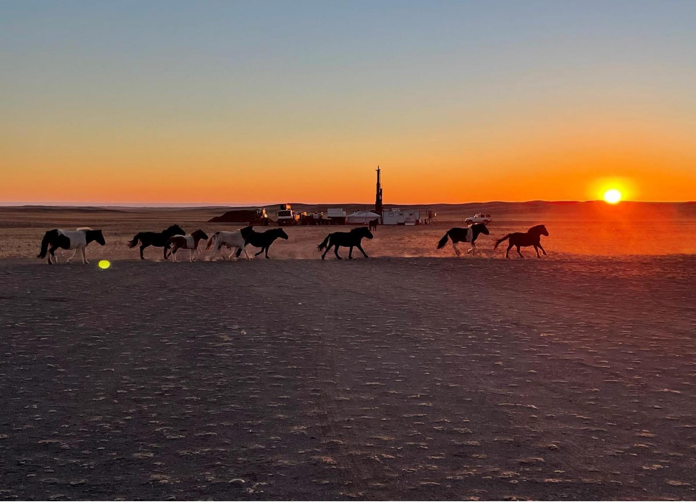
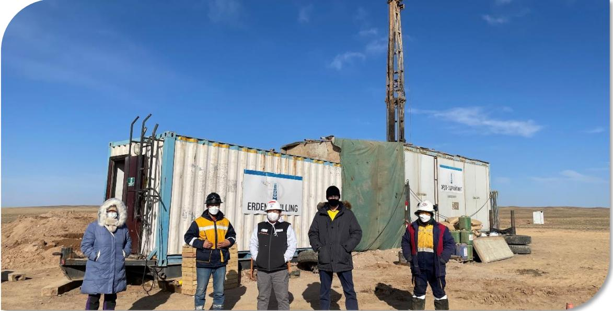
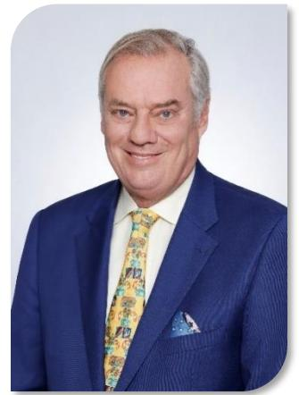
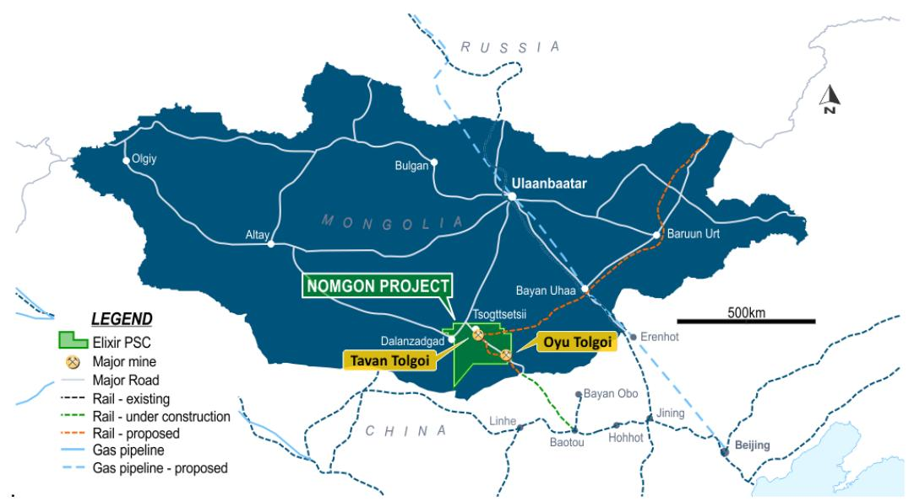
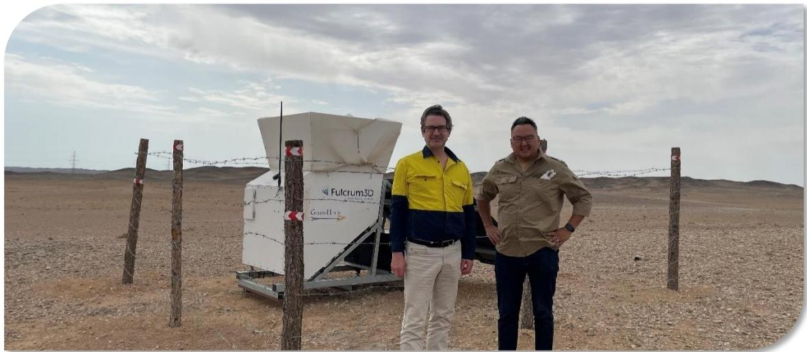
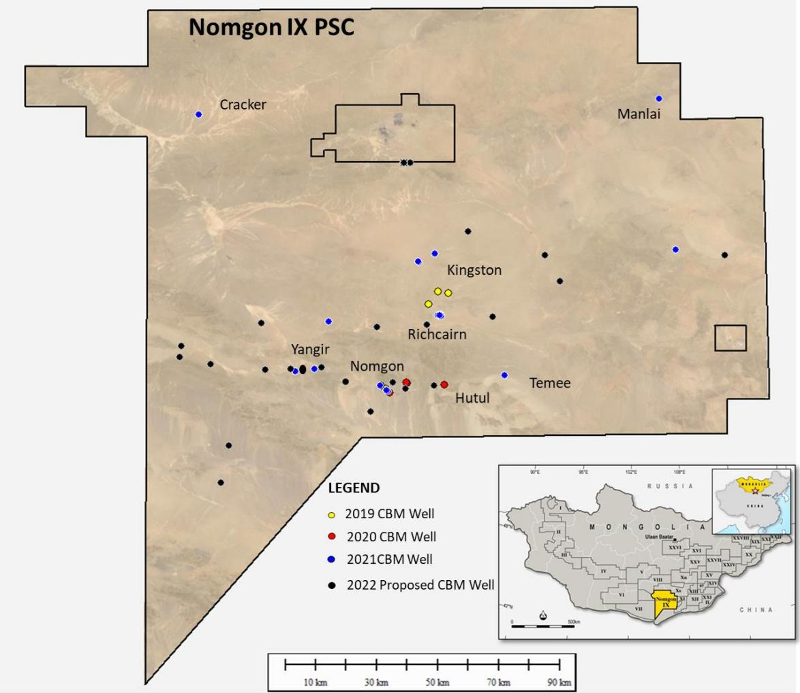
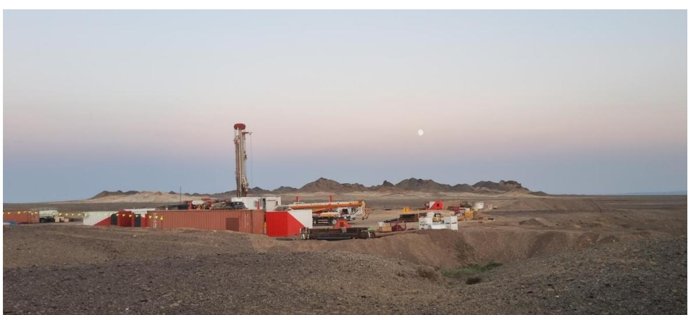
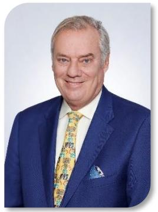
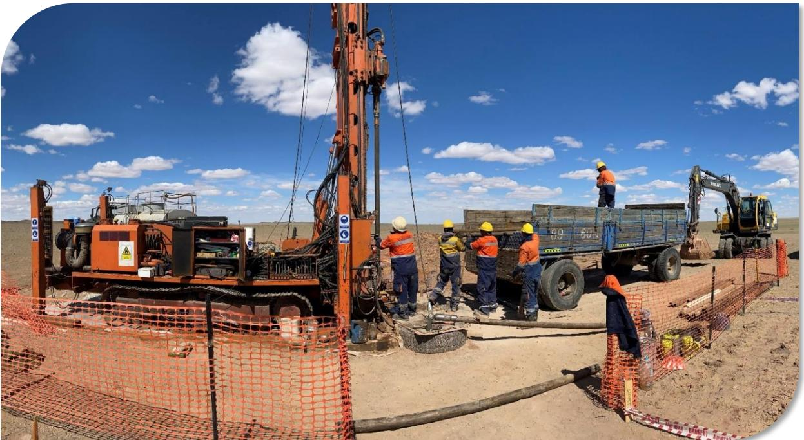
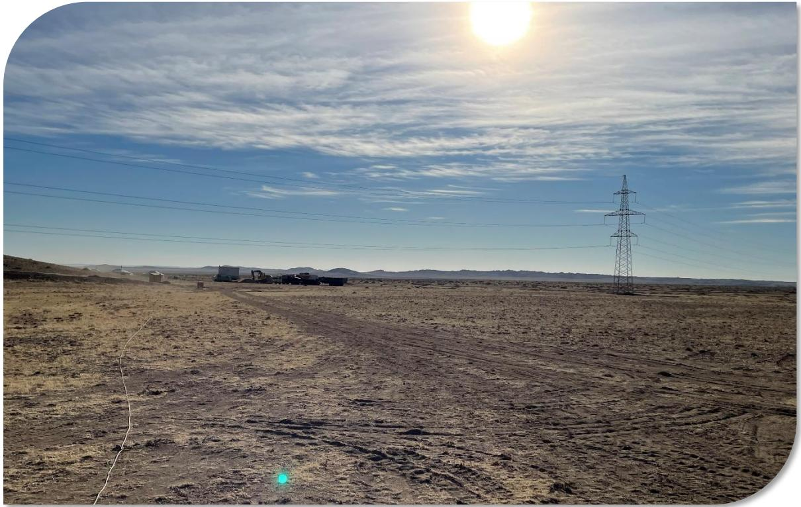

{0}------------------------------------------------

# **Annual Report For the year ended 30 June 2022**

{1}------------------------------------------------

# **Contents**

| Corporate Directory                                                  | 2  |
|-------------------------------------------------------------------------|----|
| Chairman's Letter                                                       | 3  |
| Managing Director's Report                                              | 4  |
| Operational Summary and Resource Statement                              | 7  |
| Environmental, Social and Governance                                 | 9  |
| Directors' Report                                                       | 10 |
| Independent Auditor's Declaration                                    | 23 |
| Independent Auditor's Report                                            | 24 |
| Directors' Declaration                                               | 27 |
| Corporate Governance Statement                                          | 28 |
| Consolidated Statement of Profit or Loss and Other Comprehensive Income | 29 |
| Consolidated Statement of Financial Position                            | 30 |
| Consolidated Statement of Changes in Equity                          | 31 |
| Consolidated Statement of Cash Flows                                    | 32 |
| Notes to the Consolidated Financial Statements                          | 33 |
| Additional Shareholder Information                                      | 59 |

{2}------------------------------------------------

# **Corporate Directory**

### **Directors**

Mr Neil Young Managing Director

### **Company Secretary Auditors - Australia**

Ms Victoria Allinson BDO Audit Pty Ltd

### **Registered Office** Adelaide 5000

3B, Level 3 South Australia 60 Hindmarsh Square South Australia Inter Audit LLC

National Australia Bank Limited Chingiltei district Level 9 Ulaanbnaatar-46, Mongolia 22 King William Street Adelaide 5000 **Stock Exchange Listing**

### **Share Registry Email address**

Automic Pty Ltd info@elixirenergy.com.au Level 5, 126 Phillip Street Sydney 2000 **Website**

Mr Richard Cottee Non-Executive Chairman Mr Stephen Kelemen Non-Executive Director Ms Anna Sloboda Non-Executive Director

Level 7, 420 King William Street

### Adelaide 5000 **Auditors - Mongolia**

1103, MN Tower **Bankers** 5th Khoroo Sambuu's Street

South Australia Australian Securities Exchange code: EXR

New South Wales www.elixirenergy.com.au

{3}------------------------------------------------

# **Chairman's Letter**

Dear Fellow Shareholder,

The global energy market has faced its biggest year of change since the first and second oil shocks over 40 years ago. Whilst the developed world was focussing on the decarbonisation process, the tragedy in Ukraine brought into sharp relief the true need for energy security and reliability.

This flux was no more apparent than in Mongolia. The timing therefore of our first pilot production process could not be more auspicious. With the imminent production testing at Nomgon and the execution of the MOU with SBEnergy for Hydrogen in the same region, it should come as no surprise that your company was recognised yet again by the Mongolian Government as "The Best Investor of 2021".

The global energy market and the present domestic gas shortage in the Australian East Coast Market provided just the incentive we needed for the Company to acquire its 100% interest in the very prospective acreage in Queensland (ATP 2044) close to existing infrastructure. The troubling global events of the last 24 months have made it crystal clear that what the democratic world needs is reliable gas sourced from politically stable countries like Australia.

With over \$20 million in the bank at year end, your company can afford its exploration commitments, but you can rest assured that your board will always look at ways to continually enhance shareholder value in a riskappropriate manner.

Next year will clearly help to further define your Company.

Yours sincerely,

Mr Richard Cottee *Non-Executive Chairman*

{4}------------------------------------------------

# **Managing Director's Report**

### **Overview**

During the 2022 financial year, the world started to emerge from the multiple constraints imposed by COVID-19 and I was pleased to return to Mongolia in late 2021 for the first time since early 2020. However, many supply-side constraints still exist, particularly those that require interfacing with China's ongoing strict border controls.

Elixir Energy Limited's (Elixir) team has managed to navigate its way through these shifting sands in the run-up to our (and Mongolia's) first extended pilot production program. At the date of writing all the equipment required for the program has made its way from multiple other countries to Mongolia and the gas pilot will be put on pump later this calendar year.

For the second year in a row, Mongolia's Ministry of Mining and Heavy Industry officially recognised the resilience of our ongoing work program despite all the challenges that COVID-19 has thrown up, with the designation of Elixir as "Best Investor of 2021".

Our exploration and appraisal program continued through the year. Across the vast PSC area, multiple wells were drilled, 2D seismic acquired and surface areas mapped. All activities were undertaken safely and environmentally responsibly.

Our strong relationships at multiple levels in Mongolia facilitated the rapid development of our Gobi H2 green hydrogen project during the year. This culminated in June with the execution of a MOU with SB Energy Corp, a wholly owned subsidiary of Japan's SoftBank Group Corp. Under the MOU the parties are currently working closely together to progress the Gobi H2 project.

After the fiscal year-end, we announced the acquisition of a licence in Queensland – ATP 2044 – which we consider to be highly prospective and very well located to take advantage of changes to the global and local gas markets following the geopolitically seismic event that was the invasion of Ukraine in February.

### **Nomgon PSC - Exploration & Appraisal Program**

In the fiscal year 2022, the primary focus of the Company's exploration and appraisal program was setting up Mongolia's first long-term gas pilot production project. This has involved importing equipment and personnel from a number of countries – all under the challenges posed by COVID-19 border and other supply-side restrictions.

As of the date of writing, the commencement of the pilot project is now imminent. Its primary aim is simple – to pump out water and then gas, with a view to establishing a commercial flow rate of the latter.

Achieving this would be a game changer for Mongolia – with gas having multiple possible markets in areas like power generation, transport fuels, fertiliser production, etc, - all areas in which the country is short – with the repercussions of the Ukraine war greatly exacerbating the issue of security of supply and cost of imports.

Our exploration program in the year targeted multiple sub-basins across the Nomgon PSC, using the tools of geological surveys, 2D seismic acquisition and interpretation and of course the drilling of multiple wells. Like all exploration efforts, not all wells made discoveries, but we were pleased to drill a good number of wells which encountered coals in the CBM depth window. Further evaluation work will follow up on these in the months and years to come.

{5}------------------------------------------------

### **Clean Energy - Gobi H2**

Last year we announced the establishment of a new subsidiary – GOH Clean Energy LLC – to pursue clean energy ventures in the South Gobi region. Over the course of the 2022 financial year, we have materially built upon this initiative – with a very major milestone being passed with the establishment of an early-stage partnership with Japan's SB Energy Corp (SBE). This was founded through the execution of a non-binding Memorandum of Understanding (MOU). SBE is a wholly owned subsidiary of one of Japan's largest companies – SoftBank Group Corp.

SBE is the operator of an existing world-class wind farm in the South Gobi and has a similar longterm experience in Mongolia to that of our team – more than a decade.

Both parties have developed a view that Southern Mongolia has the characteristics that could support giga-watt scale green hydrogen production facilities – including very strong renewable energy (wind and solar) resources and of course immediate proximity to multiple and large potential markets in China.

An important step on the road to a major export facility is a pilot plant that would serve to prove viability to multiple stakeholders such as financiers, customers, communities, etc. Elixir and SBE aim to build a pathway to a formal joint venture in the course of the 2023 fiscal year to pursue the development of a pilot.

{6}------------------------------------------------

### **ATP 2044**

After the end of the financial year, we were very pleased to announce the purchase of a 100% interest in a large and very well-located permit in Queensland: ATP 2044. Located only some 35 kilometres from Australia's premier gas hub at Wallumbilla, gas from this asset could find markets both domestically and internationally via the connected LNG export plants at Gladstone.

Our internal estimate of the prospective resources in the permit is very substantial – a mean case in excess of 3 trillion cubic feet of gas – and also 75 million barrels of associated condensate.

This permit is located in a deep tight gas play called the Taroom Trough, which was the subject of an initial drilling evaluation program by BG Group around a decade ago – a program that delivered flows of gas to the surface from multiple wells. BG's successor – Shell – still holds an extensive position in the Taroom – as does Australian energy giant Santos. Elixir plans to build a drilling program in ATP 2044 that is coordinated as much as possible with the drilling plans of its neighbours.

### **Looking Ahead**

Elixir has expanded its portfolio to now include three areas – each of which could deliver very strong returns for shareholders.

Our foundation asset – the Nomgon CBM PSC - will soon host Mongolia's first extended pilot production program. Positive results from this will demonstrate the commerciality of CBM production in the country and therefore be a key milestone to ultimate development. Our exploration program continues in parallel to de-risk resources in the PSC.

The Gobi H2 project is based on two key advantages that Mongolia possesses – world-class renewable resources and a location immediately proximate to the world's largest energy importing nation. We are currently working very closely with our new partner SB Energy to move forward with an initial pilot green hydrogen project – as a demonstration of the multi-gigawatt potential in the region.

The acquisition post-financial year end of ATP 2044 in Queensland gives the company an asset that is exceptionally well placed to benefit from the global energy market storms that the invasion of Ukraine has provoked. Elixir's Australian team is very familiar with Queensland and our plan is to drill an appraisal well in this tenement in 2023.

Neil Young *Managing Director*

{7}------------------------------------------------

# **Operational Summary and Resource Statement**

In the reporting year ended 30 June 2022, Elixir acquired 673 km of 2D seismic and drilled 17 wells in the Nomgon IX PSC (Figure 1). The wells were a combination of exploration and appraisal wells. This brought the total number of well drilled in the PSC since it was executed in 2018, to 33.

*Figure 1: Drilling and Seismic Activity in Nomgon IX*

### **Coal Bed Methane Drilling**

The Company's Coal Bed Methane (CBM) wells were drilled with a combination of chip-hole and coring drilling techniques. The technique to be used is generally at the discretion of the drilling subcontractor – Elixir generally pays for wells by the metre drilled. At Elixir's discretion, cores can be taken to measure for various key CBM parameters such as gas content.

Over 12,100m has been drilled, and a total of 330m of coal and a further 155m of silty coal was intersected.

During the fiscal year, three separate Mongolian owned drilling sub-contractors have been used. Post the year end, this has been supplemented with international firm Major Drilling, who has been engaged to drill pilot and exploration wells (Figure 2).

{8}------------------------------------------------

*Figure 2: Major Drilling at Nomgon IX*

### **2D Seismic**

A total of 673 km of seismic was acquired during the financial year. The 2D seismic is fundamental in defining the sedimentary depocentres and providing high-resolution stratigraphic information which is critical for our well planning. The 2D seismic was acquired by Microseismic LLC, who is an experienced local Mongolian Seismic Contractor.

The seismic crew was in the field for 128 days between 24 September 2021 and 20 May 2022. The crew often work throughout the night as there is less wind noise in the evening, improving the quality of the data acquired.

### **Nomgon IX Contingent Resource**

In the fiscal year ended 30 June 2022, a key focus of Elixir's program has been setting up a long term pilot production program – whose aim is to flow gas at commercial rates, hence facilitating a maiden reserves booking. Considerable logistical efforts were undertaken during the year to import all the equipment required from multiple countries.

Post the balance sheet date, the drilling of wells for this pilot commenced and the Company anticipates flowing water and gas therefrom later in 2022.

The intended reserve booking builds upon the site specific contingent resources booked during the previous fiscal year ended 30 June 2021, when Elixir announced its first Contingent Resource booking. The Independent Contingent Resource estimate was undertaken by ERCE Equipoise (ERCE). The Contingent Resources have been booked only for the initial selected gas supply area for a potential power project – the Western part of the Nomgon sub-basin in which the Company drilled a number of wells in 2020.

| Contingent Resources (100% WI)   |    |    |     |  |
|----------------------------------|----|----|-----|--|
| Bcf                              | 1C | 2C | 3C  |  |
| Gas initially in place (GIIP) | 13 | 60 | 242 |  |
| Recoverable Gas                  | 5  | 24 | 104 |  |

*Table 2: Nomgon Contingent Resource*

Detailed notes on the background to the preparation of the Contingent Resources report are set out in ASX Announcement released on April 7, 2021.

{9}------------------------------------------------

# **Environmental, Social and Governance**

Elixir Energy Limited (Elixir) is an ASX listed natural gas and hydrogen exploration and development company in Mongolia and more recently Australia

ESG is intrinsic to Elixir and from the start of 2021, Elixir started measuring its progress on meeting best practice on the important "ESG" (Environmental Social Governance) front, which key stakeholders such as investors and Governments are increasingly demanding

Elixir will issue a separate ESG Report contemporaneously with this Annual Report.

The ESG Report is available at [www.elixirenergy.com.au](http://www.elixirenergy.com.au/)

{10}------------------------------------------------

# **Directors' Report**

### **DIRECTORS**

The names of the Directors of Elixir Energy Limited (Elixir) in office during the financial year and at the date of this report are:

| Director        | Position               |
|-----------------|------------------------|
| Richard Cottee  | Non-Executive Chairman |
| Neil Young      | Managing Director      |
| Stephen Kelemen | Non-Executive Director |
| Anna Sloboda    | Non-Executive Director |

Each Director held office from 1 July 2020 until the date of this report.

of the Audit Committee.

### **INFORMATION ON DIRECTORS**

*Richard Cottee – Independent Non-Executive Chairman* Qualifications: BA/LLB (Hons)

Board Committees: Chair of the Remuneration Committee and a member

Mr Cottee was the Managing Director of coal seam gas (CSG) focused Queensland Gas Company (QGC) during its growth from a \$20 million market capitalisation junior explorer through to its acquisition by BG Group for \$5.7 billion. QGC's CSG assets are now operated by Shell and produce gas that is sold to China and other LNG markets.

Originally a lawyer, Mr Cottee has spent the vast majority of his career in senior executive roles in the energy industry, including acting as CEO at CS Energy, NRG Europe, Central Petroleum and Nexus Energy.

A 33-year veteran of the industry, Mr Cottee is a strong business development professional and a graduate from The University of Queensland.

Other current Directorships of Australian listed public companies:

- State Gas Limited (ASX code: GAS) Executive Chairman
Interests in securities in Group at the date of this report:

- 12,752,240 fully paid ordinary shares
- 7,500,000 Performance Rights Class C expiring 29 September 2024

{11}------------------------------------------------

*Neil Young – Managing Director* Qualifications: MA (Hons)

Mr Young has more than twenty years' experience in senior management positions in the upstream and downstream sectors of the energy sector, focusing on business development, new ventures, gas marketing and general commercial functions.

He has worked for a range of companies in the UK and Australia including EY, Tarong Energy and Santos. Mr Young founded Golden Horde Ltd (now a wholly owned subsidiary of Elixir) in 2011 with a view to exploring for gas on the Chinese border in Mongolia. He has also developed various new

ventures in multiple countries including Kazakhstan, Japan and the USA.

Other current Directorships of Australian listed public companies:

- Nil
Interests in securities in Group at the date of this report:

- 31,760,809 fully paid ordinary shares
- 7,500,000 Performance Rights Class C expiring 14 December 2023
- 6,000,000 New Performance Rights expiring 1 July 2023-2025

### *Stephen Kelemen – Independent Non-Executive Director* Qualifications: B.Eng

Board Committees: Chair of the Risk Committee, member of the Audit Committee and a member of the Remuneration Committee

Mr Kelemen has a diverse petroleum industry experience across reservoir, development, operations and exploration activities in conventional petroleum, CSG and other unconventional resources, developed through his ~40 years in the industry. Mr Kelemen led Santos' CSG team from its inception in 2004 and drove the growth in this area that allowed Santos to become one of Australia's leading CSG companies. An engineering

graduate from Adelaide University, Stephen served Santos for 38 years in multiple technical and leadership roles.

Mr Kelemen is currently an Adjunct Professor at University of Queensland's Centre for Natural Gas and Deputy Chair – Petroleum for Queensland Exploration Council.

Other current Directorships of Australian listed public companies:

- Galilee Energy Ltd (ASX: GLL)
Interests in securities in Group at the date of this report:

- 2,137,223 fully paid ordinary shares
- 4,750,000 Incentive Options exercisable at \$0.10 and expiring 29 September 2023

{12}------------------------------------------------

*Anna Sloboda – Non-Executive Director Qualifications: MA Economics, MBA*

Board Committees: Chair of the Audit Committee and a member of the Risk Committee.

Anna is a joint Belarusian/Australian citizen and has over 20 years of experience in corporate finance, and in developing junior resource companies operating around the world. Anna is currently an Executive Director of Red Citadel Resources Pty Ltd, a private owned mineral resources exploration company with a range of projects in Africa and South

America. She also serves as an Advisory Committee Member, Maritime Archaeology, at the Western Australian Maritime Museum.

Previously she was a co-founder of Trans-Tasman Resources Ltd, and in that capacity had substantial experience in dealing with Chinese off-takers and partners. Other prior employers include Lehman Brothers, Clough Ltd and Curtin University.

Other current Directorships of Australian listed public companies:

• Nil

Interests in securities in Group at the date of this report:

- 36,000 fully paid ordinary shares
- 1,000,000 Incentive Options exercisable at \$0.50 and expiring 27 October 2025

### **COMPANY SECRETARY**

*Victoria Allinson (appointed 1 August 2019) Qualifications: FCCA, AGIA*

Ms Allinson is a Fellow of The Association of Certified Chartered Accountants, a Fellow of the Governance Institute of Australia and an NSX Nominated Advisor. She has over 30 years' accounting and auditing experience, including senior accounting positions in a number of listed companies and was an audit manager for Deloitte Touche Tohmatsu. In addition, Ms Allinson has gained professional experience while living and working in both Australia and the United Kingdom.

She is current CFO and Company Secretary of listed company and Kangaroo Island Plantation Timbers Limited (ASX: KPT). Her previous experience has included being Company Secretary and CFO for a number of ASX listed companies and NSX listed companies, including: Safety Medical Products Ltd, Marmota Limited, Centrex Metals Ltd, Adelaide Energy Ltd, Enterprise Energy NL, and Island Sky Australia Ltd as well as a number of unlisted companies. In her role as Company Secretary, Vicky has assisted a number of companies to list on the ASX and NSX.

Interests in securities in Group at the date of this report:

- 600,000 New Performance Rights expiring 1 July 2023-2025

{13}------------------------------------------------

### **MEETINGS OF DIRECTORS**

The following table sets out the number of meetings of the Elixir's Directors held during the year ended 30 June 2022, and the number of meetings attended by each Director.

| Director     | Directors' Meeting |                    | Audit Committee    |          | Remuneration Committee(2) |                    | Risk Committee     |              |
|--------------|-----------------------|--------------------|-----------------------|----------|------------------------------|--------------------|-----------------------|--------------|
|              | Eligible              | to attend Attended | Eligible to attend | Attended | Eligible                     | to attend Attended | Eligible to attend | Attende d |
| R. Cottee    | 11                    | 10                 | 2                     | 2        | 1                            | 1                  | 1                     | 1            |
| N. Young (1) | 11                    | 11                 | 2                     | 2        | 1                            | 1                  | 1                     | 1            |
| S. Kelemen   | 11                    | 11                 | 2                     | 2        | 1                            | 1                  | 1                     | 1            |
| A. Sloboda   | 11                    | 11                 | 2                     | 2        | -                            | -                  | 1                     | 1            |

(1) Attended both Audit Committee & Risk Committee meetings during the year by invitation

(2) The Remuneration Committee was established during the year and held it inaugural meeting on 2 September 2021

### **PRINCIPAL ACTIVITIES**

Elixir Energy Limited ("Company") and its subsidiaries ("Group") is an exploration company focused on coal bed methane ("CBM") exploration and development in Mongolia. The Group holds a Production Sharing Contract in southern Mongolia, which was awarded in late 2018 and covers an area of approximately 30,000 square kilometres. Further details are contained in the Managing Director's Report provided earlier in the 2022 Annual Report and in the Review of Operations below.

### **REVIEW OF OPERATIONS**

### **Operating Results**

For the financial year ended 30 June 2022, the Group recorded a net loss from continuing operations after tax of \$2 million (2021: loss of \$1.5 million). The current year loss is increased by \$0.5 million comparing to the prior year, reflecting a largely unchanged corporate cost structure with all costs related to the Mongolian CBM project capitalised. It is noted that the current year loss includes approximately \$0.5 million (2021: \$0.1 million) (net) of non-cash items for share-based remuneration; new ventures \$0.34 million; offset by \$0.4 million (2021: loss \$0.1 million) foreign currency translation gain. The 'cash loss' for the year of approximately \$1.6 million (2021: \$1.3 million) reflects the Group's operating/administrative costs of approximately \$0.137 million per month.

At 30 June 2022, the Group held cash of just under \$22.7 million (2021: \$32.8 million), representing funds raised in the last quarter of the 2021 financial year from a Share placement and Share Purchase Plan of \$26.6 million (\$25.9 million after costs). During the year, the Group spent approximately \$8 million (2021: \$3.7 million) on the CBM project in Mongolia, described in more detail below.

### **Operations Review**

During the financial year, the Group's primary focus was conducting an exploration and appraisal program in the Nomgon IX CBM PSC.

Each year the Company undertakes a regulatory process involving procuring various approvals from the petroleum, environmental and local authorities. In this financial year this facilitated the acquisition of 673 kilometres of 2D seismic and a drilling campaign in the year which comprised both low cost strat-holes and fully tested core-holes. In total 17 wells were drilled in the financial year.

During the year, Elixir made significant progress with its Gobi H2 green hydrogen project, located in the same part of the South Gobi region as its CBM operations. This culminated with the execution of a non-binding MOU with Japan's SB Energy Corp to jointly pursue this venture.

{14}------------------------------------------------

The only remaining legacy asset from Elxir's operations prior to current Management coming on board is a wholly owned subsidiary, Cottesloe Oil & Gas LLC, which held a joint venture interest in an asset in Texas, USA.

### **Changes in Capital Structure**

In November 2021, the Group acquired a new subsidiary, Solar Ilch LLC, via the issuing of 720,000 shares Ordinary EXR shares to the vendors, valued at 26 cents per share.

Total ordinary shares on issue at 30 June 2022 were 891,733,376.

There were no other significant changes to the issued capital structure during the year.

### **SHARE OPTIONS**

At the date of this report there are 6,330,000 (2021: 5,330,000) Unlisted Options over unissued ordinary shares are on issue. During the year, 1,000,000 Unlisted Options were granted and no Unlisted Options were exercised or cancelled.

Options on issue at 30 June 2022:

*Unlisted Incentive Options*

| Issue date        | Number    | Exercise price | Expiry            | Vesting        |
|-------------------|-----------|----------------|-------------------|----------------|
| 30 September 2019 | 4,750,000 | \$0.10         | 29 September 2023 | Vested         |
| 5 June 2020       | 580,000   | \$0.10         | 4 June 2024       | Vested         |
| 28 October 2021   | 1,000,000 | \$0.50         | 27 October 2025   | Not yet Vested |
| Total             | 6,330,000 |                |                   |                |

All unlisted options vest after a one-year service period has been completed.

1,000,000 Incentive options were issued to Anna Sloboda on 28 October 2021.The grant date was determined to be 28 October 2021 and the total fair value was assessed as \$166,000 (\$0.17 per option) utilizing the Black-Scholes model with the following key inputs:

- o Share Price at grant date: \$0.26
- o Exercise price: \$0.50
- o Expiry: 27 October 2025
- o Share price volatility: 110%
- o Risk Free rate: 1.11%

### **PERFORMANCE RIGHTS**

At the date of this report there are 26,200,000 (2021: 16,000,000) Performance Rights are on issue. During the year no Performance Rights were converted.

Performance Rights on issue at 30 June 2022:

| Grant date             | Number     | Exercise price | Expiry            | Vesting |
|------------------------|------------|----------------|-------------------|---------|
| Class C                |            |                |                   |         |
| 14 December 2018       | 7,500,000  | \$nil          | 13 December 2023  | (a)     |
| 30 September 2019      | 7,500,000  | \$nil          | 29 September 2024 | (a)     |
| 5 June 2020            | 1,000,000  | \$nil          | 4 June 2025       | (a)     |
| New Performance Rights |            |                |                   |         |
| 28 October 2021        | 3,400,000  | \$nil          | 1 July 2023       | (b)     |
| 28 October 2021        | 3,400,000  | \$nil          | 1 July 2024       | (b)     |
| 28 October 2021        | 3,400,000  | \$nil          | 1 July 2025       | (b)     |
| Total                  | 26,200,000 |                |                   |         |

Performance Rights Milestones and terms:

- (a) Class C Final investment decision approved by the Board and the Mongolian Government or a pilot production test within the PSC within 5 years of date of issue. No voting or dividend rights.
- (b) New Performance Rights milestones:
	- 3,400,000 performance rights to vest upon the commencement of a 1st stage pilot production program by 30 June 2023.

{15}------------------------------------------------

- 3,400,000 performance rights to vest upon the commencement of a 2nd stage pilot production program by 30 June 2024.
- 3,400,000 performance rights to vest upon the commencement of a 3rd stage pilot production program by 30 June 2025.

During the period \$355,049 was recognised as share-based payment expense in relation to the 10,200,000 Performance Rights (approved by Shareholders on 28 October 2021) issued to below parties:

- o Neil Young: 6,000,000
- o Victoria Allinson: 600,000
- o Non KMP: 3,600,000

The remaining \$528,951 will be recognised in the twelve months to 30 June 2023.

The probability of achieving the milestone set in 2023 is considered likely at 30 June 2022 and milestones set for 2024 and 2025 are considered unlikely at 30 June 2022 and therefore only the portion of the grant date fair value related to achieving 2023 milestone is recognised.

(c) No voting or dividend rights.

### **DIVIDENDS**

No dividends have been declared, provided for or paid in respect of the financial year ended 30 June 2022 (2021: Nil).

### **SIGNIFICANT CHANGES IN STATE OF AFFAIRS**

Other than those events noted above, there were no other significant changes in the state of affairs of the Group during the year that requires separate disclosure.

### **EVENTS SINCE THE END OF THE FINANCIAL YEAR**

In August 2022, the Company acquired a 100% interest in petroleum exploration permit ATP 2044 via EnergyCaptute Pty Ltd; consideration comprised of \$3,000,000 of Elixir shares, \$500,000 in cash and an over-riding 3% royalty.

There were no other events occurring subsequent to 30 June 2022 that have significantly affected, or may affect in the future, the operations or state of affairs of the Group.

### **LIKELY DEVELOPMENTS AND EXPECTED RESULTS OF OPERATIONS**

Refer to Review of Operations on likely developments and future prospects of the Group.

### **ENVIRONMENTAL REGULATIONS**

The Group's operations are subject to significant environmental regulation in relation to exploration and production activities conducted by the Group in the countries in which it operates. The Group has a policy of exceeding or at least complying with its environmental performance obligations. During the financial year, the Group was not aware of any material breach of any particular environmental law or any other particular regulation in respect to its operating activities.

### **INDEMNIFICATION AND INSURANCE OF OFFICERS AND AUDITORS**

During the year, the Company paid a premium of \$33,273 (2021: \$24,154) in respect of a contract, insuring the Directors and Officers of the Company against liabilities incurred as a Director or Officer of the Company to the extent permitted by the Corporations Act 2001. The contract of insurance prohibits disclosure of the nature of the insured liabilities and the amount of the premium.

{16}------------------------------------------------

The Company has not otherwise, during or since the financial year, indemnified or agreed to indemnify an Officer or auditor of the Company or of any related body corporate against a liability incurred as such an Officer or auditor.

### **PROCEEDINGS ON BEHALF OF THE COMPANY**

No person has applied for leave of the court under section 237 of the *Corporations Act 2001* to bring proceedings on behalf of the Company or to intervene in any proceeding to which the Company is a party for the purpose of taking responsibility on behalf of the Company for all or any part of those proceedings. The Group was not a party to any such proceedings during the year.

### **NON-AUDIT SERVICES**

The Company may deploy the Group's auditor BDO Audit Pty Ltd for non-audit services. The auditor was not engaged to provide any services other than audit services during the 30 June 2022 financial year (refer Note 16). The Directors are satisfied that the auditor has complied with the general standard of independence for auditors imposed by the *Corporations Act 2001*.

### **AUDITOR'S INDEPENDENCE DECLARATION**

The Auditor's independence declaration is included on page 23 of the financial report.

### **REMUNERATION REPORT (Audited)**

This remuneration report outlines the Director and executive remuneration arrangements of the Group in accordance with the requirements of the Corporations Act 2001 and its regulations. For the purposes of this report, Key Management Personnel ("KMP") of the Group are defined as those persons having authority and responsibility for planning, directing and controlling the major activities of the Group, directly or indirectly, including any Director (whether executive or otherwise) of the parent company.

| Director          | Position               | Date appointed   | Date resigned |
|-------------------|------------------------|------------------|---------------|
| Richard Cottee    | Non-Executive Chairman | 29 April 2019    | -             |
| Neil Young        | Managing Director      | 14 December 2018 | -             |
| Stephen Kelemen   | Non-Executive Director | 6 May 2019       | -             |
| Anna Sloboda      | Non-Executive Director | 1 October 2020   | -             |
|                   |                        |                  |               |
| Other KMP         | Position               | Date appointed   | Date resigned |
| Victoria Allinson | Company Secretary      | 1 August 2019    | -             |

### **(a) Remuneration governance**

The remuneration committee of the board of Directors of the Company is responsible for determining and reviewing remuneration arrangements for the Directors and key management personnel. The remuneration committee assesses the appropriateness of the nature and amount of remuneration of key management personnel on a periodic basis by reference to relevant employment market conditions with the overall objective of ensuring maximum stakeholder benefit from the retention of Directors and key management personnel.

### **(b) Remuneration philosophy**

The performance of the Company, among other things, depends upon the quality of its Directors and management. To prosper, the Company must attract, motivate and retain industry skilled Directors and key management personnel. To this end, the charter adopted by the remuneration committee aims to align rewards with achievement of strategic objectives. The remuneration framework applied provides for a mixture of fixed and variable pay and a blend of short- and long-term incentives as appropriate.

Currently no remuneration consultants are used by the Group in formulating remuneration policies.

{17}------------------------------------------------

### **(c) Remuneration structure**

In accordance with best practice corporate governance, the structure of Non-Executive Director and key management personnel remuneration is separate and distinct.

### **Non-Executive Directors**

### *Non-Executive Directors Fees*

The maximum aggregate amount of fees that can be paid to Non-Executive Directors is subject to approval by shareholders in a general meeting. At the Company's Annual General Meeting held on 23 October 2010, the shareholders of the Company approved that the aggregate amount of Director fees payable to Non-Executive Directors of the Company be set at \$500,000 per annum in total. From September 2021, the Non-Executive Chairman fees are \$115,000 per annum (2021: \$72,000) and Non-Executive Director fees are \$70,000 per annum (2021: \$45,000).

The Group's policy is to remunerate Non-Executive Directors at market rates (for comparable companies) for time, commitment and responsibilities. Cash fees for Non-Executive Directors are not linked to the performance of the Group. However, to align Directors' interests with shareholders' interests, Directors are encouraged to hold shares in the Company.

### *Retirement benefits and allowances*

No retirement benefits or allowances are paid or payable to Directors of the Company (other than statutory or mandatory superannuation contributions, where applicable).

### **Key Management Personnel**

### *Base pay*

KMP receive a competitive level of base pay that comprises the fixed (unrisked) component of their pay and rewards. Base pay for senior KMP is reviewed annually to ensure market competitiveness. There are no guaranteed base pay increases included in any senior KMP contracts.

### *Short-term incentives*

Payment of short-term incentives is at the sole and absolute discretion of the remuneration committee. The remuneration committee assesses the achievement of key performance milestones to determine bonus payments. These milestones require performance in relation to key strategic, non-financial measures linked to drivers of performance in future reporting periods, refer to the current and historical performance rights milestones.

Short-term bonus payments may be adjusted up or down in line with under or over achievement relative to target performance levels at the discretion of the remuneration committee. During the year, the Managing Director was paid a short-term incentive payment of \$120,000 (2021: \$75,000) as compensation following successful exploration and other operational results in the prior financial year. There have been no forfeitures of bonuses by KMP during the current or prior periods and no cash bonuses remained unvested at year end.

### *Long term Incentive - Share-based compensation*

Options over shares in the Company and Performance Rights may be granted from time to time and are required to be approved by shareholders where option over shares or Performance Rights are issued to Directors. The Group's Employee Incentive Securities Plan ("Plan") was last approved by shareholders at the 2020 Annual General Meeting. Participation in any incentive scheme is at the board's discretion and no individual has a contractual right to participate in the Plan or to receive any guaranteed benefits. Options or Performance Rights granted under the Plan carry no dividend or voting rights. The Plan includes rules to prevent participants entering into transactions to remove the "at risk" aspect of the unvested Options or Performance Rights without the approval of the board.

{18}------------------------------------------------

Refer to section (e) of this report for detail of the contractual arrangements in place for the Managing Director and Company Secretary.

### **Group performance**

At present, no remuneration for KMP is directly linked to common financial measures of the Group's performance.

The table below shows various commonly used measures of performance for the 2018 to 2022 financial years:

|                                   | Year ended 30 June |             |             |             |             |  |
|-----------------------------------|--------------------|-------------|-------------|-------------|-------------|--|
|                                   | 2018               | 2019        | 2020        | 2021        | 2022        |  |
|                                   | \$                 | \$          | \$          | \$          | \$          |  |
| Revenues and finance income       | 33,809             | 28,235      | 41,142      | 53,344      | 38,926      |  |
| (Loss) after tax                  | (899,137)          | (2,454,263) | (1,532,337) | (1,507,035) | (1,981,676) |  |
|                                   |                    |             |             |             |             |  |
| Share price at start of year      | 0.03               | 0.06        | 0.04        | 0.036       | 0.245       |  |
| Share price at end of year        | 0.06               | 0.04        | 0.036       | 0.245       | 0.135       |  |
| Total Shareholder Return (TSR) | 0.03               | (0.02)      | (0.004)     | 0.209       | (0.11)      |  |
| Loss per share                    | (0.004)            | (0.007)     | (0.003)     | (0.002)     | (0.002)     |  |

### **(d) Remuneration of Directors and Key Management Personnel ("KMP") of the group for the current and previous financial year**

The following tables show details of the remuneration received by the Group's KMP for the current and previous years:

| 2022                       | Short-term benefits           |                 | Post employment benefits | Share-based payments |         |                           |                   |                            |
|----------------------------|-------------------------------|-----------------|--------------------------------|-------------------------|---------|---------------------------|-------------------|----------------------------|
|                            | Cash salary and fees | Bonus           | Accrued Annual Leave     | Super annuation      | Options | Perfor mance Rights | Total             | Perfor mance Related |
|                            | \$                            | \$              | \$                             | \$                      | \$      | \$                        | \$                | %                          |
| Non-Executive Directors |                               |                 |                                |                         |         |                           |                   |                            |
| Richard Cottee             | 98,080                        | -               | -                              | 9,753                   | -       | -                         | 107,833           | -                          |
| Stephen Kelemen            | 65,833                        | -               | -                              | -                       | -       | -                         | 65,833            | -                          |
| Anna Sloboda               | 65,492                        | -               | -                              | -                       | 111,425 | -                         | 176,917           | 63%                        |
|                            |                               |                 |                                |                         |         |                           |                   |                            |
| Subtotal - NED             | 229,405                       | -               | -                              | 9,753                   | 111,425 | -                         | 350,583           | 32%                        |
| Executive Directors        |                               |                 |                                |                         |         |                           |                   |                            |
| Neil Young                 |                               | 424,583 120,000 | 43,225                         | 25,417                  | -       | 208,852                   | 822,077           | 25%                        |
| Other KMP                  |                               |                 |                                |                         |         |                           |                   |                            |
| Victoria Allinson (1)      | 33,177                        | -               | -                              | -                       | -       | 20,885                    | 54,062            | 39%                        |
| Total All KMP              | 687,165                       | 120,000         | 43,225                         | 35,170                  | 111,425 |                           | 229,737 1,226,722 | 38%                        |

Sections (e) and (f) below provide further detail on service contracts and share-based payment remuneration.

{19}------------------------------------------------

| 2021                            | Short-term benefits        |        | Post employment benefits | Share-based payments |         |                           |         |                            |
|---------------------------------|----------------------------|--------|--------------------------------|-------------------------|---------|---------------------------|---------|----------------------------|
|                                 | Cash salary and fees | Bonus  | Accrued Annual Leave     | Super annuation      | Options | Perfor mance Rights | Total   | Perfor mance Related |
|                                 | \$                         | \$     | \$                             | \$                      | \$      | \$                        | \$      | %                          |
| Non-Executive Directors      |                            |        |                                |                         |         |                           |         |                            |
| Richard Cottee                  | 65,754                     | -      | -                              | 6,246                   | -       | -                         | 72,000  | -                          |
| Stephen Kelemen                 | 45,000                     |        |                                |                         | 30,151  |                           | 75,151  | 40%                        |
| Anna Sloboda                    | 33,750                     | -      | -                              | -                       | -       | -                         | 33,750  | -                          |
| Bayanjargal Byambasaikhan(1) | 3,750                      | -      | -                              | -                       | 54,437  | -                         | 58,187  | 94%                        |
| Subtotal - NED                  | 148,254                    | -      | -                              | 6,246                   | 84,588  | -                         | 239,088 | 35%                        |
| Executive Directors             |                            |        |                                |                         |         |                           |         |                            |
| Neil Young                      | 375,000                    | 75,000 | 36,275                         | 25,000                  | -       | -                         | 511,275 | 15%                        |
| Other KMP                       |                            |        |                                |                         |         |                           |         |                            |
| Victoria Allinson (2)           | 40,211                     | -      | -                              | -                       | -       | -                         | 40,211  | -                          |
| Total All KMP                   | 563,465                    | 75,000 | 36,275                         | 31,246                  | 84,588  | -                         | 790,574 | 20%                        |

(1) Mr Byambasaikhan resigned on 14 July 2020.

(2) Services are provided via Allinson Accounting Solutions Pty Ltd, which also provides administration and accounting services to the Group (latter being \$126,846 during the year (2021: \$99,259)). Total fees exclusive of GST billed to the Group during the year were therefore \$160,023 (2021: \$141,890).

### **(e) Service agreements**

Remuneration and other terms of employment for the executives are formalised in service agreements. These agreements specify the components of remuneration, benefits and notice periods. The material terms of service agreements with key management personnel are noted as follows:

| Name                    | Term of agreement and notice period | Base salary including superannuation | Termination payment |  |
|-------------------------|----------------------------------------|-----------------------------------------|---------------------|--|
| Mr Neil Young (1)       | No fixed term; 3 months                | \$450,000                               | 6 months(2)         |  |
| Ms Victoria Allinson(3) | No fixed term; 3 months                | n/a                                     | n/a                 |  |

- (1) Mr Young's service agreement was amended during the year and since 1 July 2021, has a salary of \$450,000 inclusive of superannuation. In addition, in September 2021, Mr Young was paid a \$120,000 bonus as compensation following successful exploration and other operational results in the prior financial year.
- (2) Notice period or termination benefit in lieu of notice (on behalf of the employer), other than for gross misconduct.
- (3) Ms Allinson's services are billed through Allinson Accounting Solutions Pty Ltd (trading as My Virtual HQ), a company controlled by Ms Allinson. Fees are billed monthly based on timeincurred.

### **(f) Share-based compensation**

Details of Options or Performance Rights over ordinary shares in the Company provided as remuneration to each Director and each of the KMP of the Group in the current year are set out below.

### *Issue of shares*

No shares were issued to directors and other key management personnel as part of compensation during the year ended 30 June 2022 (2021: nil).

{20}------------------------------------------------

### *Issue of performance rights*

The terms and conditions of each grant of performance rights shares affecting remuneration of directors and other key management personnel in this financial year or future reporting years are as follows:

| Name              | Number of rights granted | Grant date | Vesting date Expiry date |          | Fair value per rights share at grant date | Value of rights granted |
|-------------------|--------------------------------|------------|--------------------------|----------|-------------------------------------------------|-------------------------------|
| Richard Cottee    | -                              | -          | -                        | -        | -                                               | -                             |
| Stephen Kelemen   | -                              | -          | -                        | -        | -                                               | -                             |
| Anna Sloboda      | -                              | -          | -                        | -        | -                                               | -                             |
| Neil Young        | 2,000,000                      | 28-Oct-21  | 30-Jun-23                | 1-Jul-23 | \$0.26                                          | 520,000                       |
| Neil Young        | 2,000,000                      | 28-Oct-21  | 30-Jun-24                | 1-Jul-24 | \$0.26                                          | 520,000                       |
| Neil Young        | 2,000,000                      | 28-Oct-21  | 30-Jun-25                | 1-Jul-25 | \$0.26                                          | 520,000                       |
| Victoria Allinson | 200,000                        | 28-Oct-21  | 30-Jun-23                | 1-Jul-23 | \$0.26                                          | 52,000                        |
| Victoria Allinson | 200,000                        | 28-Oct-21  | 30-Jun-24                | 1-Jul-24 | \$0.26                                          | 52,000                        |
| Victoria Allinson | 200,000                        | 28-Oct-21  | 30-Jun-25                | 1-Jul-25 | \$0.26                                          | 52,000                        |

Shareholders approved the issue of Mr Young's 6,000,000 performance rights for the purpose of Listing Rule 10.11 and for all other purposes on 28 October 2021.

### *Options*

The terms and conditions of each grant of options over ordinary shares affecting remuneration of directors and other key management personnel in this financial year or future reporting years are as follows:

| Name              | Number of options granted | Grant date | Vesting date | Expiry date | Exercise price | Fair value per option at grant date | Value of options granted |
|-------------------|---------------------------------|---------------|-----------------|----------------|-------------------|-------------------------------------------|--------------------------------|
| Richard Cottee    | -                               | -             | -               | -              | -                 | -                                         | -                              |
| Stephen Kelemen   | -                               | -             | -               | -              | -                 | -                                         | -                              |
| Anna Sloboda      | 1,000,000                       | 28-Oct-21     | 28-Oct-22       | 27-Oct-25      | \$0.50            | \$0.166                                   | 166,000                        |
| Neil Young        | -                               | -             | -               | -              | -                 | -                                         | -                              |
| Victoria Allinson | -                               | -             | -               | -              | -                 | -                                         | -                              |

Options granted carry no dividend or voting rights.

Options vest based on the provision of service over the vesting period whereby the executive becomes beneficially entitled to the option on vesting date. Options are exercisable by the holder as from the vesting date. There has not been any alteration to the terms or conditions of the grant since the grant date. There are no amounts paid or payable by the recipient in relation to the granting of such options other than on their potential exercise.

The 1,000,000 unlisted incentive options were issued to Anna Sloboda on 28 October 2021.The grant date was determined to be 28 October 2021 and the total fair value was assessed as \$166,000 (\$0.166 per option) utilizing the Black-Scholes model with the following key inputs:

- o Share Price at grant date \$0.26
- o Exercise Price: \$0.50
- o Expiry: 27 October 2025
- o Risk Free rate :1.11%
- o Share price volatility 110%

{21}------------------------------------------------

Total share-based payment recognised during the year was \$111,425. The remaining \$54,575 will be recognised in the six months to 31 December 2022.

Shareholders approved the issue of Ms Sloboda's 1,000,000 options for the purpose of Listing Rule 10.11 and for all other purposes on 28 October 2021.

### **(g) Additional disclosures relating to key management personnel**

### **Options holdings**

The number of Options over ordinary shares and Performance Rights held by KMP during the financial year are as follows:

| Name        | Balance at start of the year | Exercised | Granted        | Balance at end of the year | Vested and exercisable | Not vested and unexercis able |
|-------------|---------------------------------------|-----------|----------------|----------------------------------|---------------------------|----------------------------------------|
| R. Cottee   | -                                     | -         | -              | -                                | -                         | -                                      |
| N. Young    | -                                     | -         | -              | -                                | -                         | -                                      |
| S. Kelemen  | 4,750,000                             |           | - -         | 4,750,000                        | 4,750,000                 | -                                      |
| A. Sloboda  | -                                     |           | - 1,000,000 | 1,000,000                        | -                         | 1,000,000                              |
| V. Allinson | -                                     | -         | -              | -                                | -                         | -                                      |
| Total       | 4,750,000                             | -         | 1,000,000      | 5,750,000                        | 4,750,000                 | 1,000,000                              |

(1) Mrs Sloboda was granted 1,000,000 Incentive Options on 28 October 2021 to vest one year after issue.

### *Performance rights holdings*

| Name        | Balance at start of the year | Granted as compensatio n | Vested and converted | Balance at end of the year | Vesting Milestone Condition |
|-------------|------------------------------------|--------------------------------|-------------------------|----------------------------------|-----------------------------------|
| R. Cottee   | 7,500,000                          | -                              | -                       | 7,500,000                        | a                                 |
| N. Young    | 7,500,000                          | 6,000,000                      | -                       | 13,500,000                       | a,b                               |
| S. Kelemen  | -                                  | -                              | -                       | -                                | -                                 |
| A. Sloboda  | -                                  | -                              | -                       | -                                | -                                 |
| V. Allinson | -                                  | 600,000                        | -                       | 600,000                          | -                                 |
| Total       | 15,000,000                         | 6,600,000                      | -                       | 21,600,000                       | -                                 |

Milestones and terms:

- a. Class C Final investment decision approved by the Board and the Mongolian Government or a pilot production test within the PSC within 5 years of date of issue (not yet vested).
- b. New Performance Rights milestones:
	- 3,400,000 performance rights (2,200,000 for KMP's) to vest upon the commencement of a 1st stage pilot production program by 30 June 2023.
	- 3,400,000 performance rights (2,200,000 for KMP's) to vest upon the commencement of a 2nd stage pilot production program by 30 June 2024.
	- 3,400,000 performance rights (2,200,000 for KMP's) to vest upon the commencement of a 3rd stage pilot production program by 30 June 2025.
- c. No voting or dividend rights.

During the period \$355,049 was recognised as share-based payment expense in relation to the 10,200,000 Performance Rights (approved by Shareholders on 28 October 2021) issued to below parties:

- o Neil Young: 6,000,000
- o Victoria Allinson: 600,000
- o Non KMP: 3,600,000

The remaining \$528,951 will be recognised in the twelve months to 30 June 2023.

{22}------------------------------------------------

The probability of achieving the milestone set in 2023 is considered likely at 30 June 2022 and milestones set for 2024 and 2025 are considered unlikely at 30 June 2022 and therefore only the portion of the grant date fair value related to achieving 2023 milestone is recognised.

### **(h) Shareholdings**

The number of shares in the company held during the financial year by each director and other members of key management personnel of the consolidated entity, including their personally related parties, is set out below:

| Name        | Balance at start of the year | Placement | Exercise of Securities | Other Changes | Balance at end of the year |
|-------------|------------------------------------|-----------|---------------------------|------------------|----------------------------------|
| R. Cottee   | 12,752,240                         | -         | -                         | -                | 12,752,240                       |
| N. Young    | 31,760,809                         | -         | -                         | -                | 31,760,809                       |
| S. Kelemen  | 2,137,223                          | -         | -                         | -                | 2,137,223                        |
| A. Sloboda  | 36,000                             | -         | -                         | -                | 36,000                           |
| V. Allinson | -                                  | -         | -                         | -                | -                                |
| Total       | 46,686,272                         | -         | -                         | -                | 46,686,272                       |

### **Loans to Key Management Personnel**

No loans were provided to the KMP or to any of their associates.

### **(i) Other transactions with Key Management Personnel**

Ms Victoria Allinson provides Company Secretary and Chief Financial Officer services to the Group via her company, Allinson Accounting Solutions Pty Ltd. Total fees during the year for Victoria Allinson's services amounted to \$33,177 (refer to above KMP remuneration table). The Allinson Accounting Solutions Pty Ltd team also provides administration and accounting services, which totalled \$126,846 during the year. Total fees billed to the Group during the year were therefore \$160,023, of which \$17,584 (including GST) was payable at year end.

There were no other transactions with KMP during the financial year.

### **Voting of Shareholders at Last Years Annual General Meeting**

The adoption of the remuneration report for the financial year ended 30 June 2021 was put to shareholders of the Company at the Annual General Meeting (AGM) held on 28 October 2021. The resolution was passed on a poll and the votes were 97% in favour. The Company did not receive any specific feedback at the AGM or throughout the year on its remuneration practices.

### *End of audited remuneration report*

Signed in accordance with a resolution of the Directors made pursuant to s.298(2) of the *Corporations Act 2001.*

Neil Young Managing Director Adelaide, South Australia 27 September 2022

{23}------------------------------------------------

BDO Centre Level 7, 420 King William Street Adelaide SA 5000 GPO Box 2018 Adelaide SA 5001 Australia

# **DECLARATION OF INDEPENDENCE BY ANDREW TICKLE TO THE DIRECTORS OF ELIXIR ENERGY LIMITED**

As lead auditor of Elixir Energy Limited for the year ended 30 June 2022, I declare that, to the best of my knowledge and belief, there have been:

- 1. No contraventions of the auditor independence requirements of the *Corporations Act 2001* in relation to the audit; and
- 2. No contraventions of any applicable code of professional conduct in relation to the audit.

This declaration is in respect of Elixir Energy Limited and the entities it controlled during the period.

Andrew Tickle Director

**BDO Audit (SA) Pty Ltd** Adelaide, 27 September 2022

{24}------------------------------------------------

BDO Centre Level 7, 420 King William Street Adelaide SA 5000 GPO Box 2018 Adelaide SA 5001 Australia

# **INDEPENDENT AUDITOR'S REPORT TO THE MEMBERS OF ELIXIR ENERGY LIMITED**

### **Report on the Audit of the Financial Report**

### **Opinion**

We have audited the financial report of Elixir Energy Limited (the Company) and its subsidiaries (the Group), which comprises the consolidated statement of financial position as at 30 June 2022, the consolidated statement of profit or loss and other comprehensive income, the consolidated statement of changes in equity and the consolidated statement of cash flows for the year then ended, and notes to the financial report, including a summary of significant accounting policies and the directors' declaration.

In our opinion the accompanying financial report of the Group, is in accordance with the *Corporations Act 2001*, including:

- (i) Giving a true and fair view of the Group's financial position as at 30 June 2022 and of its financial performance for the year ended on that date; and
- (ii) Complying with Australian Accounting Standards and the *Corporations Regulations 2001*.

### **Basis for opinion**

We conducted our audit in accordance with Australian Auditing Standards. Our responsibilities under those standards are further described in the *Auditor's responsibilities for the audit of the Financial Report* section of our report. We are independent of the Group in accordance with the *Corporations Act 2001* and the ethical requirements of the Accounting Professional and Ethical Standards Board's APES 110 *Code of Ethics for Professional Accountants (including Independence Standards)* (the Code) that are relevant to our audit of the financial report in Australia. We have also fulfilled our other ethical responsibilities in accordance with the Code.

We confirm that the independence declaration required by the *Corporations Act 2001*, which has been given to the directors of the Company, would be in the same terms if given to the directors as at the time of this auditor's report.

We believe that the audit evidence we have obtained is sufficient and appropriate to provide a basis for our opinion.

### **Key audit matters**

Key audit matters are those matters that, in our professional judgement, were of most significance in our audit of the financial report of the current period. These matters were addressed in the context of our audit of the financial report as a whole, and in forming our opinion thereon, and we do not provide

{25}------------------------------------------------

### **Recoverability of exploration and evaluation assets**

| KEY AUDIT MATTER                                                                                                                                                                                                                                                                                                                                                                                                                                                                                                                                                                                                                                                                                                              | HOW THE MATTER WAS ADDRESSED IN OUR AUDIT                                                                                                                                                                                                                                                                                                                                                                                                                                                                                                                                                                                                                                                                                                                                                                                                                           |
|-------------------------------------------------------------------------------------------------------------------------------------------------------------------------------------------------------------------------------------------------------------------------------------------------------------------------------------------------------------------------------------------------------------------------------------------------------------------------------------------------------------------------------------------------------------------------------------------------------------------------------------------------------------------------------------------------------------------------------|---------------------------------------------------------------------------------------------------------------------------------------------------------------------------------------------------------------------------------------------------------------------------------------------------------------------------------------------------------------------------------------------------------------------------------------------------------------------------------------------------------------------------------------------------------------------------------------------------------------------------------------------------------------------------------------------------------------------------------------------------------------------------------------------------------------------------------------------------------------------|
| As disclosed in Note 7 to the Financial Report, the carrying value of Exploration and Evaluation Assets represents a significant asset of the Group. As the carrying value of the Exploration and Evaluation Asset represents a significant asset of the Group, we considered it necessary to assess whether any facts or circumstances exist to suggest that the carrying amount of this asset may exceed its recoverable amount. Judgement is applied in determining the treatment of exploration expenditure in accordance with Australian Accounting Standard AASB 6 Exploration for and Evaluation of Mineral Resources. As a result, this is considered a key audit matter | Our procedures included, but were not limited to the following: • Obtaining a schedule of the area of interest held by the Group and assessing whether the rights to tenure of this area of interest remained current at balance date; • Considering the status of the ongoing exploration programmes in the area of interest by holding discussions with management, and reviewing the Group's exploration budgets, ASX announcements and directors' minutes; • Considering whether the area of interest had reached a stage where a reasonable assessment of economically recoverable reserves existed; • Considering whether any facts or circumstances existed to suggest impairment testing was required; and • Assessing the adequacy of the related disclosures in Note to the Financial Report. |

### **Other information**

The directors are responsible for the other information. The other information comprises the information in the Group's annual report for the year ended 22 June 2022, but does not include the financial report and the auditor's report thereon.

Our opinion on the financial report does not cover the other information and we do not express any form of assurance conclusion thereon.

In connection with our audit of the financial report, our responsibility is to read the other information and, in doing so, consider whether the other information is materially inconsistent with the financial report or our knowledge obtained in the audit or otherwise appears to be materially misstated.

If, based on the work we have performed, we conclude that there is a material misstatement of this other information, we are required to report that fact. We have nothing to report in this regard.

### **Responsibilities of the directors for the Financial Report**

The directors of the Company are responsible for the preparation of the financial report that gives a true and fair view in accordance with Australian Accounting Standards and the *Corporations Act 2001* and for such internal control as the directors determine is necessary to enable the preparation of the financial report that gives a true and fair view and is free from material misstatement, whether due to fraud or error.

In preparing the financial report, the directors are responsible for assessing the ability of the group to continue as a going concern, disclosing, as applicable, matters related to going concern and using the going concern basis of accounting unless the directors either intend to liquidate the Group or to cease operations, or has no realistic alternative but to do so.

{26}------------------------------------------------

### **Auditor's responsibilities for the audit of the Financial Report**

Our objectives are to obtain reasonable assurance about whether the financial report as a whole is free from material misstatement, whether due to fraud or error, and to issue an auditor's report that includes our opinion. Reasonable assurance is a high level of assurance, but is not a guarantee that an audit conducted in accordance with the Australian Auditing Standards will always detect a material misstatement when it exists. Misstatements can arise from fraud or error and are considered material if, individually or in the aggregate, they could reasonably be expected to influence the economic decisions of users taken on the basis of this financial report.

A further description of our responsibilities for the audit of the financial report is located at the Auditing and Assurance Standards Board website [(http://www.auasb.gov.au/Home.aspx)](http://www.auasb.gov.au/Home.aspx) at: <https://www.auasb.gov.au/admin/file/content102/c3/ar1_2020.pdf>

This description forms part of our auditor's report.

### **Report on the Remuneration Report**

### **Opinion on the Remuneration Report**

We have audited the Remuneration Report included in pages 16 to 22 of the directors' report for the year ended 30 June 2022.

In our opinion, the Remuneration Report of Elixir Energy Limited, for the year ended 30 June 2022, complies with section 300A of the *Corporations Act 2001*.

### **Responsibilities**

The directors of the Company are responsible for the preparation and presentation of the Remuneration Report in accordance with section 300A of the *Corporations Act 2001*. Our responsibility is to express an opinion on the Remuneration Report, based on our audit conducted in accordance with Australian Auditing Standards.

**BDO Audit (SA) Pty Ltd**

Andrew Tickle Director Adelaide, 27 September 2022

{27}------------------------------------------------

# **Directors' Declaration**

In the Directors' opinion:

- the financial statements and accompanying notes set out on pages 30 to 60 are in accordance with the Corporations Act 2001, including:
	- o complying with Accounting Standards, the Corporations Regulations 2001 and other mandatory professional reporting requirements; and
	- o giving a true and fair view of the Group's financial position as at 30 June 2022 and of its performance for the financial year ended on that date.
- the financial statements and accompanying notes are presented in compliance with IFRS and interpretations adopted by the International Accounting Standards Board.
- there are reasonable grounds to believe that the Company will be able to pay its debts as and when they become due and payable, and
- the remuneration disclosures set out in the Directors' report (as part of the audited remuneration report) for the year ended 30 June 2022 comply with section 300A of the Corporations Act 2001; and
- at the date of this declaration, there are reasonable grounds to believe that the members of the Extended Closed Group identified in Note 19 will be able to meet any obligations or liabilities to which they are, or may become, subject by virtue of the deed of cross guarantee described in Note 19.

The Directors have been given the declarations by the Chief Executive Officer and Chief Financial Officer required by section 295A of the *Corporations Act 2001*.

Signed in accordance with a resolution of the Directors made pursuant to section 295(5) of the *Corporations Act 2001*.

On behalf of the Directors.

Neil Young Managing Director Adelaide, South Australia 27 September 2022

{28}------------------------------------------------

# **Corporate Governance Statement**

Elixir Energy Limited and the Board of Directors are responsible for the corporate governance of the Group and are committed to achieving the highest standard of corporate governance, business integrity and professionalism with due regard to the interests of all stakeholders. The Board guides and monitors the business and affairs of the Group on behalf of shareholders by whom they are elected and to whom they are accountable.

As such, the Company has adopted the fourth edition of the *Corporate Governance Principles and Recommendations* which was released by the ASX Corporate Governance Council on 27 February 2019 and is effective for financial years beginning on or after 1 July 2021.

The Group's Corporate Governance Statement for the financial year ending 30 June 2022 was approved by the Board on 27 September 2022. The Corporate Governance Statement is available at [www.elixirenergy.com.au](http://www.elixirenergy.com.au/)

{29}------------------------------------------------

# **Consolidated Statement of Profit or Loss and Other Comprehensive Income**

**For the year ended 30 June 2022**

|                                                                                               |      | Consolidated     |                  |  |
|-----------------------------------------------------------------------------------------------|------|------------------|------------------|--|
|                                                                                               | Note | 2022             | 2021             |  |
|                                                                                               |      | \$               | \$               |  |
| Revenue from continuing operations                                                            |      |                  |                  |  |
| Interest income                                                                               | 2    | 38,926           | 5,796            |  |
| Foreign exchange gain                                                                         | 2    | 431,446          | - -           |  |
| Other                                                                                         | 2    | -                | 47,548           |  |
| Expenses                                                                                      |      |                  |                  |  |
| Depreciation                                                                                  |      | (8,390)          | (1,558)          |  |
| Foreign exchange loss                                                                         |      | -                | (99,102)         |  |
| Share based remuneration                                                                      | 13   | (466,474)        | (118,258)        |  |
| New ventures                                                                                  |      | (344,624)        | -                |  |
| Corporate administration                                                                      | 3    | (1,632,560)      | (1,341,461)      |  |
|                                                                                               |      | (2,452,048)      | (1,560,379)      |  |
| Loss before income tax Income tax expense                                                  | 4    | (1,981,676) - | (1,507,035) - |  |
| Total loss attributable to equity holders of the parent                                       |      | (1,981,676)      | (1,507,035)      |  |
| Other comprehensive income: Items that have been or may be reclassified to profit or loss: |      |                  |                  |  |
| Foreign currency translation differences                                                      |      | (688,685)        | 545,729          |  |
| Other comprehensive income/(loss) for the year, net of tax                                    |      | (688,685)        | 545,729          |  |
| Total comprehensive loss - equity holders of the parent                                       |      | (2,670,361)      | (961,306)        |  |
| Loss per share                                                                                |      |                  |                  |  |
| Basic and diluted (loss) per share (cents)                                                    | 17   | (0.22)           | (0.19)           |  |

The above consolidated statement of profit or loss and other comprehensive income should be read in conjunction with the accompanying notes.

{30}------------------------------------------------

# **Consolidated Statement of Financial Position**

**As at 30 June 2022**

|                                          |      |              | Consolidated |
|------------------------------------------|------|--------------|--------------|
|                                          |      | 2022         | 2021         |
|                                          | Note | \$           | \$           |
| Assets                                   |      |              |              |
| Current assets                           |      |              |              |
| Cash and cash equivalents                | 5    | 22,679,219   | 32,779,592   |
| Other receivables and current assets     | 6    | 1,284,571    | 131,476      |
| Total current assets                     |      | 23,963,790   | 32,911,068   |
| Non-current assets                       |      |              |              |
| Other receivables and non-current assets | 6    | 1,103,901    | 772,131      |
| Property, plant and equipment            |      | 111,438      | 57,011       |
| Rights of use asset                      |      | 59,160       | -            |
| Exploration and evaluation expenditure   | 7    | 18,887,358   | 11,439,379   |
| Total non-current assets                 |      | 20,161,857   | 12,268,521   |
| Total Assets                             |      | 44,125,647   | 45,179,589   |
| Liabilities                              |      |              |              |
| Current liabilities                      |      |              |              |
| Trade and other payables                 | 8    | 995,055      | 215,840      |
| Lease Liability                          |      | 60,946       | -            |
| Employee benefits                        | 9    | 127,408      | 79,997       |
| Total current liabilities                |      | 1,183,409    | 295,837      |
| Non-current liabilities                  |      |              |              |
| Site Rehabilitation Provision            | 9    | 843,403      | 772,131      |
| Lease Liability                          |      | 5,560        | -            |
| Total non-current liabilities            |      | 848,963      | 772,131      |
| Total Liabilities                        |      | 2,032,372    | 1,067,968    |
| Net Assets                               |      | 42,093,275   | 44,111,621   |
| Equity                                   |      |              |              |
| Issued capital                           | 10   | 119,682,326  | 119,496,785  |
| Reserves                                 | 11   | 700,990      | 923,201      |
| Accumulated Losses                       | 11   | (78,290,041) | (76,308,365) |
| Total Equity                             |      | 42,093,275   | 44,111,621   |

The above consolidated financial position should be read in conjunction with the accompanying notes.

{31}------------------------------------------------

# **Consolidated Statement of Changes in Equity**

**For the year ended 30 June 2022**

|                                                   | Share Capital  |                        |         | Reserves         |             |                |
|---------------------------------------------------|----------------|------------------------|---------|------------------|-------------|----------------|
|                                                   |                |                        | Share   |                  | Foreign     |                |
|                                                   | Ordinary       |                        | Based   |                  | Currency    |                |
|                                                   | Share          | Accumulated            | Payment | Listed           | Translation |                |
|                                                   | Capital        | Losses                 | Reserve | Options          | Reserve     | Total          |
|                                                   | \$             | \$                     | \$      | \$               | \$          | \$             |
| Balance at 30 June 2020                           | 84,752,340     | (75,690,441)           | 554,260 | 889,111          | (295,046)   | 10,210,224     |
| Total Income/(loss) for the                       |                |                        |         |                  |             |                |
| year                                              | -              | (1,507,035)            | -       | -                | -           | (1,507,035)    |
| Exchange differences on                           |                |                        |         |                  |             |                |
| translation of foreign                            |                |                        |         |                  |             |                |
| operations                                        | -              | -                      | -       | -                | 545,729     | 545,729        |
| Total comprehensive                               |                |                        |         |                  |             |                |
| income/(loss) for the year                        | -              | (1,507,035)            | -       | -                | 545,729     | (961,306)      |
| Shares issued for services                        | 150,000        | -                      | -       | -                | -           | 150,000        |
| hare based payments                               | -              | -                      | 118,258 | -                | -           | 118,258        |
| Options exercised                                 | 600,000        | -                      | -       | -                | -           | 600,000        |
| Listed options exercised Listed option reserve | 8,024,028 - | - 889,111           | -       | - - (889,111) | - -      | 8,024,028 - |
| Shares issued                                     | 26,639,935     | -                      | -       | -                | -           | 26,639,935     |
| Share based security issue                        |                |                        |         |                  |             |                |
| costs                                             | 27,000         | -                      | -       | -                | -           | 27,000         |
| Security issue costs                              | (696,518)      | -                      | -       | -                |             | - (696,518)    |
| Balance at 30 June 2021                           | 119,496,785    | (76,308,365)           | 672,518 | -                | 250,683     | 44,111,621     |
| Total Income/(loss) for the                       |                |                        |         |                  |             |                |
| year                                              | -              | (1,981,676)            | -       | -                | -           | (1,981,676)    |
| Exchange differences on                           |                |                        |         |                  |             |                |
| translation of foreign                            |                |                        |         |                  |             |                |
| operations                                        | -              | -                      | -       | -                | (688,685)   | (688,685)      |
| Total comprehensive                               |                |                        |         |                  |             |                |
| income/(loss) for the year                        | -              | (1,981,676)            | -       | -                | (688,685)   | (2,670,361)    |
| Share based payments                              | -              | -                      | 466,474 | -                | -           | 466,474        |
| Shares Issued                                     | 187,200        | -                      | -       | -                | -           | 187,200        |
| Security issue costs                              | (1,659)        | -                      | -       | -                | -           | (1,659)        |
| Balance at 30 June 2022                           | 119,682,326    | (78,290,041) 1,138,992 |         | -                | (438,002)   | 42,093,275     |

The above consolidated statement of changes in equity should be read in conjunction with the accompanying notes.

{32}------------------------------------------------

# **Consolidated Statement of Cash Flows**

**For the year ended 30 June 2022**

|                                                                                     |    | Consolidated |                |
|-------------------------------------------------------------------------------------|----|--------------|----------------|
|                                                                                     |    | 2022         | 2021           |
|                                                                                     |    | \$           | \$             |
| Cash flows from operating activities                                                |    |              |                |
| Federal government funding received                                                 |    | -            | 47,548         |
| Payments to suppliers and employees                                                 |    | (1,643,047)  | (1,332,389)    |
| Net cash (used in) operating activities                                             | 15 | (1,643,047)  | (1,284,841)    |
| Cash flows from investing activities                                                |    |              |                |
| Payments for exploration and evaluation                                             | 7  | (8,059,005)  | (3,776,498)    |
| Interest received                                                                   |    | 38,926       | 5,796          |
| Purchase of property, plant and equipment                                           |    | (63,434)     | (57,549)       |
| Net cash (used in) investing activities                                             |    | (8,083,513)  | (3,828,251)    |
| Cash flows from financing activities                                                |    |              |                |
| Proceeds from issue of shares                                                       |    | -            | 26,639,935     |
| Proceeds from exercise of options                                                   |    | -            | 8,624,028      |
| Payments for security issue costs                                                   |    | -            | (669,518) - |
| Net cash provided by financing activities                                           |    | -            | 34,594,445     |
| Net increase/(decrease) in cash held                                                |    | (9,726,560)  | 29,481,353     |
| Cash at beginning of financial year Effect of exchange rates on cash holdings in | 5  | 32,779,592   | 3,298,847      |
| foreign currencies                                                                  |    | (373,813)    | (608)          |
| Cash at end of financial year                                                       | 5  | 22,679,219   | 32,779,592     |
|                                                                                     |    |              |                |

The above consolidated statement of cash flows should be read in conjunction with the accompanying notes.

{33}------------------------------------------------

### **1. General Information and Basis of Presentation**

Elixir Energy Limited ('Company') is a for-profit Australian incorporated publicly listed company. The consolidated financial statements comprise the Company and its controlled entities ('Group') and is a general-purpose report that has been prepared in accordance with Australian Accounting Standards, Australian Accounting Interpretations, other authoritative pronouncements of the Australian Accounting Standards Board and the *Corporations Act 2001*. The consolidated financial statements and notes also comply with International Financial Reporting Standards as issued by the International Accounting Standards Board.

The consolidated financial statements have been prepared on the basis of historical cost. All amounts are presented in Australian dollars, unless otherwise noted.

The financial statements have been prepared on the going concern basis, which contemplates the continuity of normal business activity and the realisation of assets and the settlement of liabilities in the normal course of business. As outlined below under *Impact of COVID-19 pandemic* the pandemic has not impacted the Group's operations in any significant way to date, and it is not expected to have a significant impact on the Group's planned exploration activities and operations in Mongolia nor its administrative functions in Mongolia and Australia. Should the Group's near-term planned exploration activities be delayed due to COVID-19, the Board expects that its minimum expenditure commitments under the Production Sharing Contract in Mongolia for the 2022 calendar year will be reduced, and a force majeure process under the PSC would facilitate this. The Board does not believe the pandemic will have any impact on the Group's ability to continue as a going concern.

### *New Accounting Standards*

There are no issued but not yet effective accounting standards or interpretations that are expected to significantly impact the Group in future financial years. A summary of the Company's accounting policies is contained in Note 26.

### *Critical Accounting Judgements and Estimates*

Estimates and judgments are incorporated into the financial statements based on historical knowledge, best available current information and expectations of future events that may have a financial impact on the Group. Areas that involved a high degree of judgement or complexity and items that are more likely to be materially adjusted are shown below:

- (i) Review of capitalised exploration and evaluation expenditure impairment indicators Note 7
- (ii) Estimation of fair value of share-based payments Note 11

*Impact of COVID-19 pandemic* - Judgment has been exercised in considering the impacts that the Coronavirus (COVID-19) pandemic has had, or may have, on the operations of the Group and its financial position and results. At present it is not expected that the pandemic will have any significant impact on the Group's planned exploration activities and operations in Mongolia nor its administrative functions in Mongolia and Australia.

Group personnel, key supply chains, and other important stakeholder relationships have remained largely unaffected by the pandemic. As at 30 June 2022 and the date of this report, there has been no significant impact upon the financial results and position of the Group reported on in these consolidated financial statements as a result of the COVID-19 pandemic. The Board and management will continue to monitor the impact of the pandemic on the Group's operations and state of affairs.

{34}------------------------------------------------

|                                                                                  |      | Consolidated Group |             |
|----------------------------------------------------------------------------------|------|--------------------|-------------|
|                                                                                  | Note | 2022               | 2021        |
|                                                                                  |      | \$                 | \$          |
| 2. Interest and Other Income                                                     |      |                    |             |
| Interest income                                                                  |      | 38,926             | 5,796       |
| Foreign exchange gain                                                            |      | 431,446            | -           |
| Federal Government COVID-19 Funding                                              |      | -                  | 47,548      |
| Total                                                                            |      | 470,372            | 53,344      |
|                                                                                  |      | Consolidated Group |             |
|                                                                                  | Note | 2022               | 2021        |
|                                                                                  |      | \$                 | \$          |
| 3. Expenses                                                                      |      |                    |             |
| Loss before income tax includes the following specific items:                    |      |                    |             |
| Corporate administration                                                         |      |                    |             |
| Corporate compliance                                                             |      | 451,007            | 355,584     |
| Corporate management                                                             |      | 61,000             | 60,000      |
| Rental of office space                                                           |      | 32,510             | 10,635      |
| Audit fees                                                                       | 16   | 43,600             | 42,319      |
| Non-Executive Director fees                                                      |      | 239,159            | 154,500     |
| Managing Director's fees                                                         |      | 547,116            | 449,723     |
| General administration                                                           |      | 258,168            | 268,700     |
| Total                                                                            |      | 1,632,560          | 1,341,461   |
| Wages and salaries                                                               |      |                    |             |
| Managing Director's fees expensed                                                |      | 547,116            | 449,723     |
| Managing Director's fees capitalised Managing Director's share based payments |      | 66,108 208,852  | 61,552 - |
|                                                                                  |      | 822,077            | 511,275     |
|                                                                                  |      | Consolidated Group |             |
|                                                                                  |      | 2022               | 2021        |
|                                                                                  |      | \$                 | \$          |
| 4. Taxation (a) Income Tax Expense Current                           |      | -                  | -           |
| Deferred                                                                         |      | -                  | -           |
| Total                                                                            |      | -                  | -           |
|                                                                                  |      |                    |             |

{35}------------------------------------------------

|                                                                                                                   | Consolidated Group |             |
|-------------------------------------------------------------------------------------------------------------------|--------------------|-------------|
|                                                                                                                   | 2022               | 2021        |
|                                                                                                                   | \$                 | \$          |
| (b) Reconciliation of income tax expense to prima facie tax payable                                            |                    |             |
| (Loss) before income tax                                                                                          | (1,981,676)        | (1,507,035) |
| Income tax benefit at 25% (2021: 26%)                                                                             | 495,419            | 391,829     |
| Tax effects of amounts which are not deductible (taxable) in calculating taxable income                        |                    |             |
| - Permanent differences arising from non- assessable/deductible items – share based |                    |             |
| payments options and rights                                                                                       | (116,618)          | (57,771)    |
| - Not deductible expenses                                                                                      | (1,615)            | -           |
| - Tax losses and other temporary differences for                                                               |                    |             |
| which no deferred tax asset has been recognised                                                                   | (377,186)          | (334,058)   |
| Income tax attributable to Group                                                                                  | -                  | -           |

There are no recognised deferred tax liabilities in the Group at 30 June 2022, as all capitalised exploration expenditure is held in Elixir Energy Ltd's Mongolian subsidiary GOH LCC and that subsidiary is not subject to income tax under the terms of the Production Sharing Contract. Future income tax that may apply through a withholding tax on repatriated funds, if any, from GOH LLC has also not been recognised as any such distributions are very uncertain at 30 June 2022 and Elixir Energy Ltd as parent can control if and when any distributions are made.

Elixir Energy Ltd has not formed a tax consolidated group with its Australian subsidiaries as at 30 June 2022. Total Australian tax losses and deductible temporary differences at 30 June 2022 were approximately \$29.3 million (\$24.6 million operating losses, \$4 million capital losses, 0.7 million deferred items). The potential tax benefit of these losses of approximately \$8.8 million (at 30% company tax rate in Australia on passive income) has not been recognised.

### *Significant accounting judgment*

The \$10.3 million (2021: \$10.4 million) of carried forward tax losses has not been recognised as a deferred tax asset as it is not considered sufficiently probable that these losses will be recouped by means of future profits taxable in the appropriate jurisdictions.

Tax losses related to historical operations in the United States are assessed as sufficient to exceed any tax liability arising from the forgiveness of intercompany loans payable by those subsidiaries upon their dissolution (refer Note 19 regarding the legal status of foreign subsidiaries).

|                                 |      | Consolidated Group |            |  |
|---------------------------------|------|--------------------|------------|--|
|                                 | Note | 2022               | 2021       |  |
|                                 |      | \$                 | \$         |  |
| 5. Cash and Cash Equivalents |      |                    |            |  |
| Cash at bank and on hand        |      | 22,679,219         | 32,779,592 |  |

Cash and cash equivalents include cash on hand, deposits available on demand with banks, and other short-term highly liquid investments. Refer to Note 24 for details of the Group's exposure to foreign exchange risk and interest rate risk in relation to cash and cash equivalents.

{36}------------------------------------------------

|                                             |      | Consolidated Group |         |  |
|---------------------------------------------|------|--------------------|---------|--|
|                                             | Note | 2022               | 2021    |  |
|                                             |      | \$                 | \$      |  |
| 6. Other Receivables                     |      |                    |         |  |
| Current                                     |      |                    |         |  |
| GST                                         |      | 70,374             | 109,440 |  |
| Rent deposit and other                      |      | 188,542            | 1,084   |  |
| Advances                                    |      | 544,298            | -       |  |
| Prepaid expenses                            |      | 481,357            | 20,952  |  |
|                                             |      | 1,284,571          | 131,476 |  |
| Non-Current                                 |      |                    |         |  |
| Escrow Account in Mongolia                  |      | 260,498            | -       |  |
| Site rehabilitation performance bond in USA |      | 843,403            | 772,131 |  |
|                                             |      | 1,103,901          | 772,131 |  |

The cash-backed site rehabilitation performance bond has been provided in favour of the former owner of the Pompano oil and gas project in Texas, United States and is held in escrow by a USA insurance company. The Group carries a site rehabilitation provision (refer Note 9) of an equivalent amount. The carrying value of the cash-backed bond reflects its fair value.

### *Credit risk*

The USA insurance company that holds the performance bond noted above has a AAA credit rating and therefore the credit risk associated with this entity is considered low. The Group has no other significant concentration of credit risk with respect to any single counterparty or group of counterparties.

|                                            |      | Consolidated Group |            |
|--------------------------------------------|------|--------------------|------------|
|                                            | Note | 2022               | 2021       |
|                                            |      | \$                 | \$         |
| 7. Exploration & evaluation expenditure |      |                    |            |
| Mongolian Project                          |      |                    |            |
| Balance at 1 July                          |      | 11,439,379         | 7,024,215  |
| Expenditure capitalised during the year    |      | 7,406,451          | 4,197,231  |
| Foreign Exchange Movements                 |      | 41,528             | 217,933    |
| Balance at 30 June                         |      | 18,887,358         | 11,439,379 |

The review of capitalised exploration and evaluation expenditure showed no impairment indicators in the current or prior year.

|                                     |      | Consolidated Group |         |
|-------------------------------------|------|--------------------|---------|
|                                     | Note | 2022               | 2021    |
|                                     |      | \$                 | \$      |
| 8. Trade and Other Payables      |      |                    |         |
| Current                             |      |                    |         |
| Trade payables and accrued expenses |      | 995,055            | 215,840 |
| Trade and other payables            |      | 995,055            | 215,840 |

Trade payables are unsecured and generally payable within 30 days. Due to the short-term nature of these payables, their carrying value is assumed to approximate their fair value.

{37}------------------------------------------------

|                                      |      | Consolidated Group |          |
|--------------------------------------|------|--------------------|----------|
|                                      | Note | 2022               | 2021     |
|                                      |      | \$                 | \$       |
| 9. Provisions                     |      |                    |          |
| Current                              |      |                    |          |
| Short-term Employee Benefits         |      |                    |          |
| Annual leave entitlements            |      | 127,408            | 79,997   |
|                                      |      | 127,408            | 79,997   |
| Non-Current                          |      |                    |          |
| Site Rehabilitation Provision in USA |      |                    |          |
| Opening balance at 1 July            |      | 772,131            | 845,352  |
| Foreign currency movement            |      | 71,272             | (73,221) |
| Balance at 30 June                   |      | 843,403            | 772,131  |

The rehabilitation provision relates to the Pompano oil and gas project in Texas in which a subsidiary of the Company was involved in prior years. Estimated future decommissioning and site restoration costs of an oil production platform and associated infrastructure, should they be required, are not expected to exceed the environmental performance bond the Group has lodged (refer Note 6) and therefore the provision has been carried at the same amount as the bond. There is no parent company guarantee in place between the Company and Cottesloe Oil and Gas LLC and therefore there is no formal recourse to the Company or any other subsidiary of the Group should a claim be made on Cottesloe for an amount in excess of its assets.

|              | Consolidated Group |  |  |
|--------------|--------------------|--|--|
| Note 2022 | 2021               |  |  |
| \$           | \$                 |  |  |
|              |                    |  |  |

### **10. Issued Capital**

891,733,376 fully paid ordinary shares (June 2021: 891,013,376 fully paid ordinary shares) **119,682,326 119,496,785**

|                                                                                     | Number of shares |             |      | Consolidated Group |             |
|-------------------------------------------------------------------------------------|------------------|-------------|------|--------------------|-------------|
|                                                                                     | 2022             | 2021        | Note | 2022               | 2021        |
|                                                                                     |                  |             |      | \$                 | \$          |
| Balance at 1 July                                                                   | 891,013,376      | 687,973,877 |      | 119,496,785        | 84,752,340  |
| Issue of shares to acquire Solar Ilch LLC at 26c per share                       | 720,000          | -           |      | 187,200            | -           |
| Share Placement & Share Purchase Plan (April 2021 at 36c per share)  | -                | 73,861,460  |      | -                  | 26,589,935  |
| Directors share issue under Share Placement May 2020 at 2c per share | -                | 2,500,000   |      | -                  | 50,000      |
| Exercise of Listed Options                                                          | -                | 118,174,193 |      | -                  | 8,024,028   |
| Exercise of Options                                                                 | -                | 6,000,000   | 12   | -                  | 600,000     |
| Issue of shares for services(1)                                                     | -                | 1,153,846   |      | -                  | 150,000     |
| Share issue costs in shares                                                         | -                | 1,350,000   |      | -                  | 27,000      |
| Share issue costs                                                                   | -                | -           |      | (1,659)            | (696,517)   |
| Balance at 30 June                                                                  | 891,733,376      | 891,013,376 |      | 119,682,326        | 119,496,785 |

{38}------------------------------------------------

(1) \$nil investor relations (2021: \$150,000 investor relations) included in General Administration in Note 3.

### **(i) Fully paid ordinary shares**

Fully paid ordinary shares entitle the holder to participate in dividends and the proceeds on winding up of the parent entity in proportion to the number of shares held. At the shareholders meetings each ordinary share is entitled to one vote on a show of hands or by proxy and upon a poll each share is entitled to one vote.

### **(ii) Options and Performance Rights convertible to ordinary shares**

Refer to Note 12 for details of Options and Performance Rights on issue that are potentially convertible into fully paid ordinary shares, as well as the movement in Options and Performance Rights over the year. Note 13 contains further detail on Options and Performance Rights issued to Key Management Personnel during the financial year and the related share-based payment expense recognised.

### **(iii) Capital Risk Management**

The majority of the Group's capital is equity-based. Capital is managed by the Directors and management with a view to the Group's short and long-term financial risks as well as its operating and growth strategy. In particular, capital is sourced and managed to generate long-term shareholder value and ensure that the Group can fund its operations and continue as a going concern. The Group is not subject to any externally imposed capital requirements.

### **11. Reserves and Accumulated Losses**

### **Reserves**

The foreign currency translation reserve is used to record exchange differences arising on consolidation of subsidiaries with non-Australian dollar functional currencies.

The share-based payment reserve reflects the cumulative value of Options and Performance Rights issued to Group personnel and third parties in return for services that has been recognised as a sharebased payment expense or a share-issue cost. If an Option is exercised, or a Performance Rights is converted, the corresponding balance in the share-based payment reserve is reclassified to Share Capital. Upon expiry of an Option or Performance Right, the corresponding balance (if any) in the share-based payment reserve is reclassified to Retained Earnings/Accumulated Losses. Refer to Note 13 for detail on share-based payments during the year.

The Listed Option reserve reflects the cash proceeds, net of costs, from the issue of listed options.

### **Dividends**

No dividends were paid or declared during the current financial year. With respect to the payment of dividends (if any) by the Company in future financial years, no franking credits are currently available, or are likely to become available in the next 12 months.

{39}------------------------------------------------

|                                                                                                           | Consolidated Group |            |               |
|-----------------------------------------------------------------------------------------------------------|--------------------|------------|---------------|
|                                                                                                           | Note               | 2022       | 2021          |
|                                                                                                           |                    | No.        | No.           |
| 12. Options and Performance Rights                                                                     |                    |            |               |
| Movement in Options and Rights over unissued ordinary shares during the year and balances at year end: |                    |            |               |
| Listed Options:                                                                                           |                    |            |               |
| Opening Listed Options                                                                                    |                    | -          | 118,566,617   |
| Options exercised                                                                                         |                    | -          | (118,174,193) |
| Options expired                                                                                           |                    | -          | (392,424)     |
| Closing Listed Options                                                                                    |                    | -          | -             |
| Unlisted Options:                                                                                         |                    |            |               |
| Opening Unlisted Options                                                                                  |                    | 5,330,000  | 12,630,000    |
| Incentive Options granted                                                                                 |                    | 1,000,000  | -             |
| Options cancelled                                                                                         |                    | -          | (1,300,000)   |
| Options exercised                                                                                         |                    | -          | (6,000,000)   |
| Closing Unlisted Options                                                                                  |                    | 6,330,000  | 5,330,000     |
|                                                                                                           |                    |            |               |
| Total Options                                                                                             |                    | 6,330,000  | 5,330,000     |
| Weighted average exercise Price                                                                           |                    | \$0.16     | \$0.10        |
| Performance Rights:                                                                                       |                    |            |               |
| Opening Rights                                                                                            |                    | 16,000,000 | 16,000,000    |
| Rights granted                                                                                            |                    | 10,200,000 | -             |
| Rights vested and converted                                                                               |                    | -          | -             |
| Closing Rights                                                                                            |                    | 26,200,000 | 16,000,000    |
|                                                                                                           |                    |            |               |

### **Terms of Options on Issue**

### **Unlisted**

| Issue date        | Number    | Exercise price | Expiry            | Vesting        |  |
|-------------------|-----------|-------------------|-------------------|----------------|--|
| 30 September 2019 | 4,750,000 | \$0.10            | 29 September 2023 | Vested         |  |
| 5 June 2020       | 580,000   | \$0.10            | 4 June 2024       | Vested         |  |
| 28 October 2021   | 1,000,000 | \$0.50            | 27 October 2025   | Not Yet Vested |  |
| Total             | 6,330,000 |                   |                   |                |  |

All unlisted options vest after a one-year service period has been completed and have no voting or dividend rights attached.

1,000,000 Incentive options were issued to Anna Sloboda on 28 October 2021.The grant date was determined to be 28 October 2021 and the total fair value was assessed as \$166,000 (\$0.17 per option) utilizing the Black-Scholes model with the following key inputs:

- o Share Price at grant date \$0.26
- o Exercise Price: \$0.50
- o Expiry: 27 October 2025
- o Risk Free rate :1.11%
- o Share price volatility: 110%

{40}------------------------------------------------

### **Terms of Performance Rights on Issue**

| Issue date             | Number     | Exercise price | Expiry            | Vesting |
|------------------------|------------|----------------|-------------------|---------|
| Class C                |            |                |                   |         |
| 14 December 2018       | 7,500,000  | \$nil          | 13 December 2023  | (a)     |
| 30 September 2019      | 7,500,000  | \$nil          | 29 September 2024 | (a)     |
| 5 June 2020            | 1,000,000  | \$nil          | 4 June 2025       | (a)     |
| New Performance Rights |            |                |                   |         |
| 28 October 2021        | 3,400,000  | \$nil          | 1 July 2023       | (b)     |
| 28 October 2021        | 3,400,000  | \$nil          | 1 July 2024       | (b)     |
| 28 October 2021        | 3,400,000  | \$nil          | 1 July 2025       | (b)     |
| Total                  | 26,200,000 |                |                   |         |

(a) Class C Performance Rights will vest upon a final investment decision approved by the Board and the Mongolian Government or a pilot production test within the PSC within 5 years of date of issue.

(b) New Performance Rights Milestones:

- o 3,400,000 performance Rights to vest upon the commencement of a 1st stage pilot production program by 30 June 2023.
- o 3,400,000 performance Rights to vest upon the commencement of a 2nd stage pilot production program by 30 June 2024.
- o 3,400,000 performance Rights to vest upon the commencement of a 3rd stage pilot production program by 30 June 2025.

There are no voting or dividend rights attached to Performance Rights.

### **13. Share Based Payments**

| Grant date                      | Exercise price | Expiry       | Number at beginning of year | Granted as compensati on | Number at end of year |
|---------------------------------|-------------------|--------------|-----------------------------------|--------------------------------|--------------------------|
| Class C Performance Rights      |                   |              |                                   |                                |                          |
| 14 December 2018                | \$nil             | 13 Dec 2023  | 7,500,000                         | -                              | 7,500,000                |
| 30 September 2019               | \$nil             | 29 Sept 2024 | 7,500,000                         | -                              | 7,500,000                |
| 5 June 2020                     | \$nil             | 4 Jun 2025   | 1,000,000                         | -                              | 1,000,000                |
| New Performance Rights          |                   |              |                                   |                                |                          |
| 28 October 2021                 | \$nil             | 1 Jul 2023   | -                                 | 3,400,000                      | 3,400,000                |
| 28 October 2021                 | \$nil             | 1 Jul 2024   | -                                 | 3,400,000                      | 3,400,000                |
| 28 October 2021                 | \$nil             | 1 Jul 2025   | -                                 | 3,400,000                      | 3,400,000                |
| Total                           |                   |              | 16,000,000                        | 10,200,000                     | 26,200,000               |
| Weighted average exercise price |                   |              | \$nil                             |                                | \$nil                    |

| Issue date                      | Exercise price | Expiry       | Number at beginning of year | Granted as compensati on | Number at end of year |
|---------------------------------|-------------------|--------------|-----------------------------------|--------------------------------|--------------------------|
| Unlisted Incentive Options      |                   |              |                                   |                                |                          |
| 30 September 2019               | \$0.10            | 29 Sept 2023 | 4,750,000                         | -                              | 4,750,000                |
| 5 June 2020                     | \$0.10            | 4 Jun 2024   | 580,000                           | -                              | 580,000                  |
| 28 October 2021                 | \$0.50            | 27 Oct 2025  | -                                 | 1,000,000                      | 1,000,000                |
| Total                           |                   |              | 5,330,000                         | 1,000,000                      | 6,330,000                |
| Weighted average exercise price |                   |              | \$0.10                            |                                | \$0.16                   |

{41}------------------------------------------------

|                                                         |      | Consolidated Group |         |
|---------------------------------------------------------|------|--------------------|---------|
|                                                         | Note | 2022               | 2021    |
|                                                         |      | \$                 | \$      |
|                                                         |      |                    |         |
| Security:                                               |      |                    |         |
| New Performance Rights                                  |      | 355,049            | -       |
| Share issue costs                                       |      | -                  | 27,000  |
| Incentive Options                                       |      | 111,425            | 118,528 |
| Shares issued for services                              |      | -                  | 150,000 |
| Total Share Based Payments                              |      | 466,474            | 295,528 |
|                                                         |      |                    |         |
| Expensed – Performance Rights                           |      | 355,049            | -       |
| Expensed – Options                                      |      | 111,425            | 118,528 |
| Total expensed as Share based payments                  |      | 466,474            | 118,528 |
| Expensed as consulting and marketing                    |      | -                  | 150,000 |
| Reduction in equity - share issue costs                 |      | -                  | 27,000  |
| Total                                                   |      | 466,474            | 295,528 |
|                                                         |      |                    |         |
| Share based Payments by Recipient:                      |      |                    |         |
| Key management personnel - Anna Sloboda                 |      |                    |         |
| Incentive Options                                       |      | 111,425            | -       |
| Total: Director - Anna Sloboda                          |      | 111,425            | -       |
|                                                         |      |                    |         |
| Key management personnel - Stephen Kelemen              |      |                    |         |
| Incentive Options                                       |      | -                  | 30,151  |
| Total: Director - Stephen Kelemen                       |      | -                  | 30,151  |
|                                                         |      |                    |         |
| Key management personnel - Bayanjargal Byambasaikhan(1) |      |                    |         |
| Incentive Options                                       |      | -                  | 54,437  |
| Total: Director - Bayanjargal Byambasaikhan             |      | -                  | 54,437  |
|                                                         |      |                    |         |
| Key management personnel - Neil Young                   |      |                    |         |
| New Performance Rights                                  |      | 208,852            | -       |
| Total: Director - Neil Young                            |      | 208,852            | -       |
|                                                         |      |                    |         |
| Key management personnel - Victoria Allinson            |      |                    |         |
| New Performance Rights                                  |      | 20,885             | -       |
| Total: KMP – Victoria Allinson                          |      | 20,885             | -       |
|                                                         |      |                    |         |
| Total Key Management Personnel                          |      | 341,162            | 84,588  |
|                                                         |      |                    |         |
| Staff/Advisors                                          |      |                    |         |
| Incentive Options - staff                               |      | 125,312            | 33,670  |
| Listed Shares issued to settle advisor fees(2)          |      | -                  | 27,000  |
| Shares issued to digital marketing consultancy          |      | -                  | 150,000 |
| Total: Consultants                                      |      | 125,312            | 210,670 |
|                                                         |      |                    |         |
| Total Share Based Payments                              |      | 466,474            | 295,258 |
|                                                         |      |                    |         |

(1) Mr Bayanjargal Byambasaikhan resigned 14 July 2021.

{42}------------------------------------------------

- (2) On 21 July 2020 1,350,000 fully paid shares were issued to satisfy advisor fees in relation to capital raising (refer Note 10). The fair value of these securities was determined to be \$27,000 based on the value of the service.
### **Recognition of Share Based Payments: Options and Performance Rights**

The fair value of options and performance rights is determined at the grant date and then recognised in profit or loss over the vesting period (with the exception of listed options issued to settle certain advisor fees related to capital raising, which is accounted for as a reduction in share capital).

The fair value of listed options is determined with reference to the market value of the Company's listed options on the ASX (EXROA) at the issue date. The fair value of unlisted options is determined using an option pricing model such as the Black-Scholes model, with the key inputs being the current share price of the Company, option exercise price, term to expiry, and assumed future share price volatility. If any of the vesting conditions are 'market-based' (such as the achievement of a particular share price), these conditions are factored in to the grant date fair value assessment. The fair value of performance rights is determined based on the Company's share price at the grant date.

With respect to Performance Rights, the probability of achieving the relevant performance condition is reassessed at each reporting date and this probability factor is applied to the grant date fair value in determining the amount to be recognised for the current reporting period. If and when the relevant performance condition is met and the rights convert to a corresponding number of shares, any remaining portion of the grant date fair value that has not previously been recognised is recognised.

### *Significant accounting estimates and judgments for share-based payments*

The determination of the fair value of at grant date of equity-settled Options and Performance Rights requires the use of estimates and judgement. In particular, the values and amounts recognised as sharebased payments expense are particularly sensitive to the share price volatility assumption in valuing Options and the probability assessment of achieving performance conditions with respect to Performance Rights.

| Security               | 2022 \$ | 2021 \$ |
|------------------------|------------|------------|
| Incentive Options      | 111,425    | 118,258    |
| New Performance Rights | 355,049    | -          |
| Total                  | 466,474    | 118,258    |

Share based payments expense for the year consisted of:

Detail regarding the underlying assumptions used to value and recognise as an expense the Performance Rights and Options that were issued during the year is shown below.

### **Performance Rights**

- New Performance Rights were issued to a KMPs' and technical consultants on 28 October 2021 with performance conditions as outlined in Note 12. The grant date was determined to be 28 October 2021 and the total fair value was determined to be \$2,652,000 based on the share price at grant date of \$0.26. Total share-based payment recognised during the year was \$355,049. The remaining \$528,951 will be recognised in the twelve months to 30 June 2023.
The probability of achieving the milestone set in 2023 is considered likely at 30 June 2022 and milestones set for 2024 and 2025 are considered unlikely at 30 June 2022 and therefore only the portion of the grant date fair value related to achieving 2023 milestone is recognised.

{43}------------------------------------------------

### **Options**

- 1,000,000 unlisted incentive options were issued to Anna Sloboda on 28 October 2021.The grant date was determined to be 28 October 2021 and the total fair value was assessed as \$166,000 (\$0.166 per option) utilizing the Black-Scholes model with the following key inputs:
	- o Share Price at grant date \$0.26
	- o Exercise Price: \$0.50
	- o Expiry: 27 October 2025
	- o Risk Free rate :1.11%
	- o Share price volatility 110%

Total share-based payment recognised during the year was \$111,425. The remaining \$54,575 will be recognised in the six months to 31 December 2022.

- 2,630,000 unlisted incentive options were issued to staff of the Group's Mongolian office on 5 June 2020. The grant date was determined to be 5 June 2021 and the total fair value was assessed as \$36,253 (\$0.014 per option) utilising the Black-Scholes model with the following key inputs:
	- o Share price at grant date: \$0.037
	- o Exercise price \$0.10
	- o Expiry: 4 June 2024
	- o Risk-free rate: 0.40%
	- o Share price volatility 81%

Total share-based payment recognised during the year was \$nil (2021: \$33,670).

### **14. Key Management Personnel Disclosures and Related Party Transactions**

Key Management Personnel of the Group during the year were as follows:

- Richard Cottee (Non-executive Chairman)
- Neil Young (Managing Director)
- Stephen Kelemen (Non-executive Director)
- Anna Sloboda (Non-executive Director)
- Victoria Allinson (Company Secretary)

The totals of remuneration paid to KMP of the company and the Group during the year is shown in the table below. Refer to the Remuneration Report contained in the Directors' Report for details of remuneration for each member of KMP.

|                                | Consolidated Group |         |  |
|--------------------------------|--------------------|---------|--|
|                                | 2022               | 2021    |  |
|                                | \$                 | \$      |  |
| Short-term employee benefits   | 850,390            | 674,740 |  |
| Post-employment benefits       | 35,170             | 31,246  |  |
| Share-based payments (Note 13) | 341,162            | 84,588  |  |
| Total KMP compensation         | 1,226,722          | 790,574 |  |

### **Other Related Parties and Transactions**

(i) Subsidiaries – refer to Note 19 for details of Elixir Energy Limited's controlled entities.

Elixir Energy Limited provides working capital to its controlled entities through intercompany loans, denominated in both Australian and foreign currency. Transactions between Elixir Energy Limited and other controlled entities in the Group during the year ended 30 June 2022 consisted of:

- Working capital advanced by Elixir Energy Limited
- Provision of services by Elixir Energy Limited.
- Expenses paid by Elixir Energy Limited on behalf of its controlled entities

{44}------------------------------------------------

The above transactions were made interest free with no fixed terms for the repayment of amounts advanced by Elixir Energy Limited.

- (ii) Other related parties
Ms Victoria Allinson provides Company Secretary and Chief Financial Officer services to the Group via her company, Allinson Accounting Solutions Pty Ltd. Total fees during the year for Victoria Allinson's services amounted to \$33,177 (2021: \$40,211). The Allinson Accounting Solutions Pty Ltd team also provides administration and accounting services, which totalled \$126,846 (2021: \$99,259) during the year. Total fees billed to the Group during the year were therefore \$160,023 (2021: \$148,254), of which \$25,229 (2021: \$17,328) (including GST) was payable at year end.

There were no other transactions with related parties during the year, and no other balances due from or to any related party at year end.

|                                                                               |      | Consolidated Group |             |  |
|-------------------------------------------------------------------------------|------|--------------------|-------------|--|
|                                                                               | Note | 2022               | 2021        |  |
|                                                                               |      | \$                 | \$          |  |
| 15. Cash Flow Information                                                  |      |                    |             |  |
| (a) Reconciliation of Cash Flow from Operations with Loss after Income Tax |      |                    |             |  |
| Loss after income tax                                                         |      | (1,981,676)        | (1,507,035) |  |
| Non-cash flows in profit                                                      |      |                    |             |  |
| Depreciation, depletion & amortisation                                        |      | 8,390              | 1,558       |  |
| Share-based payment - remuneration                                            |      | 466,474            | 118,258     |  |
| Shares issued for services                                                    |      | -                  | 150,000     |  |
| Net exchange rate differences                                                 |      | 115,752            | 14,468      |  |
| (Increase)/decrease in current assets                                         |      | (18,761)           | 79,406      |  |
| (Increase)/decrease in non-current assets                                     |      | 71,272             | (73,221)    |  |
| Increase/(decrease) in current liabilities - operating                        |      | (233,226)          | (129,903)   |  |
| Increase/(decrease) in provisions                                             |      | (71,272)           | 73,221      |  |
| Cash flow used in operations                                                  |      | (1,643,047)        | (1,284,841) |  |
|                                                                               |      |                    |             |  |

### (b) Non-cash financing and investing activities

During the year ended 30 June 2022, the Company issued a total of 720,000 (2021:1,350,000) fully paid shares (2021: 7,860,000 listed options) to the value of \$187,200 (2021: \$27,000 refer Note 13), and a total of nil (2021: 1,153,846) ordinary shares in lieu of investor relations/marketing fees of \$nil (2021: \$150,000). There were no other non-cash financing and investing activities for the year ended 30 June 2022.

{45}------------------------------------------------

|                                                                                                                         |      | Consolidated Group |             |  |
|-------------------------------------------------------------------------------------------------------------------------|------|--------------------|-------------|--|
|                                                                                                                         | Note | 2022               | 2021        |  |
|                                                                                                                         |      | \$                 | \$          |  |
| 16. Auditor's Remuneration                                                                                           |      |                    |             |  |
| BDO Audit Pty Ltd Remuneration of the auditor for auditing or reviewing the                                          |      |                    |             |  |
| financial report                                                                                                        |      | 26,000             | -           |  |
| BDO Audit (WA) Pty Ltd                                                                                                  |      |                    |             |  |
| Remuneration of the auditor for auditing or reviewing the                                                               |      |                    |             |  |
| financial report                                                                                                        |      | 17,600             | 42,319      |  |
| Total                                                                                                                   |      | 43,600             | 42,319      |  |
|                                                                                                                         |      | Consolidated Group |             |  |
|                                                                                                                         | Note | 2022               | 2021        |  |
|                                                                                                                         |      | \$                 | \$          |  |
| 17. Loss per Share                                                                                                   |      |                    |             |  |
| (a) Reconciliation of earnings used in calculating earnings per share:                                               |      |                    |             |  |
| Loss attributable to the ordinary equity holders of the                                                                 |      |                    |             |  |
| company:                                                                                                                |      | (1,981,676)        | (1,507,035) |  |
|                                                                                                                         |      | Shares             | Shares      |  |
| (b) Weighted and diluted average number of ordinary shares outstanding during the year used in calculating basic EPS |      | 891,449,321        | 770,174,024 |  |
|                                                                                                                         |      | Cents              | Cents       |  |
| Basic and diluted loss per share                                                                                        |      | (0.22)             | (0.19)      |  |
|                                                                                                                         |      |                    |             |  |

*Accounting policy for earnings per share*

### Basic earnings per share

Basic earnings per share is calculated by dividing the profit attributable to the owners of the Company, excluding any costs of servicing equity other than ordinary shares, by the weighted average number of ordinary shares outstanding during the financial year, adjusted for bonus elements in ordinary shares issued during the financial year.

### Diluted earnings per share

There are no instruments excluded from the calculation of diluted earnings per share that could potentially dilute basic earnings per share in the future because they are anti-dilutive for both periods presented.

There have been no transactions involving ordinary shares or potential ordinary shares that would significantly change the number of ordinary shares or potential ordinary shares outstanding between the reporting date and the date of completion of these financial statements.

{46}------------------------------------------------

### **18. Joint Arrangements**

At the reporting date, the Group may have had working interests in joint arrangements for the following projects:

|                    | Blocks/    |                                     |                              |      |      |
|--------------------|------------|-------------------------------------|------------------------------|------|------|
| Project            | Leases     | Activity                            | Location Working Interest |      |      |
|                    |            |                                     |                              | 2022 | 2021 |
| Pompano Project(1) | 446-L SE/4 | Oil & Gas field, production project | USA                          | 25%  | 25%  |

(1) Cottesloe Oil and Gas LLC ("Cottesloe"), a wholly owned subsidiary of the Group, was a party to a Joint Operating Agreement with respect to the Pompano project. It is unclear whether Cottesloe has any rights or obligations remaining under this Agreement. Refer Note 9 for more information.

### **19. Controlled Entities**

|                                        | Country of    | Percentage Owned |      |  |
|----------------------------------------|---------------|------------------|------|--|
| Subsidiaries of Elixir Energy Limited: | Incorporation | 2022             | 2021 |  |
| Golden Horde Pty Ltd (1)            | Australia     | 100%             | 100% |  |
| GOH LLC(1)                             | Mongolia      | 100%             | 100% |  |
| GOH Clean Energy LLC(1) (2)            | Mongolia      | 100%             | 100% |  |
| Solar Ilch LLC(2)                      | Mongolia      | 100%             | -    |  |
| Elixir Petroleum (Australia) Pty Ltd   | Australia     | 100%             | 100% |  |
| Cottesloe Oil & Gas LLC(3)             | USA           | 100%             | 100% |  |
| Cottesloe Oil & Gas Inc(3)             | USA           | 100%             | 100% |  |

(1) Golden Horde Pty Ltd is the intermediate parent of both GOH LLC and GOH Clean Energy LLC.

- (2) GOH Clean Energy LLC is the intermediate parent of Solar IIch LLC, a subsidiary that was acquired in November 2021 for \$187,200 paid by the issue of 720,000 Elixir Energy Ltd shares.
- (3) Cottesloe Oil & Gas LLC is the intermediate parent of Cottesloe Oil & Gas Inc

Elixir Energy Limited and Elixir Petroleum (Australia) Pty Ltd are parties to a deed of cross guarantee under which each company guarantees the debtors of the other, and comprise an Extended Closed Group as defined by ASIC Corporations (Wholly-owned Companies) Instrument 2016/785. By entering into the deed, Elixir Petroleum (Australia) Pty Ltd has been relieved from the requirement to prepare a financial report and Directors' report under ASIC Corporations (Wholly-owned Companies) Instrument 2016/785.

Consolidated financial information of the Extended Closed Group, as required under ASIC Class Order 2016/785 is presented below:

{47}------------------------------------------------

|       |                                                      |      | Extended Closed Group |              |
|-------|------------------------------------------------------|------|-----------------------|--------------|
|       |                                                      | Note | 2022                  | 2021         |
|       |                                                      |      | \$                    | \$           |
|       |                                                      |      |                       |              |
| (i)   | Statement of Profit or Loss and Other                |      |                       |              |
|       | Comprehensive Income:                                |      |                       |              |
|       | Revenue from continuing operations                   |      |                       |              |
|       | Interest income                                      |      | 38,926                | 5,796        |
|       | Share based remuneration                             |      | (466,474)             | (118,258)    |
|       | New ventures                                         |      | (84,660)              | -            |
|       | Corporate administration                             |      | (1,368,347)           | (1,017,528)  |
|       |                                                      |      |                       |              |
|       | Loss before income tax                               |      | (1,880,555)           | (1,129,990)  |
|       | Income tax expense                                   |      | -                     | -            |
|       | Loss after income tax attributable to members of the |      |                       |              |
|       | parent entity                                        |      | (1,880,555)           | (1,129,990)  |
|       |                                                      |      |                       |              |
| (ii)  | Accumulated losses:                                  |      |                       |              |
|       | Accumulated losses at the beginning of the year      |      | (75,786,596)          | (75,545,716) |
|       | Transfer from reserves to accumulated losses         |      | -                     | 889,111      |
|       | Loss after income tax                                |      | (1,880,555)           | (1,129,990)  |
|       | Accumulated losses at the end of the year            |      | (77,667,151)          | (75,786,596) |
| (iii) | Statement of Financial Position:                     |      |                       |              |
|       | Current Assets                                       |      |                       |              |
|       | Cash and cash equivalents                            |      | 22,096,738            | 32,158,897   |
|       | Other receivables                                    |      | 111,891               | 130,399      |
|       | Total                                                |      | 22,208,629            | 32,289,296   |
|       | Non-current Assets                                   |      |                       |              |
|       | Intercompany loans                                   |      | 14,134,685            | 9,499,829    |
|       | Exploration and evaluation expenditure               |      | 975,210               | -            |
|       | Investment in subsidiaries                           |      | 2,765,010             | 2,765,010    |
|       | Other receivables – performance bond                 |      | 843,403               | 772,131      |
|       | Other plant and equipment                            |      | -                     | -            |
|       | Total                                                |      | 18,718,308            | 13,036,970   |
|       | Total assets                                         |      | 40,926,937            | 45,326,266   |
|       | Current Liabilities                                  |      |                       |              |
|       | Trade and other payables                             |      | 457,649               | 171,427      |
|       | Provisions                                           |      | 843,403               | 772,131      |
|       | Total liabilities (all current)                      |      | 1,301,052             | 943,558      |
|       |                                                      |      |                       |              |
|       | Net assets                                           |      | 39,625,885            | 44,382,708   |
|       | Equity                                               |      |                       |              |
|       | Issued Capital                                       |      | 119,682,326           | 119,496,785  |
|       | Reserves                                             |      | (2,389,290)           | 672,519      |
|       | Accumulated Losses                                   |      | (77,667,151)          | (75,786,596) |
|       | Total Equity                                         |      | 39,625,885            | 44,382,708   |

{48}------------------------------------------------

### **Parent Entity Information**

The following information as required by the Corporations Act 2001 Regulations has been extracted from the books and records of the Parent and has been prepared in accordance with Australian Accounting Standards.

|                                                            | Parent Entity |              |  |
|------------------------------------------------------------|---------------|--------------|--|
|                                                            | 2022          | 2021         |  |
|                                                            | \$            | \$           |  |
| Statement of Financial Position                            |               |              |  |
| Assets                                                     |               |              |  |
| Current Assets                                             | 22,208,629    | 32,289,296   |  |
| Non-current Assets                                         | 20,342,293    | 10,681,449   |  |
| Total assets                                               | 42,550,922    | 42,970,745   |  |
| Liabilities                                                |               |              |  |
| Current Liabilities                                        | 457,647       | 171,424      |  |
| Total Liabilities                                          | 457,647       | 171,424      |  |
| Net assets                                                 | 42,093,275    | 42,799,421   |  |
| Equity                                                     |               |              |  |
| Issued Capital                                             | 119,682,326   | 119,496,785  |  |
| Accumulated Losses                                         | (78,728,044)  | (77,369,983) |  |
| Share-based Payment Reserve                                | 1,138,993     | 672,519      |  |
| Total Equity                                               | 42,093,275    | 42,799,321   |  |
| Statement of Profit or Loss and Other Comprehensive Income |               |              |  |
| Total loss and comprehensive loss                          | (2,514,919)   | (1,384,496)  |  |

As at 30 June 2022 amounts receivable from controlled entities at cost totalled \$17,252,095 (2021: \$9,073,648). During the year there was an impairment recorded of \$650,021 (2021: \$nil) in relation to amounts receivable from controlled entities nor against the value of investments in controlled entities. Other than the commitments set out in Note 20 there are no contingent liabilities or commitments.

### *Controlled Entities*

Details of interests in wholly-owned controlled entities and a cross guarantee with one subsidiary are set out at Note 19. Elixir Energy Limited provides working capital to its controlled entities via intercompany loans, as disclosed in Note 19.

### **20. Commitments**

|                                         | Consolidated Group |            |  |
|-----------------------------------------|--------------------|------------|--|
|                                         | 2022               | 2021       |  |
|                                         | \$                 | \$         |  |
| Expenditure by financial years:         |                    |            |  |
| Under the PSC in Mongolia 1 – 12 months | 2,544,048          | 3,493,572  |  |
| Under the PSC in Mongolia – 2-5 years   | 17,036,776         | 10,773,491 |  |
|                                         | 19,580,824         | 14,267,063 |  |

The minimum exploration work obligations under the Production Sharing Contract in Mongolia which began in 2019 are measured in calendar years. In calendar year:

- 2022 (year 4) US\$1,500,000
- 2023 (year 5) US\$2,500,000
- 2024 to 2026 (years 6 to 8) expenditure commitments are US\$10,000,000.

{49}------------------------------------------------

The minimum work program expenditure obligations in the 2022 and 2023 calendar years will be reduced by the actual expenditure in excess of prior years commitment of approximately US \$2,155,000 and the impact of the COVID-19 pandemic; however, the quantum of the pandemic reduction has yet to be agreed with the Mongolian petroleum regulator. Approximate expenditure commitment figures by financial year in the table above have been converted to Australian dollars at the year-end rate of \$US0.69/AU.

### **21. Contingencies**

The group has no contingent assets or liabilities as at reporting date.

### **22. Operating Segments**

General Information

### *Identification of reportable segments*

The Group has identified its operating segments based on the internal reports that are reviewed and used by the Managing Director (chief operating decision maker) and Board of Directors in assessing performance and in determining the allocation of resources.

The Group had three reportable segments during 2022 (2021: three) being oil and gas exploration in Mongolia and the United States of America and clean energy Mongolia. The Group's management and administration office is located in Australia.

### *Segment Performance*

|                                 |                       |           | Clean    | Other       |             |
|---------------------------------|-----------------------|-----------|----------|-------------|-------------|
|                                 | Oil & Gas Exploration |           | Energy   | Corporate   |             |
|                                 | Mongolia              | USA       | Mongolia | Activities  | Total       |
|                                 | \$                    | \$        |          | \$          | \$          |
| 30 June 2022                    |                       |           |          |             |             |
| Revenue from external sources   | -                     | -         | -        | 38,926      | 38,926      |
| Reportable segment (loss)       | -                     | (15,657)  | (94,519) | (1,871,500) | (1,981,676) |
| Additions to non-current assets | 7,767,208             | 71,272    | 54,426   | -           | 7,892,906   |
| Reportable segment assets       | 20,554,308            | 843,403   | 524,960  | 22,202,976  | 44,125,647  |
| Reportable segment liabilities  | (725,523)             | (843,403) | (5,796)  | (457,650)   | (2,032,372) |
|                                 |                       |           |          |             | 2           |
| 30 June 2021                    |                       |           |          |             |             |
| Revenue from external sources   | -                     | -         | -        | 53,344      | 53,344      |
| Reportable segment (loss)       | -                     | (23,004)  | (5,783)  | (1,101,203) | (1,129,990) |
| Additions to non-current assets | 9,258,473             | (73,220)  | 55,992   | -           | 9,241,245   |
| Reportable segment assets       | 11,768,669            | 772,462   | 260,920  | 32,377,538  | 45,179,589  |
| Reportable segment liabilities  | (124,413)             | (772,131) | -        | (171,424)   | (1,067,968) |

Operating segment results and balances are determined in accordance with the accounting policies applied in the annual financial statements of the Group. Intercompany loan balances are eliminated for the purposes of segment reporting.

### **Allocated and Unallocated Items**

- In most instances, segment assets are clearly identifiable and allocable on the basis of their nature and physical location.
- Liabilities are allocated to segments where there is direct nexus between the incurrence of the liability and the operations of the segment.
- The following items of revenue, expense, assets and liabilities are not allocated to operating segments and instead are reported as 'Other Corporate Activities' as they are not considered part of the core operations of any segment:
	- Interest and other income
	- Corporate administration and related payables
	- Share based payments

{50}------------------------------------------------

- Gains/losses on disposal of assets
### **23. Financial Risk Management**

The Group's financial instruments consist of deposits with banks, GST and other receivables, cash backed performance bond, and trade and other payables. The totals for each category of financial instruments, measured in accordance with AASB 9 as detailed in the accounting policy notes to these financial statements, are as follows:

|                                            |      | Consolidated Group |            |
|--------------------------------------------|------|--------------------|------------|
|                                            | Note | 2022 \$         | 2021 \$ |
| Financial Assets                           |      |                    |            |
| Cash and cash equivalents                  | 5    | 22,679,219         | 32,779,592 |
| Receivables at amortised cost              | 6    | 2,388,472          | 903,607    |
| Total Financial Assets                     |      | 25,067,691         | 33,683,199 |
| Financial Liabilities                      |      |                    |            |
| Lease Liability (current and non-current)  |      | 66,506             | -          |
| Trade and other payables at amortised cost | 8    | 995,055            | 215,840    |
| Total Financial Liabilities                |      | 1,061,561          | 215,840    |
|                                            |      | 995,055            |            |

### **Financial Risk Management Policies**

Company Management and the Audit Committee have been delegated responsibility by the Board of Directors for, amongst other issues, managing financial risk exposures of the Group. The Board monitors the Group's financial risk management policies and exposures and approves financial transactions within the scope of its authority. It also reviews the effectiveness of internal controls relating to currency risk, commodity price risk, counterparty credit risk, liquidity risk and interest rate risk. There have been no substantive changes in the types of risks the Group is exposed to, how these risks arise, or the Board's objectives, policies and processes for managing or measuring the risks from the previous period.

### **(a) Credit risk**

Exposure to credit risk relating to financial assets arises from the potential non-performance by counterparties of contract obligations that could lead to a financial loss to the Group. Credit risk is managed through a delegated approval process, establishing and monitoring credit limits, ensuring to the extent possible that counterparties to transactions are credit worthy, and monitoring of the financial stability of significant counterparties. Credit risk is also minimised by only investing surplus funds in financial institutions that maintain a high credit rating.

The maximum exposure to credit risk by class of recognised financial assets at the end of the reporting period, excluding the value of any collateral or other security held, is equivalent to the carrying amount and classification of those financial assets (net of any provisions) as presented in the statement of financial position. The Group has no significant concentration of credit risk with any single counterparty or group of counterparties. Details with respect to credit risk of Trade and Other Receivables is provided in Note 6.

The following table provides information regarding the credit risk relating to cash and liquid securities held with financial institutions by geographic area:

|                                      | Consolidated Group |            |  |
|--------------------------------------|--------------------|------------|--|
|                                      | 2022               | 2021       |  |
| Cash and cash equivalents            | \$                 | \$         |  |
| Cash held in Australia (AUD and USD) | 22,529,642         | 32,253,124 |  |
| Cash held in Mongolia (MNT and USD)  | 149,577            | 524,468    |  |
| Total                                | 22,679,219         | 32,777,592 |  |

{51}------------------------------------------------

### **(b) Liquidity risk**

Liquidity risk arises from the possibility that the Group might encounter difficulty in settling its debts or otherwise meeting its obligations related to its financial liabilities. The Group manages this risk through the following mechanisms:

- preparing forward-looking cash flow analyses in relation to its operational, investing and financing activities
- obtaining funding from a variety of sources
- maintaining a reputable credit profile
- only investing surplus cash with major financial institutions
- managing credit risk related to financial assets

The table below shows the contractual maturity profile of financial liabilities.

### **Financial liability maturity timeframe**

|                                              | Within 1 Year |      | 1 to 5 years |      | Over 5 years |      | Total |      |
|----------------------------------------------|---------------|------|--------------|------|--------------|------|-------|------|
| Consolidated                                 | 2022          | 2021 | 2022         | 2021 | 2022         | 2021 | 2022  | 2021 |
| Group                                        | \$            | \$   | \$           | \$   | \$           | \$   | \$    | \$   |
| Financial liabilities - non-interest bearing |               |      |              |      |              |      |       |      |
| Trade and other                              |               |      |              |      |              |      |       |      |

# payables **995,055** 215,840 - - - - **995,055** 215,840

### *Financial liabilities - interest bearing*

Lease liability **60,946** - 5,560 - - - **66,506** -

### **(c) Market Risk**

### (i) *Interest rate risk*

During the year and as at the year-end reporting date, the Group had no significant interest-bearing assets or liabilities other than liquid funds on deposit. As such, the Group's income and operating cash flows (other than interest income from funds on deposit) are not significantly affected by movements in market interest rates.

### (ii) *Foreign exchange risk*

Movement in the US dollar and Mongolian tugrik (MNT) exchange rates may result in fluctuations in the fair value of or future cash flows related to the Group's financial asset and liabilities.

The Board regularly monitors the Group's foreign exchange requirements and risk including the consideration of the use of foreign exchange contracts or instrument to hedge its foreign currency risk. No such arrangements were entered into during the year, although by holding US dollar bank accounts the Group can manage its exposure to movements in the USD/AUD exchange rate regarding its future USD expenditure (in Mongolia).

The Group's exposure (in Australian dollars) to foreign currency risk at the reporting date was as follows:

|                         |           | 2022      |           | 2021      |
|-------------------------|-----------|-----------|-----------|-----------|
|                         | MTN       | USD       | MTN       | USD       |
| Cash                    | 41,686    | 5,501,624 | 10,882    | 6,168,943 |
| Other receivables       | 993,628   | -         | 1,077     | -         |
| Non-current receivables | 260,498   | 843,403   | -         | 772,131   |
| Trade Payables          | (731,319) | -         | (124,413) | -         |
|                         | 564,493   | 6,345,027 | (112,454) | 6,941,074 |

{52}------------------------------------------------

### (iii) Commodity price risk

The Group is currently not directly exposed to movements in the prices of natural gas and crude oil as the Group's Coal Bed Methane project in Mongolia is still in the exploration and evaluation stage. The Group is indirectly affected by movements in petroleum commodity prices in terms of the impact of such movements on the Company's share price on the ASX and its consequential impact on the Group's ability to raise capital effectively.

### **Sensitivity Analysis**

The following table illustrates sensitivities to the Group's exposures to changes in interest rates and exchange rates. The table indicates the impact on reported profit/loss and net equity values for changes in rates that management considers to be reasonably possible. This analysis assumes that the movement in each variable is independent of movement in the other variable and is prepared on the same basis as the prior year.

|                                                                                                                   | Consolidated Group |           |  |
|-------------------------------------------------------------------------------------------------------------------|--------------------|-----------|--|
|                                                                                                                   | Profit/Loss        | Equity    |  |
| Year ended 30 June 2022                                                                                           | \$                 | \$        |  |
| +/- 1.0% in interest rates on interest bearing cash assets                                                        | 166,814            | 166,814   |  |
| +/- 20% in AUD relative to USD & MNT impact on foreign exchange gains/losses including FC translation reserve* | 1,381,904          | 1,381,904 |  |
| Year ended 30 June 2021                                                                                           |                    |           |  |
| +/- 1.0% in interest rates on interest bearing cash assets                                                        | 265,747            | 265,747   |  |
| +/- 20% in AUD relative to USD & MNT impact on foreign exchange gains/losses including FC translation reserve* | 1,415,489          | 1,415,489 |  |

*a weakening of the AUD results in P&L gains and vice-versa

### **(d) Fair values**

The carrying value of all financial assets and liabilities at the balance date reflects their fair values. All financial instruments have a short (<12 months) time to maturity, with the exception of the following:

- 1) Performance bond held in the United States (refer Note 6) on which the timing of the settlement is uncertain.
- 2) Escrow account in Mongolia on which the timing of the settlement is uncertain.
- 3) Lease liability in Mongolia is 13 months.

### **24. Subsequent Events**

In August 2022, the Company acquired a 100% interest in petroleum exploration permit ATP 2044 via EnergyCaptute Pty Ltd. The consideration comprised \$3,000,000 of Elixir shares, \$500,000 in cash, and an over-riding 3% royalty.

There were no other events occurring after year end impacting the operations, results of operations, or state of affairs of the Group requiring disclosure in the 30 June 2022 consolidated financial statements.

### **25. Summary of Accounting Policies**

### **(a) Principles of consolidation**

The consolidated financial statements incorporate the assets, liabilities and results of entities controlled by the parent entity Elixir Energy Limited at the end of the reporting period. A controlled entity is any entity over which the parent has the ability and right to govern the financial and operating policies so as to obtain benefits from the entity's activities.

{53}------------------------------------------------

Where controlled entities have entered or left the Group during the year, the financial performance of those entities is included only for the period of the year that they were controlled. A list of controlled entities is contained in Note 19 to the financial statements.

In preparing the consolidated financial statements, all intragroup balances and transactions between entities in the consolidated group have been eliminated in full.

### **(b) Asset acquisitions**

When an asset acquisition does not constitute a business combination, the assets and liabilities are recorded based on their relative fair values. No deferred tax balances will arise in relation to the acquired assets and assumed liabilities under the initial recognition exemption afforded by AASB 112 *Income Taxes*. No goodwill arises on an asset acquisition and transaction costs are included in the fair value of the assets and liabilities acquired.

### **(c) Revenue recognition**

Interest revenue is recognised as the interest accrues using the effective interest method described in Note 26(i).

### **(d) Income Tax**

Income tax expense for the year comprises current and deferred tax expense.

Current income tax expense/benefit is charged to profit or loss representing the tax payable/receivable on taxable income. Current tax liabilities/assets are measured at the amounts expected to be paid to/recovered from the relevant taxation authority. Deferred income tax expense/benefit reflects movements in deferred tax asset and deferred tax liability balances during the year as well the recognition, if any, of previously unrecognised tax losses.

Current and deferred income tax is charged or credited to other comprehensive income/loss when the tax relates to items that are recognised in equity.

Except for business combinations, no deferred income tax is recognised from temporary differences stemming from the initial recognition of an asset or liability where there is no effect on accounting or taxable profit or loss.

Deferred tax assets and liabilities are calculated at the tax rates that are expected to apply in the period when the asset is realised or the liability is settled. Measurement of deferred tax balances reflects the manner in which management expects to recover or settle the carrying amount of the related asset or liability.

Deferred tax assets relating to temporary differences and unused tax losses are recognised only to the extent that it is probable that future taxable profit will be available against which the benefits of the deferred tax asset can be utilised.

Where temporary differences exist in relation to investments in subsidiaries, branches, associates, and joint ventures, deferred tax assets and liabilities are not recognised where the timing of the reversal of the temporary difference can be controlled and it is not probable that the reversal will occur in the foreseeable future.

Current tax assets and liabilities are offset where a legally enforceable right of set-off exists and it is intended that net settlement or simultaneous settlement of the respective asset and liability will occur. Deferred tax assets and liabilities are offset where a legally enforceable right of set-off exists, the deferred tax assets and liabilities relate to income taxes levied by the same taxation authority and it is intended that net settlement or simultaneous settlement will occur in the future.

The Group does not consolidate any Australian entities for tax purposes.

{54}------------------------------------------------

### **(e) Goods and Services Tax (GST) and Value Added Tax (VAT)**

Revenues, expenses and assets are recognised net of the amount of GST or value added tax (VAT), except where the amount of GST or VAT incurred is not recoverable from the taxation authority.

Receivables and payables are stated inclusive of the amount of GST or VAT receivable or payable. The net amount of GST or VAT recoverable from, or payable to, the taxation authority is included with other receivables or payables in the statement of financial position.

### **(f) Property, Plant and Equipment**

Each class of property, plant and equipment is carried at cost less, where applicable, any accumulated depreciation and impairment losses.

The cost of fixed assets constructed within the consolidated group includes the cost of materials, direct labour, borrowing costs and an appropriate proportion of fixed and variable overheads.

Subsequent costs are included in the asset's carrying amount or recognised as a separate asset, as appropriate, only when it is probable that future economic benefits associated with the item will flow to the Group and the cost of the item can be measured reliably. All other repairs and maintenance are recognised as expenses in profit or loss during the financial period in which they are incurred.

In the event the carrying amount of plant and equipment is greater than the estimated recoverable amount, the carrying amount is written down immediately to the estimated recoverable amount and impairment losses are recognised either in profit or loss. A formal assessment of recoverable amount is made when impairment indicators are present (refer to Note 28(g)).

The cost of property, plant and equipment, excluding freehold land, is depreciated on a straight-line basis over the asset's useful life commencing from the time the asset is ready for use. Leasehold improvements are depreciated over the shorter of either the unexpired period of the lease or the estimated useful lives of the improvements. Assets residual values and useful lives are reviewed, and adjusted if appropriate, at the end of each reporting period.

Gains and losses on disposals are determined by comparing proceeds with the carrying amount and are recognised in profit or loss in the period in which they arise.

### **(g) Impairment of Assets**

At the end of each reporting period, an assessment is made as to whether there is any indication that an asset may be impaired. The assessment will include the consideration of external and internal sources of information including market conditions and asset-specific matters. If such an indication exists, an impairment test is carried out on the asset by comparing the asset's carrying amount to its estimated recoverable amount, being the higher of fair value less costs to sell and value in use. Value in use is determined on the basis of the expected net cash flows that will be received from the asset's employment and subsequent disposal discounted to their present values. Where it is not possible to estimate the recoverable amount of an individual asset, the Group estimates the recoverable amount of the cashgenerating unit to which the asset belongs.

Any excess of the asset's carrying amount over its recoverable amount is recognised immediately in profit or loss.

Impairment testing is performed annually for goodwill, intangible assets with indefinite lives.

{55}------------------------------------------------

### **(h) Exploration & evaluation expenditure**

Expenditure on exploration for and of evaluation of petroleum resources in relation to each separate area is recognised as an asset in the year the expenditure is incurred, provide rights to tenure are current and:

- it is expected that expenditure will be recouped through successful development and exploitation of the area of interest or alternatively by its sale; or
- Exploration and evaluation activities are continuing in an area of interest but at reporting date have not yet reached a stage which permits a reasonable assessment of the existence or otherwise of economically recoverable reserves.

Expenditure that is capitalised as an asset includes only those costs directly related to exploration and evaluation activities.

The carrying value of exploration and evaluation assets is assessed for impairment whenever facts and circumstances suggest that the carrying amount of the asset may exceed its recoverable amount. The recoverable amount of the asset (or the cash generating unit (CGU) to which the asset is allocated, being no larger than an area of interest) is based on the higher of value in use and fair values less costs to sell.

If the carrying amount exceeds the recoverable amount, the asset or cash-generating unit is then written down to its recoverable amount with a corresponding impairment loss recognised in profit or loss. Where an impairment loss subsequently reverses, the carrying amount of the asset is increased to the revised estimate of its recoverable amount not to exceed the original pre-impairment carrying amount.

Once a decision has been made to proceed with development in a particular area of interest, the relevant asset/CGU is tested for impairment, reclassified to development properties and then amortised (once production commences) over the life of the petroleum reserves associated with the asset or CGU.

### **(i) Financial Instruments**

### **Recognition and Measurement**

Financial assets and financial liabilities are recognised when the entity becomes a party to the contractual provisions to the instrument. For financial assets, this is equivalent to the date that the company commits itself to either the purchase or sale of the asset (trade date).

Financial assets are classified as those measured at amortised cost, fair value through profit or loss or fair value through other comprehensive income. This classification is based on two criteria: the Group's business model for managing the assets; and whether the asset's contractual cash flows represent 'solely payments of principal and interest' on the principal amount outstanding. A financial asset can only be measured at amortised cost if both these tests are satisfied.

Trade and other receivables, and trade and other payables, are classified as amortised cost instruments. They are initially measured at fair value, which includes transaction costs and any expected credit losses, and then subsequently at amortised cost using the effective interest method.

Amortised cost is calculated as the amount at which the financial asset or financial liability is measured at initial recognition, less principal repayments and any reduction for impairment, and adjusted for any cumulative amortisation of the difference between that initial amount and the maturity amount calculated using the effective interest method. The effective interest method is used to allocate interest income (financial asset) or interest expense (financial liability) over the term of the instrument and is equivalent to the rate that discounts estimated future cash payments or receipts over the expected life of the instrument to its to the net carrying amount. Revisions to expected future net cash flows that result in adjustment to the carrying amount, and any gains or losses from derecognition, are recognised in profit or loss.

Derecognition occurs in the case of a financial asset where the contractual rights to the receipt of cashflows expire or are transferred to a third party with no significant continuing involvement.

For a financial liability, derecognition occurs when the related obligations are discharged, cancelled or have expired.

{56}------------------------------------------------

### **Impairment**

At the end of each reporting period, an assessment is made as to the extent of any expected credit losses (ECLs) impacting on the estimated future cash flows of the financial asset. Expected credit losses may arise where there are indications that the counterparty is experiencing significant financial difficulty or might enter insolvency proceedings or other financial reorganisation, where there has been a default or delinquency in interest or principal payments, or where changes in economic conditions have occurred impacting on the likelihood of defaults.

Under AASB 9 *Financial Instruments,* a separate allowance account is used to record any expected credit losses on financial assets (including receivables). For financial assets held at fair value through profit or loss, any expected credit losses reduce the carrying amount of the asset directly.

### **(j) Interests in Joint Operations**

The Group recognises its direct right to the assets, liabilities, revenue and expenses of joint operations and its share of any jointly held or incurred assets, liabilities, revenues and expenses. These have been included in the appropriate line items of the consolidated financial statements.

### **(k) Share Capital and Reserves**

Equity instruments issued by the Group are recorded at the fair value of consideration received. Incremental costs directly attributable to the issue of new equity instruments are shown in equity as a deduction from the proceeds.

Separate reserves in shareholders' equity are utilised to record the consideration received for options issued, the fair value of options or performance rights issued for no consideration that has been recognised as a share-based payments expense, and for the cumulative foreign exchange translation difference on controlled entities with a non-Australian dollar functional currency (refer Note 26(n)).

If the Company reacquires its own equity instruments, e.g., as the result of share buy-back, those instruments are deducted from equity and the associated shares are cancelled. No gain or loss is recognised in the profit or loss and the consideration paid including any directly attributable incremental costs is recognised directly in equity.

In the case of an in-specie distribution, where an asset of the Group other than cash is distributed to shareholders, the share capital of the Group is reduced by the fair value relevant asset.

### **(l) Share based payments**

The Group has an Employee Incentive Securities Plan, whereby Shares, Options and Performance Rights may be issued in return for services. Share based payments to employees are measured at the fair value of the instruments issued and recognised in profit or loss as share-based payments expense over the relevant vesting periods. Share based payments to non-employees are measured at the fair value of goods or services received if they can be reliably measured, otherwise at the fair value of the equity instruments issued. The fair value is recognised when the goods or services are received. A corresponding amount to the share-based payments expense or amount recognised for goods or services received is recorded in the share-based payment reserve in equity.

When shares are issued following the exercise of an option, or the vesting of a performance right, a transfer is made from the share-based payment reserve to issued capital for the amount related to those particular options or rights. When an option or performance right expires or lapses, a transfer is made from the share-based payment reserve to retained earnings.

The fair value of unlisted options is determined using an option pricing model, such as the Black–Scholes model. Performance rights are valued with reference to the Company's share price at the grant date. Market-based vesting conditions are factored into the grant date fair value, typically using a probability assessment. The number of options and performance rights expected to vest is reviewed and adjusted at the end of each reporting period such that the cumulative amount recognised for services received as

{57}------------------------------------------------

consideration for the equity instruments granted is based on the number of equity instruments that eventually vests.

### **(m) Earnings per share**

### (i) Basic earnings per share

Basic earnings per share is calculated by dividing the profit or loss attributable to equity holders of the Company, excluding any costs of servicing equity other than ordinary shares, by the weighted average number of ordinary shares on issue during the financial year, adjusted for bonus elements in ordinary shares issued during the year.

### (ii) Diluted earnings per share

Diluted earnings per share adjusts the figures used in the determination of basic earnings per share to take into account the after, income tax effect of interest and other financing costs associated with dilutive potential ordinary shares and the weighted average number of shares assumed to have been issued for no consideration in relation to dilutive potential ordinary shares.

### **(n) Foreign Currency Transactions and Balances**

### **Functional and presentation currency**

The functional currency of each of the Group's entities is based on the primary economic environment in which that entity operates. The consolidated financial statements are presented in Australian dollars which is the parent entity's functional currency.

### **Transaction and balances**

Foreign currency transactions are translated into functional currency using the exchange rates prevailing at the date of the transaction. Foreign currency monetary items are translated at the year-end exchange rate. Non-monetary items measured at historical cost continue to be carried at the exchange rate at the date of the transaction.

Exchange differences arising on the translation of monetary items are recognised in profit or loss, except where deferred in equity as a qualifying cash flow or net investment hedge.

### **Group companies**

The financial results and position of foreign operations whose functional currency is different from the Group's presentation currency are translated as follows:

- assets and liabilities are translated at exchange rates prevailing at the end of the reporting period; and
- income and expenses are translated at average exchange rates for the period.

Exchange differences arising on translation of foreign operations with functional currencies other than Australian dollars are recognised in other comprehensive income and included in the foreign currency translation reserve in the statement of financial position. The cumulative amount of these differences is reclassified into profit or loss in the period in which the operation is disposed of.

### **(o) Employee Benefits**

Provision is made for the Group's liability for employee benefits arising from services rendered by employees to the end of the reporting period. Employee benefits that are expected to be settled within one year have been measured at the amounts expected to be paid when the liability is settled.

Employee benefits payable later than one year have been measured at the present value of the estimated future cash outflows to be made for those benefits. In determining the liability, consideration is given to employee wage increases and the probability that the employee may satisfy any vesting requirements. Those cash flows are discounted using market yields on corporate bonds with terms to maturity that match the expected timing of cash flows attributable to employee benefits.

{58}------------------------------------------------

### **(p) Site Restoration and Environmental Rehabilitation Provision**

Provisions are recognised when the Group has a present obligation as a result of a past event, the future sacrifice of economic benefits is probable and the amount of the obligation can be reliably estimated.

Provision is made for the restoration and environmental rehabilitation of operating sites. The provision is based on the estimated future costs, determined on a discounted basis, which are re-assessed regularly and exclude any allowance for potential changes in technology or material changes in legislative requirements. The rate used to discount future estimated costs reflects a market assessment of the time value of money adjusted for risks specific to the obligation.

### **(q) Leases**

A lease liability and a right of use asset is recognised in the statement of financial position for all leases conveying a right to control the use of an underlying asset with the exception of leases with a period of 12 months or less and for low value leases. The asset and liability are initially recognised based on discounted future lease payments and the rate embedded in the lease.

### **(r) Going Concern**

The Directors have prepared the financial report on the going concern basis, which contemplates the continuity of normal business activity and the realisation of assets and settlement of liabilities in the normal course of business.

### **(s) Comparative Figures**

In certain cases, including when required by Australian Accounting Standards, comparative figures are adjusted to conform to the changes in recognition or presentation made in the current financial year.

{59}------------------------------------------------

# **Additional Shareholder Information**

### **As at 6 September 2022**

### **Shares on Issue, Unmarketable Parcels, and Escrowed Securities**

As at 6 September 2022, there were a total of 912,437,310 shares on issue and 8,034 shareholders. Of these, a total of 1,153 shareholders held a less than marketable parcel of securities.

There is one class of ordinary shares. Each share is entitled to one vote when a poll is called, otherwise each member present at a meeting or by proxy, each has one vote on a show of hands.

### **Details of top 20 shareholders**

The following is a list of the top 20 Shareholders of the Company:

| Rank                                           | Name                                                                                                 | Number of Shares | % of Shares |
|------------------------------------------------|------------------------------------------------------------------------------------------------------|---------------------|-------------|
| 1                                              | BNP PARIBAS NOMINEES PTY LTD <ib au="" drp="" noms="" retailclient=""></ib>                          | 30,575,612          | 3.35%       |
| 2                                              | MR NEIL ALEXANDER INGLIS YOUNG                                                                       | 27,603,036          | 3.03%       |
| 3                                              | CITICORP NOMINEES PTY LIMITED                                                                        | 19,965,235          | 2.19%       |
| 4                                              | MAMDAL SUPERANNUATION PTY LTD <mamdal a="" c="" fund="" super=""></mamdal>                           | 12,752,240          | 1.40%       |
| 5                                              | MR BARRY FEICKERT                                                                                    | 12,100,000          | 1.33%       |
| 6                                              | MR ANDREW TROTT HOPKINS & MRS ADRIENNE JANET HOPKINS                                                 | 10,007,000          | 1.10%       |
| 7                                              | LLAMA CAPITAL PTY LTD <llama a="" c="" family=""></llama>                                            | 8,301,541           | 0.91%       |
| 8                                              | PAINKALAC HOLDINGS PTY LTD <lighthouse a="" c=""></lighthouse>                                       | 7,487,259           | 0.82%       |
| 9                                              | MR ANTHONY KILMARTIN                                                                                 | 7,000,000           | 0.77%       |
| 10                                             | HILDA HOLDINGS PTY LTD <o'brien a="" c="" family="" superfund=""></o'brien>                          | 6,800,000           | 0.75%       |
| 11                                             | FIVE TALENTS LIMITED                                                                                 | 6,731,220           | 0.74%       |
| 12                                             | REIJA PTY LTD <martinovich a="" c="" fund="" super=""></martinovich>                                 | 5,793,435           | 0.63%       |
| 13                                             | MR BARRY FEICKERT & LISA EDITH POOLE & TAYLOR ASSOCIATES TRUSTEE CO LTD <sigma a="" c=""></sigma> | 5,600,000           | 0.61%       |
| 14                                             | TEGGAU LAKE PTY LTD <edda a="" c="" grace="" irvin=""></edda>                                        | 4,918,191           | 0.54%       |
| 15                                             | MR MICHAEL KRESINGER                                                                                 | 4,750,000           | 0.52%       |
| 16                                             | RONGIA PTY LIMITED <morony a="" c="" fund="" super=""></morony>                                      | 4,500,000           | 0.49%       |
| 17                                             | WAIRANGI PTY LTD <davis a="" c="" polkinghorne="" rf=""></davis>                                     | 4,450,000           | 0.49%       |
| 18                                             | MR NEIL ALEXANDER INGLIS YOUNG & MS KAREN SIM <young FAMILY SUPER A/C&gt;</young               | 4,157,773           | 0.46%       |
| 19                                             | LEE REBORSE <ruach a="" c="" enterprises=""></ruach>                                                 | 4,149,242           | 0.45%       |
| 19                                             | DAVIS KERFORD PTY LTD < CASPIAN FAMILY A/C>                                                          | 4,149,242           | 0.45%       |
|                                                | FERNBROOK (AUST) INVESTMENTS PTY LTD <cleine fund<="" super="" th=""><th></th><th></th></cleine>     |                     |             |
| 20                                             | A/C>                                                                                                 | 4,002,000           | 0.44%       |
|                                                | Totals: Top 20 holders of ORDINARY FULLY PAID SHARES                                                 | 195,793,026         | 21.46%      |
| Total Remaining Holders Balance 716,644,284 |                                                                                                      |                     | 78,54%      |
|                                                | Total Holders                                                                                        | 912,437,310         | 100.00%     |

### **Distribution of shareholder numbers**

| Range            | Total holders | Number of Shares | % of Shares |
|------------------|---------------|------------------|-------------|
| 1 - 1,000        | 145           | 29,580           | 0.00%       |
| 1,001 - 5,000    | 1,842         | 5,606,212        | 0.61%       |
| 5,001 - 10,000   | 1,199         | 9,312,842        | 1.02%       |
| 10,001 - 100,000 | 3,525         | 128,254,982      | 14.06%      |
| 100,001 and over | 1,323         | 769,233,694      | 84.31%      |
| TOTAL            | 8,034         | 912,437,310      | 100.00%     |

{60}------------------------------------------------

# **Additional Shareholder Information**

### **As at 6 September 2022**

### **Details of substantial shareholders**

There are no substantial shareholders of Elixir Energy Limited.

### **Unlisted Options and Performance Rights**

As at 6 September 2022, there are:

- 6,330,000 Unlisted Options on issue with a weighted average exercise price of 16.32 cents each expiring in 2023 - 2025.
- 26,200,000 Performance Rights on issue, each convertible into one ordinary share if the relevant performance conditions are met.

### **Number and class of shares held in escrow**

- 6,901,312 fully paid ordinary shares held in voluntary escrow for 9 months
- 6,901,310 6,901,312 fully paid ordinary shares held in voluntary escrow for 18 months

### **On-Market Buy Back**

There is no on–market buyback at the date of this report.

### **List of projects**

- Mongolian exploration: Nomgon IX CSG PSC
- Mongolian other: Clean Energy
- Australian exploration: ATP 2044

### **Securities Exchange**

The Company is listed on the Australian Securities Exchange under the stock symbol EXR.

