{0}------------------------------------------------

# **UNITED STATES SECURITIES AND EXCHANGE COMMISSION**

**Washington, DC 20549**

# **FORM 10-K**

#### **☒ ANNUAL REPORT PURSUANT TO SECTION 13 OR 15(d) OF THE SECURITIES EXCHANGE ACT OF 1934**

**For the fiscal year ended December 31, 2022**

**or**

**☐ TRANSITION REPORT PURSUANT TO SECTION 13 OR 15(d) OF THE SECURITIES EXCHANGE ACT OF 1934**

**For the transition period from _________ to __________**

**Commission File Number: 001-35756**

# **NEOGENOMICS, INC.**

**(Exact name of registrant as specified in its charter)**

**Nevada 74-2897368**

**(State or other jurisdiction of incorporation or organization) (IRS Employer Identification No.)**

**9490 NeoGenomics Way, Fort Myers, FL 33912**

**(Address of principal executive offices, Zip code) (239) 768-0600**

**(Registrant's telephone number, including area code)**

**Securities registered pursuant to Section 12(b) of the Act: Trading Symbol(s): Name of each exchange on which registered:**

Common Stock, par value \$0.001 per share NEO The Nasdaq Stock Market LLC

**Securities registered pursuant to Section 12(g) of the Act: Common Stock, par value \$0.001 per share**

Indicate by check mark if the registrant is a well-known seasoned issuer, as defined in Rule 405 of the Securities Act. Yes ☒ No ☐

Indicate by check mark if the registrant is not required to file reports pursuant to Section 13 or 15(d) of the Act. Yes ☐ No ☒

Indicate by check mark whether the registrant (1) has filed all reports required to be filed by Section 13 or 15(d) of the Securities Exchange Act of 1934 during the preceding 12 months (or for such shorter period that the registrant was required to file such reports), and (2) has been subject to such filing requirements for the past 90 days. Yes ☒ No ☐

Indicate by check mark whether the registrant has submitted electronically every Interactive Data File required to be submitted pursuant to Rule 405 of Regulation S-T (§232.405 of this chapter) during the preceding 12 months (or for such shorter period that the registrant was required to submit such files). Yes ☒ No ☐

Indicate by check mark whether the registrant is a large accelerated filer, an accelerated filer, a non-accelerated filer, smaller reporting company, or an emerging growth company. See the definitions of "large accelerated filer," "accelerated filer," "smaller reporting company," and "emerging growth company" in Rule 12b-2 of the Exchange Act.

| Large accelerated filer | ☒ | Accelerated filer         | ☐ |
|-------------------------|---|---------------------------|---|
| Non-accelerated filer   | ☐ | Smaller Reporting Company | ☐ |
|                         |   | Emerging Growth Company   | ☐ |

If an emerging growth company, indicate by check mark if the registrant has elected not to use the extended transition period for complying with any new or revised financial accounting standards provided pursuant to Section 13(a) of the Exchange Act. ☐

Indicate by check mark whether the registrant has filed a report on and attestation to its management's assessment of the effectiveness of its internal control over financial reporting under Section 404(b) of the Sarbanes-Oxley Act (15 U.S.C. 7262(b)) by the registered public accounting firm that prepared or issued its audit report. ☒

Indicate by check mark whether the registrant is a shell company (as defined in Rule 12b-2 of the Act): ☐ Yes ☒ No

As of June 30, 2022, the aggregate market value of the registrant's common stock held by non-affiliates of the registrant was \$ 755 million, based on the closing price of the registrant's common stock of \$8.15 per share on June 30, 2022.

The number of shares outstanding of the registrant's Common Stock, par value \$0.001 per share, as of February 20, 2023: 127,457,980.

#### **DOCUMENTS INCORPORATED BY REFERENCE**

Portions of the registrant's Proxy Statement for its 2023 Annual Meeting of Stockholders are incorporated by reference into Part III of this Annual Report on Form 10-K.

{1}------------------------------------------------

### **NEOGENOMICS, INC. FORM 10-K ANNUAL REPORT For the Fiscal Year Ended December 31, 2022**

### **Table of Contents**

|            |                                                                                                              | Page |
|------------|--------------------------------------------------------------------------------------------------------------|------|
| PART I     |                                                                                                              |      |
| Item 1.    | Business                                                                                                     | 4    |
| Item 1A.   | Risk Factors                                                                                                 | 16   |
| Item 1B.   | Unresolved Staff Comments                                                                                    | 36   |
| Item 2.    | Properties                                                                                                   | 36   |
| Item 3.    | Legal Proceedings                                                                                            | 37   |
| Item 4.    | Mine Safety Disclosures                                                                                      | 37   |
| PART II    |                                                                                                              |      |
| Item 5.    | Market for Registrant's Common Equity, Related Stockholder Matters and Issuer Purchases of Equity Securities | 37   |
| Item 6.    | Selected Financial Data                                                                                      | 39   |
| Item 7.    | Management's Discussion and Analysis of Financial Condition and Results of Operations                        | 39   |
| Item 7A.   | Quantitative and Qualitative Disclosures About Market Risk                                                   | 52   |
| Item 8.    | Financial Statements and Supplementary Data                                                                  | 54   |
| Item 9.    | Changes in and Disagreements With Accountants on Accounting and Financial Disclosure                         | 100  |
| Item 9A.   | Controls and Procedures                                                                                      | 100  |
| Item 9B.   | Other Information                                                                                            | 102  |
| Item 9C.   | Disclosure Regarding Foreign Jurisdictions That Prevent Inspections                                          | 102  |
| PART III   |                                                                                                              |      |
| Item 10.   | Directors, Executive Officers and Corporate Governance                                                       | 102  |
| Item 11.   | Executive Compensation                                                                                       | 102  |
| Item 12.   | Security Ownership of Certain Beneficial Owners and Management and Related Stockholder Matters               | 102  |
| Item 13.   | Certain Relationships and Related Transactions, and Director Independence                                    | 102  |
| Item 14.   | Principal Accounting Fees and Services                                                                       | 102  |
| PART IV    |                                                                                                              |      |
| Item 15.   | Exhibits and Financial Statement Schedules                                                                   | 102  |
| Item 16.   | Form 10-K Summary                                                                                            | 105  |
| SIGNATURES |                                                                                                              | 106  |
|            |                                                                                                              |      |

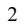

{2}------------------------------------------------

### **FORWARD-LOOKING STATEMENTS**

This Annual Report on Form 10-K contains forward-looking statements. These forward-looking statements generally can be identified by the use of words such as "anticipate," "believe," "could," "estimate," "expect," "forecast," "goal," "intends," "may," "plan," "potential," "project," "will," "would," and similar expressions, although not all forwardlooking statements contain these identifying words. These forward-looking statements address various matters, including the Company's strategy, future operations, future financial position, future revenues, changing reimbursement levels from government payers and private insurers, projected costs, prospects and plans, and objectives of management. We may not actually achieve the plans, intentions or expectations disclosed in our forward-looking statements and you should not place undue reliance on our forward-looking statements. These forward-looking statements involve known and unknown risks and uncertainties that could cause our actual results, performance or achievements to differ materially from those expressed or implied by the forward-looking statements, including, without limitation, the risks set forth below under "Risk Factors Summary" and in Part I, Item 1A, "Risk Factors" in this Annual Report on Form 10-K as filed with the Securities and Exchange Commission (the "SEC").

The forward-looking statements included in this Annual Report on Form 10-K speak only as of the date of this report, and the Company undertakes no obligation to update any forward-looking statement or statements to reflect events or circumstances after the date on which such statement is made or to reflect the occurrence of unanticipated events. New factors emerge from time to time and it is not possible for management to predict all of such factors, nor can it assess the impact of each such factor on the business or the extent to which any factor, or combination of factors, may cause actual results to differ materially from those contained in any forward-looking statements.

#### **Trademarks**

The "NeoGenomics", "Genoptix", "Clarient", and "Inivata" company names and logos have been trademarked with the United States Patent and Trademark Office. We have trademarked or have applications pending for the brand names NEOARRAY, NEOLAB, NEOLINK, NEOSITE, NEOTYPE, CHART, COMPASS, FLEXREPORT, HEMEFISH, MULTIOMYX, NEOVUE, NEONET, NEOPATH, NEOSCORE, NEOACCELERATE, NEOENGAGE, NEOPIXEL, NEONUCLEUS, NEOUNIVERSITY, PATHSITE, QUICKPATH, TAM-SEQ, ETAM-SEQ, INVISION, INVISIONFIRST, INVISIONSCAN, INVISIONFIRST-LUNG, RADAR, and NEORADAR. We also have trademarked or have pending trademarks for the marketing slogans "TAKING CANCER PERSONALLY", "UNIVERSAL FUSION EXPRESSION", "NEOGENOMICS EUROPE", and "WHERE PASSION MEETS PURPOSE". Any other trademarks, registered marks and trade names appearing in this annual report on Form 10-K are the property of their respective holders.

| 3 |  |  |
|---|--|--|
|   |  |  |
|   |  |  |
|   |  |  |

{3}------------------------------------------------

#### **PART I**

#### **ITEM 1. BUSINESS**

*NeoGenomics, Inc., a Nevada corporation (referred to individually as the "Parent Company" or collectively with its subsidiaries as "NeoGenomics", "we", "us", "our", or the "Company" in this Annual Report) is the registrant for SEC reporting purposes. Our common stock is listed on The Nasdaq Stock Market LLC ("Nasdaq") under the symbol "NEO".*

#### **Overview**

We provide a wide range of oncology diagnostic testing and consultative services which include technical laboratory services and professional interpretation of laboratory test results by licensed physicians who specialize in pathology and oncology. We operate a network of cancer-focused testing laboratories in the United States, Europe and Asia. Our mission is to save lives by improving patient care. Our vision is become the world's leading cancer testing, information, and decision support company by providing uncompromising quality, exceptional service, and innovative solutions.

As of December 31, 2022, the Company operated College of American Pathologists ("CAP") accredited and Clinical Laboratory Improvement Amendments of 1988 ("CLIA") certified laboratories in Fort Myers, Florida; Aliso Viejo and San Diego, California; Research Triangle Park, North Carolina; and Houston, Texas; and CAP accredited fullservice, sample-processing laboratories in Rolle, Switzerland; Singapore and China. CAP accreditation is pending in Cambridge, United Kingdom. We also have several, small, non-processing laboratory locations across the United States for providing analysis services. We currently offer the following types of testing services:

- Cytogenetics ("karyotype analysis") the study of normal and abnormal chromosomes and their relationship to disease. Cytogenetics involves analyzing the chromosome structure to identify changes from patterns seen in normal chromosomes. Cytogenetic studies are often performed to provide diagnostic, prognostic and occasionally predictive information for patients with hematological malignancies.
- Fluorescence In-Situ Hybridization ("FISH") a molecular cytogenetic technique that focuses on detecting and localizing the presence or absence of specific DNA sequences and genes on chromosomes. The technique uses fluorescent probes that bind to only those parts of the chromosome with which they show a high degree of sequence similarity. Fluorescence microscopy is used to visualize the fluorescent probes bound to the chromosomes. FISH can be used to help identify numerous types of gene alterations, including amplifications, deletions, and translocations.
- Flow cytometry a technique utilized to measure the characteristics of cell populations. Typically performed on liquid samples such as peripheral blood and bone marrow aspirate, it may also be performed on solid tissue samples such as lymph nodes following additional processing steps. Cells are labeled with selective fluorescent antibodies and analyzed as they flow in a fluid stream through a beam of light. The properties measured in these antibodies include the relative size, relative granularity or internal complexity, and relative fluorescence intensity. These fluorescent antibodies bind to specific cellular antigens and are used to identify abnormal and/or malignant cell populations. Flow cytometry is typically utilized in diagnosing a wide variety of hematopoietic and lymphoid neoplasms. Flow cytometry is also used to monitor patients during the course of therapy to identify extremely low levels of residual malignant cells, known as minimal residual disease ("MRD") monitoring.
- Immunohistochemistry ("IHC") and Digital Imaging the process of localizing cellular proteins in tissue sections and relies on the principle of antigen-antibody binding. IHC is widely used in the diagnosis of abnormal cells such as those found in cancer. Specific surface membrane, cytoplasmic, or nuclear markers may be identified. IHC is also widely used to understand the distribution and localization of differentially expressed proteins. Digital imaging allows clients to visualize scanned slides and also perform quantitative analysis for certain stains. Scanned slides are received online in real time and can be previewed often a full day before the glass slides can be shipped back to clients.
- Molecular testing a rapidly growing field which includes a broad range of laboratory techniques utilized in cancer testing. Most molecular techniques rely on the analysis of DNA and/or RNA, as well as the structure and function of genes at the molecular level. Molecular testing technologies include: liquid biopsy tests for advanced non-small cell lung cancer, all solid tumor types (pan-cancer), and certain breast cancer cases; DNA fragment length analysis; polymerase chain reaction ("PCR") analysis; reverse transcriptase polymerase chain reaction ("RT-PCR") analysis, real-time (or quantitative) polymerase chain reaction ("qPCR") analysis; bidirectional Sanger sequencing analysis; and next-generation sequencing ("NGS") analysis.
- Morphologic analysis the process of analyzing cells under the microscope by a pathologist, usually for the purpose of diagnosis. Morphologic analysis may be performed on a wide variety of samples, such as peripheral blood, bone marrow, lymph node, and from other sites such as lung, breast, etc. The services provided at NeoGenomics may

{4}------------------------------------------------

include primary diagnosis, in which a sample is received for processing and our pathologists provide the initial diagnosis; or may include secondary consultations, in which slides and/or tissue blocks are received from an outside institution for second opinion. In the latter setting, the expert pathologists at NeoGenomics assist our client pathologists on their most difficult and complex cases.

### Reportable Segments

We have analyzed our reporting structure, the information available to our Chief Operating Decision Maker ("CODM") and the information being used to make strategic decisions and have identified two primary types of customers: Clinical and Pharma. Our Clinical customers include community-based pathology and oncology practices, hospital pathology labs, reference labs, and academic centers. Our Pharma customers include pharmaceutical companies to whom we provide testing and other services to support their research studies and clinical trials.

In 2022, our Clinical Services segment accounted for 82% of consolidated revenue and our Pharma Services segment accounted for 18% of consolidated revenue. Please refer to Note 20. Segment Information, to our Consolidated Financial Statements included in this Annual Report for further financial information about these segments.

#### *Clinical Services Segment*

The clinical cancer testing services we offer to community-based pathologists and oncologists are designed to be a natural extension of, and complementary to, the services that they perform within their own practices. We believe our relationship as a non-competitive partner to community-based pathology practices, hospital pathology labs, reference labs, and academic centers can empower them to expand their breadth of testing to provide a menu of services that could match or exceed the level of service found in any center of excellence around the world. Community-based pathology practices and hospital pathology labs may order certain testing services on a technical component only ("TC" or "tech-only") basis, which allows them to participate in the diagnostic process by performing the professional component ("PC") interpretation services without having to hire laboratory technologists or purchase the sophisticated equipment needed to perform the technical component of the tests. We also support our pathology clients with interpretation and consultative services using our own specialized team of pathologists for difficult or complex cases and we provide overflow interpretation services when requested by clients.

We are a leading provider of Molecular and NGS testing. These tests are interpreted by NeoGenomics' team of Molecular experts and are often ordered in conjunction with other testing modalities. NGS panels are one of our fastest growing testing areas and clients can often receive a significant amount of biomarker information from very limited samples. These comprehensive panels can allow for faster treatment decisions for patients as compared to a series of single-gene molecular tests being ordered sequentially. We have a broad Molecular testing menu and our targeted NeoTYPE panels include genes relevant to a particular cancer type. These tests are complemented by IHC and FISH tests. In addition, we offer molecular-only NGS targeted and comprehensive panels which combine DNA and RNA into a single work stream in order to report a full spectrum of genomic alterations, including mutations, fusions, copy number variations, and gene expression. This comprehensive menu means that our clients can get most of their oncology testing needs satisfied by our laboratory. This is attractive to our clients as patient samples do not need to be split and then managed across several laboratories. The acquisition of Inivata provided us with oncology Liquid Biopsy technology capabilities. InVisionFirst -Lung is a highly sensitive, targeted plasma-based assay for patients with non-small cell lung cancer, and RaDaR is an industry-leading liquid biopsy assay designed to detect residual disease and recurrence in plasma samples from patients with solid tumor malignancies. We expect our Molecular laboratory and NGS capabilities to be a key growth driver in the coming years. ® ®

In addition, we directly serve oncology, dermatology and other clinician practices that prefer to have a direct relationship with a laboratory for cancer-related genetic testing services. We typically serve these types of clients with a comprehensive service offering where we perform both the technical and professional components of the tests ordered. In certain instances, larger clinician practices have begun to internalize pathology interpretation services, and our tech-only service offering allows these larger clinician practices to also participate in the diagnostic process by performing the PC interpretation services on TC testing performed by us.

#### *Pharma Services Segment*

Our Pharma Services revenue consists of the following three revenue streams:

- Clinical trials and research;
- Validation laboratory services; and
- Informatics.

Our Pharma Services segment supports pharmaceutical firms in their drug development programs by supporting various clinical trials and research. This portion of our business often involves working with the pharmaceutical firms ("sponsors")

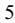

{5}------------------------------------------------

on study design as well as performing the required testing. Our medical team often advises the sponsor and works closely with them as specimens are received from the enrolled sites. We also work on developing tests that will be used as part of a companion diagnostic to determine patients' response to a particular drug. As studies unfold, our clinical trials team reports the data and often provides key analysis and insights back to the sponsors.

Our Pharma Services segment provides comprehensive testing services in support of our pharmaceutical clients' oncology programs from discovery to commercialization. In biomarker discovery, our aim is to help our customers discover the right content. We help our customers develop a biomarker hypothesis by recommending an optimal platform for molecular screening and backing our discovery tools with the informatics to capture meaningful data. In other pre-clinical and non-clinical work, we can use our platforms to characterize markers of interest. Moving from discovery to development, we seek to help our customers refine their biomarker strategy and, if applicable, develop a companion diagnostic pathway using the optimal technology for large-scale clinical trial testing.

Whether serving as the single contract research organization or partnering with one, our Pharma Services team provides significant technical expertise, working closely with our customers to support each stage of clinical trial development. Each trial we support comes with rapid turnaround time, dedicated project management and quality assurance oversight. We have experience in supporting submissions to the Federal Drug Administration ("FDA") for companion diagnostics. Our Pharma Services strategy is focused on helping to bring more effective oncology treatments to market through providing world-class laboratory services in oncology to key pharmaceutical companies in the industry.

We believe that we are well positioned to service Pharma sponsors across the full continuum of the drug development process. Our Pharma Services team can work with these sponsors during the basic research and development phase as compounds come out of translational research departments, as well as work with clients from Phase I, Phase II and Phase III clinical trials as the sponsors work to demonstrate the efficacy of their drugs. The laboratory biomarker tests that are developed during this process may become companion diagnostic ("CDx") tests, that will be used on patients to determine if they could respond to a certain therapy. We are able to offer these CDx tests to the market immediately after FDA approval as part of our Day 1 readiness program. This ability helps to speed the commercialization of a drug and can enable Pharma sponsors to reach patients through our broad distribution channel in the Clinical Services segment.

We are committed to connecting patients with life-altering therapies and trials. In carrying out these commitments, we aim to provide transparency and choice to patients regarding the handling and use of their data through our Notice of Privacy Practices, and have invested in leading technologies to ensure the data we maintain is secure at all times. We are continuing to develop and broaden our informatics and data-related tools to leverage our unique market position and oncology expertise to help our stakeholders solve real-world problems such as identifying patients for clinical trials or providing clinical decision support tools for physicians and providers.

#### Markets

The medical testing laboratory market can be broken down into the following three primary markets:

- Clinical Pathology testing;
- Anatomic Pathology testing; and
- Genetic and Molecular testing.

Clinical Pathology testing covers high volume, highly automated, lower complexity tests on easily procured specimens such as blood and urine. Clinical Pathology tests often involve testing of a less urgent nature, for example, cholesterol testing and testing associated with routine physical exams.

Anatomic Pathology testing involves evaluation of tissue, as in surgical pathology, or cells as in cytopathology. The most widely performed Anatomic Pathology procedures include the preparation and interpretation of pap smears, skin biopsies, and tissue biopsies.

Genetic and Molecular testing typically involves analyzing chromosomes, genes, proteins, and/or DNA/RNA sequences for abnormalities. Genetic and molecular testing requires highly specialized equipment and credentialed individuals (typically MD or PhD level) to certify results and typically yields the highest reimbursement levels of the three market segments.

NeoGenomics operates primarily in the Genetic and Molecular testing market. We also act as a reference laboratory supplying Anatomic Pathology testing.

The field of cancer genetics is evolving rapidly and new tests continue to be developed at an accelerated pace. Based on medical and scientific discoveries over the last decade, cancer testing falls into one of three categories: diagnostic testing, prognostic testing and predictive testing. Of the three, the fastest growing area is predictive testing, which is utilized by

{6}------------------------------------------------

clinicians to predict which treatment options a patient will be most likely to benefit from in order to deliver "personalized or precision medicine" that is optimized to that patient's particular circumstances. Personalized or precision medicine better allows clinicians to know if a patient will or will not respond to certain cancer medications like Herceptin®, Keytruda®, PIQRAY®, and Opdivo®, among many others. In addition to the direct benefits to patients, the "precision medicine" approach allows the healthcare system to save money by ensuring that expensive cancer drugs are only given to those who will be most likely to benefit from them. This type of testing improves patient care and potentially saves lives by identifying optimized therapies much more rapidly than what was possible in previous years.

The U.S. market for genetic and molecular testing is divided among numerous laboratories. Many of these laboratories are attached to academic institutions and primarily provide clinical services to their affiliated university hospitals and associated physicians.

We believe several key factors are influencing the rapid growth in the market for cancer testing: (i) every year, more and more genes and genomic pathways are implicated in the development and/or clinical course of cancer; (ii) cancer is primarily a disease of the elderly – one in four senior citizens is likely to develop some form of cancer during the rest of their lifetime once they turn sixty, and now that the baby boomer generation has started to reach this age range, the incidence rates of cancer are rising; (iii) increasingly, new drugs are being targeted to certain cancer subtypes and pathways which require companion diagnostic testing; (iv) patient and payer awareness of the value of genetic and molecular testing; (v) decreases in the cost of performing genetic and molecular testing; (vi) increased coverage from third party payers and Medicare for such testing; and (vii) the health insurance coverage to uninsured Americans under the Patient Protection and Affordable Care Act as amended by the Health Care and Education Reconciliation Act, each enacted in March 2010. These factors have driven significant growth in the market for this type of testing. Additionally, there is an increased focus on developing tests for monitoring purposes, including MRD and recurrence detection in cancer survivors, which could also broaden the use of certain tests and influence the market for cancer testing.

### **2023 Focus Areas:**

We are committed to sustainable growth while transforming cancer care for patients and providers. Our focus for 2023 is to sustain a purpose driven culture that maintains excellence in service and performance while growing through innovation. We expect the following initiatives to allow the Company to continue on its path to become one of the world's leading cancer testing and information companies:

### Profitably Grow Core Business

- Grow volume and NGS mix;
- Improve turnaround time;
- Win on service;
- Expand and optimize commercial optimization; and
- Improve product offering.

### Accelerate Advanced Diagnostics

- Execute clinical RaDaR™ (MRD) launch;
- Launch Neo Comprehensive, new NGS offering;
- Continue to improve Pharma growth and profitability; and
- Focus on enterprise data strategy.

#### Improve Profitability

- Increase productivity and efficiency;
- Manage general and administrative spend;
- Focused investments; and
- Prioritize revenue cycle management.

#### **Competitive Strengths**

In addition to the competitive strengths discussed below, we believe that our superior testing technologies and instrumentation, laboratory information system, client education programs and broad domestic and international presence also differentiates NeoGenomics from its competitors.

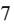

{7}------------------------------------------------

#### Turnaround Times

We consistently focus on improving turnaround times for test results to our clients nationwide in the Clinical Services segment. By providing information to our clients in a timely manner, physicians can begin treating their patients as soon as possible. Timeliness of results by our Clinical Services segment is a driver of additional testing requests by referring physicians. Turnaround times allow for the performance of other adjunctive tests within an acceptable diagnosis window in order to augment or confirm results and more fully inform treatment options. Additionally, we believe that our rapid turnaround time on testing and our project milestones are a key factor in our Pharma Services segment.

#### Innovative Service Offerings

We believe we currently have the most extensive menu of tech-only FISH services in the country as well as extensive and advanced tech-only flow cytometry and IHC testing services. These types of testing services allow the professional interpretation component of a test to be performed and billed separately by our physician clients. Our tech-only services are designed to give pathologists the option to choose, on a case by case basis, whether they want to order only the technical component of testing so they can perform the professional interpretation, or order "global" services and receive a comprehensive test report which includes a NeoGenomics pathologist's interpretation of the test results. Our clients appreciate the flexibility to access NeoGenomics' medical staff for difficult or complex cases or when they are otherwise unavailable to perform professional interpretations.

We offer a comprehensive suite of technical and professional interpretation services to meet the needs of clients who are not credentialed and/or trained in interpreting various testing modalities and who require Neo pathology specialists to interpret their testing results. In our global service offerings, our lab performs the technical component of testing and our MDs and PhDs provide the professional component of testing by interpreting the results of those tests. Our professional staff is also available for post-test consultative services. Clients using our global service offering rely on the expertise of our medical team to give them the answers they need in a timely manner to help inform their diagnoses and treatment decisions.

Our Molecular and NGS test menus provide clients with the ability to order single gene molecular tests, targeted NeoTYPE panels that include the relevant actionable genes for a particular cancer type as well as large NGS panels. Our Pharma Services segment offers a full range of sequencing testing including whole exome and whole genome sequencing.

#### National Direct Sales Force

Our direct sales force has been trained extensively in cancer genetic testing and consultative selling skills to service the needs of clients. Our sales team for the clinical cancer testing services is organized into nine regions – Northeast, Northwest, Mid-Atlantic, South, Southeast, Southwest, West, Great Lakes, and South Central. Our sales team will be focused on end-to-end client experience as a growth driver. Our Pharma Services segment has a dedicated team of business development specialists who are experienced in working with Pharma sponsors and helping them with the testing needs of their research and development projects as well as Phase I, II and III studies. These sales representatives utilize our custom Customer Relationship Management System ("CRM") to manage their territories, and we have integrated the key customer care functionality within our Laboratory Information Services ("LIS") into the CRM so that our sales representatives can stay informed of emerging issues and opportunities within their regions. Our in-house customer care team is aligned with our field sales team to serve the needs of our clients by utilizing the same LIS and CRM. Our field teams can see in real-time when a client calls the laboratory, the reason for the call, the resolution, and if face-to-face interaction is needed for follow-up. Our sales force educates clients on new test offerings and their proper utilization and our representatives are often seen as trusted advisors by our clients.

#### **Seasonality**

The majority of our clinical testing volume is dependent on patients being treated by hematology/oncology professionals and other healthcare providers. The volume of our testing services generally declines modestly during the summer vacation season, year-end holiday periods and other major holidays, particularly when those holidays fall during the middle of the week. In addition, the volume of our testing tends to decline due to extreme adverse weather conditions, such as excessively hot or cold spells, heavy snow, hurricanes or tornadoes in certain regions, consequently reducing revenues and cash flows in any affected period.

In our Pharma Services segment, we enter into both short-term and long-term contracts, ranging from one month to several years. While the volume of this testing is not as directly affected by seasonality as described above, the testing volume does vary based on the terms of the contract. Our volumes are often based on how quickly sponsors can get patient enrollees for their trials and seasonality can impact how quickly patients are enrolled. Many of our long-term contracts contain specific performance obligations where the testing is performed on a specific schedule. In addition, this results in backlog that can be

{8}------------------------------------------------

significant and highly dependent on Pharma clinical trial enrollment, which continues to recover from the slowdown experienced due to the COVID-19 pandemic.

#### **Competition**

For our Clinical Services segment, the genetic and molecular testing niche of the laboratory testing industry is highly competitive and, given the opportunities in this industry, we expect it to become even more competitive. Competitive factors in genetic and molecular testing generally include the reputation of the laboratory, range of services offered, pricing, convenience of sample collection and pick-up, quality of analysis and reporting, medical staff, timeliness of delivery of completed reports (i.e. turnaround times) and post-reporting follow-up for clients.

Our competitors for our Clinical Services segment in the United States are numerous and include major national medical testing laboratories, hospital laboratories and in-house physician laboratories. Some of our competitors have greater financial resources and production capabilities than us. These companies may succeed in developing service offerings that are more effective than any that we have or may develop, and may also prove to be more successful than we are in marketing such services. In addition, technological advances or different approaches developed by one or more of our competitors may render our service offerings obsolete, less effective or uneconomical.

We intend to continue our efforts to gain market share by offering rapid turnaround times, a broad service menu, high-quality test reports, new tests including proprietary ones, enhanced post-test consultation services, and personal attention from our direct sales force. In addition, we believe our flexible reporting solutions, which enable clients to report out customized results in a secure, real-time environment, will allow us to continue to gain market share.

Our Pharma Services business competes against many other Contract Resource Organizations ("CROs") and central reference laboratories. Many of these competitors are much larger and have a greater international presence than we do. Over the past few years, we have expanded our Pharma Services business into Europe and Asia at the request of our clients and we believe that our expansive oncology testing menu and our high level of service along with our international expansion will allow us to continue to gain market share in this segment.

Our Pharma Services segment competitors are numerous CROs. These competitors are larger than NeoGenomics and have global operations including operations in some regions where we do not yet have service capabilities. These laboratories may be more effective than us in gaining business for global clinical trials. Many clinical reference laboratories have also entered the space in support of clinical trials and the related laboratory testing. These reference laboratories are often willing to compete with lower pricing for smaller, more limited studies. We believe our strong scientific and medical team is a key differentiator where NeoGenomics is used as an advisor to the sponsors on their trials. Our extensive experience in anatomic pathology continues to result in our winning clinical trials business as sponsors trust our medical team and want them to closely oversee their trials. We believe our service focus and our molecular and IHC platforms, as well as our exclusive MultiOmyx platform will continue to lead to rapid growth in this segment. TM

#### **Suppliers**

We order our laboratory and research supplies from large national laboratory supply companies. While we do not depend on a concentrated, limited number of suppliers, we do rely on certain suppliers for specific reagents or other equipment, including sequencers. We have experienced increase in supply chain disruptions and delays in obtaining reagents and basic laboratory supplies in 2021 and 2022. While we do not believe a short-term disruption from any one of these suppliers would have a material effect on our business, it could result in short-term impact on our turnaround time or gross margin depending on the nature of or extent of the disruption.

#### **Concentrations of Credit Risk**

Concentrations of credit risk with respect to revenue and accounts receivable are primarily limited to certain clients to which we provide a significant volume of our services, and to specific payers of our services such as Medicare and individual insurance companies.

#### Dependence on Major Clients

We market our services to pathologists, oncologists, other clinicians, hospitals, pharmaceutical companies, academic centers and other clinical laboratories throughout the United States, Europe and Asia. Our client base consists of a large number of geographically dispersed clients diversified across various customer types. For the years ended December 31, 2022, 2021 and 2020, no single client accounted for more than 10% of revenue.

{9}------------------------------------------------

### Payer Mix

The following table reflects our estimate of the breakdown of net clinical revenue by type of payer for the years ended December 31, 2022, 2021 and 2020:

|                               | 2022  | 2021  | 2020  |
|-------------------------------|-------|-------|-------|
| Client direct billing         | 67 %  | 63 %  | 63 %  |
| Commercial insurance          | 17 %  | 19 %  | 20 %  |
| Medicare and other government | 16 %  | 18 %  | 17 %  |
| Total                         | 100 % | 100 % | 100 % |

All of our Pharma Services revenue is billed directly to clients or the pharmaceutical sponsor.

#### **Insurance**

We maintain professional liability and numerous other insurance policies. We believe that our present insurance is sufficient to cover currently estimated exposures, but we cannot assure that we will not incur liabilities in excess of the policy coverage limits. In addition, although we believe that we will be able to continue to obtain adequate insurance coverage, we cannot assure that we will be able to do so at acceptable cost.

#### **Available Information**

Our internet website address is www.neogenomics.com. Our Annual Report on Form 10-K, Quarterly Reports on Form 10-Q, Current Reports on Form 8-K, and amendments to those reports filed or furnished pursuant to Section 13(a) or 15(d) of the Securities Exchange Act of 1934, as amended (the "Exchange Act"), are available free of charge through our website as soon as reasonably practicable after we electronically file with or furnish them to the SEC and are available in print to any stockholder who requests a copy. Information on our website shall not be deemed incorporated into, or to be part of, this Annual Report on Form 10-K.

Additionally, the SEC maintains a website that contains reports, proxy statements, information statements, and other information regarding issuers, including us, that file electronically with the SEC at www.sec.gov.

#### **Human Capital Management**

As of December 31, 2022, we had approximately 2,100 full-time equivalent employees and contracted pathologists.

#### World-Class Medical and Scientific Team

Our team of medical professionals and PhDs are specialists in the field of genetics, oncology and pathology. As of December 31, 2022, we employed or contracted with approximately 170 MDs and PhDs. We have many nationally and world-renowned pathologists on staff, which is a key differentiator from many smaller laboratories. Our clinical customers look to our staff and their expertise and they often call our medical team on challenging cases. For our Pharma Services segment, many sponsors work with our medical team on their study design and on the interpretation of results from the studies. Our medical team is a key differentiator as we have a depth of medical expertise that many other laboratories cannot offer to pharmaceutical companies.

#### World-Class Culture

We promote a World-Class Culture through Employee Engagement, Training and Development, Wellness, Work-Life Balance, and Communication initiatives. Human capital management, including the recruitment and retention of a talented, diverse and highly motivated workforce, is an essential component of our strategy for long-term value creation. Our active approach to human capital management values and promotes diversity, development, and equal opportunity, among many other factors.

Our commitment to maintaining an excellent workplace includes investing in ongoing opportunities for employee development in a diverse and inclusive environment. In addition to gender and ethnic diversity and inclusion on our Board, diversity in gender and ethnicity is well-established within our workforce. As of December 31, 2022, women make up 58.0% of our global workforce, 19.0% of our workforce is in supervisory or higher positions, and of that 19.0%, 57.0% are female. With regard to the Company's top two management tiers, 68% of our executive team and our vice presidents are women and 33.0% of our Board of Directors are women. Ethnicity is also strongly represented: 54.0% of our workforce and 22.0% of our Board of Directors are ethnically diverse.

{10}------------------------------------------------

We believe that a diverse and inclusive workforce, where all perspectives are recognized and respected, positively impacts our performance and strengthens our culture. We continuingly strive to promote a workplace in which people of diverse race, ethnicity, veteran status, marital status, socio-economic level, national origin, religious belief, physical ability, sexual orientation, age, class, political ideology, gender identity and expression participate in, contribute to, and benefit equally.

We are also committed to rewarding, supporting and developing our employees as they work toward our common purposes of saving lives by improving patient care. To that end, we offer a competitive comprehensive rewards package that includes competitive salaries, performance-based bonuses, equity grants, healthcare benefits, retirement savings plans, paid family leave, paid time off, wellness programs and discounts, tuition reimbursement and an Employee Assistance Program. We also drive high levels of performance and improvement by prioritizing training and development, and we motivate and develop our employees by providing them with opportunities for advancement and offering robust onsite and remote learning opportunities for employees at every stage in their career.

Our employees' health and safety is also important to us. During the COVID-19 pandemic, we took measures to support our employees, including de-densifying our laboratories and facilities, adjusting laboratory shifts, restricting visitors to facilities, restricting employee travel, implementing an emergency paid time off policy, and providing remote work-environment training and support.

#### **Government Regulation**

The laboratory industry is subject to extensive governmental regulation domestically, at the federal and state levels, and internationally. The applicable laws and regulations change frequently and there can be no assurance that the Company will not be subject to audit, inquiry, or investigation with respect to some aspect of its operations. The failure to comply with applicable laws, regulations, and reimbursement guidelines could have a material adverse effect on the Company's business. Significant areas of regulation are summarized below.

#### **Licensure, Accreditation, and Quality Standards**

The Company operates laboratories domestically in Arizona, California, Florida, Georgia, Illinois, North Carolina, Tennessee, and Texas, and internationally in China, Singapore, Switzerland and United Kingdom. The laboratories are licensed as required by the states or countries in which they are located. In addition, the laboratories in Fort Myers, Florida; Aliso Viejo and Carlsbad, California; Nashville, Tennessee; and Houston, Texas are licensed by the State of New York as the laboratories accept clinical specimens obtained in New York. All of our domestic laboratories are certified in accordance with the Clinical Laboratory Improvement Amendments of 1988 ("CLIA"). Under CLIA, the Centers for Medicare & Medicaid Services ("CMS") establishes various operational, personnel, facilities, administration, quality, and proficiency requirements for testing performed by a laboratory, intended to ensure testing services are accurate, valid, and timely. CLIA certification is also a prerequisite to be eligible to bill federal and state health care programs, as well as many private insurers, for laboratory testing services. The sanctions for failure to comply with CLIA requirements include: suspension, revocation, or limitation of a laboratory's CLIA certificate, which is necessary to conduct business; cancellation or suspension of the laboratory's approval to receive Medicare and/or Medicaid reimbursement; and significant fines and/or criminal penalties. The loss or suspension of a CLIA certification could have a material adverse effect on the Company.

Certain Company laboratories are also accredited by the College of American Pathologists ("CAP"), including our laboratories in Cambridge, United Kingdom; Rolle, Switzerland; Singapore; and Suzhou, China, and actively participate in CAP's proficiency testing programs for all tests offered by the Company. CAP's proficiency testing programs require participating laboratories to test specimens that they receive from an approved testing entity and return the results. The testing entity conducting the program analyzes the results and provides to the Company a quality control report assessing the results.

The Company has a Quality Management System and we strive to conduct our business in a manner that meets applicable regulatory and accreditation requirements and industry standards. The quality of care provided to clients and their patients is of paramount importance to us. We maintain quality control processes, including standard operating procedures, controls, performance measurement and reporting mechanisms. Our employees are committed to providing accurate, reliable, and consistent services. Any concerns regarding the quality of testing or services provided by the Company are quickly communicated to our Company management. We also frequently revise and improve our tests and we work with laboratory equipment vendors to help ensure that our laboratory has the highest possible quality.

Compliance with licensure, accreditation, and quality standards are verified through periodic inspections by agents of relevant regulatory agencies and accrediting organizations, and we believe we are in material compliance with all licensure, accreditation, and quality requirements.

{11}------------------------------------------------

### Compliance and Ethics Program

The health care industry is highly regulated and scrutinized with respect to fraud, abusive billing practices, and improper financial relationships between health care companies and their referral sources. The Office of Inspector General of the Department of Health and Human Services ("OIG") has published compliance program guidance, including the Compliance Program Guidance for Clinical Laboratories in August of 1998, fraud alerts, and advisory opinions. The Company has implemented a robust Compliance & Ethics Program encompassing this guidance, which is overseen by our Board of Directors, to support compliance with the myriad of international, federal, and state laws, regulations, and governmental guidance applicable to our business. Our program employs a risk-based approach to the development and implementation of standards of conduct, training and education of employees, monitoring and auditing Company practices, investigation, and response to reported or detected compliance issues. The Company provides a hotline for employees who wish to anonymously or confidentially report suspected violations of our codes of conduct, policies and procedures, or laws and regulations. Employees are strongly encouraged to report suspected violations. The hotline does not replace other resources available to our employees, including supervisors, managers, and human resources staff but is an alternative channel available 24 hours a day, 365 days a year. The hotline forwards all reports to the Chief Compliance Officer, who is responsible for investigating, reporting to the Compliance Committee, and documenting the disposition of each report. The hotline forwards any calls pertaining to the financial statements or financial issues to the Chairman of the Audit Committee. The Company does not allow any retaliation against an employee who reports a compliance related issue in good faith.

The Board of Directors has a Compliance Committee that meets regularly to discuss all compliance-related issues that may affect the Company. The Company reviews its policies and procedures as new regulations and interpretations come to light to comply with applicable regulations. The Chief Compliance Officer reports quarterly to the Compliance Committee on the effectiveness of the program.

#### Laboratory Developed Tests

The FDA has regulatory responsibility over instruments, test kits, reagents, and other medical devices used by clinical laboratories to perform diagnostic testing. High complexity and CLIA-certified laboratories such as ours frequently develop testing procedures intended exclusively for use by the developing laboratory to provide diagnostic results to customers. These tests are referred to as laboratory developed tests ("LDTs"). The regulatory framework governing LDTs is evolving, complex, and has been the subject of ongoing debate. LDTs are subject to CMS oversight through its enforcement of CLIA. The FDA has also claimed regulatory authority over LDTs but has generally exercised enforcement discretion with regard to most LDTs offered by high complexity CLIA-certified laboratories and has not subjected these tests to FDA rules and regulations governing medical devices, including premarket review requirements. In 2014, FDA issued draft guidance announcing that it would end its historical policy of enforcement discretion regarding LDTs and outlining the first of multiple frameworks that have been proposed for their regulation. FDA announced in 2016 that it no longer planned to finalize its draft guidance and that it would continue to exercise enforcement discretion with respect to LDTs. On January 13, 2017, the FDA published a nonbinding "Discussion Paper" proposing a framework of LDT oversight largely consistent with the draft guidance, "to spur further dialogue" and give "congressional authorizing committees the opportunity to develop a legislative solution." Recent agency announcements made in the context of the coronavirus ("COVID-19") public health emergency have produced a shifting policy landscape and further uncertainty regarding the FDA's role in regulating LDTs: in August 2020, the Department of Health and Human Services ("HHS") announced that the FDA would not require premarket review of LDTs absent notice-and-comment rulemaking, but in November 2021, HHS issued a statement withdrawing that prior announcement, indicating a return to FDA's longstanding approach to the regulation and enforcement discretion toward LDTs.

Congress has also considered a number of legislative proposals in recent years that would amend the regulatory framework for LDTs, including, among other requirements, FDA premarket review of certain LDTs. The most recent such proposal, the Verifying Accurate Leading-edge IVCT Development ("VALID") Act, was introduced in both the House and Senate on June 24, 2021. The VALID Act was expected to be included in the Omnibus bill signed at the end of 2022, but ultimately was not included and as such, it remains unclear whether the VALID Act will be passed 2023 or whether FDA will proceed through rulemaking. It is possible that legislation and resulting FDA regulation may result in increased regulatory burdens and costs for us to seek marketing authorization for and maintain ongoing compliance for our existing tests, any modifications thereto, or any future tests we may develop. We cannot be certain as to which of our tests, if any, would require FDA approval or clearance under any of the proposed frameworks and, if required, that our tests could obtain such approval or clearance.

#### Laws Governing Source Relationships

The federal laws governing Medicare, Medicaid, and other federal health benefits, as well as other state and federal laws, regulate certain aspects of the relationships between health care providers, including clinical laboratories, and their referral

{12}------------------------------------------------

sources, including physicians, hospitals, other laboratories, and other entities. We are subject to the federal Anti-Kickback Statute ("AKS"), which is a criminal felony statute, as well as similar state statutes and regulations, which prohibits the knowing and willful offer, payment, solicitation, or receipt of any form of remuneration in return for referring, ordering, leasing, purchasing, or arranging for or recommending the ordering, purchasing, or leasing of items or services payable by Medicare, Medicaid, or any other federally funded healthcare program. Remuneration has been broadly interpreted to include anything of value, in cash or in kind, and thus can implicate financial relationships including payments not commensurate with fair market value, such as in the form of personnel, supplies, professional, or technical services, or anything else of value. . If we are found to be in violation of the AKS or a similar state anti-kickback law, we could be subject to significant penalties, including fines, exclusion from participation in government and private payer programs, or obligations to refund amounts previously received from government payers. For additional information regarding the federal AKS and similar state anti-kickback laws, see Item 1A. Risk Factors, Risks Relating to Government Regulation and Reimbursement, "The failure to comply with Anti-Kickback laws may subject us to liability, penalties or limitation of operations."

In addition to the federal AKS, in October 2018, the U.S. Congress enacted the Eliminating Kickbacks in Recovery Act of 2018 ("EKRA"), as part of the Substance Use-Disorder Prevention that Promotes Opioid Recovery and Treatment for Patients and Communities Act ("SUPPORT Act"). EKRA is an all-payer anti-kickback law that makes it a criminal offense to pay any remuneration to induce referrals to, or in exchange for, patients using the services of a recovery home, a substance use clinical treatment facility, or laboratory. As drafted, an EKRA prohibition on incentive compensation to sales employees, payments to group purchasing organizations ("GPOs"), or group practices is broader than the federal AKS. Significantly, EKRA permits the DOJ to issue regulations clarifying EKRA's exceptions or adding additional exceptions, but such regulations have not yet been issued.

We are also subject to international laws and regulations, including the U.S. Foreign Corrupt Practices Act ("FCPA") and the U.K. Bribery Act, relating to corrupt and illegal payments to, and contracting practices with regard to, government officials and others. The scope of the types of payments or other benefits covered by these laws is very broad and regulators are frequently using enforcement proceedings to define the scope of these laws. These laws include civil penalties for enterprises and criminal penalties and imprisonment for individuals. Any violation of these laws, or allegations of such violations, could disrupt our operations, involve significant management distraction, cause us to incur significant costs and expenses, including legal fees, and result in a material adverse effect on our business. We could also suffer severe penalties, including criminal and civil penalties, disgorgement and other remedial measures. The obligation of the Company under these laws is to screen third parties who are hired to carry out certain services on behalf of the Company, to monitor for and report suspicious transactions, and to monitor direct and indirect payments to government officials and others. Because of the broad definitions of applicability of these laws, international clients or vendors working for government-owned entities are often considered to be governmental officials. The Company has implemented a program to comply with these laws and educates employees and its relevant vendors regularly on the requirements for vendor onboarding and conducting appropriate business interactions globally.

#### Physician Self-Referral Laws

The federal law referred to as the "Stark Law" prohibits payments for certain health care services, referred to as designated health services ("DHS"), rendered by entities with which referring physicians (or their immediate family members) have a financial relationship. A "financial relationship" includes both an ownership interest and/or a compensation arrangement with a physician, both direct and indirect, and DHS includes, but is not limited to, laboratory services

The Stark Law prohibits an entity that receives a prohibited DHS referral from seeking payment from Medicare and Medicaid for any DHS services performed as a result of such a referral, unless an arrangement is carefully structured to satisfy every requirement of a regulatory exception. The Company endeavors to structure its financial relationships in compliance with the Stark Law and with similar state physician self-referral laws, and performs routine audits in furtherance of this.

Many states have promulgated self-referral laws and regulations similar to the federal Stark Law, but these vary significantly based on the state. In addition to services reimbursed by Medicaid or government payers, these state laws and regulations can encompass services reimbursed by private payers and paid by self-pay patients as well. Penalties for violating state self-referral laws and regulations vary based on the state but often include civil and criminal penalties, exclusion from Medicaid, and loss of licenses. Our financial arrangements with physicians are governed by the federal Stark Law and similar state self-referral laws, and we rely on certain exceptions to the Stark Law with respect to such relationships. If we are found to be in violation of the Stark Law or a similar state self-referral law, we could be subject to significant penalties, including fines, exclusion from participation in government and private payer programs, or obligations to refund amounts previously received from government payers.

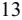

{13}------------------------------------------------

### The False Claims Act

The federal False Claims Act ("FCA") prohibits any person or entity from knowingly presenting, or causing to be presented, to the U.S. government, or to a Medicare program contractor, a false or fraudulent claim for payment, knowingly making or using a false record or statement to have a false claim paid by the government, conspiring to defraud the U.S. government, or knowingly making or using a false statement to conceal an obligation to pay the government, or improperly retaining overpayments from the government. Following enactment of the Patient Protection and Affordable Care Act ("ACA"), claims resulting from violations of the federal AKS and knowing retention of overpayments are also considered false claims and could lead to liability under the FCA. Further, FCA liability may lead to exclusion from participation in Medicare, Medicaid, and other federal healthcare programs. The FCA's "whistleblower" or "qui tam" provisions are used with frequency to challenge the reimbursement practices of providers and suppliers. These provisions allow a private individual to bring an action on behalf of the government alleging that the defendant has submitted false claims for payment to the federal government. The government must decide whether to intervene in the lawsuit and whether to prosecute the case. If it declines to do so, the individual may pursue the case alone, although the government must be kept apprised of the progress of the lawsuit. Whether or not the federal government intervenes in the case, it will receive the majority of any recovery. The successful qui tam relator who brought the case is entitled to a portion of the proceeds and its attorneys' fees and costs. As most qui tam cases are filed by current or former employees, an effective compliance program, as defined by the DOJ and OIG, plays a crucial role in reducing the Company's exposure to liability. It is also a criminal offense, under Title 18 U.S. Code, Section 287, for a person or entity to make a claim against the United States or any department or agency, knowing the claim to be false, fictitious, or fraudulent. The penalty is a fine and imprisonment of up to five years. The federal FCA has been an effective enforcement tool for the federal government and many states have enacted similar false claims acts as well.

The Company seeks to structure its arrangements with physicians and other clients to be in compliance with the AKS, Stark Law, state laws, and the FCA and to stay abreast of current developments and changes in the law and regulations. However, these laws and regulations are complex and subject to interpretation. Consequently, we are unable to ascertain with certainty that our arrangements and transactions will not be subject to scrutiny and, if scrutinized, will not result in sanctions or penalties. The Company has taken, and will continue to take, actions, including robust auditing and monitoring activities, to endeavor to ensure compliance with the myriad federal and state laws that govern our business.

#### Medicare Payment Guidelines

We have various billing arrangements with our clients and with third party payers, including the Medicare program. When the Company bills the client for all, or a portion of, a laboratory test performed, we believe these client billing arrangements are priced competitively at fair market value. These client billing arrangements may implicate the Medicare program's prohibition against charging the Medicare or Medicaid programs fees substantially in excess of the Company's usual and customary charges. Given our participation in Medicare and Medicaid, we are subject to Medicare and Medicaid regulations related to billing those programs as well as agency subregulatory guidance regarding the same, the federal Stark Law, federal and state anti-kickback statutes, and the federal FCA and state equivalents.

In light of the various federal regulations and guidance from the OIG, the Company seeks to price its products competitively while endeavoring to meet applicable statutes and regulations.

#### Environmental Health and Safety

The Company is subject to licensing and regulation under federal and state laws relating to the protection of the environment as well as human health and safety laws and regulations relating to the handling, transportation, and disposal of medical specimens, hazardous materials, and infectious and hazardous waste. Company laboratories are subject to applicable laws and regulations, primarily at the state-level, relating to the management and disposal of regulated medical wastes, including laboratory specimens, and the Company generally utilizes outside vendors for disposal of such waste materials. In addition to its comprehensive regulation of health and safety in the workplace in general, the Occupational Safety and Health Administration has established extensive requirements relating to workplace safety for healthcare employers, including clinical laboratories and other healthcare-related facilities, whose workers may be exposed to chemical hazards as well as biological, physical and safety hazards, including blood-borne pathogens such as HIV and hepatitis B and C viruses. These regulations, among other things, require work practice controls, personal protective clothing and equipment, training, medical follow-up, vaccinations, and other measures designed to minimize and mitigate exposure to, and transmission of, blood-borne pathogens and other types of hazards. For purposes of transportation, some biological materials and laboratory supplies are classified as hazardous materials and are subject to regulation by one or more of the following agencies: the U.S. Department of Transportation, the U.S. Public Health Service, the U.S. Postal Service, the Office of Foreign Assets Control, and the International Air Transport Association. Other countries where the Company conducts business have similar laws and regulations concerning the environment and human health and safety with which the Company must also comply. The

{14}------------------------------------------------

Company seeks to comply with all relevant environmental and human health and safety laws and regulations. Failure to comply could subject the Company to various administrative and/or other enforcement actions.

#### **Confidentiality and Security of Personal Information**

The Health Insurance Portability and Accountability Act of 1996 ("HIPAA") contains provisions that protect individually identifiable health information from unauthorized use or disclosure by covered entities and their business associates. The Office for Civil Rights of HHS ("OCR"), the agency responsible for enforcing HIPAA, has published regulations to address the privacy (the "Privacy Rule") and security (the "Security Rule") of protected health information ("PHI") and notification of breaches of PHI (the "Breach Notification Rule," and, collectively, the "HIPAA Rules"). The Company acts as a covered entity under HIPAA and has adopted policies and procedures designed to comply with HIPAA, including the HIPAA Rules. Many of the health care facilities and providers that refer specimens to the Company are also bound by HIPAA. HIPAA additionally requires that all providers that transmit claims for health care goods or services electronically utilize standard transaction and data sets and use standardized national provider identification codes. We believe that the Company has taken necessary steps to comply with HIPAA regulations. For example, the Company utilizes standard transaction data sets, and has obtained and implemented national provider identifiers, or NPIs, as the standard unique health identifier in filing and processing health care claims and other transactions. HIPAA violations may be subject to criminal and civil penalties.

The Health Information Technology for Economic and Clinical Health Act ("HITECH Act"), enacted as part of the American Recovery and Reinvestment Act ("ARRA"), extended the scope of HIPAA to permit enforcement against business associates, which are entities that use PHI to provide certain services on behalf of covered entities, for HIPAA for violations. The HITECH Act also established new requirements to notify the OCR of a breach of PHI, and allows the state Attorneys General to bring actions to enforce violations of HIPAA. In certain circumstances, we act as a business associate under HIPAA and could be subject to such enforcement if we were to fail to comply with HIPAA as a business associate.

In addition to the HIPAA Rules described above, the Company is subject to additional federal and state laws regarding the handling and disclosure of patient records and patient health information. Effective April 5, 2021, HHS published a final rule implementing the information blocking provisions (Information Blocking Rules) of the 21 Century Cures Act. The Information Blocking Rules prohibit covered actors, including healthcare providers, from engaging in activity that is likely to interfere with the access, exchanges, or use of electronic health information ("EHI") unless such activity falls into one of eight exceptions. The Information Blocking Rules provide for civil monetary penalties for noncompliance by healthcare IT vendors and, separately, "appropriate disincentives" for noncompliance by healthcare providers. The HIPAA Rules do not supersede state laws that may be more stringent; therefore, we are required to comply with both federal privacy and security regulations as well as varying state privacy and security laws and regulations. These laws vary widely. For example, many states have implemented genetic testing and privacy laws imposing specific patient consent requirements and limiting the disclosure of genetic test results. Penalties for violation of state laws can include sanctions against a laboratory's licensure as well as civil or criminal penalties. Additionally, private individuals may have a right of action against the Company for violations of a state's privacy laws. We believe that we are in material compliance with current state laws regarding the confidentiality of health information, and we will continue to monitor and comply with new or changing state laws. st

Further, we are subject to certain comprehensive state laws governing the processing of personal information. In particular, the California Consumer Privacy Act ("CCPA") took effect on January 1, 2020, and imposed privacy compliance obligations with regard to the personal information of California residents. This legislation created significant new requirements for identifying, managing, securing, tracking, producing, and deleting consumer personal information and granted new rights to California residents, including the right to opt out of their data being sold to a third party by the Company. The CCPA defines personal information extremely broadly as "information that identifies, relates to, describes, is capable of being associated with, or could reasonably be linked, directly or indirectly, with a particular consumer or household." Like the international privacy laws discussed below, this creates greater complexity in implementing a compliance program to support these requirements. The CCPA law became enforceable by the California Attorney General on July 1, 2020, and the Company has implemented significant mechanisms to promote compliance with this law. The CCPA's protections have been expanded by the California Privacy Rights Act ("CPRA"), which became operational in most key respects on January 1, 2023. Similar laws have been proposed or passed at the U.S. federal and state level, including the Virginia Consumer Data Protection Act, which took effect on January 1, 2023, the Colorado Consumer Protection Act, which will take effect on July 1, 2023, the Connecticut Data Privacy Act, which will take effect on July 1, 2023, and the Utah Consumer Privacy Act, which will take effect on December 31, 2023. We expect that other states will enact similar legislation in the future, and we will be required to analyze the effect of those laws on our business.

Due to the Company's international expansion, we are subject to a variety of international laws which serve to protect the personal data of individuals who are located in those countries. These laws include the European Union's General Data Protection Regulation ("GDPR"), the United Kingdom GDPR, The Swiss Federal Data Protection Act ("FADP"),

{15}------------------------------------------------

Singapore's Personal Data Protection Act ("PDPA"), China's Personal Information Protection Law ("PIPL") and similar privacy laws in other jurisdictions. These laws cover a broader range of data in addition to patient data including data of employees, clients, and other individuals whose data we hold. Like HIPAA, these laws contain regulatory requirements for both robust data privacy and security programs and require data breach reporting should personal data be used or disclosed in a manner not allowed under the laws. Penalties for violations of these laws can be significant; for instance, GDPR's maximum penalties are up to the greater of 4.0% of a company's annual global turnover or €20.0 million. Although the Company's business is conducted primarily in the United States, we do receive some samples for clinical testing from countries outside of the United States, and we collect data of individuals internationally as part of the Company's Pharma business, which obligates us to comply with these laws. We have developed privacy and security programs intended to meet these international obligations and continue to reassess and improve these programs continually.

#### **ITEM 1A. RISK FACTORS**

We are subject to various risks that may materially harm our business, financial condition, and results of operations. They are not, however, the only risks we face. Additional risks and uncertainties not presently known to us or that we currently believe not to be material may also adversely affect our business, financial condition, or results of operations. An investor should carefully consider the risks and uncertainties described below and the other information in this filing before deciding to purchase our common stock. If any of these risks or uncertainties actually occurs, our business, financial condition, or operating results could be materially harmed. In that case, the trading price of our common stock could decline or we may be forced to cease operations.

#### **Risk Factors Summary**

The following is a summary of the principal risks that could adversely affect our business, financial condition or results of operations.

#### **Risks Relating to Our Business**

- Our business is subject to rapid scientific change, which could have a material adverse effect on our business, results of operations, and financial condition.
- We face the risk of capacity constraints, which could have a material adverse effect on our business, results of operations, and financial condition.
- Increased competition, including price competition, could have a material adverse impact on our net revenues and profitability**.**
- New product development and commercialization involve a lengthy and complex process and we may be unable to develop or commercialize new products on a timely basis, or at all.
- Failure to develop, or acquire licenses for, new or improved testing technologies could materially and adversely affect our revenues.
- The potential loss or delay of our material Pharma Services customer contracts or of multiple contracts could adversely affect our results.
- Clinicians or patients using our services may sue us, and our insurance may not sufficiently cover all claims brought against us, which will increase our expenses.
- We may become involved in litigation that may materially adversely affect us.
- Our involvement with clinical trials and research services create a risk of liability.
- Our investments in marketable securities are subject to certain risks which could affect our overall financial condition, results of operations, or cash flows.
- Other manufacturers may discontinue or recall testing products used in our business.
- We depend substantially upon third parties for payment of services, which reliance could have a material adverse effect on our cash flows and results of operations.
- We may fail to protect our facilities, which could have a material adverse effect on our business, results of operations, and financial condition.
- We depend on information technology systems and maintain protected personal data, and a cyber-attack or other breach affecting these information technology systems or protected data could have a material adverse effect on our results of operations.

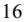

{16}------------------------------------------------

- Performance issues, service interruptions, or price increases by our shipping carrier could adversely affect our business, results of operations, and financial condition, and harm our reputation and ability to provide our specialized diagnostic services on a timely basis.
- We use biological and hazardous materials that require considerable expertise and expense for handling, storage, or disposal and may result in claims against us.

### **Risks Related to Our Common Stock and Indebtedness**

- The price of our common stock may fluctuate significantly.
- Servicing our Convertible Notes require a significant amount of cash. We may not have sufficient cash flow from our business to pay our obligations under the Convertible Notes, which could adversely affect our financial condition and operating results.
- We may not have the ability to raise the funds necessary to settle conversions of the Convertible Notes in cash or to repurchase the Convertible Notes upon a fundamental change, and our future debt may contain limitations on our ability to pay cash upon conversion or repurchase of the Convertible Notes.
- The capped call transactions may affect the value of the 2028 Convertible Notes and our common stock.
- Conversion of the Convertible Notes may dilute the ownership interest of existing stockholders or may otherwise depress the price of our common stock.

### **Risks Relating to Government Regulation and Reimbursement**

- Regulatory changes, such as proposed government regulation of Laboratory Developed Tests, could require us to conduct additional clinical trials or result in delays, result in increased costs, or the failure to obtain necessary regulatory approvals, which could harm our business.
- Healthcare reform programs may impact our business and the pricing we receive for our services.
- Changes in laws, regulations, contracting arrangements with payers, or payer policies, including steps taken by payers to control utilization and reimbursement of healthcare services, may adversely affect coverage or reimbursement for our specialized diagnostic services, which may decrease our revenues and adversely affect our results of operations and financial condition.
- Failure to comply with laws and regulations regarding laboratory licensing and operations, including CLIA environmental, health, and safety laws and regulations such as the federal Occupational Safety and Health Administration Act and the Needlestick Safety and Prevention Act, could result in fines and penalties and loss of licensure, and have a material adverse effect upon our business.
- Our net revenue will be diminished if payers do not adequately cover or reimburse our services.
- Third-party billing is extremely complicated and results in significant additional costs to us.
- Our operations are subject to strict laws prohibiting fraudulent billing and other abuse, and our failure to comply with such laws could result in substantial penalties, including exclusion from participation in Medicare, Medicaid, and other governmental payer programs.
- The failure to comply with fraud and abuse laws, including physician self-referral laws and anti-kickback laws, may subject us to liability, penalties, or limitation of operations.
- Failure to comply with federal, state and international laws related to privacy and security could result in fines, penalties, and damage to the Company's reputation with customers and could have a material adverse effect upon the Company's business.

### **General Risk Factors**

- The COVID-19 pandemic is highly dynamic in the United States and throughout the world and may adversely affect our operations and financial condition.
- We are dependent on key personnel and need to hire additional qualified personnel in order for our business to succeed.
- Our business operations and reputation may be materially impaired if we do not comply with privacy laws or information security policies.
- We may not be able to implement our business strategy, which could impair our ability to continue operations.
- We may be unable to realize estimated benefits from our cost reduction and restructuring efforts and our profitability may be hurt or our business might otherwise be adversely affected.

{17}------------------------------------------------

- If we are unable to successfully integrate future acquisitions with our legacy business, the anticipated benefits of such transaction may not be realized.
- If goodwill and intangible assets that we recorded in connection with our acquisitions become impaired, we may have to take significant charges against earnings.
- We may incur greater costs than anticipated, which could result in sustained losses.
- We may face fluctuations in our results of operations and we are subject to seasonality in our business which could negatively affect our business operations.
- The steps we have taken to protect our proprietary rights may not be adequate, which could result in infringement or misappropriation by third parties.

#### **Risks Relating to Our Business**

#### **Our business is subject to rapid scientific change, which could have a material adverse effect on our business, results of operations, and financial condition.**

The market for genetic and molecular testing services is characterized by rapid scientific developments, evolving industry standards and customer demands, and frequent new product introductions and enhancements. For example, new tests developed by our competitors may prove superior and replace our existing tests. Additionally, certain technological changes, such as advances in point-of-care testing, could reduce the need for the laboratory tests we provide. Our future success will depend in significant part on our ability to continually improve our offerings in response to both evolving demands of the marketplace and competitive service offerings, and we may be unsuccessful in doing so, which could have a material adverse effect on our business, results of operations, and financial condition.

#### **We face the risk of capacity constraints, which could have a material adverse effect on our business, results of operations, and financial condition.**

We compete in the market place primarily on three factors: (i) the quality and accuracy of our test results; (ii) the speed or turnaround times of our testing services; and (iii) our ability to provide after-test support to those physicians requesting consultation. Any unforeseen increase in the volume of clients could strain the capacity of our personnel and systems, leading to unacceptable turnaround times or customer service failures. In addition, as the number of our clients and specimens increases, our products, services, and infrastructure may not be able to scale accordingly. We may also not be able to hire additional licensed medical technologists that we need to handle increased volumes. Any failure to handle higher volume of requests for our products and services could lead to the loss of established clients and have a material adverse effect on our business, results of operations, and financial condition. If we produce inaccurate test results, our clients may choose not to use us in the future. This could severely harm our business, results of operations, and financial condition. In addition, based on the importance of the subject matter of our tests, inaccurate results could result in improper treatment of patients and potential liability for us.

#### **Increased competition, including price competition, could have a material adverse impact on our net revenues and profitability.**

The market for genetic and molecular testing services is highly competitive and we expect competition to continue to increase. Our competitors within the broader genomics profiling space include laboratory companies such as, Quest Diagnostics, Laboratory Corporation of America, and Bio-Reference Laboratories. These are large national laboratories that possess greater name recognition, larger customer bases, and significantly greater financial resources and employ substantially more personnel than we do. We also face increased competition from laboratories that are more specialized and focused on particular areas such as liquid biopsies or large tissue based molecular panels such as Guardant Health, Inc., Natera, Inc., Exact Sciences, Corp, Caris Life Science, and Tempus Labs, Inc. Our competitors may develop products and services that are superior to ours or that achieve greater market acceptance than our offerings. Many of our competitors have long established relationships with their customers and third-party payers. We cannot assure you that we will be able to compete successfully with such entities in the future.

The laboratory business is intensely competitive, both in terms of price and service. Pricing of laboratory testing services is often one of the most significant factors used by healthcare providers and third-party payers in selecting a laboratory. As a result of the laboratory industry undergoing consolidation, larger laboratory providers are able to increase cost efficiencies afforded by large-scale automated testing. This consolidation results in greater price competition. We may be unable to increase cost efficiencies sufficiently, if at all, and as a result, our net earnings and cash flows could be negatively impacted by such price competition. Additionally, we may also face changes in fee schedules, competitive bidding for laboratory services, or other actions or pressures reducing payment schedules as a result of increased or additional competition.

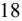

{18}------------------------------------------------

Furthermore, many competitors are developing information technology-based tools to support the integration of next-generation sequencing testing into the clinical setting. These companies may also use their own tests or others to develop an integrated system which could limit our access to certain networks.

### **New product development and commercialization involve a lengthy and complex process and we may be unable to develop or commercialize new products on a timely basis, or at all.**

Products that are under development have taken time and considerable resources to develop, and we may not be able to complete the development and commercialization of such products for clinical use on a timely basis, or at all. For example, there can be no assurance that we will be able to produce commercial products for early detection of cancer. Before we can commercialize any new products, we will need to expend significant funds in order to:

- conduct substantial research and development, including validation studies and clinical studies;
- further develop and scale our laboratory processes to accommodate different products; and
- further develop and scale our infrastructure to be able to analyze increasingly large amounts of data.

Our product development process involves a high degree of risk, and product development efforts may fail for many reasons, including:

- failure of the product to perform as expected, including defects and errors;
- lack of validation data; or
- failure to demonstrate the clinical utility of the product.

As we develop products, we have made and will have to make significant investments in product development, marketing and selling resources, including investing heavily in clinical studies, which could adversely affect our future cash flows.

#### **Failure to develop, or acquire licenses for, new or improved testing technologies could materially and adversely affect our revenues.**

Our industry is subject to rapidly changing technology and new product introductions. Other companies or individuals, including our competitors, may obtain patents or other intellectual property rights that would prevent, limit or interfere with our ability to develop, perform or sell our solutions or operate our business or increase our costs. In addition, they could introduce new tests, technologies or services that may result in a decrease in the demand for our services or cause us to reduce the prices of our services. Our success will depend, in part, on our ability to develop, acquire or license new and improved technologies on favorable terms and to obtain appropriate coverage and reimbursement for these technologies. We may not be able to negotiate acceptable licensing arrangements and we cannot be certain that such arrangements will yield commercially successful diagnostic tests. If we are unable to license these testing methods at competitive rates, our research and development costs may increase as a result. In addition, if we are unable to license new or improved technologies to expand our testing operations, our testing methods may become outdated when compared with our competition and testing volume and revenue may be materially and adversely affected.

### **The potential loss or delay of our material Pharma Services customer contracts or of multiple contracts could adversely affect our results.**

The revenue attributable to our Pharma Services clients may also fluctuate in the future, which could have an adverse effect on our financial condition and results of operations. Most of our Pharma Services segment clients can terminate our contracts upon proper notice. Our Pharma Services clients may delay, terminate or reduce the scope of our contracts for a variety of reasons beyond our control, including but not limited to actions by regulatory authorities, negative clinical results, lack of patient enrollment, or shifts in internal priorities. Delays, terminations or reductions in the scope of our contracts impact our ability to convert our backlog into revenue for the Company. If we cannot realize the full benefits of our backlog of contractually committed services due to delay, cancellation or reduction in our client's contractual commitments, this will materially impact our revenues. Adverse speculation about our existing or potential relationships with our Pharma Services clients may be a catalyst for adverse speculation about us, our products and our technology, which can adversely affect our reputation and business.

### **Clinicians or patients using our services may sue us, and our insurance may not sufficiently cover all claims brought against us, which will increase our expenses.**

The development, marketing, sale, and performance of healthcare services expose us to the risk of litigation, including professional negligence or product liability claims, were someone to allege that our tests failed to perform as designed. We may also be subject to liability for errors in the test results we provide to pathologists and oncologists or for a misunderstanding of, or inappropriate reliance upon, the information we provide. Damages assessed in connection with, and

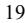

{19}------------------------------------------------

the costs of defending, any legal action could be substantial. We may be faced with litigation claims that exceed our insurance coverage or are not covered under any of our insurance policies. In addition, litigation could have a material adverse effect on our business if it impacts our existing and potential customer relationships, creates adverse public relations, diverts management resources from the operation of the business, or hampers our ability to otherwise conduct our business.

#### **We may become involved in litigation that may materially adversely affect us.**

From time to time, we may become involved in various legal proceedings relating to matters incidental to the ordinary course of our business, including employment, commercial, product liability, class action, whistleblower and other litigation and claims, and governmental and other regulatory investigations and proceedings. Such matters can be time-consuming, divert management's attention and resources, cause us to incur significant expenses or liability and/or require us to change our business practices. Because of the potential risks, expenses, and uncertainties of litigation, we may, from time to time, settle disputes, even where we believe that we have meritorious claims or defenses. Because litigation is inherently unpredictable, we cannot assure you that the results of any of these actions will not have a material adverse effect on our business, results of operations and financial condition.

#### **Our involvement with clinical trials and research services create a risk of liability.**

We have conducted clinical trials and presently support many clinical trials run by third parties, which ordinarily involve testing an investigational drug on a limited number of individuals to evaluate a product's safety, determine a safe dosage range and identify side effects. Errors or omissions could occur during a clinical trial that may result in harm to study volunteers, or if unnoticed and regulatory approval is received, to consumers of the drug, or that may undermine the usefulness of the clinical trial or data from the clinical trial and may delay the entry of a drug to the market.

Our contracts with the pharmaceutical sponsors include provisions entitling us to be indemnified or entitling us to a limitation of liability. These provisions do not uniformly protect us against liability arising from certain of our own actions, such as gross negligence or misconduct. We could be materially and adversely affected if we were required to pay damages or bear the costs of defending any claim which is not covered by or exceeds the limits of a contractual indemnification provision, or in the event that a party who must indemnify us does not fulfill its indemnification obligations, or which is beyond the level of our insurance coverage.

#### **Our investments in marketable securities are subject to certain risks which could affect our overall financial condition, results of operations, or cash flows.**

We invest a portion of our available cash and cash equivalents by purchasing marketable securities in a managed portfolio and direct investments in a variety of debt securities, including U.S. Treasury securities and corporate debt securities. The primary objective of our investment activity is to maintain the safety of principal and provide for future liquidity requirements while maximizing yields without significantly increasing risk. Should any of our investments or marketable securities lose value or have their liquidity impaired, it could affect our overall financial condition. Additionally, should we choose to, or are required to, sell these securities in the future at a loss, our consolidated operating results or cash flows may be affected.

#### **Other manufacturers may discontinue or recall testing products used in our business.**

We rely heavily on reagents, test kits and instruments manufactured by third parties in our testing services. From time to time, manufacturers have discontinued or recalled, and may in the future discontinue or recall, the reagents, test kits or instruments used by us to perform laboratory testing. Such discontinuations or recalls could adversely affect our costs, testing volume and revenues. We have had certain tests discontinued by manufacturers and have had to develop alternative solutions for our clients.

#### **We depend substantially upon third parties for payment of services, which reliance could have a material adverse effect on our cash flows and results of operations.**

Our business consists of clinical laboratories that provide medical testing services for doctors, hospitals, and other laboratories on patient specimens that are sent to our laboratories. In the case of some specimen referrals that are received for patients that are not in-patients or out-patients at a hospital or institution or otherwise sent by another reference laboratory, we typically bill the patient's insurance company or a government program for our services. As such, we rely on the cooperation of numerous third-party payers, including but not limited to Medicare, Medicaid, and various insurance companies, to get paid for performing services on behalf of our clients and their patients. The amount of such third-party payments is governed by contractual relationships in cases where we are a participating provider for a specified insurance company or by established government reimbursement rates in cases where we are an approved provider for a government program such as Medicare or Medicaid. However, we do not have contractual relationships with some of the insurance companies with whom

{20}------------------------------------------------

we deal, nor are we necessarily able to become an approved provider for all government programs. In such cases, we are deemed to be a non-participating provider and there is no contractual assurance that we will be able to collect the amounts billed to such insurance companies or government programs. Until such time we become a participating provider with such insurance companies, there can be no contractual assurance that we will be paid for the services we bill to such insurance companies or patients, and such third parties may change their reimbursement policies for non-participating providers in a manner that may have a material adverse effect on our cash flow or results of operations. When new Current Procedural Terminology ("CPT") codes are introduced by the American Medical Association ("AMA") it often takes time for commercial insurance providers to recognize the new codes, which can significantly impact the timing of payments, if any, and can increase our days-sales-outstanding. Medicare has also, at times, issued codes or coding guidance that conflicts with the AMA CPT coding, which can cause confusion when secondary insurance is involved. Insurance companies may also try to steer business away from us towards in-network providers by sending letters to physicians and even imposing financial penalties if they continue to send us business.

#### **We may fail to protect our facilities, which could have a material adverse effect on our business, results of operations, and financial condition.**

Our operations are dependent in part upon our ability to protect our laboratory operations against physical damage from explosions, fire, floods, hurricanes, earthquakes, power loss, telecommunications failures, break-ins, and similar events. We do not presently have an emergency back-up generator in place at our Tampa, Florida, Nashville, Tennessee, Atlanta, Georgia, or Phoenix, Arizona laboratory locations, which would otherwise mitigate to some extent the effects of a prolonged power outage. The occurrence of any of these events could result in interruptions, delays, or cessations in service to clients, which could have a material adverse effect on our business, results of operations, and financial condition.

#### **We depend on information technology systems and maintain protected personal data, and a cyber-attack or other breach affecting these information technology systems or protected data could have a material adverse effect on our results of operations.**

Our laboratory operations depend, in part, on the continued performance of our information technology systems. Such systems are susceptible to a cyber-attack, malicious intrusion, breakdown, destruction, loss of confidentiality, or other significant disruption. These systems have been and are expected to continue to be the target of malware and other cyber-attacks. In addition, third party hacking attempts may cause our information technology systems and related products, protected data, or proprietary information to be compromised or stolen. A significant attack or other disruption could result in adverse consequences, including increased costs and expenses, manufacturing challenges or disruption, problems with product functionality, damage to customer relations, lost revenue, and legal or regulatory penalties. Sustained system failures or interruption of our systems in one or more of our laboratory operations could disrupt our ability to process laboratory requisitions, perform testing, provide test results in a timely manner, and/or bill the appropriate party.

We also collect, manage and process protected personal data, including protected health information subject to HIPAA, in connection with our service offerings. Breaches with respect to personal data could result in violations of HIPAA, the HITECH Act, GDPR, and other federal, state, and international laws regarding the privacy, confidentiality, and security of such information. A breach of protected personal data could result in adverse consequences, including regulatory inquiries or litigation, increased costs and expenses, including costs related to insurance and remediation of any security vulnerabilities, reputational damage, lost revenue, and fines or penalties.

While we invest in our systems and technology and in the protection of its products and data to reduce the risk of an attack or other significant disruption, there can be no assurance that these measures and efforts will prevent future attacks or other significant disruptions to any of the systems on which we rely. Similarly, there can be no assurance that third party information technology providers with whom we contract will not suffer a significant attack or disruption that impacts customers, such as supply chain attacks. Any significant breach, attack, disruption, or failure of our information technology systems could adversely affect our business, results of operations, and financial condition.

### **Performance issues, service interruptions, or price increases by our shipping carrier could adversely affect our business, results of operations, and financial condition, and harm our reputation and ability to provide our specialized diagnostic services on a timely basis.**

Expedited, reliable shipping is essential to our operations. One of our marketing strategies principally highlights the reliability of our point-to-point transport of patient samples. We rely heavily on a single provider of transport services, FedEx Corporation (the "Carrier"), for reliable and secure point-to-point transport of patient samples to our laboratory and enhanced tracking of these patient samples. Should the Carrier encounter delivery performance issues such as loss, damage, or destruction of a sample, it may be difficult to replace our patient samples in a timely manner and such occurrences may damage our reputation and lead to decreased demand for our services and increased cost and expense to our business. In

{21}------------------------------------------------

addition, any significant increase in shipping rates could adversely affect our operating margins and results of operations. Similarly, strikes, severe weather, natural disasters, or other service interruptions by delivery services we use would adversely affect our ability to receive and process patient samples on a timely basis. If the Carrier or we were to terminate our relationship, we would be required to find another party to provide expedited, reliable point-to-point transport of our patient samples. There are only a few other providers of such nationwide transport services, and there can be no assurance that we will be able to enter into arrangements with another provider on acceptable terms, if at all. Finding a new provider of transport services would be time-consuming and costly and result in delays in our ability to provide our specialized diagnostic services. Even if we were to enter into an arrangement with such alternative provider, there can be no assurance that they will provide the same level of quality in transport services currently provided to us by the Carrier. If the new provider does not provide the required quality and reliable transport services, it could adversely affect our business, reputation, results of operations, and financial condition.

#### **We use biological and hazardous materials that require considerable expertise and expense for handling, storage, or disposal and may result in claims against us.**

We work with hazardous materials, including chemicals, biological agents and compounds, blood samples, and other human tissue that could be dangerous to human health and safety or the environment. Our operations also produce hazardous and biohazardous waste products. We have an Employee Health & Safety Department that closely monitors the use of hazardous materials in our laboratory. Federal, state, and local laws and regulations govern the use, generation, manufacture, storage, handling, and disposal of these materials and wastes. Compliance with applicable environmental laws and regulations may be expensive, and current or future environmental laws and regulations may impair business efforts. If we do not comply with applicable regulations, we may be subject to fines and penalties. In addition, we cannot entirely eliminate the risk of accidental injury or contamination from these materials or wastes. Our general liability insurance or workers' compensation insurance policies may not cover damages and fines arising from biological or hazardous waste exposure or contamination. Accordingly, in the event of contamination or injury, we could be held liable for damages or penalized with fines in an amount exceeding our resources, and our operations could be suspended or otherwise adversely affected.

#### **Risks Related to Our Common Stock and Indebtedness**

#### **The price of our common stock may fluctuate significantly.**

The price of our common stock has been, and is likely to continue to be, volatile and it could decline substantially within a short period of time. The price of our common stock could fluctuate significantly for many reasons including the following:

- change in our Leadership or Board of Directors;
- future announcements concerning us or our competitors;
- regulatory developments and enforcement actions bearing on advertising, marketing, or sales;
- reports and recommendations of analysts and whether or not we meet the milestones and metrics set forth in such reports;
- gaining or losing large customers or managed care plans;
- introduction of new products or services and related insurance coverage;
- acquisition or loss of significant manufacturers, distributors or suppliers, or an inability to obtain sufficient quantities of materials needed to provide our services;
- quarterly variations in operating results;
- business acquisitions or divestitures;
- changes in the regulation of LDTs;
- changes in governmental or third-party reimbursement practices and rates; and
- fluctuations in the economy, political events, or general market conditions.

In addition, stock markets in general and the market for shares of healthcare stocks in particular, have experienced extreme price and volume fluctuations in recent years, fluctuations that frequently have been unrelated to the operating performance of the affected companies. These broad market fluctuations may adversely affect the market price of our common stock. The market price of our common stock could decline below its current price and the market price of our shares may fluctuate significantly in the future. These fluctuations may be unrelated to our performance.

**Servicing our Convertible Notes requires a significant amount of cash. We may not have sufficient cash flow from our business to pay our obligations under the Convertible Notes, which could adversely affect our financial condition and operating results.**

{22}------------------------------------------------

In April 2020, we issued \$201.3 million aggregate principal amount of 2025 Convertible Notes, and in January 2021, we issued\$345.0 million aggregate principal amount of 2028 Convertible Notes. We may also incur additional indebtedness in the future. Our ability to make scheduled payments of the principal of, pay interest on, or refinance our indebtedness depends on our future performance, which is subject to economic, financial, competitive, and other factors beyond our control. Our business may not continue to generate cash flow from operations in the future sufficient to service our indebtedness and to make necessary capital expenditures. If we are unable to generate such cash flow, we may be required to adopt one or more alternatives, such as selling assets, restructuring debt, or obtaining additional equity capital on terms that may be onerous or highly dilutive. Our ability to refinance the Convertible Notes will depend on the capital markets and our financial condition at such time. We may not be able to engage in any of these activities or engage in these activities on desirable terms, which could result in a default on our debt obligations.

### **We may not have the ability to raise the funds necessary to settle conversions of the Convertible Notes in cash or to repurchase the Convertible Notes upon a fundamental change, and our future debt may contain limitations on our ability to pay cash upon conversion or repurchase of the Convertible Notes.**

Holders of the Convertible Notes have the right to require us to repurchase their Convertible Notes upon the occurrence of a fundamental change at a repurchase price equal to 100% of the principal amount of the Convertible Notes to be repurchased, plus accrued and unpaid interest, if any. In addition, upon conversion of the Convertible Notes, unless we elect to deliver solely shares of our common stock to settle such conversion (other than paying cash in lieu of delivering any fractional share), we will be required to make cash payments in respect of the Convertible Notes being converted. However, we may not have enough available cash or be able to obtain financing at the time we are required to make repurchases of Convertible Notes surrendered therefor or Convertible Notes being converted. In addition, our ability to repurchase the Convertible Notes or to pay cash upon conversions of the Convertible Notes may be limited by law, by regulatory authority, or by agreements governing our future indebtedness. Our failure to repurchase Convertible Notes at a time when the repurchase is required by the respective indenture or to pay any cash payable on future conversions of the Convertible Notes as required by such indenture would constitute a default under the indenture. A default under an indenture or the occurrence of the fundamental change may also lead to a default under agreements governing our future indebtedness. If the repayment of the related indebtedness were to be accelerated after any applicable notice or grace periods, we may not have sufficient funds to repay the indebtedness and repurchase the Convertible Notes or make cash payments upon conversions thereof.

#### **The capped call transactions may affect the value of the 2028 Convertible Notes and our common stock.**

In connection with the issuance of the 2028 Convertible Notes, we have entered into capped call transactions with the option counterparties. Upon conversion of any of the 2028 Convertible Notes, we will satisfy our conversion obligation by paying or delivering, as the case may be, cash, shares of our common stock, or a combination of cash and shares of our common stock, at our election, and the capped call transactions are intended to reduce the potential dilution upon conversion of the 2028 Convertible Notes and/or offset some or all of any cash payments we are required to make in excess of the principal amount of converted 2028 Convertible Notes, as the case may be, with such reduction and/or offset subject to a cap.

In connection with these transactions, the option counterparties or their respective affiliates may modify their hedge positions related to the capped call transactions by entering into or unwinding various derivatives with respect to our common stock and/or purchasing or selling our common stock or other securities of ours in secondary market transactions prior to the maturity of the 2028 Convertible Notes (and are likely to do so during any observation period related to a conversion of 2028 Convertible Notes or following any repurchase or redemption of the 2028 Convertible Notes). This activity could also cause or avoid an increase or a decrease in the market price of our common stock or the 2028 Convertible Notes.

#### **Conversion of the Convertible Notes may dilute the ownership interest of existing stockholders or may otherwise depress the price of our common stock.**

The conversion of some or all of the Convertible Notes may dilute the ownership interests of existing stockholders to the extent we deliver shares of our common stock upon conversion of any of the Convertible Notes. We have entered into capped call transactions with respect to the 2028 Convertible Notes to reduce the risk of dilution, but to the extent that the conversion price of the 2028 Convertible Notes exceeds the cap price of the capped calls or to the extent that the Convertible Notes are converted, such conversions will dilute the ownership interests of our existing stockholders. The Convertible Notes may from time to time in the future be convertible at the option of their holders prior to their scheduled terms under certain circumstances. Any sales in the public market of the common stock issuable upon such conversion could adversely affect prevailing market prices of our common stock. In addition, the existence of the Convertible Notes may encourage short selling by market participants because conversion could be used to satisfy short positions, and the anticipated conversion of the Convertible Notes into shares of our common stock could depress the price of our common stock.

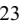

{23}------------------------------------------------

#### **Risks Relating to Government Regulation and Reimbursement**

**Regulatory changes, such as proposed government regulation of Laboratory Developed Tests, could require us to conduct additional clinical trials or result in delays, result in increased costs, or the failure to obtain necessary regulatory approvals, which could harm our business.**

We frequently develop diagnostic tests for clients that cannot currently be provided using test kits approved or cleared by the FDA. The FDA has been considering changes to the way that it regulates these LDTs. Currently, all LDTs are conducted and offered in accordance with CLIA, and individual state licensing procedures. The FDA has published a draft guidance document that would require FDA clearance or approval of a subset of LDTs, as well as a modified approach for some lower risk LDTs that may require FDA oversight short of the full premarket approval or clearance process. Congress may enact legislation to provide a regulatory framework for the FDA's role with regard to LDTs. As a result, there is a risk that the FDA's proposed regulatory process could delay the offering of certain tests and result in additional validation costs and fees. There is also an associated risk that some tests currently offered might become subject to FDA premarket approval or clearance. This FDA approval or clearance process may be time-consuming and costly, with no guarantee of ultimate approval or clearance. If our diagnostic tests are allowed to remain on the market but there is uncertainty about the regulatory status of such tests, if they are labeled investigational by FDA, or if FDA limits our labeling claims, orders or reimbursement may decline.

In 2014, FDA issued draft guidance announcing that it would end its historical policy of enforcement discretion regarding LDTs and outlining the first of multiple frameworks that have been proposed for their regulation. FDA announced in 2016 that it no longer planned to finalize its draft guidance and that it would continue to exercise enforcement discretion with respect to LDTs. On January 13, 2017, the FDA published a non-binding "Discussion Paper" proposing a framework of LDT oversight largely consistent with the draft guidance, "to spur further dialogue" and give "congressional authorizing committees the opportunity to develop a legislative solution." Recent agency announcements made in the context of the COVID-19 public health emergency have produced a shifting policy landscape and further uncertainty regarding FDA's role in regulating LDTs: in August 2020, HHS announced that FDA would not require premarket review of LDTs absent notice-and-comment rulemaking, but in November 2021, HHS issued a statement withdrawing that prior announcement, indicating a return to FDA's longstanding approach to the regulation and enforcement discretion toward LDTs.

Congress has also considered a number of legislative proposals in recent years that would amend the regulatory framework for LDTs, including, among other requirements, FDA premarket review of certain LDTs. The most recent such proposal, the VALID Act, was introduced in both the House and Senate on June 24, 2021. The VALID Act was expected to be included in the Omnibus bill signed at the end of 2022, but ultimately was not included and that, as such, it remains unclear whether the VALID Act will be passed 2023 or whether FDA will proceed through rulemaking. It is possible that legislation and resulting FDA regulation may result in increased regulatory burdens and costs for us to seek marketing authorization for and maintain ongoing compliance for our existing tests, any modifications thereto, or any future tests we may develop. If the government begins to regulate our tests, it could require a significant volume of applications, which would be burdensome. Furthermore, governmental bodies could take a long time to review such applications and/or document responses if other laboratories were also required to file applications and/or document responses for each of their LDTs.

In the event that the FDA begins to regulate our tests, it may require additional pre-market clinical testing prior to submitting a regulatory notification or application for commercial sales. Such pre-market clinical testing could delay the commencement or completion of clinical testing, significantly increase our test development costs, delay commercialization of any future tests, and interrupt sales of our current tests. Additionally, the results of pre-clinical trials or previous clinical trials may not be predictive of future results, and clinical trials may not satisfy the requirements of the FDA or other non-U.S. regulatory authorities. Many of the factors that may cause or lead to a delay in the commencement or completion of clinical trials may also ultimately lead to delay or denial of regulatory clearance or approval. The commencement of clinical trials may be delayed due to insufficient patient enrollment, which is a function of many factors, including the size of the patient population, the nature of the protocol, the proximity of patients to clinical sites, and the eligibility criteria for the clinical trial. We also cannot be certain that FDA will not enact rules or guidance that could impact our ability to purchase materials necessary for the performance of our LDTs, such as products labeled for research use only. Should any of the reagents we obtain from third party suppliers and use in conducting our LDTs be affected by future regulatory actions, our business could be adversely affected by those actions, including increasing the cost of testing or delaying and limiting or prohibiting the purchase of reagents necessary to perform testing.

We may find it necessary to engage contract research organizations to perform data collection and analysis and other aspects of our clinical trials, which might increase the cost and complexity of our trials. We may also depend on clinical investigators, medical institutions, and contract research organizations to perform the trials. If these parties do not successfully carry out their contractual duties or obligations or meet expected deadlines, or if the quality, completeness, or

{24}------------------------------------------------

accuracy of the clinical data they obtain is compromised due to the failure to adhere to our clinical protocols or for other reasons, our clinical trials may have to be extended, delayed, or terminated. Many of these factors would be beyond our control. We may not be able to enter into replacement arrangements without undue delays or considerable expenditures. If there are delays in testing or approvals as a result of the failure to perform by third parties, our research and development costs would increase, and we may not be able to obtain regulatory clearance or approval for our tests. In addition, we may not be able to establish or maintain relationships with these parties on favorable terms, if at all. Each of these outcomes would harm our ability to market our tests and/or to achieve sustained profitability.

#### **Healthcare reform programs may impact our business and the pricing we receive for our services.**

In March 2010, healthcare reform legislation known as the "Patient Protection and Affordable Care Act," also known as the ACA, was passed into law. The ACA makes changes that are expected to significantly impact the pharmaceutical and medical device industries and clinical laboratories. For example, the ACA contains several provisions that seek to limit Medicare spending in the future. One key provision in the ACA is the establishment of "Accountable Care Organizations" ("ACOs"), under which hospitals and physicians are able to share savings that result from improved coordination of healthcare. ACOs continue to develop, and we cannot predict how the continued establishment and implementation of these new business models will impact our business. There is the possibility that value-based payment models, such as ACOs, will drive down the utilization and/or reimbursement rates for our services. We may not be able to gain access into certain ACOs. These changes could have an adverse and material impact on our operations.

Following the 2016 election cycle, there were substantial efforts to repeal all or portions of the ACA. In December 2017, Public Law No. 115-97, which made changes to the tax code and included, among other things, a repeal of the ACA's penalties for the individual mandate, a provision that required individuals to buy health insurance or pay a fine, became law. While efforts to repeal all or part of the ACA have subsided, in part due to the results of the 2020 election, we cannot be certain that there will not be further legislative efforts or judicial challenges in the future.

### **Changes in laws, regulations, contracting arrangements with payers, or payer policies, including steps taken by payers to control utilization and reimbursement of healthcare services, may adversely affect coverage or reimbursement for our specialized diagnostic services, which may decrease our revenues and adversely affect our results of operations and financial condition.**

Governmental payers, as well as private insurers and private payers, have implemented and will continue to implement measures to control the cost, utilization, and delivery of healthcare services, including clinical laboratory and pathology services. Congress and federal agencies, such as CMS, have, from time to time, implemented changes to laws and regulations governing healthcare service providers, including specialized diagnostic service providers. These changes have adversely affected and may in the future adversely affect coverage for our services. We also believe that healthcare professionals may not use our services if third-party payers do not provide adequate coverage and reimbursement for them. These changes in federal, state, local, and third-party payer regulations or policies may decrease our revenues and adversely affect our results of operations and our financial condition. We will continue to be a non-contracted provider until such time as we enter into contracts with third-party payers with whom we are not currently contracted. Because a portion of our revenues is from third-party payers with whom we are not currently contracted, it is likely that we will be required to make positive or negative adjustments to accounting estimates with respect to contractual allowances in the future, which may adversely affect our results of operations, our credibility with financial analysts and investors, and our stock price.

We face efforts by government payers to reduce utilization as well as reimbursement for laboratory testing services. Changes in governmental reimbursement may result from statutory and regulatory changes, prospective and/or retroactive rate adjustments, administrative rulings, and other policy changes.

From time to time, legislative freezes and updates affect some of our tests that are reimbursed by the Medicare program under the Medicare Physician Fee Schedule ("MPFS"), or the Clinical Laboratory Fee Schedule ("CLFS"). The MPFS is updated on an annual basis. In the past, the MPFS was updated using a prescribed statutory formula (i.e., the sustainable growth rate formula). The Medicare Access and CHIP Reauthorization Act of 2015 ("MACRA") repealed the previous statutory formula and specified new annual conversion factors for calendar years 2015 and beyond. If the new annual conversion factor results in negative reimbursement in future years, the resulting decrease in payment may adversely affect our revenue, business, operating results, financial condition, and prospects.

In addition, recent laws have made changes to Medicare reimbursement for our tests that are reimbursed under the CLFS, many of which have already gone into effect. The Protecting Access to Medicare Act of 2014 ("PAMA") made significant changes to how Medicare pays for clinical diagnostic laboratory tests under the CLFS. As part of the changes made under PAMA, beginning in 2017, Medicare CLFS reimbursement rates were to be based on the volume-weighted median of the private payer payment rates for these tests. This led to reductions from prior rates, and without further legislative changes,

{25}------------------------------------------------

will continue to result in reductions as the Medicare CLFS reimbursement rate converges towards the median private payer rate. Reductions were capped at 10.0 percent per annum from 2017 through 2020, and this cap was set to increase to 15.0 percent for 2020. However, the Coronavirus Aid, Relief, and Economic Security Act ("CARES Act") and Protecting Medicare and American Farmers from Sequester Cuts Act delayed the implementation of the 15.0 percent rate reduction cap to 2023 and capped reductions at 0.0 percent for 2021 and 2022. The Consolidated Appropriations Act 2023 further delayed the implementation of the 15.0 percent rate reduction cap to 2024 and extended the 15.0 percent rate reduction cap through 2026. When rate reductions begin to take effect again in 2024, this will further reduce Medicare program payments for CLFS tests. It is possible that additional reductions could be enacted in the future.

CMS also adopts regulations and policies, from time to time, revising, limiting, or excluding coverage or reimbursement for certain of the tests that we perform. Likewise, many state governments are under budget pressures and are also considering reductions to their Medicaid fees. Further, Medicare, Medicaid, and other third-party payers audit for overutilization of billed services. Even though all tests performed by us are ordered by our clients who are responsible for establishing the medical necessity for the tests ordered, we may be subject to recoupment of payments, as the recipient of the payments for such tests, in the event that a third-party payer such as CMS determines that the tests failed to meet all applicable criteria for payment. When third-party payers like CMS revise their coverage regulations or policies, our costs generally increase due to the complexity of complying with additional administrative requirements. Furthermore, Medicaid reimbursement and regulations vary by state. Accordingly, we are subject to varying administrative and billing regulations, which also increase the complexity of servicing such programs and our administrative costs. Finally, state budget pressures have encouraged states to consider several courses that may impact our business, such as delaying payments, restricting coverage eligibility, service coverage restrictions and imposing taxes on our services.

In certain jurisdictions, Palmetto GBA administers the Molecular Diagnostic Services Program ("MolDx") and establishes coverage and reimbursement for certain molecular diagnostic tests, including many of our tests. To obtain Medicare coverage for a molecular diagnostic test (FDA-approved or LDT), laboratories must apply for and obtain a unique test identifier or what is known as a "Z" code. For newly developed tests or for established tests that have not been validated for clinical and analytical validity and clinical utility, laboratories must submit a detailed dossier of clinical data to substantiate that the test meets Medicare's requirements for coverage. We have received favorable coverage for many of our molecular tests, however, we have also received non-coverage determinations for many newer tests. The field of molecular diagnostics is evolving very rapidly, and clinical studies on many new tests are still underway. We cannot be assured that some of our molecular tests will ever be covered services by Medicare, nor can we determine when the medical literature will meet the standard for coverage that Medicare administrative contractors have set.

In November 2017, CMS initiated a national coverage analysis for the use of NGS diagnostic tests for patients with advanced cancer. The proposed decision memorandum was released and open to a public comment period. On March 16, 2018, CMS issued a final decision memorandum for NGS as a diagnostic laboratory test and determined it to be reasonable and necessary, and covered nationally when performed in a CLIA-certified laboratory, ordered by a treating physician, and all of the following requirements are met: (a) the patient has either recurrent, relapsed, refractory, metastatic, or advanced stages III or IV cancer; (b) the patient has either not been previously tested using the same NGS test for the same primary diagnosis of cancer or has had repeat testing using the same NGS test only when a new primary cancer diagnosis is made by the treating physician; and (c) the patient has decided to seek further cancer treatment (e.g., therapeutic chemotherapy). CMS also determined that the diagnostic laboratory test using NGS must have: FDA approval or clearance as a companion in vitro diagnostic; an FDA approved or cleared indication for use in that patient's cancer; and results provided to the treating physician for management of the patient using a report template to specify treatment options. On October 29, 2019, CMS issued a proposed decision memorandum open to a public comment period that would expand coverage of NGS test when performed in a CLIA-certified laboratory, ordered by a treating physician, and all of the following requirements are met (a) the patient has ovarian or breast cancer; (b) the patient has clinical indications for germline (inherited) testing; (c) the patient has risk factors for germline (inherited) breast or ovarian cancer; and (d) the patient has not been previously tested using NGS. These CMS changes to reimbursement for NGS testing could directly affect our revenue for this test type.

In recent years, Medicare has encouraged beneficiaries to participate in managed care programs, known as "Medicare Advantage" programs, and has encouraged beneficiaries from the traditional fee-for-service Medicare program to switch to Medicare Advantage programs. This has resulted in rapid growth of health insurance and managed care plans offering Medicare Advantage programs and growth in Medicare beneficiary enrollment in these programs. Also, in recent years, many states have increasingly mandated that Medicaid beneficiaries enroll in managed care arrangements. If these efforts continue to be successful, we may experience a further shift of traditional Medicare and Medicaid fee-for-service beneficiaries to managed care programs. As a result, we would be required to contract with those private managed care programs in order to be reimbursed for services provided to their Medicare and Medicaid members. There can be no assurance that we will be

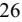

{26}------------------------------------------------

successful in entering into agreements with these managed care programs at rates of payment similar to those we realize from our non-managed care lines of business.

We expect the initiatives such as those described above to continue and, if they do, to reduce reimbursements for clinical laboratory services, to impose more stringent cost controls on clinical laboratory services and to reduce utilization of clinical laboratory services. These efforts, including changes in law or regulations that may occur in the future, may each individually or collectively have a material adverse impact on our business, results of operations, financial condition, and prospects.

### **Failure to comply with laws and regulations regarding laboratory licensing and operations, including CLIA environmental, health, and safety laws and regulations such as the federal Occupational Safety and Health Administration Act and the Needlestick Safety and Prevention Act, could result in fines and penalties and loss of licensure, and have a material adverse effect upon our business.**

We are subject to extensive state and federal regulatory oversight regarding laboratory licensing and operations. Each of our laboratories must satisfy federal requirements under CLIA and to maintain the appropriate CLIA Certificate for all testing performed at the lab. Additionally, most states have adopted various laws and regulations setting standards for laboratories performing clinical laboratory testing, and requiring laboratories to obtain and maintain a state laboratory license before the laboratory is authorized to perform testing. These state licensure laws address a host of requirements and often establish permissible and prohibited practices involving digital health, including but not limited to telehealth and telepathology.

Periodic inspections or surveys are performed to determine whether our laboratory locations are compliant with CLIA requirements or with applicable state licensure or certification laws. If we fail to meet any applicable requirements of CLIA or similar state laws, that failure could adversely affect payment for our products and services, prevent their approval entirely, and/or interrupt the commercial sale and/or marketing of any products and services and otherwise cause us to incur significant expense. The sanctions for failure to comply with CLIA, state licensure requirements, or other applicable laws and regulations include the suspension, revocation, or limitation of the right to perform clinical laboratory services or receive compensation for those services, as well as the requirement to enter into a corrective action plan to monitor compliance, and the imposition of civil or criminal penalties or administrative fines. In addition, any new legislation or regulation or the application of existing laws and regulations in ways that we have not anticipated could have a material adverse effect on our business, results of operations, and financial condition.

We are subject to licensing and regulation under federal, state, and local laws and regulations relating to the protection of the environment and human health and safety, including laws and regulations relating to the handling, transportation, and disposal of medical specimens, infectious and hazardous waste, and radioactive materials, as well as regulations relating to the safety and health of laboratory employees. The federal Occupational Safety and Health Administration has established extensive requirements relating to workplace safety for healthcare employers, including clinical laboratories, whose workers may be exposed to blood-borne pathogens such as HIV and the hepatitis B virus. These requirements, among other things, require work practice controls, protective clothing and equipment, training, medical follow-up, vaccinations, and other measures designed to minimize exposure to, and transmission of, blood-borne pathogens. In addition, the Needlestick Safety and Prevention Act requires, among other things, that we include in our safety programs the evaluation and use of engineering controls such as safety needles, if found to be effective at reducing the risk of needlestick injuries in the workplace.

Failure to comply with such federal, state and local laws and regulations could subject us to denial of the right to conduct business, fines, criminal penalties and/or other enforcement actions, any of which could have a material adverse effect on our business. In addition, compliance with future legislation could impose additional requirements for us, which may be costly.

#### **Our net revenue will be diminished if payers do not adequately cover or reimburse our services.**

There has been, and will continue to be, significant efforts by both federal and state agencies to reduce costs in government healthcare programs and otherwise implement government control of healthcare costs. In addition, private payers continually seek ways to reduce and control overall healthcare costs, and increasing emphasis on managed care in the United States will continue to put pressure on the pricing of healthcare services. Uncertainty exists as to the coverage and reimbursement status of new applications and services. Third-party payers, including governmental payers such as Medicare and private payers, are scrutinizing new medical products and services and may not cover or may limit coverage and the level of reimbursement for our services. Third-party insurance coverage may not be available to patients for any of our existing tests or for tests we discover and develop, and a substantial portion of the testing for which we bill our hospital and laboratory clients is ultimately paid by third-party payers. Likewise, any pricing pressure exerted by these third-party payers on our clients may, in turn, be exerted by our clients on us. If government and other third-party payers do not provide adequate coverage and reimbursement for our tests, it could adversely affect our operating results, cash flows and/or our financial condition.

{27}------------------------------------------------

### **Third-party billing is extremely complicated and results in significant additional costs to us.**

Billing for laboratory services is extremely complicated. Depending on the billing arrangement and applicable laws, we must bill various payers, such as patients, insurance companies, Medicare, Medicaid, physician practices, employer groups, hospitals, and other laboratories, all of which have different billing requirements. Additionally, we undertake internal audits to evaluate compliance with applicable laws and regulations as well as internal compliance policies and procedures. Insurance companies and government payers, such as Medicare and Medicaid, also impose routine external audits to evaluate payments, which adds further complexity to the billing process.

Among others, the primary factors which complicate our billing practices are:

- pricing differences between our fee schedules and the reimbursement rates of the payers;
- changes in payer rules or contracts;
- disputes with payers as to the party who is responsible for payment;
- disparity in coverage and information requirements among various carriers; and
- differing pre-authorization requirements across payers.

We incur significant additional costs as a result of our participation in the Medicare and Medicaid programs, as billing and reimbursement for clinical laboratory services are subject to considerable and complex federal and state regulations. The costs we expect to continue to incur include those related to: (i) complexity added to our billing processes and systems; (ii) training and education of our employees and clients; (iii) implementing compliance procedures and oversight; (iv) collections and legal costs; and (v) costs associated with, among other factors, challenging coverage and payment denials and providing patients with information regarding claims processing and services, such as advance beneficiary notices.

#### **Our operations are subject to strict laws prohibiting fraudulent billing and other abuse, and our failure to comply with such laws could result in substantial penalties, including exclusion from participation in Medicare, Medicaid, and other governmental payer programs.**

Of particular importance to our operations is ensuring compliance with federal and state laws prohibiting fraudulent billing and the retention of overpayments. In particular, if we fail to comply with federal and state documentation, coding, and billing rules, we could be subject to liability under the federal False Claims Act, including civil penalties, loss of licenses, and exclusion from the Medicare and Medicaid programs. The False Claims Act prohibits individuals and companies from knowingly submitting false claims for payments to, or improperly retaining overpayments from, the government.

If an entity is determined to have violated the federal False Claims Act, it may be required to pay up to three times the actual damages sustained by the government, plus substantial civil penalties for each separate false claim. Further, False Claims Act liability may lead to exclusion from participation in Medicare, Medicaid, and other federal healthcare programs. There are a number of potential bases for liability under the federal False Claims Act. For example, liability arises when an entity knowingly submits, or causes another to submit, a claim for reimbursement to the federal government for a service which was not provided or which did not qualify for reimbursement. Submitting a claim with reckless disregard or deliberate ignorance of its truth or falsity could also result in liability under the False Claims Act. Following enactment of the ACA, knowing retention of overpayments is also considered a false claim and could lead to liability under the False Claims Act.

The False Claims Act's "whistleblower" or "qui tam" provisions are used with frequency to challenge the reimbursement practices of providers and suppliers. Those provisions allow a private individual to bring an action on behalf of the government alleging that the defendant has submitted false claims for payment to the government. The government must decide whether to intervene in the lawsuit and whether to prosecute the case. If it declines to do so, the individual may pursue the case alone, although the government must be kept apprised of the progress of the lawsuit. Whether or not the federal government intervenes in the case, it will receive the majority of any recovery. The successful qui tam relator who brought the case is entitled to a portion of the proceeds and his or her attorneys' fees and costs. In addition, various states have enacted laws modeled after the federal False Claims Act, which prohibit submitting false claims for payment to the state, or, in some states, to commercial payers. If we fail to comply with federal and state documentation, coding, and billing rules, we could be subject to liability under analogous state laws as well as criminal liability through a variety of federal and state criminal statutes.

Government investigations of clinical laboratories have been ongoing for a number of years and are expected to continue in the future. Governmental enforcement action or qui tam civil litigation against us may result in material costs and occupy significant management resources, even if we ultimately prevail. In addition, governmental enforcement action may result in substantial fines, penalties or administrative remedies, including exclusion from government reimbursement programs and entry into corporate integrity agreements with governmental agencies, which could entail significant obligations and costs.

{28}------------------------------------------------

When we submit bills for our services to third-party payers, we must follow complex documentation, coding, and billing rules which are based on federal and state laws, rules and regulations, various government publications, and on industry practice. A large number of laboratories have entered into substantial settlements with the federal and state governments for alleged noncompliance under these laws and rules. Private payers have also brought civil actions against laboratories, which have resulted in substantial judgments. Failure to follow these rules could result in potential civil liability under the False Claims Act, under which extensive financial penalties can be imposed. It could further result in criminal liability under various federal and state criminal statutes.

We submit thousands of claims for payment to governmental programs and private payers, and we cannot guarantee that there have not been errors in our claims. While we maintain a robust compliance program that includes consistent, detailed review of our documentation, coding, and billing practices, the rules are frequently vague, complex, and continually changing and we cannot assure that governmental authorities, private insurers, or private whistleblowers will not challenge our practices. Such a challenge could result in a material adverse effect on our business. We therefore could be exposed to potential liability, penalties, or limitations on our operations due to failure to comply with significant government regulation and laboratory operations.

Existing federal laws governing Medicare and Medicaid, as well as other state and federal laws, also regulate certain aspects of the relationship between healthcare providers, including clinical laboratories, and their referral sources, including physicians, hospitals and other laboratories. Some of these laws, including the federal AKS and the federal Stark Law contain extremely broad proscriptions. Violation of these laws can result in criminal or civil penalties, exclusion from participation in the Medicare, Medicaid, and other federal healthcare programs, repayment of reimbursement received related to services tied to any impermissible referrals, or civil monetary penalties, which may be significant, as well as potential False Claims Act liability. Government authorities may determine that our arrangements with physicians and other clients do not comply with the federal AKS, Stark Law, and similar state laws, and may impose civil monetary penalties or exclude us from participation in federal healthcare programs based on our arrangements with physicians and other clients. The Company, voluntarily conducted an internal investigation, with the assistance of outside counsel, that focused on the compliance of certain consulting and service agreements with federal healthcare laws and regulations, including those relating to fraud, waste, and abuse. Based on this internal investigation, the Company voluntarily notified the OIG of the Company's internal investigation in November 2021. The Company's interactions with regulatory authorities and the Company's related review of this matter are ongoing. As of December 31, 2022, the Company has accrued a reserve of \$11.2 million in other long-term liabilities on the Consolidated Balance Sheets for potential damages and liabilities associated with the federal healthcare program revenue received by the Company in connection with the agreements at issue that were identified during the course of this internal investigation. This reserve reflects management's best estimate of the minimum probable loss associated with this matter. As a result of the internal investigation and ongoing interactions with regulatory authorities, the Company may accrue additional reserves for any related potential damages and liabilities arising out of this matter. At this time, the Company is unable to predict the duration, scope, result, or related costs associated with any further investigation, including by the OIG, or any other governmental authority, or what penalties or remedial actions they may seek. Accordingly, at this time, the Company is unable to estimate a range of possible loss in excess of the amount reserved. Determinations that the Company's operations or activities do not, or did not, comply with laws or regulations, however, may result in the imposition of civil or criminal fines, penalties, disgorgement, restitution, equitable relief, exclusion from participation in federal healthcare programs or other losses or conduct restrictions, which could be material to the Company's financial results or business operations.

The federal Civil Monetary Penalties Law ("federal CMP Law") imposes civil monetary penalties and potential exclusion from Medicare and Medicaid programs on any person who offers or transfers remuneration to any patient, who is a Medicare or Medicaid beneficiary, when the person knows or should know that the remuneration is likely to induce the patient to receive medical services from a particular provider. The federal CMP Law applies, among other things, to many kinds of inducements or benefits provided to patients, including complimentary items or services that are of more than nominal value. Government authorities may determine our operations and provision of services do not comply with the law and its interpretations and impose civil monetary penalties and exclude us from participation in Medicare and Medicaid for past or present practices related to patient incentive, coordination of care and need-based programs.

Tests which are reimbursed by Medicare and other Government payers (for example, State Medicaid programs) accounted for approximately 16%, 18% and 17% of our revenues for the years ended December 31, 2022, 2021 and 2020, respectively. The Medicare program imposes extensive and detailed requirements on diagnostic service providers, including, but not limited to, rules that govern how we structure our relationships with physicians, how and when we submit claims for reimbursement, and how we provide specialized diagnostic laboratory services. Further, we are prohibited from contracting with any individuals or entities who have been excluded from participation in Medicare or Medicaid and are listed on the OIG's List of Excluded Individuals and Entities List ("LEIE") or in the System for Award Management, which includes the previously independent Government Services Administration's Excluded Parties List System ("GSA-EPLS"). Contracting with excluded

{29}------------------------------------------------

individuals or entities, such as hiring an excluded person or contracting with an excluded vendor, can result in significant penalties.

Our failure to comply with applicable Medicare, Medicaid, and other governmental payer rules could result in our inability to participate in a governmental payer program, an obligation to repay funds already paid to us for services performed, civil monetary penalties, criminal penalties, False Claims Act liability, and/or limitations on the operational function of our laboratory. If we were unable to receive reimbursement under a governmental payer program, a substantial portion of our revenues would be lost, which would adversely affect our results of operations and financial condition.

#### **The failure to comply with fraud and abuse laws, including physician self-referral laws and anti-kickback laws, may subject us to liability, penalties, or limitation of operations.**

We are subject to the federal Stark Law, as well as similar state statutes and regulations, which prohibit billing Medicare for certain healthcare services, which are referred to as DHS, rendered as a result of referrals by physicians to DHS entities with which the physicians (or their immediate family members) have a financial relationship unless an exception is met. A "financial relationship" includes both an ownership interest and/or a compensation arrangement with a physician, both direct and indirect, and DHS includes, but is not limited to, laboratory services. The Stark Law prohibits an entity that receives a prohibited DHS referral from seeking payment from Medicare for any DHS services performed as a result of such a referral, unless an arrangement is carefully structured to satisfy every requirement of a regulatory exception. The Stark Law is a strict liability statute, and thus any technical violation requires repayment of all "tainted" referrals, regardless of the intent, unless an exception applies. Penalties for violating the Stark Law may include the denial of payment to an entity for the impermissible provision of DHS, the requirement to refund any amounts collected in violation of the Stark Law, and substantial civil monetary penalties for each circumvention arrangement or scheme. Other implications of a Stark Law violation may include exclusion from Medicare and Medicaid programs, and potential False Claims Act liability, including via "qui tam" action.

Further, many states have promulgated self-referral laws and regulations similar to the federal Stark Law, and these vary significantly based on the state. In addition to services reimbursed by Medicaid or government payers, these state laws and regulations can encompass services reimbursed by private payers and self-pay patients as well. Penalties for violating state self-referral laws and regulations vary based on the state, but often include civil penalties, exclusion from Medicaid, and loss of licenses.

Our financial arrangements with physicians are governed by the federal Stark Law, and we rely on certain exceptions to the Stark Law with respect to such relationships. If we are found by the government to be in violation of the Stark Law, we could be subject to significant penalties, including fines as specified above, exclusion from participation in government and private payer programs and requirements to refund amounts previously received from government. Further, as our operations expand into new states and jurisdictions, we must continually evaluate whether our relationships with physicians comply with such new jurisdiction's laws. This may require structural and organizational modifications to our relationships with physicians, which could adversely affect our results of operations and financial condition.

We are subject to the federal AKS, which is a criminal felony statute that prohibits the knowing and willful offer, payment, solicitation, or receipt of any form of remuneration in return for referring, ordering, leasing, purchasing, or arranging for or recommending the ordering, purchasing, or leasing of items or services payable by Medicare, Medicaid, or any other federally funded healthcare program. Remuneration has been broadly interpreted to include anything of value, in cash or in kind, and thus can implicate financial relationships involving payments not commensurate with fair market value, such as in the form of office space, equipment leases, professional or technical services, or anything else of value.

The AKS is an "intent-based" statute, meaning that a violation occurs when one or both parties intend the remuneration to be in exchange for or to induce referrals. In 2010, the ACA, amended the intent requirement of the AKS. A person or entity no longer needs to have actual knowledge of the statute or specific intent to violate it. In addition, the ACA provides that a claim submitted for reimbursement for items or services resulting from a violation of the AKS constitutes a false or fraudulent claim for purposes of the federal False Claims Act.

There are a number of statutory exceptions and regulatory safe harbors protecting certain common activities from prosecution or other regulatory sanctions; however, the exceptions and safe harbors are drawn narrowly, and practices that do not fit squarely within an exception or safe harbor may be subject to scrutiny. Violations of the AKS may result in substantial civil or criminal penalties, including criminal fines, imprisonment, civil penalties under the federal CMP Law, civil penalties and damages under the federal False Claims Act and exclusion from participation in the Medicare and Medicaid programs. If we face these penalties or exclusion from participation in Medicare and Medicaid, it could significantly reduce our revenues and could have a material adverse effect on our business.

{30}------------------------------------------------

Further, most states have adopted similar anti-kickback laws prohibiting the offer, payment, solicitation, or receipt of remuneration in exchange for referrals, and typically impose criminal and civil penalties as well as loss of licenses. Some of these state laws apply to items and services paid for by private payers as well as by government payers. In addition, many states have adopted laws prohibiting the splitting or sharing of fees between physicians and non-physicians, as well as between treating physicians and referral sources. If we are found to be in violation of the AKS or a similar state anti-kickback law, we could be subject to significant penalties, including fines, exclusion from participation in government and private payer programs, or obligations to refund amounts previously received from government payers. We also could be required to restructure or terminate our contractual and other arrangements with physicians, which could result in a loss of revenue and have a material adverse effect on our business.

Some states have also adopted laws prohibiting the corporate practice of medicine, or prohibiting business corporations from employing physicians or engaging in activities considered to be the "practice of medicine." In these states, we rely on service agreements with physicians and/or professional associations owned by physicians, to perform needed professional pathology services. We cannot be certain that a physician or physician's professional organization will not seek to terminate an agreement with us on any basis, nor can we be certain that governmental authorities in those states will not seek termination of these arrangements on the basis of state laws prohibiting the corporate practice of medicine.

#### **Failure to comply with federal, state and international laws related to privacy and security could result in fines, penalties, and damage to the Company's reputation with customers and could have a material adverse effect upon the Company's business.**

In the U.S., HIPAA, as expanded through the HITECH Act and as implemented through the HIPAA Rules, and similar state laws contain provisions that require the electronic exchange of health information, such as claims submission and receipt of remittances, using standard transactions and code sets, which we refer to as "Standards," and regulate the use and disclosure of patient records and other PHI. These provisions, which address security and confidentiality of patient information as well as the administrative aspects of claims handling, have very broad applicability and govern many healthcare providers, including physicians and clinical laboratories. Failure to comply with the Standards, the HIPAA Rules , and applicable state privacy and security laws, could result in material adverse effects on our business, results of operations, and our financial condition and could subject us to liability.

The HIPAA Rules establish comprehensive federal standards with respect to the uses and disclosures of PHI by certain entities including health plans and healthcare providers, and set standards to protect the confidentiality, integrity, and availability of electronic medical records. The regulations establish a complex regulatory framework governing the use and disclosure of PHI, including, for example, the circumstances under which uses and disclosures of PHI are permitted or required without a specific authorization by the patient; a patient's right to access, amend, and receive an accounting of certain disclosures of PHI; the content of notices of privacy practices describing how PHI is used and disclosed and individuals' rights with respect to their PHI; and implementation of administrative, technical, and physical safeguards to protect privacy and security of PHI. The federal privacy regulations restrict our ability to use or disclose certain individually identifiable patient health information, without patient authorization, for purposes other than payment, treatment, or healthcare operations, as defined by HIPAA, except for disclosures for various public policy purposes and other permitted purposes outlined in the HIPAA Rules. The HIPAA Rules do not supersede state laws that may be more stringent; therefore, we are required to comply with both federal privacy and security regulations and varying state privacy and security laws and regulations.

The HIPAA Rules also require healthcare providers like us to notify affected individuals, the Secretary of the U.S. Department of Health and Human Services, and in some cases, the media, when PHI has been "breached," as defined by HIPAA. Many states have similar breach notification laws. In the event of a breach, we could incur substantial operational and financial costs related to mitigation and remediation, including preparation and delivery of notices to affected individuals. Additionally, HIPAA and its implementing regulations provide for significant civil fines, criminal penalties, and other sanctions for failure to comply with the privacy, security, and breach notification rules, including for wrongful or impermissible use or disclosure of PHI. Although the HIPAA statute and regulations do not expressly provide for a private right of action for damages, we could incur damages under state laws to private parties for the wrongful or impermissible use or disclosure of confidential health information or other private personal information. Additionally, HIPAA allows state Attorneys General to bring an action against a covered entity, such as us, for a violation of HIPAA. We insure some of our risk with respect to HIPAA security breaches, but operational costs and penalties associated with HIPAA breaches easily could exceed our insured limits.

HIPAA imposes additional requirements, restrictions, and penalties on covered entities and their business associates to, among other things, deter breaches of security. As a result, in addition to the aforementioned reporting requirements, covered entities and their business associates may be required to take preventative and remedial actions, as well as face stringent

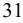

{31}------------------------------------------------

sanctions for a breach. Our electronic health records system is periodically modified to meet applicable security standards. Despite our implementation of various security measures, our infrastructure may be vulnerable to computer viruses, break-ins, and other disruptive problems inadvertently introduced by authorized users such as employees and clients, or purposefully targeted by hackers and other cybercriminals which could lead to interruption, delays, or cessation in service to our clients. Further, such incidents, whether electronic or physical, could jeopardize the security of confidential information, including PHI and other sensitive information stored in our computer systems related to clients, patients, and other parties connected through us, which may deter potential clients and give rise to uncertain liability to parties whose security or privacy has been infringed. A significant security breach could result in fines, loss of clients, damage to our reputation, direct damages, costs of repair and detection, costs to remedy the breach, government penalties, and other expenses. We insure some of our risk with respect to security breaches but the occurrence of any of the foregoing events could have a material adverse effect on our business, results of operations, and our financial condition.

In the United States, in addition to the HIPAA Rules described above, the Company is subject to additional federal and state laws regarding the handling and disclosure of patient records and patient health information. Effective April 5, 2021, HHS published a final rule implementing the information blocking provisions (Information Blocking Rules) of the 21 Century Cures Act. The Information Blocking Rules prohibit covered actors, including healthcare providers, from engaging in activity that is likely to interfere with the access, exchanges, or use of electronic health information ("EHI") unless such activity falls into one of eight exceptions. The Information Blocking Rules provide for civil monetary penalties for noncompliance by healthcare IT vendors and, separately, "appropriate disincentives" for noncompliance by healthcare providers. st

The HIPAA Rules do not supersede state laws that may be more stringent; therefore, we are required to comply with both federal privacy and security regulations as well as varying state privacy and security laws and regulations. These laws vary widely. For example, many states have implemented genetic testing and privacy laws imposing specific patient consent requirements and limiting the disclosure of genetic test results. Penalties for violation include sanctions against a laboratory's licensure as well as civil or criminal penalties. Additionally, private individuals may have a right of action against the Company for violations of a state's privacy laws.

Numerous other federal, state, and international laws govern the collection, use, and disclosure of personal information and may complicate our compliance efforts. Failure to comply with these laws can result in the imposition of significant fines and impact our ability to process certain personal data. For example, in the U.S., the CCPA affords California residents expanded privacy rights and protections and provides for civil penalties for violations and a private right of action related to certain data security breaches. These protections have been expanded by the California Privacy Rights Act ("CPRA"), which became operational in most key respects on January 1, 2023. Similar laws have been proposed or passed at the U.S. federal and state level, including the Virginia Consumer Data Protection Act, which took effect on January 1, 2023, the Colorado Consumer Protection Act, which will take effect on July 1, 2023, the Connecticut Data Privacy Act, which will take effect on July 1, 2023, and the Utah Consumer Privacy Act, which will take effect on December 31, 2023. The legislative and regulatory landscape for privacy and data protection continues to evolve, and there has been an increasing amount of focus on privacy and data protection issues with the potential to affect our business, including laws in all 50 states requiring security breach notification in some circumstances. These and other laws could create liability for us or increase our cost of doing business.

Outside of the U.S., the GDPR, for example, imposes penalties of up to 4.0% of annual global turnover. The GDPR imposes a number of strict obligations and restrictions on the ability to process (which includes collection, analysis, and transfer of) personal data, including health data from performance of clinical tests, clinical trials and adverse event reporting. The GDPR also includes requirements relating to establishing a legal basis for processing personal data, the information provided to the individuals prior to processing their personal data or personal health data, notification of data processing obligations to the national data protection authorities, standards for binding vendors that process personal data, and the security and confidentiality of the personal data. Further, the GDPR prohibits the transfer of personal data to countries outside of the EU that are not considered by the European Commission to provide an adequate level of data protection, including to the United States, except if the data controller meets very specific requirements. Following the Schrems II decision of the Court of Justice of the European Union ("CJEU") on July 16, 2020, which invalidated the EU-US Privacy Shield Framework (the "Privacy Shield") under which personal data could be transferred from the EEA to US entities who had self-certified under the Privacy Shield scheme, there is considerable uncertainty as to the permissibility of international data transfers under the GDPR. While the CJEU upheld the adequacy of the standard contractual clauses (a standard form of contract approved by the European Commission as an adequate personal data transfer mechanism, and potential alternative to the Privacy Shield), it made clear that reliance on them alone may not necessarily be sufficient in all circumstances. Use of the standard contractual clauses must now be assessed on a case-by-case basis taking into account the legal regime applicable in the destination country, in particular applicable surveillance laws and rights of individuals. On June 4, 2021, the European Commission released two revised sets of standard contractual clauses, which have been designed in part to assist organizations in meeting

{32}------------------------------------------------

the requirement of the CJEU's judgment. However, it is unclear how the use of these clauses will be scrutinized and enforced by supervisory authorities and privacy interest groups.

These recent developments may require us to review and amend the legal mechanisms by which we make and/ or receive personal data transfers to/ in the United States. As supervisory authorities issue further guidance on personal data export mechanisms, including circumstances where the standard contractual clauses cannot be used, and/or start taking enforcement action, we could suffer additional costs, complaints and/or regulatory investigations or fines, and/or if we are otherwise unable to transfer personal data between and among countries and regions in which we operate, it could affect the manner in which we provide our services, the geographical location or segregation of our relevant systems and operations, and could adversely affect our financial results.

In addition to the GDPR, numerous other countries have implemented laws governing the use, processing, and cross-border transfer of personal data, such as Switzerland's FADP, Singapore's PDPA, and China's PIPL.

#### **General Risk Factors**

#### **The COVID-19 pandemic is highly dynamic in the United States and throughout the world and may adversely affect our operations and financial condition.**

We are subject to risks related to the public health crises such as the global COVID-19 pandemic. Economic and health conditions in the United States and across most of the globe continue to change rapidly. Due to the COVID-19 pandemic, the Company has experienced significant volatility, including periods of material decline compared to prior year periods, in testing volumes in the Company's base business (which excludes COVID-19 molecular and antibody testing). Demand may fluctuate depending on the duration and severity of the COVID-19 pandemic, the length of time it takes for normal economic and operating conditions to resume, additional governmental actions that may be taken and/or extensions of time for restrictions that have been imposed to date, and numerous other uncertainties. Such events may result in business disruption, reduced revenues and reduced number of tests, any of which could materially affect our business, financial condition, and results of operations.

The COVID-19 pandemic is affecting the Company's customers, suppliers, vendors, and other business partners, but the Company is not able to assess the full extent of the current impact nor predict the ultimate consequences that may result. At this time, we have not experienced significant interruptions in our operations due to supplier delays. We have established a COVID-19 procurement team to partner with our suppliers to reduce the risk of disruption. Distribution channels have not been disrupted as incoming and outgoing tests are delivered via major carriers.

While the potential economic impact brought by and the duration of COVID-19 may be difficult to assess or predict, the widespread pandemic has resulted in, and may continue to result in, significant disruption of global financial markets and a recession or market correction resulting from the spread of COVID-19 could materially affect our business and the value of our common stock. The ultimate extent of the effects of the COVID-19 pandemic on the Company is highly uncertain and will depend on future developments which cannot be predicted.

#### **We are dependent on key personnel and need to hire additional qualified personnel in order for our business to succeed.**

Our performance is substantially dependent on the performance of our senior management and key technical personnel. In particular, our success depends substantially on the continued efforts of our senior management team. The loss of the services of any of our executive officers, our medical staff, our laboratory directors or other key employees could have a material adverse effect on our business, results of operations, and our financial condition. Our future success also depends on our continuing ability to attract and retain highly qualified managerial and technical personnel as we continue to grow. Competition for such personnel is intense and we may not be able to retain our key managerial and technical employees or may not be able to attract and retain additional highly qualified managerial and technical personnel in the future. The inability to attract and retain the necessary managerial and technical personnel could have a material adverse effect upon our business, results of operations, and financial condition.

Additionally, our ability to retain existing clients for our specialized diagnostic services and attract new clients is dependent upon retaining existing sales representatives and hiring and training new sales representatives, which are expensive and time-consuming processes. We face intense competition for qualified sales personnel and our inability to hire or retain an adequate number of sales representatives could limit our ability to maintain or expand our business and increase sales. Even if we are able to increase our sales force, our new sales personnel may not commit the necessary resources or provide sufficient high quality service and attention to effectively market and sell our services. If we are unable to maintain and expand our marketing and sales networks, or if our sales personnel do not perform to our standards, we may be unable to maintain or

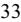

{33}------------------------------------------------

grow our existing business and our results of operations and financial condition will likely suffer accordingly. If a sales representative ceases employment, such termination could result in the loss of client goodwill based on the impairment of relationships developed between the sales representative and the healthcare professionals for whom the sales representative was responsible. This is particularly a risk if the representative goes to work for a competitor, as the healthcare professionals that are our clients may choose to use a competitor's services based on their relationship with our former sales representative.

Further, non-compliant activities and unlawful conduct by sales and marketing personnel could give rise to significant risks under the AKS. We require extensive, comprehensive training of all sales and marketing personnel, but cannot guarantee that every staff member will comply with the training. Thus, in addition to the cost of training sales and marketing personnel, we could face liability under the AKS for non-compliance by individuals engaged in prohibited sales and marketing activities.

#### **Our business operations and reputation may be materially impaired if we do not comply with privacy laws or information security policies.**

In our business, we collect, generate, process, or maintain sensitive information, such as patient data and other personal information. If we use or do not adequately safeguard such information in compliance with applicable requirements under federal, state, and international laws, or if such information were disclosed to persons or entities that should not have access to it, our business could be materially impaired, our reputation could suffer, and we could be subject to fines, penalties, and litigation. In the event of a data security breach, we may be subject to notification obligations, litigation, and governmental investigation or sanctions and may suffer reputational damage, which could have an adverse impact on our business.

We are subject to laws and regulations regarding protecting the security and privacy of certain healthcare and personal information, including: (a) HIPAA and the regulations thereunder, which establish (i) a complex regulatory framework including requirements for safeguarding protected health information and (ii) comprehensive federal standards regarding the uses and disclosures of protected health information; (b) state laws, including the CCPA; and (c) the European Union's GDPR.

#### **We may not be able to implement our business strategy, which could impair our ability to continue operations.**

Implementation of our business strategies will depend in large part on our ability to (i) attract and maintain a significant number of clients; (ii) effectively provide acceptable products and services to our clients; (iii) develop and license new products and technologies; (iv) obtain adequate financing on favorable terms to fund our business strategies; (v) maintain appropriate internal procedures, policies, and systems; (vi) hire, train, and retain skilled employees and management; (vii) continue to operate despite competition in the medical laboratory industry; (viii) be paid reasonable fees by government payers that will adequately cover our costs; (ix) establish, develop, and maintain our name recognition; and (x) establish and maintain beneficial relationships with third-party insurance providers and other third-party payers. Our inability to obtain or maintain any or all these factors could impair our ability to implement our business strategies successfully, which could have material adverse effects on our results of operations and financial condition.

#### **We may be unable to realize estimated benefits from our cost reduction and restructuring efforts and our profitability may be hurt or our business might otherwise be adversely affected.**

We engaged in restructuring activities in 2022 and these types of cost reduction and restructuring activities are ongoing and complex. If we do not successfully manage our current restructuring activities, or any other restructuring activities that we may take in the future, any expected efficiencies and benefits might be delayed or not realized, and our operations and business could be disrupted. Restructuring presents potential risks of events occurring that could adversely affect us, including: actual or perceived disruption of service to customers; the failure to preserve supplier relationships and distribution, sales and other important relationships and to resolve conflicts that may arise; diversion of management attention from ongoing business activities; and the failure to maintain employee morale and retain key employees. In addition, the costs associated with implementing restructuring activities might exceed expectations, which could result in additional future charges. Because of these and other factors, we cannot predict whether we will realize the purpose and anticipated benefits of these measures and, if we do not, our business and results of operations may be adversely affected.

#### **If we are unable to successfully integrate future acquisitions with our legacy business, the anticipated benefits of such transaction may not be realized.**

Acquisitions require us to devote significant management attention and resources to integrating the acquired company's business practices and operations with our own. Potential difficulties we may encounter as part of the integration process, all of which could materially and adversely affect our business, financial condition, results of operations, and cash flows, include the following:

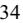

{34}------------------------------------------------

- the potential inability to successfully combine the acquired company's business with our legacy business in a manner that permits us to achieve the cost synergies expected to be achieved when expected, or at all, and other benefits anticipated to result from such transaction;
- challenges optimizing the customer information and technology of the two companies, including the goal of consolidating to one laboratory information system and one billing system;
- challenges effectuating any diversification strategy, including challenges achieving revenue growth from sales of each company's products and services to the customers of the other company;
- difficulties offering products and services across our expanded portfolio;
- the need to revisit assumptions about reserves, revenues, capital expenditures, and operating costs, including expected synergies;
- challenges faced by a potential diversion of the attention of our management as a result of the integration, which in turn could adversely affect our ability to maintain relationships with customers, employees and other constituencies or our ability to achieve the anticipated benefits of such transaction;
- the potential loss of key employees, customers, managed care contracts, or strategic partners, or the ability to attract or retain key management and other key personnel, which could have an adverse effect on our ability to integrate and operate the acquired business;
- complexities associated with managing the combined businesses, including difficulty addressing possible differences in corporate cultures and management philosophies and the challenge of integrating complex systems, technology, networks, and other assets of each of the companies in a seamless manner that minimizes any adverse impact on customers, suppliers, employees, and other constituencies;
- costs and challenges related to the integration of the acquired company's internal controls over financial reporting with ours; and
- potential unknown liabilities and unforeseen increased expenses.

We cannot be assured that all of the goals and anticipated benefits of an acquisition will be achievable, particularly as achievement of the benefits is in many important respects subject to factors that we do not control. These factors would include the reactions of third parties with whom we enter into contracts and do business and the reactions of investors and analysts.

If we cannot successfully integrate our legacy business with any future business we may acquire, we may fail to realize the expected benefits of such transaction, including the anticipated cost synergies. We could also encounter additional transaction and integration costs or be subject to other factors that affect preliminary estimates.

#### **If goodwill and intangible assets that we recorded in connection with our acquisitions become impaired, we may have to take significant charges against earnings.**

In connection with the accounting for our completed acquisitions, we recorded a significant amount of goodwill and intangible assets. Goodwill and indefinite-lived intangible assets are evaluated for impairment annually, or more frequently if conditions warrant, by comparing the carrying value of a reporting unit to its estimated fair value. Intangible assets with definite lives are reviewed for impairment when events or circumstances indicate that their carrying value may not be recoverable. Declines in operating results, sustained market declines and other factors that impact the fair values of our reporting units could result in an impairment of goodwill or intangible assets and a charge against earnings, which could materially adversely affect our results of operations or financial condition in future periods.

#### **We may incur greater costs than anticipated, which could result in sustained losses.**

We use reasonable efforts to assess and predict the expenses necessary to pursue our business strategies. However, implementing our business strategies may require more employees, capital equipment, supplies, or other expenditure items than management has predicted, particularly as we continue to assess any further needs resulting from the growth of our Pharma Services segment. Similarly, the cost of compensating additional management, employees, and consultants or other operating costs may be more than we estimate, which could result in ongoing and sustained losses.

#### **We may face fluctuations in our results of operations and we are subject to seasonality in our business which could negatively affect our business operations.**

Management expects that our results of operations may fluctuate significantly in the future as a result of a variety of factors, including, but not limited to: (i) the continued rate of growth, usage, and acceptance of our products and services; (ii) demand for our products and services; (iii) the introduction and acceptance of new or enhanced products or services by us or by competitors; (iv) our ability to anticipate and effectively adapt to developing markets and to rapidly changing technologies;

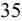

{35}------------------------------------------------

(v) our ability to attract, retain, and motivate qualified personnel; (vi) the initiation, renewal, or expiration of significant contracts with any major clients; (vii) pricing changes by us, our suppliers, or our competitors; (viii) seasonality; and (ix) general economic conditions and other factors. Accordingly, future sales and operating results are difficult to forecast. Our expenses are based in part on our expectations as to future revenues and to a significant extent are relatively fixed, at least in the short-term. We may not be able to adjust spending in a timely manner to compensate for any unexpected revenue shortfall. Accordingly, any significant shortfall in relation to our expectations would likely have an immediate adverse impact on our business, results of operations, and financial condition. In addition, we may determine from time to time to make certain pricing or marketing decisions or acquisitions that could have a short-term material adverse effect on our business, results of operations, and financial condition and may not result in the long-term benefits intended. Furthermore, in Florida, historically our largest referral market for laboratory testing services, a meaningful percentage of the population returns to their homes in the Northern United States to avoid the hot summer months. This combined with our clients' usual summer vacation schedules typically results in seasonality in our business. Because of all of the foregoing factors, our operating results in future periods could be less than the expectations of investors.

#### **The steps we have taken to protect our proprietary rights may not be adequate, which could result in infringement or misappropriation by third parties.**

We regard our copyrights, trademarks, trade secrets, and similar intellectual property as critical to our success, and we rely upon trademark law, copyright law, trade secret protection, and confidentiality and/or license agreements with our employees, clients, partners, and others to protect our proprietary rights. The steps taken by us to protect our proprietary rights may not be adequate or third parties may infringe or misappropriate our copyrights, trademarks, trade secrets, and similar proprietary rights. In addition, other parties may assert infringement claims against us.

#### **ITEM 1B. UNRESOLVED STAFF COMMENTS**

None.

#### **ITEM 2. PROPERTIES**

We operate an international network of laboratories. Our leases expire at various dates through 2041. We believe that these locations are sufficient to meet our needs at existing volume levels and, if needed, additional space will be available at a reasonable cost.

We maintain laboratories at all of our facilities, as well as administrative offices at four of our locations. The following table summarizes our facilities by location and approximate square footage:

| Location                    | Square Footage |
|-----------------------------|----------------|
| Fort Myers, Florida         | 150,000        |
| Aliso Viejo, California     | 112,700        |
| Houston, Texas              | 32,800         |
| Carlsbad, California        | 28,600         |
| San Diego, California       | 25,400         |
| Durham, North Carolina      | 14,500         |
| Cambridge, United Kingdom   | 12,500         |
| Geneva (Rolle), Switzerland | 8,000          |
| Nashville, Tennessee        | 7,800          |
| Tampa, Florida              | 5,600          |
| Phoenix, Arizona            | 4,700          |
| Chicago, Illinois           | 4,600          |
| Singapore                   | 4,000          |
| Atlanta, Georgia            | 3,800          |
| Suzhou, China               | 3,400          |
| Fresno, California          | 2,600          |

Our Nashville, Tennessee; Tampa, Florida; Atlanta, Georgia; and Phoenix, Arizona locations support our Clinical Services segment exclusively. Our Rolle, Switzerland; Singapore and Suzhou, China laboratories support our Pharma Services

{36}------------------------------------------------

segment exclusively. All other locations serve both segments of the business. For further financial information about our segments, please refer to Note 20. Segment Information, in the notes to our Consolidated Financial Statements.

#### **ITEM 3. LEGAL PROCEEDINGS**

From time to time the Company is engaged in legal proceedings, including proceedings that arise in the ordinary course of business. For further information on legal proceedings, please refer to Note 18. Commitments and Contingencies, in the notes to our Consolidated Financial Statements.

### **ITEM 4. MINE SAFETY DISCLOSURES**

Not applicable.

#### **PART II**

### **ITEM 5. MARKET FOR THE REGISTRANT'S COMMON EQUITY, RELATED STOCKHOLDER MATTERS AND ISSUER PURCHASES OF EQUITY SECURITIES**

#### **Market Information**

Our common stock is listed on The Nasdaq Stock Market LLC under the symbol "NEO."

#### **Holders of Common Stock**

As of February 20, 2023, there were 741 stockholders of record of our common stock. The number of record holders does not include beneficial owners of common stock whose shares are held in the names of banks, brokers, nominees or other fiduciaries.

#### **Dividends**

We have never declared or paid cash dividends on our common stock. We intend to retain all future earnings to finance operations and future growth and, therefore, we do not anticipate paying any cash dividends in the foreseeable future. Our financing arrangements contain certain restrictions on our ability to pay dividends on our common stock.

#### **Equity Compensation Plan Information**

The following table summarizes the securities authorized for issuance under equity compensation plans as of December 31, 2022:

| Plan Category                                                                         | Number of securities to be issued upon exercise of outstanding options, warrants and rights | Weighted average exercise price of outstanding options, warrants and rights | Number of securities remaining available for future issuance under equity compensation plans |
|---------------------------------------------------------------------------------------|---------------------------------------------------------------------------------------------------|-----------------------------------------------------------------------------------|----------------------------------------------------------------------------------------------------|
| Equity compensation plans approved by security holders:                               |                                                                                                   |                                                                                   |                                                                                                    |
| Amended and Restated Equity Incentive Plan (1) ("Equity Incentive Plan") (2) | 3,271,004                                                                                         | \$ 17.67                                                                       | 4,868,198                                                                                          |
| Employee Stock Purchase Plan ("ESPP")                                                 | —                                                                                                 | N/A                                                                               | 709,107                                                                                            |
| Equity compensation plans not approved by security holders:                           |                                                                                                   |                                                                                   |                                                                                                    |
| (3) Inducement Awards                                                              | 943,613                                                                                           | \$ 12.36                                                                       | —                                                                                                  |
| Total                                                                                 | 4,214,617                                                                                         |                                                                                   | 5,577,305                                                                                          |

The Company's Equity Incentive Plan was amended, restated and subsequently approved by a majority of stockholders on December 21, 2015, and amended and subsequently approved by a majority of stockholders on May 25, 2017, and then amended and subsequently approved by a majority of stockholders again on May 27, 2021. The most recent amendment increased the maximum aggregate number of shares of the Company's common stock reserved and available for issuance under the Equity Incentive Plan to 25,625,000. (1)

The Company's Employee Stock Purchase Plan was amended, restated and subsequently approved by a majority of stockholders on June 6, 2013, and amended and subsequently approved by a majority of stockholders on May 25, 2017, amended and subsequently approved by a majority of stockholders again on June 1, 2018, and then amended and subsequently approved by a majority of stockholders again (2)

{37}------------------------------------------------

- on June 2, 2022. The most recent amendment increased the maximum aggregate number of shares reserved and available for issuance under the Employee Stock Purchase Plan to 2,500,000.
- Mr. Christopher M. Smith was appointed CEO effective August 15, 2022. Mr. Jeffrey S. Sherman was appointed CFO effective December 5, 2022. In connection with these appointments, the Company entered into a Form of Stand-Alone Inducement Restricted Stock Agreement and a Form of Stand-Alone Inducement Stock Option Agreement with Mr. Smith, and subsequently with Mr. Sherman (together, the "2022 Inducement Agreements"). The maximum aggregate number of shares reserved and available for issuance under the 2022 Inducement Agreements is 1,679,641. (3)

Currently the Company's Equity Incentive Plan, as amended most recently on May 27, 2021, and the Company's ESPP, as amended most recently on June 2, 2022, are the only equity compensation plans in effect.

#### **Recent Sales of Unregistered Securities**

None for the year ended December 31, 2022 that have not been previously included in a Current Report on Form 8-K.

#### **Issuer Purchases of Equity Securities**

The following table sets forth information concerning our purchases of common stock for the periods indicated:

| Period of Repurchase                 | Total Number of Shares Purchased (4) | Average Price Paid per Share | Total Number of Shares Purchased as Part of Publicly Announced Plans or Programs | Maximum Number (or Approximate Dollar Value) of Shares that May Yet Be Purchased Under the Plans or Programs |
|--------------------------------------|-----------------------------------------|---------------------------------|----------------------------------------------------------------------------------------|--------------------------------------------------------------------------------------------------------------------------|
| October 1, 2022 - October 31, 2022   | 67                                      | \$ 8.10                      | —                                                                                      | —                                                                                                                        |
| November 1, 2022 - November 30, 2022 | 15                                      | \$ 10.43                     | —                                                                                      | —                                                                                                                        |
| December 1, 2022 - December 31, 2022 | 22,546                                  | \$ 9.24                      | —                                                                                      | —                                                                                                                        |
| Total                                | 22,628                                  |                                 | —                                                                                      | —                                                                                                                        |

The Company's Equity Incentive Plan, as amended on May 27, 2021, allows participants to surrender vesting shares having a fair market value equal to the required withholding tax related to the vesting of restricted stock. Pursuant to a share withholding election made by participants in connection with the vesting of such awards, all of which were outside of a publicly-announced repurchase plan, we acquired from such participants the shares noted in the table above to satisfy tax withholding obligations related to the vesting of their restricted stock. The average prices listed in the above table are averages of the fair market prices at which we valued shares withheld for purposes of calculating the number of shares to be withheld. (4)

{38}------------------------------------------------

#### **Comparison of Cumulative Five Year Total Return**

We have presented below the cumulative total return to our stockholders of \$100 during the period from December 31, 2017, through December 31, 2022, in comparison to the cumulative return on the S&P 500 Index, the Nasdaq Biotechnology Index (^NBI) and a customized peer group of five publicly traded companies during that same period. The peer group is made up of Invitae Corporation, Exact Sciences Corporation, Laboratory Corporation of America Holdings, Natera, Inc., and Quest Diagnostics, Inc. Several of our closest competitors are part of large pharmaceutical or other multi-national firms, or are privately held and, as such, we are unable to obtain financial information for them.

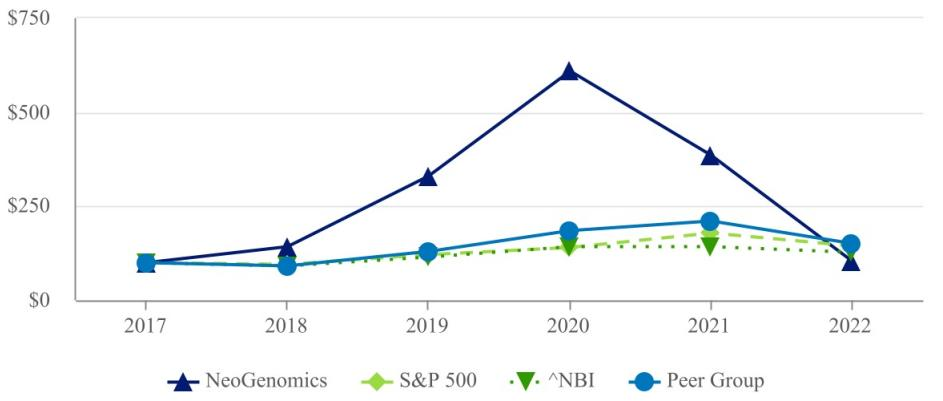

The results assume that \$100 (with reinvestment of all dividends) was invested in our common stock, the index, and in the peer group and its relative performance tracked through December 31, 2022. The comparisons are based on historical data and are not indicative of, nor intended to forecast, the future performance of our common stock. The performance graph set forth above shall not be deemed incorporated by reference into any filing by us under the Securities Act of 1933, as amended (the "Securities Act") or the Exchange Act except to the extent that we specifically incorporate such information by reference therein.

#### **ITEM 6. SELECTED FINANCIAL DATA**

Reserved.

#### **ITEM 7. MANAGEMENT'S DISCUSSION AND ANALYSIS OF FINANCIAL CONDITION AND RESULTS OF OPERATIONS**

#### **Introduction**

The following discussion and analysis should be read in conjunction with the Consolidated Financial Statements and the Notes thereto included in this Annual Report on Form 10-K. The information contained below includes statements of management's beliefs, expectations, hopes, goals and plans that, if not historical, are forward-looking statements subject to certain risks and uncertainties that could cause actual results to differ materially from those anticipated in the forward-looking statements. For a discussion on forward-looking statements, see the information set forth in the introductory note to this Annual Report under the caption "Forward Looking Statements," which information is incorporated herein by reference. For discussion and analysis pertaining to 2021 overview and highlights as compared to 2020, please refer to the Company's Annual Report on Form 10-K, filed with the Securities and Exchange Commission ("SEC") on February 25, 2022.

### **Our Company**

NeoGenomics is a high-complexity clinical laboratory that specializes in cancer genetics diagnostic testing and pharma services. Our testing servicesinclude cytogenetics, FISH, flow cytometry, IHC, molecular testing and morphologic analysis. We operate CAP accredited and CLIA certified laboratories for full-service sample processing in Fort Myers, Florida; Aliso Viejo and San Diego, California; Research Triangle Park, North Carolina; and Houston, Texas; and CAP accredited full-service, sample-processing laboratories in Rolle, Switzerland; Singapore and China. CAP accreditation is pending in

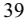

{39}------------------------------------------------

Cambridge, United Kingdom. NeoGenomics also has several, small, non-processing laboratory locations across the United States for providing analysis services. NeoGenomics serves the needs of pathologists, oncologists, academic centers, hospital systems, pharmaceutical firms, integrated service delivery networks, and managed care organizations throughout the United States and pharmaceutical firms in Europe and Asia.

### **2022 Overview and Highlights**

- We increased consolidated revenue by 5.2% compared to 2021, including increases in Clinical Services revenue of 3.6% and in Pharma Services revenue of 13.5%;
- Revenue growth over prior year accelerated each quarter in 2022;
- Reported sequential revenue, gross margin and adjusted EBITDA growth in each of the four quarters of 2022;
- Strengthened our executive leadership team by welcoming Chris Smith, Chief Executive Officer; Jeff Sherman, Chief Financial Officer; Warren Stone, President, Clinical Services; Vishal Sikri, President, Pharma Services and President and Chief Commercial Officer, Inivata; and Melody Harris, President, Enterprise Operations;
- Developed our vision of "OneNeo" to better integrate the Company, align our core capabilities and enhance communication; and
- Initiated a restructuring effort to take significant costs out of the business in 2023.

#### **Company Outlook**

Advances in science and technology are driving a proliferation of oncology therapies and associated diagnostic tests. These diagnostic tools and therapies are increasing survival and enhancing quality-of-life for cancer patients. As a leading global oncology diagnostics company serving biopharmaceutical companies as well as practicing oncologists and pathologists, NeoGenomics facilitates the adoption of these advanced oncology diagnostic tools beyond the academic environment into the community setting. We are continuously enhancing and expanding our test menu to ensure that providers and patients have access to leading edge solutions such as advanced molecular testing and state-of-the art digital pathology. Moreover, our team of MDs and PhDs, along with our highly-trained oncology-focused sales team, provides ongoing education to our clients to ensure that they remain abreast of cutting-edge developments in oncology.

We are a leading provider of oncology-diagnostic services to biopharma companies. We will continue to work with these clients across the drug development continuum—from research and development through clinical trials testing—to commercialization of companion diagnostic tests. We expect to continue to grow our Pharma Services business through (i) global expansion in both Europe and Asia, (ii) expansion of our test offerings (including leading edge NGS tools such as WES, WGS, RaDaR), and (iii) our unique capabilities for developing and commercializing companion diagnostic tests.

We are continuing to develop and broaden our informatics and data-related tools to leverage our strategic market position and oncology expertise to help our stakeholders solve real-world problems such as identifying patients for clinical trials or providing clinical decision support tools for physicians and providers. We are committed to connecting patients with life altering therapies and trials. In carrying out these commitments, NeoGenomics aims to provide transparency and choice to patients regarding the handling and use of their data through our Notice of Privacy Practices, and has invested in leading technologies to help ensure the data we maintain is secured at all times.

We believe lower cost and increased value of testing is extremely important to the healthcare industry and creates a competitive advantage. We will invest in information technology, automation and best practices to continually improve our processes and drive down the cost of testing. We will continue to expand our test menu and expect to remain at the forefront of the ongoing revolution in cancer related genetic and molecular testing to achieve our vision of becoming one of the world's leading cancer testing and information companies.

We continue to develop our company-wide focus, which includes the following four critical success factors for 2023:

### Profitably Grow Core Business

- Grow volume and NGS mix;
- Improve turnaround time;
- Win on service;
- Expand and optimize commercial optimization; and
- Improve product offering.

#### Accelerate Advanced Diagnostics

- Execute clinical RaDaR™ (MRD) launch;
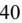

{40}------------------------------------------------

- Launch Neo Comprehensive, new NGS offering;
- Continue to improve Pharma growth and profitability; and
- Focus on enterprise data strategy.

#### Improve Profitability

- Increase productivity and efficiency;
- Manage general and administrative spend;
- Focused investments; and
- Prioritize revenue cycle management.

These critical success factors have been communicated throughout our Company. We have structured departmental goals around these factors and have created employee incentive plans in which every employee will have a meaningful incentive for our success.

### **Regulatory Environment**

The FDA is currently considering changes that may include increased regulation of LDTs by the FDA. In October 2014 the FDA announced its proposed framework and timetable and indicated it would move toward greater oversight of LDTs. The FDA has not finalized the framework they announced in 2014. In 2017 the FDA shifted its approach to oversight of LDTs, indicating that they would work with Congress and stakeholders on a new legislative framework and pathway for all diagnostic testing. In 2018 the FDA began limited enforcement activities on a subset of LDTs known as pharmacogenetic testing ("PGx"). NeoGenomics is a member of the American Clinical Laboratory Association ("ACLA"), which has been in active discussions with the FDA and Congress regarding FDA oversight of LDT's. However, recent agency announcements made in the context of the COVID-19 public health emergency have produced a shifting policy landscape and further uncertainty regarding FDA's role in regulating LDTs: in August 2020, HHS announced that FDA would not require premarket review of LDTs absent notice-and-comment rulemaking, but in November 2021, HHS issued a statement withdrawing that prior announcement, indicating a return to FDA's longstanding approach to the regulation and enforcement discretion toward LDTs. The most recent such proposal, the VALID Act, was introduced in both the House and Senate on June 24, 2021. The VALID Act was expected to be included in the Omnibus bill signed at the end of 2022, but ultimately was not included and that, as such, it remains unclear whether the VALID Act will be passed 2023 or whether FDA will proceed through rulemaking. At this time, we cannot predict what the current administration impact will be on the oversight and regulation of LDTs or if there will be any additional changes to current rules and regulations.

We closely monitor changes in legislation and take specific actions to identify and estimate the impact of changes in legislation whenever possible as regulatory changes can affect reimbursement for clinical laboratory services. We do not anticipate significant changes to our clinical revenue in 2023 resulting from known changes in legislation or rulemaking.

#### **Reportable Segments**

We report our activities in two reportable segments—the Clinical Services Segment and the Pharma Services Segment. We have presented the financial information reviewed by the Chief Operating Decision Maker including revenues, cost of revenue, and gross margin for each of our reportable segments. Assets are not presented at the segment level as that information is not used by the CODM.

### Clinical Services

The clinical cancer testing services we offer to community-based pathologists and oncologists are designed to be a natural extension of, and complementary to, the services that they perform within their own practices. We believe our relationship as a non-competitive partner to community-based pathology practices, hospital pathology labs, reference labs, and academic centers can empower them to expand their breadth of testing to provide a menu of services that could match or exceed the level of service found in any center of excellence around the world. Community-based pathology practices and hospital pathology labs may order certain testing services on a technical component only ("TC" or "tech-only") basis, which allows them to participate in the diagnostic process by performing the professional component ("PC") interpretation services without having to hire laboratory technologists or purchase the sophisticated equipment needed to perform the technical component of the tests. We also support our pathology clients with interpretation and consultative services using our own specialized team of pathologists for difficult or complex cases and we provide overflow interpretation services when requested by clients.

We are a leading provider of Molecular and NGS testing. These tests are interpreted by NeoGenomics' team of Molecular experts and are often ordered in conjunction with other testing modalities. NGS panels are one of our fastest growing testing areas and clients can often receive a significant amount of biomarker information from very limited samples. These

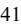

{41}------------------------------------------------

comprehensive panels can allow for faster treatment decisions for patients as compared to a series of single-gene molecular tests being ordered sequentially. We have a broad Molecular testing menu and our targeted NeoTYPE panels include genes relevant to a particular cancer type, as well as other complementary tests such as IHC and FISH. In addition, we offer molecular-only NGS targeted and comprehensive panels which combine DNA and RNA into a single work stream in order to report a full spectrum of genomic alterations, including mutations, fusions, copy number variations, and gene expression. This comprehensive menu means that our clients can get most of their oncology testing needs satisfied by our laboratory. This is attractive to our clients as patient samples do not need to be split and then managed across several laboratories. The acquisition of Inivata provided us with oncology Liquid Biopsy technology capabilities. InVisionFirst -Lung is a highly sensitive, targeted plasma-based assay for patients with non-small cell lung cancer, and RaDaR is an industry-leading liquid biopsy assay designed to detect residual disease and recurrence in plasma samples from patients with solid tumor malignancies. We expect our Molecular laboratory and NGS capabilities to be a key growth driver in the coming years. ® ®

In addition, we directly serve oncology, dermatology and other clinician practices that prefer to have a direct relationship with a laboratory for cancer-related genetic testing services. We typically serve these types of clients with a comprehensive service offering where we perform both the technical and professional components of the tests ordered. In certain instances, larger clinician practices have begun to internalize pathology interpretation services, and our tech-only service offering allows these larger clinician practices to also participate in the diagnostic process by performing the PC interpretation services on TC testing performed by us. In these instances we will typically provide all of the more complex, molecular testing services.

#### Pharma Services

Our Pharma Services revenue consists of three revenue streams:

- Clinical trials and research;
	- Validation laboratory services; and
- Informatics.

Our Pharma Services segment supports pharmaceutical firms in their drug development programs by supporting various clinical trials and research. This portion of our business often involves working with the pharmaceutical firms ("sponsors") on study design as well as performing the required testing. Our medical team often advises the sponsor and works closely with them as specimens are received from the enrolled sites. We also work on developing tests that will be used as part of a companion diagnostic to determine patients' response to a particular drug. As studies unfold, our clinical trials team reports the data and often provides key analysis and insights back to the sponsors.

Our Pharma Services segment provides comprehensive testing services in support of our pharmaceutical clients' oncology programs from discovery to commercialization. In biomarker discovery, our aim is to help our customers discover the right content. We help our customers develop a biomarker hypothesis by recommending an optimal platform for molecular screening and backing our discovery tools with the informatics to capture meaningful data. In other pre-clinical and non-clinical work, we can use our platforms to characterize markers of interest. Moving from discovery to development, we seek to help our customers refine their biomarker strategy and, if applicable, develop a companion diagnostic pathway using the optimal technology for large-scale clinical trial testing.

Whether serving as the single contract research organization or partnering with one, our Pharma Services team provides significant technical expertise, working closely with our customers to support each stage of clinical trial development. Each trial we support comes with rapid turnaround time, dedicated project management and quality assurance oversight. We have experience in supporting submissions to the Federal Drug Administration ("FDA") for companion diagnostics. Our Pharma Services strategy is focused on helping to bring more effective oncology treatments to market through providing world-class laboratory services in oncology to key pharmaceutical companies in the industry.

We believe that we are well positioned to service Pharma sponsors across the full continuum of the drug development process. Our Pharma Services team can work with these sponsors during the basic research and development phase as compounds come out of translational research departments, as well as work with clients from Phase I, Phase II and Phase III clinical trials as the sponsors work to demonstrate the efficacy of their drugs. The laboratory biomarker tests that are developed during this process may become companion diagnostic ("CDx") tests, that will be used on patients to determine if they could respond to a certain therapy. We are able to offer these CDx tests to the market immediately after FDA approval as part of our Day 1 readiness program. This ability helps to speed the commercialization of a drug and can enable Pharma sponsors to reach patients through our broad distribution channel in the Clinical Services segment.

We are committed to connecting patients with life-altering therapies and trials. In carrying out these commitments, we aim to provide transparency and choice to patients regarding the handling and use of their data through our Notice of Privacy

{42}------------------------------------------------

Practices, and have invested in leading technologies to ensure the data we maintain is secure at all times. We are continuing to develop and broaden our informatics and datarelated tools to leverage our unique market position and oncology expertise to help our stakeholders solve real-world problems such as identifying patients for clinical trials or providing clinical decision support tools for physicians and providers. We also offer testing and informatics tools, such as Trapelo™, to help health care professionals navigate the rapidly evolving field of precision medicine. Trapelo™ is an end-to-end, clinical decision-support platform designed to resolve the complexities of precision oncology – from test ordering to therapy selection to navigating prior authorization.

#### **Critical Accounting Policies and Estimates**

The preparation of financial statements in conformity with U.S. generally accepted accounting principles ("GAAP") requires management to make estimates and assumptions that affect the reported amounts of assets and liabilities and disclosure of contingent assets and liabilities at the dates of the financial statements and the reported amounts of revenues and expenses during the reporting periods. Actual results could differ from those estimates. Our management routinely makes judgments and estimates about the effects of matters that are inherently uncertain. Please refer to Note 2. Summary of Significant Accounting Policies, to our Consolidated Financial Statements for a complete description of our significant accounting policies.

Our critical accounting policies are those where we have made difficult, subjective, or complex judgments in making estimates and/or where these estimates can significantly impact our financial results under different assumptions and conditions. Our critical accounting policies are:

- Business Combinations;
- Accounts Receivable;
- Recoverability and Impairment of Long-Lived Assets;
- Goodwill;
- Contingencies;
- Stock-based Compensation;
- Revenue Recognition; and
- Deferred Taxes.

#### Business Combinations

Results of operations and cash flows of acquired companies are included in our operating results from the date of acquisition. We allocate the purchase price of acquisitions to the assets acquired and liabilities assumed based on their estimated fair values. Any excess purchase price over the estimated fair value assigned to the net tangible and identifiable intangible assets acquired and liabilities assumed is recorded to goodwill. Transaction costs associated with acquisitions are expensed as incurred in general and administrative expenses.

### Accounts Receivable

Accounts receivable are reported for all Clinical Services payers based on the amount expected to be collected, which considers implicit price concessions.

For Pharma Services, we negotiate billing schedules and payment terms on a contract-by-contract basis, which often includes payments based on certain milestones being achieved. Receivables are generally reported over time based on the number of units completed, which aligns with the progress towards fulfilling its obligations under the contract.

#### Recoverability and Impairment of Long-Lived Assets

We review the recoverability of our long-lived assets (including definite-lived intangible assets) if events or changes in circumstances indicate the assets may be impaired. Evaluation of possible impairment is based on our ability to recover the asset from the expected future pretax cash flows (undiscounted and without interest charges) of the related operations. If the expected undiscounted pretax cash flows are less than the carrying amount of such asset, an impairment loss is recognized for the difference between the estimated fair value to the carrying amount of the asset.

### Goodwill

We evaluate goodwill on an annual basis in the fourth quarter, or more frequently if management believes indicators of impairment exist. Such indicators could include, but are not limited to, (1) a significant adverse change in legal factors or in business climate, (2) unanticipated competition, or (3) an adverse action or assessment by a regulator. We first assess qualitative factors to determine whether it is more likely than not that the fair value of a reporting unit is less than its carrying

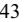

{43}------------------------------------------------

amount, including goodwill. If management concludes that it is more likely than not that the fair value of a reporting unit is less than its carrying amount, management performs a quantitative goodwill impairment test. The quantitative analysis is performed by comparing the fair value of the reporting unit to its carrying value. If the carrying value is greater than the estimate of fair value, an impairment loss will be recognized for the amount in which the carrying amount exceeds the reporting unit's fair value. We estimate the fair values of our reporting units using a combination of the income, or discounted cash flows approach and the market approach, which utilizes comparable companies' data.

As of June 30, 2022 we performed a qualitative assessment to determine whether it was more likely than not that the fair values of our reporting units were less than their carrying values. Such qualitative factors included macroeconomic conditions, industry and market considerations, cost factors, overall financial performance and other relevant events. As a result of the qualitative assessment, we determined that due to changes in executive leadership and the sustained decline in our stock price of \$12.15 per share as of March 31, 2022 to \$8.15 per share as of June 30, 2022, there were indicators that it was more likely than not that the fair values of the reporting units were less than their carrying values. Accordingly, we performed a quantitative analysis and compared our reporting units' fair values to their carrying values to determine whether goodwill was impaired. We determined the fair values of our reporting units using a combination of the income approach using discounted cash flows and the market approach utilizing comparable companies' data. The assumptions and estimates, including management's estimated future revenue growth rates, estimated future margins and discount rates, used in the quantitative analysis were based on management's best estimate about current and future conditions including projected net revenue from emerging market technologies acquired through the June 2021 acquisition of Inivata. The results of the quantitative analysis showed that the reporting units' fair values exceeded their carrying values and there was no impairment of the recorded goodwill as of June 30, 2022. However, to the extent we continue to experience declines in our stock price or experience other indicators, such as industry and market considerations or declines in financial performance, that the fair values of our reporting units are less than their carrying values, there could be a risk of goodwill impairment of our reporting units in future periods.

#### Contingencies

We accrue contingent losses when estimated impacts of various conditions, situations or circumstances involve uncertain outcomes. Contingent losses are recorded based on management judgment along with internal and external advice from legal counsel and/or technical consultants. Estimated losses from contingencies are recorded when both of the following conditions are met: (i) information available before the financial statements are issued (or available to be issued) indicates that it is probable that an asset has been impaired or a liability has been incurred at the date of the financial statements and (ii) the amount of loss can be reasonably estimated. If some amount within a range of loss appears at the time to be a better estimate than any other amount within the range, that amount shall be accrued. When no amount within the range is a better estimate than any other amount, however, the minimum amount in the range shall be accrued.

#### Stock-based Compensation

We recognize compensation costs for all share-based payment awards made to employees, non-employee contracted physicians and directors based upon the awards' initial grant-date fair value. Prior to 2021, we estimated the fair value of stock options using a trinomial lattice model. On January 1, 2021, we began applying the Black-Scholes option valuation model on a prospective basis to new awards. Stock compensation is recognized on a straight-line basis over the awards' requisite service periods. The periodic expense is adjusted for actual forfeitures.

#### Revenue Recognition

### *Clinical Services Revenue*

Our specialized diagnostic services are performed based on an online test order or a written test requisition form. The performance obligation is satisfied and revenues are recognized once the diagnostic services have been performed and the results have been delivered to the ordering physician. These diagnostic services are billed to various payers, including client direct billing, commercial insurance, Medicare and other government payers, and patients. Revenue is recorded for all payers based on the amount expected to be collected, which considers implicit price concessions. Implicit price concessions represent differences between amounts billed and the estimated consideration we expect to receive based on negotiated discounts, historical collection experience and other anticipated adjustments, including anticipated payer denials. Collection of consideration we expect to receive typically occurs within 90 to 120 days of billing for commercial insurance, Medicare and other governmental and self-pay patients and within 60 to 90 days of billing for client payers.

The following table reflects our estimate of the breakdown of net clinical revenue by type of payer for the years ended December 31, 2022, 2021 and 2020:

{44}------------------------------------------------

|                               | 2022  | 2021  | 2020  |
|-------------------------------|-------|-------|-------|
| Client direct billing         | 67 %  | 63 %  | 63 %  |
| Commercial insurance          | 17 %  | 19 %  | 20 %  |
| Medicare and other government | 16 %  | 18 %  | 17 %  |
| Total                         | 100 % | 100 % | 100 % |

#### *Pharma Services Revenue*

Our Pharma Services segment generally enters into contracts with pharmaceutical and biotech customers as well as other contract research organizations ("CROs") to provide research and clinical trial services. Such services also include validation studies and assay development. We record revenue on a unit-of-service basis based on the number of units completed towards the satisfaction of a performance obligation. Certain contracts include upfront fees or billing milestones that are recognized over time, which aligns with the progress of fulfilling our obligations under the contract.

Additional offerings within the Pharma Services portfolio includes Informatics, which involves the licensing of de-identified data to pharmaceutical and biotech customers in the form of either retrospective records or prospective deliveries of data. Informatics revenue is recognized at a point in time upon delivery of retrospective data or over time for prospective data feeds. We negotiate billing schedules and payment terms on a contract-by-contract basis, and contract terms generally provide for payments based on a unit-ofservice arrangement.

Amounts collected in advance of services being provided are deferred as contract liabilities on the Consolidated Balance Sheets. The associated revenue is recognized and the contract liability is reduced as the contracted services are subsequently performed. Contract assets are established for revenue recognized but not yet billed. These contract assets are reduced once the customer is invoiced and a corresponding receivable is recorded. Additionally, Pharma Services incurs sales commissions in the process of obtaining contracts with customers. Sales commissions that are payable upon contract award are recognized as assets and amortized over the expected life of the customer relationship. For offerings with primarily short-term contracts, such as Informatics, we apply the practical expedient which allows costs to obtain a contract to be expensed when incurred, if the amortization period of the assets that would otherwise have been recognized is one year or less. Contract assets and capitalized commissions are included in other current assets and other assets on the Consolidated Balance Sheets.

Most contracts are terminable by the customer, either immediately or according to advance notice terms specified within the contracts. All contracts require payment of fees for services rendered through the date of termination and may require payment for subsequent services necessary to conclude the study or close out the contract.

#### Deferred Taxes

Our accounting for deferred tax consequences represents our best estimate of future events that can be appropriately reflected in accounting estimates. The factors included in the analysis are historical and projected future taxable income including evolving business practices of our industry. Changes in existing tax laws, regulations, rates and future operating results may impact the amount of deferred tax liabilities and deferred tax assets over time.

Management assesses the available positive and negative evidence to estimate if sufficient future taxable income will be generated to realize the existing deferred tax assets.

As of December 31, 2022 and 2021, we determined sufficient positive evidence did not exist to conclude it is more likely than not that net operating losses generated by our operations in the U.S., Switzerland, Singapore, and China would be able to be utilized in future periods and has therefore established a valuation allowance against the deferred tax assets generated by such losses.

{45}------------------------------------------------

### **Results of Operations for the year ended December 31, 2022 as compared with the year ended December 31, 2021**

The following table presents the condensed Consolidated Statements of Operations as a percentage of revenue for the years ended December 31, 2022 and 2021:

|                                                                                | 2022    | 2021    |
|--------------------------------------------------------------------------------|---------|---------|
| Net revenue                                                                    | 100.0 % | 100.0 % |
| (1) Cost of revenue                                                         | 63.1 %  | 61.4 %  |
| Gross profit                                                                   | 36.9 %  | 38.6 %  |
| Operating expenses:                                                            |         |         |
| General and administrative                                                     | 47.7 %  | 45.7 %  |
| Research and development                                                       | 5.9 %   | 4.5 %   |
| Sales and marketing                                                            | 13.2 %  | 12.9 %  |
| Restructuring charges                                                          | 1.0 %   | — %     |
| Total operating expenses                                                       | 67.8 %  | 63.1 %  |
| Loss from operations                                                           | (30.9)% | (24.5)% |
| Interest expense, net                                                          | 0.3 %   | 1.0 %   |
| Other expense, net                                                             | 0.1 %   | 0.1 %   |
| Gain on investment in and loan receivable from non-consolidated affiliate, net | — %     | (22.5)% |
| Net loss before income taxes                                                   | (31.3)% | (3.1)%  |
| Income tax benefit                                                             | (3.0)%  | (1.4)%  |
| Net loss                                                                       | (28.3)% | (1.7)%  |

Cost of revenue for the year ended December 31, 2022, includes \$19.4 million of amortization of acquired Inivata developed technology intangible assets. Cost of revenue for the year ended December 31, 2021, includes \$10.4 million of amortization of acquired Inivata developed technology intangible assets and write-offs of \$5.3 million for COVID-19 PCR testing inventory. (1)

#### Revenue

_________________

Clinical Services and Pharma Services net revenue for the years ended December 31, 2022 and 2021, are as follows (dollars in thousands):

|                   |    | 2022    | 2021          | % Change |  |
|-------------------|----|---------|---------------|----------|--|
| Net revenue:      |    |         |               |          |  |
| Clinical Services | \$ | 418,754 | \$ 404,172 | 3.6 %    |  |
| Pharma Services   |    | 90,974  | 80,157        | 13.5 %   |  |
| Total net revenue | \$ | 509,728 | \$ 484,329 | 5.2 %    |  |

Consolidated revenue in 2022 increased \$25.4 million, or 5.2%, as compared to 2021. Clinical Services revenue increased \$14.6 million, or 3.6%, to \$418.8 million in 2022 as compared to \$404.2 million in 2021. Increases in Clinical Services revenue reflects an increase in average unit price due to strategic reimbursement initiatives and a more favorable test mix.

Due to the broad roll-out of the COVID-19 vaccine and a sharp decline in the demand for COVID-19 PCR testing, we made the decision at the end of the first quarter 2021 to exit from COVID-19 PCR testing which was included in Clinical Services segment revenue. The Clinical Services segment's continued focus is its broad and innovative testing menu as well as any future new product offerings. COVID-19 PCR testing revenue for the year ended December 31, 2021 was \$1.6 million. There was no such revenue for the year ended December 31, 2022.

Pharma Services revenue increased \$10.8 million, or 13.5%, to \$91.0 million in 2022 as compared to \$80.2 million in 2021, primarily driven by increased volume and higher billings across its portfolio, including RaDaR™ testing.

### Cost of Revenue and Gross Profit

Cost of revenue includes payroll and payroll related costs for performing tests, maintenance and/or depreciation of laboratory equipment, rent for laboratory facilities, laboratory reagents, probes and supplies, delivery and courier costs relating to the transportation of specimens to be tested, and amortization for acquired Inivata developed technology intangible assets.

The consolidated cost of revenue and gross profit metrics for the years ended December 31, 2022 and 2021 are as follows (dollars in thousands):

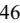

{46}------------------------------------------------

_________________

### Table of [Contents](#page-0-0) **NEOGENOMICS, INC.**

|                                            | 2022          | 2021          | % Change |  |
|--------------------------------------------|---------------|---------------|----------|--|
| Cost of revenue:                           |               |               |          |  |
| (2) Clinical Services                   | \$ 261,742 | \$ 244,360 | 7.1 %    |  |
| Pharma Services (3)                     | 60,090        | 52,909        | 13.6 %   |  |
| Total cost of revenue                      | \$ 321,832 | \$ 297,269 | 8.3 %    |  |
| Cost of revenue as a percentage of revenue | 63.1 %        | 61.4 %        |          |  |
|                                            |               |               |          |  |
| Gross Profit:                              |               |               |          |  |
| Clinical Services                          | \$ 157,012 | \$ 159,812 | (1.8)%   |  |
| Pharma Services                            | 30,884        | 27,248        | 13.3 %   |  |
| Total gross profit                         | \$ 187,896 | \$ 187,060 | 0.4 %    |  |
| Gross profit margin                        | 36.9 %        | 38.6 %        |          |  |

Clinical Services cost of revenue in 2022 includes \$17.1 million of amortization of acquired Inivata developed technology intangible assets. Clinical Services cost of revenue in 2021 includes \$9.2 million of amortization of acquired Inivata developed technology intangible assets and write-offs of \$5.3 million for COVID-19 PCR testing inventory. (2)

Pharma Services cost of revenue in 2022 includes \$2.4 million of amortization of acquired Inivata developed technology intangible assets. Pharma Services cost of revenue in 2021 includes \$1.2 million of amortization of acquired Inivata developed technology intangible assets. (3)

Consolidated cost of revenue increased for the year ended December 31, 2022 when compared to the same period in 2021 primarily due to higher payroll and payroll-related costs and the amortization of acquired Inivata developed technology intangible assets. The cost of revenue for the year ended December 31, 2021 included write-offs of \$5.3 million for inventory due to the exit from COVID-19 PCR testing. There were no such inventory write-offs for the year ended December 31, 2022.

Gross profit margin for 2022 was 36.9% compared to 38.6% in 2021. This 1.7% decrease is primarily due to the amortization of acquired Inivata developed technology intangibles and higher payroll and payroll-related costs.

#### General and Administrative Expenses

General and administrative expenses consist of payroll and payroll related costs for our executive, billing, finance, human resources, information technology, and other administrative personnel, as well as stock-based compensation. We also allocate professional services, facilities expense, IT infrastructure costs, depreciation, amortization, and other administrative-related costs to general and administrative expenses.

Consolidated general and administrative expenses for the years ended December 31, 2022 and 2021 are as follows (dollars in thousands):

|                                                       | 2022          | 2021          | \$ Change    | % Change |
|-------------------------------------------------------|---------------|---------------|--------------|----------|
| General and administrative                            | \$ 243,356 | \$ 221,347 | \$ 22,009 | 9.9 %    |
| General and administrative as a percentage of revenue | 47.7 %        | 45.7 %        |              |          |

General and administrative expenses increased \$22.0 million in 2022 compared to 2021. This increase was partially due to general and administrative expenses of \$9.1 million for the Inivata and Trapelo Health subsidiaries which were acquired in the second quarter of 2021 and a net increase in non-cash stock-based compensation expenses of \$2.2 million, which included incremental stock-based compensation for the acceleration of stock option and restricted stock awards upon the departure of certain of our officers. Excluding the increase in general and administrative expenses for the Inivata and Trapelo Health subsidiaries, general and administrative expenses also increased by \$8.2 million of payroll and payroll-related costs, \$5.4 million of investments in technology, \$3.6 million of severance costs primarily related to executive departures, \$3.9 million of professional fees, \$2.2 million of relocation costs for our new Chief Executive Officer, \$2.1 million of depreciation, \$1.7 million of insurance expenses, \$1.6 million of net loss on disposal of assets, and \$1.2 million of facilities costs. These increases in general and administrative expenses for the year ended December 31, 2022 were partially offset by a decrease when compared to the same period in 2021 of \$11.1 million of loss contingency for a regulatory matter and \$11.3 million of acquisition transaction costs related to the acquisitions of Inivata and Trapelo that occurred in the second quarter of 2021.

{47}------------------------------------------------

### Research and Development Expenses

Research and development expenses relate to costs of developing new proprietary and non-proprietary genetic tests, including payroll and payroll related costs, maintenance of laboratory equipment, laboratory supplies (reagents), and outside consultants and experts assisting our research and development team.

Consolidated research and development expense for the years ended December 31, 2022 and 2021 are as follows (dollars in thousands):

|                                                     | 2022         | 2021 |        | \$ Change |       | % Change |
|-----------------------------------------------------|--------------|------|--------|-----------|-------|----------|
| Research and development                            | \$ 30,326 | \$   | 21,873 | \$        | 8,453 | 38.6 %   |
| Research and development as a percentage of revenue | 5.9 %        |      | 4.5 %  |           |       |          |

Research and development expenses increased \$8.5 million in 2022 compared to 2021. This increase primarily reflects an increase in research and development expenses for the Inivata subsidiary which was acquired in June of 2021.

We anticipate research and development expenditures will significantly increase in the future as we continue to invest in development costs for strategic innovation projects and bringing new tests to market.

#### Sales and Marketing Expenses

Sales and marketing expenses are primarily attributable to employee-related costs including sales management, sales representatives, sales and marketing consultants, and marketing and customer service personnel.

Consolidated sales and marketing expenses for the years ended December 31, 2022 and 2021, are as follows (dollars in thousands):

|                                                | 2022         |    | 2021   |    | \$ Change | % Change |
|------------------------------------------------|--------------|----|--------|----|-----------|----------|
| Sales and marketing                            | \$ 67,321 | \$ | 62,594 | \$ | 4,727     | 7.6 %    |
| Sales and marketing as a percentage of revenue | 13.2 %       |    | 12.9 % |    |           |          |

Sales and marketing expenses increased \$4.7 million in 2022 compared to 2021. The increase primarily reflects an increase in payroll and payroll-related costs due to the expansion of our precision medicine sales team.

We expect higher commissions expense in the coming quarters as our sales representatives generate new business in our business segments. We expect our sales and marketing expenses over the long term to align with changes in revenue and we continue to evaluate the effectiveness of our incentive compensation plans.

#### Restructuring charges

Consolidated restructuring charges for the years ended December 31, 2022 and 2021 are as follows (dollars in thousands):

|                                                  | 2022        | 2021    | \$ Change   | % Change  |
|--------------------------------------------------|-------------|---------|-------------|-----------|
| Restructuring charges                            | \$ 4,516 | \$ — | \$ 4,516 | (4) NM |
| Restructuring charges as a percentage of revenue | 1.0 %       | — %     |             |           |

#### _________________ NM - Not meaningful (4)

Restructuring charges relate to a restructuring program to improve execution and drive efficiency across the organization. Restructuring charges consist of severance and other employee costs, costs for optimizing the Company's geographic presence, and consulting and other costs.

For the year ended December 31, 2022, we recorded \$4.5 million of restructuring charges. The charges were comprised of \$1.0 million in severance and other employee costs, \$0.7 million loss on the impairment of facilities and assets, and \$2.8 million of consulting and other costs. There were no such amounts recorded for the year ended December 31, 2021.

### Interest Expense, Net

Interest expense, net, for the years ended December 31, 2022 and 2021 is as follows (dollars in thousands):

|                       | 2022 |       | 2021 |       |    | \$ Change | % Change |
|-----------------------|------|-------|------|-------|----|-----------|----------|
| Interest expense, net | \$   | 1,506 | \$   | 5,082 | \$ | (3,576)   | (70.4)%  |

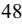

{48}------------------------------------------------

Interest expense, net, decreased \$3.6 million in 2022 compared to 2021. Interest expense for the years ended December 31, 2022 and 2021 primarily reflects the effective interest rate on the 2028 Convertible Notes and the 2025 Convertible Notes which is 0.70% and 1.96%, respectively. Interest on the 2028 Convertible Notes and 2025 Convertible Notes began accruing upon issuance and is payable semi-annually. Interest expense also includes amortization related to our fixed income investments. Interest expense was partially offset for the years ended December 31, 2022 and 2021 by interest income on funds held in our cash equivalent and marketable securities accounts.

For further details regarding the convertible notes and our investments in marketable securities, please refer to Note 9. Debt, and Note 4. Fair Value Measurements, respectively, in the accompanying notes to the Consolidated Financial Statements.

Gain on Investment In and Loan Receivable From Non-Consolidated Affiliate, Net

Gain on investment in and loan receivable from non-consolidated affiliate, net, for the years ended December 31, 2022 and 2021 is as follows (dollars in thousands):

|                                                                                   | 2022       | 2021         | \$ Change | % Change  |
|-----------------------------------------------------------------------------------|------------|--------------|-----------|-----------|
| Gain on investment in and loan receivable from non-consolidated affiliate, net | \$ — \$ | (109,260) \$ | 109,260   | (5) NM |

#### _________________ NM - Not meaningful (5)

We recorded a gain on investment in and loan receivable from non-consolidated affiliate, net, in the accompanying notes to the Consolidated Statements of Operations of \$109.3 million in 2021 for the excess of the acquisition-date fair value of the previously-held equity interest, Purchase Option, and Line of Credit over their carrying values. There was no such amount recorded on the Consolidated Statements of Operations in 2022. For further details regarding the previously-held equity investment, purchase option in Inivata and the related gain, please refer to Note 3. Acquisitions and Note 8. Investment in Non-Consolidated Affiliate, in the accompanying notes to the Consolidated Financial Statements.

### Net Loss

The following table provides the net loss for the years ended December 31, 2022 and 2021, along with the computation of basic and diluted net loss per share (in thousands, except per share amounts):

|                                             | 2022               | 2021    |
|---------------------------------------------|--------------------|---------|
| Net loss                                    | \$ (144,250) \$ | (8,347) |
|                                             |                    |         |
| Basic weighted average shares outstanding   | 124,217            | 119,962 |
| Effect of potentially dilutive securities   | —                  | —       |
| Diluted weighted average shares outstanding | 124,217            | 119,962 |
|                                             |                    |         |
| Basic net loss per share                    | \$ (1.16) \$    | (0.07)  |
| Diluted net loss per share                  | \$ (1.16) \$    | (0.07)  |
|                                             |                    |         |

#### **Non-GAAP Measures**

#### *Use of Non-GAAP Financial Measures*

In order to provide greater transparency regarding our operating performance, the financial results and financial guidance include the use of certain non-GAAP financial measures that involve adjustments to GAAP results. Non-GAAP financial measures exclude certain income and/or expense items that management believes are not directly attributable to our core operating results and/or certain items that are inconsistent in amounts and frequency, making it difficult to perform a meaningful evaluation of our current or past operating performance. Management believes that the presentation of operating results using non-GAAP financial measures provides useful supplemental information to investors by facilitating the analysis of our core test-level operating results across reporting periods and when comparing those same results to those published by our peers. These non-GAAP financial measures may also assist investors in evaluating future prospects. Management also uses non-GAAP financial measures for financial and operational decision making, planning and forecasting purposes and to manage the business. These non-GAAP financial measures do not replace the presentation of financial information in accordance with U.S. GAAP financial results, should not be considered measures of liquidity, and are unlikely to be comparable to non-GAAP financial measures used by other companies.

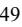

{49}------------------------------------------------

### **Definitions of Non-GAAP Measures**

### Non-GAAP Adjusted EBITDA

"Adjusted EBITDA" is defined by NeoGenomics as net (loss) income from continuing operations before: (i) interest expense, net, (ii) tax (benefit) or expense, (iii) depreciation and amortization expense, (iv) non-cash stock-based compensation expense, and, if applicable in a reporting period, (v) acquisition and integration related expenses, (vi) writeoff of COVID-19 PCR testing inventory and equipment, (vii) CEO transition costs, (viii) new headquarters moving expenses, (ix) gain on investment in and loan receivable from non-consolidated affiliate, net, (x) loss contingency for regulatory matter, (xi) restructuring charges, and (xii) other significant or non-operating (income) or expenses, net.

The following is a reconciliation of GAAP net loss to Non-GAAP EBITDA and Adjusted EBITDA for the years ended December 31, 2022 and 2021 (dollars in thousands):

|                                                                                | 2022 |              | 2021 |           |  |
|--------------------------------------------------------------------------------|------|--------------|------|-----------|--|
| NET LOSS (GAAP)                                                                | \$   | (144,250) \$ |      | (8,347)   |  |
| Adjustments to net loss:                                                       |      |              |      |           |  |
| Interest expense, net                                                          |      | 1,506        |      | 5,082     |  |
| Income tax benefit                                                             |      | (15,092)     |      | (6,728)   |  |
| Depreciation                                                                   |      | 35,372       |      | 30,192    |  |
| Amortization of intangibles                                                    |      | 34,058       |      | 23,160    |  |
| EBITDA (non-GAAP)                                                              |      | (88,406)     |      | 43,359    |  |
| Further Adjustments to EBITDA:                                                 |      |              |      |           |  |
| Acquisition and integration related expenses                                   |      | 2,479        |      | 15,683    |  |
| Write-off of COVID-19 PCR testing inventory and equipment                      |      | —            |      | 6,061     |  |
| CEO transition costs                                                           |      | 4,518        |      | 591       |  |
| New headquarters moving expenses                                               |      | —            |      | 1,521     |  |
| Non-cash stock-based compensation                                              |      | 24,672       |      | 22,458    |  |
| Gain on investment in and loan receivable from non-consolidated affiliate, net |      | —            |      | (109,260) |  |
| Loss contingency for regulatory matter                                         |      | —            |      | 11,200    |  |
| Restructuring charges                                                          |      | 4,516        |      | —         |  |
| (6) Other significant expenses (income), net                                |      | 4,211        |      | 4,226     |  |
| ADJUSTED EBITDA (non-GAAP)                                                     | \$   | (48,010) \$  |      | (4,161)   |  |

For the year ended December 31, 2022, other significant (income) expenses, net, includes fees related to a regulatory matter, moving costs, a gain on the sale of a building and other nonrecurring items. For the year ended December 31, 2021, other significant (income) expenses, net, includes strategic deal costs, moving costs, and other non-recurring items. (6)

#### **Liquidity and Capital [Resources](#page-49-0)**

_________________

To date, we have financed our operations primarily through cash generated from operations, public and private sales of debt and equity securities, and bank debt borrowings.

The following table presents a summary of our consolidated cash flows for operating, investing, and financing activities for the years ended December 31, 2022 and 2021, as well as the period ending cash and cash equivalents and working capital (in thousands):

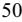

{50}------------------------------------------------

|                                                               | 2022              | 2021          |  |  |
|---------------------------------------------------------------|-------------------|---------------|--|--|
| Net cash (used in) provided by:                               |                   |               |  |  |
| Operating activities                                          | \$ (65,993) \$ | (26,723)      |  |  |
| Investing activities                                          | 517               | (632,367)     |  |  |
| Financing activities                                          | 11,829            | 725,285       |  |  |
| Net change in cash and cash equivalents                       | (53,647)          | 66,195        |  |  |
| Cash, cash equivalents and restricted cash, beginning of year | 316,827           | 250,632       |  |  |
| Cash and cash equivalents, end of year                        | \$ 263,180     | \$ 316,827 |  |  |
| (7) Working Capital, end of period                      | \$ 515,359     | \$ 594,276 |  |  |

Defined as current assets less current liabilities. (7)

#### Cash Flows from Operating Activities

_________________

Cash used in operating activities during the year ended December 31, 2022, was \$66.0 million compared to \$26.7 million in the same period in 2021. This \$39.3 million increase was primarily driven by our operating results (net loss adjusted for depreciation, amortization of intangibles, and other non-cash charges) which resulted in \$12.2 million of higher cash used by operating activities year-over-year, as well as a \$27.1 million increase in cash used resulting from net changes in operating assets and liabilities. The increase in cash used by operating activities for the year ended December 31, 2022 compared to the same period in 2021 reflects cash used to fund the operating activities of our Inivata subsidiary which was acquired in June of 2021, an increase in higher payroll and payroll-related costs to support our strategic growth initiatives, as well as the timing of cash receipts and cash payments in the ordinary course of business which can cause operating cash flow to fluctuate from period to period.

#### Cash Flows from Investing Activities

During the year ended December 31, 2022, cash provided by investing activities was \$0.5 million, compared to \$632.4 million of cash used in investing activities for the same period in 2021. This change was primarily due to a \$419.4 million decrease in net cash used in business acquisitions, a \$99.2 million decrease in purchases of marketable securities, a \$33.3 million decrease in purchases of property and equipment, a \$15.0 million decrease in loan receivable from non-consolidated affiliate, a \$53.9 million increase in sales and maturities of marketable securities year-over-year, and a \$12.1 million increase in proceeds from assets held for sale.

### Cash Flows from Financing Activities

During the year ended December 31, 2022, cash provided by financing activities was \$11.8 million compared to \$725.3 million for the same period in 2021. The cash provided by financing activities during the year ended December 31, 2022 consisted of \$12.6 million for the issuance of common stock net of issuance costs offset by \$0.8 million used for the repayment of equipment financing obligations. The primary reason for the decrease in cash provided by financing activities year-over-year was that there were no convertible debt or equity offerings for the year ended December 31, 2022. Comparatively, the year ended December 31, 2021 had convertible debt net proceeds of \$334.4 million and equity offering net proceeds of \$408.1 million, partially offset by \$29.3 million of premiums paid for capped call confirmations.

#### Liquidity Outlook

As of December 31, 2022, we had \$263.2 million in cash and cash equivalents in addition to \$174.8 million of marketable securities available to support current operational liquidity needs. We anticipate that the cash on hand, marketable securities, and cash collections are sufficient to fund our near-term capital and operating needs for at least the next 12 months. Operating needs include, but are not limited to, the planned costs to operate our business (including amounts required to fund working capital and capital expenditures, continued research, and development efforts) and potential strategic acquisitions and investments.

### **Related Party Transactions**

Please refer to Note 19. Related Party Transactions, to our Consolidated Financial Statements for a description of our related party transactions.

{51}------------------------------------------------

### **Contractual Obligations**

The following table summarizes our significant contractual obligations as of December 31, 2022 (in thousands):

|                                             | Less Than 1 Year | 1-3 Years  | 3-5 Years       | More Than 5 years | Total         |
|---------------------------------------------|---------------------|------------|-----------------|----------------------|---------------|
| Purchase obligations                        | \$ 1,005         | \$ — \$ | — \$            | — \$                 | 1,005         |
| Equipment financing obligations             | 70                  | —          | —               | —                    | 70            |
| Operating lease obligations                 | 9,235               | 17,708     | 13,798          | 56,026               | 96,767        |
| (8) Principal payments of long-term debt | —                   | 198,001    | —               | 337,321              | 535,322       |
| Total contractual obligations               | \$ 10,310 \$     | 215,709    | \$ 13,798 \$ | 393,347              | \$ 633,164 |

Amounts represent required principal debt payments on our 2025 Convertible Notes and 2028 Convertible Notes. Please refer to Note 9. Debt, to our Consolidated Financial Statements for a full description of the terms of our indebtedness and the related debt service requirements. (8)

### **Capital Expenditures**

_________________

During the year ended December 31, 2022, capital expenditures were \$30.9 million. We forecast capital expenditures in order to execute on our business plan and maintain growth; however, the actual amount and timing of such capital expenditures will ultimately be determined by the volume of business. We currently anticipate that our capital expenditures for the year ended December 31, 2023, will be in the range of \$30.0 million to \$40.0 million. We have funded and plan to continue funding these capital expenditures with cash and financing.

### **Recently Adopted Accounting Guidance**

Please refer to Note 2. Summary of Significant Accounting Policies, to our Consolidated Financial Statements for a discussion of recently adopted accounting pronouncements and accounting pronouncements pending adoption.

### **Effects of Inflation**

During the years ended December 31, 2022, 2021 and 2020, inflation did not have a material effect on our business. Widely reported inflation has occurred, however, and may be ongoing for the foreseeable future. Depending on the severity and persistence of these inflationary pressures, we could experience, in the future, a negative impact on our financial results. While we anticipate an increasingly uncertain macroeconomic environment in fiscal year 2023, we will continue to mitigate through targeted pricing and various sourcing strategies. We remain optimistic about our growth opportunities in our key markets in fiscal year 2023.

### **ITEM 7A. QUANTITATIVE AND QUALITATIVE DISCLOSURES ABOUT MARKET RISK**

We are exposed to market risks, including changes in foreign currency exchange rates.

#### **Interest Rate Risk**

In May 2020, we issued \$201.3 million aggregate principal amount of the 2025 Convertible Notes. The 2025 Convertible Notes have a fixed annual interest rate of 1.25%; therefore, we do not have economic interest rate exposure with respect to the 2025 Convertible Notes. In January 2021, we issued \$345.0 million aggregate principal amount of the 2028 Convertible Notes. The 2028 Convertible Notes have a fixed annual interest rate of 0.25%; therefore, we do not have economic interest rate exposure with respect to the 2028 Convertible Notes. However, the fair value of the 2025 Convertible Notes and 2028 Convertible Notes is exposed to interest rate risk. Generally, the fair market value will increase as interest rates fall and decrease as interest rates rise. In addition, the fair value is affected by our common stock price. The fair value will generally increase as our common stock price increases and will generally decrease as our common stock price declines. We carry the 2025 Convertible Notes and 2028 Convertible Notes at face value less unamortized debt discount and debt issuance costs on our balance sheet, and we present the fair value for required disclosure purposes only.

The primary objective of our investment activities is to preserve principal while at the same time maximizing yields without significantly increasing risk. To achieve this objective, we invest in highly liquid and high-quality U.S. government and other highly credit rated debt securities. Our investments are exposed to market risk due to fluctuations in interest rates, which may affect our interest income and the fair market value of our investments. To minimize our exposure due to adverse shifts in interest rates, we invest in short-term securities with short maturities. If a 1% change in interest rates were to have occurred on December 31, 2022, this change would not have had a material effect on the fair value of our investment portfolio as of that date. Due to the short holding period of our investments, we do not believe that we have a material financial market risk

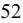

{52}------------------------------------------------

exposure and do not expect our operating results or cash flows to be materially affected by a sudden change in market interest rates. While we believe our marketable securities do not contain excessive risk, we cannot provide absolute assurance that in the future our investments will not be subject to adverse changes in market value.

#### **Foreign Currency Exchange Risk**

We have operations in Cambridge, United Kingdom; Rolle, Switzerland; Singapore; and Suzhou, China. Our international revenues and expenses denominated in foreign currencies (primarily British Pounds, Swiss Francs, Singapore Dollars and Chinese Yuan), expose us to the risk of fluctuations in foreign currency exchange rates against the U.S. dollar. We do not hedge foreign currency exchange risks and do not currently believe that these risks are significant.

{53}------------------------------------------------

### **ITEM 8. FINANCIAL STATEMENTS AND SUPPLEMENTARY DATA**

#### **INDEX TO CONSOLIDATED FINANCIAL STATEMENTS**

Page

| Report of Independent Registered Public Accounting Firm –Deloitte & Touche LLP (PCAOB ID: 34)              | 55 |
|------------------------------------------------------------------------------------------------------------|----|
| Consolidated Balance Sheets as of December 31, 2022 and 2021                                               | 58 |
| Consolidated Statements of Operations for the years ended December 31, 2022, 2021 and 2020                 | 59 |
| Consolidated Statements of Comprehensive (Loss) Income for the years endedDecember 31, 2022, 2021 and 2020 | 60 |
| Consolidated Statements of Stockholders' Equity for the years ended December 31, 2022, 2021 and 2020       | 61 |
| Consolidated Statements of Cash Flows for the years ended December 31, 2022, 2021 and 2020                 | 62 |
| Notes to Consolidated Financial Statements                                                                 | 64 |

{54}------------------------------------------------

#### **REPORT OF INDEPENDENT REGISTERED PUBLIC ACCOUNTING FIRM**

To the stockholders and the Board of Directors of NeoGenomics, Inc.

#### **Opinion on the Financial Statements**

We have audited the accompanying consolidated balance sheets of NeoGenomics, Inc. and subsidiaries (the "Company") as of December 31, 2022 and 2021, the related consolidated statements of operations, comprehensive (loss) income, stockholders' equity, and cash flows, for each of the three years in the period ended December 31, 2022, and the related notes (collectively referred to as the "financial statements"). In our opinion, the financial statements present fairly, in all material respects, the financial position of the Company as of December 31, 2022 and 2021, and the results of its operations and its cash flows for each of the three years in the period ended December 31, 2022, in conformity with accounting principles generally accepted in the United States of America.

We have also audited, in accordance with the standards of the Public Company Accounting Oversight Board (United States) (PCAOB), the Company's internal control over financial reporting as of December 31, 2022, based on criteria established in *Internal Control — Integrated Framework (2013)* issued by the Committee of Sponsoring Organizations of the Treadway Commission and our report dated February 24, 2023, expressed an unqualified opinion on the Company's internal control over financial reporting.

#### **Basis for Opinion**

These financial statements are the responsibility of the Company's management. Our responsibility is to express an opinion on the Company's financial statements based on our audits. We are a public accounting firm registered with the PCAOB and are required to be independent with respect to the Company in accordance with the U.S. federal securities laws and the applicable rules and regulations of the Securities and Exchange Commission and the PCAOB.

We conducted our audits in accordance with the standards of the PCAOB. Those standards require that we plan and perform the audit to obtain reasonable assurance about whether the financial statements are free of material misstatement, whether due to error or fraud. Our audits included performing procedures to assess the risks of material misstatement of the financial statements, whether due to error or fraud, and performing procedures that respond to those risks. Such procedures included examining, on a test basis, evidence regarding the amounts and disclosures in the financial statements. Our audits also included evaluating the accounting principles used and significant estimates made by management, as well as evaluating the overall presentation of the financial statements. We believe that our audits provide a reasonable basis for our opinion.

#### **Critical Audit Matters**

The critical audit matters communicated below are matters arising from the current-period audit of the financial statements that were communicated or required to be communicated to the audit committee and that (1) relate to accounts or disclosures that are material to the financial statements and (2) involved our especially challenging, subjective, or complex judgments. The communication of critical audit matters does not alter in any way our opinion on the financial statements, taken as a whole, and we are not, by communicating the critical audit matters below, providing separate opinions on the critical audit matters or on the accounts or disclosures to which they relate.

#### **Revenue Recognition***—***Clinical Services—Refer to Notes 2 and 13 to the financial statements**

#### *Critical Audit Matter Description*

As discussed in Note 13 to the financial statements, revenue for the Company's clinical services is recognized once the diagnostic services have been performed and the results have been delivered to the ordering physician. Revenue is recorded for all payers based on the amount expected to be collected, which considers implicit price concessions.

Implicit price concessions represent differences between amounts billed and the estimated consideration the Company expects to receive based on negotiated discounts, historical collection experience and other anticipated adjustments, including anticipated payer denials.

We identified management's estimation of implicit price concessions related to clinical services revenue recorded that has not been received in cash as a critical audit matter due to management's manual process used to determine the estimate, and the significant judgments required by management to estimate payer behavior. This required a high degree of auditor judgment and an increased extent of effort when performing audit procedures to evaluate the reasonableness of management's assumptions related to expected receipts that were applied in the estimate of implicit price concessions.

{55}------------------------------------------------

### *How the Critical Audit Matter Was Addressed in the Audit*

Our audit procedures related to management's judgments in the estimate of implicit price concessions included the following, among others:

- We tested the effectiveness of controls over management's determination of assumptions used to calculate implicit price concessions.
- We tested the methodology used by the Company to estimate implicit price concessions.
- We tested the assumptions used by management to calculate implicit price concessions by:
	- Testing the mathematical accuracy of management's calculation of implicit price concessions.
	- Testing the historical cash receipts compared to the amounts billed to payers, which are used in the estimate of implicit price concessions, by making selections and agreeing the selected information to source documents.
	- Testing management's ability to estimate implicit price concessions accurately by comparing recorded net revenue to cash receipts received through January 2023.
	- Evaluating trends in revenue and accounts receivable compared to previous periods to identify any evidence that may contradict management's assertion regarding implicit price concessions.

#### **Goodwill — Clinical and Pharma Reporting Units — Refer to Notes 2 and 7 to the financial statements**

### *Critical Audit Matter Description*

As discussed in Notes 2 and 7 to the financial statements, the Company's consolidated goodwill balance was \$522.8 million as of December 31, 2022, of which \$458.8 million and \$64.0 million was allocated to the Clinical and Pharma reporting units, respectively. As a result of the qualitative impairment assessment performed as of June 30, 2022, the Company determined there were indicators it was more likely than not that the fair values of its reporting units were less than their carrying values, including changes to executive leadership and a sustained decline in the Company's stock price. Accordingly, the Company performed a quantitative analysis and determined the Clinical and Pharma reporting units' fair values exceeded their respective carrying values and there was no impairment of the recorded goodwill as of June 30, 2022.

The Company's evaluation of goodwill for impairment involves the comparison of the fair value of each reporting unit to its carrying value. The Company determines the fair value of its reporting units using a combination of the income approach, using the discounted cash flow model, and the market approach. The determination of the fair value using the discounted cash flow model requires management to make significant estimates and assumptions, including those related to the selection of discount rates, the timing and amount of future revenues, and operating margins.

We identified goodwill for the Clinical and Pharma reporting units as a critical audit matter because of the significant judgments made by management to estimate the fair value of the Clinical and Pharma reporting units, and the sensitivity of those estimates and assumptions to change. This required a high degree of auditor judgment and an increased extent of effort, including the need to involve our fair value specialists, when performing audit procedures to evaluate the reasonableness of the Company's estimates and assumptions related to the selection of the discount rates, forecasts of the timing and amount of future revenues, including the emerging market technology, RaDaR™, for which there is limited historical data, and operating margins for the Clinical and Pharma reporting units.

#### *How the Critical Audit Matter Was Addressed in the Audit*

Our audit procedures related to the selection of discount rates, forecasts of future revenues, and operating margins for the Clinical and Pharma reporting units included the following, among others:

- We tested the effectiveness of controls over management's goodwill impairment assessment, including those over the determination of the fair value of the Clinical and Pharma reporting units as of June 30, 2022, such as controls related to the selection of the discount rates for the Clinical and Pharma reporting units, management's estimate of the timing and amount of future revenues, including revenues related to RaDaR™, and operating margins.
- We evaluated the reasonableness of management's estimates of the timing and amount of future revenues, including revenues related to RaDaR™, and operating margins by comparing the estimates to (1) the actual historical results of the Clinical and Pharma reporting units (2) peer companies and third-party market analyses, (3) internal communications to management and the board of directors, (4) external communications made by management to

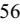

{56}------------------------------------------------

analysts and investors, and (5) industry reports containing analyses of the Company and its competitors' technologies.

• With the assistance of our fair value specialists, we evaluated the discount rates by:

- Testing the underlying source information and the mathematical accuracy of the calculations, and developing a range of independent estimates and comparing those to the discount rates selected by management;
- Comparing the discount rates used by management to the discount rates associated with other companies with a similar risk profile; and
- Evaluating the interaction between the discount rates and the forecasts to understand and sensitize management's assumptions regarding risk inherent in the forecasts.

/s/ Deloitte & Touche LLP

San Diego, California February 24, 2023

We have served as the Company's auditor since 2019.

{57}------------------------------------------------

#### **CONSOLIDATED BALANCE SHEETS (In thousands, except share and per share amounts)**

|                                                                                                                                              | As of December 31, |  |           |
|----------------------------------------------------------------------------------------------------------------------------------------------|--------------------|--|-----------|
|                                                                                                                                              | 2022               |  | 2021      |
| ASSETS                                                                                                                                       |                    |  |           |
| Current assets                                                                                                                               |                    |  |           |
| Cash and cash equivalents                                                                                                                    | \$ 263,180 \$   |  | 316,827   |
| Marketable securities, at fair value                                                                                                         | 174,809            |  | 198,563   |
| Accounts receivable, net                                                                                                                     | 119,711            |  | 112,130   |
| Inventories                                                                                                                                  | 24,277             |  | 23,395    |
| Prepaid assets                                                                                                                               | 15,237             |  | 12,354    |
| Assets held for sale                                                                                                                         | —                  |  | 10,050    |
| Other current assets                                                                                                                         | 8,077              |  | 8,189     |
| Total current assets                                                                                                                         | 605,291            |  | 681,508   |
| Property and equipment (net of accumulated depreciation of \$131,930 and \$109,952, respectively)                                         | 102,499            |  | 109,465   |
| Operating lease right-of-use assets                                                                                                          | 96,109             |  | 102,197   |
| Intangible assets, net                                                                                                                       | 408,260            |  | 442,325   |
| Goodwill                                                                                                                                     | 522,766            |  | 527,115   |
| Other assets                                                                                                                                 | 5,109              |  | 7,168     |
| Total non-current assets                                                                                                                     | 1,134,743          |  | 1,188,270 |
| Total assets                                                                                                                                 | \$ 1,740,034 \$ |  | 1,869,778 |
| LIABILITIES AND STOCKHOLDERS' EQUITY                                                                                                         |                    |  |           |
| Current liabilities                                                                                                                          |                    |  |           |
| Accounts payable                                                                                                                             | \$ 20,510 \$    |  | 17,921    |
| Accrued compensation                                                                                                                         | 40,141             |  | 38,304    |
| Accrued expenses and other liabilities                                                                                                       | 15,070             |  | 17,796    |
| Current portion of equipment financing obligations                                                                                           | 70                 |  | 1,135     |
| Current portion of operating lease liabilities                                                                                               | 6,584              |  | 6,884     |
| Pharma contract liabilities                                                                                                                  | 7,557              |  | 5,192     |
| Total current liabilities                                                                                                                    | 89,932             |  | 87,232    |
| Long-term liabilities                                                                                                                        |                    |  |           |
| Convertible senior notes, net                                                                                                                | 535,322            |  | 532,483   |
| Operating lease liabilities                                                                                                                  | 68,952             |  | 72,289    |
| Deferred income tax liabilities, net                                                                                                         | 34,750             |  | 55,475    |
| Other long-term liabilities                                                                                                                  | 13,055             |  | 14,022    |
| Total long-term liabilities                                                                                                                  | 652,079            |  | 674,269   |
| Total liabilities                                                                                                                            | 742,011            |  | 761,501   |
| Commitments and contingencies (Note 18)                                                                                                      |                    |  |           |
|                                                                                                                                              |                    |  |           |
| Stockholders' equity                                                                                                                         |                    |  |           |
| Common stock, \$0.001 par value, (250,000,000 shares authorized; 126,913,992 and 124,107,500 shares issued and outstanding, respectively) | 127                |  | 124       |
| Additional paid-in capital                                                                                                                   | 1,160,882          |  | 1,123,628 |
| Accumulated other comprehensive loss                                                                                                         | (3,899)            |  | (638)     |
| Accumulated deficit                                                                                                                          | (159,087)          |  | (14,837)  |
| Total stockholders' equity                                                                                                                   | 998,023            |  | 1,108,277 |
| Total liabilities and stockholders' equity                                                                                                   | \$ 1,740,034 \$ |  | 1,869,778 |

*See the accompanying notes to the Consolidated Financial Statements.*

{58}------------------------------------------------

#### **CONSOLIDATED STATEMENTS OF OPERATIONS (In thousands, except per share amounts)**

|                                                                                   | For the Years Ended December 31, |               |    |          |  |
|-----------------------------------------------------------------------------------|----------------------------------|---------------|----|----------|--|
|                                                                                   | 2022                             | 2021          |    | 2020     |  |
| NET REVENUE                                                                       |                                  |               |    |          |  |
| Clinical Services                                                                 | \$ 418,754                    | \$ 404,172 | \$ | 382,337  |  |
| Pharma Services                                                                   | 90,974                           | 80,157        |    | 62,111   |  |
| Total net revenue                                                                 | 509,728                          | 484,329       |    | 444,448  |  |
| COST OF REVENUE                                                                   | 321,832                          | 297,269       |    | 258,555  |  |
| GROSS PROFIT                                                                      | 187,896                          | 187,060       |    | 185,893  |  |
| Operating expenses:                                                               |                                  |               |    |          |  |
| General and administrative                                                        | 243,356                          | 221,347       |    | 143,794  |  |
| Research and development                                                          | 30,326                           | 21,873        |    | 8,229    |  |
| Sales and marketing                                                               | 67,321                           | 62,594        |    | 47,862   |  |
| Restructuring charges                                                             | 4,516                            | —             |    | —        |  |
| Total operating expenses                                                          | 345,519                          | 305,814       |    | 199,885  |  |
| LOSS FROM OPERATIONS                                                              | (157,623)                        | (118,754)     |    | (13,992) |  |
| Interest expense, net                                                             | 1,506                            | 5,082         |    | 7,019    |  |
| Other expense (income), net                                                       | 213                              | 499           |    | (7,906)  |  |
| Gain on investment in and loan receivable from non-consolidated affiliate, net | —                                | (109,260)     |    | (3,955)  |  |
| Loss on extinguishment of debt                                                    | —                                | —             |    | 1,400    |  |
| Loss on termination of cash flow hedge                                            | —                                | —             |    | 3,506    |  |
| Loss before taxes                                                                 | (159,342)                        | (15,075)      |    | (14,056) |  |
| Income tax benefit                                                                | (15,092)                         | (6,728)       |    | (18,228) |  |
| NET (LOSS) INCOME                                                                 | \$ (144,250) \$               | (8,347) \$    |    | 4,172    |  |
| NET (LOSS) INCOME PER SHARE                                                       |                                  |               |    |          |  |
|                                                                                   |                                  |               |    |          |  |
| Basic                                                                             | \$ (1.16) \$                  | (0.07) \$     |    | 0.04     |  |
| Diluted                                                                           | \$ (1.16) \$                  | (0.07) \$     |    | 0.04     |  |
| WEIGHTED AVERAGE COMMON SHARES OUTSTANDING                                     |                                  |               |    |          |  |
| Basic                                                                             | 124,217                          | 119,962       |    | 108,579  |  |
| Diluted                                                                           | 124,217                          | 119,962       |    | 111,794  |  |

*See the accompanying notes to the Consolidated Financial Statements.*

{59}------------------------------------------------

### **CONSOLIDATED STATEMENTS OF COMPREHENSIVE (LOSS) INCOME (In thousands)**

|                                                                  | Years Ended December 31, |              |  |            |      |         |
|------------------------------------------------------------------|--------------------------|--------------|--|------------|------|---------|
|                                                                  |                          | 2022         |  | 2021       | 2020 |         |
| NET (LOSS) INCOME                                                | \$                       | (144,250) \$ |  | (8,347) \$ |      | 4,172   |
|                                                                  |                          |              |  |            |      |         |
| OTHER COMPREHENSIVE (LOSS) INCOME:                               |                          |              |  |            |      |         |
| Net unrealized loss on marketable securities, net of tax         |                          | (3,261)      |  | (648)      |      | (33)    |
| Unrealized loss on effective cash flow hedge, net of tax         |                          | —            |  | —          |      | (1,000) |
| Cash flow hedge termination reclassified to earnings, net of tax |                          | —            |  | —          |      | 2,661   |
| Total other comprehensive (loss) income, net of tax              |                          | (3,261)      |  | (648)      |      | 1,628   |
| COMPREHENSIVE (LOSS) INCOME                                      | \$                       | (147,511) \$ |  | (8,995) \$ |      | 5,800   |
|                                                                  |                          |              |  |            |      |         |

*See the accompanying notes to the Consolidated Financial Statements.*

{60}------------------------------------------------

### **CONSOLIDATED STATEMENTS OF STOCKHOLDERS' EQUITY (In thousands, except share amounts)**

|                                                                             | Common Stock |           |    | Additional Paid In Capital |    | Accumulated Other Comprehensive |                        |              |  |           |
|-----------------------------------------------------------------------------|--------------|-----------|----|-------------------------------|----|------------------------------------|------------------------|--------------|--|-----------|
|                                                                             | Shares       | Amount    |    |                               |    | (Loss) Income                      | Accumulated Deficit |              |  | Total     |
| Balance, December 31, 2019                                                  | 104,781,236  | \$ 105 | \$ | 520,278                       | \$ | (1,618) \$                         |                        | (11,357) \$  |  | 507,408   |
| Common stock issuance ESPP Plan                                             | 138,309      | —         |    | 3,579                         |    | —                                  |                        | —            |  | 3,579     |
| Issuance of restricted stock, net of forfeitures                            | 97,478       | —         |    | (1,276)                       |    | —                                  |                        | —            |  | (1,276)   |
| Issuance of common stock for stock options                                  | 2,306,951    | 2         |    | 18,273                        |    | —                                  |                        | —            |  | 18,275    |
| Issuance of common stock - public offering, net of underwriting discounts   | 4,751,500    | 5         |    | 127,288                       |    | —                                  |                        | —            |  | 127,293   |
| Stock issuance fees and expenses                                            | —            | —         |    | (268)                         |    | —                                  |                        | —            |  | (268)     |
| ESPP expense                                                                | —            | —         |    | 875                           |    | —                                  |                        | —            |  | 875       |
| Stock-based compensation expense - options and restricted stock             | —            | —         |    | 9,337                         |    | —                                  |                        | —            |  | 9,337     |
| Equity component of Convertible Senior Notes due 2025                       | —            | —         |    | 30,912                        |    | —                                  |                        | —            |  | 30,912    |
| Tax liability related to Convertible Senior Notes due 2025                  | —            | —         |    | (7,504)                       |    | —                                  |                        | —            |  | (7,504)   |
| Convertible note debt issuance costs                                        | —            | —         |    | (137)                         |    | —                                  |                        | —            |  | (137)     |
| Loss on effective cash flow hedge, net                                      | —            | —         |    | —                             |    | (1,000)                            |                        | —            |  | (1,000)   |
| Cash flow hedge termination reclassified to earnings                        | —            | —         |    | —                             |    | 2,661                              |                        | —            |  | 2,661     |
| Net unrealized loss on marketable securities, net of tax                    | —            | —         |    | —                             |    | (33)                               |                        | —            |  | (33)      |
| Net income                                                                  | —            | —         |    | —                             |    | —                                  |                        | 4,172        |  | 4,172     |
| Balance, December 31, 2020                                                  | 112,075,474  | \$ 112 | \$ | 701,357                       | \$ | 10                                 | \$                     | (7,185) \$   |  | 694,294   |
| Cumulative-effect adjustment from change in accounting principle            | —            | —         |    | (23,271)                      |    | —                                  |                        | 695          |  | (22,576)  |
| Premiums paid for capped call confirmations                                 | —            | —         |    | (29,291)                      |    | —                                  |                        | —            |  | (29,291)  |
| Common stock issuance ESPP Plan                                             | 112,094      | —         |    | 4,360                         |    | —                                  |                        | —            |  | 4,360     |
| Issuance of restricted stock, net of forfeitures                            | 811,335      | 1         |    | (2,818)                       |    | —                                  |                        | —            |  | (2,817)   |
| Issuance of common stock for stock options                                  | 1,372,564    | 1         |    | 13,677                        |    | —                                  |                        | —            |  | 13,678    |
| Issuance of common stock - private placement, net of private placement fees | 4,444,445    | 4         |    | 189,859                       |    | —                                  |                        | —            |  | 189,863   |
| Issuance of common stock - public offering, net of underwriting discounts   | 4,693,876    | 5         |    | 218,495                       |    | —                                  |                        | —            |  | 218,500   |
| Issuance of common stock for acquisition                                    | 597,712      | 1         |    | 29,174                        |    | —                                  |                        | —            |  | 29,175    |
| Stock issuance fees and expenses                                            | —            | —         |    | (372)                         |    | —                                  |                        | —            |  | (372)     |
| ESPP expense                                                                | —            | —         |    | 1,052                         |    | —                                  |                        | —            |  | 1,052     |
| Stock-based compensation expense - options and restricted stock             | —            | —         |    | 21,406                        |    | —                                  |                        | —            |  | 21,406    |
| Net unrealized loss on marketable securities, net of tax                    | —            | —         |    | —                             |    | (648)                              |                        | —            |  | (648)     |
| Net loss                                                                    | —            | —         |    | —                             |    | —                                  |                        | (8,347)      |  | (8,347)   |
| Balance, December 31, 2021                                                  | 124,107,500  | \$ 124 | \$ | 1,123,628                     | \$ | (638) \$                           |                        | (14,837) \$  |  | 1,108,277 |
| Common stock issuance ESPP Plan                                             | 415,450      | —         |    | 3,787                         |    | —                                  |                        | —            |  | 3,787     |
| Issuance of restricted stock, net of forfeitures                            | 1,446,783    | 2         |    | (1,579)                       |    | —                                  |                        | —            |  | (1,577)   |
| Issuance of common stock for stock options                                  | 944,259      | 1         |    | 10,377                        |    | —                                  |                        | —            |  | 10,378    |
| Stock issuance fees and expenses                                            | —            | —         |    | (3)                           |    | —                                  |                        | —            |  | (3)       |
| ESPP expense                                                                | —            | —         |    | 1,040                         |    | —                                  |                        | —            |  | 1,040     |
| Stock-based compensation expense - options and restricted stock             | —            | —         |    | 23,632                        |    | —                                  |                        | —            |  | 23,632    |
| Net unrealized loss on marketable securities, net of tax                    | —            | —         |    | —                             |    | (3,261)                            |                        | —            |  | (3,261)   |
| Net loss                                                                    | —            | —         |    | —                             |    | —                                  |                        | (144,250)    |  | (144,250) |
| Balance, December 31, 2022                                                  | 126,913,992  | \$ 127 | \$ | 1,160,882                     | \$ | (3,899) \$                         |                        | (159,087) \$ |  | 998,023   |

*See the accompanying notes to the Consolidated Financial Statements.*

{61}------------------------------------------------

#### **CONSOLIDATED STATEMENTS OF CASH FLOWS (in thousands)**

|                                                                                          | For the Years Ended December 31, |    |              |    |           |
|------------------------------------------------------------------------------------------|----------------------------------|----|--------------|----|-----------|
|                                                                                          | 2022                             |    | 2021         |    | 2020      |
| CASH FLOWS FROM OPERATING ACTIVITIES                                                     |                                  |    |              |    |           |
| Net (loss) income                                                                        | \$ (144,250) \$               |    | (8,347) \$   |    | 4,172     |
| Adjustments to reconcile net (loss) income to net cash provided by operating activities: |                                  |    |              |    |           |
| Depreciation                                                                             | 35,372                           |    | 30,192       |    | 25,904    |
| Amortization of intangibles                                                              | 34,058                           |    | 23,160       |    | 9,817     |
| Non-cash stock-based compensation                                                        | 24,672                           |    | 22,458       |    | 10,212    |
| Non-cash operating lease expense                                                         | 9,775                            |    | 8,716        |    | 6,168     |
| Amortization of convertible debt discount                                                | 2,657                            |    | 2,563        |    | 4,358     |
| Amortization of debt issuance costs                                                      | 182                              |    | 178          |    | 165       |
| Loss on debt extinguishment                                                              | —                                |    | —            |    | 1,400     |
| Loss on termination of cash flow hedge                                                   | —                                |    | —            |    | 3,506     |
| Gain on investment in and loan receivable from non-consolidated affiliate, net           | —                                |    | (109,260)    |    | (3,955)   |
| Interest on loan receivable from non-consolidated affiliate                              | —                                |    | (391)        |    | —         |
| Loss on disposal of assets                                                               | 2,858                            |    | 606          |    | 450       |
| Gain on sale of assets held for sale                                                     | (2,048)                          |    | —            |    | —         |
| Impairment of long-lived assets                                                          | 718                              |    | —            |    | —         |
| Write off of COVID-19 PCR testing inventory and equipment                                | —                                |    | 6,061        |    | —         |
| Other non-cash items                                                                     | 1,714                            |    | 1,941        |    | 1,010     |
| Changes in assets and liabilities, net:                                                  |                                  |    |              |    |           |
| Accounts receivable, net                                                                 | (7,581)                          |    | (4,691)      |    | (12,601)  |
| Inventories                                                                              | (1,100)                          |    | 1,634        |    | (15,197)  |
| Prepaid lease asset                                                                      | —                                |    | (4,788)      |    | (20,229)  |
| Prepaid and other assets                                                                 | (1,160)                          |    | (1,906)      |    | (9,750)   |
| Operating lease liabilities                                                              | (8,557)                          |    | (7,875)      |    | (4,916)   |
| Deferred income tax liabilities, net                                                     | (16,098)                         |    | (6,299)      |    | (10,972)  |
| Accounts payable, accrued and other liabilities                                          | 2,795                            |    | 19,325       |    | 11,918    |
| Net cash (used in) provided by operating activities                                      | \$ (65,993) \$                |    | (26,723) \$  |    | 1,460     |
| CASH FLOWS FROM INVESTING ACTIVITIES                                                     |                                  |    |              |    |           |
| Purchases of marketable securities                                                       | (97,605)                         |    | (196,791)    |    | (73,101)  |
| Proceeds from sales and maturities of marketable securities                              | 116,915                          |    | 62,970       |    | 5,356     |
| Purchases of property and equipment                                                      | (30,891)                         |    | (64,142)     |    | (29,096)  |
| Proceeds from assets held for sale                                                       | 12,098                           |    | —            |    | —         |
|                                                                                          |                                  |    |              |    |           |
| Business acquisitions, net of cash acquired                                              | —                                |    | (419,404)    |    | (37,000)  |
| Investment in non-consolidated affiliate                                                 | —                                |    | —            |    | (25,600)  |
| Loan receivable from non-consolidated affiliate                                          | —                                |    | (15,000)     |    | —         |
| Net cash provided by (used in) investing activities                                      | \$ 517                        | \$ | (632,367) \$ |    | (159,441) |
| CASH FLOWS FROM FINANCING ACTIVITIES                                                     |                                  |    |              |    |           |
| Repayment of equipment financing obligations                                             | (758)                            |    | (3,047)      |    | (5,615)   |
| Repayment of term loan                                                                   | —                                |    | —            |    | (97,540)  |
| Cash flow hedge termination                                                              | —                                |    | —            |    | (3,317)   |
| Issuance of common stock, net                                                            | 12,587                           |    | 15,080       |    | 20,310    |
| Proceeds from issuance of convertible debt, net of issuance costs                        | —                                |    | 334,410      |    | 194,466   |
| Premiums paid for capped call transactions                                               | —                                |    | (29,291)     |    | —         |
| Proceeds from equity offering, net of issuance costs                                     | —                                |    | 408,133      |    | 127,293   |
| Net cash provided by financing activities                                                | \$ 11,829 \$                  |    | 725,285      | \$ | 235,597   |
| Net change in cash and cash equivalents                                                  | \$ (53,647) \$                |    | 66,195 \$    |    | 77,616    |
| Cash, cash equivalents and restricted stock, beginning of year                           | \$ 316,827                    | \$ | 250,632      | \$ | 173,016   |
| Cash, cash equivalents and restricted cash, end of year                                  | \$ 263,180                    | \$ | 316,827      | \$ | 250,632   |

{62}------------------------------------------------

#### **Reconciliation of cash, cash equivalents and restricted cash to the Consolidated Balance Sheets:**

| Cash and cash equivalents                                                | \$ 263,180 | \$ 316,827 | \$ 228,713 |
|--------------------------------------------------------------------------|---------------|---------------|---------------|
| Restricted cash                                                          | —             | —             | 21,919        |
| Total cash, cash equivalents and restricted cash                         | \$ 263,180 | \$ 316,827 | \$ 250,632 |
|                                                                          |               |               |               |
| Supplemental disclosure of cash flow information:                        |               |               |               |
| Interest paid                                                            | \$ 3,404   | \$ 3,065   | \$ 2,926   |
| Income taxes paid, net                                                   | \$ 180     | \$ 148     | \$ 246     |
| Supplemental disclosure of non-cash investing and financing information: |               |               |               |
| Fair value of common stock issued to fund business acquisition           | \$ — \$    | 29,174 \$     | —             |
| Equipment acquired under financing obligations                           | \$ — \$    | — \$          | 428           |
| Purchases of property and equipment included in accounts payable         | \$ 1,688   | \$ 1,315   | \$ 2,007   |

*See the accompanying notes to the Consolidated Financial Statements.*

{63}------------------------------------------------

### **NOTES TO CONSOLIDATED FINANCIAL STATEMENTS**

### **Note 1. Nature of Business**

### **Nature of the Business**

NeoGenomics, Inc., a Nevada corporation (the "Parent," "Company," or "NeoGenomics"), and its subsidiaries, operate as a certified, high complexity clinical laboratory in accordance with the federal government's Clinical Laboratory Improvement Act, as amended, and is dedicated to the delivery of clinical diagnostic services to pathologists, oncologists, urologists, hospitals, and other laboratories as well as providing clinical trial services to pharmaceutical firms.

### **COVID-19 Pandemic Update**

The impact from the COVID-19 pandemic, including recent COVID-19 variants, and the related disruptions had a significant adverse impact on the Company's results of operations, volume growth rates and test volumes in 2020, 2021 and 2022. The full extent to which the COVID-19 outbreak will impact the Company's business, results of operations, financial condition, and cash flows will depend on future developments that are highly uncertain and cannot be accurately predicted, including new information that may emerge concerning COVID-19 and the actions to contain it or treat its impact and the economic impact on local, regional, national, and international markets. As the COVID-19 pandemic continues, the Company's results of operations, financial condition, and cash flows may continue to be materially adversely affected, particularly if the pandemic continues to persist for a significant amount of time.

The Company anticipates that the cash on hand, marketable securities, and expected cash collections are sufficient to fund near-term capital and operating needs for at least the next 12 months.

At the end of the first quarter 2021, due to the broad roll-out of the COVID-19 vaccine and a sharp decline in COVID-19 polymerase chain reaction ("PCR") testing demand, the Company made the decision to exit COVID-19 PCR testing and the Company recorded a \$6.1 million loss related to the exit from COVID-19 PCR testing. This amount consisted of write-offs of \$5.3 million for all remaining COVID-19 PCR testing inventory recorded to cost of revenue and \$0.8 million for all remaining COVID-19 PCR testing laboratory equipment recorded to general and administrative expenses on the Consolidated Statements of Operations for the year ended December 31, 2021. There were no such amounts recorded for each of the years ended December 31, 2022 and 2020.

### **Coronavirus Aid, Relief, and Economic Security Act**

The Federal government passed legislation and the President of the United States signed into law on March 27, 2020, known as the Coronavirus Aid, Relief, and Economic Security Act (the "CARES Act"). On April 10, 2020, the U.S. Department of Health & Human Services announced that Medicare-enrolled providers would receive a portion of a direct deposit disbursement totaling \$50 billion. The \$50 billion is part of a \$100 billion Public Health and Social Service Emergency Fund created by the CARES Act. Payments made under the CARES Act are intended to reimburse healthcare providers for health care related expenses or lost revenues attributable to COVID-19 and are not required to be repaid provided that recipients attest to and comply with certain terms and conditions, including limitations on balance billing for COVID-19 patients. In the absence of specific guidance to account for government grants in accordance with accounting principles generally accepted in the United States of America ("GAAP"), the Company accounts for such grants in accordance with international accounting standards for government grants. Such amounts are recognized when there is reasonable assurance that the Company will (1) comply with the conditions associated with the grant and (2) receive the grant.

During the year ended December 31, 2020, the Company recognized \$7.9 million in grant income related to the CARES Act. There wereno such amounts recorded for each of the years ended December 31, 2022 and 2021. CARES Act grant income is classified in other expense (income), net, on the Consolidated Statements of Operations.

The CARES Act also permits the deferral of payment of the employer portion of social security taxes between March 27, 2020 and December 31, 2020. 50% of the deferred amount was due on December 31, 2021 and the remaining 50% was due on December 31, 2022. As of December 31, 2022, there were no accrued deferred social security taxes related to the CARES Act recorded on the Consolidated Balance Sheets. As of December 31, 2021, the total accrued deferred social security taxes, related to the CARES Act was \$3.0 million. This amount was recorded in accrued expenses and other liabilities on the Consolidated Balance Sheets.

Additionally, the CARES Act included an Employee Retention Tax Credit ("ERTC") provision designed to encourage employers to retain employees on their payroll. The ERTC is a refundable tax credit against certain payroll taxes paid by employers for eligible wages paid between March 13, 2020 and September 30, 2021 that meet the requirements of the ERTC

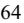

{64}------------------------------------------------

provision. For the year ended December 31, 2020, the Company recognized \$1.9 million in credits under the ERTC which was included in loss from operations on the Consolidated Statements of Operations. The Company recorded \$4.4 million and \$1.9 million in expense in loss from operations related to non-reoccurring reversals and reserves against tax credits previously recorded for the years ended December 31, 2021 and 2020, respectively. There were no such amounts recorded for the year ended December 31, 2022.

#### **Note 2. Summary of Significant Accounting Policies**

#### **Basis of Presentation**

The accompanying Consolidated Financial Statements include the accounts of the Parent and its subsidiaries. All intercompany accounts and balances have been eliminated in consolidation.

#### **Use of Estimates**

The Company prepares its Consolidated Financial Statements in conformity with GAAP. These principles require management to make estimates, judgments and assumptions that affect the reported amounts of assets, liabilities, revenues and expenses, together with amounts disclosed in the related notes to the Consolidated Financial Statements. Actual results and outcomes may differ from management's estimates, judgments and assumptions. Significant estimates, judgments and assumptions used in these Consolidated Financial Statements include, but are not limited, to those related to revenues, accounts receivable and related allowances, contingencies, useful lives and recovery of long-term assets and intangible assets, income taxes and valuation allowances, stock-based compensation, business combinations, impairment analysis of goodwill, and restructuring reserves. These estimates, judgments, and assumptions are reviewed periodically and the effects of material revisions in estimates are reflected on the Consolidated Financial Statements prospectively from the date of the change in estimate.

#### **Principles of Consolidation**

The Company determines whether investments in affiliates are a Variable Interest Entity ("VIE") at the start of each new venture and when a reconsideration event has occurred. A reporting entity must consolidate a VIE if that reporting entity has a variable interest (or combination of variable interests) and is determined to be the primary beneficiary. The primary beneficiary has both the power to direct the activities of the VIE that most significantly impact the entity's economic performance and the obligation to absorb losses or the right to receive benefits from the VIE that could potentially be significant to the VIE.

The Company accounts for its equity investments that are under 20% of the total equity outstanding and for which the Company does not have significant influence by applying the cost method. Investments that are under 20% of the total equity outstanding and for which the Company has significant influence are accounted for using the equity method unless a scope exception is applicable. Investments in which the Company holds a non-controlling interest and are between 20-50% equity are accounted for using the equity method. For any equity investments in which the Company holds over 50% of the outstanding stock, or for investments in which the Company controls the investee, the Company consolidates those entities into the Consolidated Financial Statements.

#### **Segment Reporting**

The Company reports its activities in two reportable segments; (1) the Clinical Services segment and (2) the Pharma Services segment. These reportable segments deliver testing services to hospitals, reference labs, pathologists, oncologists, clinicians, pharmaceutical firms, and researchers and represent 100% of the Company's consolidated assets, net revenue, and net (loss) income in each of the years ended December 31, 2022, 2021 and 2020. Please refer to Note 20. Segment Information, for further financial information about these segments.

#### **Business Combinations**

The Company accounts for acquisitions of entities over which control is obtained that include inputs and processes and have the ability to create outputs as business combinations. The tangible and identifiable intangible assets acquired and liabilities assumed in a business combination are recorded based on their estimated fair values as of the business combination date, including identifiable intangible assets which either arise from a contractual or legal right or are separable from goodwill. The Company bases the estimated fair value of identifiable intangible assets acquired in a business combination on independent third-party valuations that use information and assumptions provided by management, which consider estimates of inputs and assumptions that a market participant would use. Any excess purchase price over the estimated fair value assigned to the net tangible and identifiable intangible assets acquired less liabilities assumed is recorded to goodwill. The use of alternative

{65}------------------------------------------------

valuation assumptions, including estimated revenue projections, growth rates, estimated cost savings, cash flows, discount rates, estimated useful lives, and probabilities surrounding the achievement of contingent milestones could result in different purchase price allocations and amortization expense in current and future periods. Transaction costs associated with acquisitions are expensed as incurred in general and administrative expenses in the Consolidated Statements of Operations. Results of operations and cash flows of acquired companies are included in the Company's operating results from the date of acquisition.

#### **Fair Value of Financial Instruments**

The carrying value of cash, certain cash equivalents, accounts receivable, net, other current assets, accounts payable, accrued expenses and other liabilities, and Pharma contract liabilities are considered reasonable estimates of their respective fair values due to their short-term nature.

The Company measures its marketable securities at fair value on a recurring basis.Please refer to Note 4. Fair Value Measurements, for further discussion.

### **Cash and Cash Equivalents**

The Company considers all highly liquid investments purchased with an original maturity of ninety days or less to be cash equivalents. The Company maintains its cash and cash equivalents with financial institutions that the Company believes to be of high credit standing. The Company believes that, as of December 31, 2022, its concentration of credit risk related to cash and cash equivalents was not significant.

#### **Marketable Securities**

The Company classifies all marketable securities as available-for-sale, including those with maturity dates beyond 12 months, and therefore these securities are classified within current assets on the Consolidated Balance Sheets as they are available to support current operational liquidity needs.

Marketable securities are carried at fair value, with the unrealized holding gains and losses, net of income taxes, reflected in accumulated other comprehensive income until realized. The Company evaluates its marketable securities for other-than-temporary impairment on a quarterly basis. Unrealized losses are charged against net earnings when a decline in fair value is determined to be other-than-temporary. The Company reviews several factors to determine whether a loss is other-than-temporary, such as the length and extent of the fair value decline, the financial condition and near-term prospects of the issuer, and whether there is the intent to sell or will more likely than not be required to sell before the securities' anticipated recovery. There were no other-than-temporary impairments for the years ended December 31, 2022, 2021 and 2020. Regardless of the intent to sell a security, the Company performs additional analysis on all securities with unrealized losses to evaluate losses associated with the creditworthiness of the security. Credit losses are recorded when the Company does not expect to receive cash flows sufficient to recover the amortized cost basis of a security.

For the purposes of computing realized and unrealized gains and losses, cost and fair value are determined on a specific identification basis.

### **Accounts Receivable, net**

Accounts receivable are reported for all Clinical Services payers based on the amount expected to be collected, which considers implicit price concessions. Implicit price concessions represent differences between amounts billed and the estimated consideration the Company expects to receive based on negotiated discounts, historical collection experience, and other anticipated adjustments, including anticipated payer denials.

For Pharma Services the Company negotiates billing schedules and payment terms on a contract-by-contract basis which can include payments based on certain milestones being achieved.

### **Inventories**

Inventories consist principally of testing supplies and are valued at lower of cost or net realizable value, using the first-in, first-out method. The Company periodically reviews its inventories for excess or obsolescence and writes-down obsolete or otherwise unmarketable inventories to their estimated net realizable value.

### **Prepaid Assets**

{66}------------------------------------------------

The Company records a prepaid expense for costs paid but not yet incurred. Those expected to be incurred within one year are recorded as prepaid assets within total current assets on the Consolidated Balance Sheets. Any costs expected to be incurred outside of one year are recorded as other assets within total non-current assets on the Consolidated Balance Sheets.

#### **Assets Held for Sale**

Assets to be disposed of by sale are reclassified as held for sale if their carrying amounts are expected to be recovered through a sale transaction rather than through continuing use and when the Company commits to a plan to sell the assets. Assets classified as held for sale are measured at the lower of their carrying value or fair value less selling costs. Such assets are classified within current assets if there is reasonable certainty that the sale and collection of consideration will take place within one year. Upon reclassification as held for sale, long-lived assets are no longer depreciated or amortized and a measurement for impairment is performed to determine if there is an excess of carrying value over fair value less costs to sell. Any remeasurement is reported as an adjustment to the carrying value of the assets. Subsequent changes to estimated fair value less the selling costs will impact the measurement of assets held for sale if the fair value is determined to be less than the carrying value of the assets.

### **Other Current Assets**

As of December 31, 2022 and 2021, other current assets consisted primarily of receivables related to research and development ("R&D") tax credits, pharma contract assets and other non-trade receivables.

#### **Property and Equipment, net**

Property and equipment are recorded at cost, net of accumulated depreciation and amortization. Depreciation and amortization are computed on the straight-line basis over the estimated useful lives of the assets. Leasehold improvements are amortized over the shorter of the related lease terms or their estimated useful lives. Costs incurred in connection with the development of internal-use software are capitalized in accordance with the accounting standard for internal-use software, and are amortized over the expected useful life of the software.

The Company periodically reviews the estimated useful lives of property and equipment. Changes to the estimated useful lives are recorded prospectively from the date of the change. Upon retirement or sale, the cost of the assets disposed of, and the related accumulated depreciation, are removed from the accounts and any resulting gain or loss is included in loss from operations. Repairs and maintenance costs are expensed as incurred and are included in cost of revenue, general and administrative expenses or R&D expenses, as appropriate in the Consolidated Statements of Operations.

### **Leases**

The Company leases corporate offices and laboratory spaces throughout the world, all of which are classified as operating leases expiring at various dates and generally having terms ranging from 1 to 20 years. Leases with an initial term of 12 months or less are not recorded on the balance sheet.

Some of the Company's real estate lease agreements include options to either renew or early terminate the lease. Leases with renewal options allow the Company to extend the lease term typically between 1 and 5 years. When it is reasonably certain that the Company will exercise an option to renew or terminate a lease, these options are considered in determining the classification and measurement of the lease at lease commencement.

Lease liabilities are recorded based on the present value of the future lease payments over the lease term and assessed as of the commencement date. Incentives received from landlords, such as reimbursements for tenant improvements and rent abatement periods, effectively reduce the total lease payments owed for leases.

Certain real estate leases also include executory costs such as common area maintenance (non-lease component), as well as property insurance and property taxes (noncomponents). Lease payments, which may include lease components, non-lease components and non-components, are included in the measurement of the Company's lease liabilities to the extent that such payments are either fixed amounts or variable amounts based on a rate or index (fixed in substance), as stipulated in the lease contract. Any actual costs in excess of such amounts are expensed as incurred as variable lease cost.

The Company utilizes its incremental borrowing rate by lease term in order to calculate the present value of its future lease payments when the implicit rates in the leases agreements are not readily determinable. The discount rate represents a risk-adjusted rate on a secured basis and is the rate at which the Company would borrow funds to satisfy the scheduled lease liability payment streams commensurate with the lease term.

Operating lease costs represent fixed lease payments recognized on a straight-line basis over the lease term. Operating lease costs include an immaterial amount of variable lease costs and are recorded in cost of revenue, general and administrative,

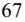

{67}------------------------------------------------

sales and marketing, and R&D expenses (depending on the nature of the leased asset) in the Consolidated Statements of Operations.

#### **Intangible Assets, net**

Intangible assets with determinable useful lives are recorded initially at acquired fair value or cost, less accumulated amortization. Each intangible asset with a determinable useful life is amortized over its estimated useful life using the straight-line method. The Company periodically reviews the estimated pattern in which the economic benefits will be consumed and adjusts the amortization period and pattern to match the estimate. Intangible assets with indefinite useful lives are recorded initially at fair value or cost and are tested annually for impairment or more frequently if management believes indicators of impairment exist. For the years ended December 31, 2022, 2021 and 2020,no impairment losses related to intangible assets with indefinite useful lives were recorded.

At December 31, 2022 and 2021 the Company's intangible assets were comprised of customer relationships, trade names and trademarks, marketing assets, and developed technology.

### **Recoverability and Impairment of Long-Lived Assets**

The Company reviews the recoverability of its long-lived assets (including definite-lived intangible assets) if events or changes in circumstances indicate the assets may be impaired. Evaluation of possible impairment is based on the Company's ability to recover the asset from the expected future pretax cash flows (undiscounted and without interest charges) of the related operations. If the expected undiscounted pretax cash flows are less than the carrying amount of such asset, an impairment loss is recognized for the difference between the estimated fair value to the carrying amount of the asset. For the years ended December 31, 2021 and 2020,no impairment losses were recognized related to long-lived assets. For the year ended December 31, 2022, the Company recognized \$0.7 million of impairment charges to facility-related assets within restructuring charges on the Consolidated Statements of Operations. For further details on the Company's restructuring activities, please refer to Note 14. Restructuring.

#### **Goodwill**

The Company evaluates goodwill on an annual basis in the fourth quarter, or more frequently if management believes indicators of impairment exist. Such indicators could include, but are not limited to, (1) a significant adverse change in legal factors or in business climate, (2) unanticipated competition, or (3) an adverse action or assessment by a regulator. The Company first assesses qualitative factors to determine whether it is more likely than not that the fair value of a reporting unit is less than its carrying amount, including goodwill. If management concludes that it is more likely than not that the fair value of a reporting unit is less than its carrying amount, management performs a quantitative goodwill impairment test. The quantitative analysis is performed by comparing the fair value of the reporting unit to its carrying value. If the carrying value is greater than the estimate of fair value, an impairment loss will be recognized for the amount in which the carrying amount exceeds the reporting unit's fair value. The Company estimates the fair values of its reporting units using a combination of the income, or discounted cash flows approach and the market approach, which utilizes comparable companies' data. For the years ended December 31, 2022, 2021 and 2020, the Company's evaluation of goodwill resulted in no impairment losses.

At June 30, 2022, the Company performed a qualitative assessment to determine whether it was more likely than not that the fair values of its reporting units were less than their carrying values. Such qualitative factors included macroeconomic conditions, industry and market considerations, cost factors, overall financial performance and other relevant events. As a result of the qualitative assessment, the Company determined that there were indicators that it was more likely than not that the fair values of its reporting units were less than their carrying values. Accordingly, the Company performed a quantitative analysis and determined the reporting units' fair values exceeded the reporting units' carrying values and there was no impairment of the recorded goodwill as of June 30, 2022.

#### **Contingencies**

The Company accrues contingent losses when estimated impacts of various conditions, situations or circumstances involve uncertain outcomes. Contingent losses are recorded based on management judgment along with internal and external advice from legal counsel and/or technical consultants. Estimated losses from contingencies are recorded when both of the following conditions are met: (i) information available before the financial statements are issued (or available to be issued) indicates that it is probable that an asset has been impaired or a liability has been incurred at the date of the financial statements and (ii) the amount of loss can be reasonably estimated. If some amount within a range of loss appears at the time to be a better estimate than any other amount within the range, that amount shall be accrued. When no amount within the range is a better estimate than any other amount, however, the minimum amount in the range shall be accrued. Please refer to Note 18. Commitments and Contingencies, for further discussion.

{68}------------------------------------------------

### **Debt Issuance Costs**

Debt issuance costs related to convertible senior notes are recorded as deductions that net against the principal value of the debt and are amortized as interest expense over the life of the debt using the effective interest method. Debt issuance costs related to term loans are recorded as direct deductions from the carrying amount of the term loan and are amortized to interest expense over the life of the debt using the effective interest method. Debt issuance costs relating to line of credit arrangements are recorded as assets and amortized over the term of the credit arrangement regardless of whether any outstanding borrowing existed. Please refer to Note 9. Debt, for further information on debt issuance costs.

### **Stock-based Compensation**

The Company measures compensation expense for stock-based awards to employees, non-employee contracted physicians, and directors based upon the awards' initial grantdate fair values.

Prior to 2021 the Company estimated the fair value of stock options using a trinomial lattice model. On January 1, 2021, the Company began applying the Black-Scholes option valuation model ("Black-Scholes") on a prospective basis to new awards. The Company expects the use of Black-Scholes to provide a more ubiquitous estimate of fair value. Like the prior trinomial lattice model, Black-Scholes is affected by the stock price on the date of the grant as well as assumptions regarding a number of highly complex and subjective variables. These variables include the expected term of the option, expected risk-free interest rate, the expected volatility of common stock, and expected dividend yield; each of which is described below. The assumptions for expected term and expected volatility are the two assumptions that significantly affect the grant date fair value.

Expected Term: The expected term of an option is determined using the simplified method under SAB 107 which represents the average between the vesting term and the contractual term. The Company utilizes the simplified method to determine the expected life of the options due to insufficient exercise activity during recent years.

Risk-free Interest Rate: The risk-free interest rate used in the Black-Scholes model is based on the implied yield at the grant date of the U.S. Treasury zero-coupon issue with an equivalent term to the stock-based award being valued. Where the expected term of a stock-based award does not correspond with the term for which a zero coupon interest rate is quoted, the Company uses the nearest interest rate from available maturities.

Expected Stock Price Volatility: The Company uses its own historical weekly volatility because that is more reflective of market conditions.

Dividend Yield: Because the Company has never paid a dividend and does not expect to begin doing so in the foreseeable future, the Company assumed no dividend yield in valuing the stock-based awards.

#### **Revenue Recognition**

#### *Clinical Services*

The Company's specialized diagnostic services are performed based on a written test requisition form or electronic equivalent. The performance obligation is satisfied and revenues are recognized at the point in time the diagnostic services have been performed and the results have been delivered to the ordering physician. These diagnostic services are billed to various payers, including client direct billing, commercial insurance, Medicare and other government payers, and patients. Revenue is recorded for all payers based on the amount expected to be collected, which considers implicit price concessions. Implicit price concessions represent differences between amounts billed and the estimated consideration the Company expects to receive based on negotiated discounts, historical collection experience, and other anticipated adjustments, including anticipated payer denials. Collection of consideration the Company expects to receive typically occurs within 90 to 120 days of billing for commercial insurance, Medicare and other governmental and self-pay patients and within 60 to 90 days of billing for client payers.

#### *Pharma Services*

The Company's Pharma Services segment generally enters into contracts with pharmaceutical and biotech customers as well as other contract research organizations ("CROs") to provide research and clinical trial services. Such services also include validation studies and assay development. The Company records revenue on a unit-of-service basis based on the number of units completed towards the satisfaction of a performance obligation. Certain contracts include upfront fees or billing milestones that are recognized over time, which aligns with the progress of the Company towards fulfilling its obligations under the contract.

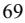

{69}------------------------------------------------

Additional offerings within the Pharma Services portfolio includes Informatics, which involves the licensing of de-identified data to pharmaceutical and biotech customers in the form of either retrospective records or prospective deliveries of data. Informatics revenue is recognized at a point in time upon delivery of retrospective data or over time for prospective data feeds. The Company negotiates billing schedules and payment terms on a contract-by-contract basis, and contract terms generally provide for payments based on a unit-of-service arrangement.

Amounts collected in advance of services provided are deferred as contract liabilities. The associated revenue is recognized and the contract liability is reduced as the contracted services are subsequently performed. Contract assets are established for revenue that has been recognized but not yet billed. These contract assets are reduced once the customer is invoiced and a corresponding account receivable is recorded. Additionally, Pharma Services incurs sales commissions in the process of obtaining contracts with customers. Sales commissions that are payable upon contract award are recognized as assets and amortized over the expected life of the customer relationship. For offerings with primarily short-term contracts, such as Informatics, the Company applies the practical expedient which allows costs to obtain a contract to be expensed when incurred, if the amortization period of the assets that would otherwise have been recognized is one year or less. Contract assets and capitalized commissions are included in other current assets and other assets on the Consolidated Balance Sheets.

Most contracts are terminable by the customer, either immediately or according to advance notice terms specified within the contracts. All contracts require payment of fees to the Company for services rendered through the date of termination and may require payment for subsequent services necessary to conclude the study or close out the contract.

#### **Cost of Revenue**

Cost of revenue includes payroll and payroll related costs for performing tests, project management, depreciation of laboratory equipment and laboratory leasehold improvements, rent for laboratory facilities, laboratory reagents, probes and supplies, delivery and courier costs relating to the transportation of specimens to be tested, and amortization for acquired Inivata developed technology intangible assets. The expenses related to shipping specimens to the facilities for testing, includes costs incurred for contract couriers, commercial airline flights, and courier charges. The Company also incurs expenses returning samples and slides to its customers. For the years ended December 31, 2022, 2021 and 2020, the Company recorded shipping expenses of approximately \$19.6 million, \$16.5 million, and \$13.8 million, respectively as cost of revenue in the Consolidated Statements of Operations.

### **General and Administrative Expenses**

General and administrative expenses consist of payroll and payroll related costs for the Company's billing, finance, human resources, information technology, and other administrative personnel as well as stock-based compensation. The Company also includes professional services, facilities expense, IT infrastructure costs, depreciation, amortization, and other administrative-related costs in general and administrative expenses in the Consolidated Statements of Operations.

### **Research and Development Expenses**

R&D costs are expensed as incurred. R&D expenses consist of payroll and payroll related costs, laboratory supplies, depreciation of laboratory equipment, and costs for samples to complete validation studies. These expenses are primarily incurred to develop new genetic tests.

#### **Sales and Marketing Expenses**

Sales and marketing expenses are primarily attributable to employee-related costs including sales management, sales representatives, sales and marketing consultants, and marketing and customer service personnel in the Clinical Services segment. Advertising costs are expensed at the time they are incurred and are deemed immaterial for the years ended December 31, 2022, 2021 and 2020.

### **Restructuring charges**

Restructuring charges relate to a restructuring program to improve execution and drive efficiency across the organization. Restructuring charges consist of severance and other employee costs, costs for optimizing the Company's geographic presence, and consulting and other costs. For further details on the Company's restructuring activities, please refer to Note 14. Restructuring.

### **Income Taxes**

Deferred taxes are recognized for the tax consequences of temporary differences by applying enacted statutory rates applicable to future years to differences between the financial statement carrying amounts and the tax bases of existing assets

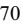

{70}------------------------------------------------

and liabilities. Also, the effect on deferred taxes of a change in tax rates is recognized in income in the period that included the enactment date. Temporary differences between financial and tax reporting arise primarily from the use of different depreciation methods and lives for property and equipment, recognition of bad debts, compensation related expenses, and various other expenses that have been allowed for or accrued for financial statement purposes but are not currently deductible for income tax purposes.

The provision for income taxes, including the effective tax rate and analysis of potential tax exposure items, if any, requires significant judgment and expertise in federal and state income tax laws, regulations, and strategies, including the determination of deferred tax assets and liabilities and any estimated valuation allowances deemed necessary to recognize deferred tax assets at an amount that is more likely than not to be realized. The Company evaluates tax positions that have been taken or are expected to be taken in its tax returns and records a liability for uncertain tax positions, if deemed necessary. The Company follows a two-step approach to recognizing and measuring uncertain tax positions. First, tax positions are recognized if the weight of available evidence indicates that it is more likely than not that the position will be sustained upon examination, including resolution of related appeals or litigation processes, if any. Second, the tax position is measured as the largest amount of tax benefit that has a greater than 50% likelihood of being realized upon settlement.

The Company recognizes interest and penalties related to unrecognized tax benefits in the provision for income taxes on the Consolidated Balance Sheets. At December 31, 2022 and 2021, the Company has an uncertain tax position related to Federal and State R&D tax credits. The Company does not expect a significant change in its uncertain tax positions in the next 12 months.

### **Net (Loss) Income per Common Share**

The Company calculates basic net (loss) income per share attributable to common stockholders by dividing net (loss) income by the weighted-average number of shares of common stock outstanding for the period. Diluted net (loss) income per share is computed using the weighted average number of common shares outstanding during the applicable period, plus the dilutive effect of potential common stock. Potential common stock consists of shares issuable pursuant to stock options and convertible notes, as well as non-vested restricted stock awards which are not considered outstanding with respect to the weighted average common shares outstanding in the calculation of basic net (loss) income per share. Potentially dilutive shares are determined by applying the treasury stock method to the Company's outstanding stock options and restricted stock awards. Potentially dilutive shares issuable upon conversion of the 0.25% Convertible Senior Notes due 2028 and the1.25% Convertible Senior Notes due 2025 are calculated using the if-converted method.

#### **Recent Accounting Pronouncements**

In November 2021, the FASB issued ASU No. 2021-10, Government Assistance (Topic 832), Disclosures by Business Entities about Government Assistance ("ASU 2021-10"). This update requires business entities to disclose information about certain government assistance they receive. Such disclosure requirements include the nature of the transactions and the related accounting policy used, the line items on the balance sheet and income statement that are affected and the amounts applicable to each financial statement line item and significant terms and conditions of the transactions. ASU 2021-10 is effective for annual periods beginning after December 15, 2021, with early adoption permitted. ASU 2021-10 should be applied either (1) prospectively to all transactions within the scope of the amendments that are reflected in financial statements at the date of initial application and new transactions that are entered into after the date of initial application or (2) retrospectively to those transactions. The Company adopted this pronouncement on January 1, 2022, and there was no impact from this standard on its annual disclosures.

In October 2021, the FASB issued ASU No. 2021-08, Business Combinations (Topic 805), Accounting for Contract Assets and Contract Liabilities from Contracts with Customers ("ASU 2021-08"). This update amends guidance to require that an entity (acquirer) recognize and measure contract assets and contract liabilities acquired in a business combination in accordance with Revenue from Contracts with Customers (Topic 606). At the acquisition date, an acquirer should account for the related revenue contracts in accordance with Topic 606 as if it had originated the contracts. ASU 2021-08 is effective for fiscal years beginning after December 15, 2022, including interim periods within those fiscal years. Early adoption of the amendments is permitted including adoption in an interim period. If the Company early adopts in an interim period, the Company is required to apply the amendments (1) retrospectively to all business combinations for which the acquisition date occurs on or after the beginning of the fiscal year that includes the interim period of early application and (2) prospectively to all business combinations that occur on or after the date of initial application. The amendments in ASU 2021-08 should be applied prospectively to business combinations occurring on or after the effective date of the amendments. The Company adopted this standard as of January 1, 2023 and there was no impact on its Consolidated Financial Statements.

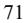

{71}------------------------------------------------

### **Note 3. Acquisitions**

#### *Trapelo Health*

On April 7, 2021 (the "Trapelo Acquisition Date"), the Company completed the acquisition of a 100% ownership interest in Intervention Insights, Inc. d/b/a Trapelo Health ("Trapelo"), an information technology company focused on precision oncology. The purchase price consisted of (i) cash consideration of \$35.6 million, which included a net adjustment of \$0.6 million for estimated cash on hand of Trapelo and estimated working capital adjustments on the Trapelo Acquisition Date, and (ii) equity consideration of \$29.2 million, consisting of 597,712 shares of the Company's common stock, par value \$0.001 per share, valued at \$48.81 per share. The Company acquired control of Trapelo on the Trapelo Acquisition Date; therefore, the fair value of the common stock issued as part of consideration was determined on the basis of the closing market price of the Company's common stock immediately prior to the Trapelo Acquisition Date. The Trapelo acquisition enhances the Company's ability to provide customers clinical decision support to help answer complex questions related to precision oncology biomarker testing and treatment options as part of the Company's comprehensive oncology offerings.

The acquisition of Trapelo was determined to be a business combination and has been accounted for using the acquisition method. The purchase price and purchase price allocation were based upon management's best estimates and assumptions and were considered final as of March 31, 2022. The following table summarizes the purchase consideration recorded for the acquisition of Trapelo, the fair value of the net assets acquired and liabilities assumed, and the calculation of goodwill based on the excess of the consideration transferred over the fair value of the net assets acquired and liabilities assumed at the Trapelo Acquisition Date (in thousands, except per share data):

|                                                         | Amount       |
|---------------------------------------------------------|--------------|
| Purchase consideration:                                 |              |
| Shares of common stock issued as consideration          | 597,712      |
| Per share value of common stock issued as consideration | \$ 48.81  |
| Fair value of common stock at Trapelo Acquisition Date  | \$ 29,174 |
| Plus: Cash paid at closing                              | 35,591       |
| Total purchase consideration                            | \$ 64,765 |
|                                                         |              |
| Allocation of the purchase consideration:               |              |
| Cash                                                    | \$ 713    |
| Other current assets                                    | 282          |
| Identifiable intangible asset - marketing assets        | 549          |
| Identifiable intangible asset - developed technology    | 19,040       |
| Other long-term assets                                  | 268          |
| Total identifiable assets acquired                      | 20,852       |
| Current liabilities                                     | (751)        |
| Net identifiable assets acquired                        | 20,101       |
| Goodwill                                                | 44,664       |
| Total purchase consideration                            | \$ 64,765 |

The identified developed technology and marketing intangible assets are being amortized overten years and four years, respectively, based on their estimated useful lives. The weighted-average amortization period in total for all classes of intangible assets from the Trapelo acquisition is 9.8 years. The developed technology was valued using the income approach, specifically, the multi-period excess earnings method, which measures the after-tax cash flows attributable to the developed technology. The marketing intangible assets were valued using the income approach, specifically, the relief from royalty method, which measures the cash flow streams attributable to the marketing intangible assets in the form of the avoided royalty payment that would be paid to the owner in return for the rights to use the marketing intangible assets had the intangible assets not been acquired. The values of the identifiable intangible assets represent Level 3 measurements as they were based on unobservable inputs reflecting the Company's assumptions used in pricing the assets at fair value. These inputs required significant judgments and estimates at the time of the valuation.

{72}------------------------------------------------

The goodwill recognized, all of which is assigned to the Clinical Services segment, was primarily attributable to expected synergies of the combined businesses and the acquisition of an assembled workforce knowledgeable of the healthcare and information technology industries. None of the goodwill resulting from the acquisition of Trapelo is expected to be deductible for income tax purposes.

Acquisition and integration costs related to Trapelo were approximately \$1.8 million for the year ended December 31, 2021 and are recorded as general and administrative expenses in the Company's Consolidated Statements of Operations. There were no such amounts recorded for the years ended December 31, 2022 and 2020.

The results of operations of Trapelo are included in the Company's Consolidated Financial Statements beginning on the Trapelo Acquisition Date. Revenue and net (loss) income of Trapelo included in the Consolidated Statements of Operations was not material for the period from the Trapelo Acquisition Date to December 31, 2021. No pro forma information has been included relating to the Trapelo acquisition, as this acquisition was not deemed to be material to the Company's revenue or net loss on a pro forma basis.

#### *Inivata Limited*

On June 18, 2021 (the "Inivata Acquisition Date"), the Company completed the acquisition of the remaining equity interests in Inivata Limited, a private limited company incorporated in England and Wales ("Inivata"). Inivata is a global, commercial stage, liquid biopsy platform company. The acquisition follows a \$ 25.0 million minority equity investment by the Company in Series C1 Preference Shares (the "Preference Shares" or "previously-held equity interest") in Inivata in May 2020, at which time the Company also acquired a fixed price option to purchase the remainder of equity interests in Inivata for \$390.0 million (the "Purchase Option"). The Company and Inivata also entered into a line of credit agreement in the amount of \$15.0 million (the "Line of Credit") in May 2020. For further details regarding the previously-held equity investment in Inivata, the Purchase Option and the Line of Credit, please refer to Note 8. Investment in Non-Consolidated Affiliate. The Inivata acquisition adds liquid biopsy platform technology, including minimal residual disease testing capabilities, to the Company's comprehensive portfolio of oncology testing solutions.

The purchase price consisted of cash consideration of \$398.6 million, which included a net adjustment of \$8.6 million for estimated cash on hand of Inivata and other adjustments on the Inivata Acquisition Date, and was funded through cash on hand and a private placement of equity. For further information regarding the private placement of equity, please refer to Note 11. Equity Transactions.

Prior to the acquisition of the remaining equity interests in Inivata, the Company accounted for its previously-held equity interest and the Purchase Option in Inivata as equity securities without a readily determinable fair value. The equity interests were recorded at cost minus impairment, if any, plus or minus changes resulting from observable price changes in orderly transactions for the identical or a similar investment of the same issuer. Therefore, the Company's acquisition of control of Inivata on the Inivata Acquisition Date was accounted for as a business combination achieved in stages under the acquisition method. Accordingly, the Company used a discounted cash flow to derive a business enterprise value of Inivata in order to determine the acquisition-date fair value of the Company's previously-held equity interest and Purchase Option in Inivata. To determine the fair value of the previously-held equity interest, the fair value of Inivata's total equity was allocated to its various classes of equity based on the respective rights and privileges of each class of stock in liquidation. The business enterprise value and a Black-Scholes model were then used to determine the fair value of the remaining equity acquired through the exercise of the Purchase Option. The Purchase Option was recorded at the fair value at the Inivata Acquisition Date based on its settlement value. This resulted in fair values of \$64.9 million in Preference Shares and a \$74.3 million Purchase Option, immediately prior to the acquisition. On the Inivata Acquisition Date, the \$10.3 million outstanding under the Line of Credit extended by the Company to Inivata was effectively settled as part of the acquisition of Inivata at the \$15.0 million principal amount and was recorded as part of the consideration transferred in the acquisition. The Company recorded a gain on investment in and loan receivable from non-consolidated affiliate, net, within the Company's Consolidated Statements of Operations of \$109.3 million for the year ended December 31, 2021 for the excess of the acquisition-date fair value of the Company's previously-held equity interest, Purchase Option, and Line of Credit over their carrying values. For further details regarding the previously-held equity investment and purchase option in Inivata, please refer to Note 8. Investment in Non-Consolidated Affiliate.

The purchase price and purchase price allocation were based upon management's best estimates and assumptions and were considered final as of June 30, 2022.The following table summarizes the calculation of goodwill based on the excess of the estimated fair value of the consideration transferred including the fair value of the Line of Credit, and the estimated fair value of the previously-held equity interest and Purchase Option, over the estimated fair value of the net assets acquired and liabilities assumed at the Inivata Acquisition Date and includes measurement period adjustments recorded during 2021 (in thousands):

{73}------------------------------------------------

|                                                              | June 18, 2021 (as initially reported) | Measurement Period Adjustments |  | Adjustment |  | June 18, 2021 (as adjusted) |  |
|--------------------------------------------------------------|------------------------------------------|-----------------------------------|--|------------|--|--------------------------------|--|
| Fair value of business combination:                          |                                          |                                   |  |            |  |                                |  |
| Cash paid at closing                                         | \$ 398,594 \$                         | — \$                              |  | — \$       |  | 398,594                        |  |
| Fair value of Line of Credit                                 | 15,000                                   | —                                 |  | —          |  | 15,000                         |  |
| Fair value of consideration transferred                      | \$ 413,594 \$                         | — \$                              |  | — \$       |  | 413,594                        |  |
| Fair value of previously-held equity interest (1)         | 62,919                                   | 1,987                             |  | —          |  | 64,906                         |  |
| (1) Fair value of Purchase Option                         | 58,537                                   | 15,763                            |  | —          |  | 74,300                         |  |
| Total fair value of business combination                     | \$ 535,050 \$                         | 17,750 \$                         |  | — \$       |  | 552,800                        |  |
|                                                              |                                          |                                   |  |            |  |                                |  |
| Allocation of the fair value business combination:           |                                          |                                   |  |            |  |                                |  |
| Cash (2)                                                  | \$ 14,068 \$                          | — \$                              |  | — \$       |  | 14,068                         |  |
| Other current assets                                         | 5,366                                    | 345                               |  | —          |  | 5,711                          |  |
| Property and equipment (1)                                | 1,753                                    | —                                 |  | —          |  | 1,753                          |  |
| Identifiable intangible assets - developed technology (1) | 302,982                                  | (11,796)                          |  | —          |  | 291,186                        |  |
| Identifiable intangible assets - trademarks (1)           | 31,700                                   | (226)                             |  | —          |  | 31,474                         |  |
| Identifiable intangible asset - trade name                   | 2,322                                    | 253                               |  | —          |  | 2,575                          |  |
| Other long-term assets                                       | 6,240                                    | —                                 |  | —          |  | 6,240                          |  |
| Total identifiable assets acquired                           | 364,431                                  | (11,424)                          |  | —          |  | 353,007                        |  |
| Current liabilities                                          | (4,241)                                  | (1,650)                           |  | —          |  | (5,891)                        |  |
| (3)(4) Deferred income tax liabilities                    | (64,680)                                 | 3,686                             |  | 4,349      |  | (56,645)                       |  |
| Other long-term liabilities                                  | (4,690)                                  | —                                 |  | —          |  | (4,690)                        |  |
| Net identifiable assets acquired                             | 290,820                                  | (9,388)                           |  | 4,349      |  | 285,781                        |  |
| (4) Goodwill                                              | 244,230                                  | 27,138                            |  | (4,349)    |  | 267,019                        |  |
| Total fair value of business combination                     | \$ 535,050 \$                         | 17,750 \$                         |  | — \$       |  | 552,800                        |  |

Measurement period adjustment primarily relates to a change in estimated taxes based on jurisdictions in which forecasted profits are expected to be generated. (1)

Measurement period adjustment relates to the recognition of a credit which Inivata is entitled to claim for certain research and development expenditures. (2)

Measurement period adjustment relates to a change in estimated deferred income tax liabilities as a result of the reduction in the amounts for intangibles assets and related future amortization. During the third quarter of 2022, the Company recorded a \$4.3 million decrease to goodwill and corresponding decrease to deferred income tax liabilities, net, on the Consolidated Balance Sheets to correct an immaterial error related to a prior period. The error was not material to any previously reported annual or interim consolidated financial statements. (3) (4)

The identified developed technology intangible assets and the trademark intangible assets are both being amortized overfifteen years, and the trade name intangible asset is being amortized over five years, based on their estimated useful lives. The weighted-average amortization period in total for all classes of intangible assets from the Inivata acquisition is 14.9 years. The developed technology was valued using the income approach, specifically, the multi-period excess earnings method, which measures the after-tax cash flows attributable to the developed technology. The trademarks and trade name assets were valued using the income approach, specifically, the relief from royalty method, which measures the cash flow streams attributable to the trademarks and trade name assets in the form of the avoided royalty payment that would be paid to the owner in return for the rights to use the trademarks and trade name assets had the assets not been acquired. The values of the identifiable intangible assets represent Level 3 measurements as they were based on unobservable inputs reflecting the Company's assumptions used in pricing the assets at fair value. These inputs required significant judgments and estimates at the time of the valuation.

The goodwill recognized, of which \$234.6 million and \$32.4 million was assigned to the Clinical Services and Pharma Services segments, respectively, was primarily attributable to expected synergies of the combined businesses and the acquisition of an assembled workforce knowledgeable of liquid biopsy technology for oncology testing. The recording of amortizable intangibles has given rise to a deferred tax liability upon the acquisition of Inivata which increased goodwill by

{74}------------------------------------------------

\$56.6 million. None of the goodwill resulting from the acquisition of Inivata is expected to be deductible for income tax purposes.

Acquisition and integration costs related to Inivata were \$13.9 million for the year ended December 31, 2021 and are recorded as general and administrative expenses in the Company's Consolidated Statements of Operations. There were no such amounts recorded for the years ended December 31, 2022 and 2020.

The results of operations of the Company's Inivata subsidiary are included in the Company's Consolidated Financial Statements beginning on the Inivata Acquisition Date. For the period from the Inivata Acquisition Date to December 31, 2021, the Inivata subsidiary revenue was \$1.5 million, all of which was recorded in Pharma Services revenue. The Inivata subsidiary net loss was \$27.6 million for the period from the Inivata Acquisition Date to December 31, 2021.

The following unaudited pro forma information has been provided for illustrative purposes only and is not necessarily indicative of results that would have occurred had the acquisition of Inivata occurred on January 1, 2020, nor are they necessarily indicative of future results (in thousands):

|             | For the years ended December 31, |  |          |  |  |  |  |  |
|-------------|----------------------------------|--|----------|--|--|--|--|--|
|             | 2021                             |  |          |  |  |  |  |  |
| Net revenue | \$ 484,231 \$                 |  | 444,884  |  |  |  |  |  |
| Net loss    | \$ (129,251) \$               |  | (65,387) |  |  |  |  |  |

These unaudited pro forma results represent the combined results of operations of the Company and Inivata, on an unaudited pro forma basis, for the period in which the acquisition of Inivata occurred and the prior reporting period as though the companies had been combined as of the beginning of the earliest period presented. Therefore, the unaudited pro forma consolidated results have been prepared by adjusting the Company's historical results to include the acquisition of Inivata as if it occurred on January 1, 2020. Acquisition-related transaction costs incurred by Inivata of \$11.0 million are included in net loss as if incurred on January 1, 2020. Acquisition-related transaction and retention costs incurred by the Company of \$13.9 million are included in net loss as if incurred on January 1, 2020. These unaudited pro forma consolidated historical results exclude \$109.3 million and \$4.0 million of gain on investment in and loan receivable from non-consolidated affiliate, net, recorded for the years ended December 31, 2021 and 2020, respectively.

### **Note 4. Fair Value Measurements**

Fair value is defined as the exchange price that would be received for an asset or paid to transfer a liability (an exit price) in the principal or most advantageous market for the asset or liability in an orderly transaction between market participants on the measurement date. Valuation techniques used to measure fair value must maximize the use of observable inputs and minimize the use of unobservable inputs. A fair value hierarchy has been established based on three levels of inputs, of which the first two are considered observable and the last unobservable.

*Level 1:* Quoted prices in active markets for identical assets or liabilities. These are typically obtained from real-time quotes for transactions in active exchange markets involving identical assets.

*Level 2:* Inputs, other than quoted prices included within Level 1, which are observable for the asset or liability, either directly or indirectly. These are typically obtained from readily-available pricing sources for comparable instruments.

*Level 3:* Unobservable inputs, where there is little or no market activity for the asset or liability. These inputs reflect the reporting entity's own assumptions of the data that market participants would use in pricing the asset or liability, based on the best information available in the circumstances.

#### Assets and Liabilities that are Measured at Fair Value on a Recurring Basis

The Company measures certain financial assets at fair value on a recurring basis, including its marketable securities and certain cash equivalents. The Company considers all securities available-for-sale, including those with maturity dates beyond 12 months, and therefore these securities are classified within current assets on the Consolidated Balance Sheets as they are available to support current operational liquidity needs. The money market accounts are valued based on quoted market prices in active markets. The marketable securities are generally valued based on other observable inputs for those securities (including market corroborated pricing or other models that utilize observable inputs such as interest rates and yield curves) based on information provided by independent third-party pricing entities, except for U.S. Treasury securities which are valued based on quoted market prices in active markets.

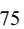

{75}------------------------------------------------

The following tables set forth the amortized cost, gross unrealized gains, gross unrealized losses, and fair values of the Company's marketable securities accounted for as available-for-sale securities as of December 31, 2022 and 2021 (in thousands):

|                                   | December 31, 2022 |                |  |                        |      |                         |            |  |  |
|-----------------------------------|-------------------|----------------|--|------------------------|------|-------------------------|------------|--|--|
|                                   |                   | Amortized Cost |  | Gross Unrealized Gains |      | Gross Unrealized Losses | Fair Value |  |  |
| Financial Assets:                 |                   |                |  |                        |      |                         |            |  |  |
| Short-term marketable securities: |                   |                |  |                        |      |                         |            |  |  |
| U.S. Treasury securities          | \$                | 56,426 \$      |  |                        | — \$ | (651) \$                | 55,775     |  |  |
| Yankee bonds                      |                   | 5,358          |  | —                      |      | (92)                    | 5,266      |  |  |
| Agency bonds                      |                   | 12,485         |  | —                      |      | (116)                   | 12,369     |  |  |
| Municipal bonds                   |                   | 12,841         |  | —                      |      | (1,030)                 | 11,811     |  |  |
| Commercial paper                  |                   | 2,846          |  | 8                      |      | —                       | 2,854      |  |  |
| Asset-backed securities           |                   | 25,544         |  | 2                      |      | (427)                   | 25,119     |  |  |
| Corporate bonds                   |                   | 63,748         |  | 3                      |      | (2,136)                 | 61,615     |  |  |
| Total                             | \$                | 179,248 \$     |  | 13                     | \$   | (4,452) \$              | 174,809    |  |  |

|                                   |    | December 31, 2021 |  |                        |                         |            |  |  |  |  |
|-----------------------------------|----|-------------------|--|------------------------|-------------------------|------------|--|--|--|--|
|                                   |    | Amortized Cost    |  | Gross Unrealized Gains | Gross Unrealized Losses | Fair Value |  |  |  |  |
| Financial Assets:                 |    |                   |  |                        |                         |            |  |  |  |  |
| Short-term marketable securities: |    |                   |  |                        |                         |            |  |  |  |  |
| U.S. Treasury securities          | \$ | 52,791 \$         |  | 11                     | \$ (138) \$          | 52,664     |  |  |  |  |
| Yankee bonds                      |    | 6,175             |  | 1                      | (16)                    | 6,160      |  |  |  |  |
| Agency bonds                      |    | 17,546            |  | —                      | (16)                    | 17,530     |  |  |  |  |
| Municipal bonds                   |    | 12,440            |  | —                      | (211)                   | 12,229     |  |  |  |  |
| Commercial paper                  |    | 17,694            |  | —                      | (4)                     | 17,690     |  |  |  |  |
| Asset-backed securities           |    | 27,620            |  | 1                      | (86)                    | 27,535     |  |  |  |  |
| Corporate bonds                   |    | 65,198            |  | 9                      | (452)                   | 64,755     |  |  |  |  |
| Total                             | \$ | 199,464 \$        |  | 22                     | \$ (923) \$          | 198,563    |  |  |  |  |

The Company had \$0.9 million and \$0.6 million of accrued interest receivable at December 31, 2022 and 2021, respectively, included inother assets on its Consolidated Balance Sheets related to its marketable securities. Realized gains or losses were immaterial for the years ended December 31, 2022, 2021 and 2020.

{76}------------------------------------------------

The following tables set forth the fair value of available-for-sale marketable securities by contractual maturity at December 31, 2022 and 2021 (in thousands):

|                          | December 31, 2022 |            |                                     |           |                 |      |  |         |
|--------------------------|-------------------|------------|-------------------------------------|-----------|-----------------|------|--|---------|
|                          | One Year or Less  |            | Over One Year Through Five Years |           | Over Five Years |      |  | Total   |
| Financial Assets:        |                   |            |                                     |           |                 |      |  |         |
| Marketable Securities:   |                   |            |                                     |           |                 |      |  |         |
| U.S. Treasury securities | \$                | 40,795 \$  |                                     | 14,980 \$ |                 | — \$ |  | 55,775  |
| Yankee bonds             |                   | 2,734      |                                     | 2,532     |                 | —    |  | 5,266   |
| Agency bonds             |                   | 6,470      |                                     | 5,899     |                 | —    |  | 12,369  |
| Municipal bonds          |                   | —          |                                     | 11,811    |                 | —    |  | 11,811  |
| Commercial paper         |                   | 2,854      |                                     | —         |                 | —    |  | 2,854   |
| Asset-backed securities  |                   | 23,179     |                                     | 1,940     |                 | —    |  | 25,119  |
| Corporate bonds          |                   | 35,377     |                                     | 26,238    |                 | —    |  | 61,615  |
| Total                    | \$                | 111,409 \$ |                                     | 63,400 \$ |                 | — \$ |  | 174,809 |

| December 31, 2021 |        |                                     |                              |                 |                             |  |              |  |
|-------------------|--------|-------------------------------------|------------------------------|-----------------|-----------------------------|--|--------------|--|
|                   |        | Over One Year Through Five Years |                              | Over Five Years |                             |  | Total        |  |
|                   |        |                                     |                              |                 |                             |  |              |  |
|                   |        |                                     |                              |                 |                             |  |              |  |
| \$                |        |                                     |                              |                 |                             |  | 52,664       |  |
|                   | 4,150  |                                     | 2,010                        |                 | —                           |  | 6,160        |  |
|                   | 14,041 |                                     | 3,489                        |                 | —                           |  | 17,530       |  |
|                   |        |                                     | 12,229                       |                 | —                           |  | 12,229       |  |
|                   | 17,690 |                                     |                              |                 | —                           |  | 17,690       |  |
|                   | 20,868 |                                     | 6,667                        |                 | —                           |  | 27,535       |  |
|                   | 25,412 |                                     | 39,343                       |                 | —                           |  | 64,755       |  |
| \$                |        |                                     |                              |                 |                             |  | 198,563      |  |
|                   |        | One Year or Less                    | 22,550 \$ — 104,711 \$ |                 | 30,114 \$ — 93,852 \$ |  | — \$ — \$ |  |

{77}------------------------------------------------

The following tables set forth the Company's cash equivalents and marketable securities accounted for as available-for-sale securities that were measured at fair value on a recurring basis based on the fair value hierarchy as of December 31, 2022 and 2021 (in thousands):

|                          | December 31, 2022 |            |  |            |         |  |         |
|--------------------------|-------------------|------------|--|------------|---------|--|---------|
|                          | Level 1           |            |  | Level 2    | Level 3 |  | Total   |
| Financial Assets:        |                   |            |  |            |         |  |         |
| Cash equivalents:        |                   |            |  |            |         |  |         |
| Money market funds       | \$                | 196,749 \$ |  | — \$       | — \$    |  | 196,749 |
| Commercial paper         |                   | —          |  | 36,965     | —       |  | 36,965  |
| Marketable securities:   |                   |            |  |            |         |  |         |
| U.S. Treasury securities |                   | 55,775     |  | —          | —       |  | 55,775  |
| Yankee bonds             |                   | 5,266      |  | —          | —       |  | 5,266   |
| Agency bonds             |                   | 12,369     |  | —          | —       |  | 12,369  |
| Municipal bonds          |                   | 11,811     |  | —          | —       |  | 11,811  |
| Commercial paper         |                   | —          |  | 2,854      | —       |  | 2,854   |
| Asset-backed securities  |                   | —          |  | 25,119     | —       |  | 25,119  |
| Corporate bonds          |                   | —          |  | 61,615     | —       |  | 61,615  |
| Total                    | \$                | 281,970 \$ |  | 126,553 \$ | — \$    |  | 408,523 |

|                          | December 31, 2021 |            |              |         |  |  |  |
|--------------------------|-------------------|------------|--------------|---------|--|--|--|
|                          | Level 1           | Level 2    | Level 3      | Total   |  |  |  |
| Financial Assets:        |                   |            |              |         |  |  |  |
| Cash equivalents:        |                   |            |              |         |  |  |  |
| Money market funds       | \$ 254,157 \$  |            | — \$ — \$ | 254,157 |  |  |  |
| Commercial paper         | —                 | 22,491     | —            | 22,491  |  |  |  |
| Marketable securities:   |                   |            |              |         |  |  |  |
| U.S. Treasury securities | 52,664            | —          | —            | 52,664  |  |  |  |
| Yankee bonds             | 6,160             | —          | —            | 6,160   |  |  |  |
| Agency bonds             | 17,530            | —          | —            | 17,530  |  |  |  |
| Municipal bonds          | 12,229            | —          | —            | 12,229  |  |  |  |
| Commercial paper         | —                 | 17,690     | —            | 17,690  |  |  |  |
| Asset-backed securities  | —                 | 27,535     | —            | 27,535  |  |  |  |
| Corporate bonds          | —                 | 64,755     | —            | 64,755  |  |  |  |
| Total                    | \$ 342,740 \$  | 132,471 \$ | — \$         | 475,211 |  |  |  |

There were no transfers of financial assets or liabilities into or out of Level 1, Level 2, or Level 3 for the years ended December 31, 2022 and 2021.

Assets and Liabilities that are Measured at Fair Value on a Nonrecurring Basis

The carrying value of cash, certain cash equivalents, accounts receivable, net, other current assets, accounts payable, accrued expenses and other liabilities, and Pharma contract liabilities are considered reasonable estimates of their respective fair values at December 31, 2022 and 2021 due to their short-term nature.

The Company also measures certain non-financial assets at fair value on a nonrecurring basis, primarily intangible assets, goodwill, long-lived assets in connection with periodic evaluations for potential impairment. The Company estimates the fair value of these assets using primarily unobservable inputs and as such, these are considered Level 3 fair value measurements.

{78}------------------------------------------------

### **Note 5. Property and Equipment, Net**

Property and equipment consisted of the following at December 31, 2022 and 2021 (in thousands):

|                                        | 2022             | 2021      | Estimated Useful Lives in Years |  |
|----------------------------------------|------------------|-----------|------------------------------------|--|
| Equipment                              | \$ 91,759 \$  | 86,410    | 1 - 13                             |  |
| Leasehold improvements                 | 44,418           | 43,251    | 1-17                               |  |
| Furniture and fixtures                 | 12,274           | 11,141    | 1-8                                |  |
| Computer hardware and office equipment | 32,843           | 30,394    | 1-9                                |  |
| Computer software                      | 44,151           | 35,826    | 1-10                               |  |
| Construction in progress               | 8,984            | 12,395    | —                                  |  |
| Subtotal                               | 234,429          | 219,417   |                                    |  |
| Less: accumulated depreciation         | (131,930)        | (109,952) |                                    |  |
| Property and equipment, net            | \$ 102,499 \$ | 109,465   |                                    |  |

In 2021, the Company committed to selling the Carlsbad facility and the associated land and concluded that these assets met the held for sale criteria. At December 31, 2021, these assets were classified as assets held for sale within current assets on the Consolidated Balance Sheets with a carrying value of \$3.2 million and \$6.9 million, respectively. The Company sold this property and associated land for proceeds of \$12.1 million, net of closing costs, in 2022. For the year ended December 31, 2022, a net gain on the sale of this property and associated land of \$2.0 million is included in general and administrative expenses on the Consolidated Statements of Operations.

Depreciation expense for the years ended December 31, 2022, 2021 and 2020, was as follows (in thousands):

|                            | 2022            | 2021      | 2020   |
|----------------------------|-----------------|-----------|--------|
| Cost of revenue            | \$ 15,406 \$ | 14,200 \$ | 15,287 |
| General and administrative | 18,125          | 15,299    | 10,359 |
| Research and development   | 1,841           | 693       | 258    |
| Total depreciation         | \$ 35,372 \$ | 30,192 \$ | 25,904 |

### **Note 6. Leases**

As of December 31, 2022, the maturities of the operating lease liabilities and a reconciliation to the present value of lease liabilities were as follows (in thousands):

|                                                  | Remaining Lease Payments |
|--------------------------------------------------|--------------------------|
| 2023                                             | \$ 9,235              |
| 2024                                             | 9,769                    |
| 2025                                             | 7,939                    |
| 2026                                             | 6,941                    |
| 2027                                             | 6,857                    |
| Thereafter                                       | 56,026                   |
| Total remaining lease payments                   | 96,767                   |
| Less: imputed interest                           | (21,231)                 |
| Total operating lease liabilities                | 75,536                   |
| Less: current portion                            | (6,584)                  |
| Long-term operating lease liabilities            | \$ 68,952             |
| Weighted-average remaining lease term (in years) | 12.33                    |
| Weighted-average discount rate                   | 3.7 %                    |
|                                                  |                          |

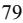

{79}------------------------------------------------

The following summarizes additional supplemental data related to the operating leases for the years ended December 31, 2022 and 2021 (in thousands):

|                                                                          | 2022            | 2021   |
|--------------------------------------------------------------------------|-----------------|--------|
| Operating lease costs                                                    | \$ 13,135 \$ | 11,231 |
| Right-of-use assets obtained in exchange for operating lease liabilities | \$ 9,149 \$  | 39,785 |
| Cash paid for operating leases                                           | \$ 11,222 \$ | 10,165 |

In 2021, the Company's lease of its new laboratory and headquarters facility in Fort Myers, Florida commenced. As of December 31, 2021, the Company had paid approximately \$25.0 million to the landlord for the construction of the underlying assets which was classified as a prepaid lease asset until the lease commenced in the third quarter of 2021 at which time the prepaid lease asset was included in the calculation of the right-of-use asset. There were no such amounts recorded for the year ended December 31, 2022. As of December 31, 2021, the Company had paid approximately \$17.0 million to the landlord for leasehold improvements, which are included in property and equipment, net, for its new laboratory and headquarters facility. As of December 31, 2021, all disbursements to the landlord had been completed.

#### **Note 7. Goodwill and Intangible Assets**

The following table summarizes the changes in the carrying amount of goodwill by segment as of December 31, 2022 and 2021 (in thousands):

|                              | Clinical Services |    | Pharma Services |    | Total   |  |
|------------------------------|-------------------|----|-----------------|----|---------|--|
| Balance at December 31, 2021 | \$ 462,603     | \$ | 64,512          | \$ | 527,115 |  |
| (1) Adjustment            | (3,821)           |    | (528)           |    | (4,349) |  |
| Balance at December 31, 2022 | \$ 458,782     | \$ | 63,984          | \$ | 522,766 |  |

During the third quarter of 2022, the Company recorded a \$4.3 million decrease to goodwill and corresponding decrease to deferred income tax liabilities, net, on the Consolidated Balance Sheets to correct an immaterial error related to a prior period. The error was not material to any previously reported annual or interim consolidated financial statements. (1)

{80}------------------------------------------------

Intangible assets consisted of the following as of December 31, 2022 and 2021 (in thousands):

|                              |                                |      | 2022    |                             |        |     |         |  |  |
|------------------------------|--------------------------------|------|---------|-----------------------------|--------|-----|---------|--|--|
|                              | Amortization Period (years) | Cost |         | Accumulated Amortization |        | Net |         |  |  |
| Customer Relationships       | 7-15                           | \$   | 143,101 | \$                          | 55,645 | \$  | 87,456  |  |  |
| Developed Technology         | 10-15                          |      | 310,226 |                             | 33,117 |     | 277,109 |  |  |
| Marketing Assets             | 4                              |      | 549     |                             | 238    |     | 311     |  |  |
| Trademarks                   | 15                             |      | 31,473  |                             | 3,223  |     | 28,250  |  |  |
| Trade Name                   | 2.5                            |      | 2,584   |                             | 897    |     | 1,687   |  |  |
| Trademark - Indefinite lived | —                              |      | 13,447  |                             | —      |     | 13,447  |  |  |
| Total                        |                                | \$   | 501,380 | \$                          | 93,120 | \$  | 408,260 |  |  |

|                              |                                |      | 2021    |                             |        |     |         |  |  |
|------------------------------|--------------------------------|------|---------|-----------------------------|--------|-----|---------|--|--|
|                              | Amortization Period (years) | Cost |         | Accumulated Amortization |        | Net |         |  |  |
| Customer Relationships       | 7-15                           | \$   | 143,101 | \$                          | 45,756 | \$  | 97,345  |  |  |
| Developed Technology         | 10-15                          |      | 310,226 |                             | 11,798 |     | 298,428 |  |  |
| Marketing Assets             | 4                              |      | 549     |                             | 100    |     | 449     |  |  |
| Trademarks                   | 15                             |      | 31,473  |                             | 1,125  |     | 30,348  |  |  |
| Trade Name                   | 5                              |      | 2,584   |                             | 276    |     | 2,308   |  |  |
| Trademark - Indefinite lived | —                              |      | 13,447  |                             | —      |     | 13,447  |  |  |
| Total                        |                                | \$   | 501,380 | \$                          | 59,055 | \$  | 442,325 |  |  |

For the years ended December 31, 2022, 2021 and 2020, amortization on the Consolidated Statements of Operations was recorded as follows (in thousands):

|                            | 2022 |           | 2021 |           | 2020 |       |
|----------------------------|------|-----------|------|-----------|------|-------|
| Amortization recorded in:  |      |           |      |           |      |       |
| Cost of revenue            | \$   | 19,412 \$ |      | 10,407 \$ |      | —     |
| General and administrative |      | 14,646    |      | 12,753    |      | 9,817 |
| Total amortization         | \$   | 34,058 \$ |      | 23,160 \$ |      | 9,817 |

As of December 31, 2022, the estimated amortization expense related to amortizable intangible assets for each of the five following years and thereafter is as follows (in thousands):

| 2023       | \$ 35,133  |
|------------|---------------|
| 2024       | 33,446        |
| 2025       | 33,343        |
| 2026       | 33,308        |
| 2027       | 32,758        |
| Thereafter | 226,825       |
| Total      | \$ 394,813 |

#### **Note 8. Investment in Non-Consolidated Affiliate**

On May 22, 2020, the Company formed a strategic alliance with Inivata and entered into a Strategic Alliance Agreement and Laboratory Services Agreement with Inivata's laboratory subsidiary in the United States, Inivata, Inc., whereas Inivata's laboratory rendered and performed certain laboratory testing which the Company made available to customers. The terms and conditions of the Laboratory Services Agreement were consistent with those that would be negotiated between willing parties on an arm's length basis. For additional details on amounts paid related to the Laboratory Services Agreement, please refer to Note 19. Related Party Transactions.

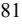

{81}------------------------------------------------

In addition to the Laboratory Services Agreement, the Company also entered into an Investment Agreement with Inivata (the "Investment Agreement"), pursuant to which the Company acquired the Preference Shares for \$25.0 million in cash resulting in a minority interest in Inivata's outstanding equity and an Option Deed which provided the Company with a Purchase Option to purchase Inivata. The Investment Agreement also granted the Company one seat on Inivata's Board of Directors.

On June 18, 2021, the Company completed the acquisition of the remaining equity interests in Inivata. For further details regarding the acquisition of Inivata, please refer to Note 3. Acquisitions.

Prior to the Inivata Acquisition Date, Inivata was determined to be a variable interest entity ("VIE") and the Company's investment was under20.0% of the total equity outstanding. The Company considered qualitative factors in assessing the primary beneficiary of the VIE which included understanding the purpose and design of the VIE, associated risks that the VIE created, activities that could be directed by the Company, and the expected relative impact of those activities on the economic performance of the VIE. Based on an evaluation of these factors, the Company concluded that it was not the primary beneficiary of Inivata prior to the Inivata Acquisition Date.

Prior to the Inivata Acquisition Date, the power to control the activities that most significantly impacted Inivata's economic performance was the sole responsibility of Inivata's management and Board of Directors; however, the Company did have significant influence over Inivata. As the Preference Shares were determined to not be in-substance common stock, and because the Preference Shares and the Purchase Option did not have readily determinable fair values, prior to the Inivata Acquisition Date, the Company elected to measure the Preference Shares and the Purchase Option at cost, minus impairment, if any, plus or minus changes resulting from observable price changes in orderly transactions for the identical or a similar investment of the same issuer.

On May 22, 2020, the initial \$25.0 million cost and \$0.6 million of associated transaction costs was allocated between the Preference Shares and the Purchase Option based on the relative fair value of each and was recorded as investment in non-consolidated affiliate on the Consolidated Balance Sheets. The initial relative fair value of the investment in non-consolidated affiliate was comprised of \$19.6 million in Preference Shares and a \$6.0 million Purchase Option. The Preference Shares were valued by determining the equity value of Inivata using the Backsolve Method and allocating the value of the Preference Shares using the Option-Pricing Method and the inputs used included the equity value based on the Series C1 capital raised by Inivata, a volatility rate of 84.0%, a risk-free interest rate of0.17% and 0.0% dividend yield. The Purchase Option was valued using the Black-Scholes model with a volatility rate of 84.0%, a risk-free interest rate of0.17% and 0.0% dividend yield.

During the fourth quarter of 2020, an observable transaction of an identical investment in Inivata Preference Shares occurred. This resulted in a remeasurement of the Preference Shares to the value of this observable transaction. The Purchase Option was also remeasured at fair value as a result of this observable transaction. As a result of these remeasurements, at December 31, 2020, the carrying value of the investment in non-consolidated affiliate is \$29.6 million, comprised of \$25.0 million in Preference Shares and a \$4.6 million Purchase Option. The Company recorded a net unrealized gain of \$4.0 million for these remeasurements for the year ended December 31, 2020 in gain on investment in and loan receivable from non-consolidated affiliate, net, on the Consolidated Statements of Operations. At December 31, 2020, the Purchase Option was valued using the Black-Scholes model with a volatility rate of 84.0%, a risk-free interest rate of0.17% and 0.0% dividend yield.

On May 22, 2020, the Company and Inivata also entered into the Line of Credit in the amount of \$15.0 million. In January 2021, the Line of Credit, in its entirety, was drawn by Inivata and recorded as a loan receivable from non-consolidated affiliate on the Consolidated Balance Sheets. Prior to the Inivata Acquisition Date, the Line of Credit contractually matured on December 1, 2025 and the unpaid principal balance was payable on January 1, 2026 and bore interest at 0.0% per annum. In January 2021, upon the draw of the Line of Credit by Inivata, the Company used an imputed interest rate of 8.33% to present value the Line of Credit. The Company recorded an imputed interest rate discount of \$5.0 million on the loan receivable from non-consolidated affiliate and an additional investment in non-consolidated affiliate of \$5.0 million, resulting in a \$10.0 million present value of the loan receivable from non-consolidated affiliate and increasing the value of the Preference Shares to \$30.0 million. For the year ended December 31, 2021 through the Inivata Acquisition Date \$0.4 million of interest income was amortized to the loan receivable from non-consolidated affiliate. The interest income amortization is recorded in interest expense, net, on the Consolidated Statements of Operations.

In the first quarter of 2021, subsequent to Inivata's draw on the Line of Credit, an observable transaction of an identical investment in Inivata Preference Shares occurred. This resulted in a remeasurement of the Preference Shares to the value of this observable transaction. The Company recorded a net unrealized loss of \$5.0 million for this remeasurement for the three months ended March 31, 2021. As of March 31, 2021, the carrying value of the investment in non-consolidated affiliate was \$29.6 million, comprised of \$25.0 million in Preference Shares and a \$4.6 million Purchase Option.

{82}------------------------------------------------

On the Inivata Acquisition Date the Company acquired all of the remaining equity interests of Inivata through the exercise of its Purchase Option. The Company's carrying value of the investment in non-consolidated affiliate was \$29.6 million, comprised of \$25.0 million in Preference Shares and a \$4.6 million Purchase Option immediately prior to obtaining the remaining ownership of Inivata. The Company's acquisition of control of Inivata on the Inivata Acquisition Date was accounted for as a business combination achieved in stages under the acquisition method. Accordingly, the Company remeasured its Preference Shares and Purchase Option to their acquisition-date fair values. The Company used a discounted cash flow to derive a business enterprise value of Inivata in order to determine the acquisition-date fair value of the Company's Preference Shares and the Purchase Option. To determine the fair value of the Preference Shares, the fair value of equity was allocated to the various classes based on the respective rights and privileges of each class of stock in liquidation. The business enterprise value and a Black-Scholes model was then used to determine the fair value of the remaining equity acquired through the exercise of the Purchase Option. The Purchase Option was recorded at fair value at the Inivata Acquisition Date based on its settlement value. This resulted in fair values of \$64.9 million in Preference Shares and a \$74.3 million Purchase Option, immediately prior to the acquisition, resulting in a net gain of \$104.6 million for the year ended December 31, 2021, which includes the net loss of \$5.0 million for the remeasurement in the first quarter of 2021. In addition, on the Inivata Acquisition Date, the \$10.3 million outstanding under the Line of Credit extended by the Company to Inivata was effectively settled as part of the acquisition of Inivata at the \$15.0 million principal amount and was recorded as part of the consideration transferred in the acquisition resulting in a gain of \$4.7 million for the year ended December 31, 2021. The Company recorded a total gain on investment in and loan receivable from non-consolidated affiliate, net, within the Company's Consolidated Statements of Operations of \$109.3 million for the year ended December 31, 2021 for the excess of the acquisition-date fair value of the Company's Preference Shares, Purchase Option, and Line of Credit over their carrying values. For further details regarding the acquisition of Inivata, please refer to Note 3. Acquisitions.

### **Note 9. Debt**

The following table summarizes long-term debt, net, at December 31, 2022 and 2021 (in thousands):

|                                                          | 2022             | 2021 |         |  |
|----------------------------------------------------------|------------------|------|---------|--|
| 0.25% Convertible Senior Notes due 2028                  |                  |      |         |  |
| Principal                                                | \$ 345,000 \$ |      | 345,000 |  |
| Unamortized debt discount                                | (7,505)          |      | (8,963) |  |
| Unamortized debt issuance costs                          | (174)            |      | (208)   |  |
| Total 0.25% Convertible Senior Notes due 2028            | 337,321          |      | 335,829 |  |
|                                                          |                  |      |         |  |
| 1.25% Convertible Senior Notes due 2025                  |                  |      |         |  |
| Principal                                                | 201,250          |      | 201,250 |  |
| Unamortized debt discount                                | (2,891)          |      | (4,090) |  |
| Unamortized debt issuance costs                          | (358)            |      | (506)   |  |
| Total 1.25% Convertible Senior Notes due 2025, net       | 198,001          |      | 196,654 |  |
|                                                          |                  |      |         |  |
| Equipment financing obligations                          | 70               |      | 1,206   |  |
| Total debt                                               | 535,392          |      | 533,689 |  |
| Less: Current portion of equipment financing obligations | (70)             |      | (1,135) |  |
| Total long-term debt, net                                | \$ 535,322 \$ |      | 532,554 |  |

At December 31, 2022, the estimated fair value (Level 2) of the0.25% Convertible Senior Notes due 2028 and the1.25% Convertible Senior Notes due 2025 was \$218.2 million and \$169.6 million, respectively. At December 31, 2021, the estimated fair value (Level 2) of the0.25% Convertible Senior Notes due 2028 and the1.25% Convertible Senior Notes due 2025 was \$297.6 million and \$238.9 million, respectively.

### *2028 Convertible Senior Notes*

On January 11, 2021, the Company completed the sale of \$345.0 million of Convertible Senior Notes with a stated interest rate of0.25% and a maturity date of January 15, 2028 (the "2028 Convertible Notes"), unless earlier converted, redeemed, or repurchased. The 2028 Convertible Notes were issued at a discounted price of 97.0% of their principal amount. The total net proceeds from the issuance of the 2028 Convertible Notes and exercise of the over-allotment option was approximately \$334.4 million, which includes approximately \$10.6 million of discounts, commissions and offering expenses paid by the

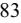

{83}------------------------------------------------

Company. On January 11, 2021, the Company entered into an Indenture (the "Indenture"), with U.S. Bank National Association, as trustee (the "Trustee"), governing the 2028 Convertible Notes. The Company used a portion of the net proceeds from the Offerings to enter into capped call transactions (as described below under the heading "Capped Call Transactions").

Prior to September 15, 2027, noteholders may convert their 2028 Convertible Notes at their option, only in the following circumstances: (1) during any calendar quarter commencing after the calendar quarter ending on June 30, 2021 (and only during such calendar quarter), if the last reported sale price of the common stock for at least 20 trading days (whether or not consecutive) during a period of 30 consecutive trading days ending on, and including, the last trading day of the immediately preceding calendar quarter is greater than or equal to 130.0% of the conversion price on each applicable trading day; (2) during thefive business day period after any five consecutive trading day period in which the trading price per \$1,000 principal amount of 2028 Convertible Notes for each trading day of the measurement period was less than 98.0% of the product of the last reported sale price of the Company's common stock and the conversion rate on each such trading day; (3) if the Company calls any or all of the notes for redemption, at any time prior to the close of business on the scheduled trading day immediately preceding the redemption date; or (4) upon the occurrence of specified corporate events. On or after September 15, 2027 until the close of business on the second business day immediately preceding the maturity date, noteholders may convert their 2028 Convertible Notes at any time, regardless of the foregoing circumstances.

The last reported sales price of the Company's common stock was not greater than or equal to130.0% of the conversion price of the 2028 Convertible Notes on at least20 of the last 30 consecutive trading days of the quarter ended September 30, 2022. Based on the terms of the 2028 Convertible Notes, the holders could not have converted all or a portion of their 2028 Convertible Notes in the fourth quarter of 2022. The last reported sales price of the Company's common stock was not greater than or equal to 130.0% of the conversion price of the 2028 Convertible Notes on at least 20 of the last 30 consecutive trading days of the quarter ended December 31, 2022. Based on the terms of the 2028 Convertible Notes, the holders cannot convert all or a portion of their 2028 Convertible Notes in the first quarter of 2023. When a conversion notice is received, the Company has the option to pay or deliver cash, shares of the Company's common stock, or a combination thereof. As the Company is not required to settle the 2028 Convertible Notes in cash, the 2028 Convertible Notes are classified as long-term debt as of December 31, 2022. As of December 31, 2022, the Company had not received any conversion notices.

Upon conversion, the Company will pay or deliver, as applicable, cash, shares of common stock or a combination of cash and shares of common stock, at its election. The initial conversion rate for the 2028 Convertible Notes is 15.1172 shares of common stock per \$1,000 in principal amount of 2028 Convertible Notes, equivalent to an initial conversion price of approximately \$66.15 per share of common stock. The conversion rate is subject to adjustment as described in the Indenture. In addition, following certain corporate events that occur prior to the maturity date as described in the Indenture, the Company will pay a make-whole premium by increasing the conversion rate for a holder who elects to convert its 2028 Convertible Notes in connection with such a corporate event in certain circumstances. The value of the 2028 Convertible Notes, if-converted, does not exceed the principal amount based on a closing stock price of \$9.24 on December 31, 2022.

The Company may not redeem the 2028 Convertible Notes prior to January 20, 2025. The Company may redeem for cash all or any portion of the 2028 Convertible Notes, at its option, on or after January 20, 2025 if the last reported sale price of its common stock has been at least 130.0% of the conversion price then in effect for at least20 trading days (whether or not consecutive) during any 30 consecutive trading day period (including the last trading day of such period) ending on, and including, the trading day immediately preceding the date of notice by the Company of redemption at a redemption price equal to 100.0% of the principal amount of the 2028 Convertible Notes to be redeemed, plus accrued and unpaid interest to, but excluding, the redemption date. No sinking fund is provided for the 2028 Convertible Notes.

If an event involving bankruptcy, insolvency or reorganization events with respect to the Company occurs, then the principal amount of, and all accrued and unpaid interest on, all of the 2028 Convertible Notes then outstanding will immediately become due and payable. If any other default event occurs and is continuing, then noteholders of at least 25.0% of the aggregate principal amount of the 2028 Convertible Notes then outstanding, by notice to the Company, may declare the principal amount of, and all accrued and unpaid interest on, all of the 2028 Convertible Notes then outstanding to become due and payable immediately. If the Company undergoes a Fundamental Change (as defined in the Indenture), then noteholders may require the Company to repurchase their 2028 Convertible Notes at a cash repurchase price equal to the principal amount of the 2028 Convertible Notes to be repurchased, plus accrued and unpaid interest, if any, to, but excluding, the Fundamental Change Repurchase Date (as defined in the Indenture).

The 2028 Convertible Notes are the Company's senior, unsecured obligations and will be equal in right of payment with its existing and future senior, unsecured indebtedness, senior in right of payment to its existing and future indebtedness that is expressly subordinated to the 2028 Convertible Notes and effectively junior to its existing and future secured indebtedness, to

{84}------------------------------------------------

the extent of the value of the collateral securing that indebtedness. The 2028 Convertible Notes will be structurally subordinated to all existing and future indebtedness and other liabilities, including trade payables, of its subsidiaries.

The interest expense recognized on the 2028 Convertible Notes includes \$0.9 million, \$1.5 million and \$34,000 for the contractual coupon interest, the amortization of the debt discount and the amortization of the debt issuance costs, respectively, for the year ended December 31, 2022. The interest expense recognized on the 2028 Convertible Notes includes \$0.8 million, \$1.4 million and \$32,000 for the contractual coupon interest, the amortization of the debt discount and the amortization of the debt issuance costs, respectively, for the year ended December 31, 2021. The effective interest rate on the 2028 Convertible Notes is 0.70%, which includes the interest on the 2028 Convertible Notes and amortization of the debt discount and debt issuance costs. The 2028 Convertible Notes bear interest at a rate of 0.25% per annum, payable semi-annually in arrears on January 15 and July 15 of each year, which began on July 15, 2021.

### *Capped Call Transactions*

In connection with the 2028 Convertible Notes offering, on January 11, 2021, the Company entered into separate, privately negotiated convertible note hedge transactions (collectively, the "Capped Call Transactions") with option counterparties pursuant to capped call confirmations at a cost of approximately \$29.3 million. As the Capped Call Transactions meet certain accounting criteria, the Capped Call Transactions were classified as equity, are not accounted for as derivatives and were recorded as a reduction of the Company's additional paid-in capital in the accompanying Consolidated Financial Statements. The Capped Call Transactions are not part of the terms of the 2028 Convertible Notes and will not affect any holders' rights under the 2028 Convertible Notes. The Capped Call Transactions cover, subject to customary anti-dilution adjustments, the number of shares of the Company's common stock that initially underlie the 2028 Convertible Notes. The number of shares underlying the Capped Call Transactions is 5.2 million.

The cap price of the Capped Call Transactions is initially \$85.75 per share of the Company's common stock, which represents a premium of 75.0% over the public offering price of the common stock in the 2021 Common Stock Offering, which was \$49.00 per share, and is subject to certain adjustments under the terms of the Capped Call Transactions.

By entering into the Capped Call Transactions, the Company expects to reduce the potential dilution to its common stock (or, in the event a conversion of the 2028 Convertible Notes is settled in cash, to reduce its cash payment obligation) in the event that, at the time of conversion of the 2028 Convertible Notes, its common stock price exceeds the conversion price of the 2028 Convertible Notes.

#### *2025 Convertible Senior Notes*

On May 4, 2020, the Company completed the sale of \$201.3 million of convertible senior notes with a stated interest rate of1.25% and a maturity date of May 1, 2025 (the "2025 Convertible Notes"), unless earlier converted, redeemed, or repurchased. The 2025 Convertible Notes were issued at a discounted price of 97.0% of their principal amount. The total net proceeds from the issuance of the 2025 Convertible Notes and exercise of the over-allotment option were approximately \$194.5 million, which includes approximately \$6.9 million of discounts, commissions and offering expenses paid by the Company. On May 4, 2020, the Company entered into an indenture (the "Indenture"), with U.S. Bank National Association, as trustee (the "Trustee"), governing the 2025 Convertible Notes.

Prior to February 1, 2025, noteholders may convert their 2025 Convertible Notes at their option, only in the following circumstances: (1) during any calendar quarter commencing after the calendar quarter ending on September 30, 2020 (and only during such calendar quarter), if the last reported sale price of the common stock for at least 20 trading days (whether or not consecutive) during a period of 30 consecutive trading days ending on, and including, the last trading day of the immediately preceding calendar quarter is greater than or equal to 130.0% of the conversion price on each applicable trading day; (2) during thefive business day period after any five consecutive trading day period in which the trading price per \$1,000 principal amount of 2025 Convertible Notes for each trading day of the measurement period was less than 98.0% of the product of the last reported sale price of the Company's common stock and the conversion rate on each such trading day; (3) if the Company calls any or all of the notes for redemption, at any time prior to the close of business on the scheduled trading day immediately preceding the redemption date; or (4) upon the occurrence of specified corporate events. On or after February 1, 2025 until the close of business on the business day immediately preceding the maturity date, noteholders may convert their 2025 Convertible Notes at any time, regardless of the foregoing circumstances.

The last reported sales price of the Company's common stock was not greater than or equal to130.0% of the conversion price of the 2025 Convertible Notes on at least20 of the last 30 consecutive trading days of the quarter ended September 30, 2022. Based on the terms of the 2025 Convertible Notes, the holders could not have converted all or a portion of their 2025 Convertible Notes in the fourth quarter of 2022. The last reported sales price of the Company's common stock was not greater than or equal to 130.0% of the conversion price of the 2025 Convertible Notes on at least 20 of the last 30 consecutive

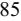

{85}------------------------------------------------

trading days of the quarter ended December 31, 2022. Based on the terms of the 2025 Convertible Notes, the holders cannot convert all or a portion of their 2025 Convertible Notes in the first quarter of 2023. When a conversion notice is received, the Company has the option to pay or deliver cash, shares of the Company's common stock, or a combination thereof. As the Company is not required to settle the 2025 Convertible Notes in cash, the 2025 Convertible Notes are classified as long-term debt as of December 31, 2022 and 2021. As of December 31, 2022, the Company had not received any conversion notices.

Upon conversion, the Company will pay or deliver, as applicable, cash, shares of common stock or a combination of cash and shares of common stock, at its election. The initial conversion rate for the 2025 Convertible Notes is 27.5198 shares of common stock per \$1,000 in principal amounts of 2025 Convertible Notes, equivalent to an initial conversion price of approximately \$36.34 per share of common stock. The conversion rate is subject to adjustment as described in the Indenture. In addition, following certain corporate events that occur prior to the maturity date as described in the Indenture, the Company will pay a make-whole premium by increasing the conversion rate for a holder who elects to convert its 2025 Convertible Notes in connection with such a corporate event in certain circumstances. The value of the 2025 Convertible Notes, if-converted, does not exceed the principal amount based on a closing stock price of \$9.24 on December 31, 2022.

The Company may not redeem the 2025 Convertible Notes prior to May 6, 2023. The Company may redeem for cash all or any portion of the 2025 Convertible Notes, at its option, on or after May 6, 2023 if the last reported sale price of its common stock has been at least 130.0% of the conversion price then in effect for at least20 trading days (whether or not consecutive) during any 30 consecutive trading day period (including the last trading day of such period) ending on, and including, the trading day immediately preceding the date of notice by the Company of redemption at a redemption price equal to 100.0% of the principal amount of the 2025 Convertible Notes to be redeemed, plus accrued and unpaid interest to, but excluding, the redemption date. No sinking fund is provided for the 2025 Convertible Notes.

If an event involving bankruptcy, insolvency or reorganization events with respect to the Company occurs, then the principal amount of, and all accrued and unpaid interest on, all of the 2025 Convertible Notes then outstanding will immediately become due and payable. If any other default event occurs and is continuing, then noteholders of at least 25.0% of the aggregate principal amount of the 2025 Convertible Notes then outstanding, by notice to the Company, may declare the principal amount of, and all accrued and unpaid interest on, all of the 2025 Convertible Notes then outstanding to become due and payable immediately. If the Company undergoes a "fundamental change" as defined in the Indenture, then noteholders may require the Company to repurchase their 2025 Convertible Notes at a cash repurchase price equal to the principal amount of the 2025 Convertible Notes to be repurchased, plus accrued and unpaid interest, if any, to, but excluding, the fundamental change repurchase date.

The 2025 Convertible Notes are the Company's senior, unsecured obligations and will be equal in right of payment with its existing and future senior, unsecured indebtedness, senior in right of payment to its existing and future indebtedness that is expressly subordinated to the 2025 Convertible Notes and effectively junior to its existing and future secured indebtedness, to the extent of the value of the collateral securing that indebtedness. The 2025 Convertible Notes will be structurally subordinated to all existing and future indebtedness and other liabilities, including trade payables, of its subsidiaries.

The interest expense recognized on the 2025 Convertible Notes includes \$2.5 million, \$1.2 million and \$0.1 million, for the contractual coupon interest, the amortization of the debt discount and the amortization of the debt issuance costs, respectively for the year ended December 31, 2022. The interest expense recognized on the 2025 Convertible Notes includes \$2.5 million, \$1.2 million and \$0.1 million, for the contractual coupon interest, the amortization of the debt discount and the amortization of the debt issuance costs, respectively for the year ended December 31, 2021. The effective interest rate on the 2025 Convertible Notes is 1.96%, which includes the interest on the 2025 Convertible Notes and amortization of the debt discount and debt issuance costs. The 2025 Convertible Notes bear interest at a rate of 1.25% per annum, payable semi-annually in arrears on May 1 and November 1 of each year, which began on November 1, 2020.

{86}------------------------------------------------

### Maturities of Long-Term Debt

Maturities of long-term debt at December 31, 2022 are summarized as follows (in thousands):

|                                         | 0.25% Convertible Senior Notes | 1.25% Convertible Senior Notes | Equipment Financing Obligations | Total Long-Term Debt |
|-----------------------------------------|-----------------------------------|-----------------------------------|------------------------------------|----------------------|
| 2023                                    | \$ — \$                        | — \$                              | 70                                 | \$ 70             |
| 2024                                    | —                                 | —                                 | —                                  | —                    |
| 2025                                    | —                                 | 201,250                           | —                                  | 201,250              |
| 2026                                    | —                                 | —                                 | —                                  | —                    |
| 2027                                    | —                                 | —                                 | —                                  | —                    |
| Thereafter                              | 345,000                           | —                                 | —                                  | 345,000              |
| Total Debt                              | 345,000                           | 201,250                           | 70                                 | 546,320              |
| Less: Current portion of long-term debt | —                                 | —                                 | (70)                               | (70)                 |
| Less: Unamortized debt discount         | (7,505)                           | (2,891)                           | —                                  | (10,396)             |
| Less: Unamortized debt issuance costs   | (174)                             | (358)                             | —                                  | (532)                |
| Long-term debt, net                     | \$ 337,321 \$                  | 198,001                           | \$ — \$                         | 535,322              |

### **Note 10. Derivative Instruments and Hedging Activities**

Concurrent with the closing of the 2025 Convertible Notes, the proceeds from this transaction were used to pay off all amounts outstanding under the Company's Prior Senior Secured Credit Agreement, after which the Company had no outstanding debt with variable rate interest. On May 1, 2020, the remaining obligation to make any further payments under the swap agreement was terminated. As a result of the termination, the Company paid \$3.3 million, which is included within loss on termination of cash flow hedge on the Consolidated Statements of Operations for the year ended December 31, 2020. The Company did not have any such losses in the years ended December 31, 2022 and 2021.

Fair value adjustments were historically recorded within other comprehensive income. Upon termination of the interest rate swap in 2020, the accumulated losses, net of tax of \$2.7 million, related to the interest rate swap were reclassified from accumulated other comprehensive income to loss on termination of cash flow hedge on the Consolidated Statements of Operations for the year ended December 31, 2020. No such reclassifications were recorded during the years endedDecember 31, 2022 and 2021.

#### **Note 11. Equity Transactions**

#### Private Placement Transaction

On June 18, 2021, the Company completed a private placement ("Private Placement") to certain accredited investors of an aggregate of4,444,445 shares of the Company's common stock at a price of \$45.00 per share. The net proceeds to the Company from the Private Placement were approximately \$189.9 million, after deducting fees to the placement agents and other offering expenses of approximately \$10.1 million.

#### Common Stock Issued for Acquisition

As discussed in Note 3. Acquisitions, the Company issued597,712 shares of common stock as consideration for the acquisition of Trapelo in April 2021.

#### Underwritten Public Equity Offerings

On January 6, 2021, the Company entered into an underwriting agreement relating to the issuance and sale of4,081,632 shares of the Company's common stock, \$0.001 par value per share (the "2021 Common Stock Offering"). The price to the public in this offering was \$49.00 per share. The net proceeds to the Company from the 2021 Common Stock Offering were approximately \$189.9 million, after deducting underwriting discounts, commissions and other offering expenses of approximately \$10.1 million.

Under the terms of the underwriting agreement, the Company also granted the Underwriters a30-day option to purchase up to612,244 additional shares of common stock at the public offering price, less underwriting discounts and commissions. On January 6, 2021, the underwriters exercised their option in full and purchased all 612,244 shares. The net proceeds related to

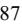

{87}------------------------------------------------

the option exercise were approximately \$28.4 million, after deducting underwriting discounts, commissions and other offering expenses of approximately \$1.6 million.

On April 29, 2020, the Company entered into an underwriting agreement relating to the issuance and sale of4.4 million shares of the Company's common stock, \$0.001 par value per share (the "2020 Common Stock Offering"). The price to the public in this offering was \$28.50 per share. The net proceeds to the Company from the 2020 Common Stock Offering were approximately \$117.9 million, after deducting underwriting discounts, commissions and other offering expenses of approximately \$7.5 million.

Under the terms of the underwriting agreement, the Company also granted the underwriters a30-day option to purchase up to660,000 additional shares of common stock at the public offering price, less underwriting discounts and commissions. On May 29, 2020, the underwriters partially exercised their option and on June 3, 2020, purchased an additional 351,500 shares. The net proceeds related to the option exercise were approximately \$9.4 million, after deducting underwriting commissions and other offering expenses of approximately \$0.6 million.

#### **Note 12. Stock-Based Compensation**

### *Equity Incentive Plan*

On May 27, 2021, the stockholders of the Company approved an amendment to the Equity Incentive Plan, originally effective as of October 14, 2003, and previously amended and restated and approved by the stockholders on December 21, 2015, and then again on May 25, 2017 (the "Amended Plan"). The Amended Plan allows for the award of equity incentives, including stock options, stock appreciation rights, restricted stock awards, stock bonus awards, deferred stock awards, and other stock-based awards to certain employees, directors, or officers of, or key non-employee advisers or consultants, including contracted physicians to the Company or its subsidiaries. The Amended Plan provides that the maximum aggregate number of shares of the Company's common stock reserved and available for issuance under the Amended Plan is 25,625,000.

### *Inducement Awards*

Mr. Christopher M. Smith was appointed CEO effective August 15, 2022. In connection with his appointment, the Company and Mr. Smith entered into a Form of Stand-Alone Inducement Restricted Stock Agreement and a Form of Stand-Alone Inducement Stock Option Agreement (together, the "2022 CEO Inducement Agreements"). The 2022 CEO Inducement Agreements provided for a sign-on inducement equity award consisting of 602,219 restricted stock awards and 694,444 stock options to purchase the Company's common stock at a strike price of \$12.62 per share. The restricted stock awards and stock options vest ratably on an annual basis over a period of our years from the date of the grant so long as Mr. Smith remains employed with the Company through the applicable vesting dates. The awards subject to the 2022 CEO Inducement Agreements were not charged against the Amended Plan's share reserve and were granted outside of the Amended Plan as the 2022 CEO Inducement Award.

Mr. Jeffrey S. Sherman was appointed CFO effective December 5, 2022. In connection with his appointment, the Company and Mr. Sherman entered into a Form of Stand-Alone Inducement Restricted Stock Agreement and a Form of Stand-Alone Inducement Stock Option Agreement (together, the "2022 CFO Inducement Agreements"). The 2022 CFO Inducement Agreements provided for a sign-on inducement equity award consisting of 133,809 restricted stock awards and 249,169 stock options to purchase the Company's common stock at a strike price of \$11.62 per share. The awards vest ratably on an annual basis over a period offour years from the date of the grant so long as Mr. Sherman remains employed with the Company through the applicable vesting dates. Of the 133,809 restricted stock awards granted, vesting of89,206 restricted shares are also contingent upon achievement of an absolute total shareholder return ("TSR") performance target. The awards subject to the 2022 CFO Inducement Agreements were not charged against the Amended Plan's share reserve and were granted outside of the Amended Plan as the 2022 CFO Inducement Award.

#### *Stock Options*

As of December 31, 2022 and 2021, stock options outstanding totaled4.2 million and 3.0 million shares, respectively. As of December 31, 2022 and 2021, a total of approximately 4.9 million and 6.8 million shares, respectively, were available for future option and stock awards under the Amended Plan. Options typically expire after5 or 7 years and generally vest over 3 or 4 years, but each grant's expiration, vesting, and exercise price provisions are determined at the time the awards are granted by the Compensation Committee of the Board of Directors.

The fair value of each stock award granted during the years ended December 31, 2022 and 2021 was estimated as of the grant date using a Black-Scholes model.The fair value of each stock option award granted during the year ended December 31,

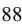

{88}------------------------------------------------

2020 was estimated as of the grant date using a trinomial lattice model. Weighted average assumptions used during the years ended December 31, 2022, 2021 and 2020 are as follows:

|                                                 | 2022          | 2021          | 2020          |
|-------------------------------------------------|---------------|---------------|---------------|
| Expected term (in years)                        | 3.0 – 5.5     | 1.2 – 5.5     | 3.8 – 5.5     |
| Risk-free interest rate (%)                     | 1.4% - 4.5%   | 0.2% - 1.3%   | 0.2% - 1.7%   |
| Expected volatility (%)                         | 41.9% - 66.7% | 38.7% - 51.4% | 39.9% - 44.6% |
| Dividend yield (%)                              | —             | —             | —             |
| Weighted average fair value/share at grant date | \$6.42        | \$18.87       | \$8.88        |

The status of the stock options are summarized as follows:

|                                  | Number of Shares | Weighted Average Exercise Price |
|----------------------------------|---------------------|---------------------------------------|
| Outstanding at December 31, 2019 | 5,318,759           | \$ 9.97                            |
| Granted                          | 845,120             | 28.33                                 |
| Exercised                        | (2,310,934)         | 7.96                                  |
| Forfeited                        | (67,004)            | 16.37                                 |
| Outstanding at December 31, 2020 | 3,785,941           | 15.21                                 |
| Granted                          | 1,232,056           | 42.13                                 |
| Exercised                        | (1,372,564)         | 9.97                                  |
| Forfeited                        | (684,238)           | 29.70                                 |
| Outstanding at December 31, 2021 | 2,961,195           | 25.46                                 |
| Granted                          | 4,494,333           | 14.49                                 |
| Exercised                        | (949,259)           | 10.87                                 |
| Forfeited                        | (2,291,652)         | 26.50                                 |
| Outstanding at December 31, 2022 | 4,214,617           | 16.48                                 |
| Exercisable at December 31, 2022 | 873,808             | 27.53                                 |

The number and weighted average grant-date fair values of options non-vested at the beginning and end of 2022, as well as options granted, vested, and forfeited during the year were as follows:

|                                 | Number of Options |             |
|---------------------------------|-------------------|-------------|
| Non-vested at December 31, 2021 | 1,292,839         | \$ 13.93 |
| Granted                         | 4,494,333         | 6.42        |
| Vested                          | (684,633) \$      | 12.41       |
| Forfeited                       | (1,761,730)       | 10.27       |
| Non-vested at December 31, 2022 | 3,340,809         | \$ 6.11  |

The following table summarizes information about the options outstanding at December 31, 2022:

|                                     | Options Outstanding   |                                                                 | Options Exercisable                      |                       |                                                                 |                                          |
|-------------------------------------|-----------------------|-----------------------------------------------------------------|------------------------------------------|-----------------------|-----------------------------------------------------------------|------------------------------------------|
| Range of Exercise Prices (\$) | Number Outstanding | Weighted Average Remaining Contractual Life (Years) | Weighted Average Exercise Price | Number Exercisable | Weighted Average Remaining Contractual Life (Years) | Weighted Average Exercise Price |
| 7.34 – 8.13                         | 876,001               | 6.42 \$                                                         | 8.04                                     | 7,881                 | 0.16 \$                                                         | 8.03                                     |
| 8.14 – 11.34                        | 863,300               | 5.91                                                            | 9.40                                     | 89,470                | 0.28                                                            | 9.32                                     |
| 11.35 – 12.61                       | 504,781               | 6.05                                                            | 11.87                                    | 47,294                | 0.48                                                            | 11.94                                    |
| 12.62 – 21.40                       | 943,249               | 5.45                                                            | 14.19                                    | 207,971               | 1.97                                                            | 18.22                                    |
| 21.41 – 55.40                       | 1,027,286             | 4.34                                                            | 33.98                                    | 521,192               | 3.19                                                            | 36.08                                    |
|                                     | 4,214,617             | 5.55                                                            | 16.48                                    | 873,808               | 2.43                                                            | 27.53                                    |

{89}------------------------------------------------

As of December 31, 2022, the aggregate intrinsic value of all stock options outstanding and expected to vest was approximately \$1.4 million and the aggregate intrinsic value of currently exercisable stock options was immaterial. The intrinsic value of each option share is the difference between the fair market value of NeoGenomics' common stock and the exercise price of such option share to the extent it is "in-the-money." Aggregate intrinsic value represents the value that would have been received by the holders of in-themoney options had they exercised their options on the last trading day of the year and sold the underlying shares at the closing stock price on such day. The intrinsic value calculation is based on the \$9.24 closing stock price of the Company's common stock on December 30, 2022, the last trading day of 2022. The total number of in-the-money options outstanding and exercisable as of December 31, 2022 was approximately 0.1 million.

The total intrinsic value of options exercised during each of the years ended December 31, 2022, 2021 and 2020 was approximately \$6.1 million, \$46.7 million and \$68.6 million, respectively. Intrinsic value of exercised shares is the total value of such shares on the date of exercise less the cash received from the option holder to exercise the options. The total cash proceeds received from the exercise of stock options were approximately \$10.3 million, \$13.7 million and \$18.4 million for the years ended December 31, 2022, 2021 and 2020, respectively.

The total fair value of options granted during the years ended December 31, 2022, 2021 and 2020 was approximately \$28.9 million, \$23.2 million and \$7.5 million, respectively. The total fair value of option shares vested during the years ended December 31, 2022, 2021 and 2020 was approximately \$8.3 million, \$11.7 million and \$5.2 million, respectively.

The Company recognizes stock-based compensation expense using the straight-line basis over the awards' requisite service periods. Stock compensation expense related to stock options for the years ended December 31, 2022, 2021 and 2020 was approximately \$8.1 million, \$11.6 million and \$6.0 million, respectively, and is included in general and administrative expenses in the Consolidated Statements of Operations. As of December 31, 2022, there was approximately \$13.5 million of total unrecognized stock-based compensation cost related to non-vested stock options granted under the Amended Plan, the 2022 CEO Inducement Award and the 2022 CFO Inducement Award. This cost is expected to be recognized over a weighted-average period of 2.1 years.

#### *Restricted Stock Awards*

The number of shares and weighted average grant date fair values of restricted non-vested common stock at the beginning and end of 2022, 2021 and 2020, as well as stock awards granted, vested, and forfeited during the year were as follows:

|                                | Number of Restricted Shares | Weighted Average Grant Date Fair Value |
|--------------------------------|-----------------------------------|----------------------------------------------|
| Nonvested at December 31, 2019 | 335,298                           | \$ 15.75                                  |
| Granted                        | 149,012                           | 28.45                                        |
| Vested                         | (184,127)                         | 12.90                                        |
| Forfeited                      | (8,292)                           | 20.75                                        |
| Nonvested at December 31, 2020 | 291,891                           | 23.82                                        |
| Granted                        | 936,648                           | 39.52                                        |
| Vested                         | (213,777)                         | 32.83                                        |
| Forfeited                      | (163,359)                         | 38.58                                        |
| Nonvested at December 31, 2021 | 851,403                           | 36.00                                        |
| Granted                        | 2,865,727                         | 14.16                                        |
| Vested                         | (413,747)                         | 33.19                                        |
| Forfeited                      | (1,308,522)                       | 24.57                                        |
| Nonvested at December 31, 2022 | 1,994,861                         | 12.71                                        |

Stock compensation expense related to restricted stock for the years ended December 31, 2022, 2021 and 2020 was approximately \$15.5 million, \$9.8 million, and \$3.4 million, respectively, and is included in general and administrative expenses in the Consolidated Statements of Operations. As of December 31, 2022, there was approximately \$ 17.1 million of total unrecognized stock-based compensation cost related to non-vested restricted stock granted under the Amended Plan, the 2022 CEO Inducement Award and the 2022 CFO Inducement Award. This cost is expected to be recognized over a weighted-average period of 2.2 years.

{90}------------------------------------------------

#### *Modifications of Stock Option and Restricted Stock Awards*

For the year ended December 31, 2022, the Culture and Compensation Committee of the Company's Board of Directors approved the accelerated vesting of353,265 previously granted time-vesting stock option awards and 285,114 previously granted time-vesting restricted stock awards upon the exit of certain officers of the Company. The Company accounted for the effects of the stock awards as modifications, and recognized \$8.6 million of incremental stock-based compensation upon acceleration, which consisted of \$2.7 million and \$5.9 million for the acceleration of stock option awards and restricted stock awards, respectively, for the year ended December 31, 2022. These amounts are included in stock compensation expense for the year ended December 31, 2022 and are recorded as general and administrative expenses in the Company's Consolidated Statements of Operations.

#### *Employee Stock Purchase Plan*

The Company sponsors an Employee Stock Purchase Plan ("ESPP"), under which eligible employees can purchase common stock at a15.0% discount from the fair market value. Stock-based compensation expense related to the ESPP for the years ended December 31, 2022, 2021 and 2020 was approximately \$1.0 million, \$1.1 million and \$0.9 million, respectively. Shares issued pursuant to this plan were 415,450, 112,094 and 138,309 for each of the years ended December 31, 2022, 2021 and 2020, respectively.

#### **Note 13. Revenue Recognition**

The Company's two reportable segments for which it recognizes revenue are (1) Clinical Services and (2) Pharma Services. The Clinical Services segment provides various clinical testing services to community-based pathology practices, oncology practices, hospital pathology labs, reference labs, and academic centers with reimbursement from various payers including client direct billing, commercial insurance, Medicare and other government payers, and patients. The Pharma Services segment supports pharmaceutical firms in their drug development programs by providing testing services and data analytics for clinical trials and research.

#### *Clinical Services Revenue*

The Company's specialized diagnostic services are performed based on a written test requisition form or an electronic equivalent. The performance obligation is satisfied and revenues are recognized once the diagnostic services have been performed and the results have been delivered to the ordering physician. These diagnostic services are billed to various payers, including client direct billing, commercial insurance, Medicare and other government payers, and patients. Revenue is recorded for all payers based on the amount expected to be collected, which considers implicit price concessions. Implicit price concessions represent differences between amounts billed and the estimated consideration the Company expects to receive based on negotiated discounts, historical collection experience, and other anticipated adjustments, including anticipated payer denials.

#### *Pharma Services Revenue*

The Company's Pharma Services segment generally enters into contracts with pharmaceutical and biotech customers as well as other contract research organizations ("CROs") to provide research and clinical trial services. Such services also include validation studies and assay development. The Company records revenue on a unit-of-service basis based on the number of units completed towards the satisfaction of a performance obligation. Certain contracts include upfront fees or billing milestones that are recognized over time, which aligns with the progress of the Company towards fulfilling its obligations under the contract.

Additional offerings within the Pharma Services portfolio includes Informatics, which involves the licensing of de-identified data to pharmaceutical and biotech customers in the form of either retrospective records or prospective deliveries of data. Informatics revenue is recognized at a point in time upon delivery of retrospective data or over time for prospective data feeds. The Company negotiates billing schedules and payment terms on a contract-by-contract basis, and contract terms generally provide for payments based on a unit-of-service arrangement.

Amounts collected in advance of services being provided are deferred as contract liabilities on the Consolidated Balance Sheets. The associated revenue is recognized and the contract liability is reduced as the contracted services are subsequently performed. Contract assets are established for revenue recognized but not yet billed. These contract assets are reduced once the customer is invoiced and a corresponding receivable is recorded. Additionally, Pharma Services incurs sales commissions in the process of obtaining contracts with customers. Sales commissions that are payable upon contract award are recognized as assets and amortized over the expected life of the customer relationship. For offerings with primarily short-term contracts, such as Informatics, the Company applies the practical expedient which allows costs to obtain a contract to be expensed when

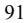

{91}------------------------------------------------

incurred, if the amortization period of the assets that would otherwise have been recognized is one year or less. Contract assets and capitalized commissions are included in other current assets and other assets on the Consolidated Balance Sheets.

Most contracts are terminable by the customers, either immediately or according to advance notice terms specified within the contracts. All contracts require payment of fees to the Company for services rendered through the date of termination and may require payment for subsequent services necessary to conclude the study or close out the contract.

The following table summarizes the values of contract assets, capitalized commissions, and contract liabilities for Pharma Services as of December 31, 2022 and 2021 (in thousands):

|                                                 | 2022 |          | 2021  |
|-------------------------------------------------|------|----------|-------|
| (1) Current pharma contract assets           | \$   | 1,898 \$ | 1,738 |
| (2) Long-term pharma contract assets         |      | 31       | 236   |
| Total pharma contract assets                    | \$   | 1,929 \$ | 1,974 |
|                                                 |      |          |       |
| (1) Current pharma capitalized commissions   | \$   | 800 \$   | 109   |
| (2) Long-term pharma capitalized commissions |      | 715      | 882   |
| Total pharma capitalized commissions            | \$   | 1,515 \$ | 991   |
|                                                 |      |          |       |
| Current pharma contract liabilities             | \$   | 7,557 \$ | 5,192 |
| (3) Long-term pharma contract liabilities    |      | 19       | 917   |
| Total pharma contract liabilities               | \$   | 7,576 \$ | 6,109 |

Recorded within other current assets on the Consolidated Balance Sheets. (1)

Recorded within other assets on the Consolidated Balance Sheets. (2)

Recorded within other long-term liabilities on the Consolidated Balance Sheets. (3)

Revenue recognized for the years ended December 31, 2022, 2021 and 2020, related to Pharma contract liabilities outstanding at the beginning of each year was 5\$.2 million, \$4.4 million, and \$2.3 million, respectively. Amortization of capitalized commissions for the years ended December 31, 2022, 2021 and 2020 were \$0.9 million, \$1.1 million and \$0.8 million respectively.

#### *Disaggregation of Revenue*

The Company considered various factors for both its Clinical Services and Pharma Services segments in determining appropriate levels of homogeneous data for its disaggregation of revenue; including the nature, amount, timing, and uncertainty of revenue and cash flows. Clinical Services categories align with the types of customers due to similarities of billing method, level of reimbursement, and timing of cash receipts. Unbilled amounts are accrued and allocated to payer categories based on historical experience. In future periods actual billings by payer category may differ from accrued amounts. Pharma Services relate to contracts with large pharmaceutical and biotech customers as well as other CROs. Because the nature, timing, and uncertainty of revenue and cash flows are similar and primarily driven by individual contract terms Pharma Services revenue is not further disaggregated.

The following table details the disaggregation of net revenue for both the Clinical Services and Pharma Services Segments for the years ended December 31, 2022, 2021 and 2020 (in thousands):

|                               | 2022          | 2021          | 2020          |
|-------------------------------|---------------|---------------|---------------|
| Clinical Services:            |               |               |               |
| Client direct billing         | \$ 279,732 | \$ 252,617 | \$ 240,535 |
| Commercial insurance          | 73,280        | 78,773        | 76,550        |
| Medicare and other government | 65,585        | 72,010        | 64,776        |
| Self-pay                      | 157           | 772           | 476           |
| Total Clinical Services       | 418,754       | 404,172       | 382,337       |
| Pharma Services               | 90,974        | 80,157        | 62,111        |
| Total net revenue             | \$ 509,728 | \$ 484,329 | \$ 444,448 |
|                               |               |               |               |

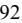

{92}------------------------------------------------

### **Note 14. Restructuring**

In 2022, the Company embarked on a restructuring program to improve execution and drive efficiency across the organization. This program is a framework for identifying, prioritizing and executing operational improvements. Restructuring charges incurred consist of severance and other employee costs, costs for optimizing the Company's geographic presence ("Facility Footprint Optimization"), and consulting and other costs.

The following table summarizes the costs associated with the Company's restructuring activities for the year ended December 31, 2022 (in thousands):

|                                            | Severance and Other Employee Costs | Facility Footprint Optimization | Consulting and Other Costs | Total   |
|--------------------------------------------|---------------------------------------|------------------------------------|-------------------------------|---------|
| Balance as of December 31, 2021            | \$                                    | — \$                               | — \$ — \$                  | —       |
| Restructuring charges incurred             | 1,036                                 | —                                  | 2,762                         | 3,798   |
| Impairment of facility-related assets      | —                                     | 718                                | —                             | 718     |
| (1) Cash payments and other adjustments | (477)                                 | (718)                              | (1,802)                       | (2,997) |
| Balance as of December 31, 2022            | \$ 559                             | \$                                 | — \$ 960 \$                | 1,519   |
| Current liabilities                        |                                       |                                    | \$                            | 1,519   |
| Long-term liabilities                      |                                       |                                    |                               | —       |
|                                            |                                       |                                    | \$                            | 1,519   |

Other adjustments include non-cash asset charges related to Facility Footprint Optimization costs. (1)

The Company will continue this restructuring program in 2023 and expects to incur additional restructuring charges of approximately \$5.0 million. The Company estimates these additional restructuring charges to be comprised of approximately \$2.0 million in severance and other employee costs, \$2.0 million of Facility Footprint Optimization costs, and \$1.0 million of consulting and other costs. The Company's restructuring activities are expected to be complete by December 31, 2023.

#### **Note 15. Income Taxes**

The CARES Act impacted a number of provisions of the tax code, including the eligibility of certain deductions and the treatment of net operating losses ("NOLs") and tax credits. The CARES Act did not result in any material adjustments to the Company's income tax provision for the years ended December 31, 2022, 2021 and 2020 or to its deferred tax assets as of December 31, 2022 and 2021.

(Loss) income before income tax expense (benefit) for the years ended December 31, 2022, 2021 and 2020 is as follows (in thousands):

|                                                    | 2022               | 2021 |             | 2020 |          |
|----------------------------------------------------|--------------------|------|-------------|------|----------|
| (Loss) income before income tax expense (benefit): |                    |      |             |      |          |
| Domestic                                           | \$ (90,058) \$  |      | 24,761 \$   |      | (6,954)  |
| Foreign                                            | (69,284)           |      | (39,836)    |      | (7,102)  |
| Total                                              | \$ (159,342) \$ |      | (15,075) \$ |      | (14,056) |
|                                                    |                    |      |             |      |          |
| Income tax expense (benefit)                       |                    |      |             |      |          |
| Current:                                           |                    |      |             |      |          |
| Federal                                            | \$ (41) \$      |      | 41 \$       |      | (434)    |
| State                                              | 176                |      | 41          |      | 273      |
| Foreign                                            | 17                 |      | —           |      | —        |
| Total current tax expense (benefit)                | \$ 152          | \$   | 82 \$       |      | (161)    |
| Deferred:                                          |                    |      |             |      |          |
| Federal                                            | \$ 614          | \$   | (575) \$    |      | (12,856) |
| State                                              | (647)              |      | 1,241       |      | (5,211)  |
| Foreign                                            | (15,211)           |      | (7,476)     |      | —        |
| Total deferred benefit provision                   | \$ (15,244) \$  |      | (6,810) \$  |      | (18,067) |
| Total tax benefit provision                        | \$ (15,092) \$  |      | (6,728) \$  |      | (18,228) |
|                                                    |                    |      |             |      |          |

{93}------------------------------------------------

A reconciliation of the differences between the effective tax rate and the federal statutory tax rate for the years ended December 31, 2022, 2021 and 2020 is as follows:

|                                                        | 2022     | 2021      | 2020     |
|--------------------------------------------------------|----------|-----------|----------|
| Federal statutory tax rate                             | 21.00 %  | 21.00 %   | 21.00 %  |
| State income taxes, net of federal income tax benefit  | 2.06 %   | 17.77 %   | 14.29 %  |
| Transaction Costs                                      | (0.01)%  | (10.11)%  | — %      |
| Penalties                                              | (0.03)%  | (15.61)%  | (0.01)%  |
| Compensation expense                                   | (2.17)%  | (0.96)%   | 65.78 %  |
| Inivata acquisition fair value adjustment              | — %      | 159.14 %  | — %      |
| Capped call interest                                   | 4.50 %   | — %       | — %      |
| Tax credits                                            | 1.32 %   | 11.63 %   | 32.11 %  |
| Return to provision and other deferred tax adjustments | (0.22)%  | — %       | 7.38 %   |
| Foreign tax rate differential                          | 1.20 %   | 2.74 %    | (1.64)%  |
| Other, net                                             | (0.12)%  | (2.91)%   | (0.26)%  |
| Valuation allowance                                    | (18.07)% | (138.07)% | (8.97)%  |
| Effective tax rate                                     | 9.46 %   | 44.62 %   | 129.68 % |

At December 31, 2022 and 2021, deferred income tax assets and liabilities consisted of the following (in thousands):

|                                     | 2022               | 2021      |
|-------------------------------------|--------------------|-----------|
| Deferred tax assets:                |                    |           |
| Accrued compensation                | 5,282              | 6,171     |
| Net operating loss carry-forwards   | 106,742            | 81,903    |
| Tax credits                         | 8,983              | 6,596     |
| Stock-based compensation            | 2,797              | 2,355     |
| Operating lease liabilities         | 19,248             | 19,978    |
| Interest expense                    | 2,751              | 886       |
| Convertible debt discount           | 5,287              | —         |
| Research expenditures               | 4,348              | —         |
| Other                               | 4,529              | 2,963     |
| Gross deferred tax assets           | 159,967            | 120,852   |
| Less: valuation allowance           | (65,166)           | (33,014)  |
| Total deferred tax assets           | \$ 94,801 \$    | 87,838    |
| Deferred tax liabilities:           |                    |           |
| Operating lease right-of-use assets | \$ (18,215) \$  | (19,094)  |
| Convertible debt discount           | —                  | (1)       |
| Intangible assets                   | (101,886)          | (108,592) |
| Property and equipment              | (9,450)            | (15,389)  |
| Total deferred tax liabilities      | \$ (129,551) \$ | (143,076) |
| Net deferred income tax liabilities | \$ (34,750) \$  | (55,238)  |

At December 31, 2022, the Company has federal net operating loss carry forwards of approximately \$262.5 million, foreign net operating loss carryforwards of approximately \$188.9 million, including \$158.2 million in the United Kingdom, and state net operating loss carry forwards of approximately \$131.6 million. Federal net operating loss carry forwards will begin to expire in 2036. Under the Tax Act, as modified by the CARES Act, the Company's federal NOLs generated in tax years ending after December 31, 2017 may be carried forward indefinitely, however, the deductibility of such federal net NOLs in tax years beginning after December 31, 2020, is limited to 80% of taxable income. State tax NOLs began to expire in 2022. NOLs in Switzerland and China begin to expire in 2024 and 2025, if not utilized in future periods. The NOLs in Singapore and the United Kingdom do not expire. As of December 31, 2022, the Company has federal R&D credit carryforwards of approximately \$8.1 million that begin to expire in 2036 and state research and investment credit carryforwards of approximately \$4.6 million that do not expire. An ownership change of more than 50 percent could result in a limitation of the use of net operating loss carryforwards and credit carryforwards under IRC Section 382 and the regulations thereunder.

{94}------------------------------------------------

The Company has not conducted a formal study to determine whether there was an ownership change in prior periods that would limit the use of the Company's net operating loss carryforwards and credit carryforwards under IRC Section 382.

Management assesses the recoverability of its deferred tax assets as of the end of each quarter, weighing all positive and negative evidence, and is required to establish and maintain a valuation allowance for these assets if it is more likely than not that some or all of the deferred tax assets will not be realized. The weight given to the evidence is commensurate with the extent to which the evidence can be objectively verified. If negative evidence exists, positive evidence is necessary to support a conclusion that a valuation allowance is not needed. As of December 31, 2022 and 2021, management determined that sufficient positive evidence did not exist and concluded that it is more likely than not that a valuation allowance is required against deferred tax assets. Accordingly, management established a valuation allowance of \$ 59.5 million related to the Company's domestic operations and a full valuation allowance of \$5.7 million as of December 31, 2022 related to the Company's China, Switzerland and Singapore operations.

The Company files income tax returns in the United States, as well as Singapore, Switzerland, China, United Kingdom and in various state jurisdictions. Tax regulations within each jurisdiction are subject to the interpretation of the related tax laws and regulations and require significant judgment. For U.S. federal and most state purposes, the Company has open tax years ended December 31, 2017 to December 31, 2022. For Switzerland, the Company has open tax years ended December 31, 2018 to December 31, 2022, for Singapore the Company has open tax years ended December 31, 2020 to December 31, 2022 and for United Kingdom the Company has open tax years ended December 31, 2021 and December 31, 2022. The 2017 U.S. Federal income tax filing is currently under examination by the IRS.

The Company applied the accounting standard for uncertain tax positions and recognizes the financial statement benefit of a tax position only after determining that the relevant tax authority would more likely than not sustain the position following an audit. For tax positions meeting the more likely than not threshold, the amount recognized in the financial statements is the largest benefit that has a greater than 50 percent likelihood of being realized upon ultimate settlement with the relevant tax authority. Increases or decreases to the unrecognized tax benefits could result from management's belief that a position can or cannot be sustained upon examination based on subsequent information or potential lapse of the applicable statute of limitation for certain tax positions.

The following are the unrecognized tax benefits as of December 31, 2022 and 2021 (in thousands):

|                                                  | 2022           | 2021  |
|--------------------------------------------------|----------------|-------|
| Unrecognized tax benefits - January 1            | \$ 2,351 \$ | 1,670 |
| Increases in prior year positions                | 82             | 83    |
| Increases in tax positions taken in current year | 726            | 632   |
| Statute expirations                              | —              | (34)  |
| Unrecognized tax benefits - December 31          | \$ 3,159 \$ | 2,351 |

Due to the valuation allowance, the majority of unrecognized tax benefits at December 31, 2022, if recognized, would not impact the Company's effective tax rate. These unrecognized tax benefits are classified as other long-term liabilities on the Consolidated Balance Sheets. The interest and penalties related to the unrecognized tax benefit are immaterial. Interest and tax penalties related to unrecognized tax benefits are included in income tax expense.

#### **Note 16. Net (Loss) Income per Share**

The Company presents both basic earnings per share ("EPS") and diluted EPS. Basic EPS excludes potential dilution and is computed by dividing net (loss) income by the weighted-average number of common shares outstanding for the period. Diluted EPS reflects the potential dilution that could occur if stock awards were exercised and if the 2028 Convertible Notes and 2025 Convertible Notes were converted. The potential dilution from stock awards is accounted for using the treasury stock method based on the average market value of the Company's common stock. The potential dilution from conversion of the 2028 Convertible Notes and 2025 Convertible Notes is accounted for using the if-converted method, which requires that all of the shares of the Company's common stock issuable upon conversion of the 2028 Convertible Notes and the 2025 Convertible Notes will be included in the calculation of diluted EPS assuming conversion of the 2028 Convertible Notes and the 2025 Convertible Notes at the beginning of the reporting period (or at time of issuance, if later).

{95}------------------------------------------------

The following table shows the calculations for the years ended December 31, 2022, 2021 and 2020 (in thousands, except per share amounts):

|                                                  | 2022               | 2021       | 2020    |
|--------------------------------------------------|--------------------|------------|---------|
| NET (LOSS) INCOME                                | \$ (144,250) \$ | (8,347) \$ | 4,172   |
|                                                  |                    |            |         |
| Basic weighted average common shares outstanding | 124,217            | 119,962    | 108,579 |
| Dilutive effect of stock options                 | —                  | —          | 3,010   |
| Dilutive effect of restricted stock awards       | —                  | —          | 205     |
| Diluted weighted average shares outstanding      | 124,217            | 119,962    | 111,794 |
|                                                  |                    |            |         |
| Basic net (loss) income per share                | \$ (1.16) \$    | (0.07) \$  | 0.04    |
| Diluted net (loss) income per share              | \$ (1.16) \$    | (0.07) \$  | 0.04    |

The following potential dilutive shares were excluded from the calculation of diluted net (loss) income per share because their effect would be anti-dilutive for the years ended December 31, 2022, 2021 and 2020:

|                         | 2022  | 2021  | 2020  |
|-------------------------|-------|-------|-------|
| Stock options           | 199   | 1,892 | —     |
| Restricted stock awards | 312   | 194   | —     |
| 2025 Convertible Notes  | 5,538 | 5,538 | 3,723 |
| 2028 Convertible Notes  | 5,215 | 5,130 | —     |

The Capped Call Transactions are not reflected in diluted net (loss) income per share as they are anti-dilutive. For further details on the Capped Call Transactions, please refer to Note 9. Debt.

### **Note 17. Defined Contribution Plan**

The Company maintains a defined-contribution 401(k) retirement plan covering substantially all U.S. based employees (as defined). The Company's employees may make voluntary contributions to the plan, subject to limitations based on IRS regulations and compensation. The Company matches 100.0% of every dollar contributed up to3.0% of the respective employee's compensation and an additional 50.0% of every dollar contributed on the next2% of compensation (4.0% maximum Company match). Matching contributions were approximately \$7.1 million, \$6.1 million and \$4.9 million during the years ended December 31, 2022, 2021 and 2020, respectively, and are recorded in cost of revenue and operating expenses in the Consolidated Statements of Operations.

### **Note 18. Commitments and Contingencies**

### Purchase Commitments

The Company has agreements in place to purchase a specified level of reagents from certain vendors. Typically, the Company can cancel contracts with suppliers without penalties. For those contracts that are not cancelable without penalties, there are termination fees and costs or commitments for continued spending that the Company is obligated to pay to a supplier under each contract's termination period before such contract can be cancelled. As of December 31, 2022, the Company's contractual obligations with these suppliers was approximately \$1.0 million. These purchase commitments expire in 2023.

### Legal Proceedings

On January 20, 2021, Natera, Inc. filed a patent infringement complaint against the Company's newly-acquired subsidiary Inivata Limited and its subsidiary Inivata, Inc. in U.S. District Court for the district of Delaware, alleging Inivata's InVisionFirst®-Lung cancer diagnostic test of infringing two patents. Natera then filed a second patent infringement complaint on December 20, 2022 against Inivata Limited and Inivata Inc. alleging that RaDaR minimal residual disease test infringes one patent. The litigation is approaching the discovery stage. The Company believes that it has good and substantial defenses to the claims alleged in the suit, but there is no guarantee that the Company will prevail. At the time of filing the outcome of this matter is not estimable or probable. ®

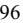

{96}------------------------------------------------

On December 16, 2022, a purported shareholder class action captioned Daniel Goldenberg v. NeoGenomics, Inc., Douglas VanOort, Mark Mallon, Kathryn McKenzie, and William Bonello was filed in the United States District Court for the Southern District of New York, naming the Company and certain of the Company's current and former officers as defendants. This lawsuit was filed by a stockholder who claims to be suing on behalf of anyone who purchased or otherwise acquired the Company's securities between February 27, 2020 and April 26, 2022. The lawsuit alleges that material misrepresentations and/or omissions of material fact were made in the Company's public disclosures in violation of Sections 10(b) and 20(a) of the Exchange Act and Rule 10b-5 promulgated thereunder. The alleged improper disclosures relate to statements regarding the Company's menu of tests, business operations and compliance with health care laws and regulations. The plaintiff seeks unspecified monetary damages on behalf of the putative class and an award of costs and expenses, including attorney's fees and expert fees. The Company believes that it has valid defenses to the claims alleged in this lawsuit, but there is no guarantee that the Company will prevail. At the time of filing the outcome of this matter is not estimable or probable.

#### Regulatory Matter

With the assistance of outside counsel, the Company voluntarily conducted an internal investigation that focused on the compliance of certain consulting and service agreements with federal healthcare laws and regulations, including those relating to fraud, waste and abuse. Based on this internal investigation, the Company voluntarily notified the Office of Inspector General of the U.S. Department of Health and Human Services ("OIG") of the Company's internal investigation in November 2021. The Company's interactions with regulatory authorities and the Company's related review of this matter are ongoing. The Company has a reserve of \$11.2 million in other long-term liabilities as of December 31, 2022 and 2021 on the Consolidated Balance Sheets for potential damages and liabilities primarily associated with the federal healthcare program revenue received by the Company in connection with the agreements at issue that were identified during the course of this internal investigation. This reserve reflects management's best estimate of the minimum probable loss associated with this matter. As a result of the internal investigation and ongoing interactions with regulatory authorities, the Company may accrue additional reserves for any related potential damages and liabilities arising out of this matter. The Company was notified on June 30, 2022 that the Department of Justice ("DOJ") will be participating in the investigation of this matter. At this time, the Company is unable to predict the duration, scope, result or related costs associated with any further investigation, including by the OIG, DOJ, or any other governmental authority, or what penalties or remedial actions they may seek. Accordingly, at this time, the Company is unable to estimate a range of possible loss in excess of the amount reserved. Any determination that the Company's operations or activities are not in compliance with existing laws or regulations, however, could result in the imposition of civil or criminal fines, penalties, disgorgement, restitution, equitable relief, exclusion from participation in federal healthcare programs or other losses or conduct restrictions, which could be material to the Company's financial results or business operations.

#### **Note 19. Related Party Transactions**

On May 22, 2020, the Company formed a strategic alliance with Inivata and entered into a Strategic Alliance Agreement and Laboratory Services Agreement whereas Inivata, prior to the Inivata Acquisition Date, would render and perform certain laboratory testing which the Company made available to customers. In connection with this agreement, Inivata provided \$0.8 million of testing services to the Company recorded in cost of revenue in the Consolidated Statements of Operations for the year ended December 31, 2021 through the Inivata Acquisition Date.

On May 22, 2020, the Company and Inivata also entered into a Line of Credit in the amount of \$15.0 million. The Company and Inivata settled the Line of Credit after the Inivata Acquisition Date and no amounts were outstanding as of December 31, 2022 and 2021. For further details on the Line of Credit, please refer to Note 8. Investment in Non-Consolidated Affiliate.

On June 18, 2021, the Company completed its acquisition of all remaining equity interest in Inivata by exercising its Purchase Option. Beginning June 18, 2021, Inivata is a wholly-owned consolidated subsidiary of the Company. As of the Inivata Acquisition Date, Inivata's financial statement activity has been consolidated within the Company's Consolidated Financial Statements. For further details on the acquisition of Inivata, please refer to Note 3. Acquisitions.

The Company has Pharma Services contracts with CytomX Therapeutics, Inc., an entity with whom a director of the Company, Dr. Alison L. Hannah, was an officer at until September 2022, and the Company's former Chief Legal Officer, Halley E. Gilbert, is a director. In connection with these contracts, the Company recognized \$ 0.7 million of revenue in the Consolidated Statements of Operations for each of the years ended December 31, 2022 and 2021 and \$0.3 million for the year ended December 31, 2020.

The Company has Pharma Services contracts with HOOKIPA Pharma, Inc., an entity with whom a director of the Company, Michael A. Kelly, is a director. In connection with these contracts, the Company recognized \$0.4 million and \$0.5 million of

{97}------------------------------------------------

revenue in the Consolidated Statements of Operations for the years ended December 31, 2022 and 2021, respectively. In connection with these contracts, revenue in the Consolidated Statements of Operations for the year ended December 31, 2020 was immaterial.

{98}------------------------------------------------

#### **Note 20. Segment Information**

The Company recognizes revenue under two reportable segments, (1) Clinical Services and (2) Pharma Services. The Clinical Services segment provides various clinical testing services to community-based pathology and oncology practices, hospital pathology labs, and academic centers with reimbursement from various payers including client direct billing, commercial insurance, Medicare and other government payers, and self-pay patients. The Pharma Services segment supports pharmaceutical firms' drug development programs by assisting with various clinical trials and research as well as providing informatics related services often supporting pharmaceutical commercialization efforts.

The financial information reviewed by the Chief Operating Decision Maker ("CODM") includes revenues, cost of revenue, and gross profit for both reportable segments. Assets are not presented at the segment level as that information is not used by the CODM.

The following table summarizes segment information for the years ended December 31, 2022, 2021 and 2020 (in thousands):

|                                                                                   | 2022               | 2021       | 2020     |
|-----------------------------------------------------------------------------------|--------------------|------------|----------|
| Net revenue:                                                                      |                    |            |          |
| Clinical Services                                                                 | \$ 418,754 \$   | 404,172 \$ | 382,337  |
| Pharma Services                                                                   | 90,974             | 80,157     | 62,111   |
| Total net revenue                                                                 | 509,728            | 484,329    | 444,448  |
| Cost of revenue:                                                                  |                    |            |          |
| (1) Clinical Services                                                          | 261,742            | 244,360    | 215,529  |
| (2) Pharma Services                                                            | 60,090             | 52,909     | 43,026   |
| Total cost of revenue                                                             | 321,832            | 297,269    | 258,555  |
| Gross profit:                                                                     |                    |            |          |
| Clinical Services                                                                 | 157,012            | 159,812    | 166,808  |
| Pharma Services                                                                   | 30,884             | 27,248     | 19,085   |
| Total gross profit                                                                | 187,896            | 187,060    | 185,893  |
| Operating expenses:                                                               |                    |            |          |
| General and administrative                                                        | 243,356            | 221,347    | 143,794  |
| Research and development                                                          | 30,326             | 21,873     | 8,229    |
| Sales and marketing                                                               | 67,321             | 62,594     | 47,862   |
| Restructuring charges                                                             | 4,516              | —          | —        |
| Total operating expenses                                                          | 345,519            | 305,814    | 199,885  |
| Loss from operations                                                              | (157,623)          | (118,754)  | (13,992) |
| Interest expense, net                                                             | 1,506              | 5,082      | 7,019    |
| Other expense (income), net                                                       | 213                | 499        | (7,906)  |
| Gain on investment in and loan receivable from non-consolidated affiliate, net | —                  | (109,260)  | (3,955)  |
| Loss on extinguishment of debt                                                    | —                  | —          | 1,400    |
| Loss on termination of cash flow hedge                                            | —                  | —          | 3,506    |
| Loss before taxes                                                                 | (159,342)          | (15,075)   | (14,056) |
| Income tax benefit                                                                | (15,092)           | (6,728)    | (18,228) |
| Net (loss) income                                                                 | \$ (144,250) \$ | (8,347) \$ | 4,172    |

Clinical Services cost of revenue in 2022 includes \$17.1 million of amortization of acquired Inivata developed technology intangible assets. Clinical Services cost of revenue in 2021 includes \$9.2 million of amortization of acquired Inivata developed technology intangible assets and write-offs of \$5.3 million for COVID-19 PCR testing inventory. (1)

Pharma Services cost of revenue in 2022 includes \$2.4 million of amortization of acquired Inivata developed technology intangible assets. Pharma Services cost of revenue in 2021 includes \$1.2 million of amortization of acquired Inivata developed technology intangible assets. (2)

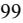

{99}------------------------------------------------

### **ITEM 9. CHANGES IN AND DISAGREEMENTS WITH ACCOUNTANTS ON ACCOUNTING AND FINANCIAL DISCLOSURE**

Not applicable.

### **ITEM 9A. CONTROLS AND PROCEDURES**

#### **Evaluation of Disclosure Controls and Procedures**

Under the supervision and with the participation of our management, including our Chief Executive Officer and Chief Financial Officer, we evaluated the effectiveness of our disclosure controls and procedures as of December 31, 2022. Based upon that evaluation, our Chief Executive Officer and Chief Financial Officer concluded that, as of December 31, 2022, our disclosure controls and procedures were (1) effective, in that they were designed to ensure that material information relating to us, and information required to be disclosed in our reports to the SEC, including our consolidated subsidiaries, is made known to our Chief Executive Officer and Chief Financial Officer by others within those entities, particularly during the period in which this report was being prepared, as appropriate, to allow timely discussions and decisions regarding required disclosure therein; and (2) effective, in that they provide reasonable assurance that information required to be disclosed by us in the reports that we file or submit under the Exchange Act is recorded, processed, summarized, and reported within the time periods specified in the SEC's rules and forms.

#### **Management's Report on Internal Control over Financial Reporting**

Our management, with the participation of our Chief Executive Officer and Chief Financial Officer, is responsible for establishing and maintaining adequate internal control over financial reporting. Internal control over financial reporting is defined in Rules 13a-15(f) or 15d-15(f) promulgated under the Exchange Act as a process designed by, or under the supervision of, our principal executive and principal financial officer and effected by the Company's Board of Directors, management and other personnel, to provide reasonable assurance regarding the reliability of financial reporting and the preparation of financial statements for external purposes in accordance with generally accepted accounting principles and includes those policies and procedures: (1) that pertain to the maintenance of records that in reasonable detail accurately and fairly reflect the transactions and dispositions of the assets of the Company; (2) provide reasonable assurance that transactions are recorded as necessary to permit preparation of financial statements in accordance with generally accepted accounting principles, and that receipts and expenditures of the Company are being made only in accordance with authorizations of management and directors of the Company; and (3) provide reasonable assurance regarding prevention or timely detection of unauthorized acquisition, use or disposition of the Company's assets that could have a material effect on the financial statements.

Because of its inherent limitations, however, internal control over financial reporting may not prevent or detect misstatements. Projections of any evaluation of effectiveness to future periods are subject to the risk that controls may become inadequate because of changes in conditions, or that the degree of compliance with the policies or procedures may deteriorate.

Our management assessed the effectiveness of the Company's internal control over financial reporting as of December 31, 2022. In making this assessment, our management used the criteria set forth by the Committee of Sponsoring Organizations of the Treadway Commission ("COSO") in Internal Control—Integrated Framework ("2013 Framework"). Based on this assessment, management, with the participation of our Chief Executive Officer and Chief Financial Officer, concluded that, as of December 31, 2022, our internal control over financial reporting was effective based on those criteria at the reasonable assurance level.

Deloitte & Touche LLP audited the effectiveness of the Company's internal control over financial reporting as of December 31, 2022, as stated in their report, which is included in this annual report on Form 10-K.

#### **Changes in Internal Control over Financial Reporting**

During the fourth quarter of 2022, we continued to monitor and evaluate the design and operating effectiveness of key controls. There were no changes in our internal control over financial reporting (as defined in Rules 13a-15(f) and 15d-15(f) of the Exchange Act) that materially affected or are reasonably likely to materially affect internal control over financial reporting.

#### **REPORT OF INDEPENDENT REGISTERED PUBLIC ACCOUNTING FIRM**

To the stockholders and the Board of Directors of NeoGenomics, Inc.

{100}------------------------------------------------

### **Opinion on Internal Control over Financial Reporting**

We have audited the internal control over financial reporting of NeoGenomics, Inc. and subsidiaries (the "Company") as of December 31, 2022, based on criteria established in *Internal Control — Integrated Framework (2013)* issued by the Committee of Sponsoring Organizations of the Treadway Commission (COSO). In our opinion, the Company maintained, in all material respects, effective internal control over financial reporting as of December 31, 2022, based on criteria established in *Internal Control — Integrated Framework (2013)* issued by COSO.

We have also audited, in accordance with the standards of the Public Company Accounting Oversight Board (United States) (PCAOB), the consolidated financial statements as of and for the year ended December 31, 2022, of the Company and our report dated February 24, 2023, expressed an unqualified opinion on those financial statements.

#### **Basis for Opinion**

The Company's management is responsible for maintaining effective internal control over financial reporting and for its assessment of the effectiveness of internal control over financial reporting, included in the accompanying Management's Report on Internal Control Over Financial Reporting. Our responsibility is to express an opinion on the Company's internal control over financial reporting based on our audit. We are a public accounting firm registered with the PCAOB and are required to be independent with respect to the Company in accordance with the U.S. federal securities laws and the applicable rules and regulations of the Securities and Exchange Commission and the PCAOB.

We conducted our audit in accordance with the standards of the PCAOB. Those standards require that we plan and perform the audit to obtain reasonable assurance about whether effective internal control over financial reporting was maintained in all material respects. Our audit included obtaining an understanding of internal control over financial reporting, assessing the risk that a material weakness exists, testing and evaluating the design and operating effectiveness of internal control based on the assessed risk, and performing such other procedures as we considered necessary in the circumstances. We believe that our audit provides a reasonable basis for our opinion.

#### **Definition and Limitations of Internal Control over Financial Reporting**

A company's internal control over financial reporting is a process designed to provide reasonable assurance regarding the reliability of financial reporting and the preparation of financial statements for external purposes in accordance with generally accepted accounting principles. A company's internal control over financial reporting includes those policies and procedures that (1) pertain to the maintenance of records that, in reasonable detail, accurately and fairly reflect the transactions and dispositions of the assets of the company; (2) provide reasonable assurance that transactions are recorded as necessary to permit preparation of financial statements in accordance with generally accepted accounting principles, and that receipts and expenditures of the company are being made only in accordance with authorizations of management and directors of the company; and (3) provide reasonable assurance regarding prevention or timely detection of unauthorized acquisition, use, or disposition of the company's assets that could have a material effect on the financial statements.

Because of its inherent limitations, internal control over financial reporting may not prevent or detect misstatements. Also, projections of any evaluation of effectiveness to future periods are subject to the risk that controls may become inadequate because of changes in conditions, or that the degree of compliance with the policies or procedures may deteriorate.

/s/ Deloitte & Touche LLP

San Diego, California February 24, 2023

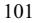

{101}------------------------------------------------

### **ITEM 9B. OTHER INFORMATION**

None.

#### **ITEM 9C. DISCLOSURE REGARDING FOREIGN JURISDICTIONS THAT PREVENT INSPECTIONS**

Not applicable.

### **PART III**

#### **ITEM 10. DIRECTORS, EXECUTIVE OFFICERS AND CORPORATE GOVERNANCE**

The information required by this Item 10 is incorporated herein by reference to our Definitive Proxy Statement relating to our 2023 Annual Meeting of Stockholders. We intend to file such Definitive Proxy Statement with the SEC pursuant to Regulation 14A within 120 days after the end of the fiscal year covered by this Annual Report on Form 10-K.

#### **ITEM 11. EXECUTIVE COMPENSATION**

The information required by this Item 11 will be included in the Definitive Proxy Statement referenced above in Item 10 and is incorporated herein by reference.

#### **ITEM 12. SECURITY OWNERSHIP OF CERTAIN BENEFICIAL OWNERS AND MANAGEMENT AND RELATED STOCKHOLDER MATTERS**

The information required by this Item 12 will be included in the Definitive Proxy Statement referenced above in Item 10 and is incorporated herein by reference.

#### **ITEM 13. CERTAIN RELATIONSHIPS AND RELATED TRANSACTIONS AND DIRECTOR INDEPENDENCE**

The information required by this Item 13 will be included in the Definitive Proxy Statement referenced above in Item 10 and is incorporated herein by reference.

#### **ITEM 14. PRINCIPAL ACCOUNTING FEES AND SERVICES**

The information required by this Item 14 will be included in the Definitive Proxy Statement referenced above in Item 10 and is incorporated herein by reference.

#### **PART IV**

#### **ITEM 15. EXHIBITS AND FINANCIAL STATEMENT SCHEDULES**

(a) The following documents are filed as part of this Annual Report on Form 10-K:

(i) Financial Statements (included in Item 8 of this Annual Report on Form 10-K):

The following Consolidated Financial Statements of the Company and the Report of Deloitte & Touche LLP, Independent Registered Public Accounting Firm, are included in Part II, Item 8 of this Annual Report on Form 10-K:

- 1. Report of Independent Registered Public Accounting Firm Deloitte & Touche LLP
- 2. Consolidated Balance Sheets as of December 31, 2022 and 2021
- 3. Consolidated Statements of Operations for the years ended December 31, 2022, 2021 and 2020
- 4. Consolidated Statements of Comprehensive (Loss) Income for the year ended December 31, 2022, 2021 and 2020
- 5. Consolidated Statements of Stockholders' Equity for the years ended December 31, 2022, 2021 and 2020
- 6. Consolidated Statements of Cash Flows for the years ended December 31, 2022, 2021 and 2020
- 7. Notes to Consolidated Financial Statements

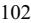

{102}------------------------------------------------

- (ii) Financial Statement Schedules.
All schedules are omitted because they are not applicable or the required information is shown in the Consolidated Financial Statements or the Notes thereto. (iii) Exhibits.

The exhibits required by Item 601 of Regulation S-K are listed in paragraph (b) below.

(b) Exhibits.

The following exhibits are filed herewith or are incorporated by reference to exhibits filed with the SEC:

#### **Exhibit Number Description of Exhibit Location**

| 3.1  | Articles of Incorporation, as amended                                                                                                                                                                                             | Incorporated by reference to the Company's Annual Report on Form 10-K for the year ended December 31, 2019 as filed with the SEC on February 28, 2020.                 |
|------|-----------------------------------------------------------------------------------------------------------------------------------------------------------------------------------------------------------------------------------|------------------------------------------------------------------------------------------------------------------------------------------------------------------------------|
| 3.2  | Amended and Restated Bylaws, as amended                                                                                                                                                                                           | Incorporated by reference to the Company's Quarterly Report on Form 10-Q for the quarterly period ended September 30, 2015, as filed with the SEC on November 6, 2015. |
| 4.1  | Description of our Common Stock                                                                                                                                                                                                   | Incorporated by reference to the Company's Annual Report on Form 10-K for the year ended December 31, 2019 as filed with the SEC on February 28, 2020.                 |
| 4.2  | Indenture, dated May 4, 2020, by and between the Company and U.S. Bank National Association, as Trustee                                                                                                                        | Incorporated by reference to the Company's Current Report on Form 8- K as filed with the SEC on May 4, 2020.                                                              |
| 4.3  | Form of 1.25% Senior Convertible Note Due 2025 (included in Exhibit 4.2)                                                                                                                                                          | Incorporated by reference to the Company's Current Report on Form 8- K as filed with the SEC on May 4, 2020.                                                              |
| 4.4  | Indenture, dated January 11, 2021, by and between the Company and U.S. Bank National Association, as Trustee (Incorporated by reference to the Company's Current Report on Form 8-K filed with the SEC on January 11, 2021) | Incorporated by reference to the Company's Quarterly Report on Form 10-Q for the quarterly period ended March 31, 2021, as filed with the SEC on May 6, 2021.          |
| 4.5  | Form of 0.25% Senior Convertible Notes Due 2028 (Incorporated by reference to the Company's Current Report on Form 8-K filed with the SEC on January 11, 2021)                                                              | Incorporated by reference to the Company's Quarterly Report on Form 10-Q for the quarterly period ended March 31, 2021, as filed with the SEC on May 6, 2021.          |
| 10.1 | Amended and Restated Registration Rights Agreement between NeoGenomics, Inc. and Aspen Select Healthcare, L.P. and individuals dated March 23, 2005                                                                            | Incorporated by reference to the Company's Current Report on Form 8- K as filed with the SEC on March 30, 2005.                                                           |
| 10.2 | Registration Rights Agreement between NeoGenomics, Inc. and Aspen Select Healthcare, L.P., dated March 30, 2006                                                                                                                | Incorporated by reference to the Company's Annual Report on Form 10- KSB for the year ended December 31, 2005, as filed with the SEC on April 3, 2006.                 |
| 10.3 | Amended and Restated Equity Incentive Plan effective as of October 15, 2015                                                                                                                                                       | Incorporated by reference to the Company's Annual Report on Form 10- K for the year ended December 31, 2015, as filed with the SEC on March 15, 2016.                  |
| 10.4 | Amendment No. 1 of the Amended and Restated Equity Incentive Plan, effective as of May 25, 2017                                                                                                                                | Incorporated by reference to the Company's Proxy Statement, dated April 24, 2017, as filed with the SEC on April 25, 2017.                                                |

{103}------------------------------------------------

| 10.5*  | Form of Indemnification Agreement between NeoGenomics, Inc. and each of its executive officers and directors                                                                                                                      | Incorporated by reference to the Company's Quarterly Report on Form 10-Q for the quarterly period ended September 30, 2016, as filed with the SEC on November 7, 2016. |
|--------|--------------------------------------------------------------------------------------------------------------------------------------------------------------------------------------------------------------------------------------|------------------------------------------------------------------------------------------------------------------------------------------------------------------------------|
| 10.6   | Securities Purchase Agreement, dated as of May 4, 2021, among NeoGenomics, Inc. and each purchaser party thereto. (Incorporated by reference to the Company's Current Report on Form 8-K as filed with the SEC on May 5, 2021) | Incorporated by reference to the Company's Quarterly Report on Form 10-Q for the quarterly period ended June 30, 2021, as filed with the SEC on August 9, 2021.        |
| 10.7   | Registration Rights Agreement, dated as of May 4, 2021, among NeoGenomics, Inc. and each party thereto. (Incorporated by reference to the Company's Current Report on Form 8-K as filed with the SEC on May 5, 2021)           | Incorporated by reference to the Company's Quarterly Report on Form 10-Q for the quarterly period ended June 30, 2021, as filed with the SEC on August 9, 2021.        |
| 10.8   | Share Purchase Agreement, dated May 4, 2021. (Incorporated by reference to the Company's Current Report on Form 8-K as filed with the SEC on May 5, 2021)                                                                      | Incorporated by reference to the Company's Quarterly Report on Form 10-Q for the quarterly period ended June 30, 2021, as filed with the SEC on August 9, 2021.        |
| 10.9*  | Form of Executive Employment Agreement between NeoGenomics, Inc. and each of its executive officers                                                                                                                               | Incorporated by reference to the Company's Annual Report on Form 10- K for the year ended December 31, 2021, as filed with the SEC on February 25, 2022.               |
| 10.10* | Separation Agreement, dated as of March 28, 2022, by and between NeoGenomics, Inc. and Mark Mallon                                                                                                                                | Incorporated by reference to the Company's Current Report on Form 8- K as filed with the SEC on March 28, 2022.                                                           |
| 10.11* | Executive Chair and Principal Executive Officer agreement between NeoGenomics, Inc. and Lynn A. Tetrault dated April 25, 2022                                                                                                     | Incorporated by reference to the Company's Quarterly Report on Form 10-Q for the quarterly period ended March 31, 2022, as filed with the SEC on May 9, 2022.          |
| 10.12* | Settlement Agreement, dated as of July 11, 2022, by and between Inivata Limited and Clive Morris                                                                                                                                  | Incorporated by reference to the Company's Current Report on Form 8- K/A as filed with the SEC on July 18, 2022.                                                          |
| 10.13* | Employment Agreement, executed July 20, 2022, by and between NeoGenomics, Inc. and Christopher Smith                                                                                                                              | Incorporated by reference to the Company's Current Report on Form 8- K as filed with the SEC on July 21, 2022.                                                            |
| 10.14* | Form of Stand-Alone Inducement Restricted Stock Agreement by and between NeoGenomics, Inc. and Christopher Smith                                                                                                                  | Incorporated by reference to the Company's Registration Statement on Form S-8 as filed with the SEC on August 12, 2022.                                                   |
| 10.15* | Form of Stand-Alone Inducement Stock Option Agreement by and between NeoGenomics, Inc. and Christopher Smith                                                                                                                      | Incorporated by reference to the Company's Registration Statement on Form S-8 as filed with the SEC on August 12, 2022.                                                   |
| 10.16* | Amendment to Employment Agreement, dated August 15, 2022, by and between NeoGenomics, Inc. and Christopher Smith                                                                                                                  | Incorporated by reference to the Company's Quarterly Report on Form 10-Q for the quarterly period ended September 30, 2022, as filed with the SEC on November 8, 2022. |
| 10.17* | Retention Agreement, dated October 15, 2022, by and between NeoGenomics, Inc. and Cynthia Dieter                                                                                                                                  | Incorporated by reference to the Company's Quarterly Report on Form 10-Q for the quarterly period ended September 30, 2022, as filed with the SEC on November 8, 2022. |
| 10.18* | Employment Agreement, dated November 2, 2022 by and between NeoGenomics, Inc. and Warren Stone                                                                                                                                    | Provided herewith.                                                                                                                                                           |
| 10.19* | Employment Agreement, dated November 14, 2022, by and between NeoGenomics, Inc. and Melody Harris                                                                                                                                 | Provided herewith.                                                                                                                                                           |

{104}------------------------------------------------

| 10.20*  | Form of Stand-Alone Inducement Restricted Stock Agreement by and between NeoGenomics, Inc. and Jeff Sherman                                                                              | Incorporated by reference to the Company's Registration Statement on Form S-8 as filed with the SEC on December 5, 2022. |
|---------|---------------------------------------------------------------------------------------------------------------------------------------------------------------------------------------------|-----------------------------------------------------------------------------------------------------------------------------|
| 10.21*  | Form of Stand-Alone Inducement Stock Option Agreement by and between NeoGenomics, Inc. and Jeff Sherman                                                                                  | Incorporated by reference to the Company's Registration Statement on Form S-8 as filed with the SEC on December 5, 2022. |
| 10.22*  | Employment Agreement of Jeffrey S. Sherman, dated December 5, 2022                                                                                                                          | Incorporated by reference to the Company's Current Report on Form 8- K as filed with the SEC on December 6, 2022.        |
| 10.23*  | Separation Agreement, dated as of December 20, 2022, by and between NeoGenomics, Inc. and William Bonello                                                                                | Provided herewith.                                                                                                          |
| 14.1    | NeoGenomics, Inc. Code of Ethics for Senior Financial Officers and the Principal Executive Officer                                                                                       | Incorporated by reference to the Company's Current Report on Form 8- K as filed with the SEC on July 20, 2011.           |
| 21.1    | Subsidiaries of NeoGenomics, Inc.                                                                                                                                                           | Provided herewith.                                                                                                          |
| 23.1    | Consent of Deloitte & Touche LLP                                                                                                                                                            | Provided herewith.                                                                                                          |
| 31.1    | Certification by Principal Executive Officer pursuant to Rule 13a-14(a)/ 15d 14(a), as adopted pursuant to Section 302 of the Sarbanes-Oxley Act of 2002                                 | Provided herewith.                                                                                                          |
| 31.2    | Certification by Principal Financial Officer pursuant to Rule 13a-14(a)/ 15d 14(a), as adopted pursuant to Section 302 of the Sarbanes-Oxley Act of 2002                                 | Provided herewith.                                                                                                          |
| 32.1**  | Certification by Principal Executive Officer and Principal Financial Officer pursuant to 18 U.S.C. Section 1350, as adopted pursuant to Section 906 of the Sarbanes-Oxley Act of 2002 | Provided herewith.                                                                                                          |
| 101.INS | XBRL Instance Document - the instance document does not appear in the Interactive Data File because its XBRL tags are embedded within the Inline XBRL document                        | Provided herewith.                                                                                                          |
| 101.SCH | XBRL Taxonomy Extension Schema Document                                                                                                                                                     | Provided herewith.                                                                                                          |
| 101.CAL | XBRL Taxonomy Extension Calculation Linkbase Document                                                                                                                                       | Provided herewith.                                                                                                          |
| 101.DEF | XBRL Taxonomy Extension Definition Linkbase Document                                                                                                                                        | Provided herewith.                                                                                                          |
| 101.LAB | XBRL Taxonomy Extension Label Linkbase Document                                                                                                                                             | Provided herewith.                                                                                                          |
| 101.PRE | XBRL Taxonomy Extension Presentation Linkbase Document                                                                                                                                      | Provided herewith.                                                                                                          |
| 104     | Cover Page Interactive Data File (formatted as Inline XBRL and contained in Exhibit 101)                                                                                                 | Provided herewith.                                                                                                          |
| *       | Denotes a management contract or compensatory plan or arrangement.                                                                                                                          |                                                                                                                             |

** The certification attached as Exhibit 32.1 that accompanies this Form 10-K is not deemed filed with the SEC and is not to be incorporated by reference into any filing of NeoGenomics, Inc. under the Securities Act or the Exchange Act, whether made before or after the date of this Form 10-K, irrespective of any general incorporation language contained in such filing.

#### **ITEM 16. FORM 10-K SUMMARY**

None.

{105}------------------------------------------------

### **SIGNATURES**

Pursuant to the requirements of Section 13 or 15(d) of the Securities Exchange Act of 1934, the registrant has duly caused this report to be signed on its behalf by the undersigned thereunto duly authorized.

**Date: February 24, 2023 NEOGENOMICS, INC.**

| By:    | /s/ Christopher M. Smith             |
|--------|--------------------------------------|
| Name:  | Christopher M. Smith                 |
| Title: | Director and Chief Executive Officer |

Pursuant to the requirements of the Securities Exchange Act of 1934, this report has been signed below by the following persons on behalf of the registrant and in the capacities and on the dates indicated.

| Signatures               | Title(s)                                                   | Date              |
|--------------------------|------------------------------------------------------------|-------------------|
| /s/ Christopher M. Smith | Director and Chief Executive Officer                       | February 24, 2023 |
| Christopher M. Smith     | (Principal Executive Officer)                              |                   |
| /s/ Jef rey S. Sherman   | Chief Financial Officer                                    | February 24, 2023 |
| Jeffrey S. Sherman       | (Principal Financial Officer)                              |                   |
| /s/ Cynthia J. Dieter    | Chief Accounting Officer (Principal Accounting Officer) | February 24, 2023 |
| Cynthia J. Dieter        |                                                            |                   |
| /s/ Lynn A. Tetrault     | Chair of the Board                                         | February 24, 2023 |
| Lynn A. Tetrault         |                                                            |                   |
| /s/ Bruce K. Crowther    | Director                                                   | February 24, 2023 |
| Bruce K. Crowther        |                                                            |                   |
| /s/ Dr. Alison L. Hannah | Director                                                   | February 24, 2023 |
| Dr. Alison L. Hannah     |                                                            |                   |
| /s/ Stephen M. Kanovsky  | Director                                                   | February 24, 2023 |
| Stephen M. Kanovsky      |                                                            |                   |
| /s/ Michael A. Kelly     | Director                                                   | February 24, 2023 |
| Michael A. Kelly         |                                                            |                   |
| /s/ David B. Perez       | Director                                                   | February 24, 2023 |
| David B. Perez           |                                                            |                   |
| /s/ Rachel A. Stahler    | Director                                                   | February 24, 2023 |
| Rachel A. Stahler        |                                                            |                   |

{106}------------------------------------------------

### EMPLOYMENT AGREEMENT

This EMPLOYMENT AGREEMENT (this "Agreement") is made and entered into as of November 2, 2022 by and between NeoGenomics, Inc. (the "Company") and Warren Stone (the "Executive").

WHEREAS, the Executive possesses certain experience and expertise that qualifies him or her to provide the direction and leadership required by the Company; and

WHEREAS, the Company desires to employ the Executive as Division President, Clinical Services of the Company and the Executive wishes to accept such employment;

NOW, THEREFORE, in consideration of the mutual covenants contained herein and intending to be legally bound hereby, the Company and the Executive agree as follows:

### 1. **Position and Duties.**

(a) Effective as of November 21, 2022 (the "Commencement Date"), the Executive will be employed by the Company and NeoGenomics Laboratories, Inc., its primary operating subsidiary, on a full-time basis, as its President, Clinical Services Division or such other position or positions as the Company may determine in the future. The Executive will report to and be subject to the general supervision and direction of the Company's Chief Executive Officer. In addition, the Executive may be asked from time to time to serve in similar capacities for one or more of the Company's Affiliates or as a director or officer of one or more of the Company's Affiliates, each without further compensation. For purposes of this Agreement, "Affiliates" means all persons and entities directly or indirectly controlling, controlled by or under common control with the Company, where control may be by management authority, equity interest or otherwise.

(b) The Executive agrees to perform the duties of his or her position and such other duties as may reasonably be assigned to the Executive from time to time. The Executive also agrees that, while employed by the Company, he or she will devote his or her full business time and his or her best efforts, business judgment, skill and knowledge exclusively to the advancement of the business interests of the Company and its Affiliates and to the discharge of his or her duties and responsibilities for them; provided, however, that the Executive may, without advance approval, participate in charitable activities and passive personal activities, provided that such activities do not, individually or in the aggregate, interfere with the performance of the Executive's duties under this Agreement, are not in conflict with the business interests of the Company or any of its Affiliates, and do not violate the terms of the Restrictive Covenant Agreement.

(c) The Executive agrees that, while employed by the Company, he or she will comply with all Company written policies, practices and procedures and all written codes of ethics or business conduct applicable to his or her position, as in effect from time to time.

{107}------------------------------------------------

(d) The Executive's principal place of employment shall initially be Bedford, Massachusetts and eventually in Fort Meyers, Florida. Notwithstanding the foregoing, the Executive acknowledges that the Executive's duties and responsibilities shall require the Executive to travel on business to fully perform the Executive's duties and responsibilities hereunder.

2. **Compensation and Benefits.** During the Executive's employment hereunder, as compensation for all services performed by the Executive for the Company and its Affiliates, the Company will provide the Executive the following compensation and benefits:

(a) Base Salary. The Company will pay the Executive a base salary at the rate of \$525,000 per year, payable in accordance with the regular payroll practices of the Company and subject to adjustment from time to time by the Board of Directors of the Company (the "Board") or the Culture and Compensation Committee thereof (the "Compensation Committee") in its discretion (as adjusted, from time to time, the "Base Salary").

(b) Bonus Compensation. For each fiscal year completed during the Executive's employment under this Agreement, the Executive will be eligible to earn an annual bonus. The Executive's target bonus will be 50% of the Base Salary (the "Target Bonus"), subject to adjustment from time to time by the Board or the Compensation Committee, with the actual amount of any such bonus to be determined by the Board or the Compensation Committee in its discretion, based on the Executive's performance and/or the Company's performance against goals established by the Board or the Compensation Committee. In order to receive any annual bonus hereunder, the Executive must be employed on the last day of the fiscal year to which the annual bonus relates, except that, if the Executive's employment is terminated by the Company for Cause following the end of the fiscal year to which such annual bonus relates and before such bonus is paid to the Executive, the Executive shall not be entitled to any payment hereunder. Any annual bonus, to the extent earned, shall be paid not later than March 15 of the year following the year to which such bonus relates. th

(c) Cash Sign-On Award. Within thirty (30) days following the Commencement Date, the Company shall pay the Executive a cash sign-on bonus of \$350,000 (the "Sign-On Bonus"). In the event the Company terminates the Executive's employment for Cause (as defined below) or the Executive resigns without Good Reason (as defined below), in each case, within the one-year period following the Commencement Date, the Executive shall, within thirty (30) days following the date of such termination of employment, repay to the Company the gross amount of the Sign-On Bonus.

(d) Sign On Equity Awards. Subject to approval by the Board or the Compensation Committee (which will not be unreasonably withheld), within sixty (60) days following Commencement Date, the Executive will receive an equity grant (the "Initial Grant") with an aggregate target value equal to approximately \$2,000,000, with approximately one-half of the inducement grant to be in the form of restricted stock and one-half in the form of stock options. The number of shares of restricted stock and shares underlying stock options granted in respect of the Initial Grant shall be determined according to the Company's customary practice for valuing equity grants and any shares of restricted stock or stock options granted in respect of

{108}------------------------------------------------

the sign-on equity grants shall vest ratably on an annual basis over a period of four years from the date of the grant, so long as the Executive remains employed by the Company through the applicable vesting date. The Initial Grant will be subject to the terms of the award agreements evidencing such grants and the plan (if any) under which they are granted. In the event of a conflict between the terms of this Agreement and the terms of such agreements or plan (if any), this Agreement shall control.

(e) Relocation Benefits. At such time as the Executive relocates to Southwest Florida, the Company shall pay the Executive a relocation bonus of \$250,000 (the "Relocation Bonus") within 30 days of the Executive providing documentation substantiating such relocation. In the event the Company terminates the Executive's employment for Cause or the Executive resigns without Good Reason, in each case, within the one-year period following the Commencement Date, the Executive shall, within thirty (30) days following the date of such termination of employment, repay to the Company the gross amount of the Relocation Bonus.

(f) Annual Equity Awards. Beginning in 2023, the Executive shall be eligible, on an annual basis and subject to approval by the Board or the Compensation Committee, for an additional equity-based award or awards in recognition of the prior year's performance with a target value of \$1,000,000 (each, an "Annual Grant"). The actual value of any Annual Grants (if any) shall be determined based on Company and Executive performance, as approved by the Board or the Compensation Committee, with the terms and conditions of any such Annual Grants also determined by the Board or the Compensation Committee.

(g) Participation in Employee Benefit Plans. The Executive will be entitled to participate in all employee benefit plans from time to time in effect for employees of the Company generally, except to the extent such plans are duplicative of benefits otherwise provided to the Executive under this Agreement (e.g., a severance pay plan). The Executive's participation will be subject to the terms of the applicable plan documents and generally applicable Company policies, as the same may be in effect from time to time, and any other restrictions or limitations imposed by law.

(h) Vacations. The Executive will be entitled to vacation and/or paid time-off in accordance with the policies of the Company, as in effect from time to time.

(i) Business Expenses. The Company will pay or reimburse the Executive for all reasonable business expenses incurred or paid by the Executive in the performance of his or her duties and responsibilities for the Company, including travel and lodging expenses for travel to Fort Myers while residing in Massachusetts, subject to any maximum annual limit and other restrictions on such expenses set by the Company from time to time and to such reasonable substantiation and documentation as may be specified by the Company from time to time. Further, the Company will provide the Executive with a mobile phone and home internet allowance in the aggregate amount of \$250 per month. The Executive's right to payment or reimbursement under this Agreement shall be subject to the following additional rules: (i) the amount of expenses eligible for payment or reimbursement during any calendar year shall not affect the expenses eligible for payment or reimbursement in any other calendar year, (ii) payment or reimbursement shall be made not later than December 31 of the calendar year

{109}------------------------------------------------

following the calendar year in which the expense or payment was incurred and (iii) the right to payment or reimbursement shall not be subject to liquidation or exchange for any other benefit.

3. **Confidentiality, Non-Solicitation and Non-Compete Agreement.** The Executive agrees to the terms of the Confidentiality, Non-Solicitation and Non-Compete Agreement (the "Restrictive Covenant Agreement") attached hereto as Addendum A and has signed the Restrictive Covenant Agreement. The Restrictive Covenant Agreement is hereby incorporated into and made a part of this Agreement. The Executive acknowledges and agrees that the provision of employment under this Agreement, the compensation provided under this Agreement and the execution by the Company of this Agreement constitute full, adequate and sufficient consideration to Executive for the Executive's duties, obligations and covenants under this Agreement and under the Restrictive Covenant Agreement.

4. **Termination of Employment.** The Executive's employment under this Agreement shall continue until terminated pursuant to this Section 4.

(a) By the Company For Cause. The Company may terminate the Executive's employment for Cause upon notice to the Executive setting forth in reasonable detail the nature of the Cause. For purposes of this Agreement, "Cause" shall mean the occurrence of any of the following, as determined by the Company in its reasonable judgment: (i) failure to materially perform and discharge the duties and responsibilities of the Executive under this Agreement after receiving written notice and allowing the Executive ten (10) business days to cure such failure, if so curable, provided, however, that after one such notice has been given to the Executive and the ten (10) business day cure period has lapsed, the Company is no longer required to provide time to cure subsequent failures under this provision; (ii) any breach by the Executive of a material provision of this Agreement or any provision of the Restrictive Covenant Agreement; (iii) misconduct which, in the good faith opinion and sole discretion of the Board, is injurious to the Company; (iv) commission or indictment of a felony involving the personal dishonesty or moral turpitude of Executive; or a determination by the Board, after consideration of all available information, that Executive has knowingly violated Company policies or procedures involving discrimination, harassment, or work place violence; (v) engagement in illegal drug use or alcohol abuse which prevents the Executive from performing his or her duties in any manner; (vi) any misappropriation, embezzlement or conversion of the Company's opportunities or property by the Executive; or (vii) willful misconduct, recklessness or gross negligence by the Executive in respect of the duties or obligations of the Executive under this Agreement and/or Restrictive Covenant Agreement. Any termination for Cause pursuant to this Section shall be given to the Executive in writing and shall set forth in detail all acts or omissions upon which the Company is relying to terminate the Executive for Cause.

(b) By the Company Without Cause. The Company may terminate the Executive's employment at any time other than for Cause upon written notice to the Executive.

(c) By the Executive for Good Reason. The Executive may terminate his or her employment for Good Reason, provided that (i) the Executive provides written notice to the Company, setting forth in reasonable detail the nature of the condition giving rise to Good Reason, within thirty (30) days of the initial existence of such condition, (ii) the condition

{110}------------------------------------------------

remains uncured by the Company for a period of thirty (30) days following such notice and (iii) the Executive terminates his or her employment, if at all, not later than thirty (30) days after the expiration of such cure period. For purposes of this Agreement, "Good Reason" shall mean the occurrence of any of the following without the Executive's written consent: (i) a material diminution in the Executive's Base Salary; (ii) a material diminution in the Executive's title, authority, duties, or responsibilities; (iii) a change of more than fifty (50) miles in the geographic location which Executive must perform services; or (iv) any breach by Company of a material provision of this Agreement.

(d) By the Executive Without Good Reason. The Executive may terminate his or her employment without Good Reason at any time upon sixty (60) days' notice to the Company. The Company may elect to waive such notice period or any portion thereof.

(e) Death and Disability. The Executive's employment hereunder shall automatically terminate in the event of the Executive's death during employment. The Company may terminate the Executive's employment, upon notice to the Executive, in the event that the Executive becomes disabled during his or her employment hereunder through any illness, injury, accident or condition of either a physical or psychological nature and, as a result, is unable to perform substantially all of his or her duties and responsibilities hereunder (notwithstanding the provision of any reasonable accommodation) for a period of ninety (90) days during any period of three hundred sixtyfive (365) consecutive days. If any question shall arise as to whether the Executive is disabled to the extent that he or she is unable to perform substantially all of his or her duties and responsibilities for the Company and its Affiliates, the Executive shall, at the Company's request, submit to a medical examination by a physician selected by the Company to whom the Executive or the Executive's guardian, if any, has no reasonable objection to determine whether the Executive is so disabled, and such determination shall for purposes of this Agreement be conclusive of the issue. If such a question arises and the Executive fails to submit to the requested medical examination, the Company's good faith, reasonable determination of the issue shall be binding on the Executive.

### 5. **Other Matters Related to Termination.**

(a) Final Compensation. In the event of termination of the Executive's employment with the Company, howsoever occurring (except as provided in subclause (iv) below), the Company shall pay the Executive (i) the Base Salary for the final payroll period of his or her employment, through the date his or her employment terminates; (ii) reimbursement, in accordance with Section 2(i) hereof, for business expenses incurred by the Executive but not yet paid to the Executive as of the date his or her employment terminates, provided that the Executive submits all expenses and supporting documentation required within sixty (60) days of the date his or her employment terminates, and provided further that such expenses are reimbursable under Company policies then in effect; and (iii) other than in the case of a termination by the Company for Cause, with respect to any termination that occurs after December 31 of a year and prior to the time that annual bonuses are paid to employees with respect to such year, the annual bonus at target, or higher if so awarded, earned for the fiscal year prior to the fiscal year in which such termination occurs, which shall be payable at the same time as annual bonuses are paid to active employees of the Company (all of the foregoing, "Final st

{111}------------------------------------------------

Compensation"). Except as otherwise provided in Section 5(a)(iii), Final Compensation will be paid to the Executive within thirty (30) days following the date of termination or such shorter period required by law.

(b) Severance Payments (Other than Terminations Occurring During the Change in Control Period). In the event of a termination of the Executive's employment pursuant to Section 4(b) or Section 4(c) above, other than any such termination occurring during the Change in Control Period (as defined below), the Company will pay and/or provide to the Executive, in addition to Final Compensation, the following severance payments and/or benefits,

(i) an amount equal to one (1) times the Base Salary (the "Base Severance"); (ii) an amount equal to one (1) times the Target Bonus (the "Bonus Severance"); (iii) provided that the Executive timely elects to continue his or her coverage and that of any eligible dependents in the Company's group health plans under the federal law known as "COBRA" or similar state law, a monthly amount equal to one hundred percent (100%) of monthly COBRA premiums, together with the two percent (2%) administration fee, until the earliest of (x) the date that is twelve (12) months following the date that the Executive's employment terminates, (y) the date that the Executive and the Executive's eligible dependents cease to be eligible for such COBRA coverage under applicable law or plan terms and (z) the date on which the Executive obtains health coverage from another employer (the "Health Continuation Benefits"); and (iv) with respect to any outstanding Company equity-based award the vesting of which is based solely on continued employment or service with the Company (each such award, a "Time-Based Equity Award"), accelerated vesting of the portion of each Time-Based Equity Award that would have vested by its terms in the twelve (12)-month period following the date the Executive's employment terminates had the Executive remained continuously employed.

(c) Severance Payments (Terminations Occurring During the Change in Control Period). In the event of a termination of the Executive's employment pursuant to Section 4(b) or 4(c) above occurring during the twenty-four (24)-month period that follows or the three (3)-month period that precedes a Change in Control (such period, the "Change in Control Period"), in lieu of the payments and benefits set forth in Section 5(b) above, the Company will pay and/or provide to the Executive, in addition to the Final Compensation, (i) an amount equal to two (2) times the Base Salary (the "Enhanced Base Severance"); (ii) an amount equal to the Bonus Severance; (iii) the Health Continuation Benefits; and (iv) the vesting of all outstanding unvested Time-Based Equity Awards will accelerate in full as of immediately prior to the date the Executive's employment terminates or, in the case of termination during the three (3)-month period that precedes a Change in Control, upon such Change in Control, and all outstanding options to purchase common stock of the Company will remain exercisable for one year following such termination (or, if earlier, the end of the term of such option award). In the event the Executive's employment terminates pursuant to Section 4(b) or 4(c) above during the three (3)-month period that precedes a Change in Control and Executive receives payments and/or benefits under Section 5(b) above (the "Pre-Change in Control Severance Benefits"), any payments and/or benefits owed to Executive under Section 5(c)(i) through 5(c)(iii) shall be reduced by the Pre-Change in Control Severance Benefits. In no event shall there be a duplication of payments and/or benefits under Section 5(b) and Section 5(c) of this Agreement. For purposes of this Agreement, "Change in Control" means the occurrence of any of the following events: (i) any "person" or "group" (as defined in Section 13(d) and 14(d) of the

{112}------------------------------------------------

Securities and Exchange Act of 1934, as amended (the "Exchange Act")) together with their affiliates become the ultimate "beneficial owner" (as defined in Rule 13d-3 of the Exchange Act) of voting stock of the Company representing more than fifty percent (50%) of the voting power of the total voting stock of the Company; (ii) the consummation of a merger or consolidation of the Company with any other corporation or entity regardless of which entity is the survivor, other than a merger or a consolidation which would result in the voting stock of the Company outstanding immediately prior thereto continuing to represent (either by remaining outstanding or being converted into voting securities of the surviving entity or the parent thereof) at least fifty percent (50%) of the combined voting power of the voting securities of the Company or such surviving entity or the parent thereof, outstanding immediately after such merger or consolidation; (iii) the stockholders of the Company approve a plan of complete liquidation or winding up of the Company or an agreement for the sale or disposition by the Company of all or substantially all of the Company's assets; or (iv) during any period of two (2) consecutive years, individuals who at the beginning of such period constitute the Board, and any new member of the Board (other than a member of the Board designated by a person who has entered into an agreement with the Company to effect a transaction described in subsections (i), (ii) or (iii) of this definition) whose election by the Company's shareholders was approved by a vote of at least two-thirds (2/3) of the members of the Board at the beginning of the period or whose election or nomination for election was previously so approved, cease for any reason to constitute at least a majority thereof. To the extent required to comply with Section 409A (as defined below), a "Change in Control" must also meet the requirements of a "change in control event", within the meaning of Treas. Reg. § 1.409A-3(i)(5).

(d) Conditions To And Timing Of Severance Payments . Any obligation of the Company to provide the Executive the payments and benefits set forth in Section 5(b) or 5(c) above is conditioned on his or her signing and returning, without revoking, to the Company a timely and effective separation agreement containing a general release of claims and other customary terms in the form provided to the Executive by the Company at the time that the Executive's employment terminates (the "Separation Agreement"). The Separation Agreement must become effective, if at all, by the sixtieth (60th) calendar day following the date the Executive's employment terminates. Any Base Severance or Enhanced Base Severance to which the Executive is entitled will be payable in the form of salary continuation over the twelve (12)- month period following the date that the Executive's employment terminates in accordance with the normal payroll practices of the Company. The first such payment will be made on the Company's next regular payday following the expiration of sixty (60) calendar days from the date that the Executive's employment terminates, but will be retroactive to the day following such date of termination. The Bonus Severance will be payable in a lump sum payment on the Company's next payday following the expiration of sixty (60) calendar days from the date that the Executive's employment terminates. The Health Continuation Payments shall be made on a monthly basis, commencing on the date following the expiration of sixty (60) calendar days from the date that the Executive's employment terminates, and any accelerated vesting of the Time- Based Equity Awards shall become effective as of the date that the Separation Agreement becomes effective in accordance with its terms.

(e) Benefits Termination. Except for any right the Executive may have under the federal law known as "COBRA" or other applicable law to continue participation in the

{113}------------------------------------------------

Company's group health and dental plans at his or her cost, the Executive's participation in all employee benefit plans shall terminate in accordance with the terms of the applicable benefit plans based on the date of termination of his or her employment, without regard to any continuation of the Base Salary or other payment to the Executive following termination of his or her employment, and, to the extent applicable, the Executive shall not be eligible to earn vacation or other paid time off following the termination of his or her employment.

(f) Survival. Provisions of this Agreement shall survive any termination of employment if so provided in this Agreement or if necessary or desirable to accomplish the purposes of other surviving provisions, including without limitation the Executive's obligations under the Restrictive Covenant Agreement. The obligation of the Company to make payments to the Executive under Section 5(b) or 5(c) above, and the Executive's right to retain the same, are expressly conditioned upon his or her continued full performance of his or her obligations under the Restrictive Covenant Agreement. Upon termination by either the Executive or the Company, all rights, duties and obligations of the Executive and the Company to each other shall cease, except as otherwise expressly provided in this Agreement or the Restrictive Covenant Agreement.

### 6. **Timing of Payments and Section 409A.**

(a) Notwithstanding anything to the contrary in this Agreement, if at the time the Executive's employment terminates, the Executive is a "specified employee," as defined below, any and all amounts payable under this Agreement on account of such separation from service that would (but for this provision) be payable within six (6) months following the date of termination, shall instead be paid on the next business day following the expiration of such six (6)-month period or, if earlier, upon the Executive's death; except (A) to the extent of amounts that do not constitute a deferral of compensation within the meaning of Treasury regulation Section 1.409A-1(b) (including without limitation by reason of the safe harbor set forth in Section 1.409A-1(b)(9)(iii), as determined by the Company in its reasonable good faith discretion); (B) benefits which qualify as excepted welfare benefits pursuant to Treasury regulation Section 1.409A-1(a)(5); or (C) other amounts or benefits that are not subject to the requirements of Section 409A of the Internal Revenue Code of 1986, as amended ("Section 409A").

(b) For purposes of this Agreement, all references to "termination of employment" and correlative phrases shall, to the extent required to comply with Section 409A, be construed to require a "separation from service" (as defined in Section 1.409A-1(h) of the Treasury regulations after giving effect to the presumptions contained therein), and the term "specified employee" means an individual determined by the Company to be a specified employee under Treasury regulation Section 1.409A-1(i).

(c) Each payment made under this Agreement shall be treated as a separate payment and the right to a series of installment payments under this Agreement is to be treated as a right to a series of separate payments.

{114}------------------------------------------------

(d) In no event shall the Company or any Affiliate have any liability relating to the failure or alleged failure of any payment or benefit under this Agreement to comply with, or be exempt from, the requirements of Section 409A.

7. **Representations of the Executive.** The Executive represents and warrants to the Company that (a) nothing in his or her past legal and/or work and/or personal experiences, which if became broadly known in the marketplace, would impair his or her ability to serve as the President, Clinical Services of a publicly-traded company or materially damage his or her credibility with public shareholders; (b) the Executive has not been convicted of any criminal offense related to health care, or been debarred, sanctioned, excluded or otherwise made ineligible for participation in a federal or state health care program by any federal or state agency; (c) there are no restrictions, agreements, or understandings whatsoever to which the Executive is a party which would prevent or make unlawful his or her execution of this Agreement or employment hereunder; (d) the Executive's execution of this Agreement and his or her employment hereunder shall not constitute a breach of any contract, agreement or understanding, oral or written, to which Executive is a party or by which Executive is bound; (e) the Executive is free and able to execute this Agreement and to continue employment with the Company; and (f) the Executive has not used and will not use confidential information or trade secrets belonging to any prior employers to perform services for the Company.

8. **Compliance Agreements.** The Executive agrees to provide services to the Company in compliance with all applicable federal and state laws and regulations, as well as all compliance guidance published by federal or state agencies, including, without limitation, the Medicare and Medicaid anti-kickback law, the Stark self-referral prohibition, and compliance guidance published by the Office of the Inspector General of the Department of Health and Human Service, and to assist the Company in remaining educated and in compliance with respect to such laws and regulations and compliance guidance. The Executive acknowledges that he or she understands these requirements, and shall remain educated and informed regarding the applicable federal and state laws and regulations, as well as all compliance guidance published by federal or state agencies. In the event that the Executive knows or suspects that any activities of the Company or any personnel or contractor of the Company, or any client of the Company implicates any such requirements or guidance, the Executive agrees that he or she will immediately inform the Company and cooperate fully with the Company to investigate and address any compliance issues arising as a result of such known or suspected activities. The Executive further understands and acknowledges that compliance with this paragraph shall be a condition of employment.

9. **Withholding.** All payments made by the Company under this Agreement shall be reduced by any tax or other amounts required to be withheld by the Company to the extent required by applicable law.

10. **Section 280G.** If any payment or benefit that the Executive may receive, whether or not payable or provided under this Agreement (a "Payment"), would (i) constitute a "parachute payment" within the meaning of Section 280G of the Internal Revenue Code of 1986, as amended (the "Code"), and (ii) but for this sentence, be subject to the excise tax imposed by Section 4999 of the Code (the "Excise Tax"), then such Payment shall be reduced to the Reduced

{115}------------------------------------------------

Amount. The "Reduced Amount" shall be either (A) the largest portion of the Payment that would result in no portion of the Payment being subject to the Excise Tax or (B) the largest portion, up to and including the total amount, of the Payment, whichever of the amounts determined under (A) and (B), after taking into account all applicable federal, state and local employment taxes, income taxes, and the Excise Tax (all computed at the highest applicable marginal rate), results in the Executive's receipt, on an after-tax basis, of the greater amount of the Payment notwithstanding that all or some portion of the Payment may be subject to the Excise Tax. If a reduction in payments or benefits constituting "parachute payments" is necessary so that the Payment equals the Reduced Amount, reduction shall occur in the following order: reduction of cash payments; reduction of employee benefits; and cancellation of accelerated vesting of outstanding equity awards. In the event that acceleration of vesting of outstanding equity awards is to be reduced, such acceleration of vesting shall be undertaken in the reverse order of the date of grant of the Executive's outstanding equity awards. All calculations and determinations made pursuant this Section 10 will be made by an independent accounting or consulting firm or independent tax counsel appointed by the Company (the "Tax Counsel") whose determinations shall be conclusive and binding on the Company and the Executive for all purposes. For purposes of making the calculations and determinations required by this Section 10, the Tax Counsel may rely on reasonable, good faith assumptions and approximations concerning the application of Section 280G of the Code and Section 4999 of the Code. The Company shall bear all costs the Tax Counsel may reasonably incur in connection with its services.

11. **Assignment.** Neither the Executive nor the Company may make any assignment of this Agreement or any interest in it, by operation of law or otherwise, without the prior written consent of the other; provided, however, the Company may assign its rights and obligations under this Agreement without the Executive's consent to one of its Affiliates or to any person with whom the Company shall hereafter effect a reorganization, consolidate or merge, or to whom the Company shall hereafter transfer all or substantially all of its properties or assets. This Agreement shall inure to the benefit of and be binding upon the Executive and the Company, and each of their respective successors, executors, administrators, heirs and permitted assigns.

12. **Severability.** If any portion or provision of this Agreement shall to any extent be declared illegal or unenforceable by a court of competent jurisdiction, then the remainder of this Agreement, or the application of such portion or provision in circumstances other than those as to which it is so declared illegal or unenforceable, shall not be affected thereby, and each portion and provision of this Agreement shall be valid and enforceable to the fullest extent permitted by law.

13. **Miscellaneous.** This Agreement sets forth the entire agreement between the Executive and the Company, and replaces all prior and contemporaneous communications, agreements and understandings, written or oral, with respect to the terms and conditions of the Executive's employment. In the event of a conflict between the terms of this Agreement and the terms of any equity award agreement as it relates to the treatment of equity awards held by the Executive on a termination of the Executive's employment, the terms of this Agreement shall control and shall supersede the terms of any such equity award agreement. This Agreement may not be modified or amended, and no breach shall be deemed to be waived, unless agreed to in

{116}------------------------------------------------

writing by the Executive and an expressly authorized representative of the Company. The headings and captions in this Agreement are for convenience only and in no way define or describe the scope or content of any provision of this Agreement. This Agreement may be executed in two or more counterparts, each of which shall be an original and all of which together shall constitute one and the same instrument. This is a State of Florida contract and shall be governed and construed in accordance with the laws of the State of Florida, without regard to any conflict of laws principles that would result in the application of the laws of any other jurisdiction. Executive consents to personal jurisdiction and venue of the Circuit Court in and for Lee County, Florida regarding any action arising under the terms of this Agreement and any and all other disputes between the Executive and the Company and its Affiliates.

14. **Arbitration.** Except as provided in the Restrictive Covenant Agreement, any and all controversies and disputes between Executive and the Company arising from this Agreement or regarding any matter whatsoever shall be submitted to arbitration before a single unbiased arbitrator skilled in arbitrating such disputes under the American Arbitration Association, utilizing its Employment Arbitration Rules and Mediation Procedures. Any arbitration action brought pursuant to this Section 14 shall be heard in Fort Myers, Lee County, Florida.

15. **Notices.** Any notices provided for in this Agreement shall be in writing and shall be effective when delivered in person or deposited in the United States mail, postage prepaid, and addressed to the Executive at his or her last known address on the books of the Company or, in the case of the Company, to it at its principal place of business, attention of the Chairman of the Board, or to such other address as either party may specify by notice to the other actually received.

{117}------------------------------------------------

IN WITNESS WHEREOF, this Agreement has been executed by the Company, by its duly authorized representative, and by the Executive, as of the date first above written.

### THE EXECUTIVE: THE COMPANY:

/s/ *Warren Stone* /s/ *Chris Smith*

Warren Stone Name: Chris Smith Title: Chief Executive Officer

{118}------------------------------------------------

### EMPLOYMENT AGREEMENT

This EMPLOYMENT AGREEMENT (this "Agreement") is made and entered into as of November 14, 2022 by and between NeoGenomics, Inc. (the "Company") and Melody Harris (the "Executive").

WHEREAS, the Executive possesses certain experience and expertise that qualifies him or her to provide the direction and leadership required by the Company; and

WHEREAS, the Company desires to employ the Executive as President, Enterprise Operations of the Company and the Executive wishes to accept such employment;

NOW, THEREFORE, in consideration of the mutual covenants contained herein and intending to be legally bound hereby, the Company and the Executive agree as follows:

### 1. **Position and Duties.**

(a) Effective as of December 5, 2022 (the "Commencement Date"), the Executive will be employed by the Company and NeoGenomics Laboratories, Inc., its primary operating subsidiary, on a full-time basis, as its President, Enterprise Operations. The Executive will report to and be subject to the general supervision and direction of the Company's Chief Executive Officer. In addition, the Executive and the Company may agree from time to time that the Executive serve in similar capacities for one or more of the Company's Affiliates or as a director or officer of one or more of the Company's Affiliates, each without further compensation. For purposes of this Agreement, "Affiliates" means all persons and entities directly or indirectly controlling, controlled by or under common control with the Company, where control may be by management authority, equity interest or otherwise.

(b) The Executive agrees to perform the duties of his or her position and such other duties as may reasonably be assigned to the Executive from time to time. The Executive also agrees that, while employed by the Company, he or she will devote his or her full business time and his or her best efforts, business judgment, skill and knowledge exclusively to the advancement of the business interests of the Company and its Affiliates and to the discharge of his or her duties and responsibilities for them; provided, however, that the Executive may, without advance approval, participate in charitable activities and passive personal activities, provided that such activities do not, individually or in the aggregate, interfere with the performance of the Executive's duties under this Agreement, are not in conflict with the business interests of the Company or any of its Affiliates, and do not violate the terms of the Restrictive Covenant Agreement.

(c) The Executive agrees that, while employed by the Company, he or she will comply with all Company written policies, practices and procedures and all written codes of ethics or business conduct applicable to his or her position, as in effect from time to time.

(d) The Executive's principal place of employment shall be Denver, Colorado. Notwithstanding the foregoing, the Executive acknowledges that the Executive's

{119}------------------------------------------------

duties and responsibilities shall require the Executive to travel on business to fully perform the Executive's duties and responsibilities hereunder.

2. **Compensation and Benefits.** During the Executive's employment hereunder, as compensation for all services performed by the Executive for the Company and its Affiliates, the Company will provide the Executive the following compensation and benefits:

(a) Base Salary. The Company will pay the Executive a base salary at the rate of \$525,000 per year, payable in accordance with the regular payroll practices of the Company and subject to possible raises from time to time by the Board of Directors of the Company (the "Board") or the Culture and Compensation Committee thereof (the "Compensation Committee") in its discretion (as adjusted, from time to time, the "Base Salary").

(b) Bonus Compensation. For each fiscal year completed during the Executive's employment under this Agreement, the Executive will be eligible to earn an annual bonus. The Executive's target bonus will be 50% of the Base Salary (the "Target Bonus"), subject to adjustment from time to time by the Board or the Compensation Committee, with the actual amount of any such bonus to be determined by the Board or the Compensation Committee in its discretion, based on the Executive's performance and/or the Company's performance against goals established by the Board or the Compensation Committee. In order to receive any annual bonus hereunder, the Executive must be employed on the last day of the fiscal year to which the annual bonus relates, except that, if the Executive's employment is terminated by the Company for Cause following the end of the fiscal year to which such annual bonus relates and before such bonus is paid to the Executive, the Executive shall not be entitled to any payment hereunder. Any annual bonus, to the extent earned, shall be paid not later than March 15 of the year following the year to which such bonus relates. th

(c) Sign On Equity Awards. Subject to approval by the Board or the Compensation Committee (which will not be unreasonably withheld), within sixty (60) days following Commencement Date, the Executive will receive an equity grant (the "Initial Grant") with an aggregate target value equal to approximately \$2,000,000, with approximately one-half of the inducement grant to be in the form of restricted stock and one-half in the form of stock options. The number of shares of restricted stock and shares underlying stock options granted in respect of the Initial Grant shall be determined according to the Company's customary practice for valuing equity grants and any shares of restricted stock or stock options granted shall vest ratably on an annual basis over a period of four years from the date of the grant, so long as the Executive remains employed by the Company through the applicable vesting date. The Initial Grant will be subject to the terms of the award agreements evidencing such grants and the plan (if any) under which they are granted. In the event of a conflict between the terms of this Agreement and the terms of such agreements or plan (if any), this Agreement shall control.

(d) Annual Equity Awards. Beginning in 2023, the Executive shall be eligible, on an annual basis and subject to approval by the Board or the Compensation Committee, for an additional equity-based award or awards in recognition of the prior year's performance with a target value of \$1,000,000 (each, an "Annual Grant"). The actual value of any Annual Grants (if any) shall be determined based on Company and Executive performance,

{120}------------------------------------------------

as approved by the Board or the Compensation Committee, with the terms and conditions of any such Annual Grants also determined by the Board or the Compensation Committee.

(e) Participation in Employee Benefit Plans. The Executive will be entitled to participate in all employee benefit plans from time to time in effect for employees of the Company generally, except to the extent such plans are duplicative of benefits otherwise provided to the Executive under this Agreement (e.g., a severance pay plan). The Executive's participation will be subject to the terms of the applicable plan documents and generally applicable Company policies, as the same may be in effect from time to time, and any other restrictions or limitations imposed by law.

(f) Vacations. The Executive will be entitled to vacation and/or paid time-off in accordance with the policies of the Company, as in effect from time to time.

(g) Business Expenses. The Company will pay or reimburse the Executive for all reasonable business expenses incurred or paid by the Executive in the performance of his or her duties and responsibilities for the Company, including travel and lodging expenses for travel to Fort Myers while residing in Colorado, subject to any maximum annual limit and other restrictions on such expenses set by the Company from time to time and to such reasonable substantiation and documentation as may be specified by the Company from time to time. Further, the Company will provide the Executive with a mobile phone and home internet allowance in the aggregate amount of \$250 per month. The Executive's right to payment or reimbursement under this Agreement shall be subject to the following additional rules: (i) the amount of expenses eligible for payment or reimbursement during any calendar year shall not affect the expenses eligible for payment or reimbursement in any other calendar year, (ii) payment or reimbursement shall be made not later than December 31 of the calendar year following the calendar year in which the expense or payment was incurred and (iii) the right to payment or reimbursement shall not be subject to liquidation or exchange for any other benefit.

3. **Confidentiality, Non-Solicitation and Non-Compete Agreement.** The Executive agrees to the terms of the Confidentiality, Non-Solicitation and Non-Compete Agreement (the "Restrictive Covenant Agreement") attached hereto as Addendum A and has signed the Restrictive Covenant Agreement. The Restrictive Covenant Agreement is hereby incorporated into and made a part of this Agreement. The Executive acknowledges and agrees that the provision of employment under this Agreement, the compensation provided under this Agreement and the execution by the Company of this Agreement constitute full, adequate and sufficient consideration to Executive for the Executive's duties, obligations and covenants under this Agreement and under the Restrictive Covenant Agreement.

4. **Termination of Employment.** The Executive's employment under this Agreement shall continue until terminated pursuant to this Section 4.

(a) By the Company For Cause. The Company may terminate the Executive's employment for Cause upon notice to the Executive setting forth in reasonable detail the nature of the Cause. For purposes of this Agreement, "Cause" shall mean the occurrence of any of the following, as determined by the Company in its reasonable judgment: (i) failure to materially and

{121}------------------------------------------------

substantially perform and discharge the duties and responsibilities of the Executive under this Agreement after receiving written notice and allowing the Executive thirty (30) business days to cure such failure, if so curable, provided, however, that after one such notice has been given to the Executive and the thirty (30) business day cure period has lapsed, the Company is no longer required to provide time to cure subsequent failures under this provision; (ii) any breach by the Executive of a material provision of this Agreement or any provision of the Restrictive Covenant Agreement; (iii) willful misconduct which, in the good faith opinion and sole discretion of the Board, is materially injurious to the Company; (iv) commission or indictment of a felony involving the personal dishonesty or moral turpitude of Executive; or a determination by the Board, after consideration of all available information, that Executive has knowingly violated Company policies or procedures involving discrimination, harassment, or work place violence;

(v) engagement in illegal drug use or repeated alcohol abuse which materially prevents the Executive from performing his or her duties; (vi) any misappropriation, embezzlement or conversion of the Company's opportunities or property by the Executive; or (vii) willful misconduct, recklessness or gross negligence by the Executive in respect of the duties or obligations of the Executive under this Agreement and/or Restrictive Covenant Agreement causing the Company harm. Any termination for Cause pursuant to this Section shall be given to the Executive in writing and shall set forth in detail all acts or omissions upon which the Company is relying to terminate the Executive for Cause.

(b) By the Company Without Cause. The Company may terminate the Executive's employment at any time other than for Cause upon written notice to the Executive.

(c) By the Executive for Good Reason. The Executive may terminate his or her employment for Good Reason, provided that (i) the Executive provides written notice to the Company, setting forth in reasonable detail the nature of the condition giving rise to Good Reason, within sixty (60) days of the initial existence of such condition, (ii) the condition remains uncured by the Company for a period of thirty (30) days following such notice and (iii) the Executive terminates his or her employment, if at all, not later than thirty (30) days after the expiration of such cure period. For purposes of this Agreement, "Good Reason" shall mean the occurrence of any of the following without the Executive's written consent: (i) a material diminution in the Executive's Base Salary; (ii) a material diminution in the Executive's title, authority, duties, or responsibilities; (iii) a change of more than fifty (50) miles in the geographic location which Executive must perform services; or (iv) any breach by Company of a material provision of this Agreement.

(d) By the Executive Without Good Reason. The Executive may terminate his or her employment without Good Reason at any time upon thirty (30) days' notice to the Company. The Company may elect to waive such notice period or any portion thereof.

(e) Death and Disability. The Executive's employment hereunder shall automatically terminate in the event of the Executive's death during employment. The Company may terminate the Executive's employment, upon notice to the Executive, in the event that the Executive becomes disabled during his or her employment hereunder through any illness, injury, accident or condition of either a physical or psychological nature and, as a result, is unable to perform substantially all of his or her duties and responsibilities hereunder (notwithstanding the

{122}------------------------------------------------

provision of any reasonable accommodation) for a period of ninety (90) days during any period of three hundred sixty-five (365) consecutive days. If any question shall arise as to whether the Executive is disabled to the extent that he or she is unable to perform substantially all of his or her duties and responsibilities for the Company and its Affiliates, the Executive shall, at the Company's request, submit to a medical examination by a physician selected by the Company to whom the Executive or the Executive's guardian, if any, has no reasonable objection to determine whether the Executive is so disabled, and such determination shall for purposes of this Agreement be conclusive of the issue. If such a question arises and the Executive fails to submit to the requested medical examination, the Company's good faith, reasonable determination of the issue shall be binding on the Executive.

### 5. **Other Matters Related to Termination.**

(a) Final Compensation. In the event of termination of the Executive's employment with the Company, howsoever occurring (except as provided in subclause (iv) below), the Company shall pay the Executive (i) the Base Salary for the final payroll period of his or her employment, through the date his or her employment terminates; (ii) reimbursement, in accordance with Section 2(i) hereof, for business expenses incurred by the Executive but not yet paid to the Executive as of the date his or her employment terminates, provided that the Executive submits all expenses and supporting documentation required within sixty (60) days of the date his or her employment terminates, and provided further that such expenses are reimbursable under Company policies then in effect; and (iii) other than in the case of a termination by the Company for Cause, with respect to any termination that occurs after December 31 of a year and prior to the time that annual bonuses are paid to employees with respect to such year, the annual bonus at target, or higher if so awarded, for the fiscal year prior to the fiscal year in which such termination occurs, which shall be payable at the same time as annual bonuses are paid to active employees of the Company (all of the foregoing, "Final Compensation"). Except as otherwise provided in Section 5(a)(iii), Final Compensation will be paid to the Executive within thirty (30) days following the date of termination or such shorter period required by law. st

(b) Severance Payments (Other than Terminations Occurring During the Change in Control Period). In the event of a termination of the Executive's employment pursuant to Section 4(b) or Section 4(c) above, other than any such termination occurring during the Change in Control Period (as defined below), the Company will pay and/or provide to the Executive, in addition to Final Compensation, the following severance payments and/or benefits,

(i) an amount equal to one (1) times the Base Salary (the "Base Severance"); (ii) an amount equal to one (1) times the Target Bonus (the "Bonus Severance"); (iii) provided that the Executive timely elects to continue his or her coverage and that of any eligible dependents in the Company's group health plans under the federal law known as "COBRA" or similar state law, a monthly amount equal to one hundred percent (100%) of monthly COBRA premiums, together with the two percent (2%) administration fee, until the earliest of (x) the date that is twelve (12) months following the date that the Executive's employment terminates, (y) the date that the Executive and the Executive's eligible dependents cease to be eligible for such COBRA coverage under applicable law or plan terms and (z) the date on which the Executive obtains health coverage from another employer (the "Health Continuation Benefits"); and (iv) with

{123}------------------------------------------------

respect to any outstanding Company equity-based award the vesting of which is based solely on continued employment or service with the Company (each such award, a "Time-Based Equity Award"), accelerated vesting of the portion of each Time-Based Equity Award that would have vested by its terms in the twelve (12)-month period following the date the Executive's employment terminates had the Executive remained continuously employed, and Executive shall have twelve months from his termination date to exercise the options.

(c) Severance Payments (Terminations Occurring During the Change in Control Period). In the event of a termination of the Executive's employment pursuant to Section 4(b) or 4(c) above occurring during the twenty-four (24)-month period that follows or the three (3)-month period that precedes a Change in Control (such period, the "Change in Control Period"), in lieu of the payments and benefits set forth in Section 5(b) above, the Company will pay and/or provide to the Executive, in addition to the Final Compensation, (i) an amount equal to two (2) times the Base Salary (the "Enhanced Base Severance"); (ii) an amount equal to the Bonus Severance; (iii) the Health Continuation Benefits; and (iv) the vesting of all outstanding unvested Time-Based Equity Awards will accelerate in full as of immediately prior to the date the Executive's employment terminates or, in the case of termination during the three (3)-month period that precedes a Change in Control, upon such Change in Control, and all outstanding options to purchase common stock of the Company will remain exercisable for one year following such termination (or, if earlier, the end of the term of such option award). In the event the Executive's employment terminates pursuant to Section 4(b) or 4(c) above during the three (3)-month period that precedes a Change in Control and Executive receives payments and/or benefits under Section 5(b) above (the "Pre-Change in Control Severance Benefits"), any payments and/or benefits owed to Executive under Section 5(c)(i) through 5(c)(iii) shall be reduced by the Pre-Change in Control Severance Benefits. In no event shall there be a duplication of payments and/or benefits under Section 5(b) and Section 5(c) of this Agreement. For purposes of this Agreement, "Change in Control" means the occurrence of any of the following events: (i) any "person" or "group" (as defined in Section 13(d) and 14(d) of the Securities and Exchange Act of 1934, as amended (the "Exchange Act")) together with their affiliates become the ultimate "beneficial owner" (as defined in Rule 13d-3 of the Exchange Act) of voting stock of the Company representing more than fifty percent (50%) of the voting power of the total voting stock of the Company; (ii) the consummation of a merger or consolidation of the Company with any other corporation or entity regardless of which entity is the survivor, other than a merger or a consolidation which would result in the voting stock of the Company outstanding immediately prior thereto continuing to represent (either by remaining outstanding or being converted into voting securities of the surviving entity or the parent thereof) at least fifty percent (50%) of the combined voting power of the voting securities of the Company or such surviving entity or the parent thereof, outstanding immediately after such merger or consolidation; (iii) the stockholders of the Company approve a plan of complete liquidation or winding up of the Company or an agreement for the sale or disposition by the Company of all or substantially all of the Company's assets; or (iv) during any period of two (2) consecutive years, individuals who at the beginning of such period constitute the Board, and any new member of the Board (other than a member of the Board designated by a person who has entered into an agreement with the Company to effect a transaction described in subsections (i), (ii) or (iii) of this definition) whose election by the Company's shareholders was approved by a vote of at least two-thirds (2/3) of the members of the Board at the beginning of the period or whose election or

{124}------------------------------------------------

nomination for election was previously so approved, cease for any reason to constitute at least a majority thereof. To the extent required to comply with Section 409A (as defined below), a "Change in Control" must also meet the requirements of a "change in control event", within the meaning of Treas. Reg. § 1.409A-3(i)(5).

(d) Conditions To And Timing Of Severance Payments . Any obligation of the Company to provide the Executive the payments and benefits set forth in Section 5(b) or 5(c) above is conditioned on his or her signing and returning, without revoking, to the Company a timely and effective separation agreement containing a general release of claims and other customary terms in the form provided to the Executive by the Company at the time that the Executive's employment terminates (the "Separation Agreement"). The Separation Agreement must become effective, if at all, by the sixtieth (60th) calendar day following the date the Executive's employment terminates. Any Base Severance or Enhanced Base Severance to which the Executive is entitled will be payable in the form of salary continuation over the twelve (12)- month period following the date that the Executive's employment terminates in accordance with the normal payroll practices of the Company. The first such payment will be made on the Company's next regular payday following the expiration of sixty (60) calendar days from the date that the Executive's employment terminates, but will be retroactive to the day following such date of termination. The Bonus Severance will be payable in a lump sum payment on the Company's next payday following the expiration of sixty (60) calendar days from the date that the Executive's employment terminates. The Health Continuation Payments shall be made on a monthly basis, commencing on the date following the expiration of sixty (60) calendar days from the date that the Executive's employment terminates, and any accelerated vesting of the Time- Based Equity Awards shall become effective as of the date that the Separation Agreement becomes effective in accordance with its terms.

(e) Benefits Termination. Except for any right the Executive may have under the federal law known as "COBRA" or other applicable law to continue participation in the Company's group health and dental plans at his or her cost, the Executive's participation in all employee benefit plans shall terminate in accordance with the terms of the applicable benefit plans based on the date of termination of his or her employment, without regard to any continuation of the Base Salary or other payment to the Executive following termination of his or her employment, and, to the extent applicable, the Executive shall not be eligible to earn vacation or other paid time off following the termination of his or her employment.

(f) Survival. Provisions of this Agreement shall survive any termination of employment if so provided in this Agreement or if necessary or desirable to accomplish the purposes of other surviving provisions, including without limitation the Executive's obligations under the Restrictive Covenant Agreement. The obligation of the Company to make payments to the Executive under Section 5(b) or 5(c) above, and the Executive's right to retain the same, are expressly conditioned upon his or her continued full performance of his or her obligations under the Restrictive Covenant Agreement. Upon termination by either the Executive or the Company, all rights, duties and obligations of the Executive and the Company to each other shall cease, except as otherwise expressly provided in this Agreement or the Restrictive Covenant Agreement.

{125}------------------------------------------------

### 6. **Timing of Payments and Section 409A.**

(a) Notwithstanding anything to the contrary in this Agreement, if at the time the Executive's employment terminates, the Executive is a "specified employee," as defined below, any and all amounts payable under this Agreement on account of such separation from service that would (but for this provision) be payable within six (6) months following the date of termination, shall instead be paid on the next business day following the expiration of such six (6)-month period or, if earlier, upon the Executive's death; except (A) to the extent of amounts that do not constitute a deferral of compensation within the meaning of Treasury regulation Section 1.409A-1(b) (including without limitation by reason of the safe harbor set forth in Section 1.409A-1(b)(9)(iii), as determined by the Company in its reasonable good faith discretion); (B) benefits which qualify as excepted welfare benefits pursuant to Treasury regulation Section 1.409A-1(a)(5); or (C) other amounts or benefits that are not subject to the requirements of Section 409A of the Internal Revenue Code of 1986, as amended ("Section 409A").

(b) For purposes of this Agreement, all references to "termination of employment" and correlative phrases shall, to the extent required to comply with Section 409A, be construed to require a "separation from service" (as defined in Section 1.409A-1(h) of the Treasury regulations after giving effect to the presumptions contained therein), and the term "specified employee" means an individual determined by the Company to be a specified employee under Treasury regulation Section 1.409A-1(i).

(c) Each payment made under this Agreement shall be treated as a separate payment and the right to a series of installment payments under this Agreement is to be treated as a right to a series of separate payments.

(d) In no event shall the Company or any Affiliate have any liability relating to the failure or alleged failure of any payment or benefit under this Agreement to comply with, or be exempt from, the requirements of Section 409A.

7. **Representations of the Executive.** The Executive represents and warrants to the Company that (a) nothing in his or her past legal and/or work and/or personal experiences, which if became broadly known in the marketplace, would impair his or her ability to serve as the President, Enterprise Operations of a publicly-traded company or materially damage his or her credibility with public shareholders; (b) the Executive has not been convicted of any criminal offense related to health care, or been debarred, sanctioned, excluded or otherwise made ineligible for participation in a federal or state health care program by any federal or state agency; (c) there are no restrictions, agreements, or understandings whatsoever to which the Executive is a party which would prevent or make unlawful his or her execution of this Agreement or employment hereunder; (d) the Executive's execution of this Agreement and his or her employment hereunder shall not constitute a breach of any contract, agreement or understanding, oral or written, to which Executive is a party or by which Executive is bound; (e) the Executive is free and able to execute this Agreement and to continue employment with the Company; and (f) the Executive has not used and will not use confidential information or trade secrets belonging to any prior employers to perform services for the Company.

{126}------------------------------------------------

8. **Compliance Agreements.** The Executive agrees to provide services to the Company in compliance with all applicable federal and state laws and regulations, as well as all compliance guidance published by federal or state agencies, including, without limitation, the Medicare and Medicaid anti-kickback law, the Stark self-referral prohibition, and compliance guidance published by the Office of the Inspector General of the Department of Health and Human Service, and to assist the Company in remaining educated and in compliance with respect to such laws and regulations and compliance guidance. The Executive acknowledges that he or she understands these requirements, and shall remain educated and informed regarding the applicable federal and state laws and regulations, as well as all compliance guidance published by federal or state agencies. In the event that the Executive knows or suspects that any activities of the Company or any personnel or contractor of the Company, or any client of the Company implicates any such requirements or guidance, the Executive agrees that he or she will immediately inform the Company and cooperate fully with the Company to investigate and address any compliance issues arising as a result of such known or suspected activities. The Executive further understands and acknowledges that compliance with this paragraph shall be a condition of employment.

9. **Withholding.** All payments made by the Company under this Agreement shall be reduced by any tax or other amounts required to be withheld by the Company to the extent required by applicable law.

10. **Section 280G.** If any payment or benefit that the Executive may receive, whether or not payable or provided under this Agreement (a "Payment"), would (i) constitute a "parachute payment" within the meaning of Section 280G of the Internal Revenue Code of 1986, as amended (the "Code"), and (ii) but for this sentence, be subject to the excise tax imposed by Section 4999 of the Code (the "Excise Tax"), then such Payment shall be reduced to the Reduced Amount. The "Reduced Amount" shall be either (A) the largest portion of the Payment that would result in no portion of the Payment being subject to the Excise Tax or (B) the largest portion, up to and including the total amount, of the Payment, whichever of the amounts determined under (A) and (B), after taking into account all applicable federal, state and local employment taxes, income taxes, and the Excise Tax (all computed at the highest applicable marginal rate), results in the Executive's receipt, on an after-tax basis, of the greater amount of the Payment notwithstanding that all or some portion of the Payment may be subject to the Excise Tax. If a reduction in payments or benefits constituting "parachute payments" is necessary so that the Payment equals the Reduced Amount, reduction shall occur in the following order: reduction of cash payments; reduction of employee benefits; and cancellation of accelerated vesting of outstanding equity awards. In the event that acceleration of vesting of outstanding equity awards is to be reduced, such acceleration of vesting shall be undertaken in the reverse order of the date of grant of the Executive's outstanding equity awards. All calculations and determinations made pursuant this Section 10 will be made by an independent accounting or consulting firm or independent tax counsel appointed by the Company (the "Tax Counsel") whose determinations shall be conclusive and binding on the Company and the Executive for all purposes. For purposes of making the calculations and determinations required by this Section 10, the Tax Counsel may rely on reasonable, good faith assumptions and approximations concerning the application of Section 280G of the Code and Section 4999 of the

{127}------------------------------------------------

Code. The Company shall bear all costs the Tax Counsel may reasonably incur in connection with its services.

11. **Assignment.** Neither the Executive nor the Company may make any assignment of this Agreement or any interest in it, by operation of law or otherwise, without the prior written consent of the other; provided, however, the Company may assign its rights and obligations under this Agreement without the Executive's consent to one of its Affiliates or to any person with whom the Company shall hereafter effect a reorganization, consolidate or merge, or to whom the Company shall hereafter transfer all or substantially all of its properties or assets. This Agreement shall inure to the benefit of and be binding upon the Executive and the Company, and each of their respective successors, executors, administrators, heirs and permitted assigns.

12. **Severability.** If any portion or provision of this Agreement shall to any extent be declared illegal or unenforceable by a court of competent jurisdiction, then the remainder of this Agreement, or the application of such portion or provision in circumstances other than those as to which it is so declared illegal or unenforceable, shall not be affected thereby, and each portion and provision of this Agreement shall be valid and enforceable to the fullest extent permitted by law.

13. **Miscellaneous.** This Agreement sets forth the entire agreement between the Executive and the Company, and replaces all prior and contemporaneous communications, agreements and understandings, written or oral, with respect to the terms and conditions of the Executive's employment. In the event of a conflict between the terms of this Agreement and the terms of any equity award agreement as it relates to the treatment of equity awards held by the Executive on a termination of the Executive's employment, the terms of this Agreement shall control and shall supersede the terms of any such equity award agreement. This Agreement may not be modified or amended, and no breach shall be deemed to be waived, unless agreed to in writing by the Executive and an expressly authorized representative of the Company. The headings and captions in this Agreement are for convenience only and in no way define or describe the scope or content of any provision of this Agreement. This Agreement may be executed in two or more counterparts, each of which shall be an original and all of which together shall constitute one and the same instrument. This is a State of Florida contract and shall be governed and construed in accordance with the laws of the State of Florida, without regard to any conflict of laws principles that would result in the application of the laws of any other jurisdiction. Executive consents to personal jurisdiction and venue of the Circuit Court in and for Lee County, Florida regarding any action arising under the terms of this Agreement and any and all other disputes between the Executive and the Company and its Affiliates.

14. **Arbitration.** Except as provided in the Restrictive Covenant Agreement, any and all controversies and disputes between Executive and the Company arising from this Agreement or regarding any matter whatsoever shall be submitted to arbitration before a single unbiased arbitrator skilled in arbitrating such disputes under the American Arbitration Association, utilizing its Employment Arbitration Rules and Mediation Procedures. Any arbitration action brought pursuant to this Section 14 shall be heard in Fort Myers, Lee County, Florida.

{128}------------------------------------------------

15. **Notices.** Any notices provided for in this Agreement shall be in writing and shall be effective when delivered in person or deposited in the United States mail, postage prepaid, and addressed to the Executive at his or her last known address on the books of the Company or, in the case of the Company, to it at its principal place of business, attention of the Chairman of the Board, or to such other address as either party may specify by notice to the other actually received.

{129}------------------------------------------------

IN WITNESS WHEREOF, this Agreement has been executed by the Company, by its duly authorized representative, and by the Executive, as of the date first above written.

THE EXECUTIVE: THE COMPANY:

/s/ *Melody Harris* /s/ *Chris Smith*

Melody Harris Name: Chris Smith Title: Chief Executive Officer

{130}------------------------------------------------

December 20, 2022

### William Bonello

Dear Bill:

As we have discussed, your employment with NeoGenomics, Inc. (the "Company") is coming to an end, effective as of December 31, 2022, (the "Separation Date"). The purpose of this letter agreement (this "Agreement") is to confirm the terms concerning your transition from employment. Capitalized terms not defined in this Agreement will have the respective meanings ascribed to them in the Employment Agreement by and between you and the Company, dated as of February 22, 2022 (the "Employment Agreement").

**1. Final Compensation.** You will receive, on or before the Company's next regular payday following the Separation Date, any base salary for the final payroll period of your employment with the Company, through the Separation Date. You will receive the payment described in this Section 1 regardless of whether or not you elect to sign this Agreement.

**2. Resignations.** Effective as of the Separation Date, you will cease being employed as the Chief Financial Officer of the Company and of NeoGenomics Laboratories, Inc. Effective as of the Separation Date, you also resign, and hereby will be deemed to have resigned, from any and all positions and offices that you hold with the Company or any of its affiliates ("Affiliates"), without any further action required therefor (collectively, the "Resignations"). The Company, on its own behalf and on behalf of its Affiliates, hereby accepts the Resignations as of the Separation Date. You agree to sign and return such documents confirming the Resignations as the Company or any of its Affiliates may reasonably require.

**3. Severance Benefits.** In consideration of your acceptance of this Agreement and subject to your meeting in full your obligations hereunder and the Continuing Obligations (as defined in Section 6(a) below), and in full consideration of any rights you may have under the Employment Agreement, but in all cases subject to this Agreement becoming effective in accordance with the terms hereof:

(a) The Company will pay you your base salary (which, as of the Separation Date, is \$455,000) for a period of twelve (12) months following the Separation Date (such base salary payments, the "Severance Payments" and such twelve (12)-month period, the "Severance Period"). The Severance Payments will be made in accordance with the Company's regular payroll practices, with the first payment (i) to be made on the Company's next regular payday following the expiration of sixty (60) calendar days from the Separation Date, and (ii) to be retroactive to the day following the Separation Date.

(b) The Company will pay you an amount equal to \$227,500, which represents one (1) times the Target Bonus (as defined in the Employment Agreement) (the "Bonus Severance"). The Bonus Severance will be payable in a lump sum payment on the Company's next regular payday following the expiration of sixty (60) calendar days from the

{131}------------------------------------------------

### Separation Date.

(c) Provided that you timely elect to continue your coverage and that of your eligible dependents in the Company's group health plans under the federal law known as "COBRA" or similar state law ("COBRA"), the Company will pay you a monthly amount equal to one hundred percent (100%) of monthly COBRA premiums, together with the two percent (2%) administration fee, until the earliest of (i) the end of the Severance Period, (ii) the date you and your eligible dependents cease to be eligible for such coverage under applicable law or plan terms, and (iii) the date that you obtain health coverage from another employer (the "Health Continuation Benefits"). The Health Continuation Benefits will be made on a monthly basis in accordance with the Company's regular payroll practices, with the first payment (i) to be made on the Company's next regular payday following the expiration of sixty (60) calendar days from the Separation Date, and (ii) to be retroactive to the day following the Separation Date.

(d) With respect to any outstanding Company equity-based awards the vesting of which is based solely on continued employment or service with the Company (each such award, a "Time-Based Equity Award"), other than the award of restricted stock granted to you pursuant to the Restricted Stock Award Agreement between the Company and you dated April 1, 2022 (the "Office of the CEO Award Agreement"), the portion of each Time-Based Equity Award that would have vested by its terms in the twelve (12)-month period following the Separation Date had you remained continuously employed will become vested as of the Separation Date, with the remaining portion of each Time-Based Equity Award automatically terminating on the Separation Date. With respect to the shares of restricted stock granted to you pursuant to the Office of the CEO Award Agreement, notwithstanding the terms of such agreement, 34,294 of the 82,305 shares of restricted stock granted to you pursuant to such agreement will become vested as of the Separation Date, with the remaining portion of the shares of restricted stock subject to the Office of the CEO Award Agreement automatically terminating on the Separation Date. The Time-Based Equity Awards shall otherwise be governed by the terms and conditions of the Company's Amended and Restated Equity Plan and the award agreements governing such awards (the "Equity Documents").

(e) With respect to the retention bonus payable under that certain letter agreement between the Company and you dated June 2, 2021 (the "Retention Bonus Letter"), the remaining portion of such retention bonus (in the amount of \$100,000) shall become vested as of the Separation Date and payable to you in accordance with the terms and conditions set forth in the Retention Bonus Letter.

(f) Notwithstanding anything to the contrary in the Restrictive Covenant Agreement (defined below), for purposes of the non-competition restriction set forth in Section 8(b) of the Restrictive Covenant Agreement, the Restricted Period (as defined therein) shall be limited to the one-year period following the Separation Date.

For the avoidance of doubt, in no event shall you be entitled to the payments and benefits under this Section 3 if this Agreement does not become effective in accordance with its terms.

**4. Acknowledgement of Full Payment and Withholding.** You acknowledge and agree that the payments provided under Sections 1 and 3 of this Agreement are in complete satisfaction of any and all compensation and benefits due to you from the Company or any of its

{132}------------------------------------------------

Affiliates, whether for services provided to the Company, under the Employment Agreement, or otherwise, through the Separation Date. You further acknowledge that no further compensation or benefits (including any equity or equity-based compensation) are owed or will be provided to you by the Company or any of its Affiliates. All payments made by the Company hereunder will be reduced by any tax or other amounts required to be withheld by the Company under applicable law and all other lawful deductions authorized by you.

### **5. Status of Employee Benefits, Expenses and Indemnification.**

(a) Except for any right you may have to continue your participation and that of your eligible dependents in the Company's group health plans under COBRA, your participation in all employee benefit plans of the Company is ending as of the Separation Date (or [•], 2022, if provided for in the applicable plan), in accordance with the terms of those plans. You will receive information about your COBRA continuation rights under separate cover.

(b) Within sixty (60) days following the Separation Date, you must submit your final expense reimbursement statement reflecting all business expenses you incurred through the Separation Date, if any, for which you seek reimbursement, and, in accordance with Company policy, reasonable substantiation and documentation for the same. The Company will reimburse you for any such authorized and documented expenses pursuant to its regular business practice.

(c) For the avoidance of doubt, the Indemnification Agreement between the Company and you (the "Indemnification Agreement") shall remain in full force and effect, including with respect to claims that may be brought after the Separation Date, subject to the terms and conditions of the Indemnification Agreement and applicable law.

### **6. Continuing Obligations, Cooperation, Confidentiality, Non-Disparagement.**

(a) You acknowledge that you will continue to be bound by the terms of, and your obligations under, the Confidentiality, Non-Solicitation and Non-Compete Agreement dated April 25, 2017 (such agreement, the "Restrictive Covenant Agreement" and the obligations set forth in such agreement, as amended hereby, collectively, the "Continuing Obligations"). The obligation of the Company to make payments to you or provide you with benefits under Section 3 of this Agreement, and your right to retain the same, is expressly conditioned upon your continued full performance of your obligations hereunder and of the Continuing Obligations.

(b) You agree to help facilitate a smooth transition of your duties and responsibilities to any Company designees, including without limitation by (i) directing representatives of the Company and its Affiliates to files and information as requested, (ii) returning all property of the Company and its Affiliates and providing passwords to systems and protected information in accordance with Section 6 of this Agreement and (iii) being reasonably available during the Severance Period to respond to questions and requests for information from representatives of the Company and its Affiliates as well as to provide transition services, as reasonably requested by the Company, from time to time.

(c) Subject to the second sentence of Section 8(b) of this Agreement, you agree that you will not disparage the Company or any of its Affiliates, or any of their respective management, products or services and will not do or say anything that could reasonably be

{133}------------------------------------------------

expected to disrupt the good morale of the employees of the Company or otherwise harm the business interests or reputation of the Company.

(d) The Company agrees to instruct its executive officers and members of the Board (as defined in the Employment Agreement) to refrain from disparaging you or doing or saying anything that could reasonably be expected to harm your reputation.

(e) Nothing in this Section shall preclude you or the Company from making truthful statements that are reasonably necessary to (i) comply with applicable law, regulation or legal process or (ii) defend or enforce your or its, as applicable, rights under this Agreement.

**7. Return of Company Documents and Other Property.** In signing this Agreement, you represent and warrant that you have returned to the Company any and all documents, materials and information (whether in hardcopy, on electronic media or otherwise) related to the business of the Company and its Affiliates (whether present or otherwise), and all keys, access cards, credit cards, computer hardware and software, telephones and telephone- related equipment and all other property of the Company or any of its Affiliates in your possession or control. Further, you represent and warrant that you have not retained any copy or derivation of any documents, materials or information (whether in hardcopy, on electronic media or otherwise) of the Company or any of its Affiliates. Recognizing that your employment with the Company has ended on the Separation Date, you acknowledge that you have not, following the Separation Date, for any purpose, attempted to access or use any computer or computer network or system of the Company or any of its Affiliates, including without limitation the electronic mail system, and you agree that you will not do so. Further, you acknowledge that you have disclosed to the Company all passwords necessary or desirable to obtain access to, or that would assist in obtaining access to, all information which you have passwordprotected on any computer equipment, network or system of the Company or any of its Affiliates.

## **8. General Release and Waiver of Claims.**

(a) In exchange for the severance benefits provided to you under this Agreement, to which you would not otherwise be entitled, on your own behalf and that of your heirs, executors, administrators, beneficiaries, personal representatives and assigns, you agree that this Agreement shall be in complete and final settlement of any and all causes of action, rights and claims, whether known or unknown, accrued or unaccrued, contingent or otherwise, that you have had in the past, now have, or might now have, against the Company or any of its Affiliates of any nature whatsoever, including but not limited to those in any way related to, connected with or arising out of your employment, its termination, or your other associations with the Company or any of its Affiliates, or pursuant Title VII of the Civil Rights Act, the Americans with Disabilities Act, the Age Discrimination in Employment Act, as amended by the Older Workers Benefit Protection Act, the Employee Retirement Income Security Act, to the wage and hour, wage payment and fair employment practices laws and statutes of the state or states in which you have provided services to the Company or any of its Affiliates (each as amended from time to time), and/or any other federal, state or local law, regulation or other requirement (collectively, the "Claims"), and you hereby release and forever discharge the Company, its Affiliates and all of their respective past, present and future directors, shareholders, officers, members, managers, general and limited partners, employees, employee benefit plans,

{134}------------------------------------------------

administrators, trustees, agents, representatives, predecessors, successors and assigns, and all others connected with any of them, both individually and in their official capacities, from, and you hereby waive, any and all such Claims. Notwithstanding the foregoing, "Claims" does not include any claims (i) for unemployment benefits or (ii) that cannot be released as a matter of law.

(b) Nothing in this Agreement shall be construed to prohibit you from filing a charge with or participating in any investigation or proceeding conducted by the federal Equal Employment Opportunity Commission or a comparable state or local agency; provided, however, that you hereby agree to waive your right to recover monetary damages or other personal relief in any such charge, investigation or proceeding, or in any related complaint or lawsuit, filed by you or by anyone else on your behalf. Nothing in this Agreement limits, restricts or in any other way affects your communicating with any governmental agency or entity, or communicating with any official or staff person of a governmental agency or entity, concerning matters relevant to such governmental agency or entity.

(c) Notwithstanding the generality of the foregoing, you do not release the following causes of actions, rights and claims: (i) a claim for enforcement of this Agreement; (ii) claims for unemployment compensation or workers' compensation benefits pursuant to the terms of applicable law or policy; (iii) your rights pursuant to the terms and conditions of COBRA; or (iv) your rights and claims for indemnification and/or defense pursuant to the terms of the Company's organizing and corporate documents, liability insurance policies, or applicable law.

(d) This Agreement, including the general release and waiver of claims set forth in this Section 8, creates legally binding obligations and the Company and its Affiliates therefore advise you to consult an attorney before signing this Agreement. In signing this Agreement, you give the Company and its Affiliates assurance that you have signed it voluntarily and with a full understanding of its terms; that you have had sufficient opportunity of not less than twenty-one (21) days, before signing it, to consider its terms and to consult with an attorney, if you wished to do so; and that you have not relied on any promises or representations, express or implied, that are not set forth expressly in this Agreement.

### **9. Miscellaneous.**

(a) This Agreement constitutes the entire agreement between you and the Company or any of its Affiliates, and supersedes all prior and contemporaneous communications, agreements and understandings, whether written or oral, with respect to your employment, its termination and all related matters, including without limitation the Employment Agreement, and excluding only the Equity Documents (as modified herein), the Restrictive Covenant Agreement, the Continuing Obligations, and the Indemnification Agreement, which shall remain in full force and effect in accordance with their terms.

(b) This Agreement may not be modified or amended unless agreed to in writing by you and an expressly authorized representative of the Company. No breach of this

{135}------------------------------------------------

Agreement shall be deemed to be waived unless agreed to in writing by the non-breaching party. The captions and headings in this Agreement are for convenience only, and in no way define or describe the scope or content of any provision of this Agreement.

(c) Your right to payment or reimbursement under this Agreement shall be subject to the following rules: (i) the amount of expenses eligible for payment or reimbursement during any calendar year shall not affect the expenses eligible for payment or reimbursement in any other calendar year, (ii) payment or reimbursement shall be made not later than December 31 of the calendar year following the calendar year in which the expense or payment was incurred and (iii) the right to payment or reimbursement shall not be subject to liquidation or exchange for any other benefit. Each payment made under this Agreement shall be treated as a separate payment and the right to a series of installment payments under this Agreement is to be treated as a right to a series of separate payments. Notwithstanding anything to the contrary in this Agreement, if at the time your employment terminates, you are a "specified employee," as defined below, any and all amounts payable under this Agreement on account of such separation from service that would (but for this provision) be payable within six (6) months following the date of termination, shall instead be paid on the next business day following the expiration of such six (6)-month period or, if earlier, upon your death; except (A) to the extent of amounts that do not constitute a deferral of compensation within the meaning of Treasury regulation Section 1.409A-1(b) (including without limitation by reason of the safe harbor set forth in Section 1.409A-1(b)(9)(iii), as determined by the Company in its reasonable good faith discretion); (B) benefits which qualify as excepted welfare benefits pursuant to Treasury regulation Section 1.409A-1(a)(5); or (C) other amounts or benefits that are not subject to the requirements of Section 409A of the Internal Revenue Code of 1986, as amended ("Section 409A"). In no event shall the Company or any Affiliate have any liability relating to the failure or alleged failure of any payment or benefit under this Agreement to comply with, or be exempt from, the requirements of Section 409A.

(d) This is a State of Florida contract and shall be governed and construed in accordance with the laws of the State of Florida, without regard to any conflict of laws principles that would result in the application of the laws of any other jurisdiction. You consent to personal jurisdiction and venue of the Circuit Court in and for Lee County, Florida regarding any action arising under the terms of this Agreement and any and all other disputes between you and the Company and its Affiliates. Except as provided in the Restrictive Covenant Agreement, any and all controversies and disputes between you and the Company arising from this Agreement or regarding any matter whatsoever shall be submitted to arbitration before a single unbiased arbitrator skilled in arbitrating such disputes under the American Arbitration Association, utilizing its Employment Arbitration Rules and Mediation Procedures. Any arbitration action brought pursuant to this 9(d) shall be heard in Fort Myers, Lee County, Florida.

(e) This Agreement may be executed in any number of counterparts, any of which may be executed and transmitted by facsimile (including "pdf"), and each of which shall be deemed to be an original, but all of which together shall be deemed to be one and the same instrument.

[*Signature page immediately follows.*]

{136}------------------------------------------------

If the terms of this Agreement are acceptable to you, please sign, date and return it to me within twenty-one (21) days of the date you receive it, and in no event prior to the Separation Date. You may revoke this Agreement at any time during the seven (7)-day period immediately following the date of your signing by notifying me in writing of your revocation within that period. If you do not revoke this Agreement, then, on the eighth (8 ) day following the date that you signed it, this Agreement shall take effect as a legally binding agreement between you and the Company on the basis set forth above. th

Sincerely,

NEOGENOMICS, INC.

By: /s/ *Chris Smith* Name: Chris Smith Title: Chief Executive Officer

Accepted and agreed:

Signature: /s/ *Bill Bonello* William Bonello Date: December 21, 2022

{137}------------------------------------------------

#### **S U B S I D I A R I E S O F N E O G E N O M IC S ,I N C.**

Clarient Diagnostic Services, Inc., a Delaware corporation Clarient, Inc., a Delaware corporation Cynogen, Inc., a Delaware corporation Genesis Acquisition Holdings Corp., a Delaware corporation Genoptix, Inc., a Delaware corporation Inivata Limited, UK Limited Company Inivata, Inc., Delaware Corporation Minuet Diagnostics, Inc., a Delaware corporation NeoGenomics Bioinformatics, Inc., a Florida corporation NeoGenomics Europe, SA, a Swiss société anonyme NeoGenomics Foundation, Inc., a Florida Corporation NeoGenomics Laboratories, Inc., a Florida corporation NeoGenomics Singapore, Pte. Ltd., a Singapore private limited company Suzhou NeoGenomics Pharmaceutical Research Co., Limited, a Suzhou, China corporation Trapelo Health, LLC, a Delaware Limited Liability Company

{138}------------------------------------------------

### **CONSENT OF INDEPENDENT REGISTERED PUBLIC ACCOUNTING FIRM**

We consent to the incorporation by reference in Registration Statement Nos. 333-228743, 333-237912, 333-251901, 333-259246 on Form S-3 and Registration Statement Nos. 333-125994, 333-139484, 333-159749, 333-173494, 333-180095, 333-189391, 333-205906, 333-210402, 333-256704,333-265428, 333-266845, and 333-268676 on Form S-8 of our reports dated February 24, 2023, relating to the consolidated financial statements of NeoGenomics, Inc. and subsidiaries and the effectiveness of NeoGenomics, Inc. and subsidiaries' internal control over financial reporting appearing in this Annual Report on Form 10-K for the year ended December 31, 2022.

/s/ Deloitte & Touche LLP

San Diego, California February 24, 2023

{139}------------------------------------------------

#### **CERTIFICATIONS**

I, Christopher M. Smith, certify that:

1. I have reviewed this Annual Report on Form 10-K of NeoGenomics, Inc.;

2. Based on my knowledge, this report does not contain any untrue statement of a material fact or omit to state a material fact necessary to make the statements made, in light of the circumstances under which such statements were made, not misleading with respect to the period covered by this report;

3. Based on my knowledge, the financial statements, and other financial information included in this report, fairly present in all material respects the financial condition, results of operations and cash flows of the registrant as of, and for, the periods presented in this report;

4. The registrant's other certifying officer(s) and I are responsible for establishing and maintaining disclosure controls and procedures (as defined in Exchange Act Rules 13a-15(e) and 15d-15(e)), and internal control over financial reporting (as defined in Exchange Act Rules 13a-15(f) and 15d-15(f)) for the registrant and have:

(a) Designed such disclosure controls and procedures, or caused such disclosure controls and procedures to be designed under our supervision, to ensure that material information relating to the registrant, including its consolidated subsidiaries, is made known to us by others within those entities, particularly during the period in which this report is being prepared;

(b) Designed such internal control over financial reporting, or caused such internal control over financial reporting to be designed under our supervision, to provide reasonable assurance regarding the reliability of financial reporting and the preparation of financial statements for external purposes in accordance with generally accepted accounting principles;

(c) Evaluated the effectiveness of the registrant's disclosure controls and procedures and presented in this report our conclusions about the effectiveness of the disclosure controls and procedures, as of the end of the period covered by this report based on such evaluation; and

(d) Disclosed in this report any change in the registrant's internal control over financial reporting that occurred during the registrant's most recent fiscal quarter (the registrant's fourth fiscal quarter in the case of an annual report) that has materially affected, or is reasonably likely to materially affect, the registrant's internal control over financial reporting; and

5. The registrant's other certifying officer(s) and I have disclosed, based on our most recent evaluation of internal control over financial reporting, to the registrant's auditors and the audit committee of the registrant's board of directors (or persons performing the equivalent functions):

(a) All significant deficiencies and material weaknesses in the design or operation of internal control over financial reporting which are reasonably likely to adversely affect the registrant's ability to record, process, summarize and report financial information; and

(b) Any fraud, whether or not material, that involves management or other employees who have a significant role in the registrant's internal control over financial reporting.

February 24, 2023 */s/ Christopher M. Smith*

Christopher M. Smith Director and Chief Executive Officer

{140}------------------------------------------------

#### **CERTIFICATIONS**

I, Jeffrey S. Sherman, certify that:

1. I have reviewed this Annual Report on Form 10-K of NeoGenomics, Inc.;

2. Based on my knowledge, this report does not contain any untrue statement of a material fact or omit to state a material fact necessary to make the statements made, in light of the circumstances under which such statements were made, not misleading with respect to the period covered by this report;

3. Based on my knowledge, the financial statements, and other financial information included in this report, fairly present in all material respects the financial condition, results of operations and cash flows of the registrant as of, and for, the periods presented in this report;

4. The registrant's other certifying officer(s) and I are responsible for establishing and maintaining disclosure controls and procedures (as defined in Exchange Act Rules 13a-15(e) and 15d-15(e)), and internal control over financial reporting (as defined in Exchange Act Rules 13a-15(f) and 15d-15(f)) for the registrant and have:

(a) Designed such disclosure controls and procedures, or caused such disclosure controls and procedures to be designed under our supervision, to ensure that material information relating to the registrant, including its consolidated subsidiaries, is made known to us by others within those entities, particularly during the period in which this report is being prepared;

(b) Designed such internal control over financial reporting, or caused such internal control over financial reporting to be designed under our supervision, to provide reasonable assurance regarding the reliability of financial reporting and the preparation of financial statements for external purposes in accordance with generally accepted accounting principles;

(c) Evaluated the effectiveness of the registrant's disclosure controls and procedures and presented in this report our conclusions about the effectiveness of the disclosure controls and procedures, as of the end of the period covered by this report based on such evaluation; and

(d) Disclosed in this report any change in the registrant's internal control over financial reporting that occurred during the registrant's most recent fiscal quarter (the registrant's fourth fiscal quarter in the case of an annual report) that has materially affected, or is reasonably likely to materially affect, the registrant's internal control over financial reporting; and

5. The registrant's other certifying officer(s) and I have disclosed, based on our most recent evaluation of internal control over financial reporting, to the registrant's auditors and the audit committee of the registrant's board of directors (or persons performing the equivalent functions):

(a) All significant deficiencies and material weaknesses in the design or operation of internal control over financial reporting which are reasonably likely to adversely affect the registrant's ability to record, process, summarize and report financial information; and

(b) Any fraud, whether or not material, that involves management or other employees who have a significant role in the registrant's internal control over financial reporting.

February 24, 2023 */s/ Jef rey S. Sherman*

Jeffrey S. Sherman Chief Financial Officer

{141}------------------------------------------------

### **CERTIFICATION PURSUANT TO 18 U.S.C. SECTION 1350 AS ADOPTED PURSUANT TO SECTION 906 OF THE SARBANES-OXLEY ACT OF 2002**

In connection with the Annual Report of NeoGenomics, Inc. (the "Company") on Form 10-K for the fiscal year ended December 31, 2022, as filed with the Securities and Exchange Commission on the date hereof (the "Report"), each of the undersigned, in the capacities and on the dates indicated below, hereby certify pursuant to 18 U.S.C. Section 1350, as adopted pursuant to Section 906 of the Sarbanes-Oxley Act of 2002, that to his knowledge:

1. The Report fully complies with the requirements of Section 13(a) or 15(d) of the Securities Exchange Act of 1934; and

2. The information contained in the Report fairly presents, in all material respects, the financial condition and results of operations of the Company.

Date: February 24, 2023 /s/ Christopher M. Smith

Christopher M. Smith

Director and Chief Executive Officer

Date: February 24, 2023 /s/ Jeffrey S. Sherman

Jeffrey S. Sherman Chief Financial Officer

The foregoing certification is being furnished solely to accompany the Report pursuant to 18 U.S.C. § 1350, and is not being filed for purposes of Section 18 of the Securities Exchange Act of 1934, as amended, and is not to be incorporated by reference into any filing of the Company, whether made before or after the date hereof, regardless of any general incorporation language in such filing. A signed original of this written statement required by Section 906, or other document authenticating, acknowledging, or otherwise adopting the signature that appears in typed form within the electronic version of this written statement required by Section 906, has been provided to the Company and will be retained by the Company and furnished to the Securities and Exchange Commission or its staff upon request.